Full Length Article

# Film thickness decay in grease lubricated wide elliptical contacts

Min Gao a , Marco T. van Zoelen b , Jude A. Osara a ,∗, Ralph Meeuwenoord b, Rihard Pasaribu c, Piet M. Lugt a,b

a Engineering Technology, University of Twente, Enschede, Netherlands

b SKF Research and Technology Development, Houten, Netherlands

c Shell Downstream Services International B.V., Rotterdam, Netherlands

## A R T I C L E I N F O

Keywords:   
Central film thickness Roller skew   
Wide elliptical contact Optical interferometry

## A B S T R A C T

A semi-analytical model for predicting film thickness decay is reviewed and applied to study the influence of ellipticity on film thickness decay. Central film thickness measurements in wide elliptical contacts, including the effects of roller skew, are conducted using optical interferometry with a tapered roller on a disc. Various skew angles and speeds are investigated. The results indicate that film thickness decay in wide elliptical contacts is slower than in circular and moderate elliptical contacts, and the average central film thickness decay rate in wide elliptical contacts is highly sensitive to roller skew. When the flow due to skew is in the same direction as the centrifugal force, the average film thickness decay rate is reduced. Conversely, when the flow due to skew opposes the centrifugal force, the decay rate is increased.

## 1. Introduction

Grease-lubricated rolling bearings typically operate in the starved lubrication regime. Here, the lubricant film thickness inside the contacts between the rolling elements and the raceway is not only governed by the viscosity, contact pressure, and speed but also by the balance between lubricant loss mechanisms — such as centrifugal forces [1], gravity [2], and contact pressure-induced side flow [3,4] — and lubricant replenishment mechanisms — including capillary pressures [5], surface tension [6], grease bleeding, and vibrations [7]. Therefore, accurately quantifying both lubricant loss and replenishment is crucial to predict the film thickness.

Lubricant replenishment in grease-lubricated bearings occurs through various mechanisms, including local replenishment in the contact area [8], reflow between the rolling elements [6], cage scraping [9], and start–stop operation [10]. Local replenishment (in-contact reflow) is driven by capillary forces [5] while reflow between rolling elements (out-of-contact reflow) is influenced by surface tension [6], centrifugal forces on the rotating ring, gravity [2], and oil bleeding. The dominant replenishment mechanism may vary depending on the bearing type, operating conditions, and lubricant properties. Oil bleeding is widely recognized as the main mechanism that supplies lubricant to the track in grease-lubricated roller bearings [11]. In ball bearings, in-contact reflow driven by capillary forces in the vicinity of the contact region plays a major role in lubricant replenishment [8,12].

Lubricant loss from the running track can be in-contact or outof-contact. For out-of-contact losses, Van Zoelen [1] investigated the effect of centrifugal forces on the thin-layer flow along the raceway of a tapered roller bearing inner ring and found that centrifugal forces contribute to a reduction in lubricant layer thickness if there is no reservoir on the sides of the track [1]. For in-contact lubricant loss, side flow induced by contact pressure is the primary factor responsible for film thickness reduction in severely starved EHL contacts [4].

With inadequate lubricant replenishment, the film thickness continues to decay with each over-rolling of the layers. Chevalier and Damiens et al. [13,14] modelled this by solving the full EHL problem, where the lubricant layer at the outlet of one rolling element served as the input for the next. However, this approach requires extensive computational resources and millions of iterations to achieve long-term predictions. As a more efficient alternative, semi-analytical methods have been developed. By curve-fitting a large dataset of computational results, Chevalier [13] and Damiens [14] demonstrated that the film thickness decay can be calculated by an analytical equation. However, their models did not account for the effects of lubricant replenishment. Liang [15] modified Damiens’ model to include reflow effects at high speeds, based on ball-on-disc test rig experiments. Van Zoelen et al. [3,4] derived an analytical solution for the influence of side flow on film thickness in severely starved contacts using a Hertzian pressure distribution for circular and elliptical contacts. The above-mentioned models were developed for moderately wide elliptical contacts.

To quantify the side flow in wide elliptical contacts and finite line contacts, it is crucial to accurately determine the contact pressure distribution. Theoretically, line contacts are infinitely wide (or long), hence, there is no side flow. However, in practical applications, line contacts such as those in cylindrical roller bearings have finite widths (or lengths), and edge effects play a significant role in lubrication performance [16]. Different roller crown profiles are used to reduce edge stress concentrations, such as a logarithmic profile, a full circular profile, and a partially crowned profile. Different profiles yield different contact area shapes, for example, a full circular profile results in a very wide elliptical contact. In addition to edge effects, misalignment is a critical factor that influences lubrication in line contacts. In cylindrical roller bearings, misalignment involves tilt and skew. Roller skew has been observed to occur in conjunction with tilt [17]. In the case of misalignment, the contact pressure along the roller’s longitudinal axis becomes unevenly distributed, leading to asymmetric friction forces on the roller, inducing roller skew. In cylindrical roller bearings, the cage and the flanges on the inner and outer rings help guide the roller back to its intended position. Kushwaha et al. [18] demonstrated that misalignment affects the lubricant flow pattern in line contacts. Liu et al. [19–22] developed a numerical model to investigate the effects of roller tilt and skew under fully flooded lubrication conditions. Their findings indicate that misalignment has a more pronounced influence on pressure and temperature distributions than on film thickness distribution. However, the influence of misalignment on film thickness under starved lubrication is not yet understood.

In this paper, Van Zoelen’s side flow model [3,4] is used to investigate the influence of ellipticity on film thickness decay. Next, an experimental study on the influence of roller skew on the film thickness in grease lubricated line contact is presented. Experiments are performed on a roller and disc apparatus with two different greases. The results show the effects of different skew angles and different speeds on film thickness decay.

## 2. Van Zoelen’s side flow model

Van Zoelen [3] developed a model to predict film thickness decay in a heavily starved EHL contact based on the following assumptions: (1) no reflow occurs, (2) lubricant loss is solely due to contact pressureinduced side flow, (3) the pressure distribution can be approximated by the Hertzian pressure distribution, and (4) film thickness is directly related to the combined thickness of the lubricant layers in the inlet. According to this side flow model, the central film thickness in the contact $\left( h _ { c } \right)$ at time $t$ can be calculated as

$$
h _ { \mathrm { c } } ( t ) = ( \frac { 1 } { 6 } \overline { { \rho } } _ { \mathrm { c } } ^ { ~ 2 } F ( 0 ) t + h _ { \mathrm { c } , 0 } ^ { - 2 } ) ^ { - 1 / 2 }\tag{1}
$$

where $h _ { \mathrm { c } , 0 }$ represents the initial central film thickness (from measurements), and normalized density $\begin{array} { r } { \overline { { \rho } } _ { \mathrm { c } } = \frac { \rho ( p _ { \mathrm { h } } ) } { \rho _ { 0 } } } \end{array}$ with $\rho ( p _ { \mathrm { h } } )$ as the lubricant density at the maximum pressure $p _ { \mathrm { h } }$ in the contact, calculated with the Dowson and Higginson equation [23]:

> *(추출이 깨진 줄 — 원문 p.2 대조로 복구: $\overline{
ho}_{\mathrm{c}}=
ho(p_{\mathrm{h}})/
ho_{0}$)*

$$
\rho \left( p \right) = \rho _ { 0 } \frac { 5 . 9 \times 1 0 ^ { 8 } + 1 . 3 4 p } { 5 . 9 \times 1 0 ^ { 8 } + p } .\tag{2}
$$

In Eq. (1), the side flow parameter $F(0)$ depends on the contact pressure at the centre of the track $( y = 0 )$ via [3]

$$
F ( 0 ) \approx \frac { 2 } { l _ { \mathrm { t } } } \frac { p _ { \mathrm { h } } } { b ^ { 2 } } \frac { a } { \eta _ { 0 } } \pi ( ( 0 . 5 \pi \alpha p _ { \mathrm { h } } ) ^ { 3 / 2 } + 1 ) ^ { - 2 / 3 }\tag{3}
$$

where $l _ { \mathrm { t } } = 2 \pi ( R _ { \mathrm { r o l l e r } } + R _ { \mathrm { t r a c k } } )$ represents the total track length, and $a$ and $b$ denote the half contact widths along and across the rolling direction, respectively. $\eta _ { 0 }$ is the dynamic viscosity at ambient pressure, and $\alpha$ is the pressure–viscosity coefficient of the lubricant.

The use of Dowson–Higginson equation may lead to an underestimation of lubricant compressibility, with the discrepancy increasing at higher pressures and temperatures [24]. If the actual compressibility $\overline { { \rho } } _ { \mathrm { c } }$ is potentially higher than estimated by Eq. (2), Equation (1) predicts a faster film thickness decay. In addition, Gao et al. [25] showed that higher compressibility generally results in lower central film thickness. Hence, Eq. (2) yields a conservative prediction of film thickness decay rate. Moreover, under the selected moderate operating conditions — particularly, room temperature and maximum contact pressures below 0.5 GPa — the Higginson–Dowson Equation (2) has been shown accurate for base oil compressibility prediction [24]. Similar values of density of grease and its base oil are typically reported [26].

To facilitate the application of Van Zoelen’s side flow model in estimating transient film thickness under various conditions, we first verify the model in Section 4.2 (see Fig. 3) using a circular contact. In Van Zoelen’s model, the effect of roller skew is not included, so the model is not used in the skew angle investigations. Contact ellipticity is represented in Van Zoelen’s model, hence the model is here used to study ellipticity effects on side flow. Then it is used as a reference in the speed investigations.

## 3. Experiments

## 3.1. Apparatus and materials

In this study, a Wedeven Associates Machine (WAM) [27] and a PCS Instruments EHD rig [28] were used to investigate the central film thickness in wide elliptical and point contacts, respectively. A tapered roller and a glass disc with a semi-reflective chromium coating were used in the WAM setup, while a ball and a similar glass disc were employed in the PCS EHD rig. To ensure pure rolling conditions, the WAM’s tapered roller was independently driven by a dedicated motor, while the PCS EHD ball was positioned on a supporting carriage. The tapered roller has a total cone angle of 8 degrees and a length of 12 mm. Fig. 1(a) shows the schematic of the WAM setup with a tapered roller as well as interferometry images of the centre and edge of the dry contact under 40 N load. Here, the orange-red area in the image is the contact area as discussed in the results section. The tapered roller is designed and installed to minimize slip in the contact. This requires aligning the axes of rotations of both the tapered roller and the disc, as shown in Fig. 1(a). Hence, the roller’s taper orientation is fixed.

Some geometric and material properties of the roller, ball, and glass disc used in the WAM and PCS EHD setups are presented in Table 1. Two types of grease — Li/M and Li/SS — were tested under different conditions. Some properties of the selected greases and test conditions are presented in Table 2. Both Li/M and Li/SS greases have a lithium-based thickener. Li/M has a mineral base oil while Li/SS has a semi-synthetic base oil. Both have a consistency of NLGI grade 2.5. For each lubricant, the pressure–viscosity coefficient $\alpha$ is estimated from fully flooded base oil-lubricated ball-on-disc film thickness measurements at room temperature, while viscosity $\eta _ { 0 }$ is calibrated using fully flooded grease-lubricated roller-on-disc film thickness measurements under the same conditions. The measured film thickness values, known properties and operational conditions are substituted into Nijenbanning et al.’s analytical film thickness equation [29] from which both the pressure–viscosity coefficient and the viscosity are evaluated. The measurements of the central film thickness as a function of time, henceforth called starvation measurements, were performed at room temperature, with the temperatures of the disc and the rolling element surfaces monitored via thermocouples.

The relatively low-pressure conditions in this study with maximum contact pressure below 0.5 GPa are primarily due to the limitation of the experimental setup, particularly, the coated glass disc. However, given that contact pressures vary circumferentially in a radially loaded cylindrical roller bearing and that film thickness decay has been shown to be dominated by the lightly loaded zone [3], our pressures remain representative of the operating conditions that largely govern lubricant film behaviour in a real roller bearing.

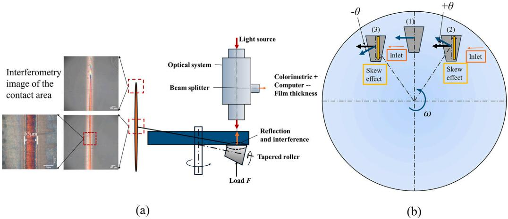  
Fig. 1. (a) Schematic illustration of the film thickness measurement using interferometry on WAM, with corresponding interferometry images of the contact centre and edge under 40 N load when the roller is stationary. (b) Schematic of the roller placement on the disc, showing the positive and negative skew conditions.

Properties of the rolling elements and the disc on the PCS EHD [28] and WAM [27] apparatuses.
| Radius in rolling direction x, m · Radius across rolling direction y, m | Ball · $R _ { \mathrm { x , 1 } } = 9 . 5 3 \times 1 0 ^ { - 3 }$ · $R _ { \mathrm { y , l } } = 9 . 5 3 \times 1 0 ^ { - 3 }$ | Tapered roller · $R _ { \mathrm { x } , 1 } = 3 . 9 1 \times 1 0 ^ { - 3 }$ · $R _ { \mathrm { y , l } } = 4 . 9 8$ | Disc · $R _ { \mathrm { x } , 2 } = \infty$ · $R _ { \mathrm { y } , 2 } = \infty$ |
| --- | --- | --- | --- |
| Modulus of elasticity E, GPa | 206 | 206 | 63 |
| Poisson coefficient v | 0.3 | 0.3 | 0.2 |

Properties of the greases, the test conditions, and the calculated central film thickness. Here, $\theta$ is skew angle.
| Grease | ηo $\mathrm { [ P a \cdot s ] }$ | α $\mathrm { [ G P a ^ { - 1 } ] }$ | $\rho _ { 0 }$ @15 ℃ $[ \mathrm { k g } / \mathrm { m } ^ { 3 } ]$ | Setup | $u _ { \mathrm { m } }$ [mm/s] | $F$ [N] | $p _ { \mathrm { h } }$ [GPa] | a [μm] | b [μm] | θ | $h _ { \mathrm { c f f } }$ [μm] |
| --- | --- | --- | --- | --- | --- | --- | --- | --- | --- | --- | --- |
|  |  |  |  | PCS EHD | 200 300 | 20 20 | 0.48 0.48 | 141 141 | 141 141 | - - | 0.500 0.655 |
| Li/M | 0.38 | 30 | 891 |  | 100 | 40 | 0.22 | 39.2 | 2710 | $0 ^ { \circ } , \pm 1 ^ { \circ } , \pm 2 ^ { \circ }$ | 0.353 |
|  |  |  |  | WAM | 150 | 40 | 0.22 | 39.2 | 2710 | $0 ^ { \circ } , \pm 1 ^ { \circ } , \pm 2 ^ { \circ }$ | 0.493 |
|  |  |  |  |  | 200 | 40 | 0.22 | 39.2 | 2710 | $0 ^ { \circ } , \pm 1 ^ { \circ } , \pm 2 ^ { \circ }$ | 0.524 |
|  |  |  |  |  |  |  |  |  |  |  |  |
|  |  |  |  |  | 100 | 40 | 0.22 | 39.2 | 2710 | 0° | 0.138 |
| Li/SS | 0.135 | 21.5 | 900 | WAM | 150 | 40 | 0.22 | 39.2 | 2710 | 0° | 0.200 |
|  |  |  |  |  | 200 | 40 | 0.22 | 39.2 | 2710 | 0° | 0.278 |

## 3.2. Starved lubrication tests

Central film thicknesses were measured as roller skew angles, velocities, and grease types were varied. Roller skew was introduced by horizontally and vertically displacing the roller to achieve the desired skew angle while maintaining a consistent disc track radius of $R _ { \mathrm { t r a c k } } =$ 45 mm. The skew angle is defined as the angle between the directions of the disc’s rolling velocity and the roller’s rolling velocity, as illustrated in Fig. 1(b). In the figure, the blue disc rotates in the counterclockwise direction with an angular velocity $\omega$. Three different skew orientations are possible: (1) zero-skew, (2) positive skew angle, and (3) negative skew angle. The blue arrows represent the surface velocity of the disc at the contact interface between the disc and the tapered roller, while the black arrows are the surface velocity of the tapered roller. In case (1) with no skew, the black arrow coincides with the blue arrow, indicating that the surface velocity of disc and roller are aligned. The orange arrow represents the direction of lubricant inlet. The yellow arrows indicate the direction of flow due to the skew effect. In this illustration, the skew angle is positive when the roller tilts counterclockwise relative to the disc radius, and negative when it tilts clockwise. In this study, the signs $" + \theta ^ { \prime \prime }$ and $^ { \dag } - \theta ^ { \dag }$ are used to describe the direction of skewinduced lubricant migration (and the centrifugal force) owing to the roller’s physical position relative to the disc’s rotational direction. As shown in Fig. 1(b), a positive sign corresponds to the roller positioned on the right side with the disc rotating counter-clockwise. Furthermore, negative skew angles can be achieved in two ways: (1) by shifting the roller to the left of the vertical line of the disc as shown in Fig. 1, or (2) by keeping the roller on the right side of the disc and reversing both the roller and disc’s rotational directions. Using these characteristics, the zero-skew orientation can be validated by comparing the results from both approaches. If the zero-skew angle is set with sufficient precision, both cases should yield identical results. The test conditions for the measurement series are summarized in Table 2. The fully flooded film thickness $h _ { \mathrm { c f f } }$ at each condition is calculated using the calibrated parameters and Nijenbanning’s equation [29].

The measurement procedure is as follows: A clean tapered roller or ball is positioned on the disc in the test rig. The tapered roller is adjusted to the desired skew angle. A small, uniform amount of grease is then applied to the disc using a wooden spatula, leaving a small contact area exposed for determining the disc spacer layer thickness. The disc is rotated at a surface velocity lower than the test velocity for a period of 5 min. Specifically, the selected pre-running velocities are 80, 100, and 150 mm/s for the 100, 150, and 200 mm/s tests, respectively. These ensure that the contact operates in the fully flooded lubrication regime with uniform lubricant distribution along both the length and the width of the track. This step differs for measurements conducted using the PCS-EHD ball-on-disc setup. Due to the smaller contact width across the track and faster film thickness decay in circular contacts, a higher pre-running velocity of approximately 300 mm/s is used for a period of 1 min to ensure uniform lubricant distribution along the track, regardless of the fully flooded lubrication condition.

During this initial phase, grease levees form on both sides of the track. These levees are relatively large compared to the lubricant layer thickness in the track, resulting in track replenishment. To minimize this replenishment, the radius of the track on the disc $R _ { \mathrm { d i s c } }$ (for roller, $R _ { \mathrm { d i s c } } = 4 5 \ : \mathrm { m m }$ , and for ball, $R _ { \mathrm { d i s c } } = 4 0$ mm) is gradually adjusted during rolling, pushing the levees about 2.5 mm out on each side of the track. Afterward, the roller is repositioned to the initial track radius, and the film thickness is measured at various intervals over approximately three hours.

## 4. Results

This section presents the skew setup alignment validation, the experimental verification of the Van Zoelen’s model predictions of film thickness decay, followed by an investigation of the effects of ellipticity. Then, the impact of skew on film thickness decay is presented.

To facilitate consistent comparison, given the variations inherent in the start-up/running-in conditions, the film thickness decay analysis for the measurement group shown in each plot starts when each test’s film thickness decays to a selected ‘‘post-start-up’’ value for that group. For example, in Fig. 5(a), the initial film thickness value of 300 nm (at time $t = 0 )$ for that group of tests was consistently reached after the irregular start-up phase was completed in each of the tests in that group. In Fig. 5(b), the selected consistent initial film thickness for that group is 350 nm.

## 4.1. Setup alignment validation for skew experiments

Given the small skew angles used in the tapered roller-on-disc experiments, it is crucial to ensure a precise setup of the zero-skew angle (0◦). This facilitates accurate analysis of the measurement results to determine if the film thickness decay rate varies with skew angle. If the zero skew angle is accurately set, the film thickness decay at the zero skew angle should be identical, regardless of the disc’s rotation direction (as described in the Experiments section). In addition, for a negative skew angle $\left( - \theta \right) ,$ , the film thickness decay should match that of a positive skew angle ($\theta$) with the disc rotating in the opposite direction. Tests were conducted to validate this using both orientationdirection combinations expected to yield the same film thickness decay rate, and the results are presented in Fig. 2.

Fig. 2a shows the evolution of central film thickness at $0 ^ { \circ } ,$ with the disc rotating clockwise and counterclockwise. The observed decay rates are identical for both rotational directions, confirming the zeroskew angle was set with sufficient accuracy. Additional confirmation is provided in Fig. 2b, which displays the central film thickness decay at a skew angle $\mathbf { o f } - 2 ^ { \circ }$ for two configurations: (1) the roller positioned on the left side of the disc with counterclockwise disc rotation, and (2) the roller positioned on the right side of the disc with clockwise disc rotation and a reversed roller rotation. The decay rates in both cases remain consistent, further validating the proper setup of the skew angle experiments.

## 4.2. Film thickness decay for different ellipticities

Fig. 3 shows the central film thickness decay in an EHL circular contact $( k = 1 )$ measured at speeds of 200 mm/s (black squares) and 300 mm/s (red dots) using Li/M grease on the PCS ball-on-disc EHD rig, together with the prediction from Van Zoelen’s side flow model (black line). The measurements at both speeds align well with the predictions from Van Zoelen’s model. At the higher speed of 300 mm/s, the scattering in the data may be the result of additional reflow caused by increased spin or sideward slip, as discussed in Ref. [3].

With the Van Zoelen model verified, we next investigated the effect of ellipticity on film thickness decay. Fig. 4 shows the Van Zoelen’s model-predicted central film thickness decay for different ellipticities using the properties of Li/M grease. The maximum contact pressure is fixed at $p _ { h } ~ = ~ 0 . 2 2 ~ \mathrm { G P a }$ , the half contact width along the rolling direction is maintained at $a = 3 9 . 2 ~ { \mu \mathrm { m } }$ , while the half contact width perpendicular to the rolling direction $b$ is modified to achieve varying ellipticities $k \ = \ b / a$ . The results show that as the contact becomes wider — higher $^ { b , }$ hence, higher $k$ — the film thickness decays (much) slower. Note that all the profiles in Fig. 4 start at the same initial film thickness of 310 nm, which is not visible for k = 1 and $\mathbf k = 2$ due to the logarithmic time axis used.

Increasing the ellipticity ratio $k$ — achieved by increasing the halfwidth $b$ in the transverse direction while keeping the peak pressure $p_h$ and rolling direction half-width $a$ constant — reduces the value of $F ( 0 ) ,$ as shown in Eq. (3). This reduction in $F(0)$ decreases the coefficient of time in Eq. (1), thereby slowing the film thickness decay. As illustrated in $\mathrm { F i g . 4 , }$ , the decay time scales approximately with the square of $k$ when other parameters $a$ and $p _ { h }$ remain constant. Specifically, increasing $k$ by a factor of 10 results in a decay time roughly 100 times longer, for example, comparing the profiles in Fig. 4 with $k = 1 \ ( \varDelta t = 1 0 \ s )$ and $k = 1 0 \left( \varDelta t = 1 0 0 0 s \right)$ , for a film thickness decay from 310 nm to 125 nm. The same trend can be seen when comparing the $k = 5$ and $k = 5 0$ profiles.

The slower decay of film thickness at higher ellipticity ratios is primarily due to the reduction in side flow within the Hertzian contact. As $b$ increases while maintaining constant maximum pressure, the pressure gradient in the transverse direction decreases, reducing lubricant side flow [3].

## 4.3. Effects of skew angle and speed on film thickness decay

To enable quantitative comparison of film thickness decay, an average film thickness decay rate $\dot { h } _ { \mathrm { a v e } }$ is defined as the difference between the initial film thickness and the film thickness at 4000 s, divided by 4000 s. The choice of 4000 s as the reference time is due to the fact that the shortest measurement duration recorded for Li/SS grease at 200 mm/s was less than 5000 s. This parameter, reported in Tables 3–6, for the data presented in Figs. 5–8, respectively, provides a simplified characterization of the decay behaviour. However, note that this definition does not capture the true decay rate, as the rate of film thickness decay is not constant over time; the slope of the film thickness curve is steeper at higher film thicknesses. This behaviour is consistent with the film thickness decay parameter $\gamma$ used by Damiens et al. [14] and the gradient parameter $\textstyle { \frac { { \bar { \partial } } Q } { \partial Y } }$ used by Van Zoelen [3], both of which vary with starvation level. Nevertheless, since all comparisons are based on the same initial film thickness, this average decay rate $\dot { h } _ { \mathrm { a v e } }$ provides a sufficiently robust and consistent key performance indicator for comparing early film decay behaviour across different cases. While this approach does not fully capture the transient nature of the decay process, it offers a practical and standardized method for comparative analysis. More suitable parameters for use as key performance indicators may be explored in future studies to better characterize the dynamic decay behaviour.

Fig. 5 presents instantaneous film thickness profiles for the Li/M grease at the three speeds and five skew angles tested. This figure illustrates the influence of roller skew angles on film thickness decay in a very wide elliptical contact at different surface velocities (100 mm/s, 150 mm/s and 200 mm/s). The results show that for all three velocities, different skew angles yield distinct average film thickness decay rates. The film thickness appears to decay slower as skew angle increases from $- 2 ^ { \circ }$ to +2◦: The fastest film thickness decay occurs $\tt { a t } - 2 ^ { \circ }$ followed ${ \bf b y - } 1 ^ { \circ } , ~ 0 ^ { \circ } ;$ , and $^ { 1 ^ { \circ } , }$ , while the slowest decay is observed at $+ 2 ^ { \circ }$ . Furthermore, the effect of the roller skew angles 1◦ and $2 ^ { \circ }$ on the film thickness decay is more distinct at 150 mm/s and 200 mm/s, compared to the results at 100 mm/s. The estimated average decay rates are presented in Table 3.

Table 3  
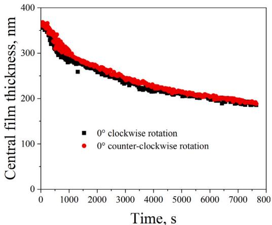  
(a)

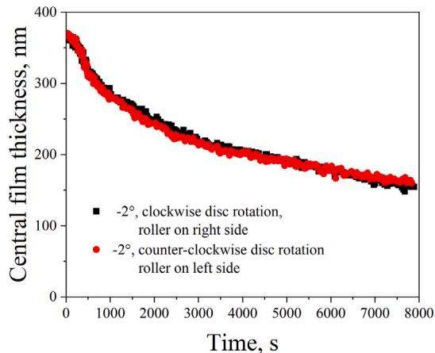  
(b)

Fig. 2. Central film thickness decay with time for Li/M grease (a) with no skew, and (b) at skew angle of −2◦, using both possible combinations of roller-disc orientation and rotation directions.  
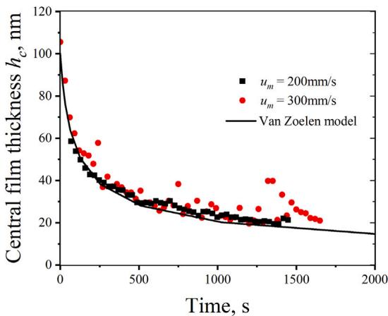  
Fig. 3. Central film thickness decay in an EHL circular contact measured at entrainment speeds of 200 mm/s and 300 mm/s (the black and red discrete data points, respectively) overlaid on the predictions obtained from the Van Zoelen’s side flow model (the black line). Measurements at both speeds were taken at different irregular intervals.

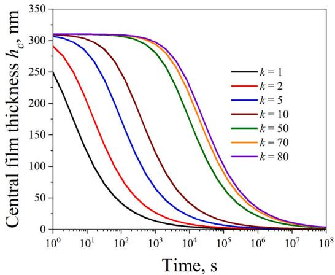  
Fig. 4. The effect of ellipticity on the central film thickness decay as predicted by Van Zoelen’s side flow model [3]. The film thickness decays slower as ellipticity increases. The time axis appears to start at 1 s due to the logarithmic scale.

Average film thickness decay rate $\dot { h } _ { a v e } ,$ for the various speeds and skew angles using Li/M grease, from ${ \mathrm { F i g . ~ } } 5 .$
| Speed, mm/s | Skew angle, ° | $\dot { h } _ { \mathrm { a v e } } ,$ nm/s |
| --- | --- | --- |
| 100 | +2 | 0.019 |
| +1 | 0.020 |  |
| 0 | 0.022 |  |
| -1 | 0.025 |  |
| -2 | 0.029 |  |
| +2 | 0.022 |  |
| 150 | +1 | 0.029 |
|  | 0 | 0.035 |
| -1 | 0.037 |  |
| -2 | 0.039 |  |
| +2 | 0.022 |  |
| 200 | +1 | 0.025 |
| 0 |  |  |
| -1 | 0.033 |  |
| -2 | 0.035 0.037 |  |

Table 4

Average film thickness decay rate ${ \dot { h } } _ { \mathrm { a v e } } ,$ for the different greases and speeds, from Fig. 6.
| Grease type | Speed, mm/s | $\dot { h } _ { \mathrm { a v e } } ,$ nm/s |
| --- | --- | --- |
| Li/M | 100 | 0.028 |
| 150 | 0.020 |  |
| 200 | 0.022 |  |
| Li/SS | 100 | 0.010 |
| 150 | 0.005 |  |
| 200 | 0.006 |  |

Fig. 6 shows the influence of the three different speeds on the central film thickness decay for both Li/M and Li/SS greases without skew. The corresponding average film thickness decay rates $\dot { h } _ { \mathrm { a v e } }$ are shown in Table 4. The black lines are the predictions of the Van Zoelen model. The average film thickness decay rate at 100 mm/s is the fastest, while the average film thickness decay rates at 150 mm/s and 200 mm/s are almost the same. The measurements at higher speeds (150 mm/s and 200 mm/s) are closer to the predictions by Van Zoelen’s model.

For the positive skew angles, Fig. 7a shows the influence of speed on the film thickness decay at the skew angle of 1◦ and Fig. 7b at the skew angle of 2◦. At both skew angles, the film thickness decay at 100 mm/s is the fastest. The average film thickness decay rates at 150 mm/s and

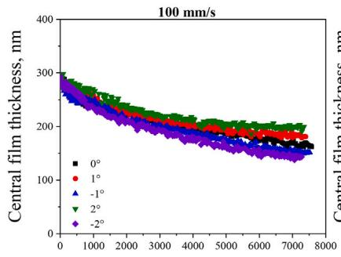  
(a)

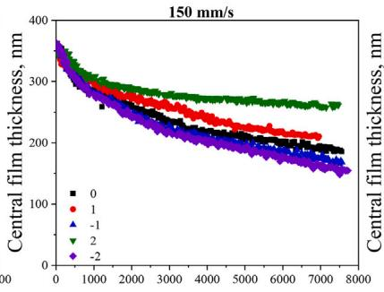  
(b)

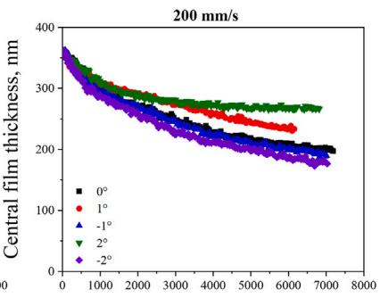  
(c)

Fig. 5. Central film thickness decay with time at different skew angles using Li/M grease, at speeds of (a) 100 mm/s, (b) 150 mm/s, and (c) 200 mm/s.  
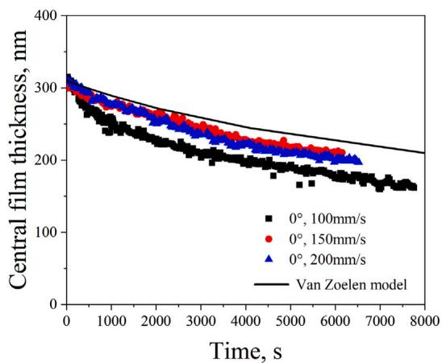  
(a)

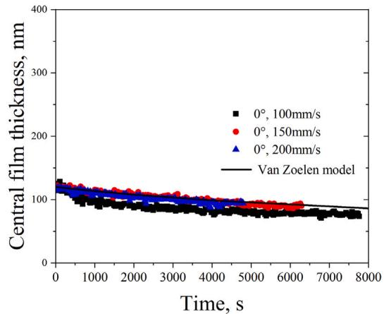  
(b)

Fig. 6. Central film thickness decay with time at the three different speeds with no skew for (a) Li/M and (b) Li/SS greases.  
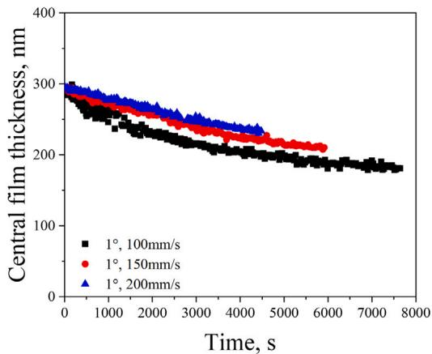  
(a)

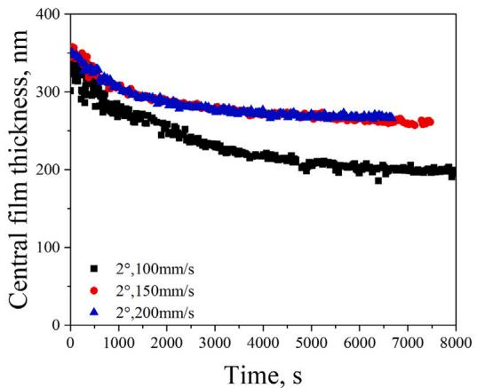  
(b)  
Fig. 7. Central film thickness decay with time at the three different speeds and skew angles of (a) 1◦ and (b) 2◦ for Li/M grease.

200 mm/s at 2◦ skew angle are practically the same, while at 1◦ skew angle, the decay rate at 150 mm/s is higher than at 200 mm/s. The average film thickness decay rates $\dot { h } _ { \mathrm { a v e } }$ for positive skew angles, used for further comparison, are presented in Table 5.

For the negative skew angles, Fig. 8a shows the influence of speed on the film thickness decay at the skew angle of −1◦ and Fig. 8b at the skew angle of −2◦. Similar to the positive skew angle effects, the film thickness decays the fastest at 100 mm/s. However, for these negative skew angles, there is a clear distinction between the decay rates at 150 mm/s and 200 mm/s. The average film thickness decay rates $\dot { h } _ { \mathrm { a v e } }$ corresponding to the negative skew angles, for comparative analysis, are presented in Table 6.

Table 5  
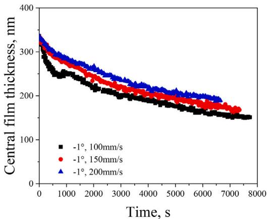  
(a)

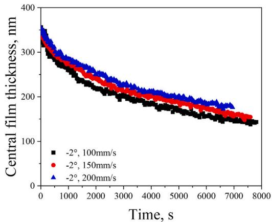  
(b)  
Fig. 8. Central film thickness decay with time at different speeds at (a) −1◦ and (b) −2◦ for Li/M grease.

Average Li/M grease film thickness decay rate $\dot { h } _ { \mathrm { a v e } } ,$ for positive skew angles and various speeds, from Fig. 7.
| Skew angle, ° | Speed, mm/s | $\dot { h } _ { a v e } ,$ nm/s |
| --- | --- | --- |
| +1 | 100 | 0.024 |
| 150 | 0.019 |  |
| 200 | 0.016 |  |
| +2 | 100 | 0.033 |
| 150 | 0.020 |  |
| 200 | 0.020 |  |

Average Li/M grease film thickness decay rate $\dot { h } _ { a v e } ,$ for negative skew angles and various speeds, from Fig. 8.
| Skew angle, ° | Speed, mm/s | ${ \dot { h } } _ { \mathrm { a v e } } ,$ nm/s |
| --- | --- | --- |
| -1 | 100 | 0.037 |
| 150 | 0.033 |  |
| 200 | 0.029 |  |
| -2 | 100 | 0.042 |
| 150 | 0.038 |  |
| 200 | 0.034 |  |

## 5. Discussion: mechanisms that govern film thickness decay

## 5.1. The skew and centrifugal force effects

The current measurements do not allow for a clear separation between the effects of the roller’s taper geometry and the influence of roller skew on film thickness decay. However, since the taper angle of the roller remains constant throughout all tests, any differences observed between the 0◦ condition and other skew angles can be attributed to the effect of roller skew. The consistent taper geometry across all experiments ensures that the influence of taper remains constant, while only the skew angle is varied. Therefore, the observed differences in film thickness decay can reasonably be attributed to skew-induced effects rather than to the roller’s taper geometry.

The presented results clearly show the influence of roller skew on film thickness decay in a finite line or very wide elliptical contact. If film thickness were solely governed by symmetrical contact pressuredriven side flow and geometric skew effects, the decay rates would be identical for positive and negative skew angles of the same magnitude. However, the experimental results reveal an asymmetry relative to the zero skew reference: faster decay is observed for negative skew angles and slower decay for positive skew angles. This is attributed to the presence of an additional influencing factor: the centrifugal force, which can alter the replenishment or loss of lubricant in the contact.

As shown in Figs. 6 and Table 4, increasing the speed from 100 mm/s to 150 mm/s reduces the average film thickness decay rate, potentially due to the increase in the centrifugal force which is proportional to the square of disc speed.

This is further explained using the diagram in Fig. 9. In this figure, three lubrication mechanisms are depicted:

• Side flow driven by contact pressure which pushes lubricant out of the contact zone to both sides (perpendicular to the rolling direction).

• Skew-induced lubricant migration, here referred to as the skew effect, which redistributes the lubricant within the contact and in the inlet of the contact. Fig. 10 presents interferometry images showing the evolution of the lubricant film over time (as indicated by the blue arrows) under the influence of a large skew angle (±3◦). This exceeds the skew angles examined in the main results section and is used here to clearly visualize skew-induced lubricant migration. In Fig. 10, the skew-induced flow — highlighted by yellow arrows — occurs both within the contact and at the inlet, accompanied by a gradual change in the inlet meniscus over time.

• Centrifugal force which directs the lubricant radially outward from the centre of the disc to its edge.

The combined effect of the centrifugal force-induced flow and the skew-induced flow changes direction when the skew angle changes sign. For a positive skew angle, the skew-induced flow acts in the same direction as the centrifugal force-induced flow, both helping to transport lubricant from the lubricant levee at the inner edge of the contact to the outer edge. This inner edge levee is continuously resupplied compensating for the loss of lubricant from the outer edge levee due to the centrifugal force. In contrast, under a negative skew angle, the skew effect drives the lubricant from the outer edge to the inner edge (pushing against the inner edge levee and minimizing possible replenishment from the inner edge), while the centrifugal force simultaneously drives lubricant at the outer edge levee away from the contact, reducing the amount of lubricant available to replenish the track via the skew effect. This mechanism is validated using optical interferometry image presented in Fig. 11 which shows the distribution of the lubricant at the outer and inner edges of the contact for skew angles of −2◦ and +2◦ at 150 mm/s. The images show that at +2◦, the lubricant accumulates at the inner and outer edges, as indicated by the larger meniscus distances. In contrast, at −2◦, the lubricant accumulates at the inner edge (with larger meniscus, relative to the outer edge), further supporting the proposed lubrication mechanisms.

This also explains the trends observed in Fig. 5 and Table 3: the decay is relatively slow for positive skew angles, more so at higher speeds for which more lubricant replenishment is expected due to the combined positive impacts of the centrifugal force and the roller skew as seen in Figs. 6 (Table 4), 7 (Table 5), and 8 (Table 6).

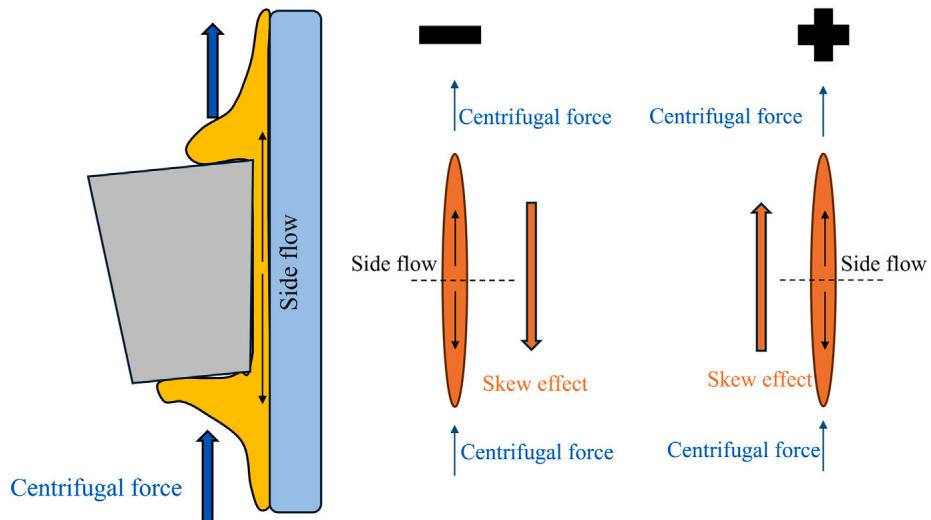  
Fig. 9. Schematic of the three lubrication mechanisms governing film thickness decay in the tapered roller-disc contact. The plus and minus signs indicate positive and negative skew orientations, respectively.

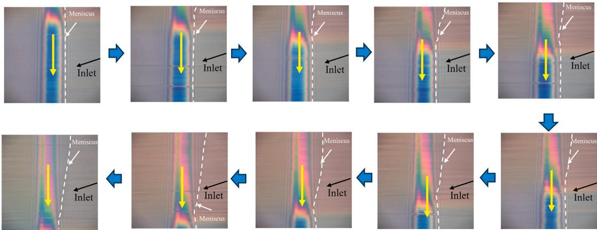  
Fig. 10. Interferometry images showing the evolution of the contact centre and inlet meniscus over time for Li/M grease under a −3◦ skew angle. The black arrow indicates the inlet flow direction which is the entrainment direction, while the white lines mark the meniscus position at different time steps. The yellow arrow denotes the direction of lubricant migration within the contact.

## 5.2. Starvation effect

Another potential explanation for the slower decay at higher velocities is the degree of lubrication starvation. As earlier mentioned, the Van Zoelen model is characteristic of heavily starved contacts. Under this condition, the influence of speed has been shown to be minimal [3]. According to Van Zoelen [3], in case of mild starvation, side flow is more pronounced due to a longer pressure build-up in the inlet, especially in elliptic contacts. This phenomenon is quantifiable via the ratio of initial film thickness to the calculated fully flooded film thickness $\frac { h _ { \mathrm { c , 0 } } } { h _ { \mathrm { c f f } } }$ , where a value greater or equal to 1 indicates fully flooded conditions. Using Fig. 6(a) measurements, $\frac { h _ { \mathrm { c , 0 } } } { h _ { \mathrm { c f f } } }$ is approximately 0.91 at 100 mm/s, 0.65 at 150 mm/s, and 0.61 at 200 mm/s. Physically, this means that at the lowest speed (100 mm/s), the contact is almost fully flooded, implying a long pressure build up in the inlet which explains why the film thickness decays relatively fast. The decay at 150 mm/s and 200 mm/s are nearly identical. This is explained by two factors: (1) the difference in starvation degree between 100 mm/s and 150 mm/s (0.91 and 0.65, respectively) is more significant than between 150 mm/s and 200 mm/s (0.65 and 0.61, respectively), and (2) because the speed ratio is smaller $\mathrm { \frac { 2 0 0 \ m m / s } { 1 5 0 \ m m / s } } = 1 . \dot { 3 }$ versus $\begin{array} { r } { \frac { 1 5 0 \ \mathrm { { ^ m m / s } } } { 1 0 0 \ \mathrm { { m m / s } } } = } \end{array}$ 1.5.

Fig. 6 shows the measured film thickness decay compared with predictions from Van Zoelen’s film thickness decay model [3,4] (Eq. (1)) which only considers side flow in elliptical contacts without accounting for reflow when the contacts are severely starved. Hence, while this model is not strictly applicable due to the mild level of starvation in our tests, we have used it as a reference. Comparing the circular contact film thickness results for Li/M grease at 200 mm/s in Fig. 3 with those from the wide elliptical contact in Fig. 6(a), the starvation level — quantified by $\frac { h _ { \mathrm { c , 0 } } } { h _ { \mathrm { c f f } } } \dot { - } \mathrm { i n }$ the circular contact drops from 0.18 to 0.04 in 17 min, whereas in the wide elliptical contact, it decreases from 0.61 to 0.38 over 117 min. This confirms that film thickness decays much slower in wide elliptical contacts than in circular or moderately elliptical contacts. This is also shown in Fig. 4.

In Fig. 6, the model predictions align more closely with the experimental results at 150 mm/s and 200 mm/s, where starvation is more severe than at 100 mm/s. The large deviation of measured film thickness decay at 100 mm/s from the model’s prediction can be attributed to the model’s application range. The model was derived for the case of severe starvation without reflow, assuming a Hertzian contact-like pressure distribution. Under mild starvation conditions as found for the case of 100 mm/s, the pressure build-up in front of the contact, which is not accounted for in this model, contributes significantly to the side flow, thereby accelerating central film thickness decay.

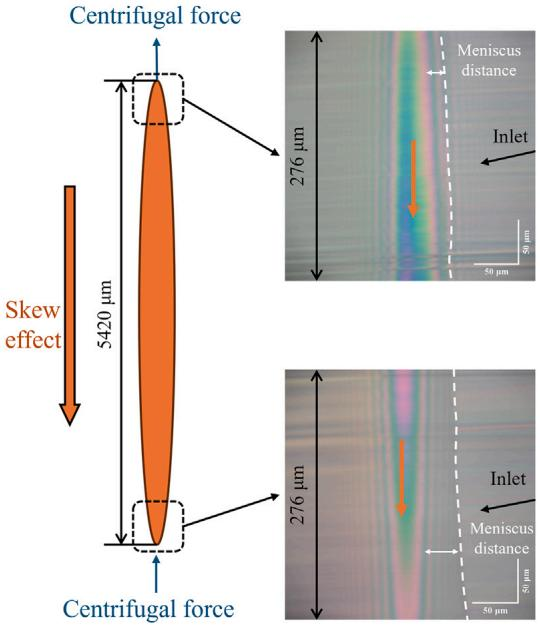  
(a). 150mm/s, $- 2 ^ { \circ }$

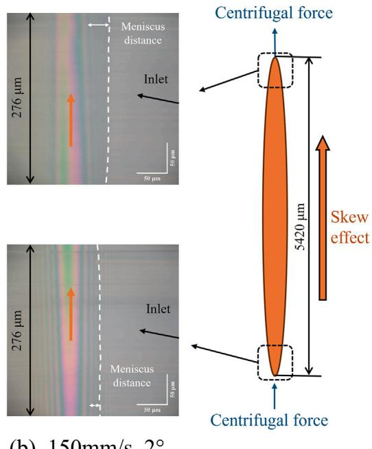  
(b). 150mm/s, 2°  
Fig. 11. The tapered roller-disc contact area and optical interferometry images of the contact edges showing the combined impacts of skew and centrifugal force on the lubricant distribution in a skewed contact.

In cylindrical roller bearings, the centrifugal force acts perpendicular to the direction of lubricant migration, rendering the replenishment effect due to centrifugal force irrelevant. However, this effect is significant in tapered roller bearings and thrust bearings. When lubricant levees form at the sides of the track, roller skew aids in replenishing the contact area and redistributing the lubricant. Conversely, in the absence of lubricant at the track’s edges, roller skew accelerates lubricant depletion.

## 6. Conclusions

This article presented an investigation into different mechanisms influencing film thickness decay in an EHL contact. A side flow model [3, 4] was used as a reference to which the measurements were compared. Results show that:

1. Measurements of film thickness decay in a circular contact due to starvation match model predictions.

2. Film thickness decay in wide elliptical contacts is much slower than in circular and moderate elliptical contacts.

3. Due to the slow film thickness decay observed for the studied cases (speeds of 100 mm/s, 150 mm/s, and 200 mm/s), the contacts were mildly starved during the test period.

4. For a given film thickness, higher speeds lead to more severe starvation. The measurement results at higher speeds are therefore closer to the predictions of the Van Zoelen model, which is only applicable to severely starved conditions.

5. In the mildly starved regime, the film thickness decay is speeddependent, with the fastest decay occurring at the lowest speed.

6. The film thickness decay rate is influenced by the orientation of the roller skew relative to the centrifugal force direction. When the skew effect on lubricant flow is in the same direction as the centrifugal force, the average film thickness decay rate is reduced. Conversely, when the skew-induced flow opposes the centrifugal force, the decay rate is increased.

## Notations and abbreviations

| a | half contact width in the rolling direction |
| --- | --- |
| $b$ | half contact width perpendicular to the rolling direction |
| $E$ | modulus of elasticity |
| $E ^ { \prime }$ | $\begin{array} { r } { \frac { 2 } { E ^ { \prime } } = \frac { 1 - { v _ { 1 } } ^ { 2 } } { E _ { 1 } } + \frac { 1 - { v _ { 2 } } ^ { 2 } } { E _ { 2 } } } \end{array}$ reduced modulus of elasticity, |
| $F$ | contact load |
| $F ( y )$ | function describing side flow variation |
| $h _ { c }$ | dimensional central film thickness |
| $h _ { c , 0 }$ | dimensional initial central film thickness |
| $h _ { c f f }$ | dimensional fully flooded central film thickness |
| $k$ | ellipticity, $\begin{array} { r } { k = \frac { b } { a } } \end{array}$ effective contact length |
| $l _ { e }$ | total length of tracks (raceway and rolling element) |
| $l _ { t }$ | maximum contact pressure |
| $p _ { h }$ $R$ | reduced radius in the rolling direction for line contact |
|  | the disc radius |
| $R _ { t r a c k }$ | the roller effective radius at contact point |
| $R _ { r o l l e r }$ $R _ { x }$ | reduced radius in the rolling direction for elliptical |
|  | contact |
| $R _ { y }$ | radius perpendicular to the rolling direction time (s) |
| $t$ $T$ | temperature (°C) |
|  | entrainment velocity, $\begin{array} { r } { u _ { m } = \frac { u _ { 1 } + u _ { 2 } } { 2 } } \end{array}$ |
| $u _ { m }$ |  |
| $v$ | Poisson coefficient |
| $\eta _ { 0 }$ | dynamic viscosity $( P a \cdot s )$ at ambient pressure |
| $\alpha$ | pressure-viscosity coefficient |
| $\rho$ | density |
| $\rho _ { 0 }$ | density at ambient pressure |

$\upsilon$ kinematic viscosity $\theta$ skew angle WAM Wedeven Associates Machine EHD Elastohydrodynamic

CRediT authorship contribution statement

Min Gao: Writing – review & editing, Writing – original draft, Visualization, Methodology, Investigation, Formal analysis, Data curation, Conceptualization. Marco T. van Zoelen: Writing – review & editing, Writing – original draft, Supervision, Methodology, Investigation, Formal analysis, Conceptualization. Jude A. Osara: Writing – review & editing, Validation, Supervision, Resources, Project administration, Methodology, Investigation, Formal analysis, Conceptualization. Ralph Meeuwenoord: Resources, Methodology, Investigation. Rihard Pasaribu: Writing – review & editing, Funding acquisition, Conceptualization. Piet M. Lugt: Writing – review & editing, Supervision, Resources, Project administration, Methodology, Investigation, Funding acquisition, Formal analysis, Conceptualization.

## Declaration of competing interest

The authors declare that they have no known competing financial interests or personal relationships that could have appeared to influence the work reported in this paper.

## Acknowledgements

We thank Dr. N. F. Bader and Dr. A. Wheatley for discussions on part of this work. We thank SKF Research and Technology Development and Shell for funding this work.

## Data availability

Data will be made available on request.

## References

[1] van Zoelen MT, Venner CH, Lugt PM. Free surface thin layer flow in bearings induced by centrifugal effects. Tribol Trans 2010;53(3):297–307.

[2] Gao M, Liang H, Wang W, Chen H. Oil redistribution and replenishment on stationary bearing inner raceway. Tribol Int 2022;165:107315.

[3] van Zoelen MT. Thin layer flow in rolling element bearings (Ph.D. thesis), The Netherlands, ISBN 978-90-365-2934-1: University of Twente; 2009.

[4] Venner CH, van Zoelen MT, Lugt PM. Thin layer flow and film decay modeling for grease lubricated rolling bearings. Tribol Int 2012;47:175–87.

[5] Jacod B, Pubilier F, Cann PME, Lubrecht AA. An analysis of track replenishment mechanisms in the starved regime. In: Dowson D, Priest M, Taylor CM, Ehret P, Childs THC, Dalmaz G, Berthier Y, Flamand L, Georges J-M, Lubrecht AA, editors. Lubrication at the frontier. Tribology series, vol. 36, Elsevier; 1999, p. 483–92.

[6] Chiu YP. An analysis and prediction of lubricant film starvation in rolling contact systems. A S L E Trans 1974;17:22–35.

[7] Shetty P, Meijer RJ, Osara JA, Pasaribu R, Lugt PM. Vibrations and film thickness in grease-lubricated deep groove ball bearings. Tribol Int 2024;193:109325.

[8] Cen H, Lugt PM. Replenishment of the EHL contacts in a grease lubricated ball bearing. Tribol Int 2020;146:106064.

[9] Damiens B, Lubrecht AA, Cann PM. Influence of cage clearance on bearing lubrication. Tribol Trans 2004;47:2–6.

[10] Cann PM, Lubrecht AA. The effect of transient loading on contact replenishment with lubricating greases. In: Tribology series. vol. 43, Elsevier; 2003, p. 745–50.

[11] Booser ER, Wilcock DF. Minimum oil requirements of ball bearings. Lubr Eng 1953;9(3):140–3.

[12] Fischer D, von Goeldel S, Jacobs G, Stratmann A. Numerical investigation of effects on replenishment in rolling point contacts using CFD simulations. Tribol Int 2021;157:106858.

[13] Chevalier F, Lubrecht AA, Cann PME, Colin F, Dalmaz G. Film thickness in starved EHL point contacts. J Tribol 1998;120(1):126–33.

[14] Damiens B, Venner CH, Cann PME, Lubrecht AA. Starved lubrication of elliptical EHD contacts. J Tribol 2004;126(1):105–11.

[15] Liang H, Guo D, Ma L, Luo J. Experimental investigation of centrifugal effects on lubricant replenishment in the starved regime at high speeds. Tribol Lett 2015;59:1–9.

[16] Guo L, Wang W, Zhang Z, Wong P. Study on the free edge effect on finite line contact elastohydrodynamic lubrication. Tribol Int 2017;116:482–90.

[17] Ye Z, Wang L. Effects of axial misalignment of rings on the dynamic characteristics of cylindrical roller bearings. Proc Inst Mech Eng Part J 2016;230(5):525–40.

[18] Kushwaha M, Rahnejat H, Gohar R. Aligned and misaligned contacts of rollers to races in elastohydrodynamic finite line conjunctions. Proc Inst Mech Eng Part C 2002;216(11):1051–70.

[19] Liu X, Yang P, Yang P. Analysis of the lubricating mechanism for tilting rollers in rolling bearings. Proc Inst Mech Eng Part J: J Eng Tribol 2011;225(11):1059–70.

[20] Liu X, Yang P. On the thermal elastohydrodynamic lubrication of tilting roller pairs. Tribol Int 2013;65:346–53.

[21] Liu X, Li S, Yang P, Yang P. On the lubricating mechanism of roller skew in cylindrical roller bearings. Tribol Trans 2013;56(6):929–42.

[22] Liu X, Bai X, Cui J, Yang P. Thermal elastohydrodynamic lubrication analysis for tilted and skewed rollers in cylindrical roller bearings. Proc Inst Mech Eng Part J: J Eng Tribol 2016;230(4):428–41.

[23] Dowson D, Higginson GR. Elastohydrodynamic lubrication: The fundamentals of roller and gear lubrication. vol. 23, Pergamon, Oxford; 1966.

[24] Guimarey MJG, Comuñas MJP, López ER, Amigo A, Fernández J. Volumetric behavior of some motor and gear-boxes oils at high pressure: Compressibility estimation at EHL conditions. Ind Eng Chem Res 2017;56(38):10877–85.

[25] Gao M, Osara JA, van Zoelen MT, Meeuwenoord R, Pasaribu R, Lugt PM. Analytical predictions and experimental measurements of EHL film thickness in wide elliptical and line contacts. Tribol Int 2025;212:110893.

[26] Cyriac F, Lugt PM, Bosman R, Padberg CJ, Venner CH. Effect of thickener particle geometry and concentration on the grease EHL film thickness at medium speeds. Tribol Lett 2016:61.

[27] Wedeven Associates Inc. WAM test machine . 2025, URL https://www.wedeven. com/wam.html.

[28] PCSInstruments. EHD . 2025, URL https://pcs-instruments.com/product/ehd/.

[29] Nijenbanning G, Venner CH, Moes H. Film thickness in elastohydrodynamically lubricated elliptic contacts. Wear 1994;176(2):217–29.

---

> **추출 글자 소실 복구 기록** — 원문 대조로 22건 복구 (a·b·k·θ·α·ω·t·F·p_h·ν 등). 미확인 0건.
