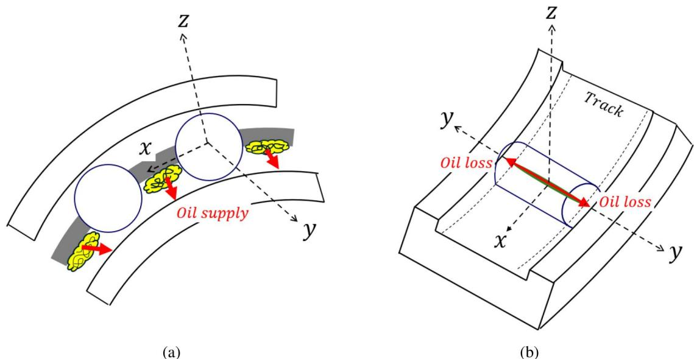
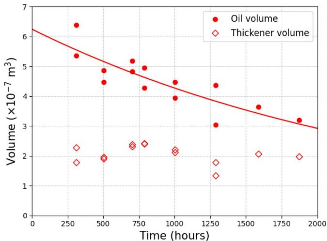
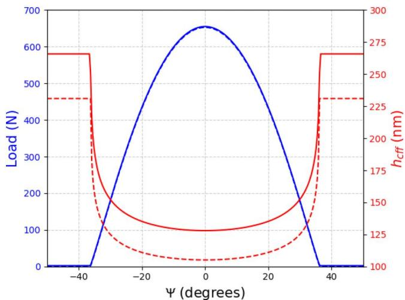
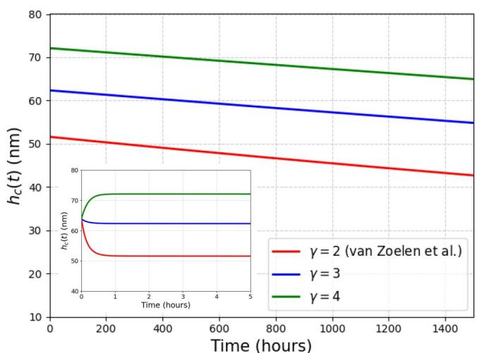
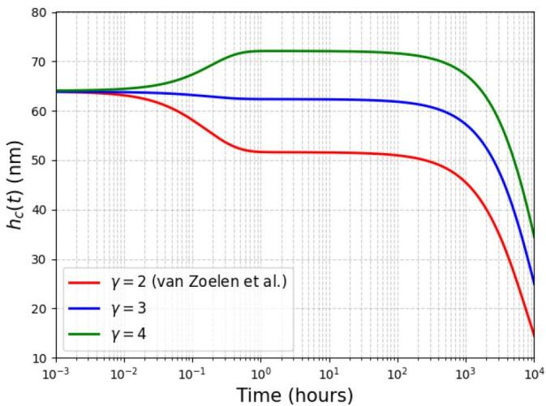
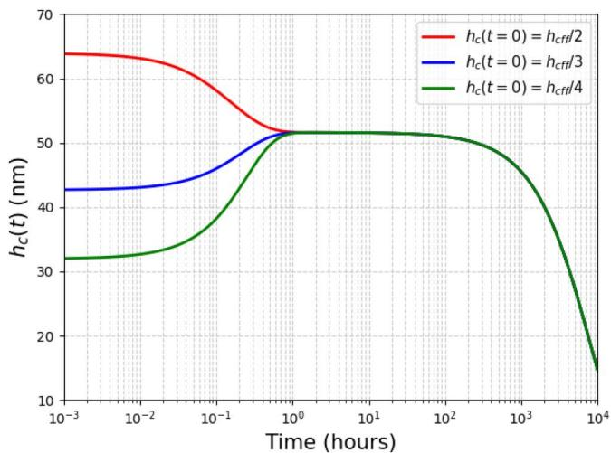
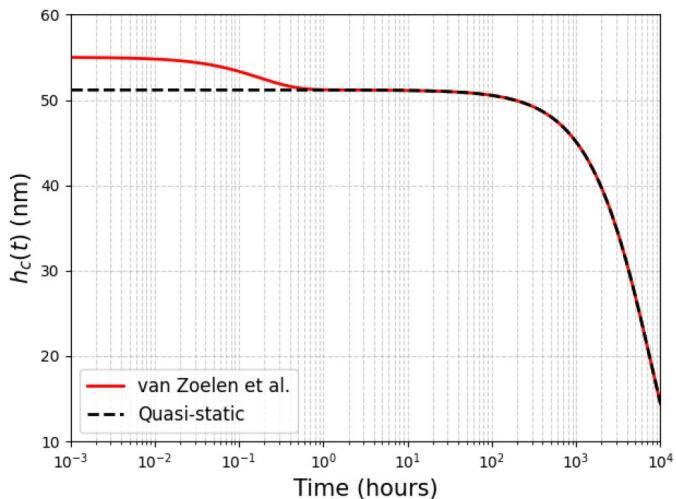
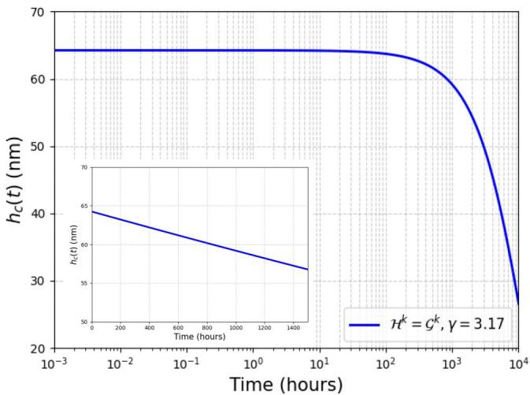
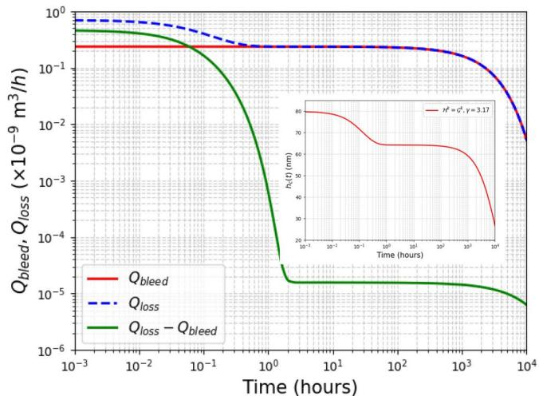
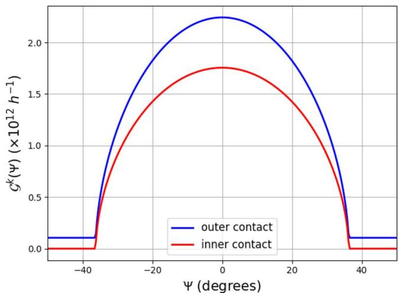

# Transient Analysis of Film Thickness During Bleed Phase in Grease-Lubricated Cylindrical Roller Bearings

Varun Puthumana, Marco T. van Zoelen & Piet M. Lugt

c © 2026 The Author(s). Published with license by Taylor & Francis Group, LLC.

∂ OPEN ACCESS

Check for updates

# Transient Analysis of Film Thickness During Bleed Phase in Grease-Lubricated Cylindrical Roller Bearings

Varun Puthumanaa , Marco T. van Zoelenb , and Piet M. Lugta,b

aEngineering Technology, University of Twente, Enschede, The Netherlands; bSKF Research & Technology Development, Houten, The Netherlands

## ABSTRACT

The grease life of rolling bearings is strongly influenced by the lubricating film thickness, yet its transient evolution has not been extensively investigated. In this work, a mass balance framework is used to describe the competition between oil supply from grease bleed and oil loss at elastohydrodynamic lubrication (EHL) contacts, enabling the assessment of the characteristics of film thickness evolution over time. The analysis reveals an initial stabilization toward a characteristic film thickness plateau, resulting from a nearly constant early-stage oil supply and self-regulating nonlinear EHL losses. At longer times, the film thickness gradually decreases, governed by the characteristic time scale of grease bleed, indicating that oil availability and rate of supply control the long-term film behavior. The proposed framework provides a systematic basis for understanding film evolution in grease-lubricated cylindrical roller bearings and can be extended to incorporate more detailed physical mechanisms for accurate predictions.

ARTICLE HISTORY

Received 18 March 2026

Accepted 1 May 2026

KEYWORDS

rolling bearings

Film thickness; oil bleed;

## Introduction

The life of bearings is critically determined by the lubricating film that separates the rolling element from the raceways of the bearing. A sufficiently thick lubricant film is essential for long bearing life, as excessively thin films can lead to premature failure. (1) In grease-lubricated bearings, the thickness of this lubricating film is determined mainly by the oil supply and loss mechanisms, which continuously replenish and deplete oil in the contact area during operation. The prediction of film thickness crucially depends on the type of contact geometry—elliptical or line—as the pressure distribution, lubricant flow, and resulting film formation are strongly governed by the shape of the Hertzian contact. (2,3) In elliptical contacts, the pressure is distributed over a small elliptical area, leading to a different film thickness compared to line contacts, where the load is carried over an extended length. The film thickness in elastohydrodynamic lubrication (EHL) is typically determined by solving the Reynolds equation or, in some cases, the Navier–Stokes equations, using boundary conditions that reflect the pressure distribution. In practice, the characteristic value of interest is usually the central film thickness (hc). Depending on the contact geometry, various film thickness formulas have been proposed over the years, derived from curve fitting and numerical solutions. (4–9) A comprehensive review of these formulations, together with experimental comparisons, can be found in Marian et al. (10) and Gao et al. (11) However, the film thickness models in these publications are limited to oil-lubricated contacts operating under fully flooded conditions, where the inlet of the contact is completely filled with oil, whereas grease-lubricated bearings typically operate under starved conditions with only a thin oil film on the contacting surfaces at the contact inlet. Although film thickness equations exist for greaselubricated ball bearings with elliptical contacts, (12) no such equations are readily available for grease-lubricated cylindrical roller bearings with line contacts. Moreover, all these models only predict the stable film thickness in a shorter time duration and fail to predict the transient behavior of film thickness, which is crucial for determining the bearing maintenance intervals.

For real bearings, the time between over-rolling of contacts is so short that contact replenishment on the track in between the contacts can be neglected, which was shown for cylindrical roller bearings in Gershuni et al. (13) Even in the case of ball bearings, this does not occur. (14) In the case of ball bearings, contact replenishment is driven by flow around the contact. In this work, we assume that this does not occur in cylindrical roller bearings, where the contacts are wide. In roller bearings, the rollers are separated by a cage with so-called “cage bars,” which are elements with surfaces perpendicular to the direction of the centrifugal forces and that carry grease. During the churning phase, (15)

| col1 | col2 | col3 | col4 |
| --- | --- | --- | --- |
| a b | Semi-minor axis of contact | $A _ { t }$ | Area of the track |
|  | Semi-major axis of contact | $F _ { r }$ | Radial load |
| $\varepsilon$ | Load distribution factor | $\mathcal { G }$ | Decay rate parameter |
| $F _ { c }$ | Centrifugal force | $h _ { c }$ | Central film thickness |
| $F ( \Psi )$ | Effective load at angle $\Psi$ | $h _ { c f f }$ | Fully flooded central film thickness |
| $\mathcal { H }$ | Decay rate parameter | $k _ { b }$ | Bleed rate |
| $h _ { \infty }$ | Free surface layer thickness | $L$ | Moes number |
| $h _ { \infty f f }$ | Free surface layer thickness for $h _ { c f f }$ | $M$ | Moes number |
| $k _ { \scriptscriptstyle I } ^ { \bar { V } \tilde { Z } }$ | Decay rate of van Zoelen et al. | $ { p _ { H } }$ | Hertzian contact pressure |
| $l _ { t }$ | Length of the track | $Q _ { l o s s }$ | Volumetric loss rate |
| $n _ { r }$ | Number of rolling elements | $r$ | Starvation level |
| $\hbar 0$ | Ambient pressure | $T$ | Temperature |
| $Q _ { b l e e d }$ | Volumetric bleed rate | $V ( t )$ | Volume at time t |
| $t$ | Time | $\mathfrak { X } _ { \mathfrak { p } }$ | Pressure-viscosity coefficient |
| $V _ { 0 }$ | Initial volume | $\gamma$ $\dot { \Psi }$ | Loss exponent parameter |
| $\mathscr { X }$ | Loss parameter | $\bar { \rho }$ | Circumference coordinate |
| $\eta _ { 0 }$ | Viscosity at ambient pressure |  | Reduced density |
| $\kappa$ | Ellipticity |  |  |
| $\rho _ { 0 }$ | Density at ambient pressure |  |  |

grease is redistributed within the bearing, thereby forming small reservoirs on these cage elements. Following Lugt (1) and Saatchi et al., (16) these reservoirs are considered to release oil during operation due to the centrifugal force acting on the grease, and thus ensure oil supply to the rolling contacts. The released oil lubricates the rolling elements and provides a sustained source for contact replenishment. Thus, for a cylindrical roller bearing, the only source of oil supply to the contact is taken to be the oil released from these grease reservoirs. It is the balance between the oil supply and loss that determines the level of starvation and thus the amount of oil in the raceway. (17) The centrifugal force exerted on the grease reservoir determines the rate of oil supply, (18) usually referred to as bleeding. We assume that the pressure-driven ejection of oil from the contacts mainly determines the loss mechanism. (19) The oil supply and loss mechanisms considered in this work are illustrated in Fig. 1.

Kingsbury (20) introduced one of the first numerical approaches for modeling film thickness evolution under high pressure in a contact. His model assumed a linear pressure distribution across the contact and demonstrated that cross flow of lubricant plays a critical role in determining the film thickness under severely starved conditions. However, the consideration of the unrealistic linear pressure distribution restricts its applicability when studying EHL contacts. Later, Chevalier et al. (21) developed a new central film thickness decay model based on extensive EHL simulations and empirical curve fitting. The advantage of this model is the consideration of mild starvation, which is typical for grease-lubricated bearings. They established a direct relationship between the available oil at the inlet, expressed as the layer thickness $( h _ { \infty } )$ , and the central film thickness $\left( h _ { c } \right)$ in the high-pressure contact zone. Subsequent studies by Chevalier et al. (21) and Damiens et al. (22) demonstrated that this model can effectively predict starved-contact behavior and capture the decay of film thickness with repeated over-rollings. However, the model was formulated using observations from narrow elliptical contacts and only a limited number of over-rollings, whereas roller bearings often exhibit wide elliptical contacts (spherical roller bearings) or line contacts (cylindrical roller bearings). In case of severe starvation, a more physically accurate film thickness decay model for a single contact was developed by van Zoelen et al. (23) and is validated with roller-on-disk experiments. The model was later extended to rolling bearings. (24) More recently, Gao et al. (25) extended this framework to wide elliptical contacts and provided experimental validation, further advancing its applicability. However, the model considers a pure Hertzian pressure distribution at the contact, which is strictly applicable to cases of severe starvation. Moreover, all these models only considered the film thickness decay, as in ball/roller-on-disk experiments, without accounting for oil replenishment through bleed and other mechanisms, as occurs in rolling bearings. In bearing operation, the process involves not only film thickness decay, as observed in ball/roller-on-disk experiments, but rather a competition between oil supply and oil loss.

In this work, we use a mass balance framework to describe this competition. We discuss the models of van Zoelen et al., (23,24) Chevalier et al., (21) and Damiens et al. (22) and compare them with each other, while we extend their applicability. A bleed rate versus time relation, derived from experimental data, is introduced as an oil supply source to balance the loss of oil from the EHL contact. The resulting framework is then employed to predict the film thickness evolution in cylindrical roller bearings over extended operating times. It is important to note that the objective of this work is not to provide precise quantitative predictions of the film thickness. Instead, the focus is on characterizing the transient evolution of the film, particularly its decay. This approach highlights the mechanisms, defined by our modeling assumptions, that regulate the film’s transient behavior. A number of assumptions and simplifications are introduced in the analysis, and their implications and limitations will be examined before any conclusions are drawn.

  
Figure 1. Illustration of the oil supply and loss mechanisms in cylindrical roller bearings considered in this work. (a) Bleeding of oil from the grease reservoir under the cage onto the raceway. (b) Oil loss from the raceway due to high pressure at the elastohydrodynamic lubrication (EHL) contact.

## Film thickness decay models

Film thickness decay models described in the literature characterize lubricant loss in EHL contacts by quantifying the volumetric oil loss rate $Q _ { l o s s } ^ { k }$ from the contact region k. This loss, driven primarily by pressure-induced outflow, forms the basis for modeling the temporal evolution of the film thickness. To calculate the volumetric flow rate associated with oil loss from the system, in this section, we review the approach from van Zoelen et al. (19,23) with Chevalier et al. (21) and Damiens et al. (22) In both these formulations, the oil loss from the contact depends nonlinearly on the thickness of oil layer at the inlet of the contact, called the layer thickness $h _ { \infty }$ : The primary differences among these models lie in the assumed pressure distribution at the contact and the specific form of the nonlinearity relating layer thickness to oil loss under starved conditions. Moreover, the model of van Zoelen et al. (23) does not resolve individual over-rollings as in the model of Chevalier et al. (21) and Damiens et al. (22) Instead, they consider the combined evolution of all layers across the track, which enables them to predict the variation of layer thickness along the track.

## van Zoelen et al. model

van Zoelen et al. presented a model that describes the decay of film thickness due to oil loss caused by the high pressure at a single contact. (23) In later papers, they extended this model to roller bearings. (19,24) However, the model is developed for severely starved lubrication in elliptical contacts, and in that case, the pressure distribution can be approximated as a Hertzian pressure distribution. For such severely starved lubrication in contacts, the central film thickness at the contact is estimated as

$$
h _ { c } = \frac { 2 h _ { \infty } } { \overline { { \rho } } }\tag{[1]}
$$

where $\overline { { \rho } } = \rho / \rho _ { 0 }$ and from Dowson and Higginson (26) the density at pressure p is

$$
\rho ( p ) = \rho _ { 0 } \frac { p _ { \infty } + 1 . 3 4 ( p - p _ { 0 } ) } { p _ { \infty } + ( p - p _ { 0 } ) }\tag{[2]}
$$

with $\rho _ { 0 }$ as the lubricant density at ambient pressure $ { p _ { 0 } }$ and $p _ { \infty } = 5 . 9 \times 1 0 ^ { 8 }$ Pa. In our analysis, the contacts in cylindrical roller bearings are approximated as wide elliptical contacts.

In their model, the side flow is inversely proportional to $h _ { \infty } ^ { 3 }$ and is a function of the lateral direction $y .$ However, here this is simplified by assuming that the loss is uniform over $\boldsymbol { y }$ and is equal to the loss predicted for $y = 0$ : Thus, the volumetric loss rate associated with any contact k is written as

$$
Q _ { l o s s } ^ { k } = \mathcal { G } ^ { k } h _ { \infty } ^ { 3 }\tag{[3]}
$$

with the decay rate $\mathcal { G } ^ { k }$ at the center of the contact defined as (24)

$$
\mathcal { G } ^ { k } \approx \frac { 2 A _ { t } p _ { H } a } { 3 l _ { t } b ^ { 2 } \eta _ { 0 } } \pi \Big ( \big ( 0 . 5 \pi \alpha _ { p } p _ { H } \big ) ^ { 3 / 2 } + 1 \Big ) ^ { - 2 / 3 }\tag{[4]}
$$

Here a and b are the semi-minor and semi-major axes of the contact, respectively, $ { p _ { H } }$ is the maximum Hertzian pressure of the contact, $\eta _ { 0 }$ is the dynamic viscosity of the lubricant at ambient pressure, $\mathfrak { X } _ { \mathfrak { P } }$ is the pressure-viscosity coefficient, $l _ { t }$ and $A _ { t }$ denotes the total track length and track area, respectively.

In their later works, (19,24) the film thickness decay model was extended to bearing applications. To account for the contribution of all contacts within a bearing, the total volumetric oil loss rate $Q _ { l o s s }$ can be written as

$$
Q _ { l o s s } = k _ { l } ^ { V Z } h _ { \infty } ^ { 3 }\tag{[5]}
$$

where $k _ { I } ^ { V Z }$ is the decay rate from the model of van Zoelen et al. $( 2 \dot { 3 } , 2 4 ) \ ( s \ ^ { - 1 } )$ associated with the loss, including the contribution of all contacts within a bearing and is defined as

$$
k _ { l } ^ { V Z } = \sum _ { k = 1 } ^ { n _ { r } } ( \mathcal { G } ^ { k , i } + \mathcal { G } ^ { k , o } )\tag{[6]}
$$

where $n _ { r }$ is the total number of rollers, the indices $k , i$ and o refer to the roller number, inner ring and outer ring contact, respectively, with $\mathcal G ^ { k }$ for contact k is given in Eq. [4].

For an axially loaded bearing, all the inner contacts have the same contact properties like pressure, contact dimensions, etc. and the same holds for outer contacts. However, for a radially loaded bearing, the load force F on a contact is a function of the bearing circumference coordinate W: Thus, the total volumetric outflow is not the same for every contact. The Hertzian contact parameters used in Eq. [4] vary along the circumference. The $Q _ { l o s s }$ is determined by contact properties like a, $ { p _ { H } }$ $\overline { { \rho } } ( p _ { H } )$ ; which is a function of the experienced load F and thus the position W: For a line contact, as in a cylindrical roller bearing, the semi-major axis b does not exhibit the load (or W) dependence predicted by classical EHL theory for elliptical contacts, as its variation along W within the loaded zone is typically small. Therefore, in this work it is approximated as half of the effective roller length, which remains constant along the circumferential coordinate W: Since the timescale of the layer thickness decrease was much larger than the time of one bearing rotation, for each contact, they averaged $\mathcal G ^ { k }$ over the circumference of the bearing as input to the model. Thus, for any inner or outer ring contacts,

$$
\mathcal { G } = \frac { 1 } { 2 \pi } \int _ { 0 } ^ { 2 \pi } \mathcal { G } ^ { k } ( \Psi ) d \Psi\tag{[7]}
$$

where $\mathcal { G } ^ { k } ( \Psi )$ is calculated by Eq. [4] for every coordinate W:

The functional dependence of the contact parameters on W is calculated using the bearing load distribution as described by Harris. (27) The inner raceway is subjected to a static load distribution of

$$
F _ { i } ( \Psi ) = F _ { i } ^ { \operatorname* { m a x } } \biggl ( 1 - \frac { 1 } { 2 \epsilon } \bigl ( 1 - \cos { ( \Psi ) } \bigr ) \biggr ) ^ { n }\tag{[8]}
$$

where $F _ { i } ^ { \mathrm { m a x } }$ is the maximum value of inner roller-raceway contact and $\epsilon$ is the load distribution factor. The power n depends on the contact type, with $n = 3 / 2$ for point contact and $n = 1 0 / 9$ for line contact. The load distribution on the outer raceway is

$$
F _ { o } ( \Psi ) = F _ { i } ( \Psi ) + F _ { c }\tag{[9]}
$$

where $F _ { c }$ is the centrifugal force. Since the a and $ { p _ { H } }$ scales as $F ^ { 1 / 2 }$ and b is considered as a constant along the circumference coordinate W for a line contact, we can write (27)

$$
\begin{array} { r l } & { a _ { i / o } ( \Psi ) = a _ { i / o } ^ { \mathrm { m a x } } { \left( \frac { F _ { i / o } ( \Psi ) } { F _ { i / o } ^ { \mathrm { m a x } } } \right) } ^ { 1 / 2 } } \\ & { p _ { H i / o } ( \Psi ) = p _ { H i / o } ^ { \mathrm { m a x } } { \left( \frac { F _ { i / o } ( \Psi ) } { F _ { i / o } ^ { \mathrm { m a x } } } \right) } ^ { 1 / 2 } } \end{array}\tag{[10]}
$$

where $i / o$ stands for inner and outer ring contacts. Thus, the total volumetric flow rate associated with loss on the radially loaded bearing becomes

$$
Q _ { l o s s } = n _ { r } h _ { \infty } ^ { 3 } ( \mathcal { G } ^ { i } + \mathcal { G } ^ { o } )\tag{[11]}
$$

where $\mathcal G ^ { i }$ and $\mathcal G ^ { o }$ ; respectively, for the inner and outer ring contacts can be calculated from Eq. [7]. The decay rate of van Zoelen et al. (23,24) is then simply

$$
k _ { l } ^ { V Z } = n _ { r } ( \mathcal { G } ^ { i } + \mathcal { G } ^ { o } )\tag{[12]}
$$

## Chevalier et al. and Damiens et al. model

The side flow of oil from the contact can also be calculated by following the approach of Chevalier et al. (21) and Damiens et al., (22) who developed an analytical expression for film thickness decay by curve-fitting an extensive dataset of EHL calculations. In their formulation, the volumetric flow rate associated with the loss is not always proportional to $h _ { \infty } ^ { 3 }$ : Rather, for any given contact $k ,$ it is expressed as

$$
Q _ { l o s s } ^ { k } = \alpha _ { k } \ h _ { \infty } ^ { \gamma + 1 }\tag{[13]}
$$

where the exponent $\gamma$ depends on the operating conditions of the bearing. Since the dimension of the prefactor $\alpha _ { k }$ depends on $\gamma$; it can itself be regarded as a function of $\gamma$. Once the layer thickness $h _ { \infty }$ is calculated, unlike the approach of van Zoelen et al. $^ { ( 2 3 , 2 4 ) }$ in Eq. [1] for severe starvation, the central film thickness $h _ { c }$ for any given contact can be estimated for mild starvation using the set of equations

$$
\frac { h _ { c } } { h _ { c f f } } = \frac { r } { \sqrt { 1 + r ^ { \gamma } } }\tag{[14]}
$$

and

$$
r = \frac { 2 h _ { \infty } } { h _ { c f f } \overline { { \rho } } }\tag{[15]}
$$

where $h _ { c f f }$ is the fully flooded central film thickness, which can be calculated from the equation of Dowson and Toyoda (6) for line contacts and then by including the compressibility criterion. (11)

Damiens et al. (22) calculated $\gamma$ for ellipticities up to $\kappa = 0 . 1 4$ ; where j denotes the ratio of the minor to the major axis of the contact ellipse. The exponent $\gamma$ is then determined from a large set of EHL calculations as a function of the Moes numbers M and L (8,28) and the starvation level r. As $\gamma$ depends on the starvation level $r ,$ it itself is a function of $h _ { \infty }$ : From their calculations, it is shown that c increases with ellipticity, and will always be $\gamma \geq 2$ : Also, the analysis of the central film thickness in their model based on the over-rolling shows that $\mathsfit { \Delta } \mathfrak { X } _ { k }$ scales with the exponent c as $h _ { c f f } ^ { - \gamma }$ : However, the expression derived for $\alpha _ { k }$ is strictly applicable to a single contact in over-rolling, where the time period of over-rolling is critical and cannot be directly translated to the contacts in a bearing.

## Free surface layer thickness evolution

In the case of grease-lubricated bearings running under starved lubrication, the evolution of the average film thickness in the free surface layer is used to estimate the evolution of central EHL film thickness. The free surface includes the combined roller surfaces and the raceways. The underlying assumption is that the layer thickness over the entire surface is uniform, referred to as the free surface layer thickness $\left( \boldsymbol { h } _ { \infty } \right)$ , and that the total volume of oil bled from the grease reservoirs is uniformly distributed across this surface. The oil loss results from the combined effect of high pressure at all roller and raceway contacts. From the continuity equation, the rate of change of the free surface layer thickness becomes

$$
\frac { d h _ { \infty } } { d t } = \frac { 1 } { A _ { t } } \left( Q _ { b l e e d } - Q _ { l o s s } \right)\tag{[16]}
$$

where $A _ { t }$ is the total track area (sum of the surface area of rollers and both racetracks), and $Q _ { b l e e d }$ and $Q _ { l o s s }$ are the volumetric flow rates corresponding to the oil supplied through bleeding and the oil lost from the contact, respectively. In our model, $Q _ { b l e e d }$ is a function of time and rotational speed but does not depend on $h _ { \infty }$ or $h _ { c } .$ : However, $Q _ { l o s s }$ depends on the momentary loads on the contacts and so on the Hertzian pressures and film thicknesses $h _ { c }$ in the contacts as demonstrated in the film thickness decay models. Once having established relations between $Q _ { l o s s }$ and $h _ { c }$ as well as between $h _ { c }$ and $h _ { \infty }$ ; one can solve Eq. [16].

## Inflow of oil from the grease reservoirs

The oil available to replenish the contact is governed by the bleed mechanism, in which centrifugal forces acting on the grease cause oil to be released. A practical way to quantify this released oil is by measuring the remaining oil volume in the grease reservoirs inside the bearing. It is assumed that all the grease is uniformly distributed over the reservoirs beneath the cage elements and that the bled oil is uniformly spread over the entire bearing surface $A _ { t } .$ : Measurements reported by Hogenberk et al. (29) suggest that, in cylindrical roller bearings, the remaining oil volume decays exponentially over time. With an initial available volume $V _ { 0 } ,$ we can simply write

$$
V ( t ) = V _ { 0 } \exp \left( - k _ { b } t \right)\tag{[17]}
$$

where $V ( t )$ denotes the remaining oil volume in the grease at time $t ,$ and $k _ { b }$ represents the bleed decay rate. The parameters $k _ { b }$ and $V _ { 0 }$ can be estimated from the measured $( V _ { i } , t _ { i } )$ dependence using curve fitting. The $Q _ { b l e e d }$ is just the volumetric flow rate from the grease reservoirs and can be written as

$$
Q _ { b l e e d } = - \frac { d V } { d t } = V _ { 0 } k _ { b } \exp { ( - k _ { b } t ) }\tag{[18]}
$$

## Outflow of oil through high pressure at the contact

To obtain an expression for the volumetric flow rate associated with oil loss from the system, $Q _ { l o s s }$ ; we compare and extend the approach from van Zoelen et al. (19,23) with Chevalier et al. (21) and Damiens et al. (22) to grease-lubricated bearings. In a grease-lubricated bearing under mild starvation, the loss of oil from any of the contacts in the bearing can be calculated with the approach of Chevalier et al. (21) and Damiens et al. (22) from Eqs. [13]–[15]. Because no direct analytical relation exists for ak for a contact k in the bearing, we reformulate $\alpha _ { k }$ in a simplified manner to highlight how its non-linear dependence affects the loss term. Following that $\alpha _ { k }$ scales with the exponent $\gamma$ as $h _ { c f f } ^ { - \gamma }$ in case of over-rolling presented in their work and by combining the approach of van Zoelen et al., (23) with $\dot { \mathcal { G } ^ { k } }$ always representing a decay rate with units of $\textbf { s } ^ { - 1 }$ ; we impose the same requirement here with a term $\mathcal { H } ^ { k }$ which always represents a decay rate with units of $\textbf { s } ^ { - 1 }$ : To reconcile these descriptions in a consistent and dimensionally meaningful manner for our layer thickness evolution, we therefore define

$$
\alpha _ { k } = \frac { \mathcal { H } ^ { k } } { h _ { \infty f f } ^ { \gamma - 2 } }\tag{[19]}
$$

where $h _ { \infty f f }$ is the $h _ { \infty }$ at $r = 1$ in Eq. [15] for the contact k. This leads to

$$
Q _ { l o s s } ^ { k } = \frac { \mathcal { H } ^ { k } } { h _ { \infty f f } ^ { \gamma - 2 } } h _ { \infty } ^ { \gamma + 1 }\tag{[20]}
$$

Unlike the model of van Zoelen et al. there is no physical model to predict the value of $\mathcal { H } ^ { k }$ for any given operational condition. However, an important advantage of the modeling approach proposed by Chevalier et al. (21) and Damiens et al. (22) is its ability to account for mild starvation conditions. This capability arises from solving the complete EHL pressure profile, allowing the model to capture a broader range of lubrication regimes and avoiding the restriction to severely starved conditions only. However, the $\gamma$ is considered to be constant in our analysis and assumed not to evolve with $h _ { \infty }$ to reduce the complexity of the problem, as the exact $\gamma$ dependence on M, L and r is unknown for very wide contacts.

Following the same strategy used by van Zoelen et al. (19,24) for bearing application by averaging over the circumferential coordinate for a radially loaded bearing, we can express the total volumetric loss rate as

$$
Q _ { l o s s } = \alpha \ h _ { \infty } ^ { \gamma + 1 }\tag{[21]}
$$

where

$$
\alpha = \frac { n _ { r } } { 2 \pi } \int _ { 0 } ^ { 2 \pi } \left( \frac { \mathcal { H } ^ { k , i } ( \Psi ) } { h _ { \infty f f , i } ^ { \gamma - 2 } ( \Psi ) } + \frac { \mathcal { H } ^ { k , o } ( \Psi ) } { h _ { \infty f f , o } ^ { \gamma - 2 } ( \Psi ) } \right) ~ d \Psi\tag{[22]}
$$

with $i / o$ representing inner or outer contacts. If we substitute $\gamma = 2$ and $\mathcal { H } ^ { k } = \mathcal { G } ^ { k }$ ; we get $\alpha = k _ { l } ^ { V Z }$ giving back the model of van Zoelen et al. (23,24). Thus, qualitatively, this model can be considered as a generalized approach for all the lubrication regimes. It is worth noting that different values of $\gamma$ do not necessarily correspond to different lubrication regimes here. Since no established model is available to evaluate $\mathcal { H } ^ { k }$ ; we consider a representative case throughout this paper in which $\mathcal { H } ^ { k } = \mathcal { G } ^ { k }$ ; which is then examined for different values of $\gamma .$

## Quasistatic limit

In a quasistatic limit, the film adjusts so rapidly that its evolution is governed by the instantaneous balance between the bleed and loss mechanisms. This is reached when $\lvert d h _ { \infty } / d t \rvert$ is negligible compared to the magnitudes of both $Q _ { b l e e d } / A _ { 1 }$ and $Q _ { l o s s } / A _ { t } .$ implying that the film thickness adjusts almost instantaneously to oil supply. Under this condition, the time derivative of $h _ { \infty }$ drops out, yielding a direct relation between the instantaneous bleed and loss rate. Thus, at any instant in time $Q _ { b l e e d } \approx Q _ { l o s s }$ and by following Eq. [21], the instantaneous film thickness at any time $t ^ { \prime }$ can be calculated from the bleed and loss parameters as

$$
h _ { \infty } ( t ^ { \prime } ) \approx \bigg ( \frac { Q _ { b l e e d } ( t ^ { \prime } ) } { \alpha } \bigg ) ^ { 1 / \gamma + 1 }\tag{[23]}
$$

Accordingly, the film thickness follows the instantaneous equilibrium set by the competition between supply and loss. This equilibrium choice will be justified later in the analysis.

## Bearing, grease, and operational condition

The measurements of remaining oil in the grease and the calculations presented in this work are done on SKF NJ204 ECP/C3 cylindrical roller bearings at a controlled outer ring temperature of $T = 1 2 0 ^ { o } \mathrm { ~ C ~ }$ with a grease consisting of a Lithium thickener and a semi-synthetic mineral base oil, denoted by Li/SS. The initial filling of grease is 1.2 g per bearing. The grease has a base oil viscosity of 41.2 cSt at $4 0 ^ { o }$ C and 7.5 cSt at $1 0 0 ^ { o } \mathrm { ~ C ~ }$ with a density of $\rho _ { 0 } = 9 1 0 ~ \mathrm { k g / m } ^ { 3 }$ which gives $\eta _ { 0 } = 4 . 7 1$ mPa s at 120o C. The pressure-viscosity coefficient is approximated as $\alpha _ { p } = 2 \times 1 0 ^ { - 8 } \ \mathrm { P a } \ ^ { - 1 }$ . The bearing has 11 rollers with a diameter of 7.5 mm each and an effective roller length of 8.125 mm (total roller length is 9 mm), giving the semi-major axis as $b \approx 4 . 0 6$ mm. The inner and outer racetracks have a diameter of 26.41 mm and 41.60 mm, respectively. The total track length and the track surface area (including all the rollers and raceways) are $l _ { t } = 0 . 4 7 3$ m and $A _ { t } = 0 . 0 0 4 3 \mathrm { ~ m } ^ { 2 }$ , respectively.

The remaining oil volume measurements are done from bearings operated in R0F+ test rigs (30) with a radial load of $F _ { r } = 9 0 0 \mathrm { ~ N ~ }$ and a speed of 5,000 rpm at a controlled outer ring temperature of 120o C. Following de Mul et ${ \mathrm { a l . , } }$ (31,32) the maximum load on inner and outer roller-ring contacts can be estimated as $F _ { i } ^ { \mathrm { m a x } } = 6 5 3$ N and $F _ { o } ^ { \mathrm { m a x } } = 6 5 5 . 2 5$ N with $F _ { c } = 2 . 2 5 \mathrm { ~ N ~ }$ . The load distribution factor is $\epsilon = 0 . 0 9 7$ . The contact length in the rolling direction and the maximum Hertzian pressure at the heavily loaded zone are calculated for the applied load. This yields a half-contact width of $a _ { i } ^ { \mathrm { m a x } } \approx 0 . 0 6 3$ mm and a maximum Hertzian pressure of $p _ { H _ { i } } ^ { \operatorname* { m a x } } \approx 1 . 2 3 3$ GPa for the inner contact and $a _ { o } ^ { \mathrm { m a x } } pprox 0 . 0 8 1$ mm and $p _ { H _ { o } } ^ { \mathrm { m a x } } \approx 1$ GPa for the outer contact. Throughout this paper, the central film thickness $h _ { c }$ results will be presented for the heaviest loaded roller-outer ring contact by numerically solving the mass balance in Eq. [16]. The fully flooded film thickness for this contact is estimated as $h _ { c f f } = 1 2 8 \ \mathrm { n m }$

## Results

## Bleed rate parameters

In the R0F+ tests, the bearings undergo a pre-running stage before reaching the operating speed of $n = 5 , 0 0 0$ rpm. Consequently, the initial volume $V _ { 0 }$ does not represent the oil volume in fresh grease but must instead be determined from fitting. Therefore, the time $t = 0$ h corresponds to the start of operation at 5,000 rpm, which is the time immediately after the pre-run stage, so after the churning phase. To calculate the parameter $V _ { 0 }$ and the bleed decay rate $k _ { b } ,$ we use the remaining oil volume measurements from Hogenberk et al. (29)

Figure 2 shows the time evolution of the remaining oil volume and thickener volume in the entire grease reservoir of the bearing. Since the thickener volume remains nearly constant, the volume lost from the grease corresponds to the oil volume. Using an exponential fit with Eq. [17], the bleed rate parameters are estimated and are shown in Table 1. Estimated bleed rate parameters, $V _ { 0 }$ and $k _ { b } .$ : These parameters can be used to calculate the $Q _ { b l e e d } .$ ; the volumetric flow rate associated with bleed.

## Comparison of models

Using the mathematical description presented in the previous sections, the evolution of the central film thickness is calculated for the models. To solve the differential equation, it is important to specify an initial condition. Gao et al. (33) showed that the stable central film thickness for the initial running times at the start of the bleed phase in grease-lubricated cylindrical roller bearings is approximately half of the fully flooded value. Thus, a reasonable choice will be $h _ { c } ( t = 0 ) = h _ { c f f } / 2$ : Figure 3 shows the effective load F (Eqs. [8] and [9]) and the fully-flooded central film thickness $h _ { c f f }$

  
Figure 2. Remaining oil volume and thickener volume in the grease reservoir at 5,000 rpm. Filled symbols indicate the oil volume with the exponential fit, while open symbols represent the thickener volume.

Table 1. Estimated bleed rate parameters, $V _ { 0 }$ and $k _ { b } .$
| n (rpm) | $V _ { 0 } ~ ( \mathsf { m } ^ { 3 } )$ | $k _ { b } \ ( s \ ^ { - 1 } )$ |
| --- | --- | --- |
| 5,000 | $6 . 2 5 \times 1 0 ^ { - 7 }$ | $1 . 0 5 \times 1 0 ^ { - 7 }$ |

  
Figure 3. Effective load force F and the fully-flooded central film thickness hcff as a function of the circumference coordinate W for inner and outer contacts. The solid lines correspond to the outer contact, while the dashed lines represent the inner contact.

  
Figure 4. Central film thickness evolution for $\mathcal { H } ^ { k } = \mathcal { G } ^ { k }$ with different $\gamma$ values. The inset shows the film thickness evolution for the initial 5 h. $\gamma = 2$ corresponds to the model of van Zoelen et al. (23,24).

as a function of the circumference coordinate W calculated from the equation of Dowson and Toyoda (6) and considering the compressibility (11) for the inner and outer contacts. Outside the loaded zone, the $h _ { c f f }$ remains constant.

Throughout this paper, the results of the central film thickness will be presented for the highest loaded outer roller-raceway contact. In the model of Chevalier et al. and Damiens et al., we substitute $\mathcal { H } ^ { k } = \mathcal { G } ^ { k }$ and compare the film thickness evolution for different $\gamma$ values. For $\gamma = 2$ ; we get $\alpha = k _ { l } ^ { V Z }$ ; giving back the model of van Zoelen et al. (23,24). The results are shown in Fig. 4 on a linear time scale and in Fig. 5 on a logarithmic time scale.

Irrespective of the choice of $\gamma ,$ the model indicates that, after an initial transient period that depends on the selected initial condition, the film thickness stabilizes, appearing as a plateau on the logarithmic time scale before gradually decreasing over longer times.

  
Figure 5. Central film thickness evolution for $\mathcal { H } ^ { k } = \mathcal { G } ^ { k }$ with different $\gamma$ values in logarithmic time scale. $\gamma = 2$ corresponds to the model of van Zoelen et al. (23,24).

  
Figure 6. Central film thickness evolution for different $h _ { c } ( t = 0 )$ values for the model of van Zoelen et al. (23,24) with $\gamma = 2$.

## Effect of initial value, $\pmb { h } _ { c } ( \pmb { t } = \pmb { 0 } )$

It is important to investigate whether the choice of the initial condition influences the film thickness evolution. Figure 6 shows the evolution of $h _ { c }$ for different initial values. The results are presented for the model of van Zoelen et al. with $\gamma = 2$. The same observation holds for any given value of $\gamma .$ Regardless of the initial choice, all curves converge within the first few time steps for both models. In other words, for any model, the plateau level remains unaffected by $h _ { c } ( t = 0 )$ :

## Comparison with quasi-static limit

In order to compare the exact film thickness evolution with the simplified quasi-static approach as in Eq. [23], we can consider a representative case of the model of van Zoelen et al. (23,24) in which $\gamma = 2$ and $\alpha = k _ { I } ^ { V Z }$ : The central film thickness is compared for the exact solution and Eq. [23] in

  
Figure 7. Comparison of central film thickness evolution for the model of van Zoelen et al. (23,24) for the exact numerical solution in Eq. [16] and the quasistatic solution in Eq. [23].

Fig. 7. For the exact numerical solution, the initial film thickness is chosen as $h _ { c } ( t = 0 ) = 5 5$ nm.

Apart from the initial stabilization, both predict the same time evolution of the film thickness. The initial stabilization depends on the choice of the initial value, as shown previously. This result remains valid for all choices of the $Q _ { l o s s }$ parameters, a and c:

## Optimization of $\gamma$ and film thickness evolution

Exact prediction of the central film thickness evolution requires an appropriate choice of $\gamma$, which can be optimized using the experimental observations of Gao et al. (33) They showed that the stable central film thickness in grease-lubricated cylindrical roller bearings is approximately half of the fully flooded value. Hence, the $\gamma$ values can be adjusted such that the plateau region falls within this range. Based on this criterion, we estimate $\gamma \approx 3 . 1 7$ for $\mathcal { H } ^ { k } = \mathcal { G } ^ { k }$ The corresponding central film thickness evolution is shown in Fig. 8. It can be seen that in a logarithmic time scale, the film thickness remains essentially stable, maintaining an almost constant value for an initial period. After this stable regime, the film thickness begins to decrease gradually as the lubricant availability diminishes over time. When the same evolution is viewed on a linear time scale, the behavior appears as a decay process with a characteristic timescale associated with the decline in film thickness as much longer than the duration of the initial stable period.

## Discussion

The performance and life of rolling bearings are critically influenced by the lubricating film that separates the rolling elements from the raceways. In grease-lubricated cylindrical roller bearings, this film is sustained by a balance between oil supply and oil loss mechanisms. We consider a case in which the oil is released from the grease reservoirs primarily located beneath the cage through bleed driven by centrifugal forces, while significant losses occur due to the high pressures at the EHL contacts. Understanding this interplay is essential for predicting the long-term film thickness evolution. Unlike previous approaches that were developed for narrow elliptical or ball-on-disk contacts and neglected oil supply effects, the present model accounts for the competition between the major oil supply and loss mechanisms in the bearing condition. Earlier film-thickness decay models are extended to cylindrical roller bearings through specific assumptions, simplifications, and experimental observations. Further experimental results are incorporated to model the oil supply through bleed from the grease reservoirs and thus to calculate key parameters.

  
Figure 8. Central film thickness evolution for optimized c value with $\mathcal { H } ^ { k } = \mathcal { G } ^ { k }$ The optimum value is $\gamma \approx 3 . 1 7$ : The inset shows the film thickness evolution in a linear time scale.

Measurements of the remaining oil volume indicate that the thickener content in the grease reservoir remains nearly constant, so the volume lost corresponds primarily to the oil. This allows the initial oil volume $( V _ { 0 } )$ and the decay rate $( k _ { b } )$ to be determined through curve fitting. Using these parameters, the volumetric flow rate associated with the oil supply can be estimated, which in practice is driven by centrifugal forces acting on the grease reservoir. While the grease reservoir can reclaim some of the bled oil to maintain a stable film over extended operation, our model incorporates this effect directly through the experimentally derived bleed parameters. To develop theoretical models for bleed based on centrifugal forces acting on the grease reservoir rather than experimental oil measurements, this recovery mechanism and other oil recirculation mechanisms in a bearing would need to be explicitly considered.

## Why is the film thickness almost constant for a long time?

Although bleed operates independently in our model, the volumetric loss rate scales non-linearly with the current layer thickness. A thicker layer leads to greater loss, which then reduces the thickness faster. This feedback loop ultimately determines both the layer thickness and the central film thickness at the contact. The non-linearity parameter c is optimized against experimental data such that the initial stable film thickness is about half of the fully flooded value. Regardless of the choice of $\gamma ,$ the behavior is qualitatively the same. A stable film is established within a few time steps, appearing as a plateau in the thickness evolution on a logarithmic time scale. The behavior appears as a decay process in a linear time scale, with a characteristic time associated with the reduction in film thickness much longer than the duration of the initial stabilization as this time scale is determined by the reduction in bleed rate.

To better understand this behavior, we plot the volumetric flow rates $Q _ { b l e e d } , \ Q _ { l o s s }$ and their difference for the optimized value of $\gamma \approx 3 . 1 7$ with $\mathcal { H } ^ { k } = \mathcal { G } ^ { k }$ in Fig. 9. The initial film thickness is chosen as $h _ { c } ( t = 0 ) = 8 0$ nm. The film thickness exhibits a behavior consistent with previous observations. After an initial period, the film thickness stabilizes at a nearly constant value, forming a plateau, and subsequently decreases over time. This plateau arises during the early stages, when the oil supplied by grease bleed remains nearly constant on a logarithmic time scale, while the EHL losses are highly sensitive to the film thickness. If the initial film is relatively thick, the available oil is insufficient to sustain it, resulting in significant early losses that establish the plateau. A self-regulating dynamic emerges in which a thicker film enhances the oil losses, which in turn reduces the film thickness, whereas a thinner film decreases losses, allowing the bleed supply to rebuild it. This feedback between oil supply and nonlinear loss quickly drives the system toward an equilibrium where supply and loss balance. The subsequent gradual decay of the film is governed by the characteristic time of grease bleed $( 1 / k _ { b } )$ , indicating that the long-term film evolution is controlled primarily by the rate of oil supply from the grease reservoirs. Remarkably, the system converges to the same stable film thickness plateau regardless of the initial film thickness, $h _ { c } ( t = 0 )$ : This behavior arises because the nonlinear loss rapidly adjusts the film toward a semi-steady state. When the initial film exceeds the plateau, the losses surpass the supply, causing a decrease in thickness. Conversely, if the initial film is below the plateau, the losses are smaller than the supply, leading to an increase.

  
Figure 9. The volumetric flow rates $Q _ { b I e e d } , \ Q _ { I o s s }$ and their difference for optimized value of $\gamma \approx 3 . 1 7$ with $\mathcal { H } ^ { k } = \mathcal { G } ^ { k }$ : The initial film thickness is chosen as $h _ { c } ( t = 0 ) = 8 0$ nm. The inset shows the corresponding central film thickness evolution.

Such a self-regulating mechanism ensures that all trajectories converge to a uniform plateau, which is defined by the balance between the oil supply and loss, rather than by the initial conditions. This, in turn, permits the use of a quasi-static equilibrium approximation as in Eq. [23], which enables the instantaneous film thickness to be determined directly from the bleed and loss terms. In addition, this reduced description assists in determining the appropriate value of $\gamma$ required to achieve the initial half-fully flooded condition for any given a: Since,

$$
h _ { \infty } ( t ^ { \prime } = 0 ) = \frac { h _ { \infty f f } } { 2 } = \left( \frac { Q _ { b l e e d } ( t ^ { \prime } = 0 ) } { \alpha } \right) ^ { 1 / \gamma + 1 }\tag{[24]}
$$

we get

$$
\gamma = \frac { \log \left( V _ { 0 } k _ { b } / \alpha \right) } { \log \left( h _ { \infty f f } / 2 \right) } - 1\tag{[25]}
$$

Thus, the film thickness evolution is fundamentally controlled by the grease bleed dynamics. In other words, the availability of oil from the grease reservoirs dictates both the stability and transient behavior of the lubricating film.

## Variation of loss along the circumference

It is also instructive to examine how the radial load influences the oil loss distribution with the stated assumptions in the model. In our analysis, we assumed that the major-axis b of the contact remains the same along the circumference W: Figure 10 shows the loss rate along the circumferential coordinate, $\mathcal { G } ^ { k } ( \Psi )$ ; for both the inner and outer contacts, where $\boldsymbol \Psi = 0 ^ { \circ }$ corresponds to the most heavily loaded zone. It can be observed that the highly loaded region contributes more strongly to the loss. This trend stands in contrast to the observations of van Zoelen et al. (23) for elliptical contacts validated with ball-on-disk experiments, where both the major (b) and minor (a) axes of the contact ellipse vary with W: In such elliptical contacts, the lightly loaded regions contribute more to the overall loss than the heavily loaded regions. In the case of an elliptical contact, since both a and b scale similarly with the applied load, the small value of b at lower loads results in greater losses (See Eq. [4]). Moreover, it is also associated with the higher Hertzian pressure in heavily loaded zones, which increases the oil viscosity, thereby suppressing oil loss from those regions.

  
Figure 10. $\mathcal { G } ^ { k } ( \Psi )$ (Eq. [4]) as a function of circumference coordinate $\Psi$ for the inner and outer contacts.

However, in the line-contact configuration considered here, only the minor axis a varies with the circumferential coordinate W; while the major axis b remains constant. Consequently, due to this contact geometry, small loads lead to reduced loss. Because line contacts are substantially wider, the pressure gradients driving the outflow are already smaller in the lightly loaded zones than those typically found in point or elliptical contacts. Moreover, the total loss is obtained by integrating the local loss rate across the contact width in the rolling direction, that is, from −a to a. Since the width a decreases when moving from the heavily loaded region toward the lightly loaded region, the integrated loss necessarily diminishes. This geometric contraction, therefore, offsets any viscosity-related reduction in loss, resulting in a larger total loss contribution in the heavily loaded region of the bearing.

## Underlying assumptions and their implications

A careful examination of the underlying assumptions in our modeling approach is essential, as they strongly influence the interpretation of the results. The primary hypothesis is that the oil supply required to lubricate the bearing originates only from the bleeding of the grease reservoirs. It is because the replenishment mechanisms in cylindrical roller bearings are not fully characterized due to the short interval between consecutive over-rollings and the inherently wide contact zones. A key assumption in the present analysis is that the free surface layer thickness $h _ { \infty }$ remains spatially uniform over the bearing surface and that the oil supplied from the grease reservoir is well distributed throughout the free surface. Given the relatively high rotational speeds considered, this assumption is reasonable, as centrifugal effects and repeated rolling are expected to promote the distribution of the lubricant. Nevertheless, the significant scatter observed in the measured remaining oil volume highlights the need for further experimental investigations to improve this input. Additionally, the contacts in cylindrical roller bearings are approximated as wide elliptical contacts in order to adopt film thickness decay models available in the literature. The extended experimental work of Gao et al., (25) involving a tapered roller and a glass disk, demonstrated good agreement with such an approximation, providing support for its use. Since no physically accurate loss decay rate $\mathcal { H } ^ { k }$ is currently available for mild starvation within the framework of the Chevalier et al. (21) and Damiens et al. (22) formulation, a representative case is adopted throughout this study. This leads to a larger decay for small values of $\gamma$, and a smaller decay for large $\gamma .$ This behavior can easily be misinterpreted as suggesting that severe starvation results in greater decay, which is not in agreement with theory and measurements. Nonetheless, within the formulation, the prefactor $lpha$ of the term $h ^ { \gamma + 1 }$ also reduces with an increase in $\gamma$, indicating that a direct comparison of different $\gamma$ values does not correspond to comparing different starvation levels. A suitable value for the parameter $\gamma$ is determined through optimization against experimental observations in which $\gamma$ is taken as a constant throughout the film thickness evolution. It should be noted that the precise values of these parameters only affect the absolute magnitude of the predicted film thickness (the plateau level), while the characteristic temporal evolution and stability behavior remain largely unaffected. Consequently, these assumptions do not limit the broader applicability of the proposed framework. However, the dependency of $\gamma$ on film thickness which we neglected here might have an impact on the decay of film after the initial stabilization. In any case, this proposed approach is valuable in identifying the film thickness stabilization and subsequent decay under the dominant mechanisms discussed here in grease-lubricated cylindrical roller bearings.

## Remarks

With all these components, we present a systematic framework to predict the evolution of film thickness in cylindrical roller bearings. The main objective is not to achieve exact quantitative predictions, but to capture the transient dynamics of the film. This model provides insight into some of the bleed and loss mechanisms that control the film behavior. At higher rotational speeds, the stronger centrifugal forces acting on the grease reservoirs can enhance oil bleeding, leading to a larger k value and therefore a shorter characteristic time. As a result, the stable film thickness will begin to decay earlier, causing a faster drop in film thickness and early failure at higher speeds, as expected. This prediction, however, needs to be validated with more experimental data to ensure its robustness. In any case, since the exact loss mechanism primarily affects the precise value of the film thickness, our study shows that knowing the initial stable film thickness, together with the initial oil availability and the bleed decay rate, is sufficient to predict the temporal evolution of the film thickness under the assumed mechanisms.

## Recommendations

To advance the understanding of film thickness dynamics in grease-lubricated cylindrical roller bearings, several avenues for further investigation can be identified. Although oil supplied from the grease reservoir through bleeding is a primary source of lubrication, it is not necessarily the only one. Identifying all relevant supply mechanisms is essential for establishing the complete picture of how the film is formed and maintained. Within the framework we proposed, further improvements are also possible. For instance, the considerable scatter observed in the remaining oil volume data could be reduced through additional experiments and/or by developing improved experimental methods to measure oil content from grease with very small volumes. Alternatively, a physically based model for the bleed process can be developed without relying solely on experimental data. Moreover, the loss model employed here was originally developed for starved elliptical contacts with many assumptions. Developing a dedicated model for line contacts would enable more accurate predictions on loss and thus helps in calculating the exact film thickness.

## Conclusions

The operational life and reliability of rolling bearings are strongly governed by the lubricating film that separates the rolling elements from the raceways, as insufficient film thickness leads to early failure. Consequently, understanding the transient evolution of the film thickness is essential for reliable life prediction and maintenance planning. In cylindrical roller bearings, it is assumed that this film is primarily maintained by a dynamic balance between the oil supplied from grease reservoirs located under the cage and the oil lost through high-pressure contact zones. In this work, we used a simple mass balance framework that incorporates both oil supply and oil loss mechanisms to predict film thickness evolution. The oil supply is derived from experimentally observed bleed characteristics, while the loss mechanism is adapted from established models in the literature and extended to a grease-lubricated bearing situation running under mild starvation. The model predicts an initial stabilization of the film, followed by a gradual reduction over long operating periods. A clear correlation emerges between the characteristic behavior of the oil supply through bleed and the decay of the lubricant film. In essence, we demonstrate that oil availability from the grease reservoirs and the characteristic bleed decay rate are the dominant factors controlling film thickness evolution and its decay. The goal of this work is not to provide exact film thickness predictions, but to identify the effect of certain governing mechanisms in maintaining a film and establish a systematic framework for describing their influence. The proposed approach provides a foundation that can be further refined and expanded to improve predictive capability.

## Acknowledgements

We would like to thank Dirk van den Ende from the University of Twente for his constructive suggestions and comments. We would also like to thank SKF Research & Technology Development for financial support and for the permission to publish this paper.

## Disclosure statement

No potential conflict of interest was reported by the author(s).

## Funding

This research was carried out under project number T23020 in the framework of the Research Program of the Materials Innovation Institute (M2i) (www.m2i.nl) and was funded by Holland High Tech j TKI HTSM via the PPS allowance scheme for public-private partnerships.

## ORCID

Varun Puthumana http://orcid.org/0000-0002-4371-5829   
Marco T. van Zoelen http://orcid.org/0000-0003-4733-4940   
Piet M. Lugt http://orcid.org/0000-0001-9356-7599

## References

(1) Lugt, P. M. (2012), Grease Lubrication in Rolling Bearings, Wiley: Chichester, West Sussex, UK.

(2) Lubrecht, A. A., Venner, C. H., and Colin, F. (2009), “Film Thickness Calculation in Elasto-Hydrodynamic Lubricated Line and Elliptical Contacts: The Dowson, Higginson, Hamrock Contribution,” Proceedings of the Institution of Mechanical Engineers, Part J: Journal of Engineering Tribology, 223, pp 511– 515. doi:10.1243/13506501JET508

0(3) Nijenbanning, G., Venner, C. H., and Moes, H. (1994), “Film Thickness in Elastohydrodynamically Lubricated Elliptic Contacts,” Wear, 176, pp 217–229. doi:10.1016/0043- 1648(94)90150-3

0(4) Dowson, D., Higginson, G. R., and Whitaker, A. V. (1962), “Elasto-Hydrodynamic Lubrication: A Survey of Isothermal Solutions,” Journal of Mechanical Engineering Science, 4, pp 121–126. doi:10.1243/JMES\_JOUR\_1962\_004\_018\_02

0(5) Hamrock, B. J. and Dowson, D. (1977), “Isothermal Elastohydrodynamic Lubrication of Point Contacts: Part III— Fully Flooded Results,” Journal of Lubrication Technology, 99, pp 264–275. doi:10.1115/1.3453074

(6) Dowson, D. and Toyoda, S. (1978), “A Central Film Thickness Formula for Elastohydrodynamic Line Contacts,” Proceedings of the 5th Leeds-Lyon Symposium on Tribology, Leeds, UK, pp 60–65.

(7) Chittenden, R. J., Dowson, D., Dunn, J. F., and Taylor, C. M. (1985), “A Theoretical Analysis of the Isothermal Elastohydrodynamic Lubrication of Concentrated Contacts. I. Direction of Lubricant Entrainment Coincident with the Major Axis of the Hertzian Contact Ellipse,” Proceedings of the Royal Society of London. A. Mathematical and Physical Sciences, 397, pp 245–269. doi:10.1098/rspa.1985.0014

0(8) Moes, H. (1992), “Optimum Similarity Analysis with Applications to Elastohydrodynamic Lubrication,” Wear, 159, pp 57–66. doi:10.1016/0043-1648(92)90286-H

(9) Moes, H. (2000), Lubrication and Beyond—University of Twente Lecture Notes Code 115531, University of Twente: Enschede, The Netherlands.

(10) Marian, M., Bartz, M., Wartzack, S., and Rosenkranz, A. (2020), “Non-Dimensional Groups, Film Thickness Equations and Correction Factors for Elastohydrodynamic Lubrication: A Review,” Lubricants, 8, 95. doi:10.3390/lubricants8100095

(11) Gao, M., Osara, J. A., van Zoelen, M. T., Meeuwenoord, R., Pasaribu, R., and Lugt, P. M. (2025), “Analytical Predictions and Experimental Measurements of EHL Film Thickness in Wide Elliptical and Line Contacts,” Tribology International, 212, 110893. doi:10.1016/j.triboint.2025.110893

(12) Shetty, P., Meijer, R. J., Osara, J. A., Pasaribu, R., and Lugt, P. M. (2024), “Film Thickness in Grease-Lubricated Deep Groove Ball Bearings—A Master Curve,” Tribology Transactions, 67, pp 1057–1068. doi:10.1080/10402004.2024. 2398239

(13) Gershuni, L., Larson, M. G., and Lugt, P. M. (2008), “Lubricant Replenishment in Rolling Bearing Contacts,” Tribology Transactions, 51, pp 643–651. doi:10.1080/10402000802192529

(14) Cen, H. and Lugt, P. M. (2020), “Replenishment of the EHL Contacts in a Grease Lubricated Ball Bearing,” Tribology International, 146, 106064. doi:10.1016/j.triboint.2019.106064

(15) Chatra K R, S., and Lugt, P. M. (2021), “The Process of Churning in a Grease Lubricated Rolling Bearing: Channeling and Clearing,” Tribology International, 153, 106661. doi:10. 1016/j.triboint.2020.106661

(16) Saatchi, A., Shiller, P. J., Eghtesadi, S. A., Liu, T., and Doll, G. L. (2017), “A Fundamental Study of Oil Release Mechanism in Soap and Non-Soap Thickened Greases,” Tribology International, 110, pp 333–340. doi:10.1016/j.triboint.2017.02. 004

(17) Wikstrom, € V. and Jacobson, B. (1997), “Loss of Lubricant from Oil Lubricated Near-Starved Spherical Roller Bearings,” Proceedings of the Institution of Mechanical Engineers, Part J: Journal of Engineering Tribology, 211, pp 51–66. doi:10.1243/ 1350650971542318

(18) van Zoelen, M. T., Venner, C. H., and Lugt, P. M. (2010), “Free Surface Thin Layer Flow in Bearings Induced by Centrifugal Effects,” Tribology Transactions, 53, pp 297–307. doi:10.1080/ 10402000903283284

(19) van Zoelen, M. T. (2009), Thin Layer Flow in Rolling Element Bearings, PhD Thesis, University of Twente, Enschede, The Netherlands.

(20) Kingsbury, E. (1973), “Cross Flow in a Starved EHD Contact,” A S L E Transactions, 16, pp 276–280. doi:10.1080/ 05698197308982733

(21) Chevalier, F., Lubrecht, A. A., Cann, P. M. E., Colin, F., and Dalmaz, G. (1998), “Film Thickness in Starved EHL Point Contacts,” Journal of Tribology, 120, pp 126–133. doi:10.1115/1. 2834175

(22) Damiens, B., Venner, C. H., Cann, P. M. E., and Lubrecht, A. A. (2004), “Starved Lubrication of Elliptical EHD Contacts,” Journal of Tribology, 126, pp 105–111. doi:10.1115/1.1631020

(23) van Zoelen, M. T., Venner, C. H., and Lugt, P. M. (2009), “Prediction of Film Thickness Decay in Starved Elasto-Hydrodynamically Lubricated Contacts Using a Thin Layer Flow Model,” Proceedings of the Institution of Mechanical Engineers, Part J: Journal of Engineering Tribology, 223, pp 541– 552. doi:10.1243/13506501JET524

(24) Venner, C. H., van Zoelen, M. T., and Lugt, P. M. (2012), “Thin Layer Flow and Film Decay Modeling for Grease Lubricated Rolling Bearings,” Tribology International, 47, pp 175–187. doi:10.1016/j.triboint.2011.10.019

(25) Gao, M., van Zoelen, M. T., Osara, J. A., Meeuwenoord, R., Pasaribu, R., and Lugt, P. M. (2026), “Film Thickness Decay in Grease Lubricated Wide Elliptical Contacts,” Tribology International, 214, 111137. doi:10.1016/j.triboint.2025.111137

(26) Dowson, D. and Higginson, G. R. (1966), Elasto-Hydrodynamic Lubrication: The Fundamentals of Roller and Gear Lubrication, Vol. 23 of Commonwealth and International Library: Applied Mechanics Division, Pergamon Press: London.

(27) Harris, T. A. (1984), Rolling Bearing Analysis, 2nd Edition, John Wiley & Sons: New York.

(28) Moes, H. (1965), “Discussion of a Paper by D. Dowson,” Proceedings of the Institution of Mechanical Engineers 180 (Elastohydrodynamic Lubrication: A Symposium Arranged by the Lubrication and Wear Group), 21st–23rd September, pp 244–245.

(29) Hogenberk, F., van den Ende, D., de Rooij, M. B., and Lugt, P. M. (2026), “Predicting the Failure Rate of Grease Lubricated Cylindrical Roller Bearings from the Instantaneous Oil Content of Its Lubricating Grease,” Tribology Transactions. To appear.

(30) Lugt, P. M., Van den Kommer, A., Lindgren, H., and Roth, C. (2011), “The R0F+ Methodology for Grease Life Testing,” pp 31–40.

(31) de Mul, J. M., Vree, J. M., and Maas, D. A. (1989), “Equilibrium and Associated Load Distribution in Ball and Roller Bearings Loaded in Five Degrees of Freedom While Neglecting Friction—Part I: General Theory and Application to Ball Bearings,” Journal of Tribology, 111, pp 142–148. doi:10. 1115/1.3261864

(32) de Mul, J. M., Vree, J. M., and Maas, D. A. (1989), “Equilibrium and Associated Load Distribution in Ball and Roller Bearings Loaded in Five Degrees of Freedom While Neglecting Friction—Part II: Application to Roller Bearings and Experimental Verification,” Journal of Tribology, 111, pp 149– 155. doi:10.1115/1.3261865

(33) Gao, M., Osara, J. A., Bader, N., van Zoelen, M. T., Pasaribu, R., and Lugt, P. M. (2026), “Effect of Speed, Load, and Grease Type on the Film Thickness in Grease-Lubricated Cylindrical Roller Bearings,” Tribology International, 223, 112173.
