Full Length Article

# The electrical capacitance method for measuring the film thickness in grease-lubricated cylindrical roller bearings

Min Gao a , Norbert F. Bader a , Jude A. Osara a ,∗, Marco T. van Zoelen b, Rihard Pasaribu c, Alan Wheatley d, Piet M. Lugt a,b

a Engineering Technology, University of Twente, Enschede, the Netherland

b SKF Research and Technology Development, Houten, the Netherlands

c Shell Downstream Services International B.V., Rotterdam, the Netherlands

d Shell Global Solutions (UK) Shell Research Ltd, United Kingdom

## A R T I C L E I N F O

Keywords:   
Cylindrical roller bearing   
Film thickness   
Electrical capacitance method   
Grease lubrication

## A B S T R A C T

This study uses the electrical capacitance method to measure the lubricant film thickness in grease-lubricated cylindrical roller bearings. The method’s applicability and reliability are first assessed, followed by an evaluation of film thickness along the bearing’s circumference and at the highest loaded point. Results show that the stability of the contact conditions and, consequently, the film thickness improves as speed increases. The film thickness distribution along the circumferential direction reveals that the lowest film thickness occurs at the transition from the unloaded zone to the loaded zone.

## 1. Introduction

Cylindrical roller bearings (CRBs) are widely used in industrial applications ranging from railway transportation to wind turbines. Some of these bearings are lubricated with grease. Since lubrication directly affects service life, understanding the lubrication mechanisms in grease-lubricated CRBs is crucial. Lubricant film thickness is one of the important parameters indicating lubrication conditions.

Due to the combination of grease rheology and the dynamic behavior of CRBs, simulations are inadequate to understand the lubrication mechanism in the bearing. Various experimental methods have been developed to measure the film thickness in grease-lubricated CRBs. Muennich and Gloeckner [1] measured film thickness in cylindrical roller thrust bearings using mechanical techniques. Liang et al. [2] employed fluorescence techniques to observe base oil and grease flow in CRBs after modifying the outer ring. Wilson [3] and Heemskerk [4] measured lubricant film thickness in radially loaded bearings and identified the minimum film thickness in fully flooded CRBs. Studies have shown that mechanical techniques do not provide sufficient accuracy for film thickness measurement, while fluorescence methods are less widely adopted due to their experimental complexity. In contrast, the electrical capacitance method offers a reliable means of evaluating film thickness with adequate accuracy, and allows direct measurement in standard rolling element bearings without additional modifications [5]. For a more detailed comparison of film thickness measurement methods in a bearing, see Kumar et al. [5].

The capacitance between two parallel plates separated by a fluid is determined by the following expression:

$$
C = { \frac { \varepsilon _ { 0 } \varepsilon _ { \mathrm { r } } ( p , T ) A } { h } }\tag{1}
$$

where $\varepsilon _ { 0 }$ is the permittivity of vacuum $( 8 . 8 5 \cdot 1 0 ^ { - 1 2 } \mathrm { F / m } ) , \varepsilon _ { \mathrm { r } }$ is the relative permittivity (or dielectric constant) of the fluid. $A$ is the surface area of the plates, and ℎ is the distance between the parallel plates. Eq. (1) forms the basis of the electrical capacitance method for measuring the thickness of the lubricant film in bearing contacts. However, while Eq. (1) determines the capacitance of two parallel surfaces as found in an Hertzian contact region, the capacitance measured in an actual bearing aggregates multiple factors which can be grouped into two main contributions: the background capacitance of the bearing setup— which includes the capacitance due to the surrounding components and cables—and the contact capacitance at the rolling element contacts [6]. The contact capacitance comprises of the capacitance between each rolling element and the inner ring (IR), as well as between the rolling element and the outer ring (OR). Each of these contributions (IR or OR) includes the capacitance from the Hertzian contact area and that from the surrounding region. For further details on the fundamentals of this method, see Refs. [6,7].

A central challenge in the capacitance method is accurately relating the gap in the Hertzian contact area to the total measured capacitance. Rather than modeling each contributing factor separately, some researchers—such as Wilson [3] and later Cen and Lugt [8]—developed empirical calibration curves. These curves were generated by performing speed-sweep experiments at defined loads under fully flooded conditions (with base oil), with film thickness estimated using $\mathbf { e } . \mathbf { g } . ,$ the Hamrock–Dowson equation [9]. While this approach inherently captures all relevant influences within the calibration curve, its applicability is limited to fully flooded conditions. Under starved lubrication which is commonly experienced in grease lubrication, transient changes in the capacitance contributions from surrounding areas making the calibration less representative during starvation.

Table 1  
Properties of the tested grease.
| Property · Viscosity at $4 0 ~ ^ { \circ } \mathrm { C }$ · Viscosity at $1 0 0 ~ ^ { \circ } \mathrm { C }$ · Density at $1 5 ~ ^ { \circ } \mathrm { C }$ · Pressure-viscosity coefficient at $4 0 ~ ^ { \circ } \mathrm { C }$ · Pressure-viscosity coefficient at $6 0 ~ ^ { \circ } \mathrm { C }$ · Thermal conductivity λ at 22 °C | Value · 40 cSt · 8 cSt · 0.9 g/ml · $1 7 . 2 \mathrm { G P a } ^ { - 1 }$ · $1 5 . 6 \mathsf { G P a } ^ { - 1 }$ · $0 . 1 3 \mathrm { ~ W / m ~ } ^ { \circ } \mathrm { C }$ |
| --- | --- |
| Temperature-viscosity coefficient $\beta \ \mathrm { a t } \ 2 2 \ ^ { \circ } \mathrm C$ | 0.05 |
| Thickener weight percentage | 17% |
| NLGI consistency | 2.5 |

Other researchers attempted to model all the contributing capacitance components explicitly. For example, Schneider [10] used a correction factor $k _ { \mathrm { c } }$ to account for capacitance contributions outside the contact zone, including those from the inlet and outlet regions. This factor is influenced by operational variables such as load, temperature, lubricant properties, and bearing geometry. Dyson [11] considered the background capacitance as well as the capacitance in the inlet and outlet to estimate the total capacitance of a two-disc setup. Jablonka et al. [7] extended this approach by analyzing external capacitance effects in a ball-on-disc configuration, laying the groundwork for applying the method to full ball bearings. However, like earlier approaches, these methods depend on the relative permittivity $\varepsilon _ { \mathrm { r } }$ of the lubricant. More recently, Shetty et al. [6] adapted Jablonka et al.’s technique to starved lubrication in ball bearings. They achieved this by first experimentally determining the relative permittivity using the base oil of the grease under fully flooded conditions. The resulting calibrated permittivity implicitly incorporates the effects of lubricant properties, contact geometry, pressure, and temperature.

In this study, the electrical capacitance method proposed by Shetty et al. [6] is adapted to measure the film thickness in grease-lubricated cylindrical roller bearings. An additional step introduced in this work involves estimating the influence of temperature and pressure on the lubricant’s relative permittivity within the Hertzian contact area, using the Clausius–Mosotti equation. With the knowledge that the grease’s relative permittivity is dominated by the base oil (which essentially lubricates the contact), this calibrated relative permittivity is then used to determine the film thickness from measured capacitance in the grease-lubricated bearing. Film thickness measurements are conducted at the highest loaded position at various speeds under a fixed radial load. In addition, the film thickness distribution in the loaded zone along the bearing’s circumference is presented.

## 2. Materials and methods

## 2.1. Grease

A lithium-thickened grease Li/SS-40-2.5 with a mineral base oil is used in this study. The designation ‘‘SS’’ indicates that the base oil exhibits properties similar to those of synthetic oils [12]. Details of the grease properties are provided in Table 1.

## 2.2. Cylindrical roller bearing film thickness measurement apparatus

The film thickness in the CRB is measured using an in-housedeveloped bearing test rig, with a Lubcheck device developed by Heemskerk et al. [4] measuring the capacitance. A sectional view and a photo of the test rig, including the connection of the Lubcheck device to the inner ring (via the shaft) and the outer ring (via the housing), are shown in Fig. 1. Using capacitive voltage divider, Lubcheck outputs an analog voltage $V _ { \mathrm { c a p } }$ signal inversely proportional to the total capacitance $C _ { \mathrm { t o t a l } } \mathrm { : }$

$$
C _ { \mathrm { t o t a l } } = \left( 1 0 - V _ { \mathrm { c a p } } \right) \cdot \frac { C _ { \mathrm { r e f } } } { V _ { \mathrm { c a p } } }\tag{2}
$$

where $C _ { \mathrm { r e f } }$ is the reference capacitance which is 100 pF in our tests. Lubcheck has a resolution of 0.01 V and operates at an oscillator frequency of 410 kHz [4]. This high oscillation frequency facilitates measurement of fast capacitance variations influenced by the speed, load, lubricant properties, and bearing dynamics. Besides, at high oscillation frequency, a small variation in capacitance can produce a large change in voltage, making the detection more sensitive. Assuming no slip occurs in the bearing, the highest cage rotational frequency— equivalent to the steel roller passing frequency in this study—at a shaft speed of 4500 rpm is 30.2 Hz. The inner ring rotational speed is equal to the shaft rotational speed. The Lubcheck output signal is sampled at 1 kHz during the grease churning phase and at 10 kHz during normal film thickness measurements to capture high-frequency capacitance variations.

In this study, all the experiments are conducted on an electrically insulated test bearing mounted on a shaft supported by two hybrid bearings (with ceramic balls and steel rings). The test bearing is a hybrid bearing composed of an NU206 ECP inner ring, an N206 ECP outer ring, and a polyamide cage. The measured radial clearance of the test bearing is 70 μm. To restrict axial movement and eliminate the influence of roller end-flange contact, a pair of PEEK flanges is used. The static axial clearance with these flanges is 200 μm. The test bearing contains one steel cylindrical roller and twelve Si $\phantom { } _ { 3 } \mathbf { N } _ { 4 }$ ceramic rollers. The ceramic rollers, each having a Young’s modulus of 310 GPa, provide electrical insulation to ensure that the Lubcheck signal is exclusively captured from the steel roller in the bearing. There are no shields or seals on the test bearing.

The rotating inner ring of the test bearing, mounted on the shaft, is connected to the Lubcheck device via a mercury contact, while the stationary outer ring is directly wired, see Fig. 1b. A speed encoder measures the rotational speed of the shaft/inner ring, which can reach up to 7000 rpm. Radial loads, measured with a load cell, are applied using an aramid rope pulling upwards. This allows the bearing to self-align with the shaft in the bending direction. The outer ring temperature is monitored using thermocouples placed at the top (unloaded zone) and bottom (loaded zone) of the bearing, embedded in a thermally conductive but electrically insulating gel. To regulate the bearing temperature, heated/cooled air is directed around it through an air duct.

## 2.3. Circumferential variation of contact force and gap in CRBs

Due to the applied radial load, the contact force between each roller and the raceway varies as the roller travels through the different circumferential positions in the bearing. Fig. 2 shows the circumferential distribution of the load-induced contact force in the radially loaded CRB and the resulting variation in the estimated gaps and film thickness along the bearing circumference, leading to the cyclic nature of the Lubcheck output voltage (inversely proportional to capacitance, hence, directly proportional to film thickness). In Fig. 2, the estimated values are excluded from the vertical axis to emphasize the qualitative intent of this plot.

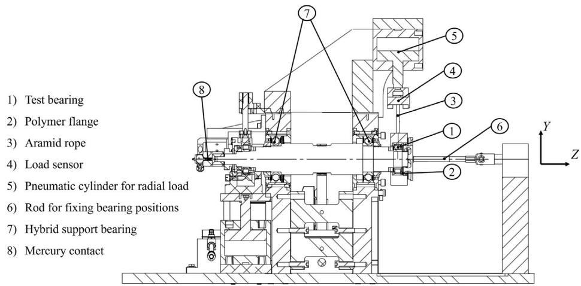  
(a)

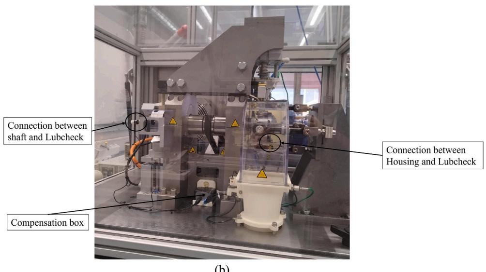  
(b)  
Fig. 1. (a) Sectional view of the cylindrical roller bearing test rig. (b) Photo of the test rig showing the connection of the Lubcheck device with the inner ring (via the shaft) and the outer ring (via the housing).

Owing to centrifugal force, the roller is assumed to remain in contact with the outer ring throughout its motion. Accordingly, the gap between the roller and the outer ring is evaluated using a fully flooded film thickness model $\left( \operatorname { E q } . \left( 9 \right) \right)$ with the force equal to the sum of the centrifugal force and the circumferential contact force distribution. Given there is no load-induced contact force in the unloaded zone, only the effect of the centrifugal force exists in that zone.

The gap between the roller and the inner ring is determined using different approaches for the loaded and unloaded zones. In the loaded zone, where the contact force is non-zero, the gap is defined by the fully flooded film thickness, calculated using the local contact force. In the unloaded zone, the gap between the roller and the inner ring is governed by the bearing’s radial clearance, due to the displacement of the rollers towards the outer ring by centrifugal force, and the elastic deformations of the roller and rings at the maximum contact force position.

## 2.4. Electrical capacitance model of the bearing experiment

The total capacitance measured using Lubcheck includes both the background capacitance—the parasitic capacitance originating from surrounding components and cables—of the test rig and the capacitance from the steel rolling element-ring interfaces inside the bearing. The latter consists of the roller–inner ring capacitance $C _ { \mathrm { I R } }$ and the roller–outer ring capacitance $C _ { \mathrm { O R } } .$ , connected in series. The equivalent electrical circuit for a cylindrical roller bearing with one steel roller and a polymer cage is shown in Fig. 3. The total (or equivalent) capacitance is given by:

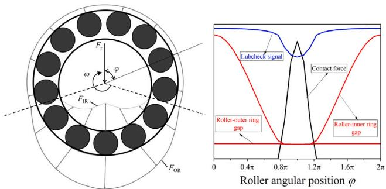  
Fig. 2. Schematic illustration of load distribution in a radially loaded cylindrical roller bearing (CRB), showing the theoretical gap distribution together with the Lubcheck voltage signal. The roller–inner ring gap in the loaded zone (with non-zero contact force) and the roller-outer ring gap (in the loaded zone where the load is given by the combination of contact force and centrifugal force, in the unloaded zone where the load is only the centrifugal force) correspond to the film thickness estimated using the Dowson–Toyoda equation (Eq. (9)), while that for the roller–inner ring in the unloaded zone (with zero contact force) is primarily due to the bearing’s radial clearance. The estimated values are excluded from the vertical axis to emphasize the qualitative nature of this plot.

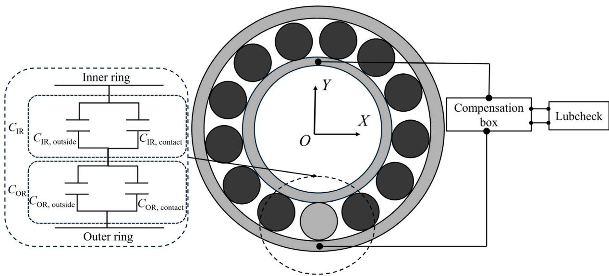  
Fig. 3. Schematic representation of the cylindrical roller bearing (CRB) with 12 ceramic rollers and one steel roller, and its connection to Lubcheck, along with the equivalent electrical capacitance circuit for the steel roller-raceway contacts.

$$
C _ { \mathrm { t o t a l } } = { \frac { 1 } { { \frac { 1 } { C _ { \mathrm { I R } } } } + { \frac { 1 } { C _ { \mathrm { O R } } } } } } + C _ { \mathrm { b g } }\tag{3}
$$

where $C _ { \mathrm { b g } }$ is the background capacitance of the test rig, pre-measured with a base oil-lubricated hybrid bearing consisting of a steel inner ring, a steel outer ring, and all ceramic rollers. Under this configuration, no electrical conduction or EHL contact capacitance is present at the roller–raceway interfaces. Therefore, the measured capacitance originates solely from the surrounding components, cabling, and measurement electronics. Capacitance was measured over the same ranges of load and rotational speed as in the bearing tests with one steel roller. The measurements showed a constant background capacitance, independent of load and speed. The measured background Lubcheck voltage is 5.98 V, corresponding to $C _ { \mathrm { b g } } ^ { } = \mathbf { \nabla } 6 7 . 2 2 { \mathbf { p F } }$ . This value is subtracted from the total capacitance measured during the actual film thickness tests. The remaining signal thus corresponds exclusively to the capacitance generated at the rolling element-raceway contacts.

In grease-lubricated conditions, starvation influences the film thickness and alters the electrical characteristics of the elasto-hydrodynamic (EHL) contact. Fig. 4a shows the side view of a single lubricated contact in the CRB. The top projections are shown in Fig. 4b and c: Fig. 4b illustrates the contact under fully flooded condition, while Fig. 4c depicts the same contact under starved condition. The contact area is modeled as a Hertzian contact, reflecting the rectangular/line contact shape in CRBs [2]. It is evident that the total capacitance is influenced not only by the contact region but also by the capacitance of the inlet, outlet, and side regions. We define the combined capacitance from these non-contact regions as the outside capacitance. The capacitance at each of the roller–ring interface $C _ { \mathrm { I R } }$ or $C _ { \mathrm { O R } }$ is therefore the sum of the Hertzian contact capacitance $C _ { \mathrm { { c o n t a c t } } }$ and the outside capacitance $C _ { \mathrm { o u t s i d e } }$

$$
C _ { \mathrm { I R / O R } } = C _ { \mathrm { c o n t a c t } } + C _ { \mathrm { o u t s i d e } }\tag{4}
$$

Although the film thickness in the Hertzian contact is not uniform, the effect on capacitance is minimal, as noted by Schneider et al. [10].

Thus, it is neglected in the present analysis. The relationship between contact capacitance and the central film thickness $h _ { \mathrm { c } }$ is then given, via Eq. (1), by:

$$
C _ { \mathrm { c o n t a c t } } = \iint _ { A _ { \mathrm { H z } } } \frac { \varepsilon _ { 0 } \varepsilon _ { \mathrm { r } } ( p , T ) } { h _ { c } } \mathrm { d } x \mathrm { d } y = 4 \int _ { 0 } ^ { l _ { \mathrm { e } } / 2 } \int _ { 0 } ^ { a } \frac { \varepsilon _ { 0 } \varepsilon _ { \mathrm { r } } ( p , T ) } { h _ { c } } \mathrm { d } x \mathrm { d } y\tag{5}
$$

where $A _ { \mathrm { H z } }$ is the Hertzian contact area. Owing to geometric symmetry, only one quarter of the contact area is integrated, then multiplied by four. The integral limits defining the contact area $( x ~ \in ~ [ 0 , a ] , ~ y ~ \in$ $\left[ 0 , { l _ { \mathrm { e } } } / 2 \right] )$ are as labeled in Fig. 4.

In the outside region, Fig. 4 shows that the overall separation between the roller and each ring is the sum of the thicknesses of the oil layers deposited on the surfaces and the geometric gap between the oil layers. This oil layer thickness has been estimated to be half of the central film thickness [13]. This gives the total separation in the outside region as $0 . 5 h _ { c } + h _ { \mathrm { g a p } } + 0 . 5 h _ { c } = h _ { c } + h _ { g a p } .$ . When $h _ { \mathrm { g a p } }$ is filled with oil, the region is fully flooded. When $h _ { \mathrm { g a p } }$ is filled with air, the region is tagged ‘‘cavitation’’. For application to both fully flooded and starved lubrication conditions, the latter involving air at the inlet, the outside capacitance for each roller-ring interface is:

$$
C _ { \mathrm { o u t s i d e } } = C _ { \mathrm { f l } } + C _ { \mathrm { c a v } }\tag{6}
$$

where

$$
\begin{array} { l } { { \displaystyle C _ { \mathrm { f l } } = \iint _ { A _ { \mathrm { f l } } } \frac { \varepsilon _ { 0 } \varepsilon _ { \mathrm { r } } ( p , T ) } { h _ { \mathrm { c } } + h _ { \mathrm { g a p } } ( x , y ) } \mathrm { d } x \mathrm { d } y } } \\ { ~ = 2 C _ { 1 } + 4 C _ { 2 } } \\ { ~ = 2 \int _ { 0 } ^ { l _ { \mathrm { e } } / 2 } \int _ { a } ^ { \bar { x } } \frac { \varepsilon _ { 0 } \varepsilon _ { \mathrm { r } } ( p , T ) } { h _ { \mathrm { c } } + h _ { \mathrm { g a p } } ( x , y ) } \mathrm { d } x \mathrm { d } y }  \\ { { \displaystyle ~ + 4 \int _ { l _ { \mathrm { e } } / 2 } ^ { l _ { \mathrm { r o l l e r } } / 2 } \int _ { 0 } ^ { R _ { \mathrm { r o l l e r } } } \frac { \varepsilon _ { 0 } \varepsilon _ { \mathrm { r } } ( p , T ) } { h _ { \mathrm { c } } + h _ { \mathrm { g a p } } ( x , y ) } \mathrm { d } x \mathrm { d } y } } \end{array}\tag{7}
$$
> *(추출이 깨진 줄 — 원문 p.4 대조로 복구)*

is the contribution from the fully flooded region (with $h _ { \mathrm { g a p } }$ filled with oil). As shown in Fig. 4(b) and (c), this orange-colored region is subdivided into several parts for convenience of integration. With symmetry, $C _ { 1 }$ and $C _ { 2 }$ define the identical regions for each half and each quarter, respectively, in that region. In the fully flooded case, $\bar { x } = x ^ { \star }$

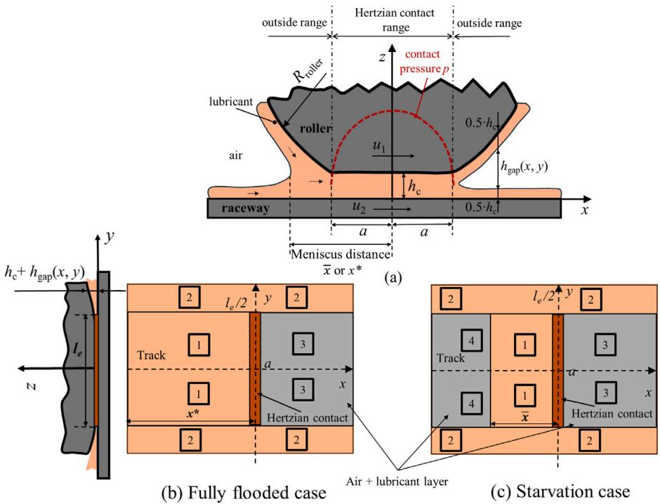  
Fig. 4. Simplified EHL contact conditions in a single roller-ring contact inside a CRB . (a) Side view of a single contact, (b) the fully flooded case, and (c) the starved case. The dark orange area is the Hertzian contact area. The light orange area is the portion of the outside region filled with lubricant, and the gray area is the ‘‘cavitation’’ region.

$$
\begin{array} { l } { C _ { \mathrm { c a v } } = \displaystyle { \iint _ { A _ { \mathrm { c a v } } } \frac { \varepsilon _ { 0 } } { \frac { h _ { \mathrm { c } } } { \varepsilon _ { \mathrm { r } } ( p , T ) } + \frac { h _ { \mathrm { g a p } } ( x , y ) } { \varepsilon _ { \mathrm { a i r } } } } \mathrm { d } x \mathrm { d } y } } \\ { = 2 C _ { 3 } + 2 C _ { 4 } } \\ { = 2 \displaystyle { \int _ { 0 } ^ { l _ { \mathrm { e } } / 2 } \int _ { a } ^ { R _ { \mathrm { r o l l e r } } } \frac { \varepsilon _ { 0 } } { \frac { h _ { \mathrm { c } } } { \varepsilon _ { \mathrm { r } } ( p , T ) } + \frac { h _ { \mathrm { g a p } } ( x , y ) } { \varepsilon _ { \mathrm { a i r } } } } \mathrm { d } x \mathrm { d } y } } \\ { + 2 \displaystyle { \int _ { 0 } ^ { l _ { \mathrm { e } } / 2 } \int _ { \bar { x } } ^ { R _ { \mathrm { r o l l e r } } } \frac { \varepsilon _ { 0 } } { \frac { h _ { \mathrm { c } } } { \varepsilon _ { \mathrm { r } } ( p , T ) } + \frac { h _ { \mathrm { g a p } } ( x , y ) } { \varepsilon _ { \mathrm { a i r } } } } \mathrm { d } x \mathrm { d } y } } \end{array}\tag{8}
$$
> *(추출이 깨진 줄 — 원문 p.5 대조로 복구)*

is the contribution from the ‘‘cavitation’’ region (with $h _ { \mathrm { g a p } }$ filled with air as depicted by the gray regions in Fig. 4(b) and (c)). The meniscus position $\bar{x}$ therefore serves as the quantitative boundary between the fully flooded and cavitated regions. In the cavitated region, the capacitance is modeled as two layers of the dielectric in series (lubricant and air). For the fully flooded case, $C _ { 4 } = 0$ . The strategy for selecting the calculation boundaries (i.e., integration limits) is described in Section 2.4.1. The fully flooded central film thickness $h _ { \mathrm { c } }$ in these equations is estimated using the Dowson–Toyoda formulation [14], accounting for lubricant compressibility:

$$
h _ { \mathrm { c } } = 3 . 0 6 \cdot R ^ { \prime } \cdot \left( \alpha \cdot E ^ { \prime } \right) ^ { 0 . 5 6 } \cdot \left( { \frac { \eta _ { \mathrm { 0 } } \cdot u _ { \mathrm { m } } } { E ^ { \prime } \cdot R ^ { \prime } } } \right) ^ { 0 . 6 9 } \cdot \left( { \frac { F } { l _ { \mathrm { e } } \cdot E ^ { \prime } \cdot R ^ { \prime } } } \right) ^ { - 0 . 1 } \cdot { \overline { { \rho } } } ^ { - 1 }\tag{9}
$$

where $R ^ { \prime }$ is the reduced radius of the contact, $\alpha$ is the pressure–viscosity coefficient, $E ^ { \prime }$ is the reduced Young’s modulus, $\begin{array} { r } { u _ { \mathrm { { m } } } ~ = ~ \frac { u _ { 1 } + u _ { 2 } } { 2 } } \end{array}$ is the entrainment velocity, $F$ is the contact load, $l _ { \mathrm { e } }$ is the effective contact length, $\eta _ { 0 }$ is the base oil dynamic viscosity at ambient pressure, and $\overline{\rho}$ is the compressibility factor obtained as $\begin{array} { r } { \overline { { \rho } } \tilde { ( } p _ { \mathrm { h } } , T ) = \frac { \rho ( p _ { \mathrm { h } } , \hat { T } ) } { \alpha } } \end{array}$ . The density, which varies with pressure and temperature, is calculated as [15]

$$
\rho \left( p , T \right) = \rho _ { 0 } \cdot { \left( 1 + \frac { 0 . 6 \cdot 1 0 ^ { - 9 } p } { 1 + 1 . 7 \cdot 1 0 ^ { - 9 } p } - 0 . 0 0 0 6 5 \left( T - T _ { 0 } \right) \right) }\tag{10}
$$

where $\rho _ { 0 }$ is the density at ambient pressure and reference temperature $T _ { 0 } .$ . Given, the crowned profile of the roller, the peak pressure is obtained from the numerical ‘‘slicing’’ method detailed in [16–18]. The

pressure distribution $p$ in the contact is given by

$$
p = p _ { \mathrm { h } } \cdot { \sqrt { 1 - \left( { \frac { x } { a } } \right) ^ { 2 } } }\tag{11}
$$

To account for the temperature influence on viscosity, the kinematic viscosity of the base oil is calculated using Walther’s equation [19]:

$$
\log _ { 1 0 } \left( \log _ { 1 0 } \left( \upsilon _ { \mathrm { c s t } } + B \right) \right) = K + c \log _ { 1 0 } T\tag{12}
$$

where $B$ is a constant. For oil, $B$ = 0.7. The constants $c$ and $K$ are calculated from the known viscosities of the oil at two different temperatures via

$$
c = \frac { \log _ { 1 0 } { \left( \log _ { 1 0 } { \left( v _ { \mathrm { c s t 1 } } + B \right) } \right) } - \log _ { 1 0 } { \left( \log _ { 1 0 } { \left( v _ { \mathrm { c s t 2 } } + B \right) } \right) } } { \log _ { 1 0 } { T _ { 2 } } - \log _ { 1 0 } { T _ { 1 } } }\tag{13}
$$

$$
K = \log _ { 1 0 } { \left( \log _ { 1 0 } { \left( \upsilon _ { \mathrm { c s t } 1 } + B \right) } \right) } + c \log _ { 1 0 } { T _ { 1 } }\tag{14}
$$

A factor proposed by Jackson [20] for line contacts is used to correct the film thickness for inlet shear heating effects:

$$
C _ { \mathrm { T } } = \frac { h _ { \mathrm { t h e r m a l } } } { h _ { \mathrm { i s o t h e r m a l } } } = \frac { 3 . 9 4 } { 3 . 9 4 + \left( \frac { \eta _ { \mathrm { 0 } } ~ \beta ~ u _ { \mathrm { m } } ^ { 2 } } { \lambda } \right) ^ { 0 . 6 2 } } \quad ,\tag{15}
$$

where $C _ { \mathrm { T } }$ is the correction factor, $\lambda$ is the thermal conductivity of the lubricant, and $\beta$ is the temperature-viscosity coefficient obtained from Roelands’ viscosity equation.

To calculate the capacitance at the sides of the contacts, we assume that the lubricant fills the gaps between the roller and the bearing rings up to the edges of the roller. In the cavitation region, capacitance is calculated up to a predefined boundary. This calculation boundary is selected such that further increase has a negligible effect on capacitance, as discussed in Section 2.4.1. The gap $h _ { \mathrm { g a p } }$ between the roller and the inner/outer ring outside the contact region is defined as:

$$
\begin{array} { c l l } { { h _ { \mathrm { g a p } } \left( x , y \right) = \displaystyle \frac { x ^ { 2 } - a ^ { 2 } } { 2 R ^ { \prime } } + z _ { \mathrm { r o l l e r } } \left( y \right) + z _ { \mathrm { i n n e r / o u t e r } } \left( y \right) , \left| x \right| \in \left( 0 , R _ { \mathrm { r o l l e r } } \right) , } } \\ { { \left| y \right| \in \left( 0 , l _ { \mathrm { r o l l e r } } / 2 \right) } } \end{array}\tag{16}
$$

where $z _ { \mathrm { r o l l e r } } \left( y \right)$ and $z _ { \mathrm { i n n e r / o u t e r } } \left( y \right)$ represent the surface profile generatrix in the $y$-direction for the roller and the inner/outer ring, respectively. Substituting Eqs. (4)–(8) into Eq. (3) yields the total capacitance:

$$
\begin{array} { r l } & { C _ { \mathrm { t o t a l } } = \left[ \left( \iint _ { A _ { \mathrm { H z } } } \frac { \varepsilon _ { 0 } \varepsilon _ { \mathrm { r } } \mathrm { d } x \mathrm { d } y } { h _ { \mathrm { c } } } + \iint _ { A _ { \mathrm { f l } } } \frac { \varepsilon _ { 0 } \varepsilon _ { \mathrm { r } } \mathrm { d } x \mathrm { d } y } { h _ { \mathrm { c } } + h _ { \mathrm { g a p } } } + \iint _ { A _ { \mathrm { c a v } } } \frac { \varepsilon _ { 0 } \mathrm { d } x \mathrm { d } y } { \frac { h _ { \mathrm { c } } } { \varepsilon _ { \mathrm { r } } } + \frac { h _ { \mathrm { g a p } } } { \varepsilon _ { \mathrm { a i r } } } } \right) ^ { - 1 } _ { \mathrm { I R } } } \\ & { \qquad + \left( \iint _ { A _ { \mathrm { H z } } } \frac { \varepsilon _ { 0 } \varepsilon _ { \mathrm { r } } \mathrm { d } x \mathrm { d } y } { h _ { \mathrm { c } } } + \iint _ { A _ { \mathrm { f l } } } \frac { \varepsilon _ { 0 } \varepsilon _ { \mathrm { r } } \mathrm { d } x \mathrm { d } y } { h _ { \mathrm { c } } + h _ { \mathrm { g a p } } } + \iint _ { A _ { \mathrm { c a v } } } \frac { \varepsilon _ { 0 } \mathrm { d } x \mathrm { d } y } { \frac { h _ { \mathrm { c } } } { \varepsilon _ { \mathrm { r } } } + \frac { h _ { \mathrm { g a p } } } { \varepsilon _ { \mathrm { a i r } } } } \right) ^ { - 1 } _ { \mathrm { O R } } \right] ^ { - 1 } } \\ & { \qquad + C _ { \mathrm { b g } } } \end{array}\tag{17}
$$
> *(추출이 깨진 줄 — 원문 p.6 대조로 복구)*

With $C _ { \mathrm { t o t a l } }$ measured, the unknown parameter on the right-hand side of Eq. $( 1 7 ) { - } \varepsilon _ { \mathrm { r } }$ when using calibration data from base oil test, and $h _ { \mathrm { c } }$ when using actual test data with grease—can be evaluated iteratively. Note that in each region—the Hertzian contact region or the outside region—the relative permittivity $\varepsilon _ { \mathrm { r } }$ is a function of pressure and temperature in that region. Next, we establish the overall domain limits for our computations, i.e., the upper boundaries of the outside region.

## 2.4.1. Selecting the integration limits

To establish the calculation domain boundaries demarcating the limits of the outside region under consideration (in both $x$- and $y$- directions) used in Eqs. (7) and (8) integrals, the computation results in Fig. 5 are considered. Fig. 5 shows the variation in the estimated roller–inner ring capacitance (solid curves) with increasing $x$-direction boundary of the calculation domain (between the contact center and the $x$-direction limit of the outside region) using the properties of Li/SS-40-2.5 grease, at $3 5 ^ { \ \circ } \mathrm { C } ,$ , under loads of 500 N $( a _ { \mathrm { I R } } = 6 6 . 1 \mu \mathrm { m } , l _ { \mathrm { I R , e } } / 2 =$ 2.9 mm, $p _ { \mathrm { I R , h } } = 1 . 0 3$ GPa, $R _ { \mathrm { r o l l e r } } = 6 8 a _ { \mathrm { I R } } )$ and 1000 N $( a _ { \mathrm { I R } } = 8 6 . 3$ μm, $l _ { \mathrm { I R , e } } / 2 = 3 . 3$ 3 mm, $p _ { \mathrm { I R , h } }$ = 1.35 GPa, $R _ { \mathrm { r o l l e r } } = 5 2 a _ { \mathrm { I R } } )$ , at speeds of 1000 rpm and 5000 rpm—representing the operating conditions in the subsequent measurements. An arbitrary value of relative permittivity may be used to determine the calculation boundaries; however, in this case, the value $\varepsilon _ { \mathrm { r 0 } } ~ = ~ 2 . 5 3$ , obtained from a later calibration measurement, is applied. In Fig. 5, the calculated capacitance values initially rise steeply as the normalized $x$ dimension $\left( x / a \right)$ increases, then level off. Based on these results, the integration limit in the $x$-direction is set to the roller radius $R _ { \mathrm { r o l l e r } } .$ , while in the $y$-direction, it extends to the edges of the cylindrical roller $l _ { \mathrm { r o l l e r } } / 2 .$ . These geometric boundaries are selected for simplicity and consistency. The normalized capacitance—the ratio of the capacitance at a given distance to the capacitance at the selected calculation boundary—is also shown in the plot as the dashed curves.

During the calibration step in the experiments, it is assumed that the inlet region (the gap between the Hertzian contact edge and the calculation boundary $\left( | l _ { \mathrm { e } } | / 2 \le | y | \le | l _ { \mathrm { r o l l e r } } | / 2 \right) \}$ is fully filled/flooded with lubricant, as depicted in Fig. 4b.

## 2.5. Calibration: determining the effective relative permittivity

Section 2.3 details the steps needed to evaluate the right-hand side of Eq. (17), excluding the relative permittivity $\varepsilon _ { \mathrm { r } } .$ . In this study, the base oil permittivity is used considering that any difference in permittivity between grease and base oil is mainly caused by the thickener. The permittivity of sheared grease has been reported to be very close to that of the base oil [3,21]. Moreover, during the bleeding phase— where the bearing primarily operates—the separated oil dominates the lubrication process. Therefore, it is reasonable to use the calibrated effective permittivity of the base oil when evaluating the film thickness in grease-lubricated bearings. Next, we describe a method for obtaining the effective relative permittivity from the bearing test rig. During this calibration test, a large amount of base oil is injected into the bearing to ensure fully flooded conditions for which Eq. (9) is valid.

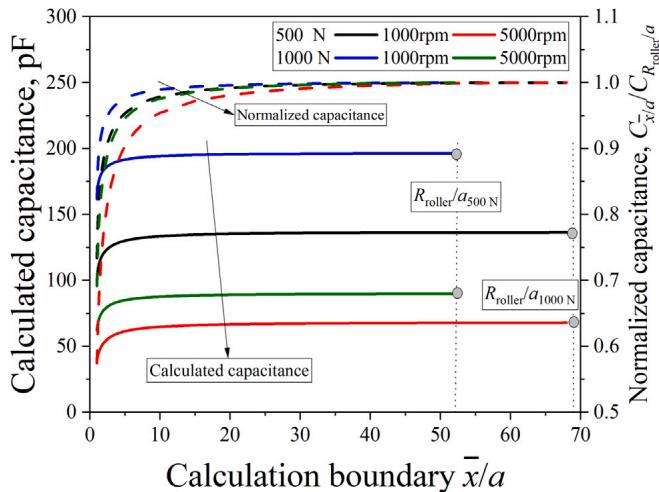  
Fig. 5. The calculated capacitance (solid curves) and the normalized capacitance (dashed curves) at the roller–inner ring contact as the integration limit in the $x$ direction (here referred to as calculation boundary) is increased. Calculations are performed under fixed conditions with Li/SS-40-2.5 grease (with $\varepsilon _ { \mathrm { r 0 } } = 2 . 5 3 )$ , loads of 500 N and 1000 N at rotational speeds of 1000 rpm and 5000 rpm. The corresponding central film thicknesses are 210 nm and 555 nm for 1000 rpm and 5000 rpm at 500 N, and 195 nm and 515 nm for 1000 rpm and 5000 rpm at 1000 N, respectively.

The relative permittivity $\varepsilon _ { \mathrm { r } }$ is dependent on both temperature and pressure. The Clausius–Mosotti equation is used to describe the pressure and temperature dependence inside the contact area:

$$
\varepsilon _ { \mathrm { r } } ( p , T ) = { \frac { \varepsilon _ { \mathrm { r 0 } } + 2 + 2 \cdot ( \varepsilon _ { \mathrm { r 0 } } - 1 ) \cdot \rho ( p , T ) / \rho _ { 0 } } { \varepsilon _ { \mathrm { r 0 } } + 2 - ( \varepsilon _ { \mathrm { r 0 } } - 1 ) \cdot \rho ( p , T ) / \rho _ { 0 } } }\tag{18}
$$

where $\varepsilon _ { \mathrm { r 0 } }$ is the ambient relative permittivity. In Eq. (18), the pressure (inside or outside the contact) is first determined, then the pressureand temperature-dependent density $\rho ( p , T )$ is evaluated via Eq. (10). Inside the contact, the pressure is considered Hertzian. Outside the contact, the pressure is considered ambient. Substitute Eq. (18) into Eqs. $( 5 ) , ( 7 ) ,$ , and (8), and the only unknown parameter left to evaluate the right-hand side of Eq. (17) is the ambient relative permittivity $\varepsilon _ { \mathrm { r 0 } } .$ Substitute the measured capacitance value during the calibration test (with fully flooded base oil) into the left-hand side of Eq. (17) and simply solve for $\varepsilon _ { \mathrm { r 0 } }$

Ideally, the ambient relative permittivity $\varepsilon _ { \mathrm { r 0 } }$ is a material property determined at standard conditions using standard equipment. However, to adjust for the real-world dynamics-induced differences between the measured capacitance substituted into the left-hand side of Eq. (17) and the analytically calculated capacitance on the right hand side, we here calibrate $\varepsilon _ { \mathrm { r 0 } }$ using the bearing rig itself. Hence, in this study, $\varepsilon _ { \mathrm { r 0 } }$ is a system parameter henceforth referred to as the effective ambient relative permittivity. It is related to the intrinsic true value $\varepsilon _ { \mathrm { r 0 , t r u e } }$ via $\varepsilon _ { \mathrm { r 0 } } = k \cdot \varepsilon _ { \mathrm { r 0 , t r u e } } ;$ , where $k$ is a correction factor including the influence of pressure, film thickness shape, and other calibration factors. For example, by assuming Hertzian contact pressure and ambient pressure outside the contact area, the pressure build-up in the inlet and secondary pressure peaks within the contact—both of which vary with load at a fixed speed—are neglected. The film thickness is also assumed to be uniform across the contact. However, this assumption is more valid under heavier loads, where the calibrated relative permittivity more closely reflects the published true value for the base oil. Under mild loads at the same speed, the film thickness varies considerably across the contact area in the rolling direction. Due to the uniform film assumption, the effective ambient relative permittivity $\varepsilon _ { \mathrm { r 0 } }$ tends to be underestimated at lower loads at a given speed.

## 2.6. From capacitance to film thickness: evaluating the film thickness

With the calibrated effective relative permittivity from the previous step, the unknown film thickness in the grease-lubricated contacts can be evaluated from measured capacitance. There are two key scenarios in grease-lubricated CRBs:

## 2.6.1. Fully flooded lubrication

Here, the film may be formed by either the base oil alone or a combination of the base oil and thickener. If only the base oil contributes, the measured film thickness closely matches the predicted values using base oil properties. However, if both the base oil and thickener contribute, the measured film thickness is expected to be equal to or greater than the base oil predictions.

In the fully flooded case, we need to determine two unknowns, the central film thicknesses at both roller-ring interfaces $h _ { \mathrm { c , I R } }$ and $h _ { \mathrm { c , O R } } .$ Assuming the same temperature, viscosity and entrainment velocity for both contacts, ignoring the centrifugal force on the roller, the correlation between the film thicknesses of the inner and outer rings remains consistent with that observed under fully flooded conditions, determined via Eq. (9). Thus, the relationship between $h _ { \mathrm { c , O R } }$ and $h _ { \mathrm { c , I R } }$ depends on geometry and load as given in Eq. (19):

$$
\frac { h _ { \mathrm { c , O R } } } { h _ { \mathrm { c , I R } } } = \left( \frac { R _ { \mathrm { O R } } ( R _ { \mathrm { I R } } + R _ { \mathrm { r o l l e r } } ) } { R _ { \mathrm { I R } } ( R _ { \mathrm { O R } } - R _ { \mathrm { r o l l e r } } ) } \right) ^ { 0 . 4 1 } \cdot \frac { \rho ( p _ { \mathrm { h , I R } } ) } { \rho ( p _ { \mathrm { h , O R } } ) }\tag{19}
$$

Then, all the variables in Eq. (17)—including the calibrated effective ambient permittivity $\varepsilon _ { \mathrm { r 0 } }$ (via Eq. (18)) and measured total capacitance $C _ { \mathrm { t o t a l } } { - } \mathrm { a r e }$ known, except the inner ring central film thickness $h _ { \mathrm { c , I R } }$ . To iteratively solve Eq. (17), an initial estimate is required for the inner ring film thickness. While any value can be used as an initial guess, faster convergence could be achieved by using the Dowson–Toyoda equation (Eq. (9)) for the initial estimate.

When fully flooded, the meniscus distance $\bar{x}$ is assumed to extend to the fully flooded meniscus position $x ^ { * }$ (i. e., the inlet is fully filled with lubricant), as shown in Fig. 4b. The dimensionless meniscus distance at the fully flooded boundary $m ^ { * } = x ^ { * } / a$ is obtained as [22]:

$$
m ^ { * } = 1 + 7 . 7 9 4 \left[ \left( \frac { R ^ { \prime } } { a } \right) ^ { 2 } \frac { h _ { \mathrm { c f f } } } { R ^ { \prime } } \right] ^ { 2 / 3 }\tag{20}
$$

## 2.6.2. Starved lubrication

Dmytrychenko et al. [22] derived a relation for evaluating starved film thickness $h _ { c }$ when the inlet meniscus distance $\bar{x}$ (i. e., the distance from the contact center to the meniscus position) is known:

$$
h _ { \mathrm { c } } = h _ { \mathrm { c f f } } \bigg ( \frac { m - 1 } { m ^ { * } - 1 } \bigg ) ^ { 0 . 1 7 } , m \leq m ^ { * }\tag{21}
$$

where the starvation dimensionless meniscus distance $m = { \bar { x } } / a .$

Hence, in the starved case, the unknowns are the corresponding inlet meniscus distances in the roller-ring contacts $\bar { x } _ { \mathrm { I R } }$ and $\bar { x } _ { \mathrm { O R } }$ . After prolonged operation, the lubricant on the inner and outer rings is assumed to equilibrate [13], allowing the continued use of the loaddependent geometric relationship between both ring film thicknesses (Eq. (19)). This simplifies the analysis, with primary focus on one roller-ring interface.

Then, the only unknown in Eq. (17) is the meniscus distance $\bar { x } _ { \mathrm { I R } }$ which can be solved iteratively using an initial estimate. An appropriate value such as $\bar { x } _ { \mathrm { { I R } } } = x _ { \mathrm { { I R } } } ^ { \ast }$ can be used as an initial guess.

## 3. Experimental results and discussion

This section details and analyzes the results of the experiments. Given the established relationship between the roller–inner ring and roller-outer ring film thicknesses (Eq. (19)), only the roller–inner ring film thickness results are presented here, for brevity.

3.1. The effect of misalignment on the contact force distribution in cylindrical roller bearings

In this study, the test bearing contains one steel roller and 12 ceramic rollers. As shown in Fig. 2, since Lubcheck only detects capacitance associated with the steel roller which runs from the unloaded to the loaded zone and back in one revolution, the Lubcheck voltage signal $V _ { \mathrm { c a p } }$ drops (i. e., capacitance $C _ { \mathrm { t o t a l } }$ rises) as contact force increases, and vice versa.

Fig. 6 presents the calculated contact force of the steel roller at different angular positions (the red and black profiles) [23], together with the median circumferential Lubcheck voltage signals from three repeated measurements (the orange and blue curves). However, unlike the matching profiles in Figs. 2, 6 shows that the calculated loaded zone without bearing misalignment using radial clearance $p _ { \mathrm { d } } = 7 0 \mu \mathrm { m }$ (red profile) is narrower than the loaded zone indicated by the measured Lubcheck voltage signals.

The discrepancy between the calculated and measured loaded zone is attributed to bearing misalignment. In an actual bearing, angular misalignment between the inner and outer rings in the $XZ$ plane (about the $Y$-axis, using the axes orientation shown in Figs. 1 and 3) can increase the loaded zone for the same radial clearance [24]. In our investigations, bearing dynamic simulations revealed that an angular misalignment of 0.4◦ in the $XZ$ plane about the $Y$-axis results in a calculated loaded zone (black line in Fig. 6) whose width matches the Lubcheck voltage profiles. Furthermore, the computations indicated that the impact of this misalignment on capacitance is anticipatorily negligible.

Before arriving at the above mechanistic explanation, we systematically evaluated and eliminated alternative explanations:

• First, the flexibility of the outer ring and its deformation due to the structural support on the bearing housing were examined. When outer ring deformation was included in the calculation, the predicted loaded zone shrank, further disagreeing with the experimental observations. This, therefore, cannot explain the enlarged loaded zone measured.

• Secondly, the influence of radial clearance was investigated. Para- metric calculations showed that a reduced clearance of approximately 10–15 μm would be required to obtain good agreement between the calculated loaded zone and the measured film thickness signal. However, such a small clearance is inconsistent with the measured test bearing geometry’s radial clearance of 70 μm.

• Finally, bearing misalignment was investigated in two orthogonal directions, about the $Y$ axis—described in the previous paragraph and selected as the most probable mechanism—and about the $X$- axis, described as follows: when misalignment angles up to $0 . 7 ^ { \circ }$ were applied about the $X$-axis (refer to the axes orientation in Figs. 1 and 3), the predicted loaded zone remained smaller than the measured. Moreover, bearing misalignment in this orientation would induce roller tilting at the position of maximum contact force and a characteristic ‘‘w’’-shaped film thickness signal in the unloaded zone, similar to observations reported for hybrid-loaded deep groove ball bearings by Shetty, et al. [25]. Such roller tilting would also be expected to produce asymmetric wear bands on the raceways after prolonged operation. In our experiments, neither a ‘‘w’’-shaped signal in the unloaded zone nor asymmetric wear on the ring was observed, allowing this misalignment direction to be excluded.

After excluding outer ring deformation, radial clearance variations, and other bearing misalignment orientations, we concluded that angular misalignment of the bearing about the vertical ($Y$) axis (using the axes orientation in Figs. 1 and 3) is the only mechanism that can satisfactorily explain the discrepancy between the widths of the calculated and measured loaded zones.

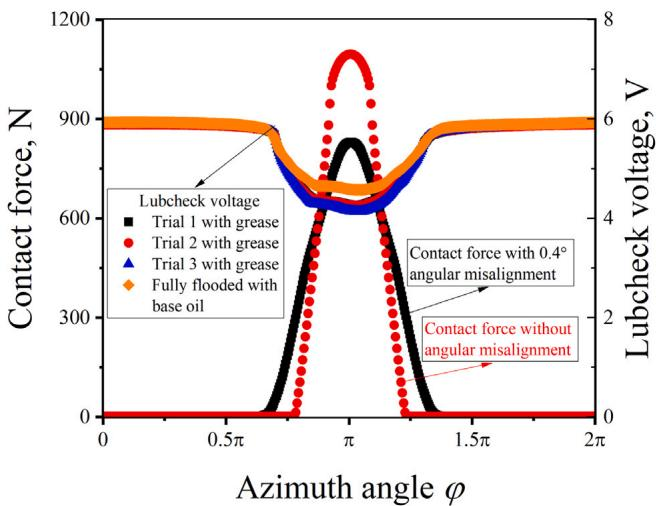  
Fig. 6. Circumferential distribution of the theoretical steel roller–inner ring contact force and repeated measurements of Lubcheck voltage. The red dots show the force without bearing angular misalignment; the black profile is with 0.4◦ angular misalignment in the $XZ$-plane of Fig. 1 (i.e., about the Y-axis). The other profiles are Lubcheck voltage signals. Load: 2000 N, and speed: 3000 rpm. The loaded zone identified from repeated experimental measurements is consistent across trials and is wider than the theoretical zero-misalignment loaded zone. However, it matches the theoretical 0.4◦-misaligned loaded zone in width.

## 3.2. Calibration for the effective ambient relative permittivity

Here, the base oil of Li/SS-40-2.5 grease is used in speed sweep measurements under a load of 2000 N at $3 5 ^ { \circ } \mathrm { C }$ , ensuring fully flooded lubrication within the bearing. For each operating condition, data is continuously recorded at a frequency of 10 kHz for 30 min.

Fig. 7 presents the calibration values of permittivity at the highest loaded circumferential location at various speeds. Each cyan violin represents the distribution of permittivity converted from instantaneous measurements collected over a half-hour duration at a fixed rotational speed. The height (or vertical extent) of the violin indicates the overall range of the measured values, while the width (or horizontal extent) reflects the mode, $\mathrm { i . e . , }$ , the most frequent values in the dataset. The width distribution along the height of the violin shows the probability density of the data. The blue box inside each violin denotes the interquartile range (IQR), which contains 50% of the measured data during the half-hour test period.

## 3.2.1. Measurement reliability, statistical analysis, and the effect of speed on the stability of contact conditions

The distributions of the effective ambient relative permittivity in Fig. 7 indicate the dynamic nature of the contact conditions. The results show that the distributions at all speeds are asymmetric, with more data points lying above the interquartile range than below. This distribution skewness may be attributed to lower values of film thickness in the contact area compared to the analytically predicted fully flooded value. A thinner film leads to a higher effective permittivity value relative to the nominal value. For the oil-lubricated CRBs used in the calibration, reduced film thickness (corresponding to large $\varepsilon _ { r 0 }$ in the figure) may result from random roller dynamic motion and local film breakdown induced by surface roughness.

Overall, the scatter observed across the entire speed range is primarily attributed to bearing dynamic effects. First, the tested CRB features an axial flange clearance of approximately 200 μm, which allows greater axial freedom of the rollers and leads to more pronounced dynamic behavior, compared with CRBs with smaller axial clearances [26] or deep groove ball bearings which feature smaller contact areas and better surface finish. The large axial clearance between the flanges facilitates random roller motions, thereby increasing dynamic disturbances. Secondly, at small rotational speed, the lubricant film thickness is comparable to or smaller than the combined surface roughness $( R _ { \mathrm { a } } =$ 109 nm), resulting in mixed lubrication with intermittent asperity interactions. Note that the length of the (line) contact in CRBs makes the capacitance measurements particularly susceptible to film inhomogeneity in the contact. These measurements are dominated by the thinnest gap between both surfaces at every instant. Consequently, even minor dynamic fluctuations can locally change the thinnest film, leading to the larger scattering observed in the measured signals. These combined interactions are potentially responsible for the increased scatter in the measurements at low speeds.

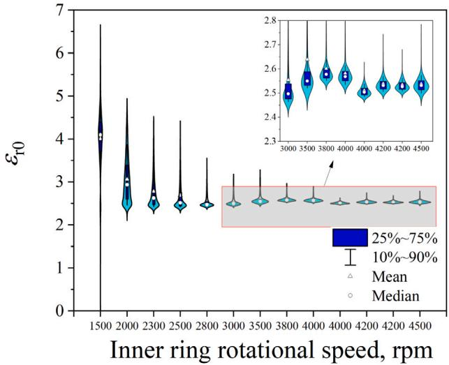  
Fig. 7. Violin plot of the effective permittivity calibrated from measured capacitance at different rotational speeds, using the base oil of Li/SS-40- 2.5 grease under a 2000 N load. Each violin represents the distribution of instantaneous measurements collected over a half-hour period at a fixed speed and load. The vertical extent indicates the full range of measured values, while the width distribution reflects the probability density. The blue box inside each violin denotes the interquartile range (IQR), containing 50% of the data. Large scattering at low speeds is due to increased susceptibility to surface roughness and contact dynamics.

In theory, the fully flooded condition represents the upper limit of the film thickness. Occasional larger film thickness values (low $\varepsilon _ { r 0 }$ values in the figure) may arise from temperature variations and random roller dynamics-induced transients. However, the influence of these factors appears significantly smaller than that of roughness-induced film breakdown. Consequently, a skewed distribution of the measured film thickness is anticipated. Due to this skewed distribution, the median is considered most representative of the predominant behavior.

As the rotational speed increases, the lubricant film thickness grows, reducing the influence of surface roughness by suppressing asperity interactions. The thicker film also acts as a buffer against bearing dynamics and misalignment-induced disturbances, leading to more stable contact conditions and a corresponding reduction in data scatter at higher speeds. As the speed increases, each dataset spread narrows to a specific range where the mean and median values nearly coincide—an indication of more stable films as speed increases. By taking the median value across different speed measurements, the calibrated effective ambient relative permittivity for the Li/SS-40-2.5 is determined to be $\varepsilon _ { \mathrm { r 0 } } = 2 . 5 3$

## 3.3. Churning phase

Grease film thickness is measured on the test bearing using Li/SS-40-2.5 grease with 30% of the free volume filled. The bearing undergoes a 90-hour run-in under a load of 2000 N and a speed of 4000 rpm to complete the grease churning phase. The data is sampled at 1 kHz in the churning phase. All subsequent film thickness measurements are conducted without replacing the grease or dismounting the bearing, so that the grease distribution is not significantly modified.

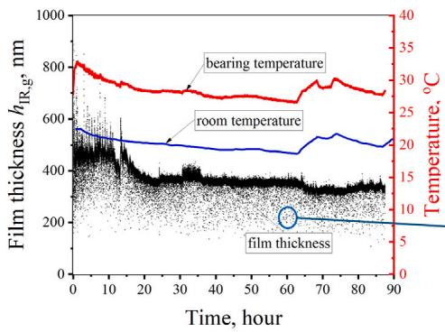  
(a)

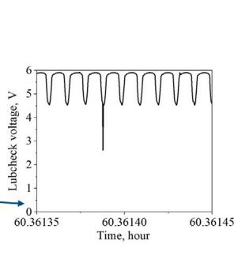  
(b)

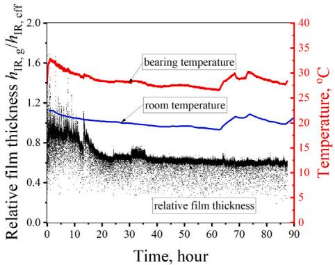  
(c)  
Fig. 8. (a) The roller–inner ring film thickness (black), outer ring temperature (red), and room temperature (blue), with inset showing (b) the raw Lubcheck voltage around the 60th hour. (c) The relative film thickness and temperatures. The data shows that film thickness is stable after about 20 h. Test: cylindrical roller bearing running under self-induced temperature with Li/SS-40-2.5 grease, load = 2000 N, rotational speed = 4000 rpm. Due to the asynchronous temperature signals from two different measurement sources, the anticipated time delays between the room temperature changes and the resulting bearing temperature responses are not shown.

Fig. 8 illustrates the variation of roller–inner ring film thickness (black plot) and outer ring temperature (red plot) together with the room temperature (blue plot) over time during the churning phase for the CRB at the highest loaded point. Changes in the room temperature are reflected in the bearing temperature. It can be observed that film thickness stabilizes after approximately 20 h. Initially, the film thickness is approximately 800 nm, with $h _ { \mathrm { g } } / h _ { \mathrm { c f f } } = 1 . 6$ indicating fully flooded conditions with the thickener contributing. Over time, the film thickness stabilizes at around 400 nm where $h _ { \mathrm { g } } / h _ { \mathrm { c f f } } \ = \ 0 . 6 ,$ indicating starvation. The steady-state phase is of primary interest here. The operating conditions are very mild and degradation is not taken into account. After the initial steep rise in temperature due to churning and re-distribution of the grease from the swept regions to the unswept regions, the temperature starts to decrease over a period of about 20 h beyond which it appears relatively stable until the 63rd hour when a $3 { - } 4 ~ ^ { \circ } \mathrm { C }$ rise occurs over the next 10 h, and ultimately drops gradually until the end of the test. Our laboratory room temperature data (blue plot in Fig. 8) shows the same trend during the second half of the test suggesting that this temperature variation recorded by our bearing thermocouples is potentially due to room temperature variations.

Fig. 8b shows a close-up of a portion of the film thickness signal where intermittent downward spike in film thickness indicates possible film breakdown and resulting metal-to-metal contact between the roller and the raceways.

## 3.4. Speed sweep measurement results at the highest loaded contact in the bearing

After the grease churning phase ends, film thickness measurements are carried out at a temperature of $3 5 ~ ^ { \circ } \mathrm { C } \pm 1 ~ ^ { \circ } \mathrm { C }$ under a constant load of 2000 N, across a range of speeds. Speed sweep measurements are repeated three times. For each operating condition, data is recorded continuously for one hour at a sampling frequency of 10 kHz. The film thickness at the highest loaded position is shown in the following results.

Fig. 9 presents the grease film thickness results—the (a) plot—and relative film thickness—the (b) plot—from the first set of speed sweep tests. The relative film thickness $h _ { \mathrm { I R , g } } / h _ { \mathrm { I R , c f f } }$ compares the measured film thickness $h _ { \mathrm { I R , g } }$ to the estimated fully flooded film thickness $h _ { \mathrm { I R , c f f } } ,$ thereby indicating the level of starvation. If $h _ { \mathrm { I R , g } } / h _ { \mathrm { I R , c f f } } < 1$ , the contact is starved. The data distribution in Fig. 9 follows a similar pattern to Fig. 7a, where the interquartile range (represented by the blue box) narrows with increasing speed up to 4000 rpm. It suggests that the deviation in the recorded Lubcheck voltage decreases with speed, verifying prior hypothesis that the film is more stable at higher speeds.

The general trends in scatter with rotational speed observed in Fig. 9 follow the same mechanisms discussed in Section 3.2.1 for the base oil results plotted in Fig. 7, including bearing dynamic effects, roller skew associated with the large axial flange clearance, and mixed lubrication at low speeds. In addition to these effects, the scattering at low speeds in Fig. 9 can be further attributed to grease thickener-related phenomena: at low speeds, the entrainment of the thickener into the contact can change the local film thickness, increasing the fluctuations in the measured capacitance signal. At higher speeds, the influence of the thickener becomes less pronounced as the lubricant film thickness increases, reducing the scatter at higher speeds.

Overall, the absolute film thickness $h _ { \mathrm { I R , g } }$ increases gradually with speed. In contrast, the median value of relative film thickness $h _ { \mathrm { I R , g } } / h _ { \mathrm { I R , c f f } }$ is almost stable. At 1500 rpm, the film thickness occasionally reaches fully flooded conditions, indicated by $h _ { \mathrm { I R , g } } / h _ { \mathrm { I R , c f f } } \geq 1$ in Fig. 9b. Majority of the relative film thickness values fall below 1, indicating that starved lubrication dominates.

To demonstrate the test repeatability, Fig. 10 compares the results from all three repeated tests at three selected speeds. Overall, good repeatability is evident in both the distribution shape and the consistency of the mean and median values. The instability in the first trial at 5000 rpm is potentially attributed to test rig vibration [27].

Fig. 11a presents the median film thickness results (the markers) from the three repeated speed sweep measurement trials, while Fig. 11b shows the corresponding median relative film thickness. Error bars represent the interquartile range for each test, and the smaller markers indicate the minimum film thickness from the time series data recorded at each test condition. In all three trials, film thickness increases with speed up to approximately 4000 rpm, after which it becomes nearly steady. In contrast, the trend for relative film thickness, Fig. 11b, is less pronounced. It can be seen that the relative film thickness increases from 1000 rpm to 2000 rpm, then decreases until 4000 rpm. Although the current relative film thickness results provide useful insights, additional experiments using different grease types will be performed in future work to confirm and expand upon these findings.

## 3.5. Film thickness along circumferential direction

Fig. 12 plots the circumferential steel roller contact force, along with the corresponding film thickness profiles from three repeated measurements using grease; a fully flooded measurement using base oil; and the theoretical fully flooded film thickness within the loaded zone. In all the plots, film thickness is mainly uniform in the loaded zone with steep rises as the roller approaches the unloaded zone. The three grease measurement trials show high repeatability, and the fully flooded profiles—predicted (purple) and measured (orange)—coincide.

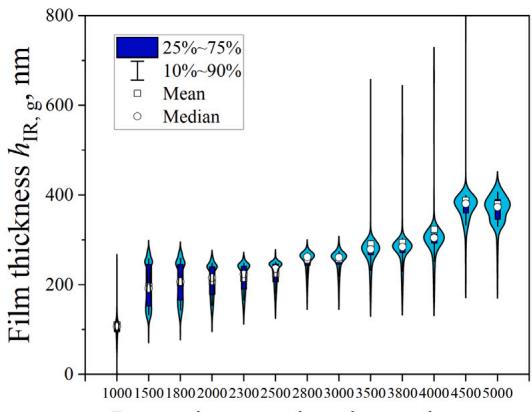  
(a)

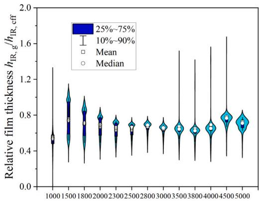  
Inner ring rotational speed, rpm  
(b)

Fig. 9. Violin plot showing the distribution of (a) roller–inner ring contact film thickness measurements, and (b) the corresponding relative film thickness, as a function of rotational speed at 2000 N with grease for the speed sweep tests. Each violin corresponds to an hour of continuous measurements at a constant speed. The broader and asymmetric distributions at low speeds indicate higher variability caused by mixed lubrication, roller skew, and intermittent asperity interactions. As speed increases, the lubricant film thickens and acts as a buffer against surface roughness and dynamic effects, resulting in reduced scatter.  
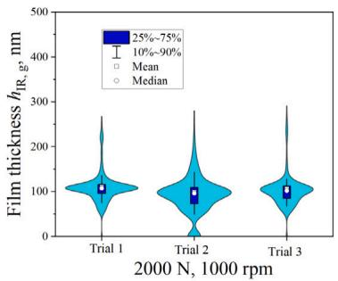  
(a)

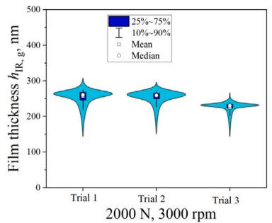  
(b)

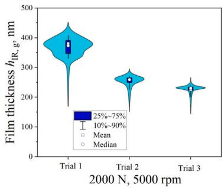  
(c)

Fig. 10. Violin plots of roller–inner ring film thickness distributions at 2000 N and three speeds, three trials each: (a) 1000 rpm, (b) 3000 rpm, and (c) 5000 rpm at 35 ◦C with grease. The height of each violin reflects the overall film thickness range, while the horizontal spread represents the frequency of occurrence.  
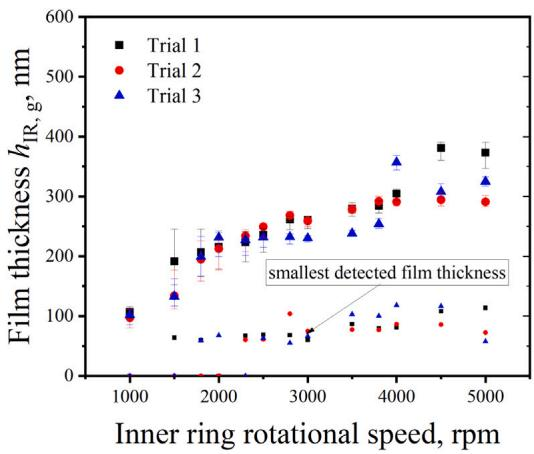  
(a)

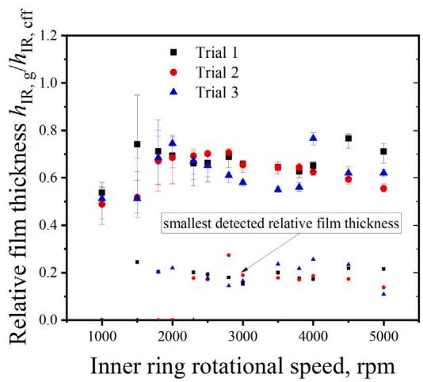  
(b)  
Fig. 11. Three trials (a) median roller–inner ring film thickness and (b) the corresponding relative film thickness as functions of speed for Li/SS-40-2.5 grease under a load of 2000 N at 35 ◦C. The thinnest film thicknesses detected during the one-hour measurement and their corresponding relative values are indicated by the smaller markers below, showing steady behavior over time. Error bars denote the interquartile range (25th–75th percentile) of the measured data.

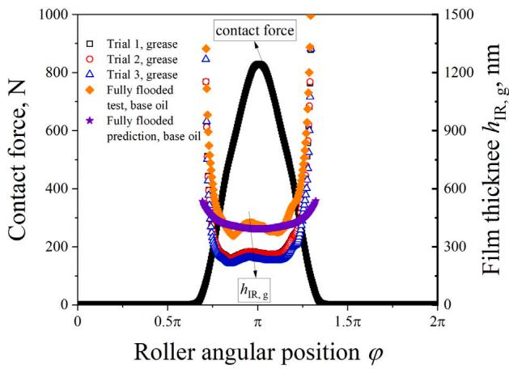

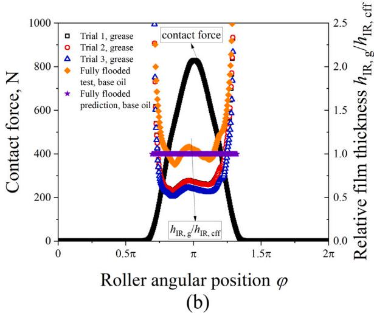  
(a)  
Fig. 12. Circumferential distribution of roller–inner ring contact force (black) with 0.4◦ bearing misalignment about its vertical axis; film thickness distributions (median values of one-hour measurements at each angular position) from three grease measurement trials, one base oil measurement (orange), and one base oil theoretical prediction (purple). 2000 N and 3000 rpm. (a) Absolute film thickness; (b) Relative film thickness.

The location of the smallest film thickness does not coincide with the highest load, but instead appears near the unloaded-to-loaded transition (the two horns in the measured signals). This may be due to heat generation distribution in the loaded zone due to sliding, and thermal time constants of the lubricant and solid boundaries [28–30]. Variations such as random roller tilt and skew can also cause the film thickness to fluctuate above or below the expected value.

The measured and predicted fully flooded base oil film thicknesses show a good match, except in the low-to-no load region. Eq. (9) is derived for the elastic-piezoviscous lubrication regime and may not be valid under light load conditions. When the contact force drops, the lubrication regime may fall into the rigid–isoviscous region, resulting in under-predicted values by Eq. (9) (purple plot) as force decreases towards the unloaded zone, as seen in Fig. 12.

## 4. Summary and conclusion

In this study, an electrical capacitance method is introduced for measuring film thickness in cylindrical roller bearings. The capacitance is obtained by a Lubcheck device using a cylindrical roller bearing with one steel rolling element. The evaluation method uses an estimation of the relative permittivity and considers the influence of the capacitance of the contact and surrounding areas. This enables the determination of starved lubrication conditions and thus a realistic analysis of the lubrication mechanism in grease-lubricated roller bearings.

Practical aspects of the proposed measurement method show that it is susceptible to measurement scatter arising from fluctuations in contact conditions, particularly at low speeds. Nonetheless, the proposed method shows excellent repeatability and accuracy, particularly at medium to high speeds.

Film thickness results obtained using this method are presented, leading to the following key observations:

1. Under sufficiently high loads and speeds, the effective ambient relative permittivity determined by this method approaches the published nominal relative permittivity of the lubricant.

2. The measured circumferential film thickness profile potentially reveals the size of the loaded zone when the clearance is known, facilitating the detection of misalignment in CRBs.

3. Within the loaded zone, the film thickness distribution is nearly uniform.

The dynamics in roller bearing contacts are different from those in ball bearing contacts potentially due to the longitudinal dimension of the former. Notwithstanding these differences, the electrical capacitance method remains applicable to both bearings when the relevant effects are accounted for, such as the smaller contact dimension in the rolling direction, higher sensitivity to misalignment, and aspects related to side and inlet regions. The proposed methodology and evaluation system, therefore, enable a systematic and robust investigation of grease-lubricated CRBs under fully flooded and starved conditions.

## Notations and abbreviations

$a$ Half contact width in rolling direction   
$A$ Contact area   
$C$ Capacitance   
$C _ { \mathrm { b g } }$ Background capacitance of test rig   
$C _ { \mathrm { T } }$ Thermal correction factor for film thickness   
$E$ Modulus of elasticity   
$E ^ { \prime }$ Reduced modulus of elasticity, $\begin{array} { r } { \frac { 2 } { E ^ { \prime } } = \frac { 1 - { v _ { 1 } } ^ { 2 } } { E _ { 1 } } + \frac { 1 - { v _ { 2 } } ^ { 2 } } { E _ { 2 } } } \end{array}$   
$F$ Contact force   
$F _ { \mathrm { r } }$ Bearing radial load   
$h$ Film thickness or gap   
$h _ { \mathrm { c } }$ Central film thickness   
$l _ { \mathrm { e } }$ Effective contact length   
$l _ { \mathrm { r o l l e r } }$ Total length of cylindrical roller   
$m$ Ratio of meniscus distance to half contact width, $\bar{x}/a$   
$m ^ { * }$ Ratio of fully flooded meniscus distance to half contact width, $x ^ { * } / a$   
$p$ Contact pressure   
$p _ { \mathrm { h } }$ Maximum contact pressure   
$R ^ { \prime }$ Reduced radius in rolling direction for line contact   
$R _ { \mathrm { r o l l e r } }$ d f l d l ll   
$T$ Temperature (◦C)   
$u _ { \mathrm { m } }$ Entrainment velocity, $\begin{array} { r } { u _ { \mathrm { m } } = \frac { u _ { 1 } + u _ { 2 } } { 2 } } \end{array}$   
$\nu$ Poisson’s ratio   
$V _ { \mathrm { c a p } }$ Lubcheck output voltage   
$\bar { x }$ Meniscus distance from contact center   
$O , X , Y , Z$ Coordinate system of bearing   
$x ^ { * }$ Meniscus distance from contact center   
$\alpha$ Pressure–viscosity index $\eta _ { 0 }$ Dynamic viscosity (Pa s)at ambient pressure $\rho$ Density   
$\rho _ { 0 }$ Density at ambient pressure and reference temperature $T _ { 0 }$   
$\upsilon$ Kinematic viscosity   
$\varepsilon _ { 0 }$ Permittivity of vacuum, $8 . 8 5 \cdot 1 0 ^ { - 1 2 }$ F/m $\varepsilon _ { \mathrm { r } }$ Relative permittivity   
$\varepsilon _ { \mathrm { r 0 } }$ Relative permittivity at ambient pressure and temperature   
$\varepsilon _ { \mathrm { a i r } }$ Relative permittivity of air, approximately 1. $\varphi$ Roller angular position   
CRB Cylindrical roller bearing   
bg Background   
cav Filled with lubricant and air   
cff Fully flooded central film thickness   
contact Contact footprint   
fl Filled with lubricant   
g Grease   
$\mathrm { H z }$ Hertzian contact   
isothermal Without considering thermal effect   
IR Inner ring   
OR Outer ring   
outside Outside of the contact area   
thermal Considering thermal effect

## CRediT authorship contribution statement

Min Gao: Writing – review & editing, Writing – original draft, Visualization, Validation, Methodology, Investigation, Formal analysis, Data curation, Conceptualization. Jude A. Osara: Writing – review & editing, Writing – original draft, Supervision, Resources, Project administration, Methodology, Investigation, Funding acquisition, Formal analysis, Conceptualization.

## Declaration of competing interest

The authors declare that they have no known competing financial interests or personal relationships that could have appeared to influence the work reported in this paper.

## Acknowledgments

We thank Mr. R. J. Meijer and Dr. E. de Vries for their help with the test rig used in this work. We thank SKF Research and Technology Development and Shell for funding this project.

## Data availability

Data will be made available on request.

## References

[1] Muennich HC, Gloeckner HJR. Elastohydrodynamic lubrication of greaselubricated rolling bearings. ASLE Trans 1980;23(1):45–52.

[2] Liang H, Lu Y, Wang W, Sun Y, Zhao J, Guo Y. An experimental study on the distribution of grease in cylindrical roller bearings. Lubricants 2024;12(5):145.

[3] Wilson AR. The relative thickness of grease and oil films in rolling bearings. Proc Inst Mech Eng 1979;193(1):185–92.

[4] Heemskerk RS, Vermeiren KN, Dolfsma H. Measurement of lubrication condition in rolling element bearings. ASLE Trans 1982;25(4):519–27.

[5] Kumar R, Azam MS, Ghosh SK, Yadav S. 70 years of elastohydrodynamic lubrication (EHL): A review on experimental techniques for film thickness and pressure measurement: R. Kumar et al.. Mapan 2018;33(4):481–91.

[6] Shetty P, Meijer RJ, Osara JA, Lugt PM. Measuring film thickness in starved grease-lubricated ball bearings: an improved electrical capacitance method. Tribol Trans 2022;65(5):869–79.

[7] Jablonka K, Glovnea R, Bongaerts J. Evaluation of EHD films by electrical capacitance. J Phys D: Appl Phys 2012;45(38):385301.

[8] Cen H, Lugt PM. Film thickness in a grease lubricated ball bearing. Tribol Int 2019:134:26–35.

[9] Hamrock BJ, Dowson D. Isothermal elastohydrodynamic lubrication of point contacts: Part III—Fully flooded results. J Lubr Technol 1977;99(2):264–75.

[10] Schneider V, Liu H, Bader N, Furtmann A, Poll G. Empirical formulae for the influence of real film thickness distribution on the capacitance of an EHL point contact and application to rolling bearings. Tribol Int 2021;154:106714.

[11] Dyson A, Naylor H, Wilson AR. Paper 10: The measurement of oil-film thickness in elastohydrodynamic contacts. In: Proceedings of the institution of mechanical engineers, conference proceedings. Vol. 180, London, England: SAGE Publications Sage UK; 1965, p. 119–34.

[12] Dokter J, Osara JA. On the thermal degradation of lubricant grease: Degradation analysis. J Tribol 2025;148(2):024603.

[13] Van Zoelen MT, Venner CH, Lugt PM. Prediction of film thickness decay in starved elasto-hydrodynamically lubricated contacts using a thin layer flow model. Proc Inst Mech Eng J 2009;223(3):541–52

[14] Dowson D, Toyoda S. A central film thickness formula for elastohydrodynamic line contacts, Elastohydrodynamics and related topics. In: Proc. 5th leeds-lyon symp., 1978. Vol. 60, Elsevier; 1978.

[15] Yang P, Wen S. A generalized Reynolds equation based on non-Newtonian flow in lubrication mechanics. Acta Mech Sin 1990:6:289–95.

[16] Gao M, Osara JA, van Zoelen MT, Meeuwenoord R, Pasaribu R, Lugt PM. Analytical predictions and experimental measurements of EHL film thickness in wide elliptical and line contacts. Tribol Int 2025;212:110893.

[17] Teutsch R, Sauer B. An alternative slicing technique to consider pressure concentrations in non-hertzian line contacts. J Trib 2004;126(3):436–42.

[18] Yang H, Cheng G, Deng S, Du H. Analysis of the roller-race contact deformation of cylindrical roller bering using a improved slice method. In: 2011 international conference on mechatronic science, electric engineering and computer. MEC, IEEE; 2011, p. 711–4.

[19] Sánchez-Rubio M, Chinas-Castillo F, Ruiz-Aquino F, Lara-Romero J. A new focus on the Walther equation for lubricant viscosity determination. Lubr Sci 2006;18(2):95–108.

[20] Jackson A. A simple method for determining thermal EHL correction factors for rolling element bearings and gears. ASLE Trans 1981;24(2):159–63.

[21] Dyson A, Wilson AR. Film thicknesses in elastohydrodynamic lubrication of rollers by greases. In: Proceedings of the institution of mechanical engineers, conference proceedings. Vol. 184, London, England: SAGE Publications Sage UK; 1969, p. 1–11.

[22] Dmytrychenko N, Aksyonov A, Gohar R, Wan G. Elastohydrodynamic lubrication of line contacts. Wear 1991;150(1–2):303–13.

[23] de Mul JM, Vree JM, Maas DA. Equilibrium and associated load distribution in ball and roller bearings loaded in five degrees of freedom while neglecting friction—Part II: Application to roller bearings and experimental verification. J Tribol 1989;111(1):149–55.

[24] Li Z, Hu X, Wang C, Wang H, Yang L. Study on the effect of angular misalignment on the contact load and stiffness of cylindrical roller bearings. In: The international conference on applied nonlinear dynamics, vibration and control. Springer; 2023, p. 51–63.

[25] Shetty P, Meijer RJ, Osara JA, Pasaribu R, Lugt PM. Film thickness in grease-lubricated deep groove ball bearings—A master curve. Tribol Trans 2024;67(5):1057–68.

[26] Harris TA, Kotzalas MN, Yu WK. On the causes and effects of roller skewing in cylindrical roller bearings. Tribol Trans 1998;41(4):572–8.

[27] Shetty P, Meijer R, Osara JA, Pasaribu R, Lugt PM. Vibrations and film thickness in grease-lubricated deep groove ball bearings. Tribol Int 2024;193:109325.

[28] SKF. Bearing damage and failue analysis. Sweden: Palmeblads Tryckeri; 2004.

[29] Chen J, Liu J, Shao Y, Luo C. Vibration modeling of lubricated rolling element bearing considering skidding in loaded zone. J Fail Anal Prev 2014;14:809–17.

[30] Tu W, Yu W, Shao Y, Yu Y. A nonlinear dynamic vibration model of cylindrical roller bearing considering skidding. Nonlinear Dynam 2021;103:2299–313.

---

> **추출 글자 소실 복구 기록** — 원문 대조로 39건 복구 (α·ε·β·λ 등 그리스 문자와 좌표축 기호). 미확인 0건.
