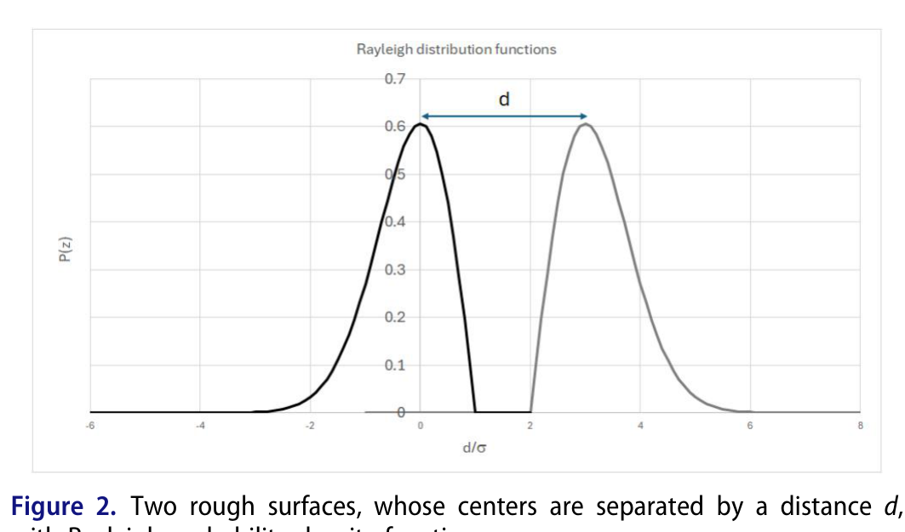
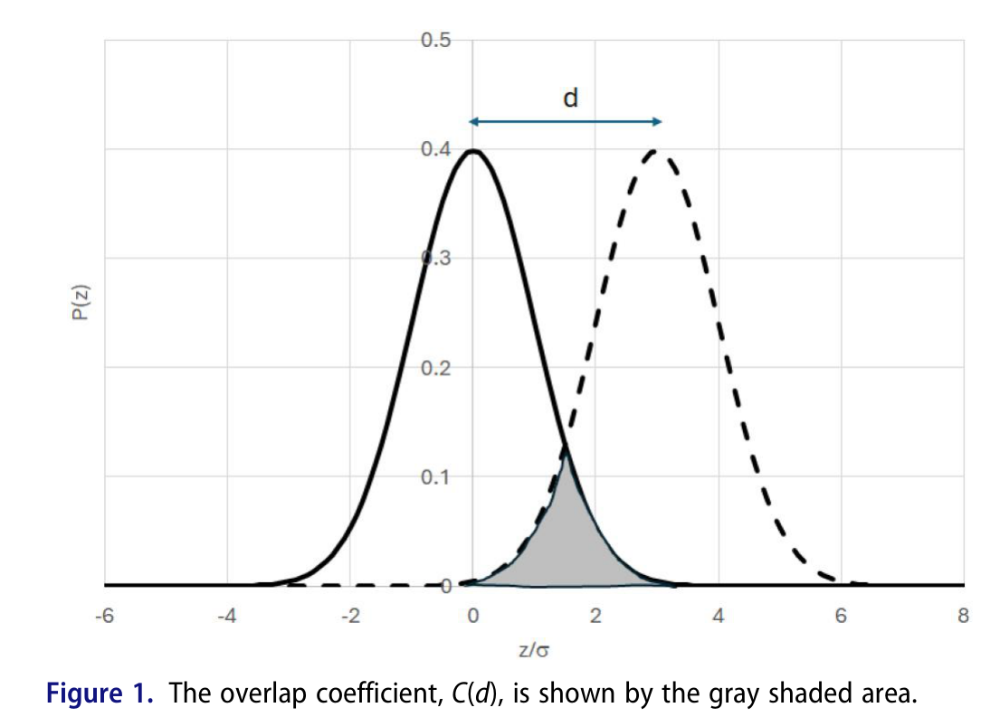
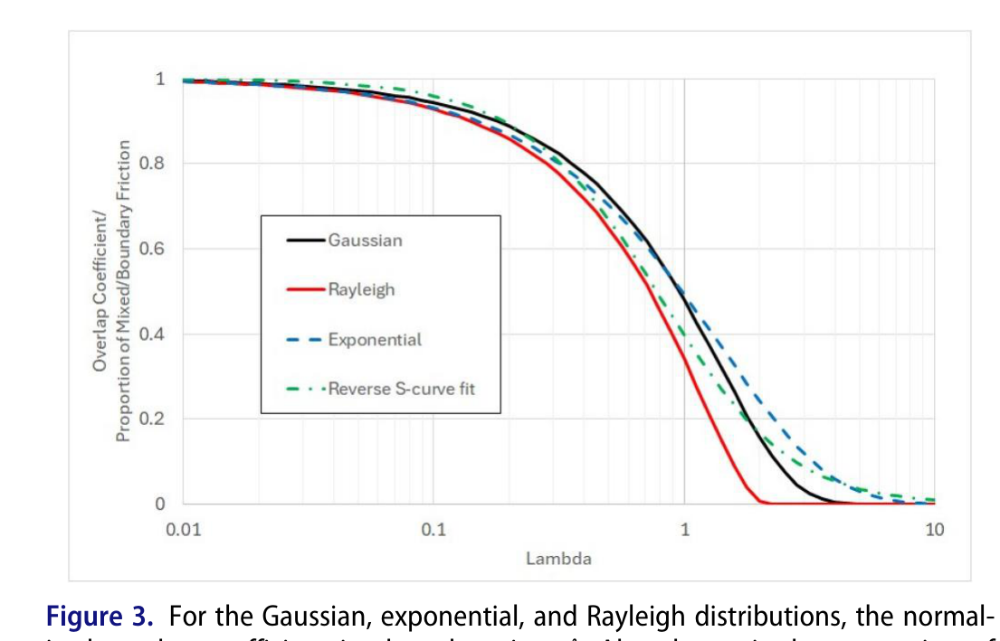
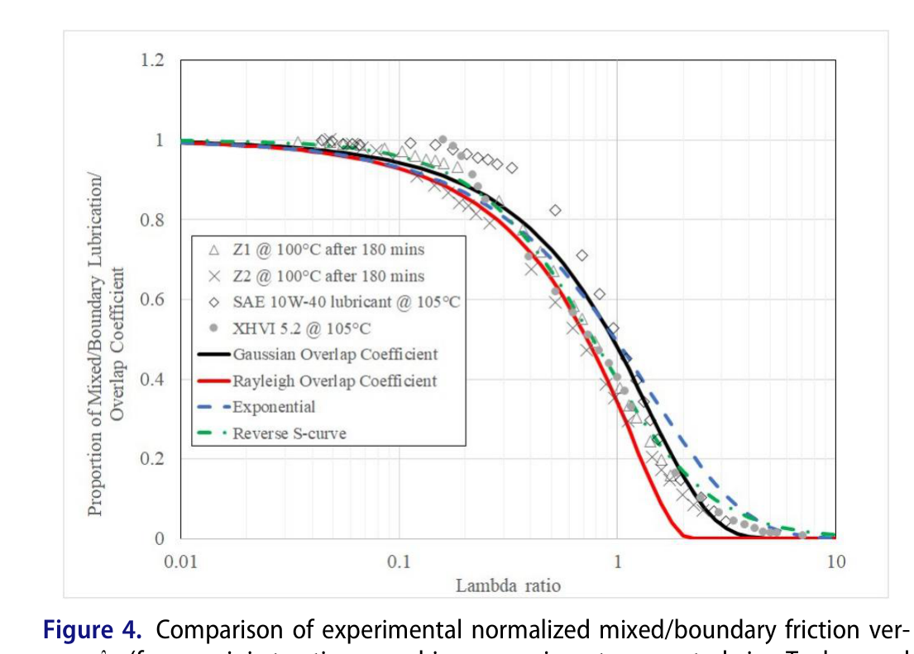
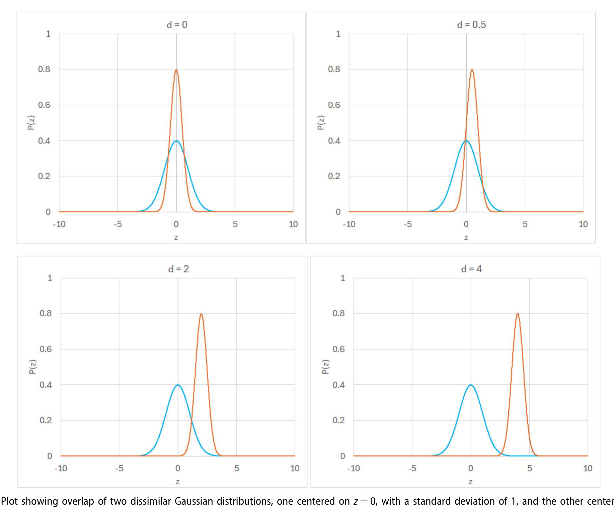
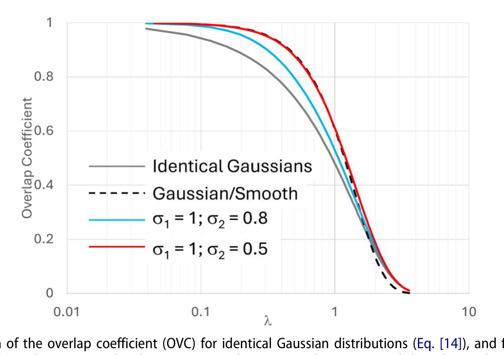

# 람다비(Lambda Ratio)로부터의 혼합·경계 마찰 추정: 표면 특성 효과의 반영

## 저자 정보

**R. I. Taylor** (교신저자)
e-mail: ritaylor@uclan.ac.uk
ORCID: 0000-0002-3132-8469

**I. Sherrington**
ORCID: 0000-0003-1283-9850

**소속**: Jost Institute for Tribotechnology, University of Central Lancashire, Preston, UK

**출처**: Tribology Transactions (2026), Vol. 69, No. 1, pp. 134–141, Taylor & Francis
DOI: 10.1080/10402004.2025.2574843
**접수**: 2025년 3월 10일 / 게재 확정: 2025년 10월 10일 / 온라인: 2025년 11월 17일
**라이선스**: Open Access (CC BY 4.0)
**연구비**: Taiho Kogyo Tribology Research Federation (TTRF)

**키워드**: 혼합 윤활(Mixed lubrication), 경계 윤활(Boundary lubrication), 표면 거칠기(Surface roughness), 마찰(Friction)

---

## 초록

저자들은 앞서 람다비(λ) 값과 미니 트랙션 머신(MTM) 마찰 데이터를 이용해 경계·혼합 마찰계수를 추정하는 방법을 보고한 바 있습니다. 본 논문은 계면 구성요소의 **이상화된 확률 높이 분포(probability height distribution)의 중첩 함수(overlap function)** 를 사용하여 계면 형상의 **표면 높이 분포(surface height distribution)** 를 반영하는 보다 일반적인 접근법을 제시합니다. 공학적 거친 표면에 적합한 확률밀도함수(PDF)의 **중첩 계수(overlap coefficient)** 를 계산했으며, 지수(exponential)·가우시안(Gaussian)·레일리(Rayleigh) 분포에 대해 간단한 해석식을 도출했습니다. PDF의 중첩 계수가 트라이볼로지 맥락에서 계산·적용된 것은 **최초**로 여겨집니다. 도출된 식은 거친 표면 윤활 접촉의 혼합/경계 마찰을 예측하는 데 사용될 수 있으며, 발표된 실험 데이터와 잘 일치합니다. 특히 **동일한 가우시안 분포**를 갖는 거친 표면은 특히 간단한 형태($X=\text{erfc}(\lambda/2)$)를 띠며, **레일리 PDF**로 기술되는 표면은 "런인(run-in)" 표면의 좋은 모델을 제공합니다. 이를 통해 트라이볼로지스트는 새 부품과 마모/런인 부품의 마찰을 빠르고 간단하게 비교할 수 있습니다.

---

## 목차

1. [개요](#1-개요)
2. [종합 요약](#2-종합-요약)
3. [서론](#3-서론)
4. [거친 표면 PDF의 중첩 계수](#4-거친-표면-pdf의-중첩-계수)
5. [중첩 계수와 혼합·경계 마찰의 연결](#5-중첩-계수와-혼합경계-마찰의-연결)
6. [논의](#6-논의)
7. [부록: 비동일 가우시안의 중첩 계수](#7-부록-비동일-가우시안의-중첩-계수)
8. [결론](#8-결론)
9. [기호 및 참고문헌](#9-기호-및-참고문헌)

---

## 1. 개요

기계 에너지 손실 저감 추세에 따라 **저점도 윤활유, 소형 오일섬프, 고하중·고온 운전**이 확대되고 있으며, 그 결과 기계가 **혼합·경계 윤활 영역**에서 작동할 가능성이 높아졌습니다. 따라서 혼합·경계 마찰의 정확한 예측에 대한 관심이 커지고 있습니다.

### 연구의 필요성

저자들의 선행 연구는 람다비와 MTM "런인" 마찰 데이터로 경계·혼합 마찰계수를 추정했으나, **데이터 출처 표면의 특성에 종속**되어 다양한 형상의 표면으로 일반화하기 어려웠습니다. 람다비는 본질적으로 **가우시안 분포 하나**를 전제로 하므로, 다른 높이 분포를 갖는 표면에서는 마찰 예측에 차이가 발생합니다.

### 본 연구의 목적

- 표면 높이 분포를 반영하는 **일반화된 혼합/경계 마찰 추정법** 개발 (새 표면·런인 표면 모두 적용)
- 공학적 거친 표면의 PDF(지수·가우시안·레일리)에 대한 **중첩 계수 해석식** 도출
- 정규화 중첩 계수(OVC)가 혼합/경계 마찰 비율 $X$의 합리적 추정치임을 실험 데이터와 비교 검증

---

## 2. 종합 요약

### ▪ 2.1 연구 핵심 정보

| 항목 | 내용 |
|------|------|
| **연구 대상** | • 람다비(λ) 기반 혼합·경계 마찰 비율 $X$ 예측 • 거친 표면 높이 분포(PDF)의 중첩 계수 |
| **주요 목적** | • 표면 특성(높이 분포)을 반영한 일반화 마찰 추정법 개발 • 지수·가우시안·레일리 PDF 중첩 계수 해석식 도출 • 피팅 상수 없는 간단식 제시 |
| **검증 방법** | • MTM 실험 데이터(Taylor-Sherrington, Dawczyk et al.)와 비교 • 정규화 중첩 계수(OVC) vs λ 곡선 대조 |
| **적용 분야** | • 기어·베어링 등 기계요소 마찰/동력손실 예측 • 새 부품 vs 런인 부품 마찰 비교 • 마모 예측으로의 확장 가능성 |

-------------

### ▪ 2.2 핵심 개념 정리

| 개념 | 설명 |
|------|------|
| **람다비(λ)** | • 평균선 간 거리 $h$(유막 두께) / 합성 RMS 거칠기 • λ<1 경계, 1<λ<λc 혼합, λ>λc(보통 3~4) 유체막 |
| **중첩 계수(Overlap coefficient, C(d))** | • 두 PDF "꼬리"의 중첩 면적, 두 분포의 유사도 척도 • 통계학(Inman & Bradley)에서 차용, 트라이볼로지 최초 적용 |
| **정규화 중첩 계수(OVC)** | • $C(d)/C(0)$, 혼합/경계 마찰 비율 $X$의 추정치 |
| **가우시안 분포** | • 연삭 등 가공 직후 새 표면의 좋은 모델 |
| **레일리 분포** | • 최고 돌기가 마모된 "런인(run-in)" 표면의 모델 • 상한 컷오프 존재 → λ>2.3에서 혼합/경계 마찰 0 |
| **지수 분포** | • 넓은 높이 범위, 높은 λ까지 혼합 마찰 지속 |

-------------

### ▪ 2.3 방법론 개요

| 구성요소 | 세부 내용 |
|---------|----------|
| **2-D 단순화 모델** | • 3-D 형상 대신 표면 높이 분포(PDF)만 고려한 해석 모델 |
| **확률밀도함수(PDF)** | • 지수·가우시안(새 표면), 레일리(런인 표면) • 실험적으로 측정 가능 (마찰 예측에 직접 활용) |
| **중첩 계수 계산** | • 두 PDF 중심을 거리 $d$만큼 분리, 꼬리 중첩 면적 $C(d)$ 적분 • 해석식 도출(가우시안 erfc, 지수 exp, 레일리) |
| **마찰 연결** | • OVC = 혼합/경계 마찰 비율 $X$ • 하중분담식 $F=f_o X W$로 마찰력·동력손실 산출 |

-------------

### ▪ 2.4 핵심 해석식

| 항목 | 식 | 의미 |
|------|-----|------|
| **람다비 정의** | $\lambda=\dfrac{h}{\sqrt{\sigma_1^2+\sigma_2^2}}$ | 평균선 거리/합성 RMS 거칠기 (식 1) |
| **동일 가우시안 OVC** | $X=\text{erfc}\left(\dfrac{\lambda}{2}\right)$ | **피팅 상수 없는 핵심식** (식 14) |
| **지수 분포 OVC** | $X=\exp\left(-\dfrac{\lambda}{\sqrt{2}}\right)$ | 넓은 높이 범위 표면 (식 13) |
| **레일리 분포 OVC** | $X=\dfrac{2\left[1-\exp\left(-\frac{1}{2}\left(\frac{d}{2\sigma}-1\right)^2\right)\right]}{2\left[1-\exp\left(-\frac{1}{2}\right)\right]}$ | 런인 표면, $d/\sigma=(4-\pi)\lambda$, λ>2.3서 0 (식 10) |
| **가우시안 vs 평활면** | $X=\exp\left(-\dfrac{\lambda^2}{2}\right)$ | 거친 표면 ↔ 매끈한 표면 (식 12) |
| **혼합 마찰력(하중분담)** | $F=f_o\,X\,W$ | $f_o$: λ=0 마찰계수, $W$: 하중 |

-------------

### ▪ 2.5 검증 결과

| 검증 항목 | 비교 대상 | 결과 |
|----------|----------|------|
| **동일 가우시안 OVC** | MTM 실험(비-FM 윤활유) [1,19] | • $X=\text{erfc}(\lambda/2)$가 **피팅 상수 없이 양호한 일치** |
| **레일리 OVC** | 동일 MTM 데이터 | • λ>1.5에서 혼합 마찰 과소평가 → 실험 표면이 완전 런인 안 됨 시사 |
| **비동일 가우시안** | 수치 계산(부록 Table A1) | • $\sigma_1$=1, $\sigma_2$=0.8/0.5 곡선이 동일 가우시안과 근접 |
| **"역 S-곡선" 핏** | $X=(1+\lambda^k)^{-a}$, k=3/2, a=4/3 [1] | • 해석식 곡선이 기존 경험식과 정합 |

-------------

### ▪ 2.6 주요 발견사항

| 항목 | 내용 |
|------|------|
| **중첩 계수의 최초 적용** | • PDF 중첩 계수를 트라이볼로지에 처음 도입·계산 |
| **간단성** | • 동일 가우시안은 $X=\text{erfc}(\lambda/2)$로 **피팅 상수 불필요** |
| **런인 표면의 컷오프** | • 레일리 모델: λ>2.3에서 혼합/경계 마찰 = 0 (고돌기 부재) |
| **분포 형태의 영향** | • 완전 분리 λ값은 표면 특성에 의존 — 매끈할수록↓, "peaky"할수록↑ |
| **고-λ 혼합 마찰** | • 지수 분포처럼 넓은 높이 범위는 높은 λ까지 혼합 마찰 지속 [27] |

-------------

### ▪ 2.7 실무적 함의

| 영역 | 권장사항 |
|------|---------|
| **마찰 예측** | • 가우시안 새 표면 → $X=\text{erfc}(\lambda/2)$ 즉시 적용 • 실측 PDF로 중첩 계수를 수치 계산해 예측 가능 |
| **새 vs 런인 비교** | • 가우시안(새 부품) / 레일리(런인 부품)로 마찰 극값 모델링 |
| **동력손실 산정** | • $F=f_o XW$ × 미끄럼속도로 동력손실 추정 |
| **향후 연구** | • 부분 런인 표면에 **와이블(Weibull) 분포** 적용 검토 • FM 첨가제 윤활유 반영, 마모 예측 확장(Varenberg, Rabinowicz) |

---

## 3. 서론

CO₂ 배출 저감 압력으로 OEM들은 다운사이징·저점도유·소형 섬프·고온고하중 운전으로 이동하고 있으며, 이는 효율을 개선하지만 기계요소가 **혼합·경계 윤활 영역**에서 보내는 시간 비율을 증가시킵니다.

### 람다비(λ)의 정의와 한계

람다비는 두 표면 평균선 간 거리 $h$(유막 두께로 간주)와 합성 RMS 거칠기의 비입니다:

$$\lambda = \frac{h}{\sqrt{\sigma_1^2 + \sigma_2^2}} \tag{1}$$

- λ<1: 경계 윤활 / 1<λ<λc(보통 3~4): 혼합 윤활 / λ>λc: 유체막 윤활
- 가우시안 분포의 ±1σ, ±2σ, ±3σ 면적(68.3%, 95.5%, 99.7%)에 윤활 영역을 대응시킨 것이 근거로 추정됨
- **한계**: 람다비는 **가우시안 분포 하나**를 전제 → 동일 통계 파라미터라도 가공법(마감)이 다르면 프로파일이 크게 다름 → 모든 형상에 단일 전이 λ값 부여 불가

### 표면 접촉 모델의 흐름

| 연구자 | 기여 |
|--------|------|
| **Bowden & Tabor [20]** | 돌기가 소성 변형·유동, 실접촉면적이 항복응력까지 증가 가정 |
| **런인(running-in) [21]** | 최고 돌기가 먼저 접촉·마모 → 표면 평활화 → 이후 다수 작은 돌기의 탄성 변형 지배 (기계요소 장수명 설명) |
| **Greenwood & Williamson [11] / Greenwood & Tripp [12]** | 거친 표면 탄성 접촉 모델, 실접촉면적 예측에 현재도 널리 사용 |
| **최근 연구 [22]** | Greenwood-Tripp 모델이 혼합 마찰을 상당히 **과소평가**함을 시사 |

### 본 연구의 기여

거친 표면 높이 PDF를 상세히 분석하여, 공학 표면에 흔한 분포(지수·가우시안·레일리)의 **중첩 계수를 해석적으로 평가**합니다. 두 PDF 중심이 일정 거리 분리될 때 중첩 계수는 두 분포 꼬리의 "중첩" 척도가 되며, 정규화 중첩 계수가 혼합/경계 마찰의 합리적 추정치임을 실험과 비교해 보입니다.

---

## 4. 거친 표면 PDF의 중첩 계수

3-D 모델 대신 표면 **높이 특성만** 반영한 단순화된 2-D 기술을 채택합니다. 거친 표면 돌기 높이는 확률밀도함수 $P(z)$로 기술됩니다.

### ▪ 4.1 표면 높이 확률밀도함수

**지수 분포(Exponential):**

$$P(z) = \frac{1}{2\sigma}\exp\left(-\frac{|z-\mu|}{\sigma}\right) \tag{2}$$

**가우시안 분포(Gaussian):** — 연삭 등 새 표면

$$P(z) = \frac{1}{\sqrt{2\pi\sigma^2}}\exp\left(-\frac{(z-\mu)^2}{2\sigma^2}\right) \tag{3}$$

**레일리 분포(Rayleigh):** — "런인" 표면 (최고 돌기 마모 제거), $z>0$에서만 정의, $z=\sigma$에서 피크

$$P(z) = \frac{z}{\sigma^2}\exp\left(-\frac{z^2}{2\sigma^2}\right) \tag{4}$$

> 레일리 표면은 중심선 평균 **아래**는 거의 가우시안, **위**는 비가우시안이며 그 이상 돌기가 없는 유효 컷오프를 가짐 → 잘 런인된 표면 모델.

*Figure 2. 거리 $d$만큼 떨어진 두 레일리(Rayleigh) 확률밀도함수 표면. 중심선 위쪽에 컷오프가 존재(런인 표면 모델).*

### ▪ 4.2 중첩 계수의 정의

중첩 계수 $C(d)$는 거리 $d$만큼 분리된 두 PDF 꼬리의 중첩 면적입니다. 정규화 중첩 계수(OVC) = $C(d)/C(0)$.

*Figure 1. 중첩 계수 $C(d)$는 두 분포 꼬리의 겹침(회색 음영) 면적으로 정의된다.*

**동일 가우시안** (중심 $z=0$, $z=d$, 교차점 $z=d/2$):

$$C(d) = \int_{d/2}^{\infty}P(z)\,dz + \int_{-\infty}^{-d/2}P(z)\,dz = \text{erfc}\left(\frac{d}{2\sqrt{2}\,\sigma}\right) \tag{5, 6}$$

**지수 분포:**

$$C(d) = \exp\left(-\frac{d}{2\sigma}\right) \tag{7}$$

**레일리 분포** (비대칭이라 $C(0)\neq1$):

$$C(0) = 2\left[1-\exp\left(-\tfrac{1}{2}\right)\right] \approx 0.7869 \tag{8}$$

$d>2\sigma$이면 $C(d)=0$, $0\le d\le 2\sigma$이면:

$$C(d) = 2\left[1-\exp\left(-\frac{1}{2}\left(\frac{d}{2\sigma}-1\right)^2\right)\right] \tag{9}$$

따라서 레일리 OVC는 $d>2\sigma$에서 0, $d<2\sigma$에서 식 (10).

**가우시안 거친 표면 ↔ 매끈한 표면** (평활면은 델타함수 $\delta(x)$):

$$\text{OVC} = \exp\left(-\frac{d^2}{2\sigma^2}\right) \tag{12}$$

---

## 5. 중첩 계수와 혼합·경계 마찰의 연결

가우시안·지수 분포에서 두 표면 합성 RMS 거칠기는 $\sqrt{2}\sigma$이므로 람다비는 $\lambda=d/(\sqrt{2}\sigma)$. 이를 대입하면:

**지수 분포:**

$$\text{OVC} = \exp\left(-\frac{\lambda}{\sqrt{2}}\right) \tag{13}$$

**가우시안 분포:**

$$\text{OVC} = \text{erfc}\left(\frac{\lambda}{2}\right) \tag{14}$$

**레일리 분포:** 식 (4)의 분산은 $\sigma$가 아니라 $(2-\pi/2)\sigma^2$이므로 람다비는:

$$\lambda = \frac{d}{(4-\pi)\sigma} \tag{15}$$

OVC는 식 (10)에서 $d/\sigma \to (4-\pi)\lambda$로 치환. **$d/\sigma>2$, 즉 λ>2.33에서 혼합/경계 마찰 없음.**

### ▪ 5.1 실험 데이터와의 비교

정규화 중첩 계수 vs λ를 최근 이론([1], 실험 데이터 [19] 기반)의 혼합/경계 마찰 비율 vs λ 곡선과 비교(Fig. 3, 4). 기존 경험식 "역 S-곡선":

$$X = (1+\lambda^k)^{-a}, \quad k=3/2,\ a=4/3 \tag{[1]}$$

| 비교 항목 | 결과 |
|----------|------|
| **동일 가우시안 $\text{erfc}(\lambda/2)$** | 비-FM 윤활유 MTM 데이터와 **피팅 상수 없이 양호한 일치** |
| **레일리 분포** | λ>1.5에서 혼합/경계 마찰 **과소평가** → 실험 표면이 완전 런인 안 됨 시사 (부분 런인은 Weibull 분포 필요할 수 있음) |

> 실험 데이터는 **마찰 조정제(friction modifier)를 포함하지 않은** 윤활유로 한정됨.

*Figure 3. 가우시안·지수·레일리 분포의 정규화 중첩 계수(OVC)를 $\lambda$에 대해 도시. 역 S-곡선 핏($X=(1+\lambda^k)^{-a}$, $k=3/2$, $a=4/3$)도 함께 표시.*

*Figure 4. MTM 실험 데이터(Taylor-Sherrington [1], Dawczyk et al. [19])의 정규화 혼합/경계 마찰 vs $\lambda$와, 동일 가우시안(식 14)·레일리(식 10) 중첩 계수 곡선 비교.*

---

## 6. 논의

- CO₂ 저감으로 OEM의 다운사이징·저점도·고온고하중 추세 → 혼합·경계 영역 운전 증가 → 정확한 마찰 예측 수요 증대
- 본 연구의 중첩 계수 식은 **피팅 상수 없이** 실험 데이터에 양호한 핏 제공
- **약점**: 돌기 상호작용의 물리 모델(탄성/소성)을 제시하지 않음 (단, 문헌에 유사 모델 다수 존재)
- **강점**: 거친 표면 PDF를 쉽게 실측 가능 → 해석적(가우시안) 또는 수치적(실측)으로 중첩 계수 계산 가능

### ▪ 6.1 람다비와 윤활 영역 경계

- 각 영역 경계값은 사실상 임의적. 가우시안 표면은 분포 성질로 경계 추정 합리적(λ=3에서 99.7% 분리)
- 일부는 λ>4에서만 완전 분리, 더 높은 λ까지 혼합 마찰 지속 보고 [27]
- 잘 런인된 표면(최고 돌기 마모)은 새 표면보다 혼합 마찰 현저히 낮음
- 완전 분리 λ값은 표면 높이 분포 특성에 의존 — 매끈할수록↓, "peaky"할수록↑

### ▪ 6.2 응용 및 확장

- 마찰력: $F=f_o X W$ ($f_o$=λ=0 마찰계수, $W$=하중), 동력손실 = 마찰력×미끄럼속도
- $2<\lambda<4$ 구간의 정밀 마찰 측정이 혼합/경계 마찰 이해에 매우 유용
- 마모 예측으로 확장 가능성 (Varenberg [28] 베어링비 곡선, Rabinowicz [29] 마찰-마모 관계)

---

## 7. 부록: 비동일 가우시안의 중첩 계수

서로 다른 평균·분산을 갖는 두 가우시안 $P_1(\mu_1,\sigma_1,z)$, $P_2(\mu_2,\sigma_2,z)$ (식 A.1, A.2)의 교차점:

$$Z_{1},Z_{2} = \frac{\mu_1\sigma_2^2-\mu_2\sigma_1^2 \pm \sigma_1\sigma_2\sqrt{(\mu_1-\mu_2)^2+(\sigma_2^2-\sigma_1^2)\ln(\sigma_2^2/\sigma_1^2)}}{\sigma_2^2-\sigma_1^2} \tag{A.3}$$

중첩 계수 $C(d)$는 erf 함수(식 A.4) 또는 Excel `NORMDIST` 함수(식 A.5)로 계산 가능. 람다비 정의는 식 (A.6) ($\lambda=d/\sqrt{\sigma_1^2+\sigma_2^2}$).

*Figure A1. 중심 $z=0$($\sigma=1$)과 $z=d$($\sigma=0.5$)인 두 비동일 가우시안 분포의 중첩을 $d$=0, 0.5, 2, 4에 대해 도시.*

*Figure A2. 동일 가우시안(식 14)·가우시안 vs 평활면(식 11)·비동일 가우시안($\sigma_1{=}1, \sigma_2{=}0.8$ 및 $0.5$)의 중첩 계수(OVC) vs $\lambda$.*

### ▪ Table A1: λ별 마찰 비율 $X$ 비교

| λ | 동일 가우시안 $\text{erfc}(\lambda/2)$ | 가우시안 vs 평활면 $\exp(-\lambda^2/2)$ | 비동일 $\sigma_1{=}1,\sigma_2{=}0.8$ | 비동일 $\sigma_1{=}1,\sigma_2{=}0.5$ |
|-----|------|------|------|------|
| 0.5 | 0.724 | 0.883 | 0.796 | 0.877 |
| 1.0 | 0.480 | 0.607 | 0.529 | 0.609 |
| 1.5 | 0.289 | 0.325 | 0.318 | 0.361 |
| 2.0 | 0.157 | 0.135 | 0.170 | 0.186 |
| 2.5 | 0.0771 | 0.0439 | 0.0834 | 0.0862 |
| 3.0 | 0.0339 | 0.0111 | 0.0361 | 0.0347 |

> 비동일 가우시안 곡선은 동일 가우시안 곡선에 비교적 근접하며, 가우시안 vs 평활면은 고-λ에서 가장 빠르게 감소.

---

## 8. 결론

### 방법론적 기여

- 1960년대 이래 거친 표면 PDF가 혼합/경계 마찰 모델에 사용되었으나, **PDF 중첩 계수의 트라이볼로지 적용은 최초**
- 가우시안(동일·비동일), 지수, 레일리 분포에 대한 중첩 계수 **해석식 도출**

### 검증 결과

- **동일 가우시안**: $\text{OVC}=\text{erfc}(\lambda/2)$ — 특히 간단, **피팅 상수 없이** 최근 MTM 데이터(다양한 윤활유)에 양호한 핏 [1,19]
- **레일리(런인 표면)**: λ>2.3에서 혼합/경계 마찰 0 (이상화 런인 표면의 고돌기 부재)

### 실무적 장점

- 거친 표면 PDF를 실측한 뒤 수치적으로 중첩 계수 계산 가능
- 실험과 정합하는 **간단식**으로 트라이볼로지스트가 혼합/경계 마찰을 손쉽게 예측
- 새 부품(가우시안) ↔ 런인 부품(레일리) 마찰 극값을 간단히 비교

### 한계 및 향후 연구

- 돌기 상호작용의 물리 모델 미제시
- 마찰 조정제(FM) 포함 윤활유는 별도 반영 필요 (수정 "역 S-곡선" [2])
- 부분 런인 표면에 **와이블(Weibull) 분포** 적용 검토
- 마모 예측으로 확장 가능성

---

## 9. 기호 및 참고문헌

### ▪ 주요 기호 설명 (Nomenclature)

| 기호 | 설명 | 단위 |
|------|------|------|
| $\lambda$ | 람다비 (유막두께/합성 RMS 거칠기) | – |
| $h$ | 평균선 간 거리(유막 두께) | m |
| $\sigma$, $\sigma_1$, $\sigma_2$ | 분포 표준편차 / 표면 RMS 거칠기 | m |
| $\mu$, $\mu_1$, $\mu_2$ | 분포 평균 | m |
| $d$ | 두 PDF 중심 간 분리 거리 | m |
| $z$ | 표면 높이 | m |
| $P(z)$ | 확률밀도함수(PDF) | – |
| $C(d)$ | 중첩 계수(overlap coefficient) | – |
| $C(0)$ | $d=0$에서의 중첩 계수 | – |
| OVC | 정규화 중첩 계수 ($C(d)/C(0)$) | – |
| $X$ | 혼합/경계 마찰 비율(weight factor) | – |
| $F$ | 혼합/경계 마찰력 | N |
| $f_o$ | λ=0(완전 경계)에서의 마찰계수 | – |
| $W$ | 접촉 하중 | N |
| $\lambda_c$ | 임계 람다비 (보통 3~4) | – |
| $\text{erfc}(x)$ | 보오차함수 | – |
| $\text{erf}(x)$ | 오차함수 | – |
| $\delta(x)$ | 디랙 델타함수 | – |
| $k, a$ | 역 S-곡선 피팅 파라미터 | – |

-------------

### ▪ 핵심 참고문헌 (References)

- **[1]** Taylor RI, Sherrington I. (2022) — 혼합·경계 마찰 예측 간략화 접근, *Tribol Int* 175, 107836 (본 연구의 기반)
- **[2]** Taylor RI, Sherrington I. (2023) — AW·FM 첨가제 윤활유 혼합 마찰계수 예측, *Tribol Online* 18
- **[3]** Cann P, Ioannides E, Jacobson B, Lubrecht AA. (1994) — 람다비 비판적 재검토, *Wear* 175
- **[8]** Spies C, Parab Y, Fatemi A. (2025) — 람다 파라미터 하중분담식 비판적 평가, *Tribol Int* 211, 110812 ([[2025. (TI) Mixed friction - Critical assessment of load sharing equations]])
- **[11]** Greenwood JA, Williamson JBP. (1966) — 공칭 평면 접촉(거친 표면 탄성 접촉 모델)
- **[12]** Greenwood JA, Tripp JH. (1970) — 두 거친 평면 접촉(실접촉면적 예측 표준)
- **[19]** Dawczyk J, Morgan N, Russo J, Spikes H. (2019) — ZDDP 막 유막두께·마찰, *Tribol Lett* 67 (검증 실험 데이터)
- **[21]** Blau PJ. (2005) — 런인(running-in)의 본질
- **[22]** Leighton M 등 (2017) — 경계·혼합 마찰 예측 표면 특정 돌기 모델
- **[25]** Inman HF, Bradley EL. (1989) — 확률분포 일치 척도로서의 중첩 계수(통계학 출처)
- **[26]** Taylor RI. (2022) — 거친 표면 접촉 모델링 리뷰, *Lubricants* 10
- **[27]** Guegan J, Kadiric A, Gabelli A, Spikes H. (2016) — 종방향 거칠기 EHD 점접촉 마찰-유막 관계
- **[28]** Varenberg M. (2024) — 베어링비 곡선 기반 거친 표면 접촉 모델링

---

**원본 출처**: Taylor, R.I., Sherrington, I., 2026, "Estimating Mixed & Boundary Friction from the Lambda Ratio: Incorporating the Effect of Surface Character," *Tribology Transactions*, 69(1), pp. 134–141, Taylor & Francis (Open Access, CC BY 4.0).
**정리 양식**: [[2012. (Lugt) Thin layer flow and film decay modeling]] 참고
**관련 문헌**: [[2025. (TI) Mixed friction - Critical assessment of load sharing equations]]

---

**끝**
