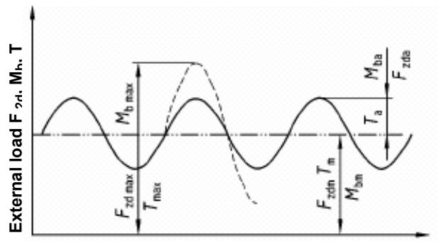
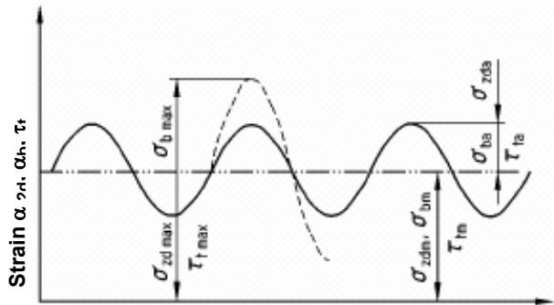
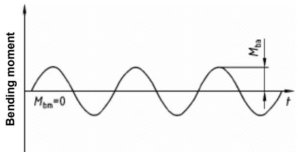
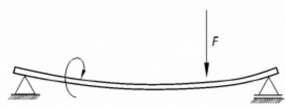
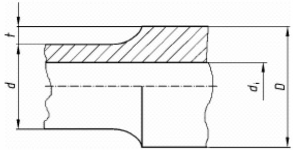
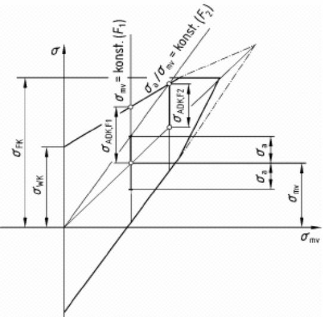
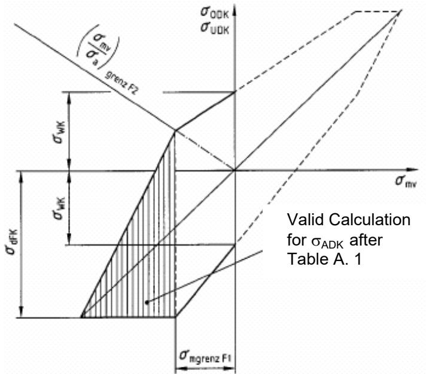
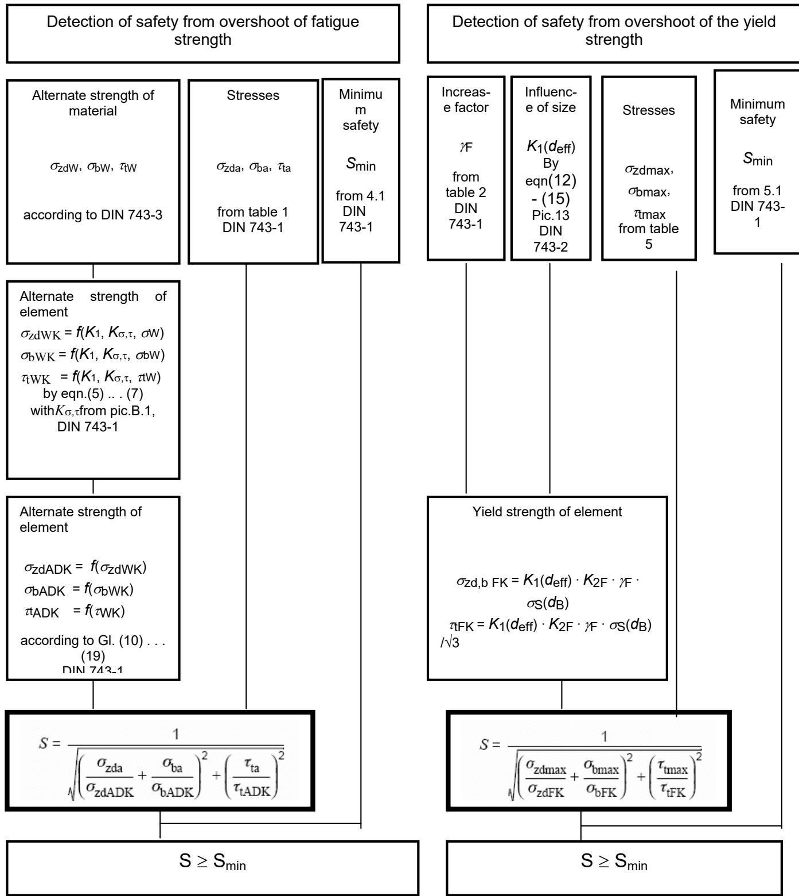
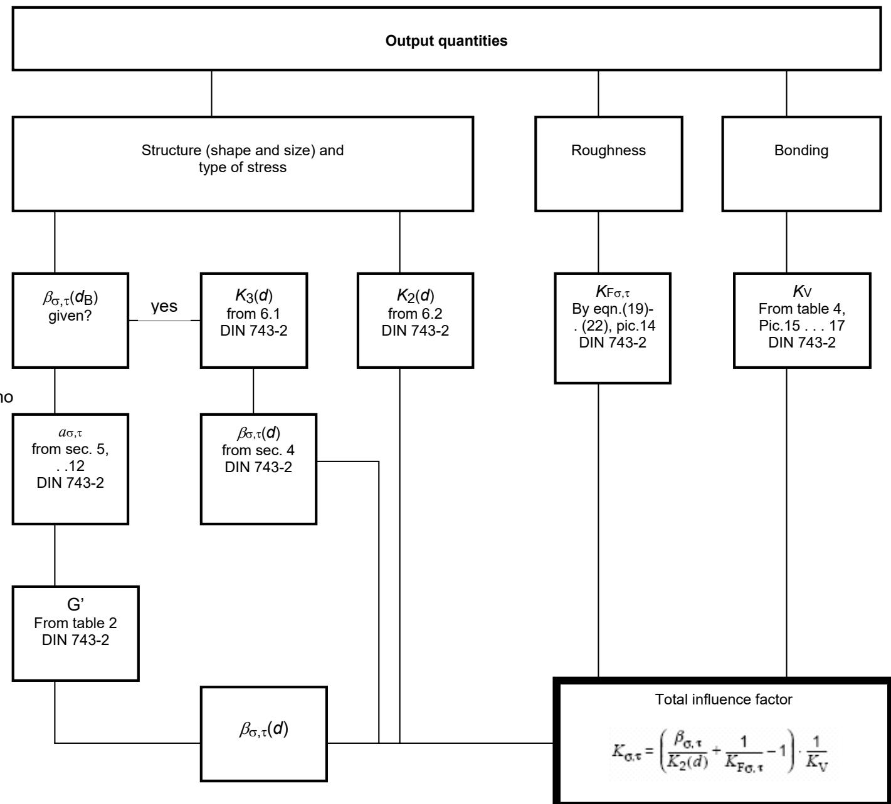

| ICS 21.120.10 Shafts and axles, calculation of load capacity – Part 1: General basis Calcul de la capacité des arbres et axes – Partie 1: Base · Contents Preface | Load capacity of shafts and axles Part 1: Introduction, basic concepts · Pages 2 | DIN 743-1 |
| --- | --- | --- |
| Introduction . | 2 |  |
| 1 Range of applications . . | 2 |  |
| 2 Normative references . . | 2 |  |
| 3 General symbols, terms and units . . | 2 |  |
| 4 Demonstration of prevention of fatigue fracture . . |  |  |
| 4.1 Safety .... 4.2 Active stress. 4.3 Fatigue strength related to form . | 3334 |  |
| 5 Demonstration of prevention of permanent deformation, |  |  |
| cracking and overload breakage under maximum load . 5 |  |  |
| 5.1 Safety ... 5.2 Yield strength of element . . 5.3 Active stress.(maximum stress) | 556 |  |
| Appendix A (informative) Explanations regarding actions of load and stress, cross sectional dimensions and finding out σADK from Smith-Diagram . . |  |  |
| 7 Appendix B (informative) Schematic sequence of the detection of safety. . . | 9 |  |
|  | Continuation pages 2 to 10 |  |
|  | Standardizing Committee for Machine Manufacture (NAM) in DIN German Institute for Standardization .e.V. |  |

## Preface

This standard was worked out by experts from the Standardizing Committee for Machine Manufacture (NAM) in the DIN German Institute for Standardization e.V., Motive Power Engineering (Ant, AA 2.2) and the Institute for Machine elements und Machine construction of TU Dresden.

DIN 743 “Calculation of load capacity of shafts and axles“ consists of:

—Part 1: “Introduction, basic concepts“;

– Part 2: “Stress concentration factor and fatigue notch factor“;

– Part 3: “Strength of materials“;

— Supplement 1: “Examples of applications“.

## Introduction

A large number of failures in machine manufacturing cause damages to shafts and axles. The most common causes for this are endurance failures (fatigue failures, fatigue fractures). Besides the optimum constructive form, the calculation of safety against the onset of endurance failures and damages due to maximum load (permanent deformation, cracking) seems to be a necessary measure.

This standard contains the basic equations and the methodical procedures for the verification of load capacity for shafts and axles. This verification is carried out by determining a (mathematical) safety (safety from endurance failures and damages due to maximum load). With safety the uncertainties in the basic concepts of computation and design loadings ar considered. The significance of the equipment and consequent damages are not considered in the minimum required safety factor of 1.2 used below.

## 1 Range of application

This standard is valid for detection of safety of shafts and axles from

-Fatigue failures (fatigue fracture, endurance failure) during overshoot of the fatigue strength.

Permanent deformation (or cracking or overload breakage). During the calculation of safety from fatigue failure constant stress amplitudes equivalent to deterioration are taken as the basis. These are obtained from the specified load or are determined with suitable deterioration hypotheses. For the calculation of safety from permanent deformation, the maximum apparent stress is decisive. This is obtained from the specified or determined maximum load (see [1]).

The range of application is limited to steels. Welded elements are to be gone over separately. This standard does not apply to them. Deviations from the standard are permissible, if the permissibility of the construction are verified theoretically or experimentally.

The basis of checking the deviations are added to the construction documentation of the development operation and similarly the calculation fundamentals. If in the following only shafts are mentioned, the same versions are applicable to axles also.

Limitations of application: The verification of load capacity is valid for:

Tension/compression, bending, torsion as individual stress and combined in the alternate or pulsating stress range; no dominating lateral force thrust; no buckling (due to compressive strain);

Temperature range $- 4 0 \ ^ { \circ } \mathsf { C } \leq \mathsf { u } \leq 1 5 0 \ ^ { \circ } \mathsf { C } ;$

Rotating bending and flat bending are not differentiated (as the strength values in DIN 743-3 for bending stress are determined by rotating bending tests, it is based on the details of unfavourable cases.

Corrosion free environmental media (air, chemically neutral oil).

The strength values for safety from endurance failure are determined for the ultimate number of cycles $N _ { \mathsf { G } } = \mathsf { 1 0 } ^ { \mathsf { 7 } }$ and comes as fatigue strength values for the annex.

## 2 Normative references .

This standard contains conventions from other publications through dated and undated references. These normative references are cited at the respective places in the text, and the publications are mentioned next to them. In dated references later amendments or work-overs of these publications concern only this standard, in case they have undergone any amendments or work-overs. In undated references the last issue of the publication referred to is applicable.

## DIN 743-2

Load capacity of shafts and axles

Part 2: Stress concentration factors and fatigue notch factors. DIN 743-3

Load capacity of shafts and axles

Part 3: Strength of materials.

[1] FKM-guideline: Mathematical verification of strength for Machine elements. Research Curatorium Machine Manufacture.

(FKM), VDMA-Publication Frankfurt/Main 1998

3 General symbols, terms and units Terms
| Symbols | Terms |  | Units |
| --- | --- | --- | --- |
| $d$ | element diameter notch cross section, wall | in | Mm |
|  | thickness in the edge cross section |  |  |
| $d _ { \mathsf { B } }$ $d _ { \mathsf { e f f } }$ | Nominal diameter Effective diameter for the |  | Mm Mm |
| $d _ { \mathrm { i } }$ | heat treatment Inner diameter (Bore |  | Mm |
|  | diameter) |  |  |
| $n$ | Support factor |  |  |
| $r$ $F$ | Notch radius |  | Mm N |
| $\pmb { G }$ | Force |  | N/mm³ |
| $G ^ { \prime }$ | Line drop Relative line drop |  | $\mathsf { m m } ^ { - 1 }$ |
| $H$ |  |  | ${ \mathsf { N } } ^ { 2 } / { \mathsf { m m } } ^ { 4 }$ |
| $K _ { \sigma , \tau }$ | Auxiliary value (for negative mean stress) Total influence factor |  |  |
|  | (Bending, tension/ compression and torsion) |  |  |
| $\mathsf { K } _ { 2 \mathsf { F } }$ $K _ { \mathsf { F } \sigma } , K _ { \mathsf { F } \tau }$ | Static support effect Influence factor for |  |  |
| $\kappa _ { \vee }$ | surface roughness Influence factor for |  |  |
| $K _ { 1 } ( d _ { \mathsf { e f f } } )$ | surface bonding Technological influence |  |  |
| $K _ { 2 } ( d )$ | factor for size Geometrical influence |  |  |
|  | factor for size (for the unnotched, polished round samples) |  |  |
| $K _ { 3 } ( d )$ | Geometrical influence factor for size (for the fatigue notch factor) |  |  |

| Symbols | Terms | Units |
| --- | --- | --- |
| $M _ { \mathrm { b } }$ | Bending moment | Nm |
| $R _ { z }$ $\mathtt { s }$ | Average depth of roughness Existing safety | μm |
| $S _ { \mathrm { m i n } }$ $\tau$ | Required lowest safety Torsional moment | Nm |
| $\alpha _ { \sigma } , \alpha _ { \tau }$ $\beta _ { \sigma } , \beta _ { \tau }$ | Stress concentration factor Fatigue notch factor |  |
| $\sigma _ { \sf z d } , \sf b _ { \tau } \sf W ,$ TtW | Alternate strength of material for nominal diameter dB Alternate strength of element1) | ${ \mathsf { N } } / { \mathsf { m m } } ^ { 2 }$ ${ \mathsf { N } } / { \mathsf { m m } } ^ { 2 }$ |
| $\sigma _ { \mathrm { z d } } , \mathsf { b } \mathsf { W } \mathsf { K } ,$ TtWK $\sigma _ { \mathsf { z d } } , \mathsf { b A D K } ,$ $\tau _ { \mathrm { t } } \mathsf { A D K }$ | Stress amplitude of fatigue strength of element for a definite mean stress | ${ \mathsf { N } } / { \mathsf { m m } } ^ { 2 }$ |
| $\sigma _ { \mathsf { z d } } , \mathsf { b O D K } ,$ $\tt r o D K$ | Maximum stress of fatigue strength of element for a | ${ \mathsf { N } } / { \mathsf { m m } } ^ { 2 }$ |
| $\sigma _ { \mathsf { m } } , \tau _ { \mathsf { m } }$ | definite mean stress Mean stress1) | ${ \mathsf { N } } / { \mathsf { m m } } ^ { 2 }$ |
| $\sigma _ { \mathsf { a } } , \tau _ { \mathsf { f a } }$ | Stress amplitude1) | ${ \mathsf { N } } / { \mathsf { m m } } ^ { 2 }$ |
| $\sigma _ { 0 } , \tau _ { 0 }$ | Maximum stress1) | $\mathsf { N } / \mathsf { m m } ^ { 2 }$ |
| $\sigma _ { \mathrm { u } } , \ \tau _ { \mathrm { u } }$ | Minimum stress1) | ${ \mathsf { N } } / { \mathsf { m m } } ^ { 2 }$ |
| $\sigma _ { z \mathsf { d } , \mathsf { b } } \mathsf { F } \mathsf { K } ,$ TFK | Yield strength of element1) | $\mathsf { N } / \mathsf { m m } ^ { 2 }$ |
| $\psi _ { \sigma } \mathsf { K } , \psi _ { \tau } \mathsf { K }$ | Influence factor for mean stress sensitivity |  |
| YF | Increase factor for yield strength |  |
| $\sigma _ { \mathsf { B } } ; ( R \mathsf { m } )$ | Tensile strength | ${ \mathsf { N } } / { \mathsf { m m } } ^ { 2 }$ |
| os; $( R _ { \mathsf { p 0 } , 2 } , R _ { \mathsf { e } } )$ | Elastic limit | ${ \mathsf { N } } / { \mathsf { m } } { \mathsf { m } } ^ { 2 }$ |
| ObF | Yield strength for bending | ${ \mathsf { N } } / { \mathsf { m m } } _ { 2 } ^ { 2 }$ |
| TF | Yield strength for torsion | $\mathsf { N } / \mathsf { m m } ^ { \angle }$ |

## Indices

A Yielding amplitude   
a Existing amplitude   
b Bending   
bW Alternate bending-  
D Fatigue strength   
K Notched element   
m Mean   
max Maximum   
t, τ Torsion   
σ Bending, tension/compression   
V comparative-  
W Alternating   
zd Tension/ compression

## 4 Demonstration of prevention of fatigue fractures 4.1 Safety

The mathematical safety S must be equal to or greater than the minimum safety $\mathsf { S } _ { \mathsf { m i n } } \mathrm { : }$

$$
S \geq S _ { \mathrm { m i n } }\tag{1}
$$

The basic principal for the course of calculations alone requires the minimum safety to be $S _ { \mathrm { m i n } } = 1 . 2 .$

Uncertainties in the designs for load, possible consequent damages etc. call for higher safety. These have to be discussed and laid down.

The mathematical safety is determined under the consideration of bending, tension/compression and torsion under the design of phase balance $^ 2 \rangle :$

$$
S = \frac { 1 } { \sqrt { \left( \frac { \sigma _ { \mathrm { z d a } } } { \sigma _ { \mathrm { z d A D E } } } + \frac { \sigma _ { \mathrm { b a } } } { \sigma _ { \mathrm { b a D E } } } \right) ^ { 2 } + \left( \frac { \tau _ { \mathrm { m } } } { \tau _ { \mathrm { t a D E } } } \right) ^ { 2 } } }\tag{2}
$$

If e.g. only bending or torsion are there, we use

| für Biegung: | $S = \frac { \sigma _ { \mathrm { { 6 A D E } } } } { \sigma _ { \mathrm { { f s } } } }$ | 2) |  | (3) |
| --- | --- | --- | --- | --- |
| für Torsion: | $S = \frac { \tau _ { \mathrm { t a D E } } ^ { \mathrm { ~ \scriptsize ~ 2 ) ~ } } } { \tau _ { \mathrm { t a } } }$ |  |  | (4) |

Equation (3) is analogous for tension/compression, in which $\sigma _ { \tt b a }$ is replaced by $\sigma _ { z \mathsf { d a } }$ and σbADk by σzdADk. In dominant lateral force thrust calculations have to be carried out differently.3) In the equations (2) to (4):

Ozda, Oba, τta

Amplitudes for existing stress due to external load in the form of tension/compression, bending and torsion (acc. to table 1) and

σzdADK, ObADK, τtADK yielding amplitudes (strength for tension/compression, bending and torsion according to 4.3.

## 4.2 Active stresses

The amplitudes and mean values of active stresses are calculated from the equations in table 1.

$$
F _ { z d a } , M _ { \mathrm { b a } } , T _ { a }
$$

$$
F _ { \mathrm { z d m } } , M _ { \mathrm { b m } } , T _ { \mathrm { m } }
$$

Amplitudes of active external load and those for material fiber respectively, e. g. due to rotation of shafts, effective amplitudes of load (rotating bending). Mean values of active external load.

Table 1: Determination of active stresses
| Type of stress | Active stress | Active stress | Cross-sectionalsurfaceand therespectivesectionmodulus |
| --- | --- | --- | --- |
| Amplitude | Meanvalue |  |  |
| Tension/compression | $\sigma _ { z \mathrm { d a } } = \frac { F _ { z \mathrm { d a } } } { A }$ | $\sigma _ { z \mathrm { d m } } = \frac { F _ { z } } { A }$ | $A = { \frac { \pi } { 4 } } \cdot ( d ^ { 2 } -$ |
| Bending | $\sigma _ { \mathfrak { b a } } = \frac { M _ { \mathfrak { b a } } } { W _ { \mathfrak { b } } }$ | $\sigma _ { \mathrm { b m } } = \frac { M _ { \mathrm { b l } } } { W _ { \uparrow } }$ | $\boldsymbol { W } _ { \flat } = \frac { \pi } { 3 2 } \cdot \frac { \boldsymbol { ( d ^ { 4 } - } } { d }$ |
| Torsion | $\tau _ { \mathrm { t a } } = \frac { T _ { \mathrm { a } } } { W _ { \mathrm { t } } }$ | $\tau _ { \mathrm { t m } } = \frac { T _ { \mathrm { n } } } { W }$ | $\boldsymbol { W _ { \mathrm { t } } } = \frac { \pi } { 1 6 } \cdot \frac { \left( \boldsymbol { d } ^ { 4 } - \boldsymbol { a } \right. } { \left. \boldsymbol { d } \right. }$ |
| Note: In the compression region $\sigma _ { Z \mathrm { d m } }$ and $\mathcal { O } \mathfrak { b } \mathfrak { m }$ are negative;see pictures A.1, A.2 for this (Appendix A). | Note: In the compression region $\sigma _ { Z \mathrm { d m } }$ and $\mathcal { O } \mathfrak { b } \mathfrak { m }$ are negative;see pictures A.1, A.2 for this (Appendix A). | Note: In the compression region $\sigma _ { Z \mathrm { d m } }$ and $\mathcal { O } \mathfrak { b } \mathfrak { m }$ are negative;see pictures A.1, A.2 for this (Appendix A). | Note: In the compression region $\sigma _ { Z \mathrm { d m } }$ and $\mathcal { O } \mathfrak { b } \mathfrak { m }$ are negative;see pictures A.1, A.2 for this (Appendix A). |

## 4.3 Fatigue strength related to form

The fatigue strength related to form szd,b ADK, (ttADK) of the element is derived from the strength of the smooth sample rods. They are given as nominal stress and indicate the maximum continuous yielding amplitude of the element for the present load case. Here we consider:

— Heat-treatability and similarly hardenability, if not known directly, for example, from hardness measurements for the decisive positions, approximately depend on the element diameter (technological influence factor for size $K _ { 1 } ( d _ { \mathsf { e f f } } ) )$

– Transition of the dynamic bending strength on to the dynamic tension/compression strength with increasing diameter through the diminution of the stress gradients (geometrical influence factor for size K2(d));

– Element structure, especially notches (fatigue notch factor βσ(d), βτ(d));

— Surface roughness (roughness factor $K _ { \mathsf { F o } }$ and $\displaystyle { \cal K } _ { \mathrm { F } \tau } ) ;$

\- Influence of barrier layer bonding and internal compressional stress effective on the surface (bonding factor $\begin{array} { r } { \kappa _ { \vee } ) ; } \end{array}$

— Influence of mean stress on the yielding stress amplitude

(strength), (factor of mean stress sensitivity $\psi _ { \sigma } \mathsf { K }$ and Ψτκ).

One must try to start from alternate strengths present on the concrete elements and on the calculating positions, e.g. calculated from the hardness measured there. If the requisite conditions are not present for this, σzdw(d), σbw(d), τtw(d) are approximately determined from

σzdW(dB), σbw(dB), τtW $( d _ { \mathsf { B } } )$ for the sample diameter $d _ { \mathsf { B } }$ (nominal diameter) and from a size factor ${ K _ { 1 } ( d _ { \mathrm { e f f } } ) \ ( \mathrm { e . g . \ } \sigma _ { \mathrm { b W } } ( d ) \approx K _ { 1 } ( d _ { \mathrm { e f f } } ) }$ $\sigma _ { \mathsf { b W } } ( d _ { \mathsf { B } } ) )$

The calculation of fatigue strength of the element under the consideration of the mentioned influences is carried out by the equations (10) to (14) and (15) to (19) with the help of the equations (5) to (7) (alternate strength of the element) and (8), (9). The alternate strength of the (notched) element is:

$$
\sigma _ { \mathrm { z d W K } } = \frac { \sigma _ { \mathrm { z d W } } ( d _ { \mathrm { B } } ) \cdot K _ { 1 } ( d _ { \mathrm { e f f } } ) } { K _ { \mathrm { \sigma } } }\tag{4}
$$

$$
\sigma _ { \mathrm { b W K } } = \frac { \sigma _ { \mathrm { b W } } ( d _ { \mathrm { B } } ) \cdot K _ { 1 } ( d _ { \mathrm { e f f } } ) } { K _ { \mathrm { c } } }\tag{4}
$$

$$
\tau _ { \mathrm { t W K } } = \frac { \tau _ { \mathrm { t W } } ( d _ { \mathrm { B } } ) \cdot K _ { 1 } ( d _ { \mathrm { e f f } } ) } { K _ { \tau } }\tag{4}
$$

In the equations (5) to (7) :
| $K _ { 1 } ( d _ { \mathsf { e f f } } )$ $\sigma _ { \mathrm { b W } } ( d _ { \mathsf { B } } ) , \sigma _ { \mathrm { Z d W } } ( d _ { \mathsf { B } } ) , \tau _ { \mathrm { t W } } ( d _ { \mathsf { B } } )$ $d _ { \mathsf { B } }$ | Technological influence factor for size (Hardenability, heat- treatability according to DIN 743-2) for tensile strength; Alternate strength of the smooth sample rods for the nominal diameter |
| --- | --- |

The total influence factor $K _ { \sigma , \ast }$ t for tension/compression and bending

$$
K _ { \sigma } = \left( \frac { \beta _ { \sigma } } { K _ { 2 } ( d ) } + \frac { 1 } { K _ { \sigma } } - 1 \right) \cdot \frac { 1 } { K _ { \mathrm { V } } }\tag{8}
$$

Similarly for torsion

$$
K _ { \tau } = \left( \frac { \beta _ { \tau } } { K _ { 2 } ( d ) } + \frac { 1 } { K _ { \tau } } - 1 \right) \cdot \frac { 1 } { K _ { \mathrm { V } } }\tag{9}
$$

is to be determined with the following values by DIN 743-2:

$\beta \sigma$ Fatigue notch factor for tension/compression and bending (for torsion $\beta \tau ) ;$

$K _ { 2 } ( d )$ Geometrical influence factor for size (decrease in σbw against $\sigma _ { z \mathsf { d W } }$ with increasing diameter, analogous to torsion);

$K _ { \mathsf { F o } }$ Influence factor for surface roughness for

$$
( K _ { \mathsf { F } } \tau
$$

$\kappa _ { \vee }$ Influence factor for surface bonding (e.g. shot peening or boundary layer hardening).

The form-related strength is calculated, depending on the proportion in which the effective stress changes during a rise in stress. Two stress cases are differentiated here (in a doubtful case, the detection can be carried out on the basis of case 2 with

$$
\sigma _ { \mathsf { Z } \mathsf { d } \mathsf { m } } + \sigma _ { \mathsf { b } \mathsf { m } } \geq 0 ) .
$$

Case 1 $\begin{array} { r l } { ( \sigma _ { \mathrm { m v } } = } \end{array}$ constant, as $\tau _ { \mathrm { m v } } =$ constant):

Case 1 is valid, if the stress amplitude changes with the change in the operating load and the mean stress remains constant. Under the condition

$$
\sigma _ { \mathrm { r a v } } \leq \frac { \sigma _ { z \mathrm { d , b } \in \mathbb { K } } - \sigma _ { z \mathrm { d , b W E } } } { 1 - \Psi _ { z \mathrm { d , b e F S } } }
$$

bzw.

$$
\tau _ { \mathrm { m a x } } \leq \frac { \tau _ { \mathrm { q E K } } - \tau _ { \mathrm { e w e } } } { 1 - \Psi _ { \mathrm { \pm K } } }
$$

$$
\mathrm { t h e \ y i e l d i n g \ a m p l i t u d e \ f o r \ } \sigma _ { \mathrm { m v } } = \mathrm { c o n s t . \ } ( \tau _ { \mathrm { m v } } = \mathrm { c o n s t . } ) \mathrm { : }
$$

$$
\sigma _ { z \tt d A D E } = \sigma _ { z \tt d W E } - \psi _ { z \tt d C E } \cdot \sigma _ { \tt m w }\tag{10}
$$

$$
\begin{array} { r l } { \sigma _ { \tt b A D E } } & { { } = \sigma _ { \tt b W E } - \Psi _ { \tt b O E } \cdot \sigma _ { \tt m w } } \end{array}\tag{11}
$$

$$
\begin{array} { r l } { \tau _ { \mathrm { t A D E } } } & { { } = \tau _ { \mathrm { t W E } } - \Psi _ { \mathrm { t X } } \cdot \tau _ { \mathrm { m w } } } \end{array}\tag{12}
$$

if this condition is not fulfilled, the yielding amplitude for $\sigma _ { \mathrm { m v } } =$ const. (τmv = const.):

$$
\sigma _ { \mathrm { z d , b \ A D K } } \ = \sigma _ { \mathrm { z d , b F K } } - \sigma _ { \mathrm { m v } }\tag{13}
$$

$$
\begin{array} { r l r } { \tau _ { \mathrm { t A D K } } } & { { } } & { = \tau _ { \mathrm { t F K } } - \tau _ { \mathrm { m v } } } \end{array}\tag{14}
$$

If $\sigma _ { \mathrm { z d m } } + \sigma _ { \mathrm { b m } } < 0$ replace $\sigma _ { \mathrm { m v } }$ (in equation (23))

$$
\mathrm { m i t ~ } \sigma _ { \mathrm { m v } } = \frac { H } { \vert H \vert } \cdot \sqrt { \vert H \vert } ; H = \frac { ( \sigma _ { \mathrm { b m } } + \sigma _ { \mathrm { z d m } } ) ^ { 3 } } { \left. ( \sigma _ { \mathrm { b m } } + \sigma _ { \mathrm { z d m } } ) \right. } + 3 \cdot \tau _ { \mathrm { t m } } ^ { 2 }
$$

and with it $\tau _ { \mathrm { m v } }$ to be calculated from equation (24). If $\sigma _ { \mathrm { m v } } < 0$ 9 use $\tau _ { \mathrm { m v } } = 0$ . The condition for the suitability of the equations (10) to (12) for normal stress is $\sigma _ { \mathsf { m v } } \geq \sigma _ { \mathsf { m v g r e n } z } \mathsf { F } 1$ (see pic.A.5, Appendix A). If this condition is not fulfilled, use table A.1, Appendix A.

Case 2 $( \sigma _ { \mathrm { { m v } } } I \sigma _ { \mathrm { { z d } , \mathrm { { b a } } } } =$ constant as $\tau _ { \mathrm { m v } } I \tau _ { \mathrm { t a } } =$ constant):

Case 2 is valid, if the ratio between the deflected stress and the mean stress remains constant during a change in the operating load. Under the condition

$$
\frac { \sigma _ { \mathrm { m v } } } { \sigma _ { \mathrm { z d , b a } } } \leq \frac { \sigma _ { \mathrm { z d , b F K } } - \sigma _ { \mathrm { z d , b W K } } } { \sigma _ { \mathrm { z d , b W K } } - \sigma _ { \mathrm { z d , b F K } } \cdot \Psi _ { \mathrm { z d , b O K } } }
$$

bzw.

$$
\frac { \tau _ { \mathrm { m v } } } { \tau _ { \mathrm { t a } } } \leq \frac { \tau _ { \mathrm { t F K } } - \tau _ { \mathrm { t W K } } } { \tau _ { \mathrm { t W K } } - \tau _ { \mathrm { t F K } } \cdot \Psi _ { \mathrm { t K } } }
$$

the yielding amplitude for $\sigma _ { \mathrm { { m v } } } / \sigma _ { \mathrm { { z d } , \mathrm { { b a } } } } =$ constant

(τmv/ τta = constant):

$$
\sigma _ { \mathrm { z d A D K } } = \frac { \sigma _ { \mathrm { z d W K } } } { 1 + \Psi _ { \mathrm { z d o K } } \cdot \sigma _ { \mathrm { m v } } / \sigma _ { \mathrm { z d a } } }
$$

$$
\sigma _ { \mathrm { b A D K } } = \frac { \sigma _ { \mathrm { b W K } } } { 1 + \Psi _ { \mathrm { b o K } } \cdot \sigma _ { \mathrm { m v } } / \sigma _ { \mathrm { b a } } }
$$

$$
\tau _ { \mathrm { t A D K } } = \frac { \tau _ { \mathrm { t W K } } } { 1 + \Psi _ { \tau \mathrm { K } } \cdot \tau _ { \mathrm { m v } } / \tau _ { \mathrm { t a } } }
$$

If this condition is not fulfilled, the yielding amplitude for $\sigma _ { \mathrm { { m v } } } / \sigma _ { \mathrm { { z d } , \mathrm { { b a } } } } =$ const. $( \tau _ { \mathrm { { m v } } } I \tau _ { \mathrm { { t a } } } = \tt c o n s t . ) .$

$$
\sigma _ { \mathrm { z d , b A D K } } = \frac { \sigma _ { \mathrm { z d , b F K } } } { 1 + \sigma _ { \mathrm { m v } } / \sigma _ { \mathrm { z d , b a } } }
$$

$$
\tau _ { \mathrm { t A D K } } = \frac { \tau _ { \mathrm { t F K } } } { 1 + \tau _ { \mathrm { m v } } / \tau _ { \mathrm { t a } } }
$$

with

ψσK, ΨτK

Influence factor for mean stress sensitivity for

tension/compression, bending and torsion by equations (20) to (22);

σzdWK, ObWK, τtWK

By equations (5) to (7);

Ozda, Oba, τta

Stress amplitude according to table 1;

σmv, τmv Comparative mean stress by equations (23) and (24);

σzd,bFK, τtFK

Yield strength of element by equation (28) and (29) respectively.

If σzdm $+ \sigma _ { \mathrm { { b m } } } < 0$ replace $\sigma _ { \mathsf { m v } }$ (in equation (23))

$$
\sigma _ { \mathrm { m v } } = { \frac { H } { \left| H \right| } } \cdot { \sqrt { \left| H \right| } } ; H = { \frac { ( \sigma _ { \mathrm { b m } } + \sigma _ { \mathrm { z d m } } ) ^ { 3 } } { \left| ( \sigma _ { \mathrm { b m } } + \sigma _ { \mathrm { z d m } } ) \right| } } + 3 \cdot { \tau _ { \mathrm { t m } } ^ { 2 } }
$$

and calculate using $\tau _ { \mathrm { m v } }$ by equation (24). If $\sigma _ { \mathrm { m v } } < 0$ use $\tau _ { \mathrm { m v } } = 0$ . The condition for the suitability of equations (15) to (17) for normal stress is

$$
\frac { \sigma _ { \mathrm { m v } } } { \sigma _ { z \mathrm { d , b a } } } > \left( \frac { \sigma _ { \mathrm { m v } } } { \sigma _ { z \mathrm { d , b a } } } \right) _ { \mathrm { g r e n } z \mathrm { F } 2 }
$$

If this condition is not fulfilled, use table A.1 and pic.A.5 (Appendix A).

The influence factors for mean stress sensitivity are calculated using equations (20) to (22):

$$
\Psi _ { \mathrm { z d o K } } = \frac { \sigma _ { \mathrm { z d W K } } } { 2 \cdot K _ { 1 } ( d _ { \mathrm { e f f } } ) \cdot \sigma _ { \mathrm { B } } ( d _ { \mathrm { B } } ) - \sigma _ { \mathrm { z d W K } } }\tag{2}
$$

$$
\Psi _ { \mathrm { b o K } } = \frac { \sigma _ { \mathrm { b W K } } } { 2 \cdot K _ { 1 } ( d _ { \mathrm { e f f } } ) \cdot \sigma _ { \mathrm { B } } ( d _ { \mathrm { B } } ) - \sigma _ { \mathrm { b W K } } }\tag{2}
$$

$$
\Psi _ { \mathrm { { } ^ { t K } } } = \frac { \tau _ { \mathrm { t W K } } } { 2 \cdot K _ { 1 } ( d _ { \mathrm { e f f } } ) \cdot \sigma _ { \mathrm { B } } ( d _ { \mathrm { B } } ) - \tau _ { \mathrm { t W K } } }\tag{2}
$$

In the equations (20) to (22)

$K _ { 1 } ( d _ { \mathsf { e f f } } )$ is the technological influence factor for size (heattreatability, hardenability) according to DIN 743-2 for the tensile strength

σB is the tensile strength for the sample diameter $d _ { \mathsf { B } }$

The comparative mean stresses are calculated using equations (23) and (24):

$$
\sigma _ { \mathrm { m v } } = \sqrt { \left( \sigma _ { \mathrm { z d m } } + \sigma _ { \mathrm { b m } } \right) ^ { 2 } + 3 \cdot \tau _ { \mathrm { t m } } ^ { 2 } }\tag{23}
$$

$$
\tau _ { \mathrm { m v } } = \frac { \sigma _ { \mathrm { m v } } } { \sqrt { 3 } }\tag{24}
$$

## 5 Demonstration of prevention of permanent deformation, cracking and overload breakage under maximum load

## 5.1 Safety

The mathematical safety S must be equal to or more than the minimum safety $S _ { \mathrm { m i n } } ( S 2 \ S _ { \mathrm { m i n } } ; S$ analogous to equation (1)). The basic principal of the process of calculation alone requires the minimum safety to be $S _ { \mathrm { m i n } } = 1 . 2$ Uncertainties during the evaluation of maximum load, possible resultant damages etc. demand higher safeties. These are to be discussed and worked out.

NOTE: While determining the minimum safety $S _ { \mathrm { m i n } }$ it is sensible to refer to the deformation capacity of the material.

If no danger of brittle fracture arises, generally there is no ( cracking and no overload breakage in structural and heattreatable steel under maximum load in regular range of treatable steel under maximum load in regular range of application before a permanent deformation of the element. application before a permanent deformation of the element.

Even in shafts with hard boundary layer (e.g. case hardened shafts) generally an elementary deformation occurs before cracking takes place, if notches are not too sharp (approximately $\alpha _ { \sigma , \tau } \leq 3 )$ . Therefore, in order to carry out the detection of safety from permanent deformation as the basic demonstration for the maximum stress, the following is shown.

The existing safety for a strain composed of tension/compression, bending and torsion is calculated by equation (25):

$$
S = \frac { 1 } { \sqrt { \left( \frac { \sigma _ { \mathrm { z d m a x } } } { \sigma _ { \mathrm { z d F K } } } + \frac { \sigma _ { \mathrm { b m a x } } } { \sigma _ { \mathrm { b F K } } } \right) ^ { 2 } + \left( \frac { \tau _ { \mathrm { t m a x } } } { \tau _ { \mathrm { t F K } } } \right) ^ { 2 } } }\tag{25}
$$

In bending or torsion alone, e.g., apply:

for bending

$$
S = \frac { \sigma _ { \tiny { 6 } \tt { E } } } { \sigma _ { \tiny { 6 } \tt { m a x } } }\tag{26}
$$

$$
S = \frac { \tau _ { \mathrm { t F K } } } { \tau _ { \mathrm { t m a x } } }
$$

for torsion:

(27)

(Equation (26) is analogous for tension/compression, in which replace σbmax by

σzdmax and σbFκ by $\sigma _ { \sf z d F K . } )$

In the equations (25) to (27)

σzdmax, Obmax, τtmax

Existing maximum stress (Nominal stress) due to the operating load. It is determined by table 5, where the maximum

present loads $F _ { \mathrm { z d m a x } } ,$

$M _ { \mathrm { b m a x } }$ and $\tau _ { \mathrm { m a x } }$ are inserted.

σzdFK, ObFK, τtFK

Yield strength of element in tension/compression, bending and torsion

respectively (see 5.2).

## 5.2 Yield strength of element

One has to try to start from the elastic limit $\sigma _ { \mathsf { s } } ( { \mathsf { \pmb { d } } } )$ present on the cross section of the concrete element. If it is not known, $\sigma _ { \mathsf { s } } ( { \mathsf { \pmb { d } } } )$ can be approximately determined from the

elastic limit valid for the sample diameter $d _ { \mathsf { B } }$ (nominal diameter) and a size factor $K _ { 1 } ( d _ { \mathsf { e f f } } ) . \qquad ( \sigma _ { \mathsf { s } } ( d ) = \sigma _ { \mathsf { s } } ( d _ { \mathsf { B } } ) \cdot K _ { 1 } ( d _ { \mathsf { e f f } } ) )$ . In this procedure yield strengths of elements are determined from the equations (28) and (29).

$$
\sigma _ { \mathrm { z d , b F K } } ^ { } = K _ { 1 } ( d _ { \mathsf { e f f } } ) \cdot K _ { 2 \mathrm { F } } \cdot \gamma _ { \mathrm { F } } \cdot \sigma _ { \mathrm { S } } ( d _ { \mathsf { B } } )\tag{28}
$$

$$
\begin{array} { r l r } { \tau _ { \mathrm { t F K } } } & { { } } & { = K _ { 1 } ( d _ { \mathrm { e f f } } ) \cdot K _ { 2 \mathrm { F } } \cdot \gamma _ { \mathrm { F } } \cdot \sigma _ { \mathrm { S } } ( d _ { \mathrm { B } } ) / \sqrt { 3 } } \end{array}\tag{29}
$$

In the equations (28) and (29) we have

$K _ { 1 } ( d _ { \mathsf { e f f } } )$ Technological influence factor for size (heat-treatability, hardenability) according to DIN 743-2 for the elastic limit;

$$
\mathsf { K } _ { 2 \mathsf { F } }
$$

static support effect from tables 3 and 4 due to local plastic deformation on or under the boundary layer;

NF increase factor of yield strength through multi-axial stress condition in rotating notches and local bonding according to table 2. If there are no rotating notches, $\varkappa = 1 ;$

σs(dB) elastic limit for nominal diameter dB acc. to DIN 743- 3; in hard boundary layer the values apply to the core.

Table 2: Increase factor for yield strength $\mathcal { W }$ in rotating notches (ασ and βσ by DIN 743-2)
| Type of stress | ασ or $\underline { { \beta _ { \sigma } } }$ | YF |
| --- | --- | --- |
| Tension/compression or bending | up to 1.51.5 to 2.02.0 to 3.0above 3.0 | 1.001.051.101.15 |
| Torsion | As desired | 1.00 |
| NOTE: Due to the multi-axiality of the stress condition and otherwise even in rotating notches the yield strength of element rises indeedbut even the danger of deformation type failures increases. | NOTE: Due to the multi-axiality of the stress condition and otherwise even in rotating notches the yield strength of element rises indeedbut even the danger of deformation type failures increases. | NOTE: Due to the multi-axiality of the stress condition and otherwise even in rotating notches the yield strength of element rises indeedbut even the danger of deformation type failures increases. |

Table 3: Static support effect K2F for materials without hard boundary layer
| Type of stress | K2FSolid shafts | Hollow shafts |
| --- | --- | --- |
| Tension/compression | 1.0 | 1.0 |
| Bending | 1.2 | 1.1 |
| Torsion | 1.2 | 1.0 |

Table 4: Static support effect K2F for materials with hard boundary layer

| Type of stress | K2FSolid shafts | Hollow shafts |
| --- | --- | --- |
| Tension/compression | 1.0 | 1.0 |
| Bending | 1.1 | 1.0 |
| Torsion | 1.1 | 1.0 |
| NOTE: Greater support numerals6 $\mathsf { K } _ { 2 \mathsf { F } }$ can be used, if it is verified that there is no cracking in the hard boundary layer. In very sharpnotches $( \mathsf { e } . \mathsf { g } . , \alpha _ { \sigma , \tau } \geq 3 )$ and hard boundary layers, we may need to use $K _ { 2 \mathsf { F } } < \mathsf { \Omega }$ 1 | NOTE: Greater support numerals6 $\mathsf { K } _ { 2 \mathsf { F } }$ can be used, if it is verified that there is no cracking in the hard boundary layer. In very sharpnotches $( \mathsf { e } . \mathsf { g } . , \alpha _ { \sigma , \tau } \geq 3 )$ and hard boundary layers, we may need to use $K _ { 2 \mathsf { F } } < \mathsf { \Omega }$ 1 | NOTE: Greater support numerals6 $\mathsf { K } _ { 2 \mathsf { F } }$ can be used, if it is verified that there is no cracking in the hard boundary layer. In very sharpnotches $( \mathsf { e } . \mathsf { g } . , \alpha _ { \sigma , \tau } \geq 3 )$ and hard boundary layers, we may need to use $K _ { 2 \mathsf { F } } < \mathsf { \Omega }$ 1 |

## 5.3 Active stresses (Maximum stress)

The active stresses are to be calculated using table 5.

Table 5: Determination of maximum stresses (maximum nominal stresses)
| Type of stress | Active stress | Cross sectional plane and the respectivesection modulus |
| --- | --- | --- |
| Tension/compression | $\sigma _ { z \dot { a } \mathrm { m a x } } = \frac { \overline { { F } } _ { z \dot { a } \mathrm { m a x } } } { A }$ | $\mathscr { A } = \frac { \pi } { 4 } \cdot ( d ^ { 2 } - d _ { \mathrm { i } } ^ { 2 } )$ |
| Bending | $\sigma _ { \natural \mathrm { { r m a x } } } = { \frac { M _ { \natural \mathrm { { r m a x } } } } { W _ { \natural } } }$ | $W _ { \flat } = \frac { \pi } { 3 2 } \cdot \frac { ( \boldsymbol { d } ^ { 4 } - \boldsymbol { d } _ { \mathrm { i } } ^ { 4 } ) } { \boldsymbol { d } }$ |
| Torsion | $\overline { { \tau _ { \mathrm { t m a x } } } } = \frac { \overline { { T } } _ { \mathrm { m a x } } } { \overline { { W _ { \mathrm { t } } } } }$ | $W _ { \mathrm { t } } = { \frac { \pi } { 1 6 } } \cdot { \frac { ( d ^ { 4 } - d _ { \mathrm { i } } ^ { 4 } ) } { d } }$ |
| See pic.A.1 (Appendix A) for this. | See pic.A.1 (Appendix A) for this. | See pic.A.1 (Appendix A) for this. |

## Appendix A (informative)

Explanations regarding actions of load and stress, cross-sectional dimensions and finding out $\sigma _ { \mathsf { A D K } }$ from the Smith-

  
Diagram.

  
Timet

Pic.A.1: Temporal course of external load and strain (stress); $( \varpi = 2 \pi n > 0 )$  

Pic.A.2: Formation of the amplitude of bending moment due to rotation of shaft (rotating bending); Force F with constant direction, shaft in rotation  
  
Pic.A.3: Measurements for cross-sectional characteristic values

  
Pic.A.4: Strain cases, shown in the fatigue strength diagram (Smith-Diagram)

NOTE FOR PIC.A.4: The limiting lines of the fatigue strength diagram (Smith-Diagram) σoDk and σuDk almost represent the actual process.

  
Pic.A.5: Fatigue strength diagram with the expansion for the compression range (σdFK compressive yield strength)

The shaded area of the Smith-Diagram is defined by the point of intersection of the line extended in the compression region σuDK with the line running parallel to the absciss given by the compressive yield strength σdFK.

Table A.1: σADK in the shaded compression region for case 1 with $\sigma _ { \mathrm { m v } } <$ σmvgrenzF1 as for case 2 with $\sigma _ { \mathrm { m v } } / \sigma _ { \mathrm { a } } < ( \sigma _ { \mathrm { m v } } / \sigma _ { \mathrm { a } }$ )grenzF2 (In the compression region, apply $\sigma _ { \mathrm { m v } } < 0$ and $\sigma _ { \mathrm { { m v } } } / \sigma _ { \mathrm { { a } } } < 0 )$
| Case | $\sigma _ { \mathrm { m v g r e n z F 1 } , ( \sigma _ { \mathrm { m v } / \sigma _ { \mathrm { Z d , b a } } } ) _ { \mathrm { q r e n z F 2 } } }$ | σADK |
| --- | --- | --- |
| 1 | $\sigma _ { \mathrm { z r w g r e z r } 1 } = ( \sigma _ { \mathrm { z d , b W X } } - \sigma _ { \mathrm { d F X } } ) \cdot \left( 1 - \frac { \sigma _ { \mathrm { z d , b W K } } } { 2 \cdot \sigma _ { \mathrm { B } } ( d ) } \right)$ | $\sigma _ { \mathrm { A D K } } = \sigma _ { \mathrm { r a v } } + \sigma _ { \mathrm { d F K } }$ |
| 2 | $\left( \frac { \sigma _ { \mathrm { r a v } } } { \sigma _ { \mathrm { z d , i s e } } } \right) _ { \mathrm { g e n z F 2 } } = \frac { \sigma _ { \mathrm { z d , b W E } } - \sigma _ { \mathrm { G E } } } { \Psi _ { \mathrm { z d , b o I X } } \cdot \sigma _ { \mathrm { o f E } } + \sigma _ { \mathrm { z d , b W E } } }$ | $\sigma _ { \mathrm { A D E } } = \frac { \sigma _ { \mathrm { d E K } } \cdot \sigma _ { z \mathrm { d } , \mathrm { o a } } } { \sigma _ { z \mathrm { d } , \mathrm { o a } } - \sigma _ { \mathrm { r m } } }$ |
| If no other empirical or test values are there, we can use ${ \sigma } _ { \mathrm { d F K } } = { \sigma } _ { \mathsf { Z } } { \mathsf { F K } } ( d ) .$ $\sigma _ { \mathsf { Z F K } } ( d ) = \sigma _ { \mathsf { Z d F K } } ( d )$ by DIN 743 equation (28); σdFK and $\underline { { \sigma } } \mathtt { W K }$ are taken as positive in the equations; σdFK, $\underline { { \sigma \mathsf { w } \kappa ^ { > } 0 } }$ | If no other empirical or test values are there, we can use ${ \sigma } _ { \mathrm { d F K } } = { \sigma } _ { \mathsf { Z } } { \mathsf { F K } } ( d ) .$ $\sigma _ { \mathsf { Z F K } } ( d ) = \sigma _ { \mathsf { Z d F K } } ( d )$ by DIN 743 equation (28); σdFK and $\underline { { \sigma } } \mathtt { W K }$ are taken as positive in the equations; σdFK, $\underline { { \sigma \mathsf { w } \kappa ^ { > } 0 } }$ | If no other empirical or test values are there, we can use ${ \sigma } _ { \mathrm { d F K } } = { \sigma } _ { \mathsf { Z } } { \mathsf { F K } } ( d ) .$ $\sigma _ { \mathsf { Z F K } } ( d ) = \sigma _ { \mathsf { Z d F K } } ( d )$ by DIN 743 equation (28); σdFK and $\underline { { \sigma } } \mathtt { W K }$ are taken as positive in the equations; σdFK, $\underline { { \sigma \mathsf { w } \kappa ^ { > } 0 } }$ |

Appendix B (informative)

Schematic sequence for the detection of safety

## B.1 Overall overview

## Alternate strength of element

OWK, TWK Fatigue strength of element for a definite mean   
σADK, τtADK stress   
σzdFK, σbFK, τFK Yield strength of element   
Ozda, Oba, τta Existing stress amplitude   
σzdmax, σbmax, τtmax Maximum stress

$K _ { \sigma , \tau }$ Total influence factor from pic.B.2

K1(deff) Technological influence factor for size

$K _ { 2 } ( d )$ Geometrical influence factor for size $\kappa _ { 2 \mathsf { F } }$ Static support effect $\mathcal { F }$ Increase factor for yield strength $s , s _ { \mathrm { m i n } }$ Existing and minimum safety respectively

## B.2 Total influence factor

$\beta _ { \sigma , \tau }$ Fatigue notch factor (for tension/compression and torsion respectively)

$\alpha _ { \mathbb { O } , \tau }$ Stress concentration factor (for tension/compression, bending and torsion respectively)

${ \cal K } _ { 2 } ( d ) , { \cal K } _ { 3 } ( d )$ Geometrical influence factors for size (tension/ compression, bending and torsion respectively) for diminution of $\sigma _ { \mathsf { b W } }$ against $\sigma _ { z \mathsf { d W } }$ with increasing diameter $( K _ { 2 } ( d ) )$ and dependence of the fatigue notch factor on the diameter $( K _ { 3 } ( d ) )$

${ \mathsf d }$ Element diameter

$d _ { \mathsf { B } }$ Nominal diameter

$\vec { \mathbf { G } } ^ { \prime }$ Relative line drop (for tension/compression, bending and torsion)

$\mathsf { n }$ Support factor (for tension/compression, bending and torsion)

$\boldsymbol { \mathsf { r } }$ Notch radius

$K _ { \mathsf { F } \sigma , \tau }$ Influence factor for surface roughness (for tension/compression, bending and torsion respectively) $\kappa _ { \vee }$ Influence factor for surface bonding

Pic.B.2: Calculation of the total influence factor $\kappa _ { \mathfrak { o } , \mathfrak { r } }$
