GERMAN STANDARD October 2000

## ICS 21.120.10

Shafts and axles, calculation of load capacity – Part 2: Theoretical stress concentration factors and fatigue notch factors Calcul de la capacité des arbres et axes – Partie 2: Coefficients théoriques de la concentration des contraintes, coefficients effectifs de la concentration des contraintes

## Contents

Pages   
Preface 2   
1 Range of applications . 2   
2 Normative references . 2   
3 General symbols, terms and units . . 2   
4 Fatigue notch factor 3   
4.1 Definition of fatigue notch factor 3   
4.2 Experimentally determined fatigue notch factors . 3   
4.3 Fatigue notch factors for notches with known stress concentration factor. . 6   
5 Stress concentration factors . 7   
5.1 Definition of stress concentration factor . . 7   
5.2 Stress concentration factors for different notch configurations 7   
6 Influence factor for size. 10   
7 Influence factor for surface roughness KFσ,τ . 12   
8 Influence factor for surface bonding . 12

Continuation pages 2 to 14

Standardizing Committee for Machine Manufacture (NAM) in DIN German Institute for Standardization e.V.

## Preface

This standard was worked out by experts from the Standardizing Committee for Machine Manufacture (NAM) in the DIN German Institute for Standardization e.V., Motive Power Engineering (Ant, AA 2.2) and the Institute for Machine elements und Machine construction of TU Dresden.

DIN 743 “Calculation of load capacity of shafts and axles“ consists of:

–Part 1: “Introduction, basic concepts“;

–Part 2: “Stress concentration factor and fatigue notch factor“;   
–Part 3: “Strength of materials“;

–Supplement 1: “Examples of applications“.

## 1 Range of applications

This standard includes the influence factors for size, surface factors, stress concentration factors or fatigue notch factors necessary for the calculation of fatigue strength of elements according to DIN 743- 1 (for further details see [11]). If the user has his own known values and conclusions, he can use those quantities and factors in place of the respective factors given here for the calculations.

The stress concentration and fatigue notch factors given here are applicable to solid shafts or hollow shafts with wall thickness, on which no influence of notches through boring has effect. For circulating notches the condition $( D - d _ { \mathrm { i } } ) / ( 2 \cdot \textit { t } ) \geq 3$ serves as orientation (see DIN 743-1, Appendix A).

## 2 Normative references

This standard contains conventions from other publications through dated and undated references. These normative references are cited at the respective places in the text, and the publications are mentioned next to them. In dated references later amendments or work-overs of these publications concern only this standard, in case they have undergone any amendments or work-overs. In undated references the last issue of the publication referred to is applicable.

DIN 6892 Drive type fastening without clamping – Feathers – Computation and designing

[1] R. E. Peterson: Stress concentration factors. John Wiley and Sons, Inc. New York 1974

[2] H. Tauscher: Fatigue strength of steel and cast iron. VEB Technical Book Publication Leipzig, 1982

[3] B. Pfeiffer: Influence of circlip joints on the fatigue strength of dynamically loaded shafts. Diss. TU Berlin 1985

[4] H. Klamka: Influence of strength and secondary treatment variants on the parameters determined by fatigue strength in shafts with axially loaded lock grooves. Diss. TU Berlin 1990

[5] W. Beitz, A. Meyer-Eschenbach: Fatigue strength of shafts with circlip joints. Motive Power Engineering 32 (1993) No. 12, P. 58–61

[6] W. Beitz, A. Meyer-Eschenbach: Fatigue strength of shafts with lock grooves for material, secondary treatment and manufacturing variants. Construction 45 (1993), P. 263–268

[7] E. Leidich: Stresses of press joints in the elastic region and design against fatigue fracture. Diss. TH Darmstadt 1983

[8] J. Heinrich: Notch effect on circlip grooves and computation of circlip joints. Diss. TH Darmstadt 1984

[9] H. Neuber: About the consideration of the stress concentration in computation of strength. Construction 20 (1968) No. 7

[10] N. Häusler: For the mechanism of transfer of bending moment in shrink joints. Construction 28 (1976) No. 3

[11] FKM-Richtlinie: Mathematical verification of strength for machine elements. Research Curatorium Machine Manufacture (FKM), VDMA-Publication Frankfurt/Main 1998

| 3 General symbols, terms and units Terms | 3 General symbols, terms and units Terms | Units |
| --- | --- | --- |
| Symbols $d$ | Element diameter in | mm |
|  | cross section Element diameter at the |  |
| $D$ | shaft shoulder Nominal diameter of | mm |
| $d _ { \mathsf { B } }$ | material Nominal diameter of | mm |
| $b _ { \mathsf { B K } }$ | notch |  |
| $d _ { \mathsf { e f f } }$ | Effective diameter for heat treatment | mm |
| $d _ { \mathrm { i } }$ | Inner diameter of element | mm |
| $r$ $t$ | Notch radius | mm |
| $F$ | Notch depth Force | mm |
| $M _ { b }$ | Bending moment | N |
|  |  | Nm |
| $\intercal$ $R _ { Z B }$ | Torsional moment Mean roughness of the | Nm μm |
|  | sample Stress concentration |  |
| $\alpha _ { \sigma , \tau }$ | factor |  |
| $\beta _ { \sigma } , \tau$ | Fatigue notch factor |  |
| $\boldsymbol { \beta } _ { \sigma } ^ { * } , \tau$ | Auxiliary value of fatigue notch factor |  |
| σmaxK | Effective local principal stress in notch cross section | $\mathsf { N } / \mathsf { m } \mathsf { m } ^ { 2 }$ |
|  | Effective local torsional stress (principal |  |
| τmaxK | transverse stress) in the notch cross section | $\mathsf { N } / \mathsf { m } \mathsf { m } ^ { 2 }$ |
| $\sigma _ { \mathsf { n } } , \tau _ { \mathsf { n } }$ | Nominal stress in notch |  |
|  | cross section | ${ \mathsf { N } } / { \mathsf { m m } } ^ { 2 }$ |
|  | Alternate strength of the |  |
| $\mathop { \sigma _ { \mathrm { Z d , b W } } } _ { \tau _ { \mathrm { f W } } } ^ { ( d ) }$ | unnotched, polished round samples with the | ${ \mathsf { N } } / { \mathsf { m m } } ^ { 2 }$ |
|  | diameterd |  |
| σzd,b WK, | Alternate strength of the |  |
| TtWK | element | $\mathsf { N } / \mathsf { m } \mathsf { m } ^ { 2 }$ |
|  | (Nominal stress) |  |
| OB | Tensile strength of the material | $\mathsf { N } / \mathsf { m } \mathsf { m } ^ { 2 }$ |

## 4 Fatigue notch factor

## 4.1 Definition of the fatigue notch factor

The fatigue notch factor of the element is defined through the equations (1) and (2):

$$
\beta _ { \mathrm { O } } = \frac { \sigma _ { z \dot { \mathrm { a } } , \mathrm { b W } } ( \ r ) } { \sigma _ { \tt z d , \ r \mathrm { b W } \ddot { \mathrm { x } } } }\tag{1}
$$

$$
\beta _ { \sf t } = \frac { \tau _ { \sf t W } ( \vec { d } ) } { \tau _ { \sf t W K } }\tag{2}
$$

In the equations (1) and (2):

zd,bWK, tWK alternate strength of the element with diameter d in notch cross section (taken with nominal stress);

$\sigma _ { \mathsf { Z } \mathsf { d } , \mathsf { b } \mathsf { W } } ^ { ( d ) } , \quad \tau _ { \mathsf { f } \mathsf { W } } ^ { ( d ) }$ alternate strength of the unnotched, polished round sample with the diameter d under otherwise similar conditions.

The determination of fatigue notch factor for tension/ compression, bending $\beta _ { \sigma }$ or torsion $\beta _ { \tau }$ can be carried out corresponding to the theoretical and experimental possibilities.

## 4.2 Experimentally determined fatigue notch factors.

The fatigue notch factors of the notch cases given below were experimentally determined only for certain sample diameters $( \beta _ { \tt G } ( d _ { \mathrm { B K } } )$ $\beta _ { \bar { \tau } } ( d _ { \mathrm { B K } } )$ for nominal diameter dΒΚ). The fatigue notch factor for the element diameter d is calculated by equation (3):

$$
\beta _ { \sigma } = \beta _ { \sigma } ( d _ { \mathrm { B K } } ) \cdot \frac { K _ { 3 } ( d _ { \mathrm { B K } } ) } { K _ { 3 } ( d ) }\tag{3}
$$

Here:

$K _ { 3 } ( d ) , K _ { 3 } ( d _ { \mathsf { B K } } )$ are geometrical influence factors for size (see pic.13).

Equation (3) applies to tension/compression or bending, but even for torsion, if σ is replaced by τ. For special elements the fatigue notch factors have to be determined experimentally.

## Feather grooves and force fits:

For the most commonly used shaft-hub junctions the fatigue notch factors have to be extracted from table 1.

Table 1 : Fatigue notch factors $( \beta _ { \tt G , \tt t } ( { \tt d } _ { \tt B K } )$ for shaft-hub junctions
|  |  | σB(d) in N/mm² | σB(d) in N/mm² | σB(d) in N/mm² | σB(d) in N/mm² | σB(d) in N/mm² | σB(d) in N/mm² | σB(d) in N/mm² | σB(d) in N/mm² | σB(d) in N/mm² | σB(d) in N/mm² | σB(d) in N/mm² | σB(d) in N/mm² | σB(d) in N/mm² | σB(d) in N/mm² | σB(d) in N/mm² |  |  |
| --- | --- | --- | --- | --- | --- | --- | --- | --- | --- | --- | --- | --- | --- | --- | --- | --- | --- | --- |
|  |  | 400 | 500 | 500 | 600 | 600 | 700 | 700 | 800 | 800 | 900 | 900 | 1000 | 1000 | 1100 | 1100 | 1100 | 1 |
|  | $\beta _ { \tt G } ( d _ { \mathrm { B K } } )$ |  |  |  |  |  |  |  |  |  |  |  |  |  |  |  |  |  |
|  | $\overline { { \beta _ { \mathrm { O } } ( d _ { \mathrm { B K } } ) \approx 3 . 0 \cdot ( \sigma _ { \mathrm { B } } ( d ) / ( 1 ~ 0 0 0 ~ \mathsf { N } / \mathsf { m } \mathsf { m } ^ { 2 } ) ) } ^ { 0 . 3 8 } }$ | $\overline { { \beta _ { \mathrm { O } } ( d _ { \mathrm { B K } } ) \approx 3 . 0 \cdot ( \sigma _ { \mathrm { B } } ( d ) / ( 1 ~ 0 0 0 ~ \mathsf { N } / \mathsf { m } \mathsf { m } ^ { 2 } ) ) } ^ { 0 . 3 8 } }$ | $\overline { { \beta _ { \mathrm { O } } ( d _ { \mathrm { B K } } ) \approx 3 . 0 \cdot ( \sigma _ { \mathrm { B } } ( d ) / ( 1 ~ 0 0 0 ~ \mathsf { N } / \mathsf { m } \mathsf { m } ^ { 2 } ) ) } ^ { 0 . 3 8 } }$ | $\overline { { \beta _ { \mathrm { O } } ( d _ { \mathrm { B K } } ) \approx 3 . 0 \cdot ( \sigma _ { \mathrm { B } } ( d ) / ( 1 ~ 0 0 0 ~ \mathsf { N } / \mathsf { m } \mathsf { m } ^ { 2 } ) ) } ^ { 0 . 3 8 } }$ | $\overline { { \beta _ { \mathrm { O } } ( d _ { \mathrm { B K } } ) \approx 3 . 0 \cdot ( \sigma _ { \mathrm { B } } ( d ) / ( 1 ~ 0 0 0 ~ \mathsf { N } / \mathsf { m } \mathsf { m } ^ { 2 } ) ) } ^ { 0 . 3 8 } }$ | $\overline { { \beta _ { \mathrm { O } } ( d _ { \mathrm { B K } } ) \approx 3 . 0 \cdot ( \sigma _ { \mathrm { B } } ( d ) / ( 1 ~ 0 0 0 ~ \mathsf { N } / \mathsf { m } \mathsf { m } ^ { 2 } ) ) } ^ { 0 . 3 8 } }$ | $\overline { { \beta _ { \mathrm { O } } ( d _ { \mathrm { B K } } ) \approx 3 . 0 \cdot ( \sigma _ { \mathrm { B } } ( d ) / ( 1 ~ 0 0 0 ~ \mathsf { N } / \mathsf { m } \mathsf { m } ^ { 2 } ) ) } ^ { 0 . 3 8 } }$ | $\overline { { \beta _ { \mathrm { O } } ( d _ { \mathrm { B K } } ) \approx 3 . 0 \cdot ( \sigma _ { \mathrm { B } } ( d ) / ( 1 ~ 0 0 0 ~ \mathsf { N } / \mathsf { m } \mathsf { m } ^ { 2 } ) ) } ^ { 0 . 3 8 } }$ | $\overline { { \beta _ { \mathrm { O } } ( d _ { \mathrm { B K } } ) \approx 3 . 0 \cdot ( \sigma _ { \mathrm { B } } ( d ) / ( 1 ~ 0 0 0 ~ \mathsf { N } / \mathsf { m } \mathsf { m } ^ { 2 } ) ) } ^ { 0 . 3 8 } }$ | $\overline { { \beta _ { \mathrm { O } } ( d _ { \mathrm { B K } } ) \approx 3 . 0 \cdot ( \sigma _ { \mathrm { B } } ( d ) / ( 1 ~ 0 0 0 ~ \mathsf { N } / \mathsf { m } \mathsf { m } ^ { 2 } ) ) } ^ { 0 . 3 8 } }$ | $\overline { { \beta _ { \mathrm { O } } ( d _ { \mathrm { B K } } ) \approx 3 . 0 \cdot ( \sigma _ { \mathrm { B } } ( d ) / ( 1 ~ 0 0 0 ~ \mathsf { N } / \mathsf { m } \mathsf { m } ^ { 2 } ) ) } ^ { 0 . 3 8 } }$ | $\overline { { \beta _ { \mathrm { O } } ( d _ { \mathrm { B K } } ) \approx 3 . 0 \cdot ( \sigma _ { \mathrm { B } } ( d ) / ( 1 ~ 0 0 0 ~ \mathsf { N } / \mathsf { m } \mathsf { m } ^ { 2 } ) ) } ^ { 0 . 3 8 } }$ | $\overline { { \beta _ { \mathrm { O } } ( d _ { \mathrm { B K } } ) \approx 3 . 0 \cdot ( \sigma _ { \mathrm { B } } ( d ) / ( 1 ~ 0 0 0 ~ \mathsf { N } / \mathsf { m } \mathsf { m } ^ { 2 } ) ) } ^ { 0 . 3 8 } }$ | $\overline { { \beta _ { \mathrm { O } } ( d _ { \mathrm { B K } } ) \approx 3 . 0 \cdot ( \sigma _ { \mathrm { B } } ( d ) / ( 1 ~ 0 0 0 ~ \mathsf { N } / \mathsf { m } \mathsf { m } ^ { 2 } ) ) } ^ { 0 . 3 8 } }$ | $\overline { { \beta _ { \mathrm { O } } ( d _ { \mathrm { B K } } ) \approx 3 . 0 \cdot ( \sigma _ { \mathrm { B } } ( d ) / ( 1 ~ 0 0 0 ~ \mathsf { N } / \mathsf { m } \mathsf { m } ^ { 2 } ) ) } ^ { 0 . 3 8 } }$ |  |  |  |
|  | $\beta _ { \tau } ( d _ { B K } )$ |  |  |  |  |  |  |  |  |  |  |  |  |  |  |  |  |  |
|  | $\beta _ { \tau } ( d _ { B K } ) \approx 0 . 5 6 \cdot \beta _ { \mathrm { G } } ( d _ { \mathrm { B K } } )$ | $\beta _ { \tau } ( d _ { B K } ) \approx 0 . 5 6 \cdot \beta _ { \mathrm { G } } ( d _ { \mathrm { B K } } )$ | $\beta _ { \tau } ( d _ { B K } ) \approx 0 . 5 6 \cdot \beta _ { \mathrm { G } } ( d _ { \mathrm { B K } } )$ | $\beta _ { \tau } ( d _ { B K } ) \approx 0 . 5 6 \cdot \beta _ { \mathrm { G } } ( d _ { \mathrm { B K } } )$ | $\beta _ { \tau } ( d _ { B K } ) \approx 0 . 5 6 \cdot \beta _ { \mathrm { G } } ( d _ { \mathrm { B K } } )$ | $\beta _ { \tau } ( d _ { B K } ) \approx 0 . 5 6 \cdot \beta _ { \mathrm { G } } ( d _ { \mathrm { B K } } )$ | $\beta _ { \tau } ( d _ { B K } ) \approx 0 . 5 6 \cdot \beta _ { \mathrm { G } } ( d _ { \mathrm { B K } } )$ | $\beta _ { \tau } ( d _ { B K } ) \approx 0 . 5 6 \cdot \beta _ { \mathrm { G } } ( d _ { \mathrm { B K } } )$ | $\beta _ { \tau } ( d _ { B K } ) \approx 0 . 5 6 \cdot \beta _ { \mathrm { G } } ( d _ { \mathrm { B K } } )$ | $\beta _ { \tau } ( d _ { B K } ) \approx 0 . 5 6 \cdot \beta _ { \mathrm { G } } ( d _ { \mathrm { B K } } )$ | $\beta _ { \tau } ( d _ { B K } ) \approx 0 . 5 6 \cdot \beta _ { \mathrm { G } } ( d _ { \mathrm { B K } } )$ | $\beta _ { \tau } ( d _ { B K } ) \approx 0 . 5 6 \cdot \beta _ { \mathrm { G } } ( d _ { \mathrm { B K } } )$ | $\beta _ { \tau } ( d _ { B K } ) \approx 0 . 5 6 \cdot \beta _ { \mathrm { G } } ( d _ { \mathrm { B K } } )$ | $\beta _ { \tau } ( d _ { B K } ) \approx 0 . 5 6 \cdot \beta _ { \mathrm { G } } ( d _ { \mathrm { B K } } )$ | $\beta _ { \tau } ( d _ { B K } ) \approx 0 . 5 6 \cdot \beta _ { \mathrm { G } } ( d _ { \mathrm { B K } } )$ |  |  |  |
|  | In two feathers the fatigue notch factor $\beta \sigma , \tau$ has to be raised by thefactor 1.15(Diminution of the cross section): β (2 feathers) = 1.15 ·βσ | In two feathers the fatigue notch factor $\beta \sigma , \tau$ has to be raised by thefactor 1.15(Diminution of the cross section): β (2 feathers) = 1.15 ·βσ | In two feathers the fatigue notch factor $\beta \sigma , \tau$ has to be raised by thefactor 1.15(Diminution of the cross section): β (2 feathers) = 1.15 ·βσ | In two feathers the fatigue notch factor $\beta \sigma , \tau$ has to be raised by thefactor 1.15(Diminution of the cross section): β (2 feathers) = 1.15 ·βσ | In two feathers the fatigue notch factor $\beta \sigma , \tau$ has to be raised by thefactor 1.15(Diminution of the cross section): β (2 feathers) = 1.15 ·βσ | In two feathers the fatigue notch factor $\beta \sigma , \tau$ has to be raised by thefactor 1.15(Diminution of the cross section): β (2 feathers) = 1.15 ·βσ | In two feathers the fatigue notch factor $\beta \sigma , \tau$ has to be raised by thefactor 1.15(Diminution of the cross section): β (2 feathers) = 1.15 ·βσ | In two feathers the fatigue notch factor $\beta \sigma , \tau$ has to be raised by thefactor 1.15(Diminution of the cross section): β (2 feathers) = 1.15 ·βσ | In two feathers the fatigue notch factor $\beta \sigma , \tau$ has to be raised by thefactor 1.15(Diminution of the cross section): β (2 feathers) = 1.15 ·βσ | In two feathers the fatigue notch factor $\beta \sigma , \tau$ has to be raised by thefactor 1.15(Diminution of the cross section): β (2 feathers) = 1.15 ·βσ | In two feathers the fatigue notch factor $\beta \sigma , \tau$ has to be raised by thefactor 1.15(Diminution of the cross section): β (2 feathers) = 1.15 ·βσ | In two feathers the fatigue notch factor $\beta \sigma , \tau$ has to be raised by thefactor 1.15(Diminution of the cross section): β (2 feathers) = 1.15 ·βσ | In two feathers the fatigue notch factor $\beta \sigma , \tau$ has to be raised by thefactor 1.15(Diminution of the cross section): β (2 feathers) = 1.15 ·βσ | In two feathers the fatigue notch factor $\beta \sigma , \tau$ has to be raised by thefactor 1.15(Diminution of the cross section): β (2 feathers) = 1.15 ·βσ | In two feathers the fatigue notch factor $\beta \sigma , \tau$ has to be raised by thefactor 1.15(Diminution of the cross section): β (2 feathers) = 1.15 ·βσ | In two feathers the fatigue notch factor $\beta \sigma , \tau$ has to be raised by thefactor 1.15(Diminution of the cross section): β (2 feathers) = 1.15 ·βσ |  |  |
|  | $\beta _ { \tt G } ( d _ { \mathrm { B K } } )$ |  |  |  |  |  |  |  |  |  |  |  |  |  |  |  |  |  |
|  | $\beta _ { \mathrm { { O } } } ( d _ { \mathrm { { B K } } } ) \approx 2 . 7 \cdot ( \sigma _ { \mathrm { { B } } } ( d ) / ( 1 ~ 0 0 0 ~ \mathsf { N } / \mathsf { m m } ^ { 2 } ) ) ^ { \top }$ | $\beta _ { \mathrm { { O } } } ( d _ { \mathrm { { B K } } } ) \approx 2 . 7 \cdot ( \sigma _ { \mathrm { { B } } } ( d ) / ( 1 ~ 0 0 0 ~ \mathsf { N } / \mathsf { m m } ^ { 2 } ) ) ^ { \top }$ | $\beta _ { \mathrm { { O } } } ( d _ { \mathrm { { B K } } } ) \approx 2 . 7 \cdot ( \sigma _ { \mathrm { { B } } } ( d ) / ( 1 ~ 0 0 0 ~ \mathsf { N } / \mathsf { m m } ^ { 2 } ) ) ^ { \top }$ | $\beta _ { \mathrm { { O } } } ( d _ { \mathrm { { B K } } } ) \approx 2 . 7 \cdot ( \sigma _ { \mathrm { { B } } } ( d ) / ( 1 ~ 0 0 0 ~ \mathsf { N } / \mathsf { m m } ^ { 2 } ) ) ^ { \top }$ | $\beta _ { \mathrm { { O } } } ( d _ { \mathrm { { B K } } } ) \approx 2 . 7 \cdot ( \sigma _ { \mathrm { { B } } } ( d ) / ( 1 ~ 0 0 0 ~ \mathsf { N } / \mathsf { m m } ^ { 2 } ) ) ^ { \top }$ | $\beta _ { \mathrm { { O } } } ( d _ { \mathrm { { B K } } } ) \approx 2 . 7 \cdot ( \sigma _ { \mathrm { { B } } } ( d ) / ( 1 ~ 0 0 0 ~ \mathsf { N } / \mathsf { m m } ^ { 2 } ) ) ^ { \top }$ | $\beta _ { \mathrm { { O } } } ( d _ { \mathrm { { B K } } } ) \approx 2 . 7 \cdot ( \sigma _ { \mathrm { { B } } } ( d ) / ( 1 ~ 0 0 0 ~ \mathsf { N } / \mathsf { m m } ^ { 2 } ) ) ^ { \top }$ | $\beta _ { \mathrm { { O } } } ( d _ { \mathrm { { B K } } } ) \approx 2 . 7 \cdot ( \sigma _ { \mathrm { { B } } } ( d ) / ( 1 ~ 0 0 0 ~ \mathsf { N } / \mathsf { m m } ^ { 2 } ) ) ^ { \top }$ | $\beta _ { \mathrm { { O } } } ( d _ { \mathrm { { B K } } } ) \approx 2 . 7 \cdot ( \sigma _ { \mathrm { { B } } } ( d ) / ( 1 ~ 0 0 0 ~ \mathsf { N } / \mathsf { m m } ^ { 2 } ) ) ^ { \top }$ | $\beta _ { \mathrm { { O } } } ( d _ { \mathrm { { B K } } } ) \approx 2 . 7 \cdot ( \sigma _ { \mathrm { { B } } } ( d ) / ( 1 ~ 0 0 0 ~ \mathsf { N } / \mathsf { m m } ^ { 2 } ) ) ^ { \top }$ | $\beta _ { \mathrm { { O } } } ( d _ { \mathrm { { B K } } } ) \approx 2 . 7 \cdot ( \sigma _ { \mathrm { { B } } } ( d ) / ( 1 ~ 0 0 0 ~ \mathsf { N } / \mathsf { m m } ^ { 2 } ) ) ^ { \top }$ | $\beta _ { \mathrm { { O } } } ( d _ { \mathrm { { B K } } } ) \approx 2 . 7 \cdot ( \sigma _ { \mathrm { { B } } } ( d ) / ( 1 ~ 0 0 0 ~ \mathsf { N } / \mathsf { m m } ^ { 2 } ) ) ^ { \top }$ | $\beta _ { \mathrm { { O } } } ( d _ { \mathrm { { B K } } } ) \approx 2 . 7 \cdot ( \sigma _ { \mathrm { { B } } } ( d ) / ( 1 ~ 0 0 0 ~ \mathsf { N } / \mathsf { m m } ^ { 2 } ) ) ^ { \top }$ | $\beta _ { \mathrm { { O } } } ( d _ { \mathrm { { B K } } } ) \approx 2 . 7 \cdot ( \sigma _ { \mathrm { { B } } } ( d ) / ( 1 ~ 0 0 0 ~ \mathsf { N } / \mathsf { m m } ^ { 2 } ) ) ^ { \top }$ | $\beta _ { \mathrm { { O } } } ( d _ { \mathrm { { B K } } } ) \approx 2 . 7 \cdot ( \sigma _ { \mathrm { { B } } } ( d ) / ( 1 ~ 0 0 0 ~ \mathsf { N } / \mathsf { m m } ^ { 2 } ) ) ^ { \top }$ |  |  |  |
|  | $\beta _ { \tau } ( d _ { B K } )$ |  |  |  |  |  |  |  |  |  |  |  |  |  |  |  |  |  |
|  |  | $\beta _ { \tau } ( d _ { B K } ) \approx 0 . 6 5 \cdot \beta _ { \odot } ( d _ { \mathrm { B K } } )$ | $\beta _ { \tau } ( d _ { B K } ) \approx 0 . 6 5 \cdot \beta _ { \odot } ( d _ { \mathrm { B K } } )$ | $\beta _ { \tau } ( d _ { B K } ) \approx 0 . 6 5 \cdot \beta _ { \odot } ( d _ { \mathrm { B K } } )$ | $\beta _ { \tau } ( d _ { B K } ) \approx 0 . 6 5 \cdot \beta _ { \odot } ( d _ { \mathrm { B K } } )$ | $\beta _ { \tau } ( d _ { B K } ) \approx 0 . 6 5 \cdot \beta _ { \odot } ( d _ { \mathrm { B K } } )$ | $\beta _ { \tau } ( d _ { B K } ) \approx 0 . 6 5 \cdot \beta _ { \odot } ( d _ { \mathrm { B K } } )$ | $\beta _ { \tau } ( d _ { B K } ) \approx 0 . 6 5 \cdot \beta _ { \odot } ( d _ { \mathrm { B K } } )$ | $\beta _ { \tau } ( d _ { B K } ) \approx 0 . 6 5 \cdot \beta _ { \odot } ( d _ { \mathrm { B K } } )$ | $\beta _ { \tau } ( d _ { B K } ) \approx 0 . 6 5 \cdot \beta _ { \odot } ( d _ { \mathrm { B K } } )$ | $\beta _ { \tau } ( d _ { B K } ) \approx 0 . 6 5 \cdot \beta _ { \odot } ( d _ { \mathrm { B K } } )$ | $\beta _ { \tau } ( d _ { B K } ) \approx 0 . 6 5 \cdot \beta _ { \odot } ( d _ { \mathrm { B K } } )$ | $\beta _ { \tau } ( d _ { B K } ) \approx 0 . 6 5 \cdot \beta _ { \odot } ( d _ { \mathrm { B K } } )$ | $\beta _ { \tau } ( d _ { B K } ) \approx 0 . 6 5 \cdot \beta _ { \odot } ( d _ { \mathrm { B K } } )$ | $\beta _ { \tau } ( d _ { B K } ) \approx 0 . 6 5 \cdot \beta _ { \odot } ( d _ { \mathrm { B K } } )$ | $\beta _ { \tau } ( d _ { B K } ) \approx 0 . 6 5 \cdot \beta _ { \odot } ( d _ { \mathrm { B K } } )$ |  |  |
| Tension: $\sigma _ { \mathsf { n } } = 4 \cdot F / ( \pi \cdot d ^ { 2 } )$ Nominal diameter $d = d _ { \mathsf { B K } } = 4 0$ mmBending: $\sigma _ { \mathsf { n } } = 3 2 \cdot M _ { \mathsf { b } } / ( \pi \cdot d ^ { 3 } )$ Influence factor for surface roughness: $K _ { \mathsf { F S } } = 1$ or $\kappa _ { \mathsf { F } \mathsf { t } } = 1$ $\tau _ { \mathsf { n } } = 1 6 \cdot T / ( \pi \cdot d ^ { 3 } )$ Bending or torsional moment are transferred on to the hub.Torsion:The fatigue notch factors are applicable to the ends of the wheel fit.In tension/compression: same values as in bending | Tension: $\sigma _ { \mathsf { n } } = 4 \cdot F / ( \pi \cdot d ^ { 2 } )$ Nominal diameter $d = d _ { \mathsf { B K } } = 4 0$ mmBending: $\sigma _ { \mathsf { n } } = 3 2 \cdot M _ { \mathsf { b } } / ( \pi \cdot d ^ { 3 } )$ Influence factor for surface roughness: $K _ { \mathsf { F S } } = 1$ or $\kappa _ { \mathsf { F } \mathsf { t } } = 1$ $\tau _ { \mathsf { n } } = 1 6 \cdot T / ( \pi \cdot d ^ { 3 } )$ Bending or torsional moment are transferred on to the hub.Torsion:The fatigue notch factors are applicable to the ends of the wheel fit.In tension/compression: same values as in bending | Tension: $\sigma _ { \mathsf { n } } = 4 \cdot F / ( \pi \cdot d ^ { 2 } )$ Nominal diameter $d = d _ { \mathsf { B K } } = 4 0$ mmBending: $\sigma _ { \mathsf { n } } = 3 2 \cdot M _ { \mathsf { b } } / ( \pi \cdot d ^ { 3 } )$ Influence factor for surface roughness: $K _ { \mathsf { F S } } = 1$ or $\kappa _ { \mathsf { F } \mathsf { t } } = 1$ $\tau _ { \mathsf { n } } = 1 6 \cdot T / ( \pi \cdot d ^ { 3 } )$ Bending or torsional moment are transferred on to the hub.Torsion:The fatigue notch factors are applicable to the ends of the wheel fit.In tension/compression: same values as in bending | Tension: $\sigma _ { \mathsf { n } } = 4 \cdot F / ( \pi \cdot d ^ { 2 } )$ Nominal diameter $d = d _ { \mathsf { B K } } = 4 0$ mmBending: $\sigma _ { \mathsf { n } } = 3 2 \cdot M _ { \mathsf { b } } / ( \pi \cdot d ^ { 3 } )$ Influence factor for surface roughness: $K _ { \mathsf { F S } } = 1$ or $\kappa _ { \mathsf { F } \mathsf { t } } = 1$ $\tau _ { \mathsf { n } } = 1 6 \cdot T / ( \pi \cdot d ^ { 3 } )$ Bending or torsional moment are transferred on to the hub.Torsion:The fatigue notch factors are applicable to the ends of the wheel fit.In tension/compression: same values as in bending | Tension: $\sigma _ { \mathsf { n } } = 4 \cdot F / ( \pi \cdot d ^ { 2 } )$ Nominal diameter $d = d _ { \mathsf { B K } } = 4 0$ mmBending: $\sigma _ { \mathsf { n } } = 3 2 \cdot M _ { \mathsf { b } } / ( \pi \cdot d ^ { 3 } )$ Influence factor for surface roughness: $K _ { \mathsf { F S } } = 1$ or $\kappa _ { \mathsf { F } \mathsf { t } } = 1$ $\tau _ { \mathsf { n } } = 1 6 \cdot T / ( \pi \cdot d ^ { 3 } )$ Bending or torsional moment are transferred on to the hub.Torsion:The fatigue notch factors are applicable to the ends of the wheel fit.In tension/compression: same values as in bending | Tension: $\sigma _ { \mathsf { n } } = 4 \cdot F / ( \pi \cdot d ^ { 2 } )$ Nominal diameter $d = d _ { \mathsf { B K } } = 4 0$ mmBending: $\sigma _ { \mathsf { n } } = 3 2 \cdot M _ { \mathsf { b } } / ( \pi \cdot d ^ { 3 } )$ Influence factor for surface roughness: $K _ { \mathsf { F S } } = 1$ or $\kappa _ { \mathsf { F } \mathsf { t } } = 1$ $\tau _ { \mathsf { n } } = 1 6 \cdot T / ( \pi \cdot d ^ { 3 } )$ Bending or torsional moment are transferred on to the hub.Torsion:The fatigue notch factors are applicable to the ends of the wheel fit.In tension/compression: same values as in bending | Tension: $\sigma _ { \mathsf { n } } = 4 \cdot F / ( \pi \cdot d ^ { 2 } )$ Nominal diameter $d = d _ { \mathsf { B K } } = 4 0$ mmBending: $\sigma _ { \mathsf { n } } = 3 2 \cdot M _ { \mathsf { b } } / ( \pi \cdot d ^ { 3 } )$ Influence factor for surface roughness: $K _ { \mathsf { F S } } = 1$ or $\kappa _ { \mathsf { F } \mathsf { t } } = 1$ $\tau _ { \mathsf { n } } = 1 6 \cdot T / ( \pi \cdot d ^ { 3 } )$ Bending or torsional moment are transferred on to the hub.Torsion:The fatigue notch factors are applicable to the ends of the wheel fit.In tension/compression: same values as in bending | Tension: $\sigma _ { \mathsf { n } } = 4 \cdot F / ( \pi \cdot d ^ { 2 } )$ Nominal diameter $d = d _ { \mathsf { B K } } = 4 0$ mmBending: $\sigma _ { \mathsf { n } } = 3 2 \cdot M _ { \mathsf { b } } / ( \pi \cdot d ^ { 3 } )$ Influence factor for surface roughness: $K _ { \mathsf { F S } } = 1$ or $\kappa _ { \mathsf { F } \mathsf { t } } = 1$ $\tau _ { \mathsf { n } } = 1 6 \cdot T / ( \pi \cdot d ^ { 3 } )$ Bending or torsional moment are transferred on to the hub.Torsion:The fatigue notch factors are applicable to the ends of the wheel fit.In tension/compression: same values as in bending | Tension: $\sigma _ { \mathsf { n } } = 4 \cdot F / ( \pi \cdot d ^ { 2 } )$ Nominal diameter $d = d _ { \mathsf { B K } } = 4 0$ mmBending: $\sigma _ { \mathsf { n } } = 3 2 \cdot M _ { \mathsf { b } } / ( \pi \cdot d ^ { 3 } )$ Influence factor for surface roughness: $K _ { \mathsf { F S } } = 1$ or $\kappa _ { \mathsf { F } \mathsf { t } } = 1$ $\tau _ { \mathsf { n } } = 1 6 \cdot T / ( \pi \cdot d ^ { 3 } )$ Bending or torsional moment are transferred on to the hub.Torsion:The fatigue notch factors are applicable to the ends of the wheel fit.In tension/compression: same values as in bending | Tension: $\sigma _ { \mathsf { n } } = 4 \cdot F / ( \pi \cdot d ^ { 2 } )$ Nominal diameter $d = d _ { \mathsf { B K } } = 4 0$ mmBending: $\sigma _ { \mathsf { n } } = 3 2 \cdot M _ { \mathsf { b } } / ( \pi \cdot d ^ { 3 } )$ Influence factor for surface roughness: $K _ { \mathsf { F S } } = 1$ or $\kappa _ { \mathsf { F } \mathsf { t } } = 1$ $\tau _ { \mathsf { n } } = 1 6 \cdot T / ( \pi \cdot d ^ { 3 } )$ Bending or torsional moment are transferred on to the hub.Torsion:The fatigue notch factors are applicable to the ends of the wheel fit.In tension/compression: same values as in bending | Tension: $\sigma _ { \mathsf { n } } = 4 \cdot F / ( \pi \cdot d ^ { 2 } )$ Nominal diameter $d = d _ { \mathsf { B K } } = 4 0$ mmBending: $\sigma _ { \mathsf { n } } = 3 2 \cdot M _ { \mathsf { b } } / ( \pi \cdot d ^ { 3 } )$ Influence factor for surface roughness: $K _ { \mathsf { F S } } = 1$ or $\kappa _ { \mathsf { F } \mathsf { t } } = 1$ $\tau _ { \mathsf { n } } = 1 6 \cdot T / ( \pi \cdot d ^ { 3 } )$ Bending or torsional moment are transferred on to the hub.Torsion:The fatigue notch factors are applicable to the ends of the wheel fit.In tension/compression: same values as in bending | Tension: $\sigma _ { \mathsf { n } } = 4 \cdot F / ( \pi \cdot d ^ { 2 } )$ Nominal diameter $d = d _ { \mathsf { B K } } = 4 0$ mmBending: $\sigma _ { \mathsf { n } } = 3 2 \cdot M _ { \mathsf { b } } / ( \pi \cdot d ^ { 3 } )$ Influence factor for surface roughness: $K _ { \mathsf { F S } } = 1$ or $\kappa _ { \mathsf { F } \mathsf { t } } = 1$ $\tau _ { \mathsf { n } } = 1 6 \cdot T / ( \pi \cdot d ^ { 3 } )$ Bending or torsional moment are transferred on to the hub.Torsion:The fatigue notch factors are applicable to the ends of the wheel fit.In tension/compression: same values as in bending | Tension: $\sigma _ { \mathsf { n } } = 4 \cdot F / ( \pi \cdot d ^ { 2 } )$ Nominal diameter $d = d _ { \mathsf { B K } } = 4 0$ mmBending: $\sigma _ { \mathsf { n } } = 3 2 \cdot M _ { \mathsf { b } } / ( \pi \cdot d ^ { 3 } )$ Influence factor for surface roughness: $K _ { \mathsf { F S } } = 1$ or $\kappa _ { \mathsf { F } \mathsf { t } } = 1$ $\tau _ { \mathsf { n } } = 1 6 \cdot T / ( \pi \cdot d ^ { 3 } )$ Bending or torsional moment are transferred on to the hub.Torsion:The fatigue notch factors are applicable to the ends of the wheel fit.In tension/compression: same values as in bending | Tension: $\sigma _ { \mathsf { n } } = 4 \cdot F / ( \pi \cdot d ^ { 2 } )$ Nominal diameter $d = d _ { \mathsf { B K } } = 4 0$ mmBending: $\sigma _ { \mathsf { n } } = 3 2 \cdot M _ { \mathsf { b } } / ( \pi \cdot d ^ { 3 } )$ Influence factor for surface roughness: $K _ { \mathsf { F S } } = 1$ or $\kappa _ { \mathsf { F } \mathsf { t } } = 1$ $\tau _ { \mathsf { n } } = 1 6 \cdot T / ( \pi \cdot d ^ { 3 } )$ Bending or torsional moment are transferred on to the hub.Torsion:The fatigue notch factors are applicable to the ends of the wheel fit.In tension/compression: same values as in bending | Tension: $\sigma _ { \mathsf { n } } = 4 \cdot F / ( \pi \cdot d ^ { 2 } )$ Nominal diameter $d = d _ { \mathsf { B K } } = 4 0$ mmBending: $\sigma _ { \mathsf { n } } = 3 2 \cdot M _ { \mathsf { b } } / ( \pi \cdot d ^ { 3 } )$ Influence factor for surface roughness: $K _ { \mathsf { F S } } = 1$ or $\kappa _ { \mathsf { F } \mathsf { t } } = 1$ $\tau _ { \mathsf { n } } = 1 6 \cdot T / ( \pi \cdot d ^ { 3 } )$ Bending or torsional moment are transferred on to the hub.Torsion:The fatigue notch factors are applicable to the ends of the wheel fit.In tension/compression: same values as in bending | Tension: $\sigma _ { \mathsf { n } } = 4 \cdot F / ( \pi \cdot d ^ { 2 } )$ Nominal diameter $d = d _ { \mathsf { B K } } = 4 0$ mmBending: $\sigma _ { \mathsf { n } } = 3 2 \cdot M _ { \mathsf { b } } / ( \pi \cdot d ^ { 3 } )$ Influence factor for surface roughness: $K _ { \mathsf { F S } } = 1$ or $\kappa _ { \mathsf { F } \mathsf { t } } = 1$ $\tau _ { \mathsf { n } } = 1 6 \cdot T / ( \pi \cdot d ^ { 3 } )$ Bending or torsional moment are transferred on to the hub.Torsion:The fatigue notch factors are applicable to the ends of the wheel fit.In tension/compression: same values as in bending | Tension: $\sigma _ { \mathsf { n } } = 4 \cdot F / ( \pi \cdot d ^ { 2 } )$ Nominal diameter $d = d _ { \mathsf { B K } } = 4 0$ mmBending: $\sigma _ { \mathsf { n } } = 3 2 \cdot M _ { \mathsf { b } } / ( \pi \cdot d ^ { 3 } )$ Influence factor for surface roughness: $K _ { \mathsf { F S } } = 1$ or $\kappa _ { \mathsf { F } \mathsf { t } } = 1$ $\tau _ { \mathsf { n } } = 1 6 \cdot T / ( \pi \cdot d ^ { 3 } )$ Bending or torsional moment are transferred on to the hub.Torsion:The fatigue notch factors are applicable to the ends of the wheel fit.In tension/compression: same values as in bending |  |  |
| 1)The given $\beta _ { \sigma } .$ -values are valid for $\tau _ { \mathrm { t m } } / \sigma _ { \mathsf { D } \mathsf { a } } = 0 . 5$ These are standard values. Depending on the fit, the heat treatment (e.g. casehardened hubs and the measurements of the hub deviations can arise. For $\tau _ { \mathrm { { I m } } } / \sigma _ { \mathsf { { D a } } } > 0 . \mathsf { { s } }$ 5 the fatigue notch factors sink. In purelyrotational bending, on the other hand, a rise of bσ around the factor 1.3 is possible. For further details on fatigue notch factors andinfluences see DIN 6892. | 1)The given $\beta _ { \sigma } .$ -values are valid for $\tau _ { \mathrm { t m } } / \sigma _ { \mathsf { D } \mathsf { a } } = 0 . 5$ These are standard values. Depending on the fit, the heat treatment (e.g. casehardened hubs and the measurements of the hub deviations can arise. For $\tau _ { \mathrm { { I m } } } / \sigma _ { \mathsf { { D a } } } > 0 . \mathsf { { s } }$ 5 the fatigue notch factors sink. In purelyrotational bending, on the other hand, a rise of bσ around the factor 1.3 is possible. For further details on fatigue notch factors andinfluences see DIN 6892. | 1)The given $\beta _ { \sigma } .$ -values are valid for $\tau _ { \mathrm { t m } } / \sigma _ { \mathsf { D } \mathsf { a } } = 0 . 5$ These are standard values. Depending on the fit, the heat treatment (e.g. casehardened hubs and the measurements of the hub deviations can arise. For $\tau _ { \mathrm { { I m } } } / \sigma _ { \mathsf { { D a } } } > 0 . \mathsf { { s } }$ 5 the fatigue notch factors sink. In purelyrotational bending, on the other hand, a rise of bσ around the factor 1.3 is possible. For further details on fatigue notch factors andinfluences see DIN 6892. | 1)The given $\beta _ { \sigma } .$ -values are valid for $\tau _ { \mathrm { t m } } / \sigma _ { \mathsf { D } \mathsf { a } } = 0 . 5$ These are standard values. Depending on the fit, the heat treatment (e.g. casehardened hubs and the measurements of the hub deviations can arise. For $\tau _ { \mathrm { { I m } } } / \sigma _ { \mathsf { { D a } } } > 0 . \mathsf { { s } }$ 5 the fatigue notch factors sink. In purelyrotational bending, on the other hand, a rise of bσ around the factor 1.3 is possible. For further details on fatigue notch factors andinfluences see DIN 6892. | 1)The given $\beta _ { \sigma } .$ -values are valid for $\tau _ { \mathrm { t m } } / \sigma _ { \mathsf { D } \mathsf { a } } = 0 . 5$ These are standard values. Depending on the fit, the heat treatment (e.g. casehardened hubs and the measurements of the hub deviations can arise. For $\tau _ { \mathrm { { I m } } } / \sigma _ { \mathsf { { D a } } } > 0 . \mathsf { { s } }$ 5 the fatigue notch factors sink. In purelyrotational bending, on the other hand, a rise of bσ around the factor 1.3 is possible. For further details on fatigue notch factors andinfluences see DIN 6892. | 1)The given $\beta _ { \sigma } .$ -values are valid for $\tau _ { \mathrm { t m } } / \sigma _ { \mathsf { D } \mathsf { a } } = 0 . 5$ These are standard values. Depending on the fit, the heat treatment (e.g. casehardened hubs and the measurements of the hub deviations can arise. For $\tau _ { \mathrm { { I m } } } / \sigma _ { \mathsf { { D a } } } > 0 . \mathsf { { s } }$ 5 the fatigue notch factors sink. In purelyrotational bending, on the other hand, a rise of bσ around the factor 1.3 is possible. For further details on fatigue notch factors andinfluences see DIN 6892. | 1)The given $\beta _ { \sigma } .$ -values are valid for $\tau _ { \mathrm { t m } } / \sigma _ { \mathsf { D } \mathsf { a } } = 0 . 5$ These are standard values. Depending on the fit, the heat treatment (e.g. casehardened hubs and the measurements of the hub deviations can arise. For $\tau _ { \mathrm { { I m } } } / \sigma _ { \mathsf { { D a } } } > 0 . \mathsf { { s } }$ 5 the fatigue notch factors sink. In purelyrotational bending, on the other hand, a rise of bσ around the factor 1.3 is possible. For further details on fatigue notch factors andinfluences see DIN 6892. | 1)The given $\beta _ { \sigma } .$ -values are valid for $\tau _ { \mathrm { t m } } / \sigma _ { \mathsf { D } \mathsf { a } } = 0 . 5$ These are standard values. Depending on the fit, the heat treatment (e.g. casehardened hubs and the measurements of the hub deviations can arise. For $\tau _ { \mathrm { { I m } } } / \sigma _ { \mathsf { { D a } } } > 0 . \mathsf { { s } }$ 5 the fatigue notch factors sink. In purelyrotational bending, on the other hand, a rise of bσ around the factor 1.3 is possible. For further details on fatigue notch factors andinfluences see DIN 6892. | 1)The given $\beta _ { \sigma } .$ -values are valid for $\tau _ { \mathrm { t m } } / \sigma _ { \mathsf { D } \mathsf { a } } = 0 . 5$ These are standard values. Depending on the fit, the heat treatment (e.g. casehardened hubs and the measurements of the hub deviations can arise. For $\tau _ { \mathrm { { I m } } } / \sigma _ { \mathsf { { D a } } } > 0 . \mathsf { { s } }$ 5 the fatigue notch factors sink. In purelyrotational bending, on the other hand, a rise of bσ around the factor 1.3 is possible. For further details on fatigue notch factors andinfluences see DIN 6892. | 1)The given $\beta _ { \sigma } .$ -values are valid for $\tau _ { \mathrm { t m } } / \sigma _ { \mathsf { D } \mathsf { a } } = 0 . 5$ These are standard values. Depending on the fit, the heat treatment (e.g. casehardened hubs and the measurements of the hub deviations can arise. For $\tau _ { \mathrm { { I m } } } / \sigma _ { \mathsf { { D a } } } > 0 . \mathsf { { s } }$ 5 the fatigue notch factors sink. In purelyrotational bending, on the other hand, a rise of bσ around the factor 1.3 is possible. For further details on fatigue notch factors andinfluences see DIN 6892. | 1)The given $\beta _ { \sigma } .$ -values are valid for $\tau _ { \mathrm { t m } } / \sigma _ { \mathsf { D } \mathsf { a } } = 0 . 5$ These are standard values. Depending on the fit, the heat treatment (e.g. casehardened hubs and the measurements of the hub deviations can arise. For $\tau _ { \mathrm { { I m } } } / \sigma _ { \mathsf { { D a } } } > 0 . \mathsf { { s } }$ 5 the fatigue notch factors sink. In purelyrotational bending, on the other hand, a rise of bσ around the factor 1.3 is possible. For further details on fatigue notch factors andinfluences see DIN 6892. | 1)The given $\beta _ { \sigma } .$ -values are valid for $\tau _ { \mathrm { t m } } / \sigma _ { \mathsf { D } \mathsf { a } } = 0 . 5$ These are standard values. Depending on the fit, the heat treatment (e.g. casehardened hubs and the measurements of the hub deviations can arise. For $\tau _ { \mathrm { { I m } } } / \sigma _ { \mathsf { { D a } } } > 0 . \mathsf { { s } }$ 5 the fatigue notch factors sink. In purelyrotational bending, on the other hand, a rise of bσ around the factor 1.3 is possible. For further details on fatigue notch factors andinfluences see DIN 6892. | 1)The given $\beta _ { \sigma } .$ -values are valid for $\tau _ { \mathrm { t m } } / \sigma _ { \mathsf { D } \mathsf { a } } = 0 . 5$ These are standard values. Depending on the fit, the heat treatment (e.g. casehardened hubs and the measurements of the hub deviations can arise. For $\tau _ { \mathrm { { I m } } } / \sigma _ { \mathsf { { D a } } } > 0 . \mathsf { { s } }$ 5 the fatigue notch factors sink. In purelyrotational bending, on the other hand, a rise of bσ around the factor 1.3 is possible. For further details on fatigue notch factors andinfluences see DIN 6892. | 1)The given $\beta _ { \sigma } .$ -values are valid for $\tau _ { \mathrm { t m } } / \sigma _ { \mathsf { D } \mathsf { a } } = 0 . 5$ These are standard values. Depending on the fit, the heat treatment (e.g. casehardened hubs and the measurements of the hub deviations can arise. For $\tau _ { \mathrm { { I m } } } / \sigma _ { \mathsf { { D a } } } > 0 . \mathsf { { s } }$ 5 the fatigue notch factors sink. In purelyrotational bending, on the other hand, a rise of bσ around the factor 1.3 is possible. For further details on fatigue notch factors andinfluences see DIN 6892. | 1)The given $\beta _ { \sigma } .$ -values are valid for $\tau _ { \mathrm { t m } } / \sigma _ { \mathsf { D } \mathsf { a } } = 0 . 5$ These are standard values. Depending on the fit, the heat treatment (e.g. casehardened hubs and the measurements of the hub deviations can arise. For $\tau _ { \mathrm { { I m } } } / \sigma _ { \mathsf { { D a } } } > 0 . \mathsf { { s } }$ 5 the fatigue notch factors sink. In purelyrotational bending, on the other hand, a rise of bσ around the factor 1.3 is possible. For further details on fatigue notch factors andinfluences see DIN 6892. | 1)The given $\beta _ { \sigma } .$ -values are valid for $\tau _ { \mathrm { t m } } / \sigma _ { \mathsf { D } \mathsf { a } } = 0 . 5$ These are standard values. Depending on the fit, the heat treatment (e.g. casehardened hubs and the measurements of the hub deviations can arise. For $\tau _ { \mathrm { { I m } } } / \sigma _ { \mathsf { { D a } } } > 0 . \mathsf { { s } }$ 5 the fatigue notch factors sink. In purelyrotational bending, on the other hand, a rise of bσ around the factor 1.3 is possible. For further details on fatigue notch factors andinfluences see DIN 6892. | 1)The given $\beta _ { \sigma } .$ -values are valid for $\tau _ { \mathrm { t m } } / \sigma _ { \mathsf { D } \mathsf { a } } = 0 . 5$ These are standard values. Depending on the fit, the heat treatment (e.g. casehardened hubs and the measurements of the hub deviations can arise. For $\tau _ { \mathrm { { I m } } } / \sigma _ { \mathsf { { D a } } } > 0 . \mathsf { { s } }$ 5 the fatigue notch factors sink. In purelyrotational bending, on the other hand, a rise of bσ around the factor 1.3 is possible. For further details on fatigue notch factors andinfluences see DIN 6892. |  |  |

Fatigue notch factors for spline shafts, serrated shafts and tooth shafts:

The fatigue notch factors for spline shafts, serrated shafts and tooth shafts in torsion and bending can be approximately interpreted from pic.1 or calculated by the equation given after pic.1.

Fatigue notch factors for round rods with V-notches: The fatigue notch factors for round rods with rotating V-notches in tension/compression, bending or torsion can be interpreted from pic.2 or calculated by the equation given after pic.2.

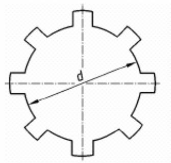

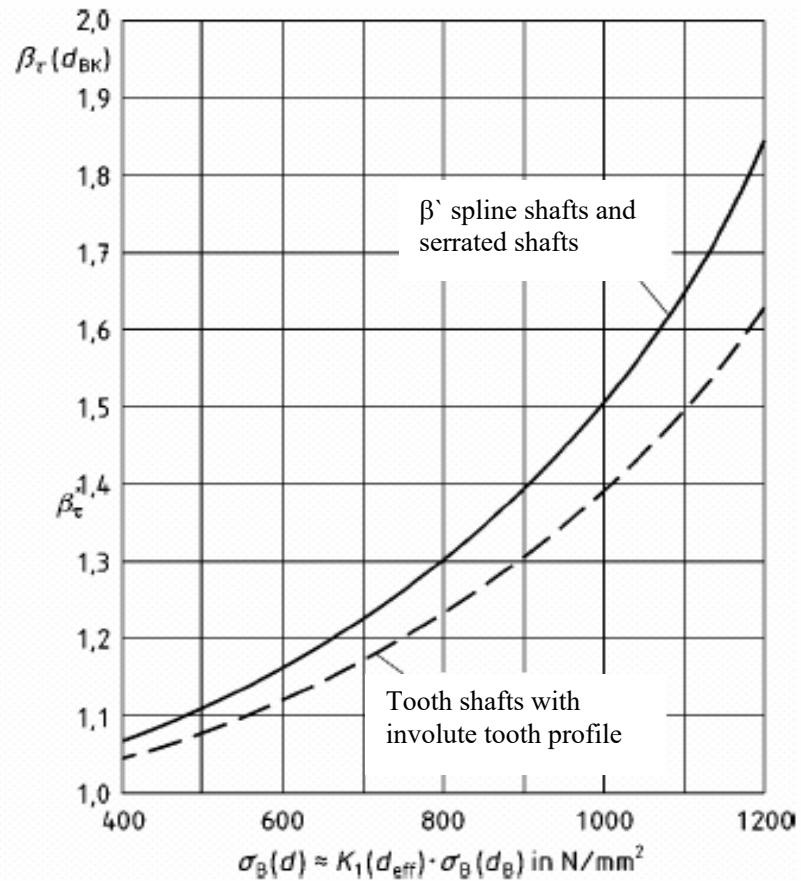

Nominal diameter $d _ { \mathsf { B K } } = d = 2 9$ mm Nominal stress for solid shafts:

Torsion: $\tau _ { \perp } = \frac { 1 6 \cdot T } { \pi \cdot d ^ { 3 } } ;$ Bending $\ \sigma _ { \Xi } = { \frac { 3 2 \cdot M _ { \natural } } { \pi \cdot d ^ { 3 } } }$

Fatigue notch factors

$$
\beta _ { \tau } ^ { \star } ( d _ { \mathrm { B K } } ) = \exp \left( 4 , 2 \cdot 1 0 ^ { - 7 } \cdot \left( \frac { \sigma _ { \mathrm { B } } ( d ) } { { \sf N } / \mathsf { m } \mathsf { m } ^ { 2 } } \right) ^ { 2 } \right)
$$

Torsion:

– Spline and serrated shafts: $\beta _ { \tau } ( d _ { \mathsf { B K } } ) = \beta ^ { \star } \tau ( d _ { \mathsf { B K } } )$

– Tooth shafts with involute tooth pr.: $\beta _ { \tau } ( d _ { \mathrm { B K } } ) = 1 + 0 . 7 5 \mathrm { ( - } \hat { \beta _ { \tau } } ( d _ { \mathrm { B K } } ) - 1 )$

Bending:

– Spline shafts

$$
\beta _ { \mathrm { { \scriptsize { G } } } } ( d _ { \mathrm { { B K } } } ) = 1 + 0 . 4 5 \cdot ( \beta \mathrm { { \scriptsize ~ \stackrel { \star } { ~ } } } _ { \tau } ( d _ { \mathrm { { B K } } } ) - 1 )
$$

– Serrated shafts

$$
\beta _ { \mathrm { { \scriptscriptstyle G } } } ( d _ { \mathrm { { B K } } } ) = 1 + 0 . 6 5 \cdot ( \beta \mathrm { \it ~ \ t } ( d _ { \mathrm { { B K } } } ) - 1 )
$$

– Tooth shafts with involute tooth pr.: $\beta _ { \mathrm { { \scriptsize { G } } } } ( d _ { \mathrm { { B K } } } ) = 1 + 0 . 4 9 \cdot ( \beta _ { \mathrm { { \scriptsize { ~ \tau } } } } ( d _ { \mathrm { { B K } } } ) - 1 )$

Tension/compression:

– For tension/compression approximately the same values apply as for bending.

Influence factor for surface roughness: $K _ { \mathsf { F } \tau } = 1 \mathrm { o r } K _ { \mathsf { F } \sigma } = 1$

Case hardened steel: $\beta _ { \tau } ( d _ { \mathsf { B K } } ) = 1 . 0 ; \beta _ { \sigma } ( d _ { \mathsf { B K } } ) = 1 . 0 ; K _ { \mathsf { V } } = 1$

NOTE: The fatigue notch factors can be substantially greater in relatively rigid hubs and unfavourable design due to the concentrated load discharge on the shaft-hub transition. The values apply to shafts without hub influence.

Pic. 1: Fatigue notch factors for spline shafts, serrated shafts and tooth shafts.  
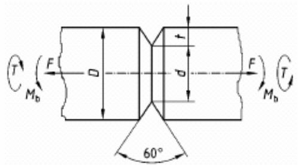

$$
d _ { \mathsf { B K } } = d = 1 5 \mathsf { m m }
$$

Tension/compression: $\beta _ { \odot } ( { d _ { \mathsf { B K } } } ) = 0 , 1 0 9 \cdot \frac { o _ { \mathsf { B } } ( d ) } { 1 0 0 \mathsf { N } / \mathsf { m m } ^ { 2 } } + 1 . 0 7 4$

Bending: $\beta _ { \odot } ( d _ { \mathsf { B K } } ) = 0 . 0 9 2 3 \cdot \frac { \sigma _ { \mathsf { B } } ( d ) } { 1 0 0 \mathsf { N } / \mathsf { m m } ^ { 2 } } + 0 . 9 8 5$

$$
\sigma _ { \mathsf { n } } = 4 \cdot F / ( \pi \cdot d ^ { 2 } )
$$

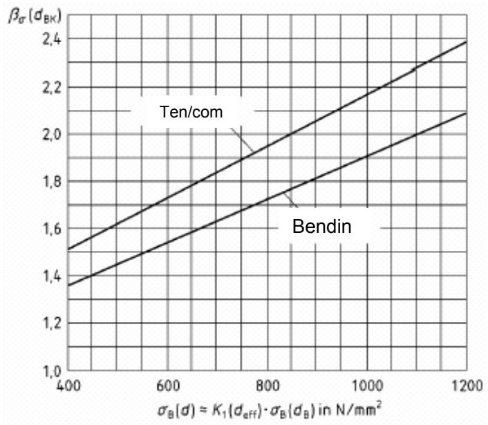

$$
\sigma _ { \mathsf { n } } = 3 2 \cdot M _ { \mathsf { b } } / ( \pi \cdot d ^ { 3 } )
$$

$$
\tau _ { \mathsf { n } } = 1 6 \cdot T / ( \pi \cdot d ^ { 3 } )
$$

$$
r = 0 . 1 \ \mathrm { m m }
$$

t/d = 0.05 to 0.20; for other values the fatigue notch factors deviate from these data

Mean roughness of the notch: $R _ { z \tt B } = 2 0$ μm

Pic. 2: Fatigue notch factors for round rods with rotating V-notches [2]  
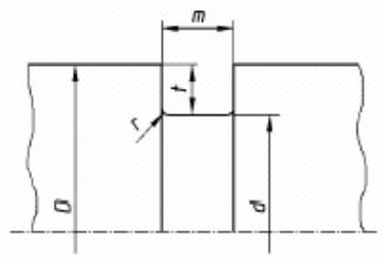

Tension/compression: $\sigma _ { \mathsf { n } } = 4 \cdot F / ( \pi \cdot { \mathsf { d } } _ { 2 } )$

Bending: $\sigma _ { \mathsf { n } } = 3 2 \cdot M _ { \mathsf { b } } / ( \pi \cdot d _ { 3 } )$

Torsion: $\tau _ { \mathfrak { n } } = 1 6 \cdot T / ( \pi \cdot d _ { 3 } )$

Tension/compression: $\ddot { \beta _ { \sigma } } = 0 . 9 \cdot \left( 1 . 2 7 + 1 . 1 7 \cdot \sqrt { \mathsf { t } / \mathsf { r } \mathsf { f } } \right)$

Bending: $\stackrel { \star } { \beta _ { \sigma } } = 0 . 9 \cdot ( 1 . 1 4 + 1 . 0 8 \cdot \sqrt { { \sf t } / { \sf r } _ { \uparrow } } )$

Torsion: $\beta _ { \scriptsize { \tau } } = ( 1 . 4 8 + 0 . 4 5 \cdot \mathsf { \sqrt { t / r _ { f } } } )$

Tension/compression, bending: $r _ { \uparrow } = r + 2 . 9 \cdot \rho$

$$
\boldsymbol { r } _ { \ u { \mathsf { f } } } = \boldsymbol { r } + \boldsymbol { \rho }
$$

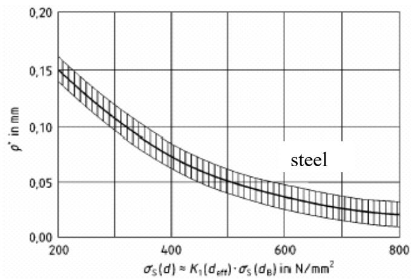  
ρ\* Strukturradius nach Neuber [9]

NOTE: If in tension/compression or bending $\beta _ { \sigma } > 4$ , use $\beta _ { \sigma } = 4$ . If in torsion $\beta _ { \tau } > 2 . 5$ , use $\beta _ { \tau } = 2 . 5$ for calculation.

Page 7   
DIN 743-2 : 2000-10

$$
\stackrel { \star } { \rho } = 1 0 ^ { - ( 0 . 5 1 4 + 0 . 0 0 1 5 2 \cdot \sigma _ { \mathrm { { s } } } ( { \sf d } ) ) } ( { \sf s t e e l s } )
$$

$$
m / t \geq 1 . 4 \colon b _ { \sigma , \tau } = b _ { \sigma \tau } { } ^ { \star }
$$

$$
m / t < 1 . 4 \colon b _ { \sigma , \tau } = b _ { \sigma \tau } { } ^ { \star } \cdot 1 . 0 8 \cdot \left( m / t \right) ^ { - 0 . 2 }
$$

# Pic.3: Fatigue notch factors for rotating square grooves for shafts acc. to DIN 471 [8]

## Fatigue notch factors for rotating square grooves

The fatigue notch factors for square grooved notch types are shown in pic. 3 for m/t ≥ 1.4 (Procedures acc. to [3], [4], [5], [6], [8]) and the equations are given for its calculations.

## 4.3 Fatigue notch factors for notches with known stress concentration factor

Shoulder, round groove, shoulder with undercut, cross hole If the line drop referred to is known, then the fatigue notch factor for the element diameter can be calculated by equations (4) to (6) (procedures by Stieler):

$$
\beta _ { \sigma , \tau } = \frac { a _ { \sigma , \tau } } { n }
$$

a) In annealed or normalized shafts or case hardened shafts with non-carburized contours and the like:

$$
n = 1 + \sqrt { G ^ { 1 } \cdot \sf m m } \cdot 1 0 ^ { - \left( 0 , 3 3 + \frac { \sigma _ { 5 } ( d ) } { 7 1 2 \mathrm { N } / \mathrm { m m } ^ { 2 } } \right) }
$$

b) In hard edge section:

(5

$$
n = 1 + \sqrt { G ^ { ! } \cdot { \sf m m } } \cdot 1 0 ^ { - 0 , 7 }\tag{}
$$

In the equations (4) to (6):

$\alpha _ { \mathbb { O } } , \alpha _ { \tau }$ Stress concentration factor according to sec. 5 or other sources;

n support factor, see also pic. 4;

G\` specific line drop from table 2 or on the basis of extensive accurate analyses from other sources. NOTE 1:

$- \mathrm { ~  ~ \nabla ~ } n \leq \alpha _ { \sigma , \tau } \left( \mathsf { i f } \mathrm { ~ \boldsymbol { n } > ~ } \alpha _ { \sigma , \tau } \right.$ τ replace by $\boldsymbol { n } = \boldsymbol { \alpha } _ { \mathtt { G } , \tau } )$

In equation (5) insert σS for the element;

approximately $\quad \sigma _ { \mathsf { S } } ( d ) = K _ { 1 } ( d _ { \mathsf { e f f } } ) \cdot \sigma _ { \mathsf { S } } ( d _ { \mathsf { B } } ) .$

The multi-axial stress status (e.g. in rotating notches) can lead to a further lowering of the notch sensitivity (rise in n in the equations

(5) and (6)), which indicates a reserve and is not considered here.

Table 2: Specific line drop $\pmb { \ 6 } ^ { \bullet }$
| Elementstructure | Load | Specific linedrop $G ^ { \bullet }$ |
| --- | --- | --- |
|  | Tension/compression | $2 \cdot ( 1 + \varphi )$ r |
| Bending | $2 \cdot ( 1 + \varphi )$ r |  |
| Torsion | $\overline { { \frac { 1 } { r } } }$ |  |
| Tension/compression | $\overline { { \frac { 2 , 3 \cdot ( 1 + \varphi ) } { r } } }$ |  |
| Bending | $\overline { { 2 , 3 \cdot ( 1 + \varphi ) } }$ r |  |
| Torsion | $\frac { 1 , 1 5 } { r }$ |  |
| NOTE 2: For round rods, the formulae are approximatelyvalid even if there is a longitudinal boring.for $\cdot d / D > 0 . 6 7 ; r > 0 ;$ $\varphi = { \frac { 1 } { 4 \cdot { \sqrt { t / r } } + 2 } }$ otherwise: $\phi = 0$ | NOTE 2: For round rods, the formulae are approximatelyvalid even if there is a longitudinal boring.for $\cdot d / D > 0 . 6 7 ; r > 0 ;$ $\varphi = { \frac { 1 } { 4 \cdot { \sqrt { t / r } } + 2 } }$ otherwise: $\phi = 0$ | NOTE 2: For round rods, the formulae are approximatelyvalid even if there is a longitudinal boring.for $\cdot d / D > 0 . 6 7 ; r > 0 ;$ $\varphi = { \frac { 1 } { 4 \cdot { \sqrt { t / r } } + 2 } }$ otherwise: $\phi = 0$ |

In case there are neither experimentally determined fatigue notch factors nor stress concentration factors available, the stress concentration factor and eventually the line drop is theoretically (e.g. with the theory of elasticity or with Finite-Elemente-Methode) or experimentally (e.g. photoelastic or with strain control) determined. The fatigue notch factor is then calculated by equation (4).

Notch cases not yet covered

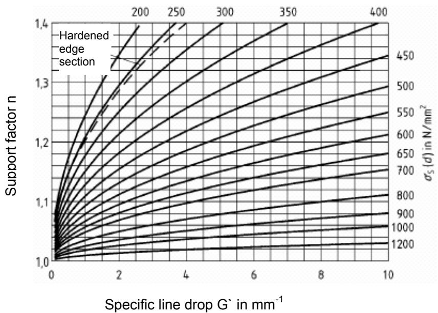

S(d) ≈K1(deff) · S(dB); K1(deff) acc. to pic. 13   
NOTE 3: Hard layers arising from case hardening, nitration, flame or induction hardening come under hardened edge sections. Pic. 4: Support factor n

## 5 Stress concentration factors

5.1 Definition of stress concentration factor The stress concentration factor of the element (or the sample) are defined by equations (7) and (8):

$$
a _ { \sigma } = \frac { \sigma _ { \mathrm { m a x K } } } { \sigma _ { \mathrm { n } } }
$$

$$
a _ { \tau } = \frac { \tau _ { \mathrm { t m a x K } } } { \tau _ { \mathrm { n } } }
$$

In the equations (7) and (8):

maxK, tmaxK Effective local stress (maximum principal stress on the surface) in notched cross section for computation due to the notch effect in linear elastic material properties;

n, n Nominal stress (principal stress); as a rule the stress in the smallest notch cross section without the consideration of notch effect in linear elastic material properties is calculated by the elementary strength theory (acc. to DIN 743-1, Table 1).

## 5.2 Stress concentration factors for different notch configurations

Shoulder and round groove: The stress concentration factors for round rods with rotating notches and shouldered round rods in tension/compression, bending or torsion can be read out of pictures 5 to 12 or calculated by equation (9):

$$
\alpha _ { \sigma , \tau } = \ 1 + \frac { 1 } { \sqrt { A \cdot \frac { r } { t } + 2 \cdot B \cdot \frac { r } { d } \cdot \left( 1 + 2 \frac { r } { d } \right) ^ { 2 } + C \cdot \left( \frac { r } { t } \right) ^ { 2 } \cdot \frac { d } { D } } }
$$

$$
r / t \geq 0 , 0 3 ; d / D \leq 0 , 9 8 ; \alpha _ { \sigma , \tau } \leq 6
$$

The stress concentration factor constants A, B, C and z are to be taken from the table 3 or pictures 5 to 12, from which even the implications of the quantities r, t, d and D are clear.

The constants C and z are known only for shouldered round rods in bending or torsion; in the other cases, therefore, the stress concentration factors calculated by equation (9) for r/t > 1 is too big.

## Shoulders with undercut:

For this notch configuration, the stress concentration factor can be can be calculated through the interpolation between shoulder and round groove by equations (10) and (11)-- [7]:

$$
\alpha _ { \tt O F } = ( \alpha _ { \tt O R } - \alpha _ { \tt O A } ) \cdot \sqrt { \frac { D _ { 1 } - d } { D - d } } + \alpha _ { \tt O A }\tag{10}
$$

$$
\alpha _ { \tttau E } = 1 , 0 4 \cdot \alpha _ { \tttau A }\tag{11}
$$

In the equations (10) and (11):

$\alpha _ { \sigma , \tau } \mathsf { F }$ Stress concentration factor for shafts with shoulder and undercut in bending and torsion respectively;

σ,τ A Stress concentration factor for shaft with shoulder in bending and torsion respectively;

σR Stress concentration factor for shaft with round groove in bending and tension/compression respectively. For terms see pic. 11.

## Cross hole

The stress concentration factors for round rods with cross hole in different types of stresses are to be read out of pic. 13.

Table 3: Stress concentration factor constants A, B, C and Exponent z
| Notch configurat · Stress | Rotating round groove · Tension/compression | Rotating round groove · Bending | Rotating round groove · Torsion | Shoulder · Tension/compression | Shoulder · Bending | Shoulder · Torsion |
| --- | --- | --- | --- | --- | --- | --- |
| A | 0.22 | 0.2 | 0.7 | 0.62 | 0.62 | 3.4 |
| B | 1.37 | 2.75 | 10.3 | 5.8 | 5.8 | 19 |
| C | 11 | 1 | 1 | - | 0.2 | 1 |
| Z | - | 一 | - | - | 3 | 2 |

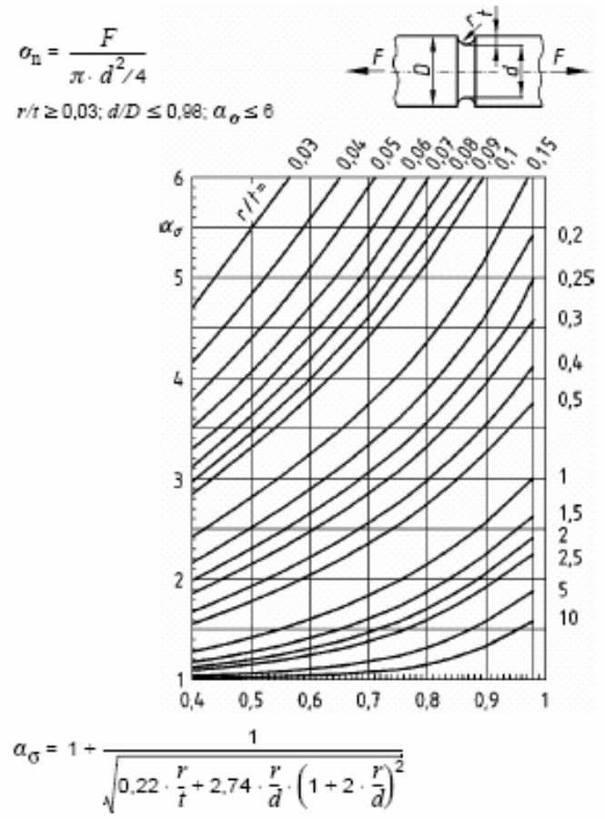

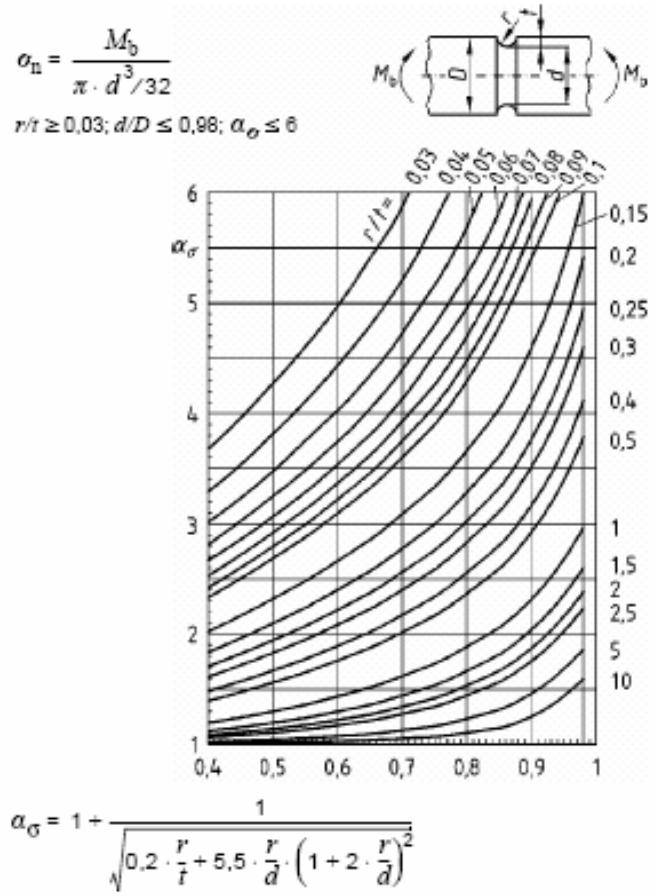  
Pic. 5: Stress concentration factors for notched round rods in tension Pic.6: Stress concentration factors for notched round rods in bending

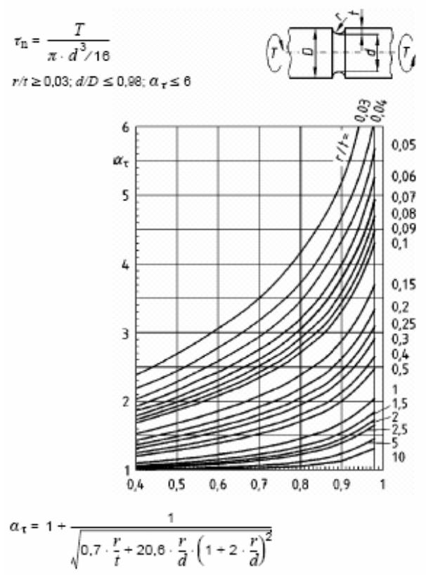

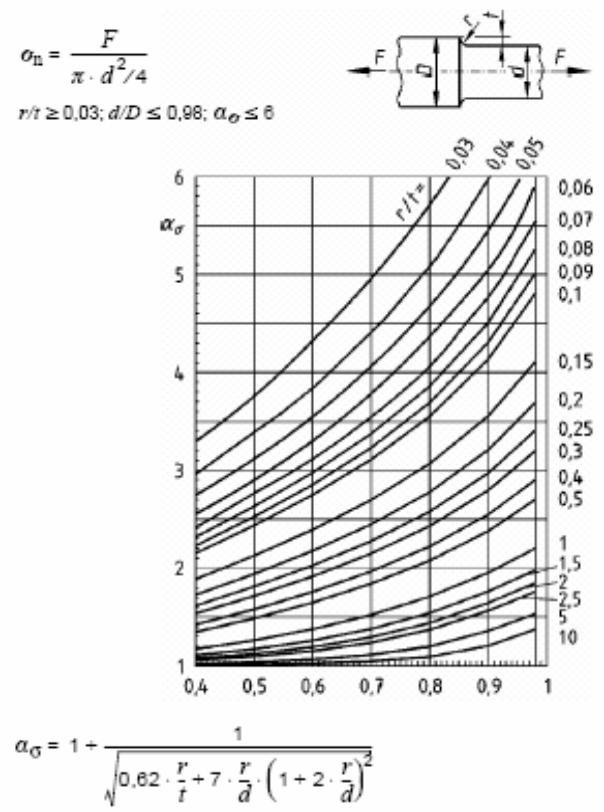  
Pic.7: Stress concentration factors for notched round rods in Torsion Pic.8: Stress concentration factors for notched

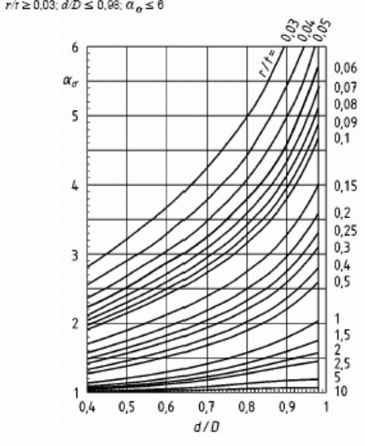

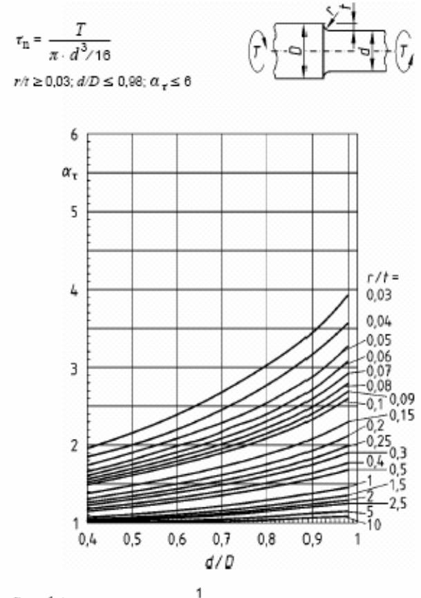

Pic. 9: Stress concentration factors for notched round rods in bending Pic.10: Stress concentration factors for notched round rods in tension  
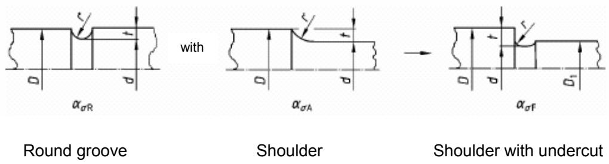  
The fatigue notch factor b is to be determined with $G ^ { \bullet }$ for shoulder (by table 2).  
Pic. 11: Determination of a for shoulder with undercut (Interference of $\alpha _ { \mathrm { { O R } } }$ and $\alpha _ { \tt O A }$ by the equations (10) and (11))

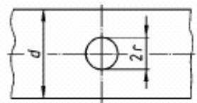

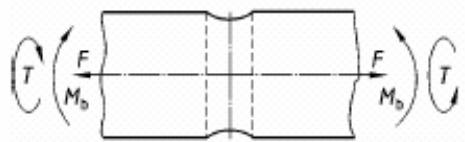

Tension/compression: $\alpha _ { \sigma } = 3 - ( 2 \cdot r / d )$

Bending: $\alpha _ { \odot } = 1 . 4 \cdot ( 2 \cdot r / d ) + 3 - 2 . 8 \cdot \sqrt { 2 } \cdot \mathsf { r } / \mathsf { d }$

Torsion: $\alpha _ { \tau } = 2 . 0 2 3 - 1 . 1 2 5 \cdot \sqrt { 2 }$ ٠ r/d

Tension/compression: $\sigma _ { \boldsymbol { \mathsf { v } } } = { \mathsf { F } } / ( \pi \cdot d ^ { 2 } / 4 - 2 \cdot r \cdot d ) \qquad { \mathsf { G } } ^ { \cdot } = 2 . 3 / r$

Bending: $\sigma _ { \mathrm { v } } = M { \sf b } / ( \pi \cdot d ^ { 3 } / 3 2 - r \cdot d ^ { 2 } / 3 ) \mathrm { G } ^ { \cdot } = 2 . 3 / r + 2 / d$

Torsion: $\tau _ { \mathrm { v } } = T / ( \pi \cdot d ^ { 3 } / 1 6 - r \cdot d ^ { 2 } / 3 ) \quad \quad \mathsf { G } ^ { = } 1 . 1 5 / r + 2 / d$

Pic. 12: Stress concentration factors for round rods with cross hole in tension/compression, bending or torsion (Tension [2], bending and torsion [1])  
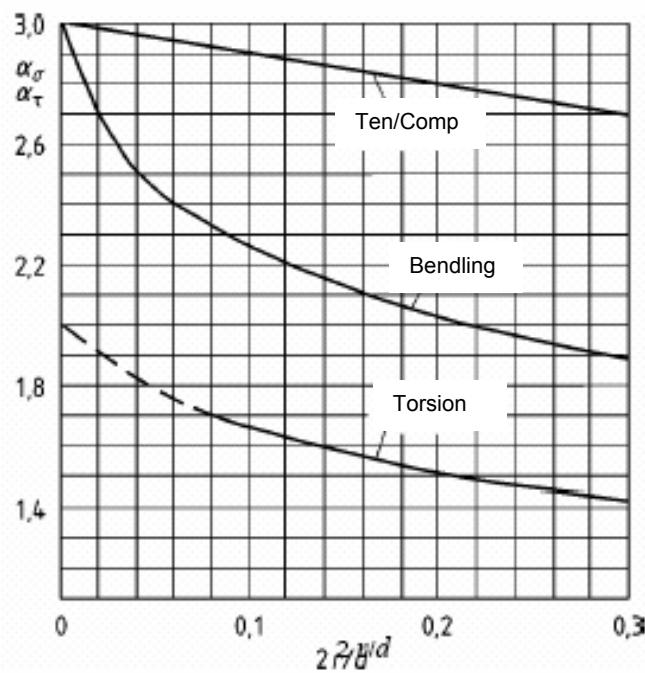

## 6 Influence factors for size

The influence of size is to be identified with the factors $K _ { 1 } ( d _ { \mathsf { e f f } } )$ $K _ { 2 } ( d )$ and $K _ { 3 } ( d )$ in the range $d > 7 . 5$ mm depending on the element diameter.

## Technological influence factor for size $K _ { 1 } ( d _ { \mathsf { e f f } } )$

The technological influence factor for size $K _ { 1 } ( d _ { \mathsf { e f f } } )$ takes into account approximately that the attainable hardness (and even the elastic limit and fatigue resistance along with it) in annealing and core hardness in case hardening lessens with increasing diameter. The technological influence factor for size $K _ { 1 } ( d _ { \mathsf { e f f } } )$ is the same for all types of stresses and is calculated with the effective diameter for heat treatment $d _ { \mathsf { e f f } } .$ deff depends upon the size and structure of the element. It takes into account the effect of size and structure of the element on the cooling process during hardening/annealing. If there are no specific test results, use $d _ { \mathsf { e f f } }$ $= D ( D$ biggest diameter of the shaft and shaft shoulder).

$K _ { 1 } ( d _ { \mathsf { e f f } } )$ is to be used if the actual strength of the element is not known, but for a nominal diameter (e.g. dB = 16 mm) conform to the standard. Effort has to be made to go to the position in view from the actual strength of the element. In such a case, use $K _ { 1 } ( d _ { \mathsf { e f f } } ) = 1$ . If these adjustments are not carried out, a sample diameter $d _ { \mathsf { B } }$ (nominal diameter) is taken from the strength values and converted to the strength of the element with the help of the size factor $K _ { 1 } ( d _ { \mathsf { e f f } } )$ . For this case $K _ { 1 } ( d _ { \mathsf { e f f } } )$ is determined by equations (12) to (15). The given values are usable for $d _ { \mathsf { e f f } } \leq$ 500 mm. For bigger diameters the possibility of extrapolation of the given values have to be fixed with the steel manufacturer.

For nitrated steel and the tensile strength of ordinary and high strength structural steel as even other structural steel which is not annealed, use equation (12).

$$
\begin{array} { r l r } { \bullet } & { { } \quad } & { \mathsf { d e f f } \le 1 0 0 \mathsf { m m : K 1 } ( \mathsf { d e f f } ) = 1 } \\ { \bullet } & { { } \quad } & { 1 0 0 \mathsf { m m < } d _ { \mathsf { e f f } } < 3 0 0 \mathsf { m m : } } \end{array}
$$

$$
\begin{array} { l } { { \displaystyle K _ { 1 } ( d _ { \mathrm { e f f } } ) = 1 - 0 , 2 3 \cdot 1 9 \left( \frac { d _ { \mathrm { e f f } } } { 1 0 0 \mathrm { ~ m m } } \right) } } \\ { { \displaystyle \qquad \cdot \qquad 3 0 0 \mathrm { m m } \leq \mathsf { d e f f } \leq 5 0 0 \mathrm { m m } \mathrm { : } \mathsf { K } 1 ( \mathsf { d e f f } ) = 0 . 8 9 } } \end{array}\tag{12}
$$

The elastic limit for ordinary and high strength structural steel as even for other structural steel which is not in an annealed state has to be lessened with K1(deff) by equation (13) (see also pic. 13).

$$
\bullet d _ { \mathsf { e f f } } \leq 3 2 \mathsf { m m } : \qquad K _ { 1 } ( d _ { \mathsf { e f f } } ) = 1
$$

$$
\bullet 3 2 \mathsf { m m } < d _ { \mathsf { e f f } } < 3 0 0 \mathsf { m m } ; d _ { \mathsf { B } } = 1 6 \mathsf { m m } ;
$$

$$
K _ { 1 } ( d _ { \mathsf { e f f } } ) = 1 - 0 . 2 \mathsf { \vec { s } } \cdot \mathsf { l } _ { \mathsf { \vec { s } } } \left( \frac { d _ { \mathsf { s f f } } } { 2 \cdot d _ { \mathsf { \vec { s } } } } \right)\tag{13}
$$

$$
\begin{array} { l } { \bullet \ 3 0 0 \ \mathsf { m m } _ { \leq } \ \mathsf { d e f f } \leq \ 5 0 0 \ \mathsf { m m } ; \mathsf { K } _ { 1 } ( \mathsf { d e f f } ) = } \\ { 0 . 7 5 } \end{array}
$$

For heat-treatable steel and other structural steel in annealed state as even for Cr-Ni-Mo-case hardening steel in blank or case hardened state use equation (14) (with dB = 16 mm) (see also pic. 13):

$$
\begin{array} { r l } & { \bullet \ d _ { \mathsf { e f f } \leq } \ 1 6 \ m m \cdot \qquad \quad K _ { 1 } ( d _ { \mathsf { e f f } } ) = 1 } \\ & { \bullet \ 1 6 \ m m \cdot d _ { \mathsf { e f f } } < 3 0 0 \ m m ; d _ { B } = 1 6 \ m m ; } \end{array}
$$

$$
\begin{array} { r l r } {  { K _ { 1 } ( d _ { \mathrm { e f f } } ) = 1 - 0 , 2 6 \cdot 1 9 ( \frac { d _ { \mathrm { e f f } } } { d _ { \mathrm { B } } } ) } } \\ & { \bullet 3 0 0 m m _ { \mathrm { < } } d _ { \mathsf { e f f } \le } 5 0 0 m m ; K _ { 1 } ( d _ { \mathsf { e f f } } ) = } & \\ & { 0 . 6 7 } \end{array}\tag{14}
$$

For case hardening steel in blank hardened state (except Cr-Ni-Mo-case hardening steel) use equation(15).

$$
\begin{array} { r l r } { \bullet } & { { } d _ { \mathsf { e f f } } \leq \ \mathcal { I } \ { m m } . } & { K _ { \mathcal { I } } ( d _ { \mathsf { e f f } } ) = \ { \mathcal { I } } } \\ { \bullet \ \mathcal { I } \ { m m } < d _ { \mathsf { e f f } } < 3 O O \ m m ; d _ { B } = \ \mathcal { I } \ { m m } . } \\ { \ } & { { } K _ { 1 } ( d _ { \mathsf { e f f } } ) = 1 - 0 . 4 1 \cdot \mathsf { l g } \ \bigg ( \frac { d _ { \mathsf { e f f } } } { d _ { \mathsf { B } } } \bigg ) } & { ( 1 5 ) } \\ { \bullet \ \mathcal { S } O O \ m m \leq d _ { \mathsf { e f f } } \leq 5 O O \ m m : K _ { \mathcal { I } } ( d _ { \mathsf { e f f } } ) = } & { } \\ { \ } & { { } O . 4 \mathcal { I } \ } & { \ } \end{array}
$$

## Geometrical influence factor for size $K _ { 2 } ( d )$

The geometrical influence factor for size $K _ { 2 } ( d )$ takes into account, that in growing diameter or thickness the alternate bending strength transfers to the alternate tensile/ compressive strength and analogous to it the alternate torsional strength sinks.

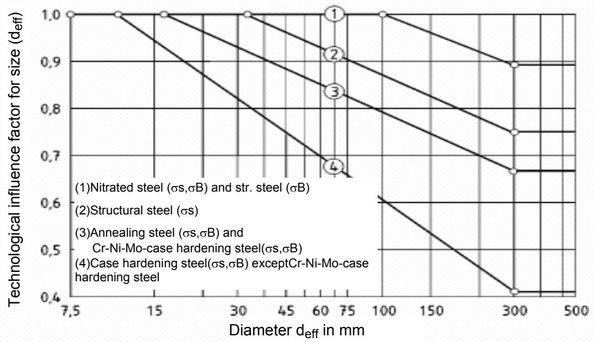

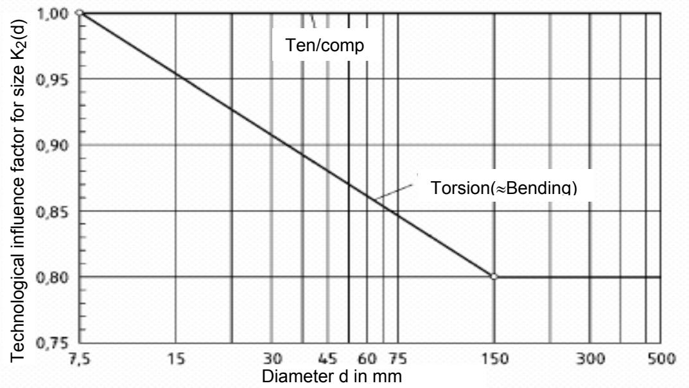

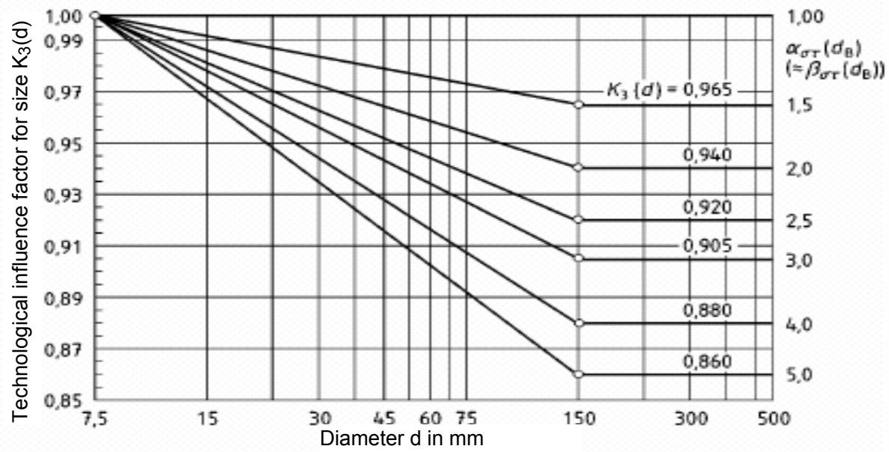  
Pic 13: Large factors of influence ${ \sf K } _ { 1 } ( { \sf d } _ { \sf e f f } )$ ${ \sf K } _ { 2 } ( { \sf d } )$ and ${ \sf K } _ { 3 } ( { \sf d } )$

For tension/compression use equation (16) (see also pic. 13):

$$
K _ { 2 } ( d ) = 1\tag{16}
$$

For bending and torsion use equation (17):

$$
\cdot 7 . 5 \ : \mathrm { m m } \leq d < 1 5 0 \ : \mathrm { m m } \mathrm { : }
$$

$$
K _ { 2 } ( d ) = 1 - 0 , 2 \cdot \frac { \mathsf { l g } ( d / 7 , 5 \mathsf { m m } ) } { \mathsf { l g } 2 0 }\tag{17}
$$

· d ≥ 150 mm: $K _ { 2 } ( d ) = 0 . 8$

NOTE: In annular cross section take the outer diameter for $d ,$ For $d \geq 1 5 0$ mm use

$$
{ \cal K } _ { 2 } = \sigma _ { \sf Z d W } / \sigma _ { \sf D W } .
$$

Geometrical influence factor for size $\ K _ { 3 } ( d )$

The geometrical influence factor for size $\ K _ { 3 } ( d )$ takes into account the change in the notch effect, if the dimensions of the element deviate from those of the sample (variation of the stress gradient).

The geometrical influence factor for size $\ K _ { 3 } ( d )$ must then be only considered if the fatigue notch factors $\beta _ { \tt S } ( d _ { \tt B } )$ or $\beta _ { \tt t } ( d _ { \tt B } )$ are determined experimentally and the nominal diameter dB deviates from the diameter of the element d.

$\ K _ { 3 } ( d )$ is the same for all types of steel and based on the stress concentration factor calculated by equation (18) (see also pic.13):

7.5 mm ≤ d ≤ 150 mm:

$$
K _ { 3 } ( d ) = 1 - 0 , 2 \cdot 1 9 \alpha _ { \sigma } \cdot \frac { \mathsf { \mathsf { 1 9 } } \left( \frac { d } { 7 , 5 \mathsf { m m } } \right) } { \mathsf { 1 9 } 2 0 }\tag{18}
$$

$$
\cdot \quad d \geq 1 5 0 \mathrm { m m } ; \quad K _ { 3 } ( d ) = 1 - 0 . 2 \cdot | | _ { \mathrm { ~ \mathfrak { g } } } \alpha _ { \mathsf { S } }
$$

$( \alpha _ { \sigma }$ stress concentration factor (in torsion use $\scriptstyle ( x _ { \tau } ) )$

The stress concentration factor $\alpha _ { \sigma } ( \circ  \alpha _ { \tau } )$ in equation (18) can be approximately replaced by the experimentally determined fatigue notch factor $\beta _ { O } ( d _ { B } )$ (or $\beta _ { l } ( d _ { B } ) )$ .

## 7 Influence factor for surface roughness

$$
K _ { \mathsf { F } \sigma , \tau }
$$

The influence factor for surface roughness $\mathsf { K } _ { \mathsf { F } \sigma }$ considers the additional influence of roughness on the local stresses and hence the fatigue strength of the element. $\mathsf { K } _ { \mathsf { F } \sigma }$ is calculated by equation (19) for tension/compression or bending (also see pic. 14):

$$
K _ { \mathtt { F O } } = \mathrm { \ } 1 - 0 , 2 2 \cdot \mathsf { l } \mathsf { g } \left( \frac { R _ { Z } } { \mu \mathsf { m } } \right) \cdot \left( \mathsf { l } \mathsf { g } \left( \frac { \sigma _ { \mathtt { B } } ( d ) } { 2 0 \mathrm { \ } \mathsf { N } / \mathsf { m m } ^ { 2 } } \right) - 1 \right)\tag{19}
$$

In equation (19):

$$
\sigma_{B} \le 2\,000\ \mathrm{N/mm^2}
$$

> *(추출이 깨진 줄 — 원문 p.14 대조로 복구)*

Rz average depth of roughness in μm.

NOTE: ${ \sigma } _ { \mathsf { B } } ( d _ { \mathsf { e f f } } )$ is to be used for element; approximately

$$
\sigma _ { \mathsf { B } } ( d _ { \mathsf { e f f } } ) = K _ { 1 } ( d _ { \mathsf { e f f } } ) \cdot \sigma _ { \mathsf { B } } ( d _ { \mathsf { B } } ) .
$$

For torsion use equation (20):

$$
K _ { \mathtt { F } \tau } = 0 , 5 7 5 \ : K _ { \mathtt { F } 0 } + 0 , 4 2 5\tag{20}
$$

In rolling skin average roughness is $R _ { z } = 2 0 0 ~ \mu \mathrm { m }$

In case the calculations are being carried out with an experimentally determined fatigue notch factor, which is applicable to a sample with the surface roughness $R z { \tt B }$ , but the element has a surface roughness $R z ,$ , replace equation (19) or (20) by equation (21) or (22):

$$
K _ { \mathrm { F C } } = \frac { K _ { \mathrm { F C } } ( R _ { z } ) } { K _ { \mathrm { F C } } ( R _ { z \mathrm { B } } ) }\tag{21);}
$$

$$
K _ { \mathrm { F } \tau } = \frac { K _ { \mathrm { F } \tau } ( R _ { z } ) } { K _ { \mathrm { F } \tau } ( R _ { z \mathrm { B } } ) }
$$

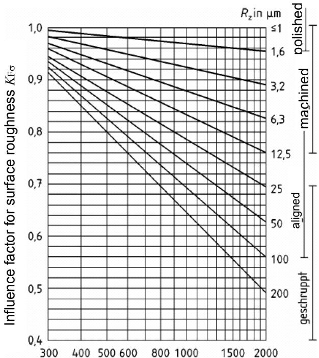  
Tensile strength $\sigma _ { 8 } ( d ) = K _ { 1 } \langle d _ { \mathsf { e f f } } \rangle \cdot \sigma _ { 8 } \langle d _ { \mathsf { B } } \rangle$ in ${ \mathsf { N } } / { \mathsf { m m } } ^ { 2 }$  
Pic.14: Influence factor for surface roughness

While using experimentally determined fatigue notch factor, for which the surface influence factors $\mathsf { K F } _ { \mathbb { O } }$ , KFτ are given without additional values for surface roughness (e.g. in table 1 for shaft-hub junctions, in pic.1 for spline shafts etc.), calculations are done by equations (19) and (20). The verification of load capacity is then carried out with the given values for KFσ and KFτ even for the element diameter deviating from the sample diameter.

## 8 Influence factor for surface bonding

The influence factor for surface bonding KV takes into account the influence (internal stress, hardness) of the changing condition of the surface through the corresponding technological processes on fatigue strength.

Attainable values of the influence factor for surface bonding KV are to be read out of table 4 (also see pictures 15 to 17). For unnotched shafts in tension/compression $K \vee = 1$ . If the calculations are done with experimentally determined fatigue notch factors, valid for the state of bonding, the KV-value includes only the rise in strength of the base material (analogous to smooth shafts). If the fatigue notch factor bσ,τ is determined from the stress concentration factor a and the support factor n by DIN 743, n includes already the effect of bonding on the notch effect. KV considers then, in any case, the rise in strength of the base material. KV grows with growing stress concentration factor aσ or aτ. Special values are being viewed under technological conditions for being determined experimentally or empirically.

NOTE: It is advisable to use lower (smaller) values of KV for verification of load capacity. The upper values are given for orientation and must be experimentally verified. The values for “notched” are valid only for $b \sigma , \tau > K \nu$ otherwise $\kappa \vee$ is to be taken out in “unnotched”. If there are no other observations, and diameters $d > 4 0$ mm for unnotched or weakly notched, use $K \vee = 1$ , otherwise in the range 40 mm $< d < 2 5 0$ mm $K \vee = 1 .$ 1 can be used. If $d ^ { \mathfrak { n } }$ is 250 mm, use $K \vee = 1$

Table 4: Influence factor for surface bonding $\kappa ,$ based on technological processes, correct values
| Processes · Chemical-thermal processes | Fatigue notch factor · Chemical-thermal processes | Fatigue notch factor · Chemical-thermal processes | d in mm · Chemical-thermal processes | $\overline { { { K _ { \vee } } ^ { 2 ) } } }$ · Chemical-thermal processes |
| --- | --- | --- | --- | --- |
| NitrationNitride hardeningdepth0.1 mm to 0.4 mmSurface hardness700 HV10 to 1 000HV10 | $\beta \mathrm { { \sigma , } } \tau = \alpha / n$ , obtained by DIN 743-23) $\beta \sigma , \tau ,$ obtained from test results with nitrated steel³)Unnotched samples | (1) | 8...25 | 1.15..1.25 |
| 25...40 | 1.10...1.15 |  |  |  |
| $\beta \sigma , \tau ,$ obtained from test values by DIN 743-2(not nitrated) | (2) | 8.. .25 | 1.5. . .2.5 |  |
| 25...40 | 1.2 .. .2.0 |  |  |  |
| Case hardeningDepth of casehardening0.2 mm to 0.8 mmSurface hardness670 to 750 HV | βσ,τ, = a/n obtained by DIN 743-2³) $\beta \sigma , \tau ,$ obtained from test results with case hardened steel3)Unnotched samples | (1) | 8. . .25 | 1.2 . . .2.1 |
| 25...40 | 1.1 . ..1.5 |  |  |  |
| $\beta \sigma , \tau ,$ obtained from test values by DIN 743-2(not case hardened) | (2) | 8.. .25 | 1.5. . .2.5 |  |
| 25...40 | 1.2. . .2.0 |  |  |  |
| Carbo nitritingHardness depth0.2 mm to 0.4 mmSurface hardnessatleast 670 HV10 | $\beta \mathrm { { \sigma } } , \tau \mathrm { { \alpha } } d \Pi$ , obtained by DIN 743-2³) $\beta \sigma , \tau ,$ obtained from test results with carbo-nitrited steel3)Unnotched samples | (1) | 8.. .25 | 1.1. . .1.9 |
| 25...40 | 1... 1.4 |  |  |  |
| $\beta \sigma , \tau ,$ obtained from test values by DIN 743-2(not carbo-nitrited) | (2) | 8.. .25 | 1.4.. . 2.25 |  |
| 25...40 | 1.1. . .1.8 |  |  |  |
| Mechanical processes | Mechanical processes | Mechanical processes | Mechanical processes | Mechanical processes |
| Rolling | $\beta \sigma , \tau ,$ obtained from test results for samples with mechanicallytreated surfaces3)Unnotched samples | (1) | 7...25 | 1.2 . . .1.4 |
| 25...40 | 1.1... 1.25 |  |  |  |
| $\beta \mathrm { { \sigma , } } \tau = \alpha { } I n ,$ obtained by DIN 743-2 $\beta \sigma , \tau ,$ obtained from test values by DIN 743-2(without mechanical treatment of surfaces) | (2) | 7.. .25 | 1.5. . .2.2 |  |
| 25...40 | 1.3 . ..1.8 |  |  |  |
| Shot-peening | $\beta \sigma , \tau ,$ obtained from test results for samples with mechanicallytreated surfaces3)Unnotched samples | (1) | 7. ..25 | 1.1 . ..1.3 |
| 25...40 | 1.1. ..1.2 |  |  |  |
| $\beta \mathrm { { \sigma , } } \tau = \alpha { } I n ,$ obtained by DIN 743-2 $\beta \sigma , \tau$ obtained from test values by DIN 743-2(without mechanical treatment of surfaces) | (2) | 7.. .25 | 1.4 . . .2.5 |  |
| 25...40 | 1.1 . ..1.5 |  |  |  |
| Thermal processes | Thermal processes | Thermal processes | Thermal processes | Thermal processes |
| Inductive hardeningFlame hardeningHardness depth0.9 to 1.5 mmSurface hardness51 to 64 HRC | $\beta \mathrm { { \sigma , } } \tau = \alpha { } I n ,$ obtained by DIN 743-23) $\beta \sigma , \tau ,$ obtained from test results with inductive (flame) hardenedsteel³)Unnotched samples | (1) | 7.. .25 | 1.2. . .1.6 |
| 25...40 | 1.1 . . .1.4 |  |  |  |
| $\beta \sigma , \tau ,$ obtained from test values by DIN 743-2(without thermal treatment of surfaces) | (2) | 7...25 | 1.4 . . .2.0 |  |
| 25...40 | 1.2 ...1.8 |  |  |  |
| (1) Kv is valid for the rise in fatigue strength of smooth surface hardened sample as opposed to the smooth non-surface-hardenedsample .(2) Kv is valid for the rise in fatigue strength of the notched surface hardened samples as opposed to the notched non-surfacehardened samples.2) For unnotched shafts, in tension/compression $K \vee = 1$ 3) Kv takes into account the increase in strength of the smooth element. Diminution of notch effect is already included in n and $b \sigma , \tau .$ | (1) Kv is valid for the rise in fatigue strength of smooth surface hardened sample as opposed to the smooth non-surface-hardenedsample .(2) Kv is valid for the rise in fatigue strength of the notched surface hardened samples as opposed to the notched non-surfacehardened samples.2) For unnotched shafts, in tension/compression $K \vee = 1$ 3) Kv takes into account the increase in strength of the smooth element. Diminution of notch effect is already included in n and $b \sigma , \tau .$ | (1) Kv is valid for the rise in fatigue strength of smooth surface hardened sample as opposed to the smooth non-surface-hardenedsample .(2) Kv is valid for the rise in fatigue strength of the notched surface hardened samples as opposed to the notched non-surfacehardened samples.2) For unnotched shafts, in tension/compression $K \vee = 1$ 3) Kv takes into account the increase in strength of the smooth element. Diminution of notch effect is already included in n and $b \sigma , \tau .$ | (1) Kv is valid for the rise in fatigue strength of smooth surface hardened sample as opposed to the smooth non-surface-hardenedsample .(2) Kv is valid for the rise in fatigue strength of the notched surface hardened samples as opposed to the notched non-surfacehardened samples.2) For unnotched shafts, in tension/compression $K \vee = 1$ 3) Kv takes into account the increase in strength of the smooth element. Diminution of notch effect is already included in n and $b \sigma , \tau .$ | (1) Kv is valid for the rise in fatigue strength of smooth surface hardened sample as opposed to the smooth non-surface-hardenedsample .(2) Kv is valid for the rise in fatigue strength of the notched surface hardened samples as opposed to the notched non-surfacehardened samples.2) For unnotched shafts, in tension/compression $K \vee = 1$ 3) Kv takes into account the increase in strength of the smooth element. Diminution of notch effect is already included in n and $b \sigma , \tau .$ |

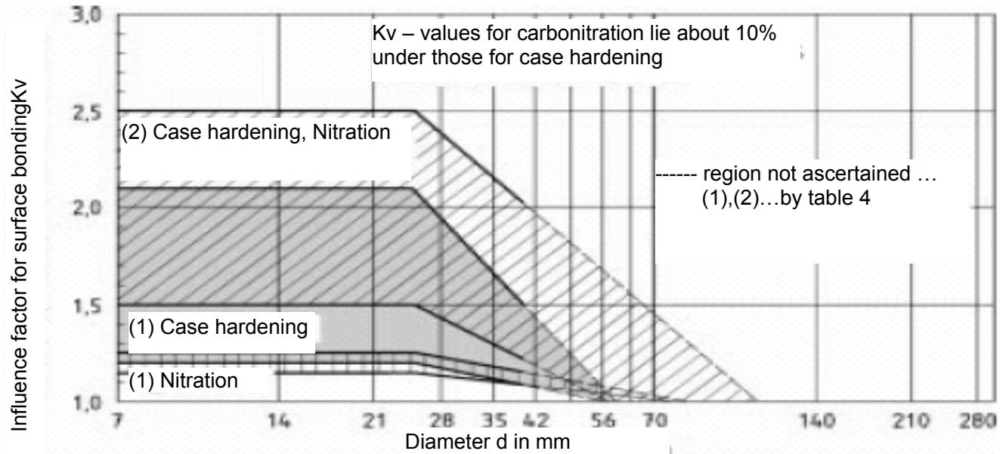  
Diameter d in mm Pic.15 :Influence factor for surface bonding for chemical-thermal processes

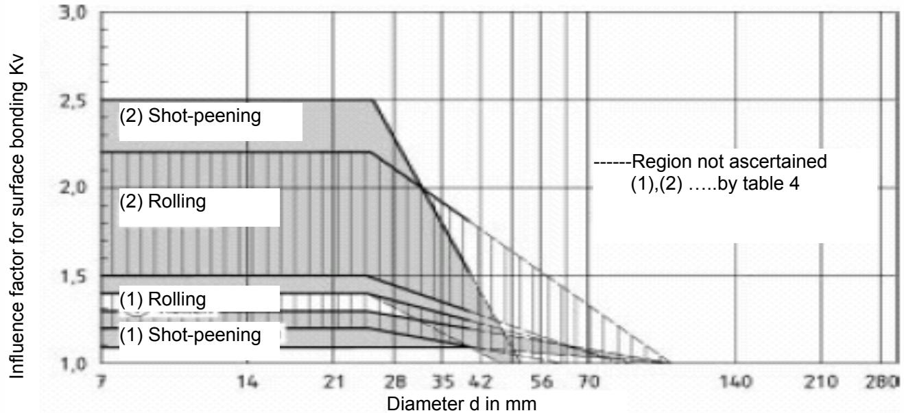  
Pic.16 :Influence factor for surface bonding for mechanical processes

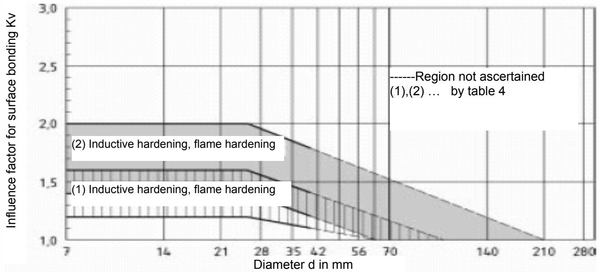  
Pic.17 : Influence factor for surface bonding for thermal processes
