# Micropitting Modelling in Rolling–Sliding Contacts: Application to Rolling Bearings

G. E. Morales-Espejel & V. Brizmer

# Micropitting Modelling in Rolling–Sliding Contacts: Application to Rolling Bearings

G. E. MORALES-ESPEJEL1,2 and V. BRIZMER1

1SKF Engineering & Research Centre

3430 DT Nieuwegein

The Netherlands

2Universite de Lyon, INSA-Lyon, CNRS ´

LaMCoS UMR5259

F69621, Lyon, France

In this article an engineering approach is described to model micropitting in rolling–sliding, heavily loaded lubricated contacts. The competitive mechanism between surface fatigue and mild wear is captured in the present approach as well as the effects of deterministic surface microgeometry (e.g., roughness). The fatigue model is based on the Dang Van fatigue criterion and the mild wear model uses a modified Archard approach The complete modeling scheme is validated experimentallyfirst using laboratory-controlled conditions, where the surface topography is varied as well as the operating conditions in the contact. Then the model is applied to describe the behavior of full-bearing tests. The behavior of the model agrees well with the experimental observations, qualitatively.

## KEY WORDS

Micropitting; Surface Distress; Surface-Initiated Fatigue; Mild Wear

## INTRODUCTION

Micropitting is a term that was initially introduced by the gear industry to describe tiny surface spalls and cracks, which sometimes appear on the surface of rolling–sliding contacts. ISO 15243 (1), refers to this damage or failure mode as surface distress or surface initiated fatigue, which is the failure of the rolling contact metal surface asperities under a reduced lubrication regime and a certain percentage of sliding motion causing the formation of (1) burnished areas (glazed; grey stained), (2) asperity microcracks, and (3) asperity microspalls. All of this will be described herein using the term micropitting.

In many industrial applications with lubricated rolling–sliding contacts (e.g., rolling bearings, gears, cam-followers) the power density has increased substantially due to the need for greater efficiency, lower weight, and cost reduction by downsizing. With the increased severity of the working conditions (e.g., heavier loads in combination with higher temperatures, thinner oil films, and/or boundary lubrication conditions), machine components can suffer from surface-initiated fatigue or micropitting. When it comes to rolling bearings, micropitting is not necessarily a primary failure mode but it can facilitate or accelerate the appearance of other failure modes like debris indentations, surfaceinitiated spalling, and seizure.

The study of micropitting in lubricated contacts can be traced back to Way (2). In his experiments he observed that polishing of the contacting discs substantially increased their resistance to micropitting. Dawson (3)–(5) first called this phenomenon pitting fatigue, recognizing the importance of lubrication and roughness in micropitting: “It has been noted for some time now that this pitting is affected by the roughness of the surfaces. If this is due to the influence of metallic asperity contact through the oil film, then pitting should also be dependent upon the thickness of the oil film between the surfaces.” In his experiments, Dawson related the number of revolutions before pitting occurs to a parameter D equal to the reciprocal of what we now know in lubrication science as the -value. Thus, he defined,

$$
D = \frac { T o t a l i n i t i a l s u r f a c e r o u g h n e s s o f t h e t w o d i s c s } { O i l f t l m t h i c k n e s s }
$$

and found that the number of revolutions to pitting decreases when D increases.

It is now recognized that micropitting is indeed a surface fatigue phenomenon associated with poor lubrication conditions ((1); Olver (6)) and thus high local friction and pressures at the asperity level. This phenomenon has been the subject of many recent experimental and numerical studies (Oila and Bull (7); Brandao, et al. ˜ (8), (9); Laine and Olver ´ (10); Laine, et al. ´ (11), (12)).

From these publications, special attention was given to the numerical work from Brandao, et al. ˜ (8), (9). They numerically solved the mixed-lubrication problem in elastohydrodynamics and coupled it with the Dang Van fatigue criterion (Dang Van, et al. (13); Dang Van (14)) to predict micropitting mass loss in gear contacts. Other recent important work was that of Laine´ and Olver (10) and Laine, et al.´ (11), in which micropitting was described as competing with mild wear by modifying the runningin of the surface and/or by removing layers of fatigued material, making the surface less prone to developing micropits. This is an important interaction mechanism, which was believed to be key in understanding the role of sliding, oils with additives, and running-in in the development of micropitting.

NOMENCLATURE $s$ Slide-to-roll ratio $S = ( u _ { 2 } - u _ { 1 } ) / \bar { u }$   
$S _ { k }$ ISO standardized skewness of the surface sample,   
$A$ Wohler curve slope parameter (Pa)¨ $\begin{array} { r } { S _ { k } = \sum z ^ { 3 } / R _ { q } ^ { 3 } } \end{array}$   
$A$ Apparent contact area (m2) t Time (s)   
$A _ { p }$ Micropitted area ratio, real micropitted area/apparent u Surface velocity $( \mathbf { m \thinspace s ^ { - 1 } } )$   
contact area u Dry-contact displacements (m)   
$B$ Wohler curve intercept parameter (Pa)¨ u¯ Mean velocity, $\bar { u } = ( u _ { 1 } + u _ { 2 } ) / 2 ( \mathrm { m } \mathrm { s } ^ { - 1 } )$   
$c _ { \rho }$ Lubricant compressibility correction factor for film $u _ { s }$ Sliding velocity, $u _ { s } = u _ { 2 } - u _ { 1 } ( \mathbf { m _ { \rho } } s ^ { - 1 } )$   
thickness, $\begin{array} { r } { c _ { \rho } = \frac { { 0 . 5 9 } + 1 . 3 4 \phi _ { b l } \bar { p } } { { 0 . 5 9 } + \phi _ { b l } \bar { p } } } \end{array}$ $\nu _ { a }$ Amplitude of the displacement ripple (particular   
$D$ Damage parameter from the Dang Van criterion integral) (m)   
$d$ Damage parameter from the Palmgren-Miner rule x Rolling direction coordinate (m)   
$E ^ { \prime }$ Effective elastic modulus $( 2 / E ^ { \prime } ) = ( 1 - \nu _ { 1 } ^ { 2 } ) / ( E _ { 1 } )$ y Transverse direction coordinate (m)   
$+ ( 1 - \nu _ { 2 } ^ { 2 } ) / ( E _ { 2 } ) \left( \mathrm { P a } \right)$ z Vertical coordinate (m)   
$E ^ { * }$ Dry-contact effective elastic modulus $E ^ { * } = E ^ { \prime } / 2 \left( \mathrm { P a } \right)$ α Material constant in the Dang Van fatigue criterion   
$F$ Contact force (N) α Stress spatial frequency in the x direction (1/m)   
$f$ Complementary energy (Nm/s) α Viscosity–pressure coefficient (Pa−1)   
$f _ { w }$ Coefficient to relate the full-film and boundary wear $\beta$ Stress spatial frequency in the y direction (1/m)   
coefficients, $k _ { d r y } = f _ { w } k _ { l u b }$ γ˙ Shear rate (s−1)   
$g$ Gap function in the dry-contact model (m) ζ Stress spatial frequency, $\zeta = \sqrt { \alpha ^ { 2 } + \beta ^ { 2 } }$ (1/m)   
$H$ Hardness (indenting force divided by the surface area η Lubricant viscosity (Pa s)   
on the impression) (Pa) ηx, ηy Lubricant equivalent viscosities in x and y directions   
$h$ Clearance (m) for a non-Newtonian fluid (Pa)   
$h ^ { * }$ Clearance in the 1D problem for ${ d p / d x } = 0 ( \mathbf { m } )$ η0 Lubricant viscosity at ambient conditions (Pa s)   
$\tilde { h }$ Fourier transform of h $\Lambda$ Relative film thickness parameter, $\Lambda = \bar { h } / R _ { q }$   
$h _ { a }$ Amplitude of the clearance ripple (particular integral) $\lambda _ { x } , \lambda _ { y }$ Wavelength of waviness components in x and y (m)   
(m) $\mu$ Average friction coefficient in the contact   
$h _ { c }$ Amplitude of the clearance ripple (complementary $\mu _ { b l }$ Local friction coefficient for boundary lubricated areas   
function) (m) $\mu _ { e h l }$ Local friction coefficient for full-film areas   
$h _ { t }$ Amplitude of the clearance ripple (total wave) (m) $\nu$ Poisson ratio   
$\Delta h _ { w }$ Average wear layer per cycles package (m) $\rho$ Lubricant density (kg/m3)   
$k _ { d r y }$ Archard’s wear coefficient for boundary-lubricated $\rho ^ { * }$ Lubricant density at $d p / d x = 0 ( \mathbf { k g } / \mathbf { m } ^ { 3 } )$   
spots $\rho _ { a }$ Amplitude of the lubricant density ripple (particular   
$k _ { l u b }$ Archard’s wear coefficient for lubricated spots integral) (kg/m3)   
$k _ { m e a n }$ Archard’s wear coefficient for partial lubrication $\sigma$ Normal stress component (Pa)   
$L _ { x } , L _ { y }$ Length of the roughness sample in x and in y (m) $\tau$ Shear stress component (Pa)   
$N$ Estimated life in load cycles from Dang Van criterion $\tau _ { 0 }$ Eyring equivalent stress (Pa)   
$n$ Number of full load cycles in the micropitting wear $\tau _ { m }$ Mean shear stress (Pa)   
model $\tau _ { \nu M }$ von Mises shear stress   
$\Delta n$ Cycles package $\tau _ { \nu M }$ $\bar { \mathbf { \tau } } _ { \nu M } = \sqrt { [ ( \sigma _ { x } - \sigma _ { y } ) ^ { 2 } + ( \sigma _ { y } - \sigma _ { z } ) ^ { 2 } + ( \sigma _ { z } - \sigma _ { x } ) ^ { 2 } ] / 6 }$   
$p$ Pressure (Pa) $\sqrt { + \tau _ { x y } ^ { 2 } + \tau _ { y z } ^ { 2 } + \tau _ { z x } ^ { 2 } ( \mathrm { P a } ) }$   
$\mathbf { p }$ Dry-contact pressures (Pa)   
$\phi _ { b l }$ Dry/lubricated load ratio   
$\bar { p }$ = Mean pressure on the roughness sample (Pa) $\phi _ { b l }$ Load sharing parameter, boundary–full film   
$p _ { a }$ Amplitude of the pressure ripple (particular integral) $\omega _ { x } , \omega _ { y }$ Wave number in x and y directions $( \mathbf { m } ^ { - 1 } )$   
(m)   
Subscripts   
$p _ { c }$ Amplitude of the pressure ripple (complementary function) (m) $a$ Amplitude   
$d r y$ Corresponding to dry contact   
$p _ { h }$ Hertzian pressure (Pa)   
lub Corresponding to lubricated contact   
$Q$ Attenuation parameter   
nn Non-Newtonian   
$q$ = Surface tractions, q = µp (Pa)   
$R _ { q }$ ISO standardized root mean square value of surface tran Denotes transition zone boundary–full film (partial   
lubrication)   
sample (m), $R _ { q } = \sqrt { \sum z ^ { 2 } }$   
$R _ { x }$ - Equivalent radius in the x direction (m) x x-Direction   
$r$ Initial roughness function (m) y y-Direction   
1 Disc surface (experiments)   
$r _ { a }$ Amplitude of the initial roughness (m) 2 Roller surface (experiments)

The objective of the present work is to develop an engineering model to account for the competitive mechanism of surface fatigue (micropitting) and mild wear to further help in the understanding of this phenomenon. The model will predict micropitting in heavily loaded lubricated contacts in the partial elastohydrodynamic (EHL) regime, accounting for real (measured) topography and rolling–sliding conditions. Specifically, the model is applied to conditions typical of rolling bearings.

## OVERALL MODEL DESCRIPTION

To minimize computer time, the authors have used some assumptions based on the amplitude reduction methodology (term first used in Venner, et al. (15)) for the transient calculation of pressures and the fast Fourier transform (FFT) approach for the calculation of surface and subsurface stress history (Morales-Espejel, et al. (16)). This information is processed by a fatigue calculation module based on Dang Van criterion (Dang Van, et al. (13)), and an Archard wear model (Archard (17)) removes fatigued layers from the surface modifying the topography as loading cycles progress. The overall calculation process runs in reasonably short computer times (1/2 to 1 h per case) depending on the type of computer and the number of load cycles to simulate.

A flowchart of the overall proposed model is shown in Fig. 1. First the operating conditions of the contact are defined together with the lubricant parameters and the number of contact cycles n in simulation. The input data also include the roughness measurements of the contacting bodies. Then, a partial-lubrication model is used to calculate local shape, pressure fluctuations, and stress history at every time step t as the measured roughness traverses the contact. The stress history is entered into the Dang Van fatigue criterion together with the Wohler ¨ (18) curve parameters of the material, A and B (e.g., hardened AISI 52100 steel, A 43.0

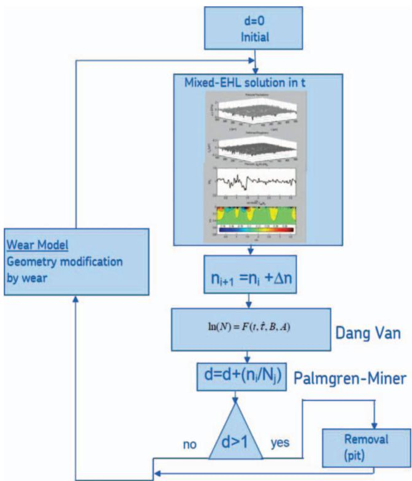  
Fig. 1—Flowchart of the overall micropitting—mild wear model. (color figure available online).

MPa, B 1, 220 MPa, estimated from the data in Shimizu, et al. (19)), and the predicted life $N _ { i }$ in the domain is calculated for the particular loading conditions (stress history in the present contact geometry). Assuming that the contact geometry does not change due to micropitting or wear for a number of cycles, $n _ { i } ,$ allows for improved computation time. The overall damage from different local loading conditions that may change due to wear or micropitting is accumulated using the Palmgren-Miner rule (Palmgren (20)). Wherever the damage parameter d is larger than 1, the concerned material volume and the one directly above it, up to the surface are assumed to be lost and a micropit is created.

Once the pits are created, the pitted surface is sent to the wear model for wear layer removal, and the damage map for the material is also updated by removing the damage close to surface, bringing to the surface the deeper layers of the material. The modified surfaces are sent again to the partial-lubrication model for recalculation of pressures and stresses with further damage accumulation. This is repeated until the final prescribed number of contact cycles was reached. Then the pitted area is measured and reported. Because typical calculations involve millions of loading macro- and microcycles, a pragmatic approach was followed. As mentioned above, the update of the surface geometry by wear and micropitting was only carried out after a fixed number of contact cycles n. The smaller the $\Delta n ,$ the more realistic the overall simulation will be, because the surfaces are updated more often. However, it was found that for $n \approx 1 \times 1 0 ^ { 6 }$ load cycles, which is for typical micropitting experiments in the laboratory, using $\Delta n \leq 1 \times 1 0 ^ { - 5 }$ will not make a large difference in the final results. However, for a greater number of cycles or rapidly changing conditions this number has to be adapted.

In the following sections each of the elements of the overall model will be described in detail.

## PARTIAL LUBRICATION

The partial lubrication model used in the present work has been extensively described and validated in Morales-Espejel, et al. (21) and will not be repeated here. For the sake of completeness of the present article a brief summary is described.

The model is based on the assumption of two nominally flat, elastic–perfectly plastic rough surfaces in contact. This approach allows for the simplification of the geometry and it assumes that the mean film thickness and mean pressure are known, as in the central location of a contact. Therefore, only clearance and pressure fluctuations are calculated. The inlet and outlet of the contact are not fully included in the analysis. For the dry contact patches, a contact model with an FFT approach, as described in Stanley and Kato (22), was used but extended to 3D geometries. Furthermore, perfectly plastic behavior of the asperities at high pressure was introduced. For the lubricated areas an upgraded version of the so-called amplitude-reduction approach as initially described in Morales-Espejel, et al. (16) was used. Finally, the sharing of the load between asperities and lubricant was calculated by using the classical iterative approach of flow balance as described initially by Johnson, et al. (23). The final model avoids the expensive full numerical calculations related to the macrogeometry of the contact as used in previous models.

## Dry Contact Model

The model used here was fully described in Stanley and Kato (22) and was based on the variational principle stated by Kalker (24). Beginning with a guess for the pressure matrix p that meets the equality and inequality constraints of a dry contact (a uniform pressure ptarget is convenient), then

 Calculate a candidate pressure matrix $\mathbf { p } ^ { \prime } = \mathbf { p } - \mathbf { g r a d } \left\{ f \left( \mathbf { p } \right) \right\}$ . In general, $\mathbf { p } ^ { \prime }$ will violate the constraints. The overall displacements are calculated from the pressures (i.e., Eq. [1]). Then, grad $\left\{ f \left( \mathbf { p } \right) \right\} = \mathbf { u } ( \mathbf { p } ) + \mathbf { g } ,$ , for f quadratic.

 Shift p- uniformly up or down so that the sum of the positive pressures equals the target load.

 Truncate all $p _ { i ^ { \prime } } < 0 ;$ thus, p- meets all constraints.

 Set $ { \mathbf { p } } =  { \mathbf { p } } ^ { \prime }$ , and repeat until convergence.

## Modification for Elastic–Perfectly Plastic Material

The above algorithm was modified according to the scheme of Tian and Bushman (25) to introduce the perfectly plastic behavior of the material. It was assumed that the region of plastic deformation is only confined within a very small area and thus it does not significantly alter the geometry of the elastically deformed contact surface. A contact point begins to deform plastically once the local contact pressure exceeds the first-yield pressure of the material $( p _ { l i m } ) ;$ for hardened AISI 52100 steel it is assumed $p _ { l i m } = 4 . 3$ GPa. For elastic–perfectly plastic materials the internal complementary energy is equal to the elastic strain energy; therefore, the variational principle remains valid when consumed energy from plastic deformation is not very large (small plastic deformations).

Thus, the elastic scheme can be slightly modified as follows:

 The elastic algorithm (as above) is the starting point. However, after the calculation of pressures at every iteration it follows the following steps.

 The elastic pressures are limited to a threshold value related to the material yield limit by $p _ { l i m } .$

 Truncate all $p _ { i } ^ { \prime } < 0 .$

 Calculate $\Delta \mathbf { p } = \mathbf { p ^ { \prime } } - \mathbf { p }$ , where p is the pressure from the previous iteration.

 Check for convergence mean $\left\{ \Delta \mathbf { p } \right\} / \mathbf { p _ { t a r g e t } } = e r r o r$ and repeat until convergence.

 Go back to Truncate all $p _ { i } ^ { \prime } < 0 .$ , until convergence.

The plastic displacements can be calculated by simply subtracting the elastic displacements from the total displacements.

The numerical schemes described above require the calculation of the elastic normal displacements for a given normal surface pressure. Here the FFT method described in Stanley and Kato (22) will be followed; therefore,

$$
\mathbf { u } ( \mathbf { p } ) = I F F T { \big \{ } \mathbf { w } \cdot F F T ( \mathbf { p } ) { \big \} }\tag{[1]}
$$

where IFFT means inverse fast Fourier transform, $\mathbf { w } \cdot F F T ( \mathbf { p } )$ refers to element-by-element multiplication, and w is a matrix containing numerical factors, known as the frequency response function. To calculate w, consider the displacement solution for a bi-sinusoidal pressure distribution as given by Johnson, et al.

(26). The full matrix with the frequency response function for a 3D problem is described in Morales-Espejel, et al. (21).

## Lubrication Model

An amplitude reduction scheme to calculate 3D hydrodynamic pressures and microgeometry deformation in full-film conditions initially was introduced by Morales-Espejel, et al. (16); however, this scheme is valid for Newtonian fluids only. In order to properly consider sliding, a non-Newtonian scheme is required; therefore, in the present article the scheme developed by Hooke (27) and Hooke, et al. (28) and described in detail in Morales-Espejel, et al. (21) is followed. As described in these references, in the center of an EHL contact, variations of the microgeometry with small amplitude will produce products of fluctuations (pressures and clearances) and products of derivatives in the Reynolds equation that can be neglected; thus, the Reynolds equation can be written as,

$$
\frac { h ^ { 3 } } { 1 2 } \left( \frac { 1 } { \eta _ { x } } \frac { \partial ^ { 2 } p } { \partial x ^ { 2 } } + \frac { 1 } { \eta _ { y } } \frac { \partial ^ { 2 } p } { \partial y ^ { 2 } } \right) = \bar { u } \frac { \partial h } { \partial x } + \frac { \partial h } { \partial t } + \frac { h } { B } \left( \bar { u } \frac { \partial p } { \partial x } + \frac { \partial p } { \partial t } \right)\tag{[2]}
$$

Greenwood and Morales-Espejel (29) have shown that the solution of the moving roughness problem is made of two components; the particular integral (moving steady-state) traveling with the speed of the rough surface $u _ { 2 }$ and a complementary function describing a propagated wave generated at the inlet, traveling at the average speed for the lubricant ¯u.

Assuming sinusoidal waves in roughness (r), pressures $( p ) _ { : }$ elastic displacements (v), clearances (h), and density (ρ) one has,

$$
\begin{array} { r l } & { \delta r = r _ { a } \exp ( i \omega _ { x } x ) \exp ( - i \omega _ { x } u _ { 2 } t ) \exp ( i \omega _ { y } y ) } \\ & { \delta p = p _ { a } \exp ( i \omega _ { x } x ) \exp ( - i \omega _ { x } u _ { 2 } t ) \exp ( i \omega _ { y } y ) } \\ & { \delta \nu = \nu _ { a } \exp ( i \omega _ { x } x ) \exp ( - i \omega _ { x } u _ { 2 } t ) \exp ( i \omega _ { y } y ) } \\ & { \delta h = h _ { a } \exp ( i \omega _ { x } x ) \exp ( - i \omega _ { x } u _ { 2 } t ) \exp ( i \omega _ { y } y ) } \\ & { \delta \rho = \rho _ { a } \exp ( i \omega _ { x } x ) \exp ( - i \omega _ { x } u _ { 2 } t ) \exp ( i \omega _ { y } y ) } \end{array}
$$

and $\omega _ { x } = 2 \pi / \lambda _ { x }$ and $\omega _ { y } = 2 \pi / \lambda _ { y } , h _ { a } = r _ { a } + \nu _ { a }$

$$
\nu _ { a } = \frac { 4 p _ { a } } { E ^ { \prime } \sqrt { \omega _ { x } ^ { 2 } + \omega _ { y } ^ { 2 } } }\tag{[3]}
$$

where $\rho _ { a }$ is related to the pressure variation by

$$
\rho _ { a } = ( \rho / B ) p _ { a }\tag{[4]}
$$

where B is the bulk modulus of the lubricant at a given pressure, $d \rho / d p = \rho / B .$

In order to calculate the particular integral, pressure, clearance, and density variations can be added to the smooth contact and substituted in Eq. [2]; thus, solving for $p _ { a }$ leads to

$$
\frac { p _ { a } } { r _ { a } } = \frac { \kappa E ^ { \prime } } { 4 } \frac { i Q } { 1 - i Q - i C Q }\tag{[5]}
$$

where $\kappa = \sqrt { \omega _ { x } ^ { 2 } + \omega _ { y } ^ { 2 } } , C = h E ^ { \prime } \kappa / ( 4 B )$ , and

$$
Q = \frac { \left( \frac { 4 8 ( u _ { 2 } - \bar { u } ) \omega _ { x } } { E ^ { \prime } h ^ { 3 } \kappa } \right) } { \left( \frac { \omega _ { x } ^ { 2 } } { \eta _ { x } } + \frac { \omega _ { y } ^ { 2 } } { \eta _ { y } } \right) }
$$

For an Eyring fluid $\begin{array} { r } { \dot { \gamma } = \frac { \tau _ { 0 } } { \eta } } \end{array}$ sin $\begin{array} { r } { h \big ( \frac { \tau } { \tau _ { 0 } } \big ) } \end{array}$ the effective viscosities (Ehret, et al. (30)) are

$$
\eta _ { x } = \frac { \eta } { \cos h ( \tau _ { m } / \tau _ { 0 } ) } \quad \eta _ { y } = \frac { \eta ( \tau _ { m } / \tau _ { 0 } ) } { \sin h ( \tau _ { m } / \tau _ { 0 } ) }\tag{[6]}
$$

where $\tau _ { m }$ is the mean shear stress.

In the general problem of rolling–sliding, the complementary waves (pressures and clearance fluctuations) will decay in amplitude as they propagate in the contact due to the non-Newtonian effects from sliding. Hooke, et al. (28) suggested an exponential decay with respect to the inlet $( x ^ { \prime } = x + a )$ location. Because the waves propagate with the average speed of the lubricant, effectively they will have a wavenumber in x such that $\omega _ { x ^ { \prime } } \approx \omega _ { x } ( u _ { 2 } / \bar { u } )$ . Assuming that the waves decay exponentially with distance at a rate $\beta ,$ the amplitude of the clearance and by consequence the pressure can be expressed as:

$$
\begin{array} { r } { \begin{array} { r l } & { \delta h _ { c } = h _ { c } \exp ( i \psi x ^ { \prime } ) \exp ( - i \omega _ { x } u _ { 2 } t ) \exp ( i \omega _ { y } y ) } \\ & { \delta p _ { c } = p _ { c } \exp ( i \psi x ^ { \prime } ) \exp ( - i \omega _ { x } u _ { 2 } t ) \exp ( i \omega _ { y } y ) } \end{array} } \end{array}\tag{[7]}
$$

with $\psi = \omega _ { x ^ { \prime } } + i \beta .$

Substituting these equations and the associated changes in density into the linearized Reynolds $\operatorname { E q . }$ [2] and collecting the first-order terms, Hooke, et al. (28) obtained

$$
\psi = \omega _ { x ^ { \prime } } + i \frac { E ^ { \prime } h ^ { 3 } \sqrt { \psi ^ { 2 } + \omega _ { y } ^ { 2 } } [ ( \psi ^ { 2 } / \eta _ { y } ) + ( \omega _ { y } ^ { 2 } / \eta _ { y } ) ] } { 4 8 \bar { u } [ 1 + ( E ^ { \prime } h \sqrt { \psi ^ { 2 } + \omega _ { y } ^ { 2 } } / ( 4 B ) ) ] } ,\tag{[8]}
$$

which needs to be solved for ψ at every roughness component. The numerical solution is possible by successively using the real part of Eq. [8] to estimate the real part of ψ and the imaginary part to estimate the imaginary part of ψ.

To calculate the amplitude of the complementary waves $h _ { c }$ and $p _ { c } .$ Hooke, et al. (28) suggested an interpolation scheme based on perturbation solutions. Morales-Espejel, et al. (21) suggested a modified approach for non-Newtonian fluids based on the Newtonian numerical results from Venner and Lubrecht $( 3 I ) ;$ the second approach is followed here.

The above scheme can be accurately used only for lowamplitude features in relation to the film thickness, as discussed in Morales-Espejel (16) and Greenwood and Morales-Espejel (29). Surprisingly, the method provides good agreement with experiments and numerical calculations even in situations of partial lubrication (Morales-Espejel, et al. (21)). In any case, only within the roughness valleys where the pressure reaches near-zero values, the local deformation will not be accurate. However, this will not substantially affect the stresses or the fatigue calculation.

## Combined Model for Partial Lubrication

As discussed in Morales-Espejel, et al. (21), it is clear that the Reynolds equation cannot be used to explain film thickness breakdown to produce a dry contact, as long as the surface velocity remains different from zero and no lubricant–wall slippage is allowed. However, the present model only attempts to approximate the contact pressures and elastic deformation of the surface for load sharing. With this objective, the authors believe that in very small clearance locations, calculation of these parameters using a dry contact model rather than a continuum-mechanics lubrication model will result in fewer errors. A justification for this approximation was given in Morales-Espejel, et al. (21) for the use of the present lubrication model in conditions of very thin film thickness. This question remains to be resolved and it is a matter of further discussions.

The intention in the present scheme is to use the dry contact model described earlier for those areas identified as dry contact and the lubrication model (also described earlier) for the areas considered as full-film. This implies two main aspects: an algorithm for load sharing and a way to identify dry and lubricated patches.

For the load sharing calculation between dry and lubricated patches the basic iterative algorithm of mass conservation as described by Johnson, et al. (23) is followed. First a smooth surface central film thickness h¯ is calculated from the operating conditions by using any chosen EHL formula. A mean pressure is chosen in the contact; initially the maximum Hertzian pressure $p _ { h }$ can be considered. The iteration process begins by assuming a fraction of load carried by the dry contact asperities $\phi _ { b l } .$ , and the rest of the load is carried by the lubricated spots; these conditions are used in the dry and lubricated models to calculate local pressures and clearances. New dry and lubricated areas are identified and the process is repeated until convergence in the load sharing, keeping the flow balance constant by moving up and down the deformed clearances. Notice that due to the compressibility of the lubricant, as the proportion of load carried by the lubricated patches changes, the initially calculated central film thickness has to be adjusted with a correction factor for compressibility $c _ { \rho } .$

The identification of dry and lubricated patches is related to the calculation of the actual partial-lubrication clearances $h _ { t r a n }$ and pressures $p _ { t r a n } .$ A simple approach would be to use the lubricated clearances $h _ { l u b }$ and locate the contact spots and replace those spots by dry contact solutions $h _ { d r y }$ . The overall convergence and load balance are achieved during the iteration process. However, as shown in the amplitude reduction curves of Venner and Lubrecht $( 3 I )$ , as the wavelengths of the roughness increase and the central film thickness is reduced, the lubrication model will predict a continuous flattening of the roughness by elastic deformation. This is, of course, not possible in a partial lubrication model. The roughness deformation will be limited by the dry contact problem, and this has to be considered in the algorithm. A simple way to do this is by assuming that in general long wavelength surface features have larger amplitudes that are more likely to make contact. Thus, the two clearances, lubricated and dry, in the frequency domain after FFT $( \tilde { h } _ { l u b }$ and $\tilde { h } _ { d r y } )$ are compared for each frequency and the absolute maximum is selected. Then the process IFFT is calculated to recover $h _ { t r a n } .$

$$
h _ { t r a n _ { ( i , j ) } } = I F F T \{ \operatorname* { m a x } ( | \tilde { h } _ { d r y _ { ( i , j ) } } | , | \tilde { h } _ { l u b _ { ( i , j ) } } | ) \}
$$

After having calculated the transition clearances $h _ { t r a n } .$ the corresponding pressures $p _ { t r a n }$ can be recovered by using the produced elastic displacements and applying the inverse process to Eq. [1],

$$
\mathbf { p } _ { \mathrm { t r a n } } = I F F T \big \{ ( \mathbf { w } ^ { - 1 } ) \cdot F F T ( \mathbf { r } - \mathbf { h } _ { \mathrm { t r a n } } ) \big \}
$$

where $\mathbf { r } - \mathbf { h } _ { \mathbf { t r a n } } = \mathbf { u } .$ . If plasticity has occurred, the pressures ptran will have to be limited to $p _ { l i m }$ . In the case of negative pressures due to cavitation, the pressures are fixed to $p _ { t r a n } = 0$ , introducing some error. However, these areas are minimized by avoiding high-amplitude microgeometry features in the model.

In the case of two rough surfaces in contact, the dry contact problem can be directly solved with two rough surfaces, and for the lubrication problem the previous process is simply repeated for the two surfaces. The overall hydrodynamic pressures become $p _ { l u b } = p _ { l u b 1 } + p _ { l u b 2 }$ and the clearances can be calculated for each surface. At this point surface friction is introduced in the model, $q ( x , y ) = \mu ( x , y ) p ( x , y )$ , where $\mu ( x , y )$ is either the full-film value $\mu _ { e h l }$ or the boundary lubrication value µbl.

## FATIGUE CRITERION

In the present article, the Dang Van stress-based criterion (Dang Van, et al. (13)) was chosen because it allows the determination of a time loading path for t varying over a load cycle imposed on a local volume that supports multi-axial fatigue. The Dang Van criterion for high-cycle multi-axial fatigue was introduced in the late 1980s and early 1990s (e.g., Dang Van, et al. (13); Dang Van (14)) as a general fatigue criterion. It has been used several times to model rolling contact fatigue (e.g., Dang Van and Maitournam (32)). However, there is still heated debate on the application of the Dang Van criterion for this loading condition; see, for instance, the work of Desimone, et al. (33) and Bernasconi, et al. (34). The main objection is the superposition of manufactured residual stresses. The Dang Van criterion would predict increasing life with increasing compressive residual stresses, while the experiments show a flat behavior. For the modeling of a surface in rolling contact fatigue without compressive residual stresses, or in fretting conditions, the model has been used with success; see Fouvry, et al. (35) and Baietto, et al. (36).

In general, the results of the Dang Van fatigue criterion for a given load history are expressed by means of a dimensionless risk parameter $0 \leq D \leq 1 _ { \cdot }$ , where $D = 0$ means no damage at all and $D = 1$ means that the damage has reached a limiting value and a crack will be generated (end of life). From the expression proposed to calculate $D ,$ it is possible to relate the life of the component in number of cycles by considering the fatigue properties of the material in bending and torsion and fixing $D = 1$

The Dang Van crack initiation risk parameter is defined (e.g., Dang Van, et al. (13); Dang Van (14)) as

$$
D = \operatorname* { m a x } _ { t } \left\{ { \frac { \hat { \tau } ( \vec { n } , t ) } { \tau _ { f } - \alpha \hat { p } ( t ) } } \right\}\tag{[9]}
$$

for which the risk of crack initiation exists when $D \geq 1$ , where $\hat { \tau } ( \vec { n } , t )$ is the instantaneous microscopic shear stress amplitude in the critical plane $\vec { n }$ of the structure, $\tau _ { f }$ is the alternating shear fatigue endurance of the material at N cycles, $\cdot \hat { p } ( t )$ is the instantaneous hydrostatic pressure, and α is a material constant defined as

$$
\alpha = \frac { \tau _ { f } - \sigma _ { f } / 2 } { \sigma _ { f } / 3 }
$$

where $\sigma _ { f }$ is the alternating bending fatigue endurance. The two material constants in the model $\tau _ { f }$ and $\sigma _ { f }$ can be related by following the von Mises hypothesis, $\tau _ { f } \approx \sigma _ { f } / \sqrt { 3 } ,$ with the approximation $\alpha \approx 0 . 2 3 2$

To calculate D at any location of the structure $( x , y , z )$ the material parameters $\tau _ { f }$ and $\sigma _ { f }$ are related to a reference number of cycles, $N _ { r e f }$ , usually larger than $1 \times 1 0 ^ { 6 } \colon$ ; see Desimone, et al. (33).

The alternating bending fatigue endurance $\sigma _ { f }$ depends on the number of cycles used to measure it. The results are often mapped as an $S - N$ (or Wohler) curve. It can be approximated¨ by empirical constants in the following form:

$$
\sigma _ { f } = A l n ( N ) + B\tag{[10]}
$$

Substituting Eq. [10] into [9] with $D = 1$ leads to

$$
1 = \operatorname* { m a x } _ { t } \left\{ { \frac { { \hat { \tau } } ( { \vec { n } } , t ) } { { \frac { A } { \sqrt { 3 } } } \ln ( N ) + { \frac { B } { \sqrt { 3 } } } - \alpha { \hat { p } } ( t ) } } \right\}\tag{[11]}
$$

For known values of $D ( x , y , z ) , \hat { \tau } , \hat { p } , A , B ,$ and α, Eq. [11] can be used to calculate the life (N) of any location within the structure. Notice that the right-hand side of the equation represents a maximum in time; thus, this has to be considered in the solution. The calculated life in load cycles N is then used to update the damage map in the subsurface by using the Palmgren-Miner rule (as shown in Fig. 1) to account for fatigue in variable operating conditions.

## Stress History Calculation

The instantaneous microscopic shear stress amplitude in the critical plane $\hat { \tau } ( \vec { n } , t )$ and the instantaneous hydrostatic pressure $\hat { p } ( t )$ are parameters in Eq. [11] that depend on time within the load cycle. Numerous papers have been published describing the determination of these two stresses (Dang Van, et al. (13); Dang Van $( l 4 ) ;$ Desimone, et al. (33); Bernasconi, et al. (34); Baietto, et al. (36)); therefore, this will not be discussed here.

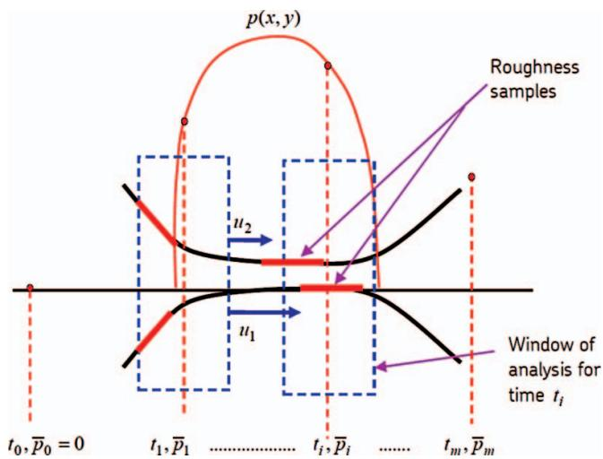  
Fig. 2—Schematics of the time simulation as the roughness moves into the loaded zone of a Hertzian contact during one load cycle of load. The roughness is followed in m time steps by a window of analysis moving with speed ¯u. The mean pressure ¯p varies in time as the roughness sample follows the Hertzian pressure profile. Roughness is assumed periodic in both directions. Here, the roughness sample is smaller than the Hertzian contact. (color figure available online).

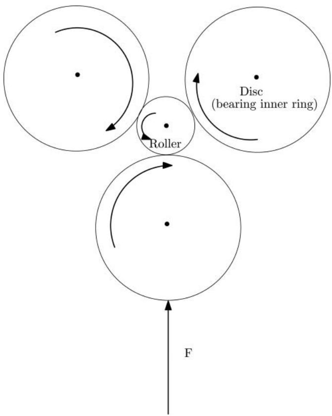  
Fig. 3—Schematics representing the laboratory micropitting tester: (a) disc surface and (b) roller surface.

These stresses depend on the six stress components in all time steps during the loading cycle. These components are calculated from the pressure $p _ { t r a n } ( x , y , z , t )$ and the surface tractions (assuming Coulomb friction) $\mu p _ { t r a n } ( x , y , z , t )$ as the roughness moves inside the contact with rolling–sliding movement. Roughness will introduce microcycles of load that must be considered in the damage accumulation process. If the roughness is assumed to be periodic, during every wear step the microcycle number and amplitude will only depend on the current operating conditions of the contact (roughness geometry) and will remain constant. Therefore, their damage contribution is calculated only once for every wear step in the usual way.

For a given instant of time t with known pressures and tractions on each surface, all six stress components below the surfaces depend only on $x , y ,$ and z and can be calculated by following the FFT approach described in Morales-Espejel, et al. (16):

For a normal pressure $p ( x , y , 0 ) = p _ { 0 } \cos ( \alpha x ) \cos ( \beta y )$ , the following stress components are obtained:

$$
\begin{array} { r l } & { \sigma _ { x } = p _ { 0 } [ \alpha ^ { 2 } / \zeta ^ { 2 } - \alpha ^ { 2 } z / \zeta + 2 \upsilon ( \beta / \zeta ) ^ { 2 } ] e ^ { - \zeta z } \cos ( \alpha x ) \cos ( \beta y ) } \\ & { \sigma _ { y } = p _ { 0 } [ \beta ^ { 2 } / \zeta ^ { 2 } - \beta ^ { 2 } z / \zeta + 2 \upsilon ( \alpha / \zeta ) ^ { 2 } ] e ^ { - \zeta z } \cos ( \alpha x ) \cos ( \beta y ) } \\ & { \sigma _ { z } = p _ { 0 } ( 1 + \zeta z ) e ^ { - \zeta } \cos ( \alpha x ) \cos ( \beta y ) } \\ & { \tau _ { x y } = - p _ { 0 } ( \alpha \beta / \zeta ^ { 2 } ) [ ( 1 - 2 \upsilon ) - \zeta z ] e ^ { - \zeta z } \sin ( \alpha x ) \sin ( \beta y ) } \\ & { \tau _ { y z } = p _ { 0 } ( \beta z ) e ^ { - \zeta } \cos ( \alpha x ) \sin ( \beta y ) } \\ & { \tau _ { x z } = p _ { 0 } ( \alpha z ) e ^ { - \zeta } \sin ( \alpha x ) \cos ( \beta y ) } \end{array}\tag{[12]}
$$

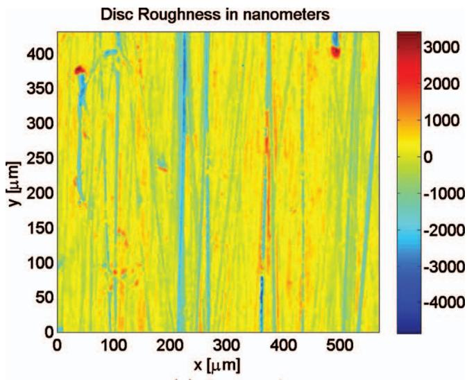

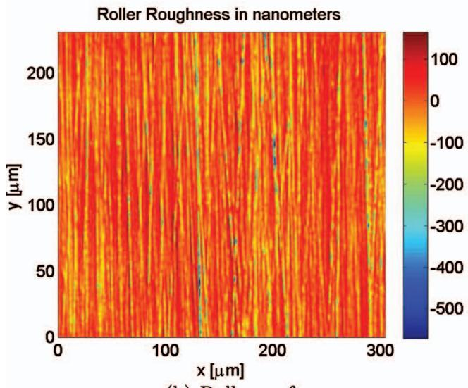  
Fig. 4—Optical measurement samples of surface roughness of tested rollers and contacting discs: (a) roughened disc with transverse roughness $( R _ { q } = 0 . 5 9 8 ~ \mu \mathrm { m } , ~ S _ { k } = - 1 . 3 8 ) ;$ (b) roller sample $\begin{array} { r } { ( R _ { q } = } \end{array}$ 0.064 $\mu \mathbf { m } , \pmb { S } _ { k } = - 1 . 2 6 )$ . (color figure available online).

For the surface traction $q ( x , y , 0 ) = q _ { 0 } \cos ( \alpha x ) \cos ( \beta y )$ , the stress components are

$$
\begin{array} { r l } & { \sigma _ { x } = q _ { 0 } ( \alpha / \delta ) [ 2 + 2 v ( \beta / \delta ) ^ { 2 } - ( \alpha / \delta ) ( \alpha z ) ] e ^ { - z } \sin ( \alpha x ) \cos ( \beta y ) } \\ & { \sigma _ { y } = q _ { 0 } ( \alpha / \delta ) [ 2 v ( \beta / \delta ) ^ { 2 } - ( \alpha / \delta ) ( \alpha z ) ] e ^ { - z } \sin ( \alpha x ) \cos ( \beta y ) } \\ & { \sigma _ { z } = q _ { 0 } ( \alpha z ) e ^ { - z } \sin ( \alpha x ) \sin ( \beta y ) } \\ & { \tau _ { x y } = q _ { 0 } ( \beta v \delta ) [ 1 - 2 v ( \alpha / \delta ) ^ { 2 } - ( \alpha / \delta ) ( \alpha z ) ] e ^ { - z } } \\ & { \qquad \times \cos ( \alpha x ) \sin ( \beta y ) } \\ & { \tau _ { y z } = q _ { 0 } ( \beta / \delta ) ( \alpha z ) e ^ { - z } \sin ( \alpha x ) \sin ( \beta y ) } \\ & { \tau _ { x z } = q _ { 0 } [ 1 - ( \alpha / \delta ) ( \alpha z ) ] e ^ { - z } \cos ( \alpha x ) \cos ( \beta y ) } \end{array}\tag{[13]}
$$

In the present model, for every load cycle, the application of the mean ( ¯p) load on the roughness sample is divided in m time steps where the mean load in the contact follows a Hertzian profile, with half of the cycle increasing from 0 to $p _ { h }$ and the other half decreasing from $p _ { h }$ to 0. Thus, the local pressure $p _ { t r a n }$ and clearances $h _ { t r a n }$ are calculated by using the instantaneous mean pressure. The roughness sample is assumed to be periodic in both directions (this facilitates the use of FFT approaches), and as this roughness sample travels within the Hertzian contact it is followed by a “window” of analysis where the partial lubrication model is applied at every time step, because the roughness on both surfaces is moving within the window of analysis, and under the assumption of periodic roughness, the boundary conditions in the edges of the window are periodic; thus, as waves go out of the window they come back on the inlet end. This scheme is represented in Figure 2.

TABLE 1—MATERIAL PROPERTIES AND NOMINAL ROLLER–DISC CONTACT CONDITIONS IN THE MICROPITTING TESTER
<table><tr><td rowspan="2">El (GPa)</td><td rowspan="2"> $\tau _ { 0 }$  (Pa)</td><td colspan="3">η0</td><td rowspan="2">η0  $\left( \mathrm { V G 1 0 , 7 5 ^ { \circ } C } \right) \left( \mathrm { P a s } \right)$ </td><td colspan="2">α</td><td rowspan="2">ū (m/s)</td></tr><tr><td>μbl</td><td>μehl</td><td> $\left( \mathrm { V G } 3 2 , 7 5 ^ { \circ } \mathrm { C } \right) \left( \mathrm { P a s } \right)$ </td><td> $( \mathbf { G P a ^ { - 1 } } )$ </td><td>S</td></tr><tr><td>231</td><td> $3 \times 1 0 ^ { 6 }$ </td><td>0.12</td><td>0.05</td><td>0.0094</td><td>0.0034</td><td>20.78</td><td>0.02</td><td>1.0</td></tr></table>

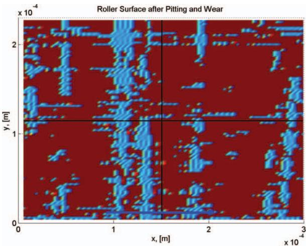

## WEAR MODEL

The mild wear model is a relatively simple classical Archard model, which in its general form (Laine and Olver ´ (10)) can be

(a) Model, $A _ { p } { = } 2 5 . 5$ %, Λ=0.1  
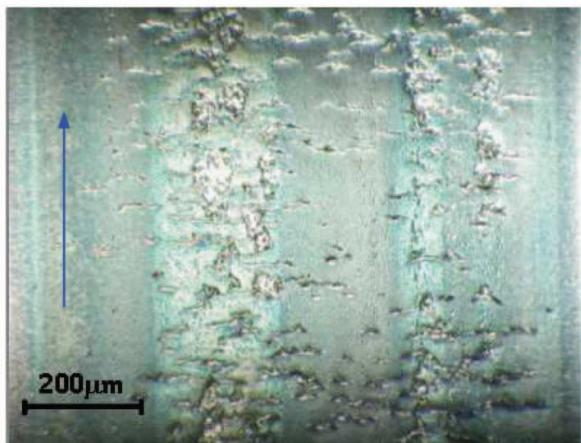

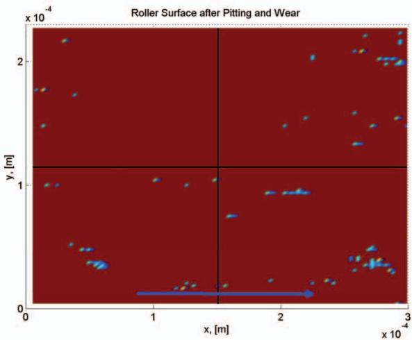  
(c) Model, $A _ { p } { = } 1 . 0$ %, $\Lambda { = } 0 . 1$

(b) Experiment  
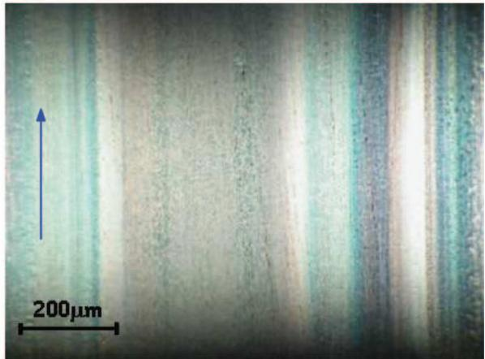  
(d) Experiment  
Fig. 5—Comparison of model results versus laboratory experiments in the micropitting tester: (a) transverse roughness calculation, (b) transverse roughness experiment, (c) longitudinal roughness calculation, and (d) longitudinal roughness experiment. In all cases, 720,000 load cycles, $p _ { h } = 1 . 5 \mathsf { G P a }$ , and VG 10 oil. Blue arrows show the rolling direction. (color figure available online).

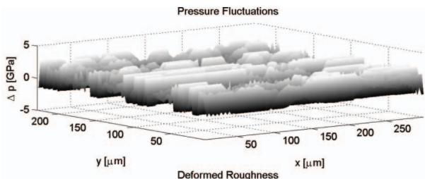

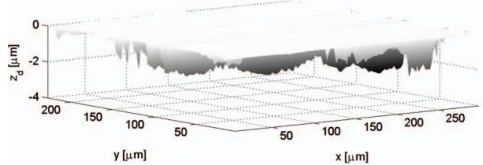  
(a) Pressures and Shape

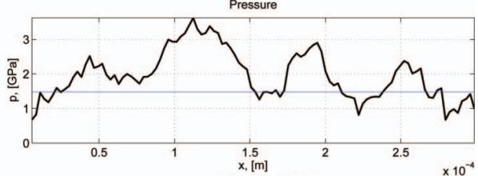

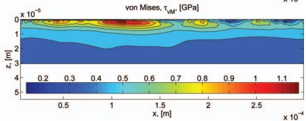  
(b) von Mises stresses  
Fig. 6—Results from the simulation for the time step where the mean load is maximum in the last wear step: (a) partial lubrication pressures and shape, (b) von Mises stress in the plane x z at y 0. (color figure available online).

represented as,

$$
\frac { \Delta h _ { w } } { \Delta n } = k ( x , y ) p ( x , y ) u _ { s } ( x , y ) / H ( x , y )\tag{[14]}
$$

where $\Delta h _ { w } / \Delta n$ represents the removal rate of material height $\left( h _ { w } \right)$ with the number of cycles $( n ) ; k ( x , y )$ is the local wear constant; $u _ { s } ( x , y )$ is the local sliding speed; and $H ( x , y )$ is the local hardness of the material (for hardened AISI 52100, $H \approx 7 \mathrm { G P a } )$ . However, in this article the general form of the model will not be considered, because within the roughness sample domain it is assumed that the sliding speed and the material hardness are constant. The wear coefficient k may well not be constant due to the dry and lubricated patches within the contact. As a simple engineering approach, it might be assumed that the wear coefficient depends on the type of lubrication regime in the contact. It can be suggested that $k _ { d r y } \approx f _ { w } k _ { l u b }$ , with $1 \times 1 0 ^ { - 1 1 } \leq k _ { l u b } \leq 5 \times 1 0 ^ { - 1 0 }$ values in good agrement with the literature (Williams (37)). Following the friction ratio between boundary and full-film conditions of around 10, the coefficient $f _ { w } \approx$ 10 can be assumed (which supposes an adhesion mechanism). This introduces a dependency of the mean mild wear coefficient $k _ { m e a n }$ with the -ratio. However, for $f _ { w } = 1$ the corresponding $k _ { m e a n }$ becomes independent of the lubrication regime. In fact, the model does not show a strong dependency on $f _ { w }$ , except in the cases of very low $\Lambda \mathfrak { - }$ values.

The wear equation per wear step n can be simplified as

$$
\Delta h _ { w } = \frac { u _ { s } } { H A } \int _ { A } k ( x , y ) p ( x , y ) d A\tag{[15]}
$$

At every new step of n cycles the wear removal average layer is calculated as $\Delta h _ { w }$ . Half of this value is attributed to each surface, and two updates are carried out for each surface:

 The subsurface damage map (from Palmgren-Miner) rule d is updated. That is, the damage layer close to the surface is removed and the whole damage map is moved up to the surface a distance $\Delta h _ { w }$

 The topography is updated; that is, material is removed from the highest asperity downwards a distance $\Delta h _ { w }$

This is a simple model and does not consider a local wear behavior; thus, it has the drawback of completely removing the roughness if enough time or wear rate is allowed. Despite this limitation, the present wear model shows a reasonably good behavior, within the range of interest (number of cycles and wear coefficient).

## MODEL VERIFICATION AND RESULTS IN LABORATORY CONDITIONS

Verification of the model was carried out with the use of a micropitting tester working under laboratory conditions (e.g., controlled slide–roll ratio, controlled lubrication conditions and temperature, fixed speed and load). The micropitting tester in the laboratory is represented in Fig. 3; the test sample is the roller in the middle, which is a spherical bearing roller of diameter 12 mm, and the three larger discs are in fact bearing inner rings (designation NU209). The roller and the discs can be finished ground and/or honed to any roughness or desired pattern on the surface. The maximum load that can be applied is 1,250 N and the temperature can be controlled to a maximum of 135◦C. The tangential speed can be controlled to a maximum of around 4 m/s and the discs and the roller are independently driven, so the slide–roll ratio can be controlled to a maximum of 200%. The size of the Hertzian contact varies with the load and the transverse radius of the roller, but typical values (rolling, transverse direction) are around $0 . 2 4 4 \times 1 . 0 1 6$ mm for $p _ { h } = 1 . 5 \mathrm { G P a }$

Nominal operating conditions of the tester are described in Table 1. The contacts are lubricated with two different mineral oils (depending on the experiment) without additives; therefore, substantial wear $k _ { l u b } = 3 - 5 \times 1 0 ^ { - 1 0 }$ is assumed. The temperature was maintained constant to $7 5 \mathrm { { } ^ { \circ } C }$ in most experiments, and rolling speed and sliding were also maintained constant in most experiments; however, sliding was also varied to investigate its effects. Load was varied according to the experiment.

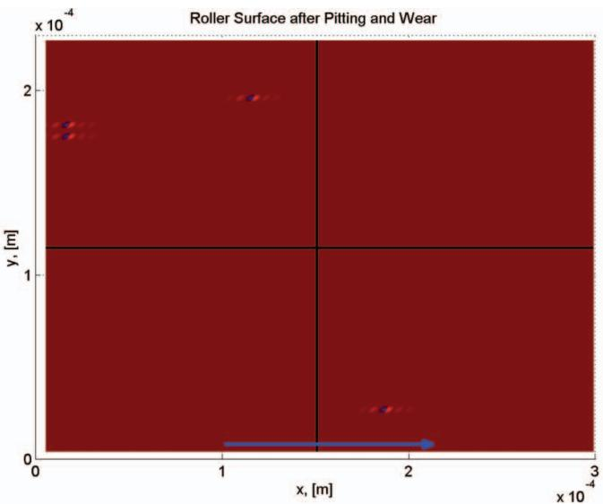  
(a) Model, $A _ { p } = 0 . 0 3 4 \ \% ,$ Λ=0.18

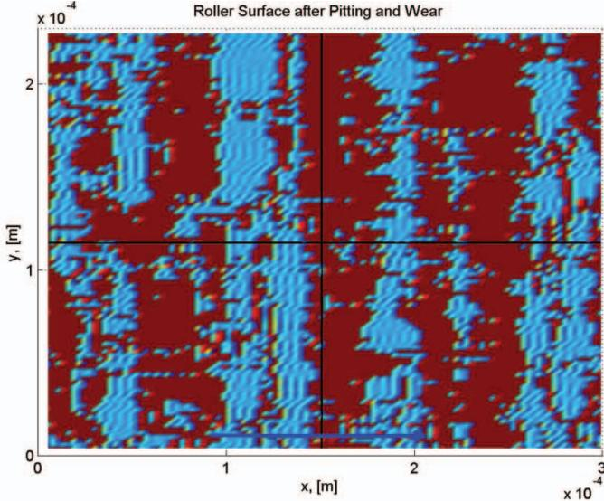  
(b) Model, $A _ { p } { = } 4 4 . 0$ %, Λ=0.05

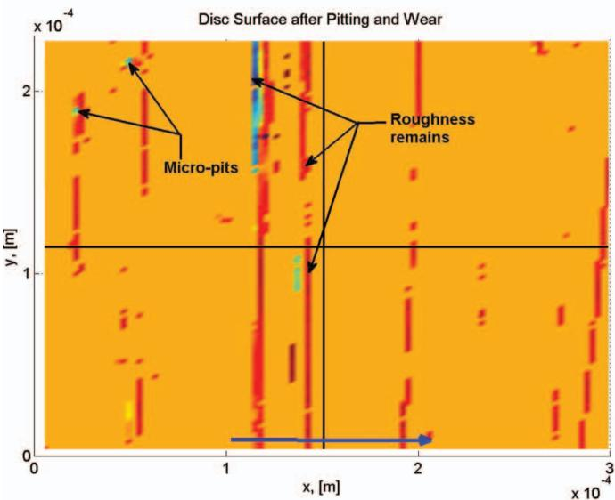  
(c) Model, $A _ { p } { = } 0 . 0 4 2$ %, Λ=0.05

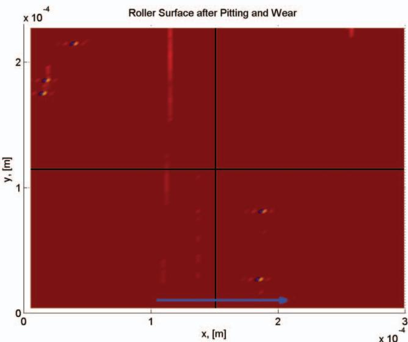  
(d) Model, $A _ { p } { = } 0 . 0 4 3$ %, Λ=0.13  
Fig. 7—Model results: (a) smooth–smooth; (b) smooth–rough, smooth surface; (c) smooth–rough, rough surface; and (d) rough–rough. In all cases, 720,000 load cycles, $p _ { h } = 1 . 5 \mathsf { G P a } ,$ and VG 10. (color figure available online).

Unless stated otherwise, the calculations were performed using a uniform roughness mesh of 121 121 points, with 15 layers in z from z 0 to z 0.25a distributed in such a way that they are more concentrated in areas closer to the surface. There were 10 wear steps, n, and 10 time steps for the moving roughness.

Note that the size of the roughness sample is a limitation of the measuring technique, not of the model. The size should be selected according to the size of the Hertzian contact to be studied. The principle is that the main roughness components in the Hertzian area should be captured by the measurement. In general, a complete study should also consider the variability of the topography within the analyzed component, and several measurements may be necessary.

## Effect of Roughness

The original roughness surface of the discs in the micropitting tester was modified according to the experiment (the three discs were always maintained with the same roughness as much as possible). In most cases the roughness used was transverse to the rolling direction in order to accelerate the micropitting formation. The rollers were polished in order to achieve more or less the same roughness in all the experiments. Typical samples of roughness for the disc (in this case $R _ { q } = 0 . 5 9 \ \mu \mathrm { m } )$ and the roller are shown as examples in Figure 4.

## Effect of Roughness Lay

Verification of the model is first shown by varying the roughness lay with respect to the rolling direction. The nominal operating conditions are described in Table 1 with the VG 10 oil and $p _ { h } = 1 . 5 \mathrm { G P a }$ . The roughness of the discs in both cases (longitudinal and transverse) was $R _ { q } = 0 . 5$ µm and for the rollers $R _ { q } =$ 0.05 µm. The experiment was run for about 720,000 load cycles. The results from the model and the experiment are shown in Fig. 5. The calculations qualitatively agree well with the experiments. Fig. 6 shows an example from the calculations for pressures and stresses in the case of longitudinal roughness, where the effects of wear on the surface can be seen. After the simulation, the disc surface had only $R _ { q } = 0 . 3 \ \mu \mathrm { m }$ , which agrees well with the experimental value measured.

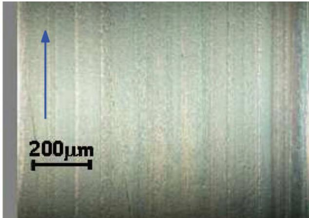  
(a) Experiment, $\overline { { R _ { q _ { 2 } } = 0 . 0 5 ~ \mu m } }$ $R _ { q _ { 1 } } = 0 . 2 6 ~ \mu m$

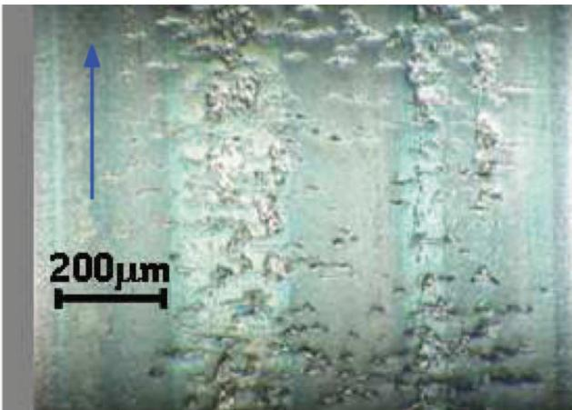  
(b) Experiment, $R _ { q _ { 2 } } = 0 . 0 5$ µm, $R _ { q 1 } = 1 . 0 ~ \mu m$

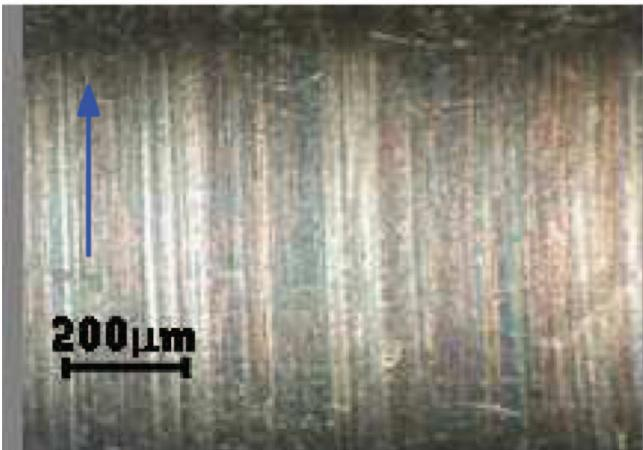  
(c) Experiment, $\overline { { R _ { q _ { 2 } } = 0 . 5 0 } }$ µm, $\overline { { R _ { q _ { 1 } } = 0 . 0 5 \ \mu m } }$

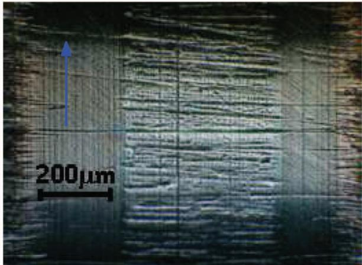  
(d) Experiment, $\overline { { R _ { q _ { 2 } } = 0 . 5 0 } }$ µm, $R _ { q _ { 1 } } = 0 . 5 0 ~ \mu m$  
Fig. 8—Experimental results, rollers: (a) smooth–smooth; (b) smooth–rough, smooth surface; (c) smooth–rough, rough surface; and (d) rough–rough. In all cases, 720,000 load cycles, $p _ { h } = 1 . 5 \mathsf { G P a } _ { \cdot }$ , and VG 10. (color figure available online).

## Effect of Two Rough Surfaces

Fig. 7 shows calculation results from simulation of the experiments carried out in the micropitting tester under the conditions of Table 1, $p _ { h } = 1 . 5$ GPa with VG 10 oil at $7 5 ^ { \circ } \mathrm { C } .$ . The experimental results for the roller surface after 720,000 load cycles are shown in Fig. 8 for four different combinations of surfaces, all with transverse lay. The simulations also show the calculated surface in the rougher disc contacting the smoother roller (Fig. 7c), with much less micropitting than its smooth counterpart (Fig. 7b). By comparing Fig. 7 and 8, good agreement is observed between the calculations and the experiments. It is clear from Fig. 7b and 7c and Fig. 8b and 8c that in the same contact of a smooth and a rougher surface, more damage appears on the smooth surface. In order to further explore this phenomenon, the model was used to predict the results of Fig. 9a using the conditions of Table 1, $p _ { h } = 1 . 5$ GPa with VG 10 oil at $7 5 ^ { \circ } \mathrm { C } .$ It can be seen that in order to achieve the same micropitting damage, a rougher surface requires tougher operating conditions in this case higher Hertzian pressure. As discussed in Kim and Olver (38), the likely explanation for this is the load history from the fatigue microcycles imposed by the roughness.

Because the conditions in the contact are in general more toward boundary or mixed-lubrication (dry areas), the stress history is imposed by the dominant rougher surface upon the smoother one as long as there is some sliding. For example, take an extreme case of this situation (where a moving rough surface is in contact with a stationary smooth surface). The smooth stationary surface experiences a fluctuation in pressures (fatigue microcycles), whereas all points on the rough moving surface see the same stress (which is higher in the contact areas and lower in the noncontact areas due to friction). In the opposite case, where the rough surface is stationary and the smooth surface is moving, the stress history remains the same as the previous case; the smooth surface sees the pressure variation in time, whereas the rough surface does not. This example shows that the rough surface always imposes the load variation upon the smooth one. In real contacts, both surfaces will be rough and in relative movement (with some sliding), but if they have different roughnesses, the rougher surface will prevail over the smoother one when it comes to imposing the load microcycles. However, in full-film conditions with the presence of hydrodynamic pressures from lubrication, this effect in the load history can be very different, because in the presence of sliding, different pressure waves propagate at different speeds (Greenwood and Morales-Espejel (29)).

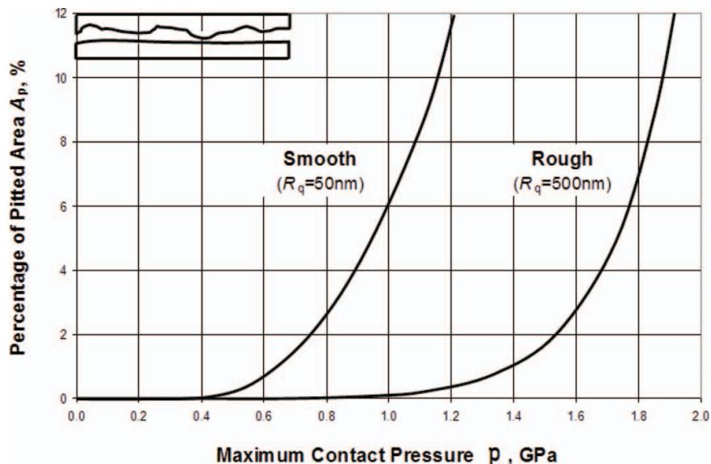  
(a) Model micropitting-load effect on a two-rough contact

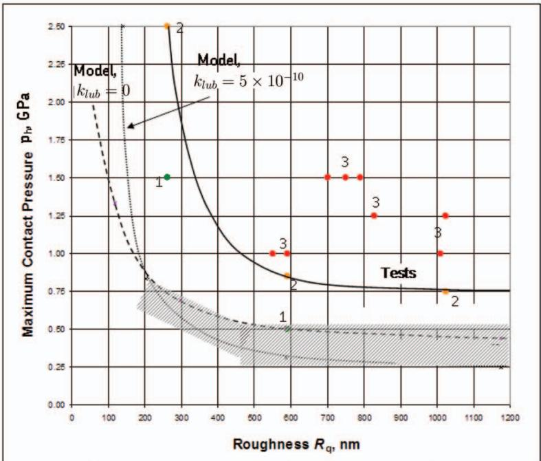  
(b) Experiment (and model) roughness-load diagram  
Fig. 9—(a) Model-predicted micropitting evolution in a two-rough surface contact with load and transverse roughness. (b) Experimental (and model) roughness load diagram of micropitting initiation results. Points 1 no micropitting, points 2 onset of micropitting, points 3 micropitting. (color figure available online).

TABLE 2—MATERIAL PROPERTIES AND INNER RING–ROLLER CONTACT CONDITIONS FOR THE FULL-BEARING EXAMPLES
<table><tr><td>E&#x27;</td><td>0</td><td></td><td></td><td>η0</td><td>α</td><td></td><td>ū</td><td></td><td> $h _ { c }$ </td><td> $p _ { h }$ </td></tr><tr><td>(GPa)</td><td>(Pa)</td><td>μbl</td><td>μehl</td><td> $\left( 4 0 ^ { \circ } \mathbf { C } \right) \left( \mathbf { P } \mathbf { a } \mathbf { s } \right)$ </td><td> $( \mathbf { G P a ^ { - 1 } } )$ </td><td>S</td><td>(m/s)</td><td>Λ</td><td>(µm)</td><td>(GPa)</td></tr><tr><td>231</td><td> $3 \times 1 0 ^ { 6 }$ </td><td>0.12</td><td>0.05</td><td>0.066</td><td>20.78</td><td>0.015</td><td>3.0</td><td>0.48</td><td>0.158</td><td>1.5</td></tr></table>

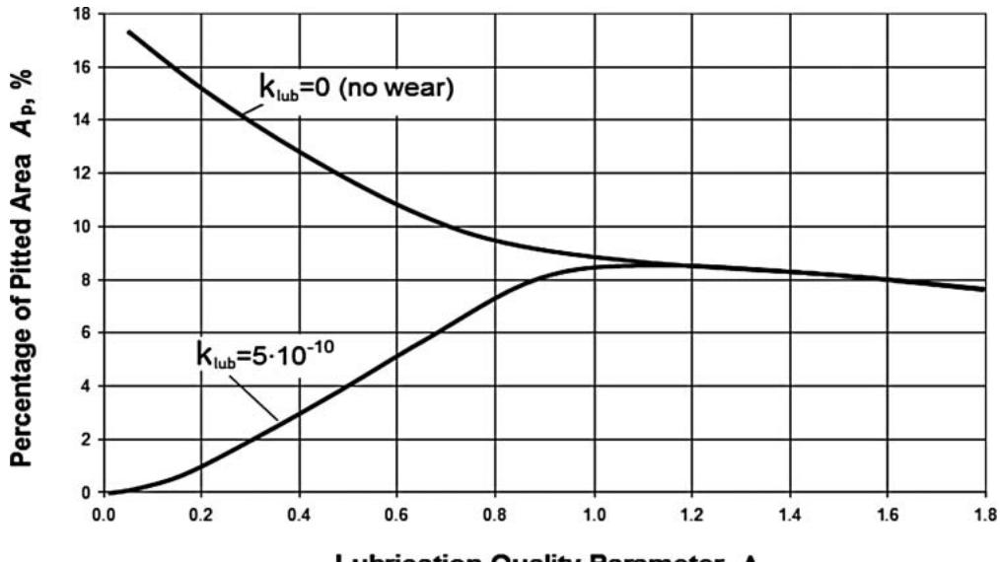  
Lubrication Quality ParameterA

Fig. 10—Model-calculated diagram showing the effect of the lubrication quality - and wear on micropitting.  
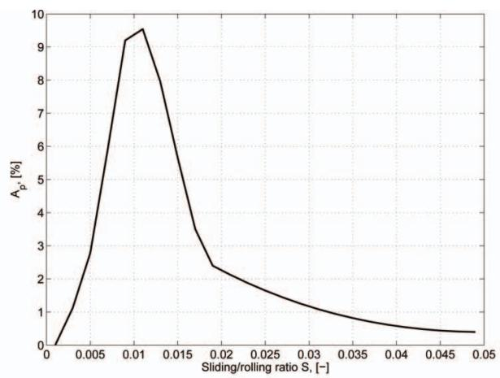  
(a) Model results

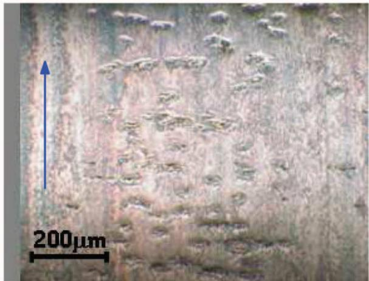  
(b) S = 0.01

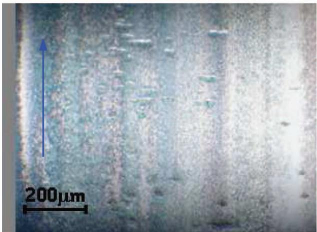  
(c) S = 0.02

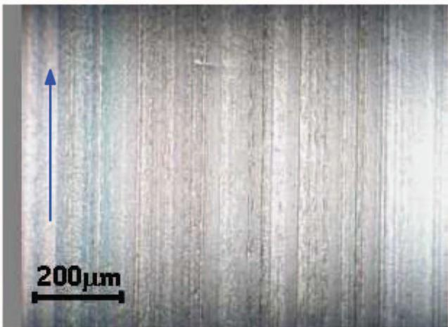  
(d) S = 0.1  
Fig. 11—(a) Slide–roll ratio effect on micropitting according to model, (b) experimental result for S = 0.01, (c) experimental result for $\begin{array} { r } { \pmb { S } = \pmb { 0 . 0 2 } , } \end{array}$ and (d) experimental result for S = 0.1. In all cases, 720,000 load cycles, $p _ { h } = 1 . 5 \mathsf { G P a }$ , and VG 32. Other conditions the same as in Table 2. (color figure available online).

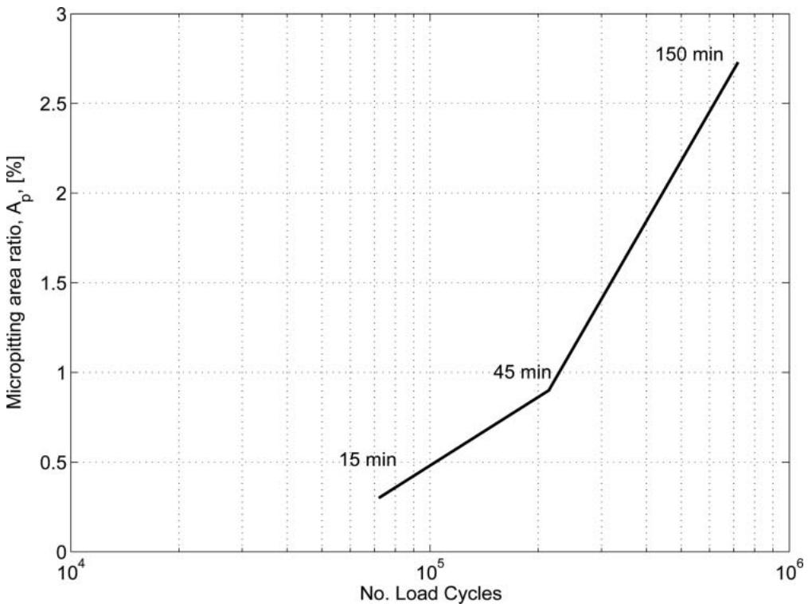  
Fig. 12—Progression of micropitting with the number of load cycles as predicted with the model for negligible wear. Data from Table 1: $p _ { h } = 1 . 5 \mathsf { G P a } ,$ oil VG 32. Discs $R _ { q } = 0 . 7$ µm, roller $\pmb { R _ { q } = 0 . 0 5 \ \mu \ m } ,$ , with 4,770 load cycles per minute.

Fig. 9b shows the behavior of the micropitting damage with the Hertzian pressure and $R _ { q }$ of the transverse roughness considered for the operating conditions of Table 1 and VG 10 oil at 75◦C. The points represent experiments under laboratory conditions; points 1 show no micropitting, points 2 show the onset of micropitting (e.g., about $A _ { p } = 1 \% )$ , and points 3 show substantial micropitting damage. The lines represent the onset of micropitting calculated by the model with two values of the wear coefficient $( k _ { l u b } = 0$ and $k _ { l u b } = 5 \times 1 0 ^ { - 1 0 } )$ . Notice that in very high roughness the model requires a long number of wear steps n and therefore that area is marked with a crosshatch pattern to indicate that the results vary in the indicated range. From this figure it can be seen that the model qualitatively agrees well with the experiments, thus validating the model.

## Effect of Lubrication Quality

The model was used to obtain the results in Fig. 10, showing the effect of the lubrication quality parameter  and the wear coefficient $k _ { l u b }$ in the micropitting damage for conditions in Table 1 with varying viscosity and $R _ { q } = 0 . 2 3 0$ µm on the discs, $R _ { q } = 0 . 0 6 0$ µm on the roller, and $p _ { h } = 1 . 5 ~ \mathrm { G P a }$ . These results (with $k _ { l u b } = 5 \times 1 0 ^ { - 1 0 } )$ were verified with the use of laboratory experiments showing the same behavior as the model; for space reasons the pictures are not included in the present article. Fig. 10 depicts an example of the lubrication effect predicted by the model: the percentage of the pitted area versus the lubrication quality parameter () for two cases, without $( k _ { l u b } = 0 )$ and with wear $( k _ { l u b } = 5 ~ \times ~ 1 0 ^ { - 1 0 } )$ . As can be seen, in the no-wear case the micropitting gradually decreases with increasing , as the surface becomes more protected by a thicker lubricant film. In the case of combined fatigue and wear, the behavior is more complex. Thus, at very low values of  micropitting is entirely suppressed by wear. However, the counteractive effect of wear quickly weakens with increasing , which causes a temporary growth of micropitting, which reaches its maximum at $\Lambda \approx 1 . 1$ . Starting from this point (where the influence of wear becomes negligible), the two curves merge.

## Effect of Sliding

This is an important topic, because recently the effect of sliding on micropitting has received renewed interest (e.g., Webster and Norbart (39); Ueda, et al. (40); and Kotzalas and Doll (41)). Some of these studies have argued that increasing sliding would increase micropitting, based on crack propagation concepts. However, to propagate a crack it first needs to be generated. In this section it is shown with the use of the model and careful experiments under laboratory conditions that increasing sliding does not necessarily increase micropitting. In fact, quite the opposite occurs for the analyzed examples. Fig. 11a shows the effect of sliding in the model when wear is considered $( k _ { l u b } = 5 \times 1 0 ^ { - 1 0 } )$ . Fig. 11b, 11c, and 11d show roller surface photographs from the experimental results with increasing sliding, S 0.01, S 0.02, and $S = 0 . 1$ , respectively, clearly showing that micropitting damage is maximum at low sliding values $( S \approx 0 . 0 1 )$ . Note that this amount of sliding is typically present in any type of rolling bearing. There are two explanations for this mechanism based on crack generation and longitudinal roughness layer: (1) wear increases with sliding, removing the fatigued layers of material from the surface, which delays the fatigue damage, and (2) friction does not necessarily increase with sliding, in either lubricated or dry conditions. In dry contact (boundary lubrication), friction follows a Coulomb law; therefore, only a small amount of sliding is necessary to activate this mechanism and reach almost its maximum value. If sliding further increases, the friction force on the surface does not increase (after the compliance of the surface has been overcome). In lubricated contacts, friction follows the rheological law of the lubricant. In EHL conditions the behavior of the lubricant is non-Newtonian and very likely close to the limiting shear stress. Therefore, increasing sliding does not substantially increase friction on the surface. Webster and Norbart (39) showed at least one case with longitudinal roughness in which the increase of sliding was not followed by a substantial increase of micropitting, even with substantially higher sliding rates than the examples shown here.

In the literature (39), (7), (41), the direction of sliding with respect to the rolling direction has been mentioned often, generally connected to crack propagation mechanisms. However, the current model (based on crack initiation) does not show differences in behavior for either positive or negative sliding. The experiments with components and with full bearings also do not show differences in the amount of micropitting in relation to the sliding direction. One possible hypothesis is that in rolling-bearing conditions the crack propagation mechanisms in micropitting do not play a major role, perhaps due to the small sliding present.

For high sliding rates, thermal effects (not considered in the present model) may become important and eventually reduce film thickness, increasing surface stresses and wear and thus resulting in a complex outcome. Lubricant additives (e.g., antiwear or friction reduction) can also substantially modify the results. Note that with transverse layer roughness, the increase of sliding would increase the number of load microcycles due to the moving roughness. This may explain why in some cases higher sliding is associated with higher micropitting mainly on the slowest surface. However, this is certainly not the case in rolling bearings.

## Effect of the Number of Cycles

Increasing the number of load cycles in the contact will increase the fatigue damage and therefore the micropitting. However, the thickness of the worn material layer also increases with the number of load cycles. Too much wear can hamper the progression of micropitting. If the wear conditions vary with time, micropitting can appear and disappear with increasing number of cycles. Fig. 12 shows the results of the simulation for a case where wear is unable to suppress micropitting. Similar conditions were reproduced in the experiments and the observations are in very good agreement with the model; again, due to lack of space the photographs are not included in the present article.

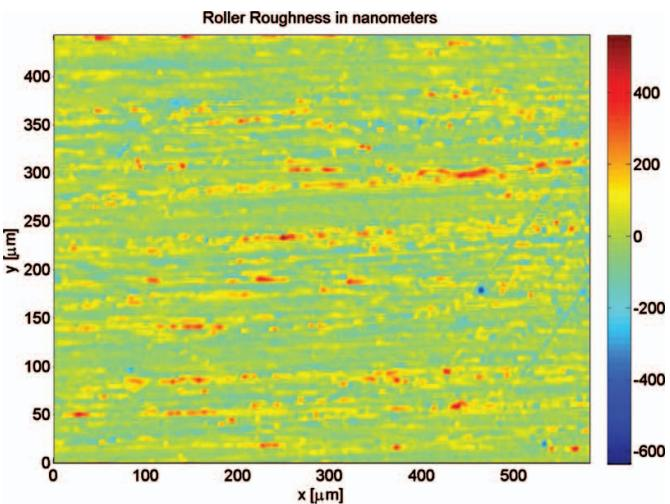  
(a) Roughened inner ring surface

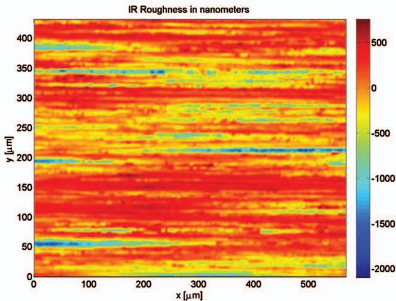  
(b) Roughened roller surface  
Fig. 13—Optical measurement samples of roughness of tested bearings NU 211 ECP with nonstandard surfaces used in the tests. Samples as used in the calculations: (a) roughened inner ring $( R _ { q } =$ 0.33 µm, $\pmb { S _ { k } } = - 1 . 1 7 ) ,$ (b) roughened roller sample $( R _ { q } = 0 . 0 7 3$ $\mu \mathbf { m } , \pmb { S } _ { k } = 1 . 2 1 )$ . (color figure available online).

## Effect of Boundary Friction

Because micropitting is a surface fatigue mechanism, it is expected that boundary friction has a major role in this phenomenon. Indeed, boundary friction (in the dry-contact patches) will increase surface tractions. In the interface between lubricated and dry-contact patches it will introduce a surface stress concentration, because the local friction force will vary considerably with lubrication condition. As an indication of its importance, a simulation was carried out for the case of 150 min (720,000 load cycles) shown in Fig. 12. Instead of considering the friction value of

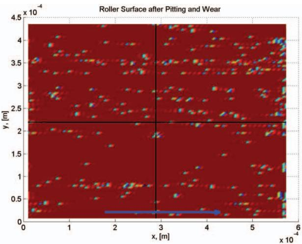  
(a) Model, $6 6 ^ { 0 } C ,$ $A _ { p } { = } 3 . 1 6$ %, $\Lambda { = } 0 . 4 4$

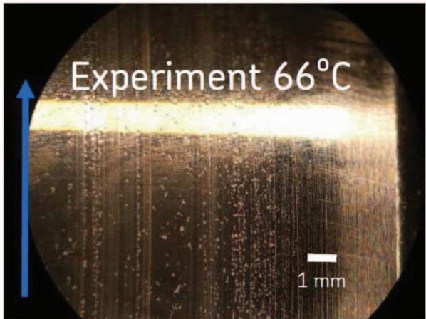  
(b) Experiment, $6 6 ^ { 0 } C ,$ 48 hrs

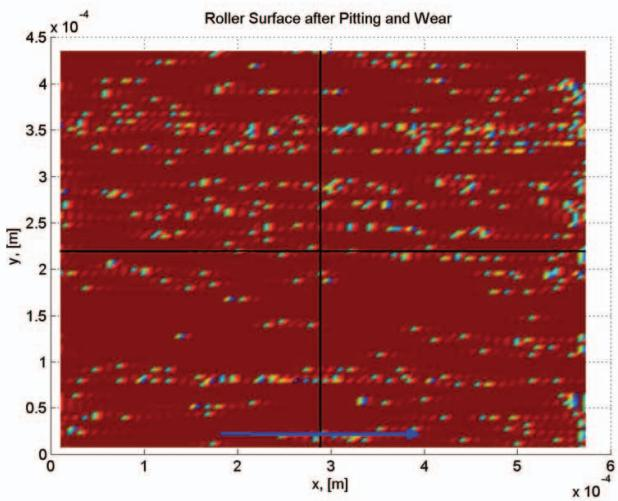

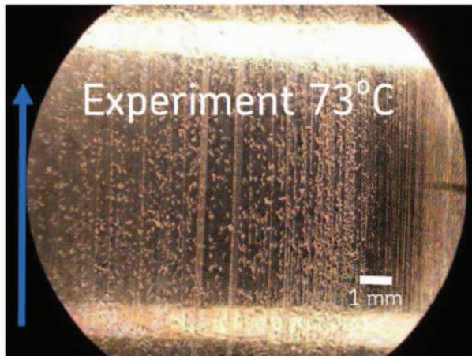  
(d) Experiment, $7 3 ^ { 0 } C ,$ 48 hrs

(c) Model, $7 3 ^ { 0 } C , A _ { p } { = } 4 . 3 3$ %, $\Lambda { = } 0 . 4 2$  
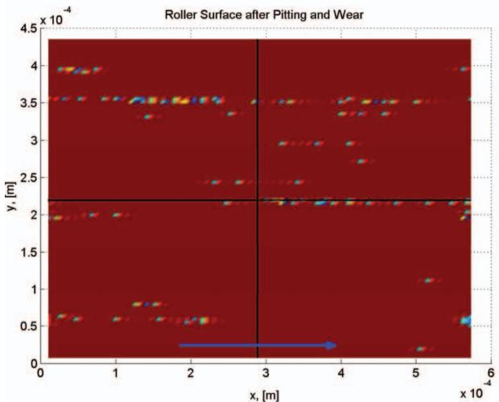  
(e) Model, $9 8 ^ { 0 } C ,$ $A _ { p } { = } 0 . 9 1$ %, $\Lambda { = } 0 . 3 3$

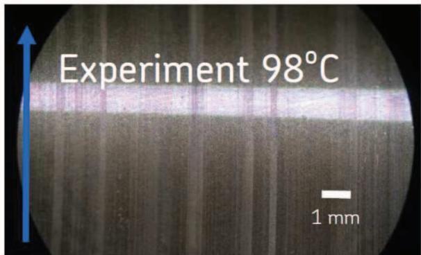  
(f) Experiment, $9 8 ^ { 0 } C ,$ 139 hrs  
Fig. 14—Comparison of model results versus experiments in full bearing tests NU 211 ECP with artificially roughened surfaces: (a) calculation 66◦C, (b) experiment 66◦C, (c) calculation 73◦C, (d) experiment 73◦C, (e) calculation 98◦C, (f) experiment 98◦C. (color figure available online).

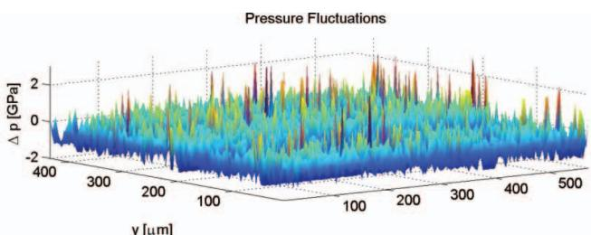

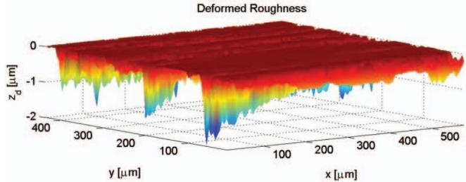  
(a) Pressures and Shape

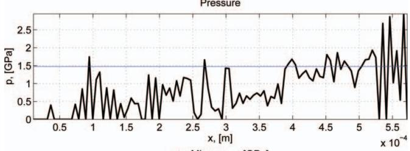

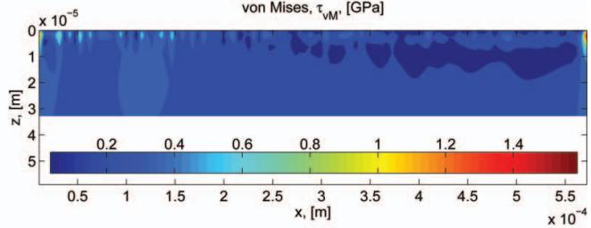  
(b) von Mises stresses  
Fig. 15—Results from the simulation for the time step where the mean load is maximum in the last wear step (test 66◦C): (a) partia lubrication pressures and shape and (b) von Mises stress in the plane x z at y 0. (color figure available online).

Table 1, a friction coefficient of $\mu _ { b l } = 0 . 1 5$ was assumed, yielding $A _ { p } = 4 . 5 6 \%$ . This is nearly two times larger than before.

## APPLICATION TO FULL-BEARING TESTS

Test on cylindrical roller bearings NU 211 ECP with roughened surfaces were carried out under radial load conditions. The bearings were lubricated with ISO VG 68 additized hydraulic fluid with some wear protection. The bearing inner ring speed was 1,500 rpm. The contact conditions used in the simulation are given in Table 2. Because the oil shows good wear resistance, a low wear coefficient was chosen for the simulations (e.g., $k _ { l u b } = 1 \times 1 0 ^ { - 1 1 } )$ ). Notice that to accelerate the test, the inner and outer ring raceways were ground only (without honing) and the rollers were honed using a rough honing process; thus, the bearings do not have standard surface roughness but roughened surfaces as shown in Fig. 13. These surface samples were used in the micropitting simulations. It can be seen that the inner ring surface is much rougher than the roller surface, and from the previous modeling, the roller is expected to develop micropitting faster than the inner ring. After the testing was complete, all rollers and rings were inspected, and some variability in the micropitting degree within the different samples was observed. However, in general, micropitting was found on the rollers within the regions close to the roller ends where there was some sliding, typically $0 . 0 1 5 \leq | S | \leq 0 . 0 2$ . The pictures presented here are the most representative ones.

The simulation was done for the case of three oil temperatures (before entering the bearing) of 66, 73, and 98◦C for 48, 48, and 136 h, respectively, which correspond to the duration of the tests. To calculate the total number of load cycles simulated on the rollers, one has to consider the radial load conditions in the bearing. With the speed of the inner ring, the roller rotates at approximately 4,760 rpm. Assuming that it is fully loaded only 0.25 of the time (radial load conditions), the rollers accumulate about 71,400 load cycles per hour. Under the simulation conditions, the size of the Hertzian contact in the rolling direction is around 275 µm, which is shorter than the roughness sample (i.e., 570 µm). Therefore, the window scale shown in Fig. 2 meant to represent large-size bearings in this case does not directly apply. Despite this, the scheme can be used, with the only disadvantage of keeping constant the mean pressure $\bar { p }$ at every time step instead of having a variable mean load along x. This could result in a slight overestimation of the damage, but as will be shown later, this may be of little importance.

The results of the simulations for all three cases compared with pictures from the tests are shown in Fig. 14. Fig. 15 shows the details in terms of pressure fluctuations, shape, and stress for the time step where the mean load is at its maximum $( \bar { p } = p _ { h } )$ and in the last wear step of the simulation. Notice that. Fig. 15a shows a slice of pressure along x and below a corresponding slice of the von Mises stress. One can observe that the depth for the highest values of von Mises stress correspond to around 3 to 4 µm, and the diameter of an individual micropit for this case is around 10 to 20 µm. These dimensions correspond well to the scanning electron micrograph (SEM) images taken from the experiments, shown in Fig. 16.

Comparison of the model and experiments shows good agreement for the case of $6 6 ^ { \circ } \mathrm { C } ;$ that is, comparing Fig. 14a and 14b. Notice that the scale of the photograph for 1 mm length is indicated; thus, the simulation shows only around 0.6 mm. From the comparison, one can see that in the experiment there are zones of higher micropitting density. For the case of $7 3 ^ { \circ } \mathrm { C } ,$ the agreement is again good, because Fig. 14c and 14d show a substantial increase in micropitting. Despite the fact that in the experiments it was impossible to ensure that all of the marks were indeed micropits, it could very well be that some of the marks were debris indentations, even though the oil was changed frequently during the experiments. Finally, Fig. 14e shows substantial wear due to the low $\Lambda$ value and therefore it also shows low micropitting. The same can be seen in the experiment shown in Fig. 14f. The longer duration of this test in combination with poor lubrication conditions seemed to favor wear over micropitting.

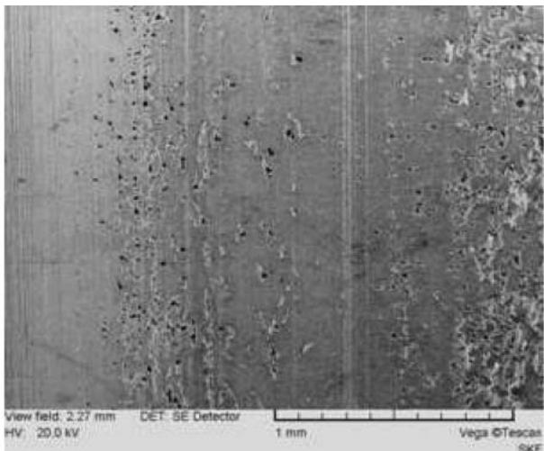  
(a) Pitting, lower resolution

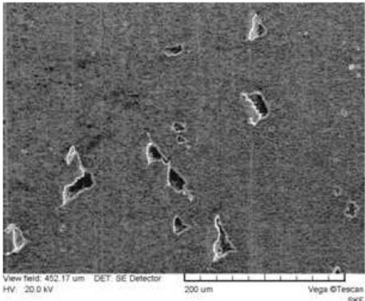  
(b) Pitting, higher resolution

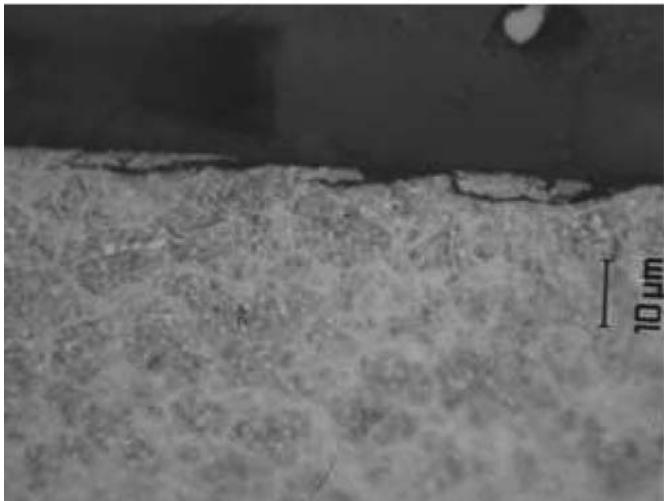  
(c) Transverse cut  
Fig. 16—SEM microphotographs showing the size and depth of typical micropits from the current experiment.

## DISCUSSION AND CONCLUSIONS

A model based on the interaction between surface fatigue and mild wear has been developed to predict micropitting damage in heavily loaded lubricated rolling–sliding contacts. The model first evaluates the lubrication conditions by considering a deterministic sample of the contact topography. From this, stresses and fatigue damage accumulation are calculated using the Dang Van fatigue criterion, and whenever the material damage limit is reached a pit will be generated. Mild wear is calculated by assuming a modified Archard’s law, which affects the topography heights and in turn the local loading conditions of the stress cycling. The lubrication film distribution in the contact is also recalculated at each overrolling, and the fatigue damage is accumulated using the Palmgren-Miner’s summation rule, until the critical number of cycles for micropitting formation is achieved. Despite the complexity of the model, typical calculation time on a desktop computer is less than one hour. The model was verified with experiments carried out under laboratory conditions on a micropitting tester and also against full rolling bearing tests with artificially roughened surfaces.

Based on the theoretical and experimental results, the following conclusions can be drawn:

 For proper modeling of the micropitting phenomenon, it is essential to consider the interaction between the competing failure mechanisms of surface fatigue and mild wear.

 Wear interacts with micropitting throughout the load history, and therefore it can significantly affect the evolution of micropitting formation; that is, the micropitting risk is reduced for an increased wear rate of the contact.

 From the stress distributions and pressures, it follows that indeed micropitting is a surface fatigue mechanism that depends on the lubrication conditions and roughness of the contacting surfaces.

The presence of slip and the associated boundary friction shear stress are required for the generation of micropitting It appears that in rolling bearing conditions slip within 0.5 and 2% provides the highest risk of micropitting. Higher levels of sliding will not necessarily increase the micropitting risk due to two aspects: (1) the increased wear due to the higher sliding and (2) the constant value of the boundary friction coefficient for increased sliding.

 An additional finding from the model and the experimental results is that transverse roughness appears to be more prone to micropitting risk than longitudinal surface finish.

 In contacts where one of the surfaces is considerably rougher that the other, micropitting will appear faster, and be more severe, on the smoother surface. This is due to the dominant amplitudes in the stress cycles imposed by the rougher surface upon the smooth one, almost independent of their relative velocity (frequency) but in the presence of some sliding.

 Friction (especially boundary-contact friction) has a large contribution in the generation of micropitting. Chemical additives able to affect the boundary friction coefficient and/or wear rate of the surface can have a significant effect in the micropitting risk of the rolling–sliding contact.

## ACKNOWLEDGEMENTS

The authors thank A. de Vries, Director SKF Group Product Development, for his kind permission to publish this article. The authors also thank Dr. K. Stadler (SKF Technology Centre Wind) for providing the authors with the full-bearing test results.

## REFERENCES

(1) ISO Standard 15243. (2004), Rolling Bearings—Damage and Failures—Terms, Characteristics and Causes.

(2) Way, S. (1935), “Pitting Due to Rolling Contact,” Journal ofApplied Mechanics, 57, pp A49-A58.

(3) Dawson, P. H. (1962), “Effect of Metallic Contact on the Pitting of Lubri cated Rolling Surfaces,” Journal of Mechanical Engineering Science, 4(1), pp 16-21.

(4) Dawson, P. H. (1964), “The Effect of Metallic Contact and Sliding on the Shape of the S-N Curve for Pitting Fatigue,” Institution ofMechanical En gineers, Fatigue in Rolling Contact, paper 4, pp 41-45.

(5) Dawson, P. H. (1965-1966), “Further Experiments on the Effect of Metal lic Contact on the Pitting of Lubricated Rolling Surfaces,” Proceedings of the Institution of Mechanical Engineers, 180(Pt 3B), pp 95-112.

(6) Olver, A.V. (2005), “The Mechanism of Rolling Contact Fatigue—An Update,” Proceedings ofthe Institution ofMechanical Engineers – Part J: Jour nal of Engineering Tribology, 219, pp 313-330.

(7) Oila, A., and Bull, S. J. (2005), “Assessment of the Factors Influencing Micropitting in Rolling/Sliding Contacts,” Wear, 258, pp 1510-1524.

(8) Brandao, J. A., Seabra, J. H. O., and Castro, J. (2010), “Surface Initiated ˜ Tooth Flank Damage Part I: Numerical Model,” Wear, 268, pp 1-12.

(9) Brandao, J. A., Seabra, J. H. O., and Castro, J. (2010), “Surface Initiated ˜ Tooth Flank Damage Part II: Prediction of Micropitting Initiation and Mass Loss,” Wear, 268, pp 13-22.

(10) Laine, E., and Olver, A. V. (2007), “The Effect of Anti-Wear Additives on´ Fatigue Damage,” 62nd STLE Annual Meeting, May 6–10, Philadelphia, PA, Extended abstract.

(11) Laine, E., Olver, A. V., and Beveridge, T. A. (2008), “Effect of Lubricants ´ on Micropitting and Wear,” Tribology International, 41, pp 1049-1055.

(12) Laine, E., Olver, A. V., Lekstrom, M. F., Shollock, A., Beveridge, T. A.,´ and Hua, D. Y. (2009), “The Effect of a Friction Modifier Additive on Micropitting,” Tribology Transactions, 52, pp 526-533.

(13) Dang Van, K., Griveau, B., and Message, O. (1989), “On a New Multiaxial Fatigue Limit Criterion: Theory and Application,” Biaxial and Multiaxial Fatigue, Brown, M. and Miller, K. (Eds.), Mechanical Engineering Publi cations: London, pp 479-498.

(14) Dang Van, K. (1993), “Macro-Micro Approach in High-Cycle Multiaxial Fatigue,” Advances in Multiaxial Fatigue, ASTM STP 1191, McDowell, D. L. and Ellis, R. (Eds.), Philadelphia, pp 120-130.

(15) Venner, C. H., Couhier, F., Lubrecht, A. A., and Greenwood, J. A. (1997), “Amplitude Reduction of Waviness in Transient EHL Line Contacts,” Proceedings of the 1996 Leeds-Lyon Symposium on Tribology, Elsevier Tribology Series 32, Dowson, D. (Eds.), pp 103-112.

(16) Morales-Espejel, G. E., Lugt, P. M., van Kuilenburg, J., and Tripp, J. H. (2003), “Effects of Surface Micro-Geometry on the Pressures and Internal Stresses of Pure Rolling EHL Contacts,” Tribology Transactions, 46, pp 260-272.

(17) Archard, J. F. (1953), “Contact and Rubbing of Flat Surface,” Journal of Applied Physics, 24(8), pp 981-988.

(18) Wohler, A. (1870), “¨ Uber die Festigkeitsversuche mit Eisen und Stahl,”¨ (On the Strength of Iron and Steel) Zeitschrift fur Bauwesen ¨ , 20, pp 73- 106.

(19) Shimizu, S., Tsuchiya, K., and Tosha, K. (2009), “Probabilistic Stress-Life (P-S-N) Study on Bearing Steel Using Alternating Torsion Life Test,” Tribology Transactions, 52, pp 807-816.

(20) Palmgren, A. G. (1924), “Die Lebensdaur von Kugellagern [Life Length of Roller Bearings],” Zeitschrift des Vereines Deutscher Ingenieure (VDI Zeitschrift), 68(14), pp 339-341. (In German)

(21) Morales-Espejel, G. E., Wemekamp, A. W., and Felix-Qui´ nonez, A.˜ (2010), “Micro-Geometry Effects on the Sliding Friction Transition in

Elastohydrodynamic Lubrication,” Proceedings of the Institution of Mechanical Engineers – Part J: Journal of Engineering Tribology, 224, pp 621- 637.

(22) Stanley, H. M., and Kato, T. (1997), “A FFT-Based Method for Rough Surface Contact,” Journal of Tribology, 119, pp 481-485.

(23) Johnson, K. L., Greenwood, J. A., and Poon, S. Y. (1972), “A Simple Theory of Asperity Contact in Elastohydrodynamic Lubrication,” Wear, 19, pp 91-108.

(24) Kalker, J. J. (1977), “Variational Principles in Contact Elastostatics,” Journal of the Institution of Mathematics and Its Applications, 20, pp 199- 219.

(25) Tian, X., and Bushman, B. (1996), “A Numerical Three-Dimensional Model for the Contact of Rough Surfaces by Variational Principle,” Journal of Tribology, 118, pp 33-42.

(26) Johnson, K. L., Greenwood, J. A., and Higginson, J. G. (1985), “The Contact of Elastic Regular Wavy Surfaces,” International Journal of Mechanical Sciences, 27(6), pp 386-396.

(27) Hooke, C. J. (2006), “Roughness in Rolling–Sliding Elastohydrodynamic Lubricated Contacts,” Proceedings of the Institution of Mechanical Engineers – Part J: Journal of Engineering Tribology, 220, pp 259– 271.

(28) Hooke, C. J., Li, K. Y., and Morales-Espejel, G. E. (2007), “Rapid Calculation of the Pressures and Clearances in Rough, Rolling–Sliding Elastohydrodynamically Lubricated Contacts. Part 1: Low-Amplitude, Sinusoidal Roughness,” Proceedings ofthe Institution ofMechanical Engineers – Part C: Journal ofMechanical Engineering Science, 221, pp 535-550.

(29) Greenwood, J. A., and Morales-Espejel, G. E. (1994), :The Behaviour of Transverse Roughness in EHL Contacts,” Proceedings of the Institution of Mechanical Engineers – Part J: Journal of Engineering Tribology, 208, pp 121-132.

(30) Ehret, P., Dowson, D., and Taylor, C. M. (1998), “On Lubricant Transport Conditions in Elastohydrodynamic Conjunctions,” Proceedings ofthe Royal Society ofLondon Series A, 454, pp 763-787.

(31) Venner, C. H., and Lubrecht, A. A. (2000), ultigrid Techniques: A Fast and Efficient Method for the Numerical Simulation of Elastohydrodynamically Lubricated Point Contact Problems,” Proceedings ofthe Institution ofMechanical Engineers – Part J: Journal of Engineering Tribology, 214, pp 43– 62.

(32) Dang Van, K., and Maitournam, M. H. (2003), “Rolling Contact in Railways: Modelling, Simulation and Damage Prediction,” Fatigue and Fracture ofEngineering Materials and Structures, 26, pp 939-948.

(33) Desimone, H., Bernasconi, A., and Beretta, S. (2006), “On the Application of Dang Van Criterion to Rolling Contact Fatigue,” Wear, 260, pp 567– 572.

(34) Bernasconi, A., Filippini, M., Foletti, S., and Vaudo, D. (2006), “Multiaxial Fatigue of a Railway Wheel Steel under Non-Proportional Loading,” International Journal of Fatigue, 28, pp 663-672.

(35) Fouvry, S., Kapsa, P., and Vincent, L. (2000), “Fretting-Wear and Fretting-Fatigue: Relation Through a Mapping Concept,” Fretting-Fatigue: Current Technology and Practices, ASTM STP 1367, Hoeppner, D. H. Chandrasekaran, V., and Elliot, C. B. (Eds.), American Society for Testing and Materials: West Conshohocken, PA, pp 49-64.

(36) Baietto, M. C., Pierres, E., and Gravouil, A. (2010), “A Multi-Model X-FEM Strategy Dedicated to Frictional Crack Growth under Cyclic Fretting Fatigue Loadings,” International Journal of Solids and Structures, 47, pp 1405-1423.

(37) Williams, J. A. (1999), “Wear Modelling: Analytical, Computational and Mapping: A Continuum Mechanics Approach,” Wear, 225–227, pp 1-17.

(38) Kim, T. H., and Olver, A. V. (1998), “Stress History in Rolling–Sliding Contact of Rough Surfaces,” Tribology International, 12, pp 727-736.

(39) Webster, M., and Norbart, C. (1995), “An Experimental Investigation on Micro-Pitting Using a Roll Disk Machine,” Tribology Transactions, 38, pp 883-893.

(40) Ueda, T., Ueda, K., and Mitamura, N. (2005), “Unique Fatigue Failure of Spherical Roller Bearings and Life-Enhancing Measures,” Proceedings of the World Tribology Congress, Washington, DC, September 12-16, 2005.

(41) Kotzalas, M. N., and Doll, G. (2010), “Tribological Advancements for Reliabale Wind Turbine Performance,” Philosophical Transactions of the Royal Society A, 368, pp 4829-4850.
