# Roman Teutsch

e-mail: megt@mv.uni-kl.de

Research Assistant

The University of Kaiserslautern,

Institute of Machine Elements, Gears and

Transmissions,

Gottlieb-Daimler-Strasse,

67663 Kaiserslautern, Germany

# Bernd Sauer

e-mail: megt@mv.uni-kl.de

Professor

The University of Kaiserslautern,

Institute of Machine Elements, Gears and

Transmissions,

Gottlieb-Daimler-Strasse,

67663 Kaiserslautern, Germany

# An Alternative Slicing Technique to Consider Pressure Concentrations in Non-Hertzian Line Contacts

A new, fast method is presented for the analysis of roller-race contact in roller bearings. Based on a theoretical and implicit load-deflection relationship, an improved slicing technique is developed which accounts for a more accurate representation of the pressure distribution along the line of contact. For validation, the method is compared to literature data and results obtained by FEM analysis. In the course of this, roller profiling and misalignment are considered. Due to its fastness and accuracy, the method has its particular advantages when many contacts have to be evaluated several times, e.g., in static load distribution calculations and dynamic simulations. [DOI: 10.1115/1.1739244]

# Introduction

After Heinrich Hertz had published his work "On the Contact of Elastic Solids" [1], contact problems were only divided in Hertzian and non-Hertzian cases. In the point contact case, Hertz gave an analytical solution for the load-deflection relationship. In the line contact case, no such relationship was proposed by him. Modern rolling bearing calculations, however, require that the compression of the rolling elements and raceways can be calculated from known loading conditions and vice versa.

Over the years, many authors have addressed non-Hertzian contact problems involving cylindrically shaped bodies of finite length. Half-space theory, experiments, and more recently, numerical schemes have been applied to evaluate load, deflection, pressure and stresses arising in a single contact. Only few authors, however, have developed explicit load-deflection relationships that can be used without time-consuming iteration.

In order to consider misalignment in line contact problems, so-called slicing techniques have frequently been used. The roller is sliced up into several laminae, each of which contributes to the roller stiffness according to its length. Each slice is usually treated separately, having no effect on the contact load or deflection of others. Therefore, pressure concentrations cannot be taken into account. If a more accurate pressure distribution is required, time-consuming calculations in a more involved single contact model have to be performed.

# Non-Hertzian Line Contact

Theoretical and Experimental Studies. From the work of Hertz, relationships are available to calculate the maximum contact pressure  $p_0$  and the semi-width  $b$  of the contact area in a line contact [2]

$$
\begin{array}{l} b = \sqrt {\frac {8 \cdot (1 - \nu^ {2}) \cdot Q}{\pi \cdot E \cdot \Sigma \rho \cdot L}} \\ p _ {0} = \frac {2}{\pi} \cdot \frac {Q}{b \cdot L} \\ \sum \rho = \frac {1}{R _ {1}} \pm \frac {1}{R _ {2}} \tag {1} \\ \end{array}
$$

In the latter expression the positive sign is used for convex-convex, the negative sign is used for convex-concave contacts, respectively. No exact and explicit relationship is available for expressing the load  $Q$  as a function of the deflection  $\delta$ . Many authors describe, however, how the deflection may be calculated from known loading conditions. At least some give approximations for calculating  $Q$  from a known deflection  $\delta$ , often taken as the theoretical interpenetration of the rigid bodies.

In 1939, Lundberg [3] published an analytical solution for calculating the deflection of two cylinders in contact. He assumed that their cylindrical shapes merge into half-spaces outside the contact region and that the contact pressure is constant along the cylinder's axes. To hold the latter assumption, he found that the contours of the cylinders need to follow a certain profile to avoid pressure concentrations towards the ends. The relationship he gave for the approach of the cylinder axes under a certain load was based on this profile.

In 1940, Kowalsky considered the deformation of a cylinder of finite length loaded from two sides by an elliptically distributed pressure [4].

Earlier than Kowalsky, Dinnik had found a similar expression but for a parabolic distribution of pressure along the width of contact [4]. His proposal is also given in [5] for the calculation of the deflection in a cylindrical contact.

In 1959, Palmgren [6] published his book, "Ball and Roller Bearing Engineering." From experiments with an un-profiled roller compressed between two plates, he found a simple expression relating the deflection  $\delta$  to the load  $Q$ . He mentioned that the deflection was not dependent on the roller diameter and that his results could be used with only small error for the load calculation in roller bearings.

In 1961, Kunert [7] proved Lundberg's equation when he was concerned with the stress distribution in a half-space loaded by an elliptically distributed pressure over a rectangular contact area. He extended the theory to the case of a cylinder contacting a plane half-space. He stated that an evenly distributed pressure along the cylinder axis could not be achieved under these conditions. His corrected roller profile took stress concentrations below the surface into account. In the end he gave an approximate expression for the load-deflection relationship in a line contact. Since a unique optimum profile is assumed for every loading condition, it is, however, of restricted practical use.

In 2001, Houpert [8] compared expressions due to Palmgren, Kunert, and Zantopolus with equations given by Tripp in 1985, the best reference from his point of view. After introducing the

Table 1 Deflection-load relationships for inner and outer-race-to-roller-contact  

<table><tr><td>Lundberg [3]</td><td>δi=δo=Q/π·2/L·(1-ν12/E1+1-ν22/E2)·(1.8864+ln L/2·b)</td><td>(2)</td></tr><tr><td rowspan="2">Dinnik [4]</td><td>δi=(2·Q)/π·L)·[(1-ν12)/E1(ln 2·R1/b+1/3)+(1-ν22)/E2(ln 2·R2/b+1/3)]</td><td rowspan="2">(3)</td></tr><tr><td>δo=(2·Q)/π·L)·[(1-ν12)/E1(ln 2·R1/b+1/3)+(1-ν22)/E2(ln t/b+1/3)]</td></tr><tr><td rowspan="2">Kowalsky [4]</td><td>δi=(2·Q)/π·L)·[(1-ν12)/E1(ln 2·R1/b+0.407)+(1-ν22)/E2(ln 2·R2/b+0.407)]</td><td rowspan="2">(4)</td></tr><tr><td>δo=(2·Q)/π·L)·[(1-ν12)/E1(ln 2·R1/b+0.407)+(1-ν22)/E2(ln t/b+0.407)]</td></tr><tr><td>Palmgren [6]</td><td>δi=δo=3.84·10-5·Q0.9/L0.8</td><td>(5)</td></tr><tr><td>Kunert [7]</td><td>δi=δo=4.05·10-5·Q0.925/L0.85</td><td>(6)</td></tr><tr><td rowspan="3">Tripp [8]</td><td>δi=(2·Q)/π·L)·[(1-ν12)/E1(ln 4·R1/b-1/2)+(1-ν22)/E2(ln 4·R2/b-1/2)]</td><td rowspan="3">(7)</td></tr><tr><td>δo=(2·Q)/π·L)·[(1-ν12)/E1(ln 4·R1/b-1/2)+(1-ν22)/E2(ln 2·t/2·(1-ν2))]</td></tr><tr><td>δi=[Q·(1-ν2)/0.2723·E·L·d0.074]1/1.074</td></tr><tr><td>Houpert [8]</td><td>δo=[Q·(1-ν2)/0.27835·E·L·(t/1+D/dm)0.078]1/1.078</td><td>(8)</td></tr></table>

outer-race-plus-housing-section-thickness as the appropriate depth of reference at which the deformation can be assumed to be zero, Houpert made approximate curve fits to the relationships given by Tripp. According to Houpert, his two simple equations are valid for roller-race type contacts in roller bearings.

Table 1 contains the various deflection-load relationships described above. These were applied to a case study taken from reference [8], the contact of an un-profiled roller with either inner or outer race of a cylindrical roller bearing. Figure 1 shows the corresponding sketch to the problem. Figures 2 and 3 compare the expressions due to different authors.

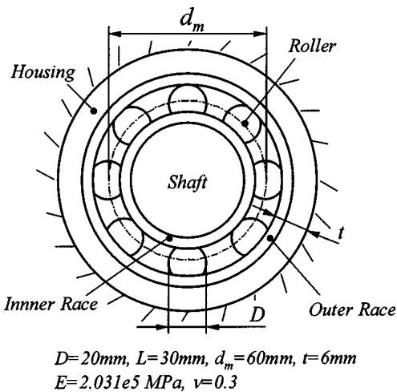  
Fig. 1 Sketch of a roller bearing case study taken from [8]

In case of the inner race contact, most of the load-deflection relationships compare fairly well among each other. Only Lundberg's and Kunert's results deviate noticeably. Since both authors assume an optimum roller profile, this is not surprising though.

In case of the outer race contact, Palmgren's results, too, deviate greatly from the ones obtained using the expressions of others. The load-deflection relationships due to Tripp, Dinnik, and Kowalsky are nearly identical. Houpert's curve fit deviates slightly in the highly loaded region.

It is important to note, that only the equations given by Palmgren, Kunert, and Houpert can be explicitly solved for  $Q$  from a known deflection  $\delta$ . In the equations due to Lundberg, Tripp, Dinnik, and Kowalsky, the deflection is dependent on the load  $Q$  and the semi-width  $b$ , which, according to Eqs. (1), also depends on  $Q$ . Consequently, the latter expressions can only be

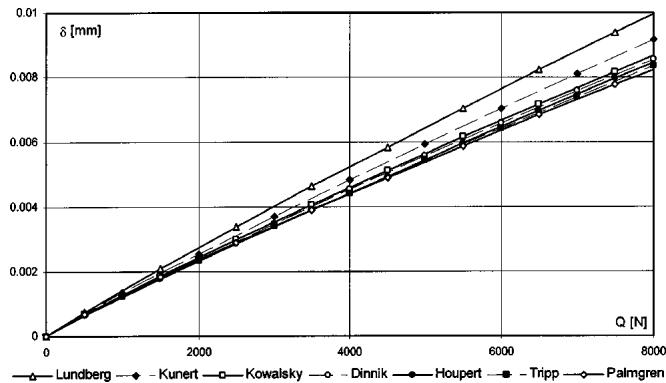  
Fig. 2 Inner-race-to-roller-contact, comparison of  $\delta = f(Q)$

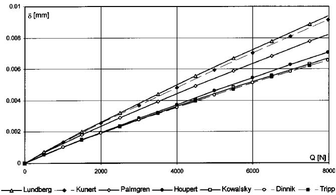  
Fig. 3 Outer-race-to-roller-contact, comparison of  $\delta = f(\mathbf{Q})$

solved for  $Q$  by time-consuming iterative techniques; a great disadvantage as far as the analysis of rolling bearings is concerned.

It is also important to note, that Palmgren's and Kunert's expressions are independent from the roller radius. The implicit equations of Tripp, Dinnik, and Kowalsky, however, show a weak dependency of the load-deflection relationship on the curvature of the contacting bodies. Only the curve-fit due to Houpert incorporates such geometrically based adjustment terms and is explicitly solvable for  $Q$  without costly iteration at the same time.

Numerical Approaches. As for some of the theories mentioned above, Boussinesq's half-space theory has frequently been adopted in numerical approaches. In general, the condition of contact reads as follows:

$$
\delta_ {1} + \delta_ {2} + f _ {1} + f _ {2} - \alpha \geqslant 0 \tag {9}
$$

where  $\delta_{1}$  and  $\delta_{2}$  are the elastic deformations and  $f_{1}$  and  $f_{2}$  are functions describing the geometry, i.e., the initial gap to an assumed reference plane for body 1 and 2, respectively.  $\alpha$  is taken as the rigid body approach of the two bodies. To satisfy the contact condition, Eq. (9) must be equal to zero within the contact area and greater than zero outside. The contact pressure must be zero outside the contact region and positive within. With reference to aforementioned half-space theory, the elastic deformations can be expressed by the following equation:

$$
\delta_ {1} + \delta_ {2} = \left(\frac {1 - v _ {1} ^ {2}}{\pi \cdot E _ {1}} + \frac {1 - v _ {2} ^ {2}}{\pi \cdot E _ {2}}\right) \cdot \int_ {\Omega} \int \frac {p \left(x ^ {\prime} , y ^ {\prime}\right) \cdot d x ^ {\prime} \cdot d y ^ {\prime}}{\sqrt {\left(x - x ^ {\prime}\right) ^ {2} + \left(y - y ^ {\prime}\right) ^ {2}}} \tag {10}
$$

By subdividing the contact area in a number of discrete cells, the integral in (10) can be approximated by the sum of the pressure acting on each cell times the cell area, divided by the distance of one cell reference point to another. The resulting set of equations can be solved by some numerical means.

In 1971, Conry and Seirig [10] used a simplex algorithm to solve the problem. Instead of pressures, they adopted forces acting at discrete points within the contact area.

When solving the problem iteratively, Singh and Paul [11] (1974) encountered that the solutions accuracy was very much dependent on the discretization. The application of a finer grid with smaller cells partly produced physically meaningless results. In an effort of canceling out random errors, they applied an averaging technique, which they called the Method of Redundant Field Points. They also used a functional approach in which they tried to solve the governing set of equations in an average sense, i.e., in a way that large deviations in the pressure of neighboring cells were kept small.

In 1977, Reusner [12] extended the half-space theory to the case where the contacting bodies were both limited in the longitudinal direction. By mirroring the contact pressure about the end planes of the contacting bodies, he managed to cancel out shear

stresses in these planes; stresses which are not present in a real contact. He subdivided the contact area in strips along the axis of revolution and applied an iterative technique to numerically solve the problem.

Nayak and Johnson [13] presented a paper in 1978, in which they assumed a piecewise linear pressure distribution over a number of strips subdividing a slender area of contact. The integral equations were solved numerically.

In 1980, Hartnett [14] partly integrated Eq. (10) by assuming a constant pressure distribution over each rectangular cell. He improved the numerical scheme by first solving for cells combined to strips along one axis and after solving for the strips along the other. Arranging the strips perpendicular to the major axis of the contact area was found to be the more efficient method, requiring only half the iterations than the other alternative.

Harris [15] (1984) described a slicing technique to account for misalignment in cylindrical contacts. Each slice of the roller was given a linearized fraction of the total roller stiffness calculated from Palmgren's equation [6].

De Mul, Kalker, and Fredriksson [9] reported an improved half-space model in 1986. In this, they added correction terms due to Reusner [12] for the finite length and depth of the contacting bodies. Their results compared well to their own FEM evidence and to data published by others.

A common advantage of all reported half-space models is their fairly high accuracy and the fastness of the solution process when compared to analogous FE models. Compared to simpler models, similar to the one proposed by Harris [15], however, computation time is still excessive. Therefore, the use of some slicing technique can be advantageous when many contacts have to be solved simultaneously, even though the solution's accuracy may be reduced greatly. For that reason, the slicing method is improved in this paper to account for a more exact load and pressure distribution along the line of contact.

# Alternative Slicing Technique (AST)

Deflection-Load Relationship. As shown above, the equations given by Tripp, Kowalsky, and Dinnik are nearly equivalent within a wide range. From all compared relationships, their approaches are considered best. The implicit nature of their expressions, however, is disadvantageous.

In order to calculate the load from a given deflection without the need of time-consuming iteration, simpler deflection-load relationships are required. Since Houpert's curve-fits deviate slightly from the original, new curves were fitted in a similar way as described by him in [8]. For this, Dinnik's instead of Tripp's equation was taken as a basis, leading to the following deflection-load relationships for inner and outer race, respectively:

$$
\delta_ {i} = 3. 1 7 \cdot \left(\frac {\mathrm {d} _ {\mathrm {m}}}{2}\right) ^ {0. 0 8} \cdot \left(\frac {Q \cdot \left(1 - v ^ {2}\right)}{E \cdot L}\right) ^ {0. 9 2} \tag {11}
$$

$$
\delta_ {o} = 2. 6 6 \cdot \left(\frac {\mathrm {t}}{1 + D / d _ {m}}\right) ^ {0. 0 9} \cdot \left(\frac {Q \cdot (1 - v ^ {2})}{E \cdot L}\right) ^ {0. 9 1}
$$

In case of a roller contacting a flat plate, the latter expression in (11) simplifies to

$$
\delta_ {r p} = 2. 6 6 \cdot (t) ^ {0. 0 9} \cdot \left(\frac {Q \cdot \left(1 - v ^ {2}\right)}{E \cdot L}\right) ^ {0. 9 1} \tag {12}
$$

It should be noted that this equation is independent of the roller diameter, a fact that confirms Palmgren's results. It is, however, still dependent on the thickness of the plate, which Palmgren did not consider.

In order to validate the new relationship, an FE model of an un-profiled roller contacting a flat plate was set up. A sketch of the problem is presented in Fig. 4. Due to symmetry, only  $1/8$  of the roller and  $1/4$  of the plate had to be modeled. All degrees of freedom (DOF) at nodes located on the lower surface of the plate

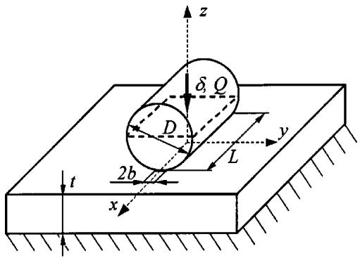  
Fig. 4 Sketch of roller-plate contact model

were fixed to ground. For the roller diameter and length, values of  $D = L = 10 \mathrm{~mm}$  were chosen. The materials of plate and roller were assumed to be the same, having an elastic modulus and a Poisson's ratio of  $E = 2.08 \cdot 10^{5} \mathrm{MPa}$  and  $\nu = 0.3$ , respectively. The ratio of plate-thickness-to-roller-diameter was varied in the range of  $t / D = 4 \ldots 0.5$ . The rigid body approach, equal to the elastic deformation in the model was kept constant at  $\alpha = \delta = 0.01 \mathrm{~mm}$ , introduced at all nodes in the mid-plane of the roller.

From the load calculated with the FE model for different plate thicknesses, the deflections from the curve fit to Dinnik's formula and from some other relations were determined. The resulting values were then compared to the constant elastic deflection, which had served before as an input to the FE model.

Figure 5 indicates that the deflection calculated from Eq. (12) is closest to the FE results, with a maximum relative error of less than 1.5 percent.

Deflections calculated from Kowalsky's equation are qualitatively similar to the ones due to Dinnik and Tripp. The virtually identical values calculated from their expressions, however, are closer to the results from the FE model. The deviation of Houpert's curve-fitted equation from the FE results is more pronounced at smaller plate-thickness-to-roller-diameter-ratios.

Influence Coefficient Matrix. In our alternative model, the roller is sliced up into  $n$  slices of equal length  $l$ . For each slice  $j$ , Eqs. (11) can be written as

$$
\delta_ {i, j} ^ {1 / 0. 9 2} = \frac {c _ {i} ^ {1 / 0 . 9 2}}{l} \cdot q _ {j} \tag {13}
$$

$$
\delta_ {o, j} ^ {1 / 0. 9 1} = \frac {c _ {0} ^ {1 / 0 . 9 1}}{l} \cdot q _ {j}
$$

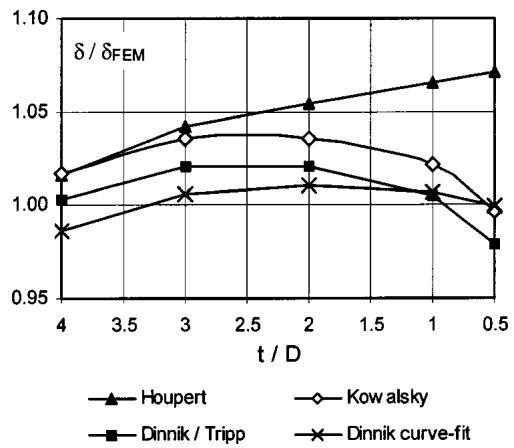  
Fig. 5 Comparison of deflection-load relationships with FEM data

in which

$$
c _ {i} = 3. 1 7 \cdot \left(\frac {\mathrm {d} _ {\mathrm {m}}}{2}\right) ^ {0. 0 8} \cdot \left(\frac {(1 - \nu^ {2})}{E}\right) ^ {0. 9 2} \tag {14}
$$

$$
c _ {o} = 2. 6 6 \cdot \left(\frac {\mathrm {t}}{1 + D / d _ {m}}\right) ^ {0. 0 9} \cdot \left(\frac {(1 - \nu^ {2})}{E}\right) ^ {0. 9 1}
$$

and

$$
l = \frac {L}{n} \tag {15}
$$

The expressions

$$
\frac {c _ {i} ^ {1 / 0 . 9 2}}{l} = s _ {i} \tag {16}
$$

$$
\frac {c _ {0} ^ {1 / 0 . 9 1}}{l} = s _ {o}
$$

are the elastic compliances associated with each slice in contact with either inner or outer race.

So far, we have followed the common process applied in simpler slicing techniques, where all slices are treated independently. Making a similar assumption as in the half-space theory, however, a force at slice  $j$  also contributes to the deformation in a distant slice  $k$ . For each slice, different weighting functions can be defined to account for this influence. The results are two systems of linear equations for inner and outer race, respectively, which can be written in matrix form as follows:

$$
\left[ S _ {w} \right] _ {i} \cdot \{q \} _ {i} = \{\Delta \} _ {i} \tag {17}
$$

$$
\left[ S _ {w} \right] _ {o} \cdot \{q \} _ {o} = \{\Delta \} _ {o}
$$

In each of them,  $[S_w]$  is the matrix of weighted influence coefficients, normalized by the mean value of all weighting functions:

$$
\left[ S _ {w} \right] = \frac {n}{\sum_ {j , k} w _ {j , k}} \left[ \begin{array}{c c c} s \cdot w _ {j, k} & \dots & s \cdot w _ {j, n} \\ \vdots & \ddots & \vdots \\ s \cdot w _ {n, k} & \dots & s \cdot w _ {n, n} \end{array} \right] \quad \text {f o r} j = 1 \dots n,
$$

$$
k = 1 \dots n \tag {18}
$$

Note that the influence coefficient matrix is symmetric, meaning that

$$
w _ {j, k} = w _ {k, j} \tag {19}
$$

$\{\Delta\}$  is the vector of deflections measured for each slice. The deflection is taken as the theoretical interpenetration of the rigid contact partners

$$
\{\Delta \} = \left\{ \begin{array}{c} \delta_ {j} ^ {1 / e x} \\ \vdots \\ \delta_ {n} ^ {1 / e x} \end{array} \right\}, \quad \text {f o r} j = 1 \dots n \tag {20}
$$

where  $ex = 0.92$  for inner and  $ex = 0.91$  for outer race contact, respectively.

$\{q\}$  is the vector of unknown forces

$$
\{q \} = \left\{ \begin{array}{l} q _ {j} \\ \vdots \\ q _ {n} \end{array} \right\}, \quad \text {f o r} j = 1 \dots n \tag {21}
$$

Singh and Paul [11] suggested, that to a first approximation, the influence of a unit pressure at one cell of their model on the deflection of a distant cell decreases by  $1 / r$ , where  $r$  is taken as the distance between the two cell reference points. They also mentioned, that a better approximation involves considerable computational effort but does not significantly improve solution accuracy. Taking this idea, the influence coefficients might be calculated from the following expression:

$$
w _ {j, k} = \left(\frac {1}{r _ {j , k}}\right) ^ {1 / e x} \quad \text {f o r} j \neq k \tag {22}
$$

where  $r_{j,k}$  is the distance between slice  $j$  and slice  $k$  with respect to respective mid-planes. Influence coefficients for cases where  $j = k$  are approximated by the following expression, which might be interpreted as the influence of two half slices on the mid-plane of the original slice:

$$
w _ {j, k} = \left(\frac {4}{l}\right) ^ {1 / e x} \quad \text {f o r} j = k \tag {23}
$$

The sets of linear equations may be solved by Gaussian elimination or other standard numerical means. Note that iterations are only necessary if one slice is shifted out of contact by the action of forces in neighboring slices. Misalignment and profiling of rollers and/or raceways are taken into account by a different initial interpenetration calculated for each slice.

# Discussion of Results

Comparison With FEM. Figure 6 shows a comparison of total contact force between our alternative slicing technique and aforementioned FE model for a rigid body approach of  $\alpha = \delta = 0.01\mathrm{mm}$  and  $t / D = 1$ . The no. of slices used for the AST approach is varied from 10 to 1000.

It can be observed that the contact forces calculated with only few slices slightly over-estimate values calculated from the simple curve-fit to Dinnik's deflection-load relationship. They are in very good agreement, however, with the values calculated from the FE model. If more slices are used, the values obtained from the alternative model slowly converge towards the Dinnik curve-fit.

In Fig. 7 a comparison of the peak pressures along the line of contact for  $t / D = 2$  is presented. Both the FE model and our alternative slicing technique show the typical pressure concentrations towards the ends of the unprofiled roller. With a number of 100 slices, both methods agree fairly well, but with a number of only 30 slices, the estimated pressure values are already reasonable.

It should be noted that our model predicts a more "barreled" pressure distribution; a fact that was also observed with the model of de Mul, Kalker, and Fredriksson in [9].

Even on a low-performance PC (Intel Pentium 200 mmx, 96 MB RAM), only fractions of a second were needed for the calculation of a single contact with applied numbers of slices ranging between 30 and 100.

Application to Profiled Rollers. In order to show the effect of profiling on the pressure distribution along the line of contact, the roller was profiled according to Lundberg's suggestion [3]

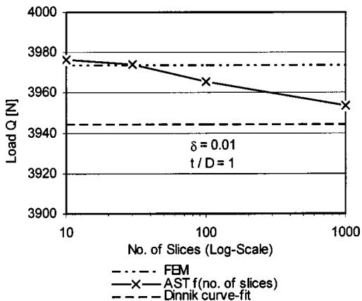  
Fig. 6 Comparison of alternative slicing technique (AST) total contact load with FEM data

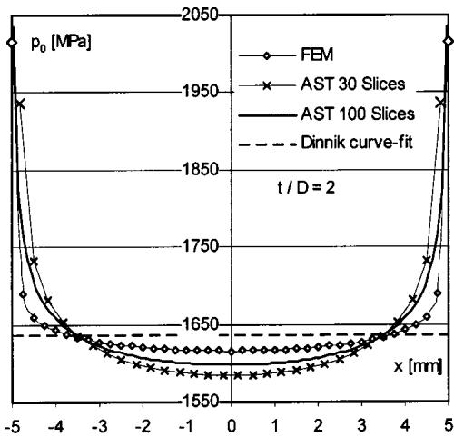  
Fig. 7 Comparison of AST pressure distribution with FEM data

$$
f _ {1} (x) + f _ {2} (x) = \left(\frac {1 - v _ {1} ^ {2}}{E _ {1}} + \frac {1 - v _ {2} ^ {2}}{E _ {2}}\right) \cdot \frac {Q}{L} \cdot f (2 x / L) \tag {24}
$$

where

$$
f (2 x / L) = \frac {1}{\pi} \cdot \ln \frac {1}{1 - \left(\frac {2 \cdot x}{L}\right) ^ {2}} \tag {25}
$$

Obviously, the latter equation is only valid in the range 0  $\leqslant |2x / L| < 1$ . Our model, however, uses slices of a certain length (thickness), referenced in the mid plane of the slice. Therefore, the case that  $|2x / L| = 1$  cannot occur by definition, i.e., the equation is unconditionally valid in our case.

Lundberg's theory assumes that the contacting bodies merge into infinite half-spaces outside the region of contact. To account for this assumption, a very thick plate  $(t / D = 500)$  was modeled. All other data, including the rigid body approach of  $\alpha = \delta = 0.01$  mm, were kept to the values mentioned in the last section.

Figure 8 compares the pressure distribution along the roller axis of a profiled and an un-profiled roller. It can be observed that the peak pressures at both ends of the roller are much reduced for the profiled case. Even though the overall pressure is more evenly distributed, small pressure peaks are still existent. This is in accordance with the findings of Kunert [7], who stated that for the case of a cylindrically shaped body contacting a flat half-space, no optimum profile can be found. To reduce the pressure and to avoid

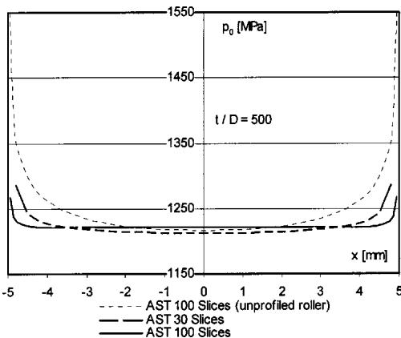  
Fig. 8 Application of AST to a Lundberg-profiled roller in contact with a thick plate

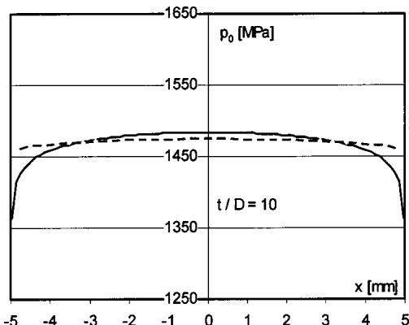  
—AST 30 Slices —AST 100 Slices

stress concentrations, he suggested a corrected, more tapered profile. He still assumed, however, that the roller contacts an infinite half-space.

Figure 9 again shows the pressure distribution along the axis of a Lundberg-like profiled roller. The plate thickness, however, was reduced in this model to  $t / D = 10$ . Since the same rigid body approach, i.e., the same penetration was assumed, respectively, the contact load calculated was higher than in the case with the thicker plate. As the Lundberg profile is dependent on the load, a different optimum profile was calculated from Eqs. (22) and (23). In fact, the profile was more tapered so that the contact pressure was reduced towards the ends of the roller; the opposite behavior than presented in Fig. 8.

Therefore, it can be concluded that the calculation of an optimum roller profile should involve both the loading conditions and some reference thicknesses of the contacting parts.

Application to Misaligned Rollers. In rolling bearing applications, races can be tilted against each other leading to a misalignment of roller and raceway. Since the pressure distribution is affected, a proper model should take this into account. In fact, this misalignment is one of the reasons why slicing techniques are frequently applied to calculate the load distribution in rolling bearings. Since pressure peaks are usually not taken into account, however, common slicing techniques may still be inaccurate.

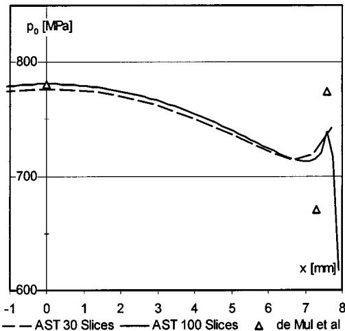  
Fig. 10 Application of AST to the contact of two disks taken from [9], no misalignment

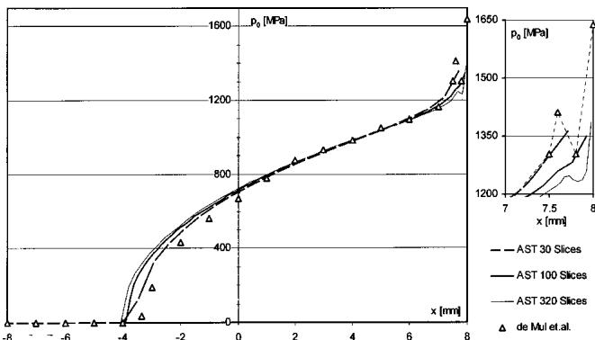  
Fig. 9 Application of AST to a Lundberg-profiled roller in contact with a thinner plate  
Fig. 11 Application of AST to the contact of two disks taken from [9], misalignment  $\theta = 0.05$  deg

To show the advantages of our model in this respect, the technique was applied to a case study discussed in reference [9]. In this, de Mul et al. compared their half-space model to the experimental work of Kannel and Hartnett carried out on a two-disk test rig. For comparison, the same contact load of  $Q = 2224 \mathrm{~N}$  as by de Mul et al. was assumed. For more information on the disk geometry and the test set-up the reader is referred to reference [9].

Figure 10 shows the pressure distribution along the roller axis for the case when no misalignment is present. Due to the profile of one disk, the pressure is quite evenly distributed, showing only minor peaks at the roller ends. The slightly "barreled" shape in the middle region, mentioned by de Mul et al. in [9], can also be observed. Values from our model taken in that region compare well with the values given in [9]. However, pressure peaks and oscillations towards the end of the roller cannot exactly be met. The latter might be due to the fact that the disK profile was only approximated on basis of a diagram plotted in [9].

In Fig. 11, the pressure distribution for a tilting angle of  $\theta = 0.86$  mrad $\approx$ 0.05 deg is compared with the results of de Mul et al. [9]. Some values from the reference are again plotted into the diagram. It can be observed that the results of our model agree well with the values taken from the reference. The very high pressure peak at the end of the disk, however, could not completely be confirmed.

Towards the opposite end of the contact area, our model slightly overestimated the values given by de Mul et al. However, the data measured by Kannel and Hartnett, referenced in [9], also show this tendency.

Both measurements by Kannel and Hartnett and the model of de Mul et al. showed an oscillation of the pressure near the end of the roller. In an effort to prove these oscillations, the slice length in our model was chosen to be the same as the width of the miniature transducer Kannel and Hartnett used for their measurements [9]. With the resulting 320 slices, the oscillatory behavior could be confirmed although the peak pressures in this region were still slightly lower than the pressure values predicted by de Mul et al. Again, this might be due to the approximated disc profile used for the analysis.

# Conclusions

In this paper, an alternative slicing technique has been proposed which accounts for a more exact pressure distribution in a line contact.

In order to avoid time-consuming iterations, two simple deflection-load relationships were developed by curve-fitting a well-known implicit expression. One can be applied to inner race, the other to outer race type contacts in a roller bearing. Results calculated from one of these curve-fits compared well to values obtained from a simplified FE model of a roller contacting a flat plate.

Based on the developed deflection-load relationships, a common slicing technique was extended to incorporate interactions of the slices among each other. The introduction of weighting functions to consider the influence of a force in one slice on the deflection of another lead to linear systems of equations which were solved by a standard Gaussian elimination procedure.

For validation purposes, pressures obtained by applying the new technique were compared with the results from aforementioned FE model and data published in the literature. The comparison with the FE model showed very good agreement but a slightly more "barreled" shape of the pressure along the line of contact; a fact that had also been observed before in the literature.

The profiling of the roller according to Lundberg's equation confirmed the suitability of the technique to this kind of application. In this context it is interesting to note that the optimum profile was found to be dependent on the contact load and the thicknesses of the contacting bodies. That means that classic half-space theory, where contacting bodies are assumed to be of infinite depth, holds only partly in a practical application.

The comparison with a case study discussed in [9] revealed that the proposed method can also be adopted in cases where misalignment is present. The high peak pressure predicted by the calculation found in the literature at the very edge of the roller could not fully be confirmed through our model, though. This inaccuracy might however be due to the applied profile, which could only be approximated from a sketch plotted in the reference.

Due to its fastness the proposed method has its particularly advantages when several contacts have to be evaluated at the same time (e.g., in bearing load distribution calculations) and where a great number of iterations are needed to satisfy overall constraints (e.g., in dynamic applications). Iterations due to the method itself are only necessary if slices are shifted out of contact due to the action of forces on others. The method has proven to be stable over a wide range of applied number of slices.

The fairly high accuracy of pressure distribution is also an important feature of the method. Especially in the dynamic analysis of bearings, where the roller kinematics—such as skewing and tilting—are particularly affected by peak pressures at the end of the roller. Besides that, modern bearing life calculations may be improved by considering local pressure concentrations within the contact area.

# Nomenclature

The units used throughout the paper are based on SI standards, except that meters have been replaced by millimeters to account for the scale of the problems in question.

$b =$  semi-width of contact area

$c =$  constant

$d_{m} =$  bearing pitch diameter

ex = exponent

$f =$  function

$l =$  length of one slice [mm]

$n =$  number of slices

$p_0 =$  maximum contact pressure

$q =$  load per slice

$\{q\} =$  vector of slice loads

$s =$  elastic compliance per slice

$t =$  raceway  $^+$  housing/plate thickness

$w =$  weighting function

$x =$  contact area longitudinal direction

$y =$  contact area transverse direction

$D =$  roller diameter

$E =$  modulus of elasticity

$L =$  total length of contact area

$O =$  total contact load

$R =$  radius of curvature

$[S_w] =$  matrix of weighted influence coefficients

$\alpha =$  rigid body approach

$\delta =$  contact deflection/interpenetration

$\nu =$  Poisson's ratio

$\theta =$  misalignment angle

$\Sigma \rho =$  sum of curvature of contacting bodies

$\{\Delta \} =$  vector of contact deflections

$\Omega =$  contact area

# Indices

$1 =$  rolling element

2 = raceway/plate

$i =$  inner race

$j, k =$  row, column index

$o =$  outer race

$r =$  distance between slices

$rp =$  roller-plate

# References

[1] Hertz, H., 1882, “Über die Berührung fester elastischer Körper,” Journal für reine und angewandte Mathematik, 92, pp. 156–171.  
[2] Brändlein, J., Eschmann, P., Hasbargen, L., and Weigand, K., 1995, Die Wölzagerpraxis, 3rd ed., Vereinigte Fachverlage GmbH.  
[3] Lundberg, G., 1939, “Elastische Berührung zweier Halbräume,” Forschung auf dem Gebiete des Ingenieurwesens, 10(5), pp. 201-211.  
[4] Rothbart, H. A., 1985, Mechanical Design and Systems Handbook, 2nd ed., McGraw-Hill.  
[5] Young, W. C., and Roark, J. R., 1989, Roark's Formulas for Stress and Strain, 6th ed., McGraw-Hill Professional.  
[6] Palmgren, A., 1959, Grundlagen der Wölzlagertechnik, 2nd ed., Franckh'sche Verlagshandlung, W. Keller & Co.  
[7] Kunert, K., 1961, "Spannungsverteilung im Halbraum bei elliptischer Flächenpressungsverteilung über einer rechtekigen Druckfläche," Forschung auf dem Gebiete des Ingenieurwesen, 27(6), pp. 165-174.  
[8] Houpert, L., 2001, “An Engineering Approach to Hertzian Contact Elasticity—Part I,” ASME J. Tribol., 123, pp. 582-588.  
[9] De Mul, J. M., Kalker, J. J., and Fredriksson, B., 1986, "The Contact Between Arbitrarily Curved Bodies of Finite Dimensions," ASME J. Tribol., **108**, pp. 140–148.  
[10] Conry, T. F., and Seirig, A., 1971, “A Mathematical Programming Method for Design of Elastic Bodies in Contact,” ASME J. Appl. Mech., pp. 387–392.  
[11] Singh, K. P., and Paul, B., 1974, “Numerical Solution of Non-Hertzian Elastic Contact Problems,” ASME J. Appl. Mech., pp. 484–490.  
[12] Reusner, H., 1977, “Druckflächenbelastung und Oberflächenverschiebung im Wölzkontakt von Rotationskorpern,” Dissertation, University of Karlsruhe, Germany.  
[13] Nayak, L., and Johnson, K. L., 1979, "Pressure Between Elastic Bodies Having a Slender Area of Contact and Arbitrary Profiles," Int. J. Mech. Sci., 21, pp. 237-247, Pergamon Press.  
[14] Hartnett, M. J., 1980, “A General Numerical Solution For Elastic Body Contact Problems,” ASME J. Appl. Mech., 39, pp. 51–66.  
[15] Harris, T. A., 1984, Rolling Bearing Analysis, 2nd ed., John Wiley & Sons, Inc.