# Film Thickness Theory for Single Contacts

P.M. Lugt, M.T. van Zoelen, and C.H. Venner

A lubricating grease will only provide a long bearing service life if a sufficiently thick film is developed separating the rolling elements from the raceways. As mentioned earlier, in Chapter 2, initially the film will be generated by hydrodynamic action with grease as the lubricating medium and fully flooded conditions prevail. Later, the contacts may get starved and the film is determined by the lubricant supply to the contacts, which can be calculated from a mass balance where the feed rate is determined by, for example, oil bleeding, shear, spinmotion and where the oil-loss rate is determined by effects such as side-flow in the contacts and evaporation. Centrifugal forces on thin lubricant layers could either feed the contact or remove lubricant from the tracks. The rate at which these effects take place is determined by the physical properties of the lubricant, which again may change due to oxidation or polymerization.

The theory of film thickness is crucial for understanding the lubrication mechanisms of grease lubrication in a bearing and it is therefore described in this book quite extensively. In the current chapter the ‘single contact film thickness theory’ will be presented. In the next chapter the application of this theory to rolling bearings will be given, extended with other phenomena that have an impact on film thickness, including long term effects such as base oil oxidation.

In this chapter, the fundamentals of lubricant film formation in rolling bearings will be given, starting with the derivation of the flow equation (Reynolds’ equation) and the equation for the film geometry. Initially, the films are determined by the ‘grease viscosity’, but, as soon as starvation occurs, the film will primarily be determined by the base oil viscosity. In recent years starvation models have been developed, which will be presented here. Starvation may be reduced by replenishment of the tracks by reflow. This may be considered in some cases. However, as will be shown, this mechanism is usually very slow. In this chapter it is assumed that the main source of lubricant supply to the contacts will be oil bleeding. Especially for roller bearings, it is much more important than replenishment from the side of the contacts

since oil bled from grease located on the cage bars may be supplied to the centre of the contacts directly, where starvation will be most pronounced. The bleeding models have been given in Chapter 7. The bled oil on the raceways may be lost or supplied by pumping driven by the centrifugal forces in the bearing. Models have been developed for this based on the so-called ‘thin film’ theory. The derivation is quite similar to that of the Reynolds equations, and is therefore included here as well.

# 9.1 Elasto-Hydrodynamic Lubrication

By fixing the coordinate system to a rolling element–raceway contact, the surface velocity of this rolling element and the raceway is (almost) equal and the lubricant, which (at least partially) sticks to the surfaces, will be sheared into the gap between the two surfaces, building up a hydrodynamic film. However, the contact load will generate a pressure back-flow reducing this effect again and the film thickness will be the result of the balance between the two effects. It is determined by the geometry of the contact (contact radii), speed, elasticity, contact load, lubricant rheology (viscosity) and, in the case of starvation, by the feed rate of lubricant towards the contact. In this section, the fundamentals of elasto-hydrodynamic lubrication (EHL) will be described, including the flow equations, the geometry description (elastic deformation) and some simple equations that can be used for engineering purposes.

# 9.1.1 History

In 1886, Reynolds published his famous article where he derived the differential equation describing the pressure distribution and load carrying capacity of lubricating films for journal bearings (Hydrodynamic Lubrication) [493]. In 1916, Martin [401] and Gumbel [237] ¨ applied Reynolds’ equation to the lubrication of gears and found film thicknesses that were much smaller than the roughness on the teeth of the gears. They could not explain the successful operation of these gears. In 1941 Meldahl [416] included elastic deformations caused by the contact pressures, but the film thickness predictions were still too small. Only in 1949 when Ertel [594] and Grubin [233] included elastic deformation of the contacts and a pressure–viscosity effect on the film thickness, was a sufficiently thick film found. This mode of lubrication has since been called ‘elasto-hydrodynamic lubrication (EHL)’. Petrusevich [470] and Dowson and Higginson [177, 178] solved the line contact problem and based on numerical solutions [178] developed engineering formulae for a wide variety of operating conditions. In 1972, Kauzlarich and Greenwood [315] solved the line contact problem for grease lubrication. Later, in 1976, when more powerful computers were available, Hamrock and Dowson [243] solved the circular problem for oil lubrication. Their curve fit to numerical solutions is still the most widely used film thickness formula for rolling bearings (and other machine elements operating in the EHL regime). Later, in 1987, multilevel techniques were introduced by Lubrecht et al. [372], which made it possible to apply very dense grids in numerical calculations, which increased the accuracy of the solutions significantly. In the same year Yang and Qiang [625] extended the work from Kauzlarich and Greenwood into grease lubricated elliptical contacts. Venner [587] further improved the numerical multigrid methodology and introduced the possibility of making transient calculations using multilevel techniques. A comprehensive book has been written on multigrid methods in EHL by Venner and Lubrecht [589]. In 1994, Nijenbanning et al. [447] introduced a new film thickness equation, based on

a curve fit of these very accurate multigrid solutions. After 1994, there was no further need to improve the accuracy of the fully flooded film thickness formulae and research in this area was directed towards ‘starved EHL’, where initially the same multigrid techniques were used (Chevalier et al. [124] 1996, refined by Damiens et al. [158]). Later, Van Zoelen et al. [584], in 2008, used a new approach based on thin film flow to solve this problem, making it possible to apply the formula to longer operating times and multiple contacts.

For a more extensive description on the history and review of EHL, the reader is referred to reviews by Spikes [558], Dowson and Ehret [176], Dowson [175] or Lugt and Morales-Espejel [376].

# 9.1.2 The Navier–Stokes Equations

The general equations describing the motion of a Newtonian fluid in space and time are the Navier–Stokes and continuity equations. The first are derived using conservation of momentum and the second using conservation of mass.

In lubrication theory, these equations are only used for calculating the full velocity profile in EHL films, sometimes in combination with the temperature distribution or with non-Newtonian rheology. Usually, the inertia forces are assumed to be negligible which simplifies the equations to the Stokes equations. Examples can be found in Odyck and Venner [581], Almqvist and Larsson [24] or Hartinger et al. [250]. However, in most cases, it is not necessary to solve the full equations. The ‘narrow gap or thin film assumption’1 in EHL can be used to simplify the equations leading to the Reynolds equation, which gives solutions for the film thickness with almost equal accuracy. Nevertheless, in order to facilitate the derivation of these simplified equations, the Navier–Stokes equations are listed here.

With body forces $f _ { x }$ , $f _ { y }$ , $f _ { z }$ , the Navier–Stokes equations, for example White [606], read:

$$
\begin{array}{l} \rho \frac {D u}{D t} = f _ {x} - \frac {\partial p}{\partial x} + \frac {\partial}{\partial x} \left[ \eta \left(2 \frac {\partial u}{\partial x} - \frac {2}{3} \left(\frac {\partial u}{\partial x} + \frac {\partial v}{\partial y} + \frac {\partial w}{\partial z}\right)\right) \right] \\ + \frac {\partial}{\partial y} \left[ \eta \left(\frac {\partial u}{\partial y} + \frac {\partial v}{\partial x}\right) \right] + \frac {\partial}{\partial z} \left[ \eta \left(\frac {\partial w}{\partial x} + \frac {\partial u}{\partial z}\right) \right] \tag {9.1} \\ \end{array}
$$

$$
\begin{array}{l} \rho \frac {D v}{D t} = f _ {y} - \frac {\partial p}{\partial y} + \frac {\partial}{\partial y} \left[ \eta \left(2 \frac {\partial v}{\partial y} - \frac {2}{3} \left(\frac {\partial u}{\partial x} + \frac {\partial v}{\partial y} + \frac {\partial w}{\partial z}\right)\right) \right] \\ + \frac {\partial}{\partial z} \left[ \eta \left(\frac {\partial v}{\partial z} + \frac {\partial w}{\partial y}\right) \right] + \frac {\partial}{\partial x} \left[ \eta \left(\frac {\partial u}{\partial y} + \frac {\partial v}{\partial x}\right) \right] \tag {9.2} \\ \end{array}
$$

$$
\begin{array}{l} \rho \frac {D w}{D t} = f _ {z} - \frac {\partial p}{\partial z} + \frac {\partial}{\partial z} \left[ \eta \left(2 \frac {\partial w}{\partial z} - \frac {2}{3} \left(\frac {\partial u}{\partial x} + \frac {\partial v}{\partial y} + \frac {\partial w}{\partial z}\right)\right) \right] \\ + \frac {\partial}{\partial x} \left[ \eta \left(\frac {\partial w}{\partial x} + \frac {\partial u}{\partial z}\right) \right] + \frac {\partial}{\partial y} \left[ \eta \left(\frac {\partial v}{\partial z} + \frac {\partial w}{\partial y}\right) \right]. \tag {9.3} \\ \end{array}
$$

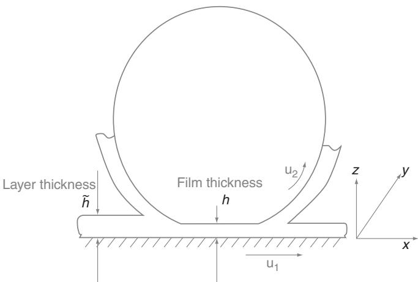  
Figure 9.1 Schematic representation of a roller–raceway contact separated by a lubricant film, fed by a lubricant layer.

# 9.1.3 The Reynolds and Thin Film Equation

In the case of (bearing) lubrication, the Navier–Stokes equations can be simplified, leading to the so-called ‘thin film equation’, describing the thickness of a lubricant layer on a solid surface with an air interface and the ‘Reynolds equation’ describing the thickness of a lubricant between two solid surfaces, which is called a film here. The layer thickness is denoted by $\tilde { h }$ and the film thickness by $h$ . Films are found wherever there is contact, such as in the rolling element–raceway contacts. Layers are found on the raceways between the contacts or next to the running track. This is depicted in Figure 9.1. Both films and layers will be so thin that the inertia forces (except for centrifugal forces) can be neglected and the fluid flow will be laminar. For the lubricant films, the contact forces on the films are so large that body forces (such as gravity) may be neglected.

At the boundary surfaces no slip is assumed, so the fluid velocity will equal the surface velocity here. In the case of a layer, this applies to one side of the layer. On the other side, the air side, the friction due to air flow may be neglected, so the shear stresses will be zero on this surface. The viscosity may be assumed constant across the film thickness. Due to shear in the contacts, heat will develop in the films and the temperature will rise. However, the slip rates in rolling bearings are relatively low and this can therefore be neglected as well. For films, the effective wedge angle between the surfaces in the contact region will be so small (though very important) that the boundary surfaces are almost parallel. For layers, large changes in the layer thickness, may occur and in the absence of large shear stresses on the surfaces, surface tension forces may be relevant.

It is assumed that the flow is laminar and that inertia forces are negligible compared to viscous shear (small Reynolds number, $\begin{array} { r } { \frac { D \mathbf { v } } { D t } = 0 } \end{array}$ ). The layer/film is thin compared to the characteristic length $L$ $( \big ( \frac { h } { L } \big ) ^ { 2 } \ll 1 )$ . This means that shear stress and velocity gradients are only significant L across the lubricant film, so all velocity gradients compared with $\frac { \partial u } { \partial z }$ , $\frac { \partial v } { \partial z }$ are negligible and all derivatives with respect to $x$ and $y$ will be much smaller than their equivalents with respect to

z. This also means that the viscosity can be assumed to be constant across the film (all terms with derivatives of $\eta$ can be neglected). Using these assumptions, the Navier–Stokes equations for Newtonian fluids can be reduced to:

$$
\frac {\partial p}{\partial x} = f _ {x} + \frac {\partial}{\partial z} \tau_ {x} \text {w i t h} \tau_ {x} = \eta \frac {\partial u}{\partial z} \tag {9.4}
$$

$$
\frac {\partial p}{\partial y} = f _ {y} + \frac {\partial}{\partial z} \tau_ {y} \text {w i t h} \tau_ {y} = \eta \frac {\partial v}{\partial z} \tag {9.5}
$$

$$
\frac {\partial p}{\partial z} = f _ {z}. \tag {9.6}
$$

These equations, in combination with the continuity equation:

$$
\frac {\partial \rho}{\partial t} + \frac {\partial}{\partial x} (\rho u) + \frac {\partial}{\partial y} (\rho v) + \frac {\partial}{\partial z} (\rho w) = 0 \tag {9.7}
$$

can be solved using different boundary conditions. A free surface and incompressible flow is assumed for the thin layer equation and compressible flow and no-slip boundary conditions for the velocity on both surfaces leads to the Reynolds equation. Integrated over the film and by applying Leibniz’s rule, the continuity equation can be written as

$$
\frac {\partial}{\partial x} \int_ {0} ^ {h} \rho u d z + \frac {\partial}{\partial y} \int_ {0} ^ {h} \rho v d z + \frac {\partial (\rho h)}{\partial t} = 0. \tag {9.8}
$$

This equation is used to introduce the film thickness in the continuity equation.

# Thin Layer Equations

In most lubrication problems the flow of thin layers can be regarded as two dimensional. This means that $w = 0$ and all derivatives to z can be neglected.

The body forces $f _ { x }$ , $f _ { y }$ , $f _ { z }$ are assumed to be constant across the layer. Eq. 9.6 is integrated over the height $z$ with $0 < z < \tilde { h }$ . The pressure is determined by the normal force on the layer with thickness $\tilde { h }$ and surface tension forces:

$$
p = f _ {z} (z - \tilde {h}) - \sigma (1 / \kappa), \tag {9.9}
$$

where $\kappa$ and $\sigma$ are the radius of curvature and surface tension respectively. For small curvatures a simple approximation can be used [561, 629]:

$$
\frac {1}{\kappa} \approx \frac {\partial^ {2} \tilde {h}}{\partial x ^ {2}}. \tag {9.10}
$$

In that case the pressure 9.9 can be written as:

$$
p = f _ {z} (z - \tilde {h}) - \sigma \frac {\partial^ {2} \tilde {h}}{\partial x ^ {2}}. \tag {9.11}
$$

The velocity can be calculated by integrating Eq. 9.4, with the following boundary conditions:

• No-slip on the oil–steel interface, that is $u = 0$ at $z = 0$ .   
• Negligible stress at the air–oil interface: $\begin{array} { r } { \frac { \partial u } { \partial z } = 0 } \end{array}$ at $z = \tilde { h }$

This gives:

$$
u = \frac {1}{2 \eta} \left(\frac {\partial p}{\partial x} - f _ {x}\right) \left(z ^ {2} - 2 z \tilde {h}\right). \tag {9.12}
$$

For a 2D flow, and assuming that the density is constant across the film, the continuity Eq. 9.8 becomes:

$$
\frac {\partial \tilde {h}}{\partial t} = - \frac {\partial}{\partial x} \int_ {0} ^ {\tilde {h}} u d z. \tag {9.13}
$$

The velocity 9.12 can be substituted into the mass balance 9.13 and after working out the integral reads:

$$
\frac {\partial \tilde {h}}{\partial t} = \frac {1}{3 \eta} \frac {\partial}{\partial x} \left(\tilde {h} ^ {3} \left(\frac {\partial p}{\partial x} - f _ {x}\right)\right). \tag {9.14}
$$

In the case that $f _ { z }$ is not a function of $x$ , the derivative of the pressure is obtained from 9.11 and reads:

$$
\frac {\partial p}{\partial x} = - f _ {z} \frac {\partial \tilde {h}}{\partial x} - \sigma \frac {\partial^ {3} \tilde {h}}{\partial x ^ {3}}. \tag {9.15}
$$

By combining Eq. 9.15 and 9.14, the one-dimensional thin film equation is obtained:

$$
\frac {\partial \tilde {h}}{\partial t} + \frac {1}{3 \eta} \frac {\partial}{\partial x} \left[ \tilde {h} ^ {3} \left(f _ {z} \frac {\partial \tilde {h}}{\partial x} + \sigma \frac {\partial^ {3} \tilde {h}}{\partial x ^ {3}} + f _ {x}\right) \right] = 0, \tag {9.16}
$$

where $\sigma$ is the surface tension, typically $0 . 0 2 < \sigma < 0 . 0 4 ~ J m ^ { - 2 }$ for lubricating oils. The parameters $f _ { x }$ and $f _ { z }$ are the body forces due to normal and tangential forces (caused by e.g. gravity and centrifugal forces).

This equation will be used later in this book to calculate the thin film flow on flat surfaces is large or where where the flow is driven by surface tension or centrifugal forces, that is those cases where $f _ { z } \frac { \partial \tilde { h } } { \partial x }$ i s large. $\frac { 1 } { \kappa }$

In the case of relatively smooth layers and a (small) inclination of the surface a further simplification can be made, as done by Van Zoelen [582], that is $\begin{array} { r } { \left| f _ { z } \frac { \partial \tilde { h } } { \partial x } \right| \ll | f _ { x } | } \end{array}$ and  σ ∂3h˜  $\left| \sigma \frac { \partial ^ { 3 } \tilde { h } } { \partial x ^ { 3 } } \right| \ll \left| f _ { x } \right|$ resulting in:

$$
\frac {\partial \tilde {h}}{\partial t} + \frac {1}{3 \eta} \frac {\partial}{\partial x} \left(\tilde {h} ^ {3} f _ {x}\right) = 0. \tag {9.17}
$$

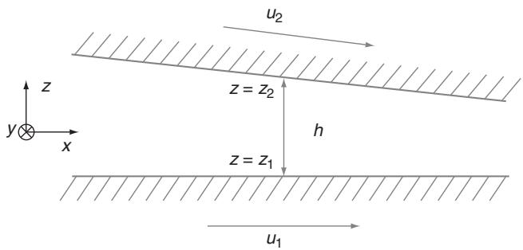  
Figure 9.2 Coordinates in the lubricant film.

# Thin Film Equations (Reynolds Equation)

To obtain the equation describing the lubricant film between rolling elements and raceways (Reynolds equation), the same thin film approximation is used. However, due to the very high pressures in the film, the lubricant density can no longer be assumed to be constant. Due to the high pressure gradients the body forces can be neglected $( f _ { x } , f _ { y } , f _ { z } ) = 0$ now. The lubricant flows in a gap with height $h$ between two solid surfaces at height $z = z _ { 1 }$ and $z = z _ { 2 }$ , moving with speeds $u _ { 1 }$ and $u _ { 2 }$ , as shown in Figure 9.2. Again no slip at the boundary surfaces is assumed. This gives:

$$
u = u _ {1} \quad \text {a t} z = z _ {1} \tag {9.18}
$$

$$
u = u _ {2} \quad \text {a t} z = z _ {2}. \tag {9.19}
$$

Integrating (9.4, 9.5) twice with respect to $z$ , using a new coordinate $z ^ { \prime }$ , where $z ^ { \prime } = z - z _ { 1 }$ so $h = z _ { 2 } - z _ { 1 }$ (film thickness), that is $0 \leq z ^ { \prime } \leq h$ , yields:

$$
u = \frac {1}{2 \eta} \frac {\partial p}{\partial x} z ^ {\prime} \left(z ^ {\prime} - h\right) + \left(\frac {h - z ^ {\prime}}{h}\right) u _ {1} + \frac {z ^ {\prime}}{h} u _ {2} \tag {9.20}
$$

$$
v = \frac {1}{2 \eta} \frac {\partial p}{\partial y} z ^ {\prime} \left(z ^ {\prime} - h\right) + \left(\frac {h - z ^ {\prime}}{h}\right) v _ {1} + \frac {z ^ {\prime}}{h} v _ {2}. \tag {9.21}
$$

The lubricant volume flow per unit length $q$ is found by integration over the film thickness:

$$
q _ {x} = \int_ {0} ^ {h} u \left(z ^ {\prime}\right) d z ^ {\prime} = - \frac {h ^ {3}}{1 2 \eta} \frac {\partial p}{\partial x} + \frac {h}{2} \left(u _ {1} + u _ {2}\right) \tag {9.22}
$$

$$
q _ {y} = \int_ {0} ^ {h} v \left(z ^ {\prime}\right) d z ^ {\prime} = - \frac {h ^ {3}}{1 2 \eta} \frac {\partial p}{\partial y} + \frac {h}{2} \left(v _ {1} + v _ {2}\right). \tag {9.23}
$$

Note: the first term is the pressure flow (Poisseuille flow) and the second term is the shear flow (Couette flow). In rolling bearings, transverse motion is usually absent (or negligible), so $v _ { 1 } = v _ { 2 } = 0$ ) and transverse flow (or leakage out of the contact) is only induced by pressure.

By substitution of the velocity field (9.20, 9.21) into the mass balance 9.8 the well known Reynolds equation [493] is obtained, relating the pressure to the gap height and the surface velocities:

$$
\begin{array}{l} \frac {\partial}{\partial x} \left[ \frac {\rho h ^ {3}}{\eta} \frac {\partial p}{\partial y} \right] + \frac {\partial}{\partial y} \left[ \frac {\rho h ^ {3}}{\eta} \frac {\partial p}{\partial y} \right] = \underbrace {6 \left(u _ {1} + u _ {2}\right) \frac {\partial (\rho h)}{\partial y} + 6 \left(v _ {1} + v _ {2}\right) \frac {\partial (\rho h)}{\partial y}} _ {w e d g e} \\ + \underbrace {6 \rho h \frac {\partial}{\partial x} (u _ {1} + u _ {2}) + 6 \rho h \frac {\partial}{\partial y} (v _ {1} + v _ {2})} _ {\text {s t r e t c h}} \\ + \underbrace {1 2 \frac {\partial (\rho h)}{\partial t}} _ {\text {s q u e e z e}}. \tag {9.24} \\ \end{array}
$$

Three effects cause pressure build-up (and therefore load carrying capacity) in the lubricant film:

• The ‘wedge effect’: due to a wedge-shape of the inlet of the contact.   
• The ‘stretch effect’: pressure generation induced by variation of tangential velocities in the gap. This phenomenon occurs when the surfaces deform in a tangential direction such as in cold rolling [373]. In rolling bearings this effect can be neglected.   
• The ‘squeeze effect’: this term plays an important role when surface roughness effects are included, in the case of vibrations in bearings or for studying grease noise. In those cases the problem can no longer be considered stationary.

# 9.1.4 Cavitation

The Reynolds equation may predict pressures below the vapour pressure of the lubricant. Since, for fluid lubrication, the pressure cannot drop below this value an additional equation must be added to the lubrication problem: the cavitation condition. The vapour pressure of the lubricant, $p _ { v }$ , is small compared to the mean pressure in the film $p$ $( p _ { v } \ll p )$ . Therefore it is justified to approximate the vapour pressure to the atmospheric pressure, $p _ { \infty }$ $p _ { v } \approx p _ { \infty } )$ and therefore $p _ { v } = p _ { \infty } = 0$ . The cavitation condition can then be written as :

$$
p \geq 0. \tag {9.25}
$$

# 9.2 Contact Geometry and Deformation

As mentioned in section 9.1.1, elastic deformation will play a major role in the formation of a favourable inlet geometry, which will provide a much thicker film than in the case of rigid bodies. In this section, the equation for the shape of the film will be derived based on the rigid contact geometry corrected for elastic deformation. In addition, some useful equations will be given for pressure and deformation, based on Hertz’ theory.

# 9.2.1 Rigid Bodies

The contacts between inner-ring/outer-ring raceways and the rolling element are conformal and nonconformal contacts. Close to the contact, the geometry can be simplified by assuming that the cylindrical shape of a raceway/rolling element can be approximated by a parabola. The gap between raceway and rolling element in the $\mathbf { X }$ -direction, $h _ { x }$ , then reads,

$$
h _ {x} \approx h _ {0} + \frac {x ^ {2}}{2 R _ {x _ {1}}} + \frac {x ^ {2}}{2 R _ {x _ {2}}}. \tag {9.26}
$$

This can be rewritten into

$$
h _ {x} \approx h _ {0} + \frac {x ^ {2}}{2 R _ {x}} \tag {9.27}
$$

with

$$
\frac {1}{R _ {x}} = \frac {1}{R _ {x _ {1}}} + \frac {1}{R _ {x _ {2}}}, \tag {9.28}
$$

which actually reduces the problem to a rolling element on a flat surface, see Figure 9.3.

A similar exercise can be done for the gap across the rolling direction, that is, the $y$ -direction. In the case of a deep groove ball bearing or spherical roller bearing inner-ring contact, the surfaces are concave and

$$
h _ {y} = h _ {0} + \frac {y ^ {2}}{2 R _ {y _ {1}}} - \frac {y ^ {2}}{2 R _ {y _ {2}}}, \tag {9.29}
$$

which can also be reduced to the gap between a spherical element and a flat surface:

$$
h _ {y} = h _ {0} + \frac {y ^ {2}}{2 R _ {y}}. \tag {9.30}
$$

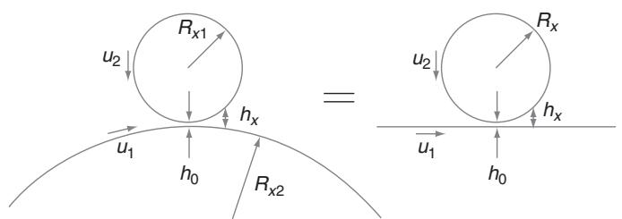  
Figure 9.3 Gap between inner-ring raceway and rolling element in running direction.

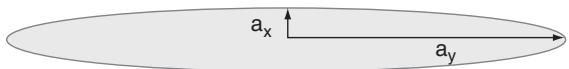  
Figure 9.4 Contact ellipse.

However, now a minus sign needs to be introduced here to calculate the reduced radius:

$$
\frac {1}{R _ {y}} = \frac {1}{R _ {y _ {1}}} - \frac {1}{R _ {y _ {2}}}. \tag {9.31}
$$

Note that for most outer-ring contacts, the contact is concave in both directions.

# 9.2.2 Elastic Deformation

If the bodies are assumed to be rigid, then the minimum lubricant film thickness is equal to the gap in the centre of the contact $h _ { 0 }$ (see Figure 9.3). However, the contact load will flatten the surfaces and lead to an elliptical contact (note that this does not apply to cylindrical and tapered roller bearings or in the case of contact truncation), as shown in Figure 9.4. The size of this ellipse and the maximum deformation can easily be calculated using Hertz’ theory (summary by Moes and Vroegop [426, 427] from the original work of Hertz [256–259]).

# Hertzian Theory

A ratio of reduced radii is defined such that $x$ and $y$ are the directions where the contact size is smallest in the running direction and therefore $R _ { x } < R _ { y }$ . This is always the case for the rolling element–raceway contacts in a rolling bearing. The ratio of the reduced radii of curvature is denoted by $\lambda$ :

$$
\lambda = \frac {R _ {x}}{R _ {y}} \leq 1 \tag {9.32}
$$

and

$$
\frac {1}{R} = \frac {1}{R _ {x}} \pm \frac {1}{R _ {y}}. \tag {9.33}
$$

The $\pm$ refers to a contrafrom $( + \mathrm { { s i g n } ) }$ and conform ( sign) contact. The contact is drawn in Figure 9.4. Note that $a _ { x } < a _ { y }$ .

The contact size and maximum Hertzian pressure can be calculated using the formulae from [427, 447], as will be shown below.

The reduced modulus of elasticity $E ^ { \prime }$ is defined as:

$$
\frac {2}{E ^ {\prime}} = \frac {1 - v _ {1} ^ {2}}{E _ {1}} + \frac {1 - v _ {2} ^ {2}}{E _ {2}}. \tag {9.34}
$$

The half-width of the contact in the $x$ -direction can then be calculated using:

$$
a _ {x} = \left(\frac {6 R _ {x} F \kappa E _ {c}}{E ^ {\prime} \pi (1 + \lambda)}\right) ^ {\frac {1}{3}}. \tag {9.35}
$$

Here $\lambda$ and $\kappa$ are defined as the ratio of the radii of contact curvatures and contact radii respectively:

$$
\lambda = \frac {R _ {x}}{R _ {y}} \quad \text {a n d} \quad \kappa = \frac {a _ {x}}{a _ {y}}. \tag {9.36}
$$

$E _ { c }$ is the Legendre normal integral (complete elliptic integral) of the second kind [256]:

$$
E _ {c} = \int_ {0} ^ {\pi / 2} \frac {d \psi}{\sqrt {\cos^ {2} \psi + \kappa^ {2} \sin^ {2} \psi}}, \tag {9.37}
$$

which is approximated by [447, 490]:

$$
E _ {c} \approx 0. 5 \pi \kappa^ {2} \left(1 + \frac {1 - \kappa^ {2}}{0 . 5 \pi \kappa^ {2}} - 0. 2 5 \ln \kappa\right). \tag {9.38}
$$

The ellipticity of the elliptical contact reads [256]:

$$
\kappa = \frac {a _ {x}}{a _ {y}} \approx \left(1 + \sqrt {\frac {\ln (1 6 / \lambda)}{2 \lambda}} - \sqrt {\ln 4} + 0. 1 6 \ln \lambda\right) ^ {- 1}. \tag {9.39}
$$

Knowing the size of the contact ellipse, the maximum Hertzian pressure can be calculated according to:

$$
p _ {\text {m a x}} = \frac {3 F}{2 \pi a _ {x} a _ {y}} \tag {9.40}
$$

and the mutual approach:

$$
c = \gamma \left(\frac {9 F ^ {2}}{8 R E ^ {\prime 2}}\right) ^ {\frac {1}{3}}, \tag {9.41}
$$

with

$$
\gamma = \frac {\kappa F _ {c}}{0 . 5 \pi \alpha} \tag {9.42}
$$

$$
\alpha = \left(\frac {\kappa E _ {c}}{0 . 5 \pi}\right) ^ {\frac {1}{3}}, \tag {9.43}
$$

which requires another elliptical integral $F _ { c }$ , which can be approximated by:

$$
F _ {c} \approx 0. 5 \pi \kappa^ {2} \left(1 + \frac {\left(1 - \kappa^ {2}\right) \ln (4 / \kappa)}{0 . 5 \pi \kappa^ {2}} - 0. 7 5 \ln \kappa\right). \tag {9.44}
$$

# Point-Wise Elastic Deformation

In the lubricated case, the pressure distribution no longer follows the Hertzian theory. In this case, the contact pressure is determined by the balance between shear flow and pressure flow, which are both a function of the gap geometry $h$ (see the Reynolds Eq. 9.24). However, due to the very high contact stresses in rolling bearings, the film thickness $h$ itself is now also a function of the pressure and can be calculated using the earlier derived Eq. 9.27, 9.30 through:

$$
h (x, y) = h _ {0} + \frac {x ^ {2}}{2 R _ {x}} + \frac {y ^ {2}}{2 R _ {y}} + d _ {e} (x, y), \tag {9.45}
$$

where $d _ { e } ( x , y )$ is the (local) elastic deformation. Generally, it is assumed that the size of the rolling elements and rings is much larger than the size of the Hertzian contacts and that the deformations are relatively small so that the contacting rings and rolling elements can be considered as semi-infinite elastic bodies and linear elastic theory applies. Moreover, plain stress prevails. The equation for the film thickness then reads:

$$
h (x, y) = h _ {0} + \frac {x ^ {2}}{2 R _ {x}} + \frac {y ^ {2}}{2 R _ {y}} + \frac {2}{\pi E ^ {\prime}} \int \quad \int_ {S} \frac {p \left(x ^ {\prime} , y ^ {\prime}\right) d x ^ {\prime} d y ^ {\prime}}{\sqrt {(x - x ^ {\prime}) ^ {2} + (y - y ^ {\prime}) ^ {2}}}. \tag {9.46}
$$

For more details on the elastic deformation the reader is referred to Johnson [331].

The constant $h _ { 0 }$ in Eq. 9.46 is the mutual distance of approach of two remote points in the bodies and may be solved from a force balance equation (Wijnant [610]):

$$
m \frac {\partial^ {2} h _ {0}}{\partial t ^ {2}} + \int_ {S} p (x, y) d x d y = F (t). \tag {9.47}
$$

# 9.3 EHL Film Thickness, Oil

The film thickness in EHL can be calculated by solving the Reynolds Eq. 9.24 or the Navier– Stokes Eqns 9.1, in combination with the film thickness Eq. 9.46. The boundary conditions are given by the cavitation condition, 9.25, and the force balance between applied load and predicted load given by the pressure distribution. Except for some asymptotic cases, it is not possible to solve these equations analytically. Numerical solvers are required to calculate the detailed point-wise film thickness distribution. Figure 9.5 shows examples of pressure distributions in the running direction (X) and across the running direction (Y ) where the load is varied from extremely low to very high. The figure shows that the pressure distribution approaches the Hertzian elliptical distribution at very high load. Inside the contact, the pressure is high and the viscosity will be extremely high. So in this area the pressure flow can be

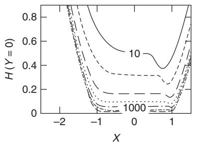

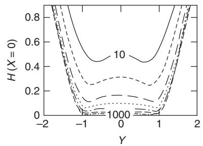

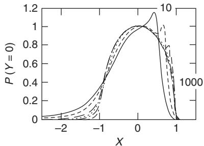

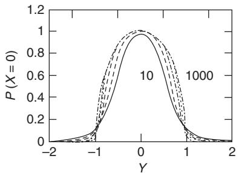  
Figure 9.5 Some characteristic solutions for pressure and film thickness (from Wijnant [610]) for various load conditions, $\mathbf M = 1 0$ , 20, 50, 100, 200, 500 and 1000. The lubricant number is $\mathrm { L } = 5$ . The pressure and coordinates are normalized according to $P = p / p _ { m a x }$ , $H = h / c$ , $X = x / a _ { x }$ , $Y = y / a _ { y }$ . The film thickness is scaled with the mutual approach $c$ , which may give the impression that the film thickness strongly depends on load, which is not the case (see Eq. 9.48). The definition of $M$ and $L$ will be given by Eq. 9.50.

neglected. At the area where the pressure is lower, ‘leakage’ due to pressure flow will lead to the characteristic restriction at the side and outlet of the contact.

Usually, only the central $\left( h _ { c } \right)$ or minimum film thickness $\left( { { h _ { m } } } \right)$ information is considered as characteristic. For this, curve fits have been made of numerical solutions resulting in film thickness formula. It is important to stress that these formulas are approximations. The most widely used formula is the Hamrock and Dowson [245] film thickness formula from 1978:

$$
\frac {h _ {m}}{R _ {x}} = 3. 6 3 \frac {U ^ {0 . 6 8} G ^ {0 . 4 9}}{W ^ {0 . 0 7 3}} \left(1 - e ^ {- 0. 6 8 \kappa_ {d}}\right) \tag {9.48}
$$

$$
\frac {h _ {c}}{R _ {x}} = 2. 6 9 \frac {U ^ {0 . 6 7} G ^ {0 . 5 3}}{W ^ {0 . 0 6 7}} \left(1 - e ^ {- 0. 7 3 \kappa_ {d}}\right)
$$

where:

$$
\kappa_ {d} = 1. 0 3 \left(\frac {R _ {y}}{R _ {x}}\right) ^ {0. 6 3} \quad G = \alpha E ^ {\prime} \tag {9.49}
$$

$$
U = \frac {\eta_ {0} u _ {s}}{2 E ^ {\prime} R} \quad W = \frac {F}{E ^ {\prime} R ^ {2}}.
$$

This formula illustrates quite clearly the impact of the various physical parameters on film thickness. For instance, it shows that the film thickness is mainly a function of the product of

speed and viscosity. This explains why water will only build up very thin films due the fact that the viscosity of water is pressure independent $( \alpha \approx 0$ ). As mentioned in Section 3.2.2, the pressure–viscosity coefficient for lubricating oils varies between $1 \times 1 0 ^ { - 8 } < \alpha < 3 \times 1 0 ^ { - 8 }$ $\mathrm { P a } ^ { - 1 }$ , which is much smaller than the possible variation in viscosity itself. So, for lubricating oils the film thickness is mainly determined by the viscosity and not by the pressure–viscosity coefficient. It is important to notice that these equations only apply to the fully flooded situation, that is when the inlet of the contact is submerged in oil/grease. It will be shown later that the mechanisms in the case of starvation are quite different.

Lately, more accurate solutions for the EHL film thickness have been developed. Unfortunately, this could not be done without losing the transparency in the dimensionless numbers and film thickness equations. Nevertheless, these equations are preferred when high accuracy is required. If the lubricant is incompressible and follows the Barus viscosity–pressure relation (3.16), the minimum number of dimensionless groups needed to characterize the problem is, according to Moes [424, 425], only three, instead of the four from Hamrock and Dowson (listed in 9.49). These dimensionless groups are:

$$
M = \frac {F}{E ^ {\prime} R _ {x} ^ {2}} \left(\frac {E ^ {\prime} R _ {x}}{\eta_ {0} u _ {s}}\right) ^ {\frac {3}{4}} \quad L = \alpha E ^ {\prime} \left(\frac {E ^ {\prime} R _ {x}}{\eta_ {0} u _ {s}}\right) ^ {- \frac {1}{4}} \quad \lambda = \frac {R _ {x}}{R _ {y}}. \tag {9.50}
$$

The $M$ -number is called the ‘load number’ and $L$ is called the ‘lubricant number’. The advantage of these groups over the groups from Eq. 9.49 is that there are only three instead of four. However, from an engineering point of view, it is confusing that the load number $M$ contains the viscosity, which is a lubricant parameter. This is the reason why both sets of dimensionless groups are still used.

The Dowson and Higginson formula is only accurate in the piezo-viscous elastic regime for small values of $\alpha$ . A film thickness formula valid for the entire parameter domain has been developed by Nijenbanning et al. [447] and is a function fit of asymptotic solutions, reflected in the various dimensionless groups 9.53:

$$
\frac {h _ {c}}{R _ {x}} \sqrt {\frac {E ^ {\prime} R _ {x}}{\eta_ {0} u _ {s}}} = \left[ \left(H _ {R I} ^ {\frac {3}{2}} + \left(H _ {E I} ^ {- 4} + h _ {0 0} ^ {- 4}\right) ^ {- \frac {3}{8}}\right) ^ {\frac {2}{3} s} + \left(H _ {R P} ^ {- 8} + H _ {E P} ^ {- 8}\right) ^ {- \frac {1}{8} s} \right] ^ {\frac {1}{s}} \tag {9.51}
$$

with

$$
s = \frac {3}{2} \left(1 + e ^ {- 1. 2 \frac {H _ {E I}}{H _ {R I}}}\right) \quad \text {a n d} \quad h _ {0 0} = 1. 8 \lambda^ {- 1} \tag {9.52}
$$

and

$$
H _ {R I} \approx 1 4 5 \left(1 + 0. 7 9 6 \lambda^ {\frac {1 4}{1 5}}\right) ^ {- \frac {1 5}{7}} \lambda^ {- 1} M ^ {- 2}
$$

$$
H _ {R P} = 1. 2 9 (1 + 0. 6 9 1 \lambda) ^ {- \frac {2}{3}} L ^ {\frac {2}{3}}
$$

$$
H _ {E I} = 3. 1 8 \left(1 + 0. 0 0 6 \ln \lambda + 0. 6 3 \lambda^ {\frac {4}{7}}\right) ^ {- \frac {1 4}{2 5}} \lambda^ {- \frac {1}{1 5}} M ^ {- \frac {2}{1 5}} \tag {9.53}
$$

$$
H _ {E P} = 1. 4 8 \left(1 + 0. 0 0 6 \ln \lambda + 0. 6 3 \lambda^ {\frac {4}{7}}\right) ^ {- \frac {7}{2 0}} \lambda^ {- \frac {1}{2 4}} M ^ {- \frac {1}{1 2}} L ^ {\frac {3}{4}}.
$$

This equation only applies to contacts with the entrainment direction perpendicular to the major principal axis of the contact ellipse, that is $\lambda = R _ { x } / R _ { y } \leq 1$ , which is generally the case in rolling bearings (except for flange contacts). This equation may seem complicated, however the film thickness is still explicitly given and can be calculated on any hand calculator or computer. For a more detailed description the reader is referred to [447].

# 9.3.1 Example: 6204 Bearing

As an example, a 6204 bearing is running at $1 0 0 ~ ^ { \circ } \mathrm { C }$ , with a speed of $1 0 0 0 0 ~ \mathrm { r / m i n }$ and a pure radial load of 208 N $\mathrm { C } / \mathrm { P } = 6 5 $ ). The bearing is lubricated with the base oil of GWZ grease, which has a viscosity of $\nu = 3 0 \mathrm { c S t }$ at $1 0 0 ~ ^ { \circ } \mathrm { C }$ , density $\rho = 8 9 0 ~ k g / m ^ { 3 }$ and dynamic viscosity is $\eta _ { 0 } = 0 . 0 3 0 P a \cdot s \mathrm { ) }$ . A viscosity–pressure coefficient of $\alpha = 1 . 6 \times 1 0 ^ { - 8 } ~ \mathrm { P a ^ { - 1 } }$ is assumed for this oil. The ball radius is $R _ { x 1 } = R _ { y 1 } = 3 . 9 7 \times 1 0 ^ { - 3 } ~ \mathrm { m }$ . The inner-ring radii are $R _ { x 2 } = 1 2 . 8 \times 1 0 ^ { - 3 } \mathrm { ~ m ~ }$ and $R _ { y 2 } = - 4 . 0 6 \times 1 0 ^ { - 3 } \mathrm { ~ m ~ }$ . By using Eq. 9.33, this gives for the reduced radii of the inner-ring–ball contacts: $R _ { x } = 3 . 0 3 \times 1 0 ^ { - 3 } \mathrm { ~ m ~ }$ , $R _ { y } = 1 7 9 \times 1 0 ^ { - 3 } \mathrm { m } .$ . The maximum load in the loaded zone of a single ball–inner-ring contact is $\mathrm { F } = 1 8 5 \mathrm { N }$ , the maximum Hertzian pressure is 1.33 GPa and the contact size is $a _ { x } = 7 0 \mu \mathrm { m }$ and $a _ { y } = 9 4 0 \mu \mathrm { m }$ . The contacts are running in a rotating frame of reference and the surface velocities can be deduced from the kinetic behaviour of the bearing assuming pure rolling. A derivation of the equations can be found in [249]. The inner-ring–ball sum velocity is:

$$
u _ {s} = \frac {d _ {m}}{2} [ (1 - \gamma) (\omega_ {i} - \omega_ {m}) + \gamma \omega_ {R} ] \tag {9.54}
$$

where $\omega _ { i }$ , $\omega _ { m }$ , ωR are the angular speeds of the inner raceway, cage and balls respectively (rad/s). The parameter $\gamma$ is defined by $\begin{array} { r } { \gamma = \frac { D \cos \alpha } { d _ { m } } } \end{array}$ , where $D$ is the ball diameter, $d _ { m }$ is the pitch diameter and $\alpha$ is the contact angle (in this example $\alpha = 0$ ). Substitution leads to a sum speed of $u _ { s } = 1 6 . 5 \ : \mathrm { m / s } .$ . The Moes dimensionless numbers are then: $M = 6 9 6$ and $L = 1 8 . 3$ . The film thickness according to Eq. 9.51 is $h _ { c } = 0 . 6 6 5 \mu \mathrm { m }$ . The film thickness according to Dowson and Higginson is $h _ { m i n } = 0 . 5 1 \mu \mathrm { m }$ .

# 9.4 EHD Film Thickness, Grease

In the case where thickener material enters the contact, the film thickness will not be determined by the base oil only and the equations listed above do not apply. This typically occurs in the case of a large volume of grease in the bearing, in the early (churning) phase. It could also happen after transient events such as during a temperature increase or in the case of vibrations where grease is detached from the surface. In this section both measurements and models for fully flooded grease lubricated contacts will be described.

# 9.4.1 Measurements

By 1972 Poon [476] measured film thickness of grease in EHL contacts. He used a two-disc machine and measured the films using magnetic reluctance techniques.

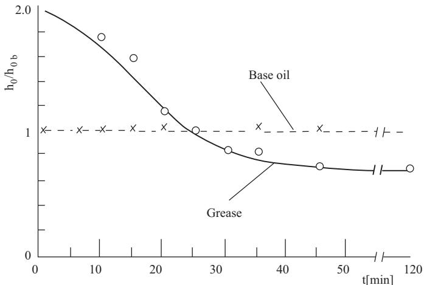  
Figure 9.6 Film thickness measurement on a two-disc rig. Reproduced from Poon, 1972 $©$ ASME.

Poon found films which were initially thicker than those expected based on the base oil viscosity only (see Figure 9.6), followed by a decrease in time. He also measured the films of mechanically aged grease and found significantly lower values, very close to those expected based on the base oil viscosity (see Figure 9.7).

Zhu and Neng [638] measured the grease film thickness in point and line contacts. They also showed severe starvation leading to a continuously decreasing film thickness for point contacts. However, in line contacts, starvation was limited to a short initial period of about only one minute, after which the film thickness remained constant. Unfortunately, they only measured for 10 minutes. Like Poon, Zhu and Neng also concluded that grease ages such

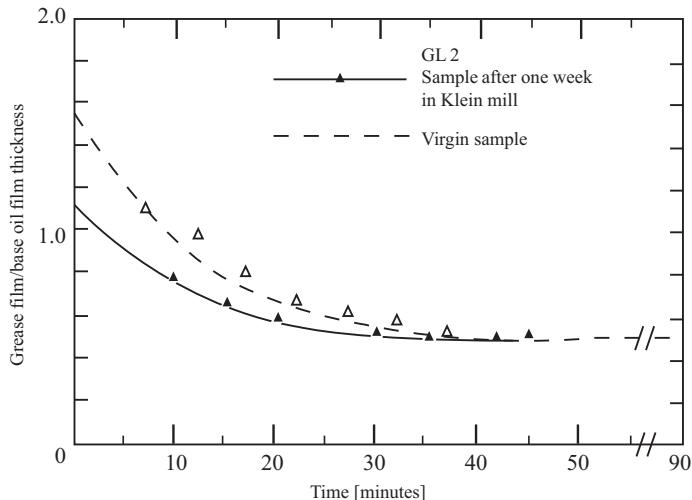  
Figure 9.7 Film thickness measurement with fresh grease and grease aged in a mill. Reproduced from Poon, 1972 $©$ ASME.

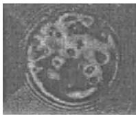  
Grease A1

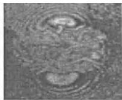  
Grease A2   
A (a) Aromatic $( 2 1 ^ { \circ } \mathsf { C } )$

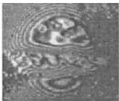  
Grease A3

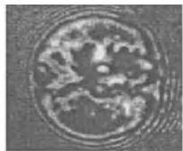  
Grease A2

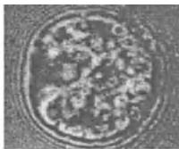  
Grease A3   
B (a) Aromatic $( 7 7 ^ { \circ } \mathsf { C } )$

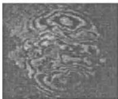  
Grease B1

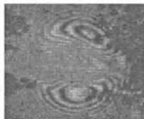  
Grease B2   
A (b) Alicyclic $( 2 0 ^ { \circ } \mathsf { C } )$

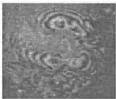  
Grease B3

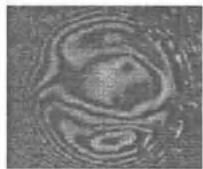  
Grease B2

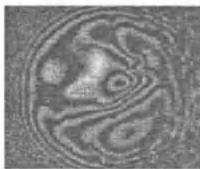  
B (b) Alicyclic $( 7 8 ^ { \circ } \mathsf { C } )$   
Grease B3

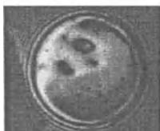  
Grease C1

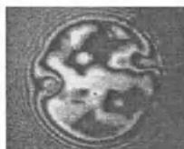  
Grease C2   
A (c) Aliphatic $( 2 0 ^ { \circ } \mathsf { C } )$

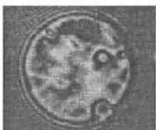  
Grease C3

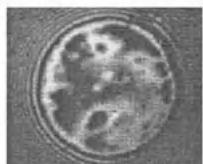  
Grease C2

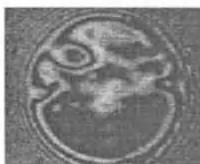  
B (c) Aliphatic $( 7 8 ^ { \circ } \mathsf { C } )$   
Grease C3   
Figure 9.8 Interferometry image for low speed operation, where thickener lumps are clearly travelling though the contact. Reproduced from Kaneta et al., 2000 $©$ Sage Pulications.

that the grease viscosity approaches the base oil viscosity and that the film thickness should therefore be calculated using the base oil viscosity. If this were to always apply, then the oil film thickness equation could directly be applied to grease lubricated contacts.

Later, when very accurate optical interferometry measurements on a ball-on-disc configuration became available, fully flooded measurements were done using a scoop to ensure fully flooded conditions. In this case grease is continuously ‘pushed back’ into the inlet of the contact and only a mild form of aging occurs. This makes it possible to measure over longer times with fresh grease. Such measurements have been made by Astrom¨ et al. [35], Williamson et al. [614], Kaneta et al. [309] and others, who showed that the film thickness is indeed higher than the fully flooded oil film thickness. The optical set-up also made it possible to show that grease thickener lumps were entering the contact. They did not age the grease (or run for long times) and their measurements are therefore representative of the initial phase of bearing operation (or for longer times if the bearing is running at ultra-low speed). Figure 9.8 shows some images from Kanata’s measurements clearly showing the nonuniform films caused by grease particles travelling through the contact.

# 9.4.2 Film Thickness Models for Grease Rheology

When the contact is fully flooded with relatively fresh grease, as in the ball-on-disc measurements described above, the traditional Newtonian viscosity has to be replaced by

non-Newtonian grease rheology. In 1972 Greenwood and Kauzlarich [315] derived an analytical expression for the 2D grease film using a Herschel–Bulkley model,

$$
\tau = \tau_ {y} + K \dot {\gamma} ^ {n}. \tag {9.55}
$$

Later, in 1979, Jonkisz and Krzeminski-Fredihave [306] numerically solved the line contact ´ EHL problem with the same Herschel–Bulkley model obtaining a slightly more accurate solution compared to the Kauzlarich and Greenwood model.

In both papers, but also later in Bordenet et al. [99] it is shown that in the inlet two layers exist. One layer where the shear stress exceeds the yield stress and where grease flows as a viscous liquid with a viscosity depending on the shear rate, and a layer where the shear stress is smaller than the yield stress and where a plug flow occurs. The thickness of this plug flow layer depends on the yield stress of the grease and can be calculated rather easily using the result of the Navier–Stokes equations to which the lubrication assumptions were applied (Eq. 9.4). The force balance reads:

$$
\frac {\partial \tau}{\partial z} = \frac {\partial p}{\partial x}. \tag {9.56}
$$

The pressure is assumed not to vary across the gap, so

$$
\tau = z \frac {d p}{d x}. \tag {9.57}
$$

Here $- { \textstyle { \frac { 1 } { 2 } } } h < z < { \frac { 1 } { 2 } } h$ , so $z = 0$ refers to the centre of the film. A plug flow will occur for $\tau < \tau _ { y }$ , so half the thickness of the central layer where a plug flow occurs is given by:

$$
z _ {p} = \frac {\tau_ {y}}{\frac {d p}{d x}}. \tag {9.58}
$$

This is illustrated in Figure 9.9 for pure rolling. In the Hertzian contact, the pressures are very high and due to the exponential relation of the viscosity with pressure the occurrence of a plug flow here is obvious. Upstream, viscous behaviour is observed close to the wall and a plug

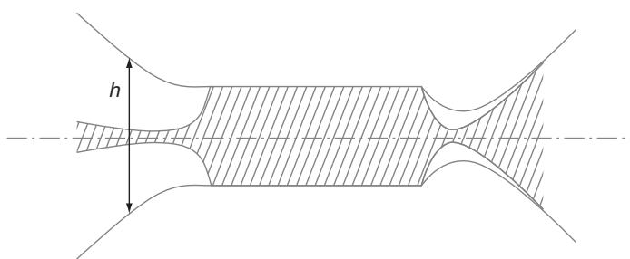  
Figure 9.9 Film profile and plug flow in a grease lubricated pure rolling EHL contact. Reproduced from Dong and Qiang, 1988 $©$ Elsevier.

flow will only occur in the centre of the film. Further upstream, which is not shown in this figure, the pressure gradient is small and the velocity will again be constant across the gap. Kauzlarich and Greenwood [315] give an equation for the shear rate in the nonplug flow in the inlet of the contact.

$$
\dot {\gamma} = \left(\frac {z - z _ {p}}{z _ {p}}\right) ^ {\frac {1}{n}} \left(\frac {\tau_ {y}}{K}\right) ^ {\frac {1}{n}} \quad z > z _ {p}. \tag {9.59}
$$

Eq. 9.59 is strictly only valid in the case that the yield stress $\tau _ { y }$ and consistency index $K$ are pressure independent, which is a valid assumption in the inlet, that is, at the onset of pressure build-up, where the pressures are relatively low. For the prediction of the film thickness, Kauzlarich and Greenwood use the Grubin theory in EHL where the film thickness is assumed to be determined by the inlet only and where the contact shape is given by the dry contact Hertzian pressure distribution. They assume (the same) exponential pressure dependence of both yield stress $\tau _ { y }$ and consistency index $K$ . Unfortunately, no high pressure rheology measurements with lubricating grease are available and a guess has to be made about the pressure dependency of yield stress and consistency in this regime. Assuming an exponential relation, similar to what was done for base oil viscosity, makes it possible to derive a film thickness equation for line contacts [315]:

$$
h _ {c} ^ {n + \frac {1}{3}} = \frac {2 ^ {\frac {3}{2}} \pi^ {\frac {1}{6}}}{3 ^ {\frac {1}{3}}} \left(\frac {E ^ {\prime}}{w}\right) ^ {\frac {1}{6}} R ^ {\frac {1}{2}} \alpha K _ {0} u _ {m} ^ {n} \left[ \left(4 + \frac {2}{n}\right) ^ {n} I (n) + \frac {\pi}{\sqrt {3}} \frac {\lambda_ {n} \tau_ {y _ {0}} h _ {c} ^ {n}}{K _ {0} u _ {m} ^ {n}} \right] \tag {9.60}
$$

with

$$
K = K _ {0} \exp (\alpha p)
$$

$$
\tau_ {y} = \tau_ {y _ {0}} \exp (\alpha p)
$$

$$
I (n) = \frac {\left(n - \frac {1}{3}\right) ! \left(n - \frac {2}{3}\right) !}{2 (n !)} \tag {9.61}
$$

$$
\lambda_ {1} = 1 - \frac {1}{3} \left(\frac {2 z _ {p}}{h}\right) ^ {2} \quad \frac {2 n + 1}{n + 1} <   \lambda_ {n} <   1.
$$

Here $w$ is the load per unit width. The noninteger factorials in 9.61 can be calculated using

$$
n! = \Gamma (n + 1) = \int_ {0} ^ {\infty} e ^ {- t} t ^ {n} d t. \tag {9.62}
$$

This means that $\frac { 2 } { 3 } < \lambda _ { 1 } < 1$ . For bearing greases, $n \approx 0 . 3$ , so $1 < \lambda < 1 . 2 5$ and $I ( n ) \approx 0$ . Under practical conditions the last term in Eq. 9.60 is negligible. So the film formation is determined mainly by the ‘consistency index’ $K _ { 0 }$ and speed.

Kauzlarich and Greenwood theoretically evaluated the film thickness for a large number of greases and showed a significant difference between the grease film thickness and base oil film thickness (up to a factor of 14!). Such large differences are not found in experiments.

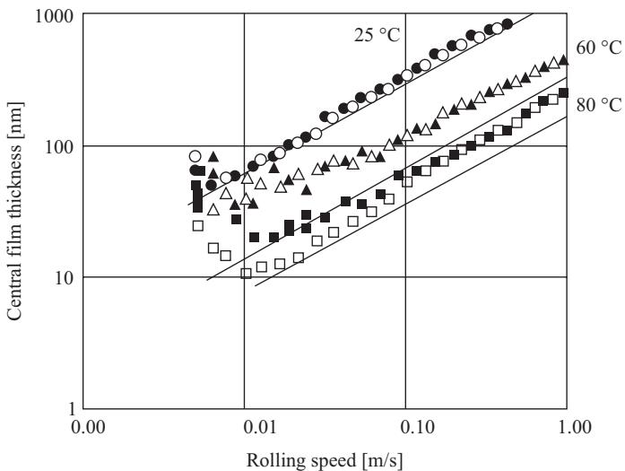  
Figure 9.10 Film thickness versus rolling speed. Reproduced with permission from Hurley and Cann, 1999 $©$ NLGI.

The difference is ascribed to heat development in the inlet of the contact (inlet shear heating), which is higher in the case of grease than in the case of oil lubrication. They also derived an equation for the difference in temperature between the centre line of the film and the rollers based on the same Herschel–Bulkley model:

$$
T _ {c} - T _ {s} = \frac {2 ^ {n - 1} \left(2 + \frac {1}{n}\right) ^ {n}}{3 + \frac {1}{n}} \frac {K (u _ {m}) ^ {n + 1}}{K _ {c}} \frac {(h - h _ {c}) ^ {n + 1}}{h ^ {2 n}}, \tag {9.63}
$$

where $K _ { c }$ is the thermal conductivity of the grease and $h _ { c }$ the film thickness at the location where the pressure gradient is zero, which is approximately equal to the central film thickness. The film thickness Eq. 9.60 shows again a power law behaviour (plotting film thickness versus speed on logarithmic scales will give a straight line) between speed and film thickness.

Film thickness measurements have confirmed this power law behaviour. However, measurements also show that this power law behaviour stops at very low speeds [172, 283], as illustrated in Figure 9.10.

For very low speeds, it is convenient to rewrite the film thickness Eq. 9.60 into:

$$
h _ {c} ^ {n + \frac {1}{3}} = \frac {2 ^ {\frac {3}{2}} \pi^ {\frac {1}{6}}}{3 ^ {\frac {1}{3}}} \left(\frac {E ^ {\prime}}{w}\right) ^ {\frac {1}{6}} R ^ {\frac {1}{2}} \alpha K _ {0} \left[ \left(4 + \frac {2}{n}\right) ^ {n} I (n) u _ {m} ^ {n} + \frac {\pi}{\sqrt {3}} \frac {\lambda_ {n} \tau_ {y _ {0}} h _ {c} ^ {n}}{K _ {0}} \right], \tag {9.64}
$$

to explicitly show that the film thickness goes to a nonzero value at zero speed. According to Eq. 9.63, in the case of ultra-low speeds, the inlet shear heating $\Delta T  0$ for $u  0$ . Effectively, combining both effects, may explain the increase in film thickness at decreasing, ultra-low, speeds as depicted in Figure 9.10.

In 1988 Dong and Qiang [173] developed a line contact model using a more appropriate rheology model based on the work of Bauer [70]:

$$
\tau = \tau_ {y} + \eta_ {\text {o i l}} \dot {\gamma} + k _ {2} (\dot {\gamma}) ^ {n}. \tag {9.65}
$$

Here $\eta _ { o i l }$ is the base oil viscosity. They proposed the following film thickness formula:

$$
\frac {h}{h _ {\text {o i l}}} = \left(1 + \Upsilon^ {1. 1} \left(\frac {h _ {\text {o i l}}}{R _ {x}}\right) ^ {1 - n}\right) ^ {0. 6 9} \tag {9.66}
$$

where

$$
\Upsilon = \frac {\eta_ {o i l}}{k _ {2}} \left(\frac {u _ {m}}{R _ {x}}\right) ^ {n - 1}. \tag {9.67}
$$

Also here, the correction for the film thickness does not contain the yield stress. Dong and Qiang carried out computations for a yield stress up to $3 0 0 0 \mathrm { P a }$ and even at this unrealistically high value, they observed a film increase of $3 \%$ only, indicating that the yield stress correction is negligible.

Bordenet et al. [99] used the same rheology model but now for point contacts. Unfortunately they do not give a film thickness formula. However, they do confirm the main conclusion from Dong and Quang, that is that the base oil viscosity is the most important parameter here, that the yield stress does not have an impact on the film thickness, and that the films can be corrected using the ‘plastic viscosity’ $k _ { 2 }$ .

Yang and Qian [625] have derived a 2D solution for elliptical contacts using the Bingham plastic rheology model:

$$
\tau = \tau_ {y} + K \dot {\gamma}. \tag {9.68}
$$

The argument that they use for neglecting the shear thinning effect is that EHL contacts typically operate under higher shear rates, where linear models apply. They derived an equation for the width of the plug flow in the inlet:

$$
z _ {p} = \tau_ {y} \left[ 3 \eta u _ {m} \frac {h - h _ {c}}{h ^ {3}} + \frac {3 \tau_ {y}}{2 h} \left(1 - \frac {1}{3} \left(\frac {z _ {p}}{h}\right) ^ {2}\right) \right] ^ {- 1} \approx \tau_ {y} \left[ 3 \eta u _ {m} \frac {h - h _ {c}}{h ^ {3}} + \frac {3 \tau_ {y}}{2 h} \right] ^ {- 1} \tag {9.69}
$$

and a central film thickness equation:

$$
\frac {h _ {c}}{R _ {x}} = 2. 4 4 (G U) ^ {0. 7 4} W ^ {- 0. 0 7 3 3} \left(1 - 0. 4 3 e ^ {- 0. 5 2 k}\right) (1 + 3. 7 1 \bar {\tau}) ^ {0. 7 4} \tag {9.70}
$$

where U , G, W and $k$ are the Hamrock and Dowson dimensionless parameters, given by Eqns 9.49, in which the viscosity is the grease viscosity $K$ . Note that this formula is a

modification of the Hamrock and Dowson Eq. 9.48 film thickness formula. However, its application is more complex because the correction term includes the dimensionless yield stress parameter:

$$
\bar {\tau} = \frac {\tau_ {y} h _ {c}}{2 \eta_ {0} u _ {m}}, \tag {9.71}
$$

which depends on the central film thickness again. Assuming fully-flooded and isothermal conditions, Yang and Qian also show that the yield stress has little effect on the film thickness. In that case, the main difference between film formation from grease and its base oil is caused by the difference in viscosity. They show that the fully-flooded isothermal film thickness in a grease lubricated contact can be estimated using the following equation:

$$
\frac {h}{h _ {\text {o i l}}} = \left(\frac {K}{\eta_ {\text {o i l}}}\right) ^ {0. 7 4}, \tag {9.72}
$$

with $K$ the Bingham ‘grease viscosity’ (Eq. 9.68). It should be stressed here that the Bingham model only applies for fresh grease. Grease present on the raceways of bearings will be overrolled by the highly stressed EHL contacts with very large shear rates and will therefore age rapidly. The soap structure will degrade into small particles, which causes the grease to lose its solid character and shear thinning behaviour.

Therefore, in many applications it is assumed that the fully flooded film thickness can simply be calculated from the oil film thickness equations assuming that the viscosity is equal to the base oil viscosity.

# 9.5 Starvation

# 9.5.1 Starved Oil Lubricated Contacts

So far the contacts have been assumed to be fully flooded, that is the film build-up is not restricted by the quantity of lubricant supplied to the contact and the pressure build-up starts relatively far upstream and with a near-zero pressure gradient, as shown in the left picture from Figure 9.11. If the inlet is not fully filled, the two layers on rolling element and raceway merge, forming a meniscus in the inlet of the contact and the pressure build-up can only start at this point, that is closer to the Hertzian contact with a nonzero pressure gradient. This will reduce the film thickness and the shape of the characteristic pressure distribution in the contact (see right side of Figure 9.11). By reducing the lubricant supply further, the film thickness will continually decrease where the film will ultimately be equal to the oil layers supplied to the contact, compressed to about $30 \%$ by the high pressures. The pressure spike close to the outlet will become smaller and ultimately vanish. This lubrication regime, in which the supply of lubricant in the inlet determines the EHL film thickness, is denoted by ‘starved lubrication’, or sometimes by ‘parched lubrication’ (Kingsbury [329]).2

The onset of starvation can be shown experimentally, using optical interferometry measurements of a ball running on a glass disc lubricated by a thin layer of oil only. Pioneers in

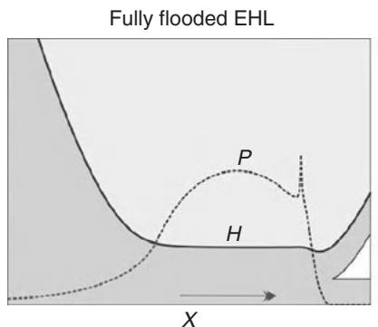

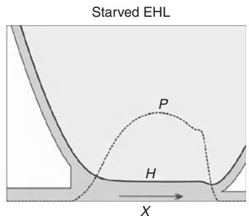  
Figure 9.11 Schematic representation of film thickness and pressure in a fully flooded and starved EHL contact [582].

identifying and defining starved lubrication using these techniques were Wedeven et al. [601], Chiu [125] and Pemberton and Cameron [469].

Images of starved contacts,which were recently published by Popovici [478], are used here to illustrate the starvation process. Figure 9.12 shows five interferometry images of ball-ondisc experiments. The shading indicates the film thickness and the lubricant flow direction is bottom to top. The combined oil layer on ball and disc feeds the contact with lubricant, which partly flows through the contact and partly around the contact, reducing the lubricant layer thickness on ball and disc behind the contact. With increasing speed, the time for replenishment of the running track of the contact between successive overrollings becomes shorter and the result is that the supply of lubricant from the sides to the inlet of the contact will decrease with increasing speed. This can clearly be seen in Figures 9.12a up to 9.12e, where the speed is increased step-wise. In the low speed case, Figure 9.12a, the contact is almost fully flooded. Here, the inlet meniscus at the bottom of the picture is relatively far away from the edge of the Hertzian contact. The inlet is relatively well filled with oil and the interferometry picture of the Hertzian contact shows the characteristic horse-shoe shape with its uniform thickness in the centre and its film restriction at the edges of the contact. At higher speeds, the inlet meniscus approaches the edge of the Hertzian contact region and the film is slightly reduced as can be seen from the slight change in shade in the centre of the contact. Increasing the speed even further to 0.53 and $0 . 7 7 \mathrm { m } / \mathrm { s }$ , the film thickness is significantly reduced, first in the centre of the contact and then towards the right where the layer thickness seems to be thinner. Ultimately, at $u = 1 . 1 \mathrm { m } / \mathrm { s }$ , the contact is severely starved, as can be seen by the clearly visible large change in shade, which is now uniform throughout the contact.

# 9.5.2 Starved Lubrication EHL Models

In the starved lubrication ‘regime’, the film thickness is no longer accurately predicted by the Dowson and Higginson 9.48 or Nijenbanning 9.51 equations. By 1971 Wolveridge et al. [619] had established a film thickness equation for starved contacts through a relation between inlet meniscus position and film thickness reduction for line contacts, followed by Hamrock and

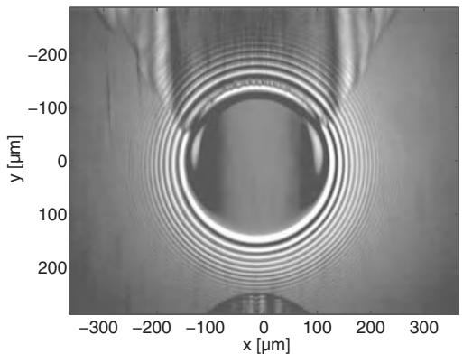  
(a) 0.31 m/s.

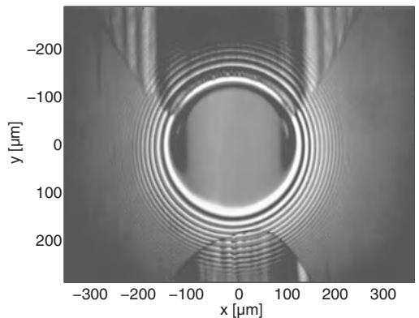  
(b) 0.44 m/s.

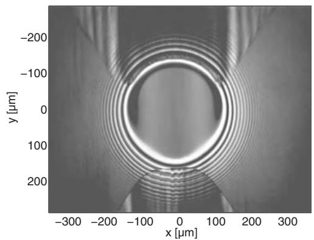  
(c) 0.53 m/s.

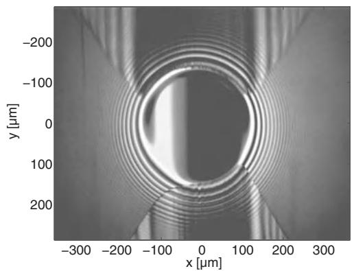  
(d) 0.77 m/s.

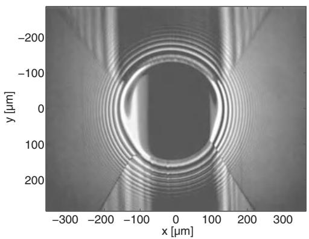  
(e) 1.10 m/s.   
Figure 9.12 Sequence of pictures taken from an interferometry film thickness measurement device showing the approach of the inlet meniscus of a starved EHL contact towards the Hertzian contact with increasing speed [478].

Dowson [244] in 1977 for point contacts. For engineering purposes, this is an inconvenient approach, since the inlet meniscus position is not a practical input parameter.

An alternative approach was followed by Chevalier [123] and Wijnant [610] who numerically solved the starved EHL problem by assuming a layer of oil on the rolling element and ring with specified thickness $\tilde { h }$ . The location of the inlet meniscus is then determined automatically by the continuity condition. In grease-lubricated bearings the functional life is usually at least a thousand hours, which is impossible to solve using these numerical techniques directly. Fortunately, these programs have been used to develop relatively easy to use curve fit equations. For severely starved contacts, semi-analytical expressions have been developed, which can be implemented in simple computer programs relatively easily. Therefore, even more simple models are needed. These simple models for mild and severe starvation will be described below and will be connected to cover the full range in starvation in section 10.2.1 of this book.

# Mild Starvation

Chevalier et al. [124] and Damiens et al. [158] performed many calculations on starved EHL and derived simple expressions for the film thickness in circular and elliptical contacts as a function of the inlet oil layer thickness through curve fitting:

$$
\frac {h _ {c}}{h _ {c f f}} = \frac {r}{\sqrt {\gamma / 1 + r ^ {\gamma}}}, \tag {9.73}
$$

with

$$
r = \frac {2 \tilde {h} _ {\infty}}{h _ {c f f} \bar {\rho} _ {c}}, \tag {9.74}
$$

where

• $h _ { c } =$ central film thickness;   
• $h _ { c f f } =$ central film thickness in the case of fully flooded conditions (e.g. Eq. 9.51);   
• $\tilde { h } _ { \infty } =$ thickness of one of the oil layers in the inlet of the contact;   
• $\bar { \rho } _ { c } =$ ratio of density at maximum Hertzian pressure and density under atmospheric pressure;

Here it is assumed that the layers on both surfaces have equal thickness. The parameter $\gamma$ , representing the resistance to side flow, was found to be determined by a single nondimensional parameter representing the inlet length, see Figure 9.13.

In order to predict the film thickness after repeated overrolling, like in a rolling bearing, the outlet film thickness $h$ , can be used as twice the inlet layer thickness $\tilde { h }$ for the next overrolling (corrected for compressibility). Damiens et al. [158] have done this numerically for 50 overrollings and found a relation for continuous overrolling:

$$
\lim  _ {n \rightarrow \infty} \frac {h _ {c}}{h _ {c f f}} = \lim  _ {n \rightarrow \infty} \frac {1}{\sqrt [ \gamma ]{1 / r _ {0} ^ {\gamma} + n}} \propto n ^ {- \frac {1}{\gamma}}. \tag {9.75}
$$

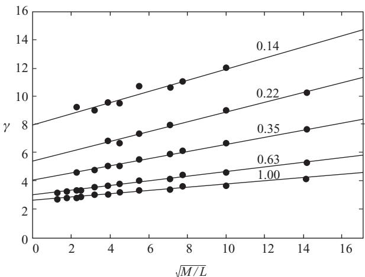  
Figure 9.13 Starvation parameter $\gamma$ as a function of the Moes dimensionless numbers (M, L) and contact ellipticity $( \kappa )$ . This is valid for $r = [ 0 . 5 : 1 . 5 ]$ . Reproduced from Damiens et al., 2004 $©$ ASME.

Obviously, for bearing applications, the time for 50 overrollings is usually very short. For example, in a bearing with 10 rolling elements, running at $1 0 0 0 0 \mathrm { r p m }$ , these 50 overrollings correspond to approximately 0.05 seconds! However, the rate of starvation is not only given by side flow: track replenishment and other effects will reduce the starvation rate and it is plausible that this starvation model applies for longer time periods.

According to Eq. 9.75, at constant speed, the film thickness decreases with time, according to:

$$
h _ {c} (t) \propto t ^ {- 1 / \gamma}. \tag {9.76}
$$

# Severe Starvation

In the case of severe starvation, the inlet length will be very small and difficult to capture accurately using a numerical method. Therefore, as Damiens [156] points out, the numerically obtained results for $\gamma$ are less good for very thin films. In that case, the approach of Van Zoelen et al. [584] will give more accurate results.

Van Zoelen used a different approach to the solution of the starvation problem. Rather than solving Reynolds’ equation for the pressure distribution, he assumed a simple elliptical pressure distribution (the Hertz dry contact solution). The film thickness is then calculated by compressing the layer on the track with this pressure using the Dowson and Higginson relation (Eq. 3.26). So the film thickness will be about $10 { - } 3 0 \%$ of the combined thickness of the layer on the surfaces.

If replenishment is neglected, the layer thickness is reduced in time by side flow caused by the pressure gradients in the contact.

The dry contact pressure assumption is a good approximation, except for mild starvation and very light loads [156, 478, 610]. Grease lubricated bearings are generally running under

starved lubrication conditions, and, very importantly, only in the case of severe starvation do bearing failures occur. Therefore, a high accuracy is primarily required for thin (starved) films.

The starved film thickness is determined by the thickness of the lubricant layers entering the contact. It is assumed that the thickness of these layers is equal to the average layer thickness in the tracks on the solids in contact. The layers with a total length of $l _ { t }$ are averaged over the length of the tracks, but may vary across the track (in y direction). The average layer thickness $\tilde { h } _ { \infty } ( y , t )$ can be calculated using mass conservation:

$$
\frac {\partial \tilde {h} _ {\infty}}{\partial t} = \frac {- 1}{l _ {t} \rho_ {0}} \frac {\partial \hat {q} _ {y}}{\partial y} \tag {9.77}
$$

$\rho _ { 0 }$ is the ambient pressure density of the oil and $\hat { q } _ { y } ( y )$ is the mass flow to the side of the track. For a ball on disc setup with a single rolling element $l _ { t } = 2 \pi R _ { b a l l } + 2 \pi R _ { d i s c }$ . The contribution to the side flow of contact $k$ is obtained by muliplying the unit volume flow per unit length (Eq. 9.23) with the lubricant density and integration over the contact length. Neglecting transverse motion for contact $k$ the side flow reads:

$$
\hat {q} _ {y, k} (y, t) = - \left(\int_ {a ^ {-}} ^ {a ^ {+}} \left(\frac {\rho h ^ {3}}{1 2 \eta} \frac {\partial p}{\partial y}\right) d x\right) _ {k}. \tag {9.78}
$$

The density $\rho$ and the viscosity $\eta$ are determined by the contact pressure $p$ using the Dowson and Higginson relation (Eq. 3.26) and a viscosity–pressure relation (See Chapter 3).

For severely starved contacts, the film thickness $h$ is approximately equal to the combined thickness of the oil layers entering the contact, compressed by the high contact pressure:

$$
h (x, y, t) \approx \frac {2 \rho_ {0} \bar {h} _ {\infty} (y , t)}{\rho (p)}. \tag {9.79}
$$

Here $\rho ( p )$ is the lubricant density determined by the local pressure $p$ in the contact. The pressure distribution resembles the Hertz dry-contact pressure distribution:

$$
p (x, y) = p _ {h} \sqrt {1 - \left(\frac {x}{a _ {x}}\right) ^ {2} - \left(\frac {y}{a _ {y}}\right) ^ {2}}, \tag {9.80}
$$

and the boundaries of an integral of Eq. 9.78 are determined by the boundary of the pressurized region:

$$
a ^ {+} = - a ^ {-} \approx a _ {x} \sqrt {1 - \left(\frac {y}{a _ {y}}\right) ^ {2}}. \tag {9.81}
$$

Using Eqns 9.77, 9.78, 9.79 and 9.80 one obtains:

$$
\hat {q} _ {y} (y, t) = \frac {1}{3} \tilde {h} _ {\infty} ^ {3} \rho_ {0} l _ {t} y \mathcal {F} _ {k} (y), \tag {9.82}
$$

where $\mathcal { F } _ { k } ( y )$ is:

$$
\mathcal {F} _ {k} (y) = \frac {2 \rho_ {0} {} ^ {2} p _ {h} {} ^ {2}}{l _ {t} a _ {v} ^ {2}} \int_ {a ^ {-}} ^ {a ^ {+}} \left((\eta (p)) ^ {- 1} (\rho (p)) ^ {- 2} p ^ {- 1}\right) d x. \tag {9.83}
$$

Using the density pressure relation Eq. 3.26 and the Roelands or Barus viscosity–pressure relation (Eq. 3.19 or Eq. 3.16), the function $\mathcal { F } _ { k } ( y )$ can be approximated by:

$$
\mathcal {F} _ {k} (y) \approx \frac {2}{l _ {t}} \frac {p _ {h}}{a _ {y} ^ {2}} \frac {a _ {x}}{\eta_ {0}} \pi \left(\left(0. 5 \pi \alpha p _ {h} \sqrt {1 - \frac {y ^ {2}}{a _ {y} ^ {2}}}\right) ^ {3 / 2} + 1\right) ^ {- 2 / 3}. \tag {9.84}
$$

A partial differential equation for the layer thickness distribution $\tilde { h } _ { \infty } ( y , t )$ is obtained by substitution of Eq. 9.82 into Eq. 9.77. This equation can be solved numerically, see Van Zoelen et al. [586]. When the layer thickness distribution is symmetrical with respect to the centreline $\mathrm { { y } } = 0 \mathrm { { , } }$ ) an analytical solution for the central layer thickness exists:

$$
\tilde {h} _ {\infty} (0, t) = \frac {1}{\sqrt {\frac {2}{3} \mathcal {F} _ {k} (0) t + \tilde {h} _ {0 , \infty} ^ {- 2}}} \tag {9.85}
$$

$\tilde { h } _ { 0 , \infty }$ is the initial layer thickness in the centre. Next, using Eq. 9.79 an analytical expression can be obtained for the time variation of the central film thickness in the contact:

$$
h _ {c} (t) = \frac {1}{\sqrt {\frac {1}{6} \bar {\rho} _ {c} ^ {2} \mathcal {F} _ {k} (0) t + h _ {c , 0} ^ {- 2}}} \tag {9.86}
$$

$h _ { c , 0 }$ is the initial central film thickness and $\bar { \rho } _ { c } = \rho ( p _ { h } ) / \rho _ { 0 }$

$\mathcal { F } _ { k }$ decreases with increasing load. This means that the rate at which the film reduces in time will decrease with increasing loads! This is caused by the exponential relation between viscosity and pressure. Physically, this means that the side flow from the contact reduces with increasing load due to the rapid increase in viscosity by increasing pressure.

Another surprising phenomenon is the absence of velocity in the equations. The rate of starvation is only a function of time. At high speed, the frequency of overrolling will be greater. However, this has no effect on the side flow and therefore on the rate of starvation. Per unit of time, a partition of the oil layer on the track may be visited more often. However, the duration will be shorter. As mentioned above, this only applies for very thin films. The effect of speed, viscosity and pressure on film thickness for starved and fully flooded contacts is summarized in Table 9.1.

The table illustrates that the impact of pressure, viscosity and speed on the film thickness itself is not straightforward. As an example, an increase in load will result in a slightly smaller initial (fully flooded) film thickness, but a smaller film thickness decay. So the film thickness will be slightly smaller for short time intervals but larger after longer time intervals.

Table 9.1 Impact of speed, viscosity and pressure on the film thickness at a fixed point in time in starved and fully flooded EHL contacts for which the contact pressure is at least $0 . 1 \mathrm { G P a }$ . Increasing pressure leads to a large decrease in $\mathcal { F } _ { k }$ , which increases the film thickness according to Eq. 9.86. Increasing the base oil viscosity $\eta _ { 0 }$ leads to a decrease in $\mathcal { F } _ { k }$ , which leads to an increase in film thickness (Eq. 9.86). Increasing the speed has no impact on the starved film thickness decay unless the initial film thickness $h _ { c , 0 }$ is equal to the fully flooded film thickness.   

<table><tr><td rowspan="2">Input</td><td colspan="2">Effect on film thickness</td></tr><tr><td>Starved,(at fixed time)</td><td>Fully flooded</td></tr><tr><td>p↑</td><td>h↑</td><td>h↓</td></tr><tr><td>η0↑</td><td>h↑</td><td>h↑</td></tr><tr><td>u↑</td><td>h=</td><td>h↑</td></tr></table>

For an accurate prediction of the rate of starvation, the models from Damiens and Van Zoelen should be combined. In essence, both models show the same film thickness decay

$$
h (t) \propto t ^ {- 1 / \gamma}. \tag {9.87}
$$

At the onset of starvation, Damiens’ model is preferred and the power $\gamma$ will be approximately 3 for circular contacts and up to 15 for wide elliptical contacts. For very thin films, as is usually the case in grease lubrication, Van Zoelen’s model is preferred which gives $\gamma = 2$ for all contacts.

# 9.5.3 Base Oil Replenishment

When looking through the glass disc of the above mentioned ball-on-disc set-up, not just the interferometry pictures of the contact can be seen. The shape of the oil layers and flow of the oil in the vicinity of the contact can also be seen. Figure 9.14, from Åstrom¨ et al. [36], shows the typical butterfly shape of oil reservoirs that are formed in the case of limited oil supply and sufficiently high speed. Behind the contact, the film opens up and cavitation occurs in the track. The outlet layer thickness just behind the contact will be approximately equal to the film thickness corrected for compressibility (the oil may be compressed up to $30 \%$ in the contact and will ‘relax’ back as soon as the pressure is relieved behind the contact). In front of the contact, part of the oil is pushed to the side due to the diverging gap across the rolling direction. Next to the track, two ridges, or side bands, are formed. This can also be seen in Figure 9.15. The shading that results from interferometry in the contact also reveals the ‘butterfly shape’ from Figure 9.14.

Some replenishment from the ridges may take place in the inlet of the contact where the ridges are squeezed by the converging gap causing some transverse flow into the inlet of the contact, reducing starvation. Obviously, this is only significant for circular contacts, where these ridges are relatively close to the centre of the running track. In the case of rolling bearings, the contacts are elliptical or even line-shaped, and their contribution to replenishment in the

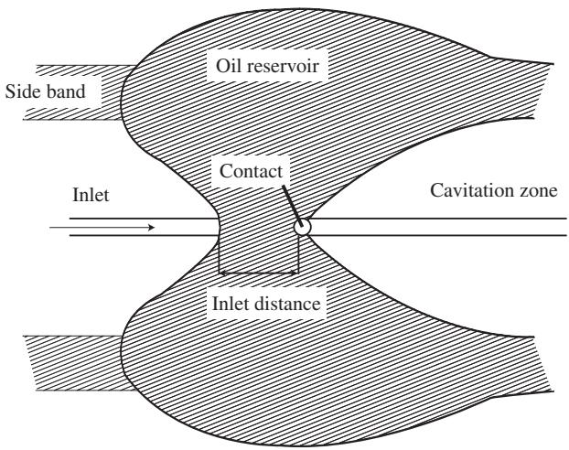  
Figure 9.14 The flow around an oil lubricated point contact at moderate speeds with limited oil supply, showing side bands and oil reservoir. The contact is still fully flooded. Inlet on the left side of the figure. Reproduced from Åstrom,¨ Ostensen and H¨ oglund, 1993¨ $©$ ASME.

centre of the contact is likely to be very small. On the other hand, they may help to prevent film collapse at the sides of the contact close to the ‘fully flooded minimal film thickness’.

The ridges/side bands will not only be formed on the disc but also on the ball. This is clearly visible in Figure 9.16, showing the ball from the ball-on-disc set-up. Figure 9.17 shows the result of CFD calculations where a uniform inlet layer is assumed to feed the contact (Put [482]). These calculations confirm the qualitative measurements of the butterfly shape of the ‘oil reservoir’ and the formation of two distinct ridges behind the contact.

The ridges formed behind the contact may replenish the track due to body forces such as gravity and/or surface tension effects, but also by overrolling of the ridges, see Figure 9.15. The ball runs on a circular disc and, without replenishment, the inlet layer oil distribution would

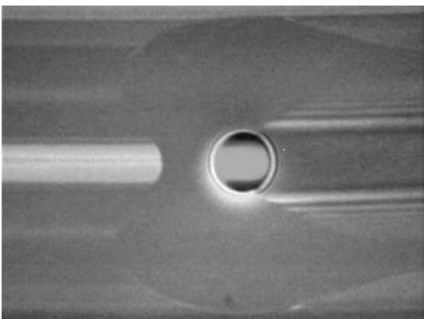  
Figure 9.15 Picture taken through the glass disc in a ball-on-disc rig with limited oil supply, showing the distribution of oil around the contact, as drawn in Figure 9.14. Inlet on the left side of the figure. Courtesy of SKF.

  
Figure 9.16 Ball-on-disc configuration, running under pure rolling conditions and where two layers of oil are visible on the ball adjacent to the contact track. Reproduced with permission from Wedeven Associates, Inc.

be equal to the outlet layer distribution, which clearly is not the case. The figure shows that the outlet layer width is larger than the inlet layer width, indicating that some replenishment has occurred. This phenomenon was modelled in 1974 by Chiu [125], who assumed that the contact was fed by a uniform layer of lubricant. He modelled the replenishment by solving the Stokes equation without any external force and the replenishment driven by surface tension. Later Jacod et al. [298] included Van der Waals forces, which may be important for extremely thin films. They used the same approximation as Chiu for the initial profile of the lubricant profile. Experimental visualization of the flow around an EHL contact was made by Pemberton and Cameron [469], using a very simple camera with a glass disc steel ball set-up and showed two side bands of oil flowing around the contact that form a meniscus around the rear end of the contact. At higher speeds, the two bands no longer merge and the meniscus is split into two side bands, similar to that which can be seen in Figures 9.15 and 9.17.

Guangteng and Spikes [236] also recognized the formation of ridges in their experimental work. With the quantities of lubricant that Chiu [125] was using, they could only get starvation at very high speeds. It should be noted that in Chiu’s model the ridges are assumed to be infinitely wide (uniform layer thickness outside the track).

Recently, thin layer models have been developed by Gershuni et al. [218] for flat surfaces and Van Zoelen et al. [583] for axisymmetric rotating surfaces, where the Van der Waals forces have been neglected and therefore are only applicable for not too thin films $( h > 5 n m$ ). These models have been used to simulate the experiments from Figure 9.18. There is a good agreement between the model prediction and experiment and it is therefore seems justified to neglect Van der Waals forces.

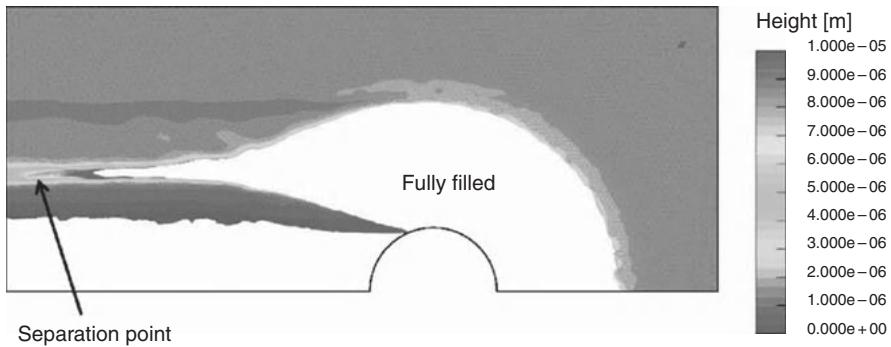  
Figure 9.17 CFD calculation of the flow around the contact of a ball-on-disc set-up (Put et al. [482]). The direction of flow is from right to left (Courtesy University of Twente and SKF).

With the model from Eq. 9.16, the replenishment experiment from Figure 9.18 can be simulated. The ball runs on a circular path where a small amount of oil $1 0 \mu 1 \mathrm { P A O }$ , $\nu = 8 0 \mathrm { c S t }$ ) has been supplied to the contact using a syringe. The result is a track of oil, which consists of a relatively flat thin film with side-bands on both sides, with a distance approximately $1 . 5 \mathrm { m m }$ and with a height of approximately $1 5 \mu \mathrm { m }$ . The experiment has been conducted with a $2 0 \mathrm { m m }$ ball at a speed of $0 . 2 \mathrm { m } / \mathrm { s }$ and a temperature of $2 0 ~ ^ { \circ } \mathrm { C }$ . The ball was running on the disc under pure rolling conditions at ambient temperature. After a number of rotations of the disc it was taken from the ball-on-disc machine and mounted on an optical profilometer to measure the shape of the lubricant layer. After this, two more measurements were taken after 75 and 135 seconds. Figure 9.19 shows the result of the simulation and the excellent agreement with the result of the experiment. This confirms that the thin film approach can be used here and that Van der Waals forces can be neglected in the prediction of this type of replenishment.

# 9.5.4 Starved Grease Lubricated Contacts

# Line Contacts

The measurements from Zhu and Neng [638] show that, with grease as a lubricant and for line contact, film thickness decay only occurs in the first minutes, after which they report a constant

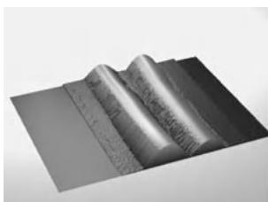  
(a) $\mathrm { { t } = 0 \mathrm { { s } . } }$

  
(b) $\mathrm { t } = 7 5 \mathrm { ~ s ~ }$

  
(c) $\mathrm { t } = 1 3 5 \mathrm { ~ s ~ }$   
Figure 9.18 Height measurement of the two layers formed behind the ball-on-disc contact. The time between the three measurements was 75 and 135 seconds. Reproduced from Gershuni, Larson and Lugt, 2008 $©$ Taylor and Francis Group.

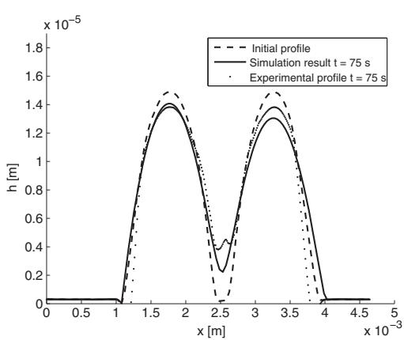

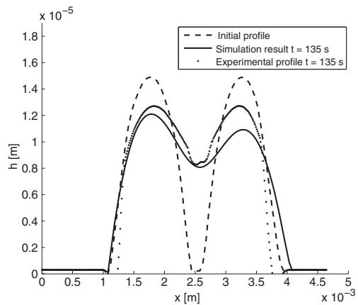  
Figure 9.19 Layer measurement and computed profile after 75 s of replenishment (left graph) and after 135 s of replenishment (right graph). The dashed line represents the initial profile from the experiment. The solid line is the result of the numerical simulation. Reproduced from Gershuni, Larson and Lugt, 2008 $©$ Taylor and Francis Group.

film thickness. This behaviour is ascribed to the Herschel–Bulkey rheology of grease, which will prevent any transverse $y$ -direction) flow in the line contact inlet if the shear stresses are lower than the yield stress. This transverse shear stress in the inlet is induced by a transverse pressure. The relation between pressure and shear stress was earlier derived from the reduced Navier–Stokes equations, using the ‘lubrication’ assumptions (Eq. 9.5) for the transverse (y) direction:

$$
\frac {\partial p}{\partial y} = \frac {\partial \tau}{\partial z}. \tag {9.88}
$$

The shear stress in the centre of the film can be calculated by integrating this equation over z, assuming a constant pressure over z:

$$
\tau = \frac {\partial p}{\partial y} \times \frac {h}{2}. \tag {9.89}
$$

Using a Herschel–Bulkley model and an exponential pressure dependence of the yield stress $\tau _ { y }$ and consistency index $K$ , similar to that used by Kauzlarich and Greenwood (Eqns 9.55 and 9.61), there will be no starvation caused by side flow in the inlet as long as

$$
\frac {\partial p}{\partial y} \times \frac {h}{2} <   \tau_ {y _ {0}} \exp (\alpha p). \tag {9.90}
$$

For line contacts (with finite widths) the pressure gradient across the contact will be very small, leading to a very small side flow mass flux (see Eq. 9.78) and the starvation rate will therefore also be small. In the inlet some of the grease volume will travel through the contacts. Here the shear rates and pressures are very high, which leads to rapid aging and to a reduction of the effective grease viscosity. Ultimately base oil-like rheology will be experienced. After this,

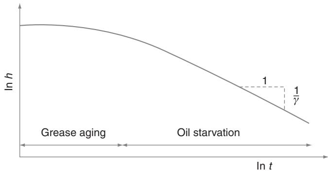  
Figure 9.20 Schematic representation of the film thickness in a grease lubricated contact in the absence of replenishment. Initially, starvation is slow due to the absence of side flow in the inlet and the high ‘grease viscosity’ in the contacts. Later, base oil behaviour will be observed. Note the log-scales, meaning that the first phase is very short and in practice not relevant, except for ultra-low speed operation.

starvation will occur, leading to a film reduction proportional to $h ^ { - 1 / \gamma }$ , similar to Eq. 9.75. So, for grease lubricated contacts the film thickness will stay fully flooded for some time, after which starvation will occur with oil-like character, as shown in Figure 9.20.

# Point Contact

Almost all measurements that can be found in the literature using optical interferometry in point contacts show that starvation occurs in the case of grease lubrication. As with oil, recovery is sometimes reported due to replenishment of the track. Sometimes replenishment is ascribed to base oil replenishment as was addressed in Section 9.5.3. In many cases a more complex behaviour is observed.

Merieux ´ et al. [417] classified grease film thickness (point contact) measurements into four categories, according to their replenishment behaviour:

(a) Fully flooded;   
(b) starved;   
(c) starved with stabilization;   
(d) starved with recovery.

This is schematically shown in Figure 9.21. Lubrication type $( d )$ is caused by grease degradation at the edge of the contact. Grease is pushed to the side by overrolling and the small quantity that is just close enough to the Hertzian contact is sheared during each passage of the ball. The grease thickener structure is thus continuously degrading. Merieux et al. write that the grease here is transformed from a Bingham plastic or Herschel–Bulkley-like material into a more viscous material.

Actually, they use a rheology model defined by Czarny and Moes [151], which is a variant of the Casson model:

$$
\tau = \left[ \tau_ {y} ^ {n} + (K \dot {\gamma}) ^ {n} \right] ^ {1 / n}, \tag {9.91}
$$

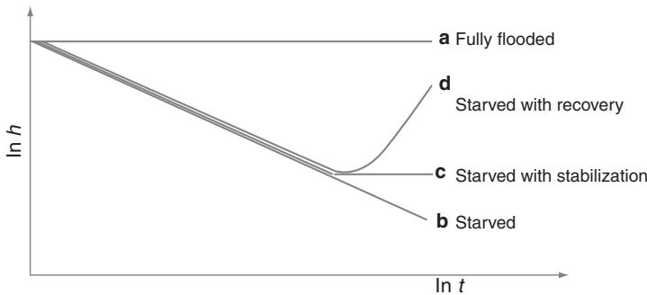  
Figure 9.21 Characteristic starvation behaviour for grease lubrication [417].

where $K$ has the dimension of viscosity. This is combined with a shear degradation model:

$$
\tau_ {y} = \frac {\tau_ {y , 0}}{(1 + \dot {\gamma} t) ^ {\alpha}} \tag {9.92}
$$

with $\tau _ { y , 0 }$ the initial yield stress, $t$ time and $\alpha$ a coefficient. By assuming a triangular velocity profile in the deformed Hertzian geometry and using this degradation model they predict the film thickness decay and replenishment assuming that grease turns into oil as soon as a yield stress of $\tau _ { y } = 4 0 \mathrm { P a }$ is reached. An important conclusion is that the model shows that lubricant availability critically depends on the shear stability of the grease. Unfortunately, they only validated their model with a very limited number of measurements.

In [417] it was also shown that replenishment in single point contacts is not only related to mechanical work, but also related to temperature.

Another effect that could play a role in grease lubricated contacts is the formation of boundary film layers formed by degraded thickener. This means that ‘behaviour c’ in Figure 9.21, that is starvation ultimately leading to a stabilized film, may not necessarily be caused by replenishment. Cann [110] measured the thickness of such films and found that the grease film was composed of two parts; one that is formed by hydrodynamic action and the other formed by a residual layer:

$$
h _ {T} = h _ {R} + h _ {E H L}, \tag {9.93}
$$

with residual films of thickness $6 n m < h _ { R } < 8 0 n m$ . Such films were earlier analyzed by Cann and Spikes [116], showing that significant amounts of thickener are present on the track. It is presumed that this is deposited by grease as it is shear degraded in the contact. The fact that these layers are denoted by ‘residual layers’ indicates that they may be physically or chemically attached to the surface.

# 9.6 Spin

Axial load on ball bearings (deep groove and angular contact) causes a spinning motion of the balls. The effect of spin on starvation is relatively unexplored and no models exist

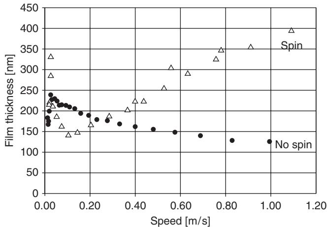

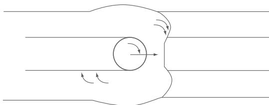  
Figure 9.22 Ball-on-disc measurements of film thickness in a starved contact showing the impact of spin on film thickness. Reproduced with permission from Cann and Lubrecht, 2007 $©$ IOP Publishing Ltd.   
Figure 9.23 Contact on the onset of starvation. Spin-motion causes replenishment of the track.

as of yet. However, film thickness measurements on single contacts have shown that spin reduces/eliminates starvation and is therefore very relevant. Zhu and Neng [638], but also Cann and Lubrecht [115] show a significant effect of spin on film thickness. An example is shown in Figure 9.22. In the absence of spin, the film thickness decreases with time which is ascribed to starvation. In the case of ball spin, starvation occurs at low speed but at higher speed the film thickness linearly increases with speed. In the case of a fully flooded film, the increase would be proportional to approximately $u ^ { 0 . 7 }$ , so at a lower rate than shown in this figure. The higher exponent in the case of spin can be ascribed to an extra film growth due to lubricant supply by transverse shear. Figure 9.23 shows a schematic representation of the motion imposed on the fluid in the case of combined rolling/spin motion. The ridges next to the track are being ‘pulled’ into the track by the spinning motion of the ball, causing at least a reduction of the starvation rate. So far, no models have been developed for starved contacts including spin.

# 10

# Film Thickness in Grease Lubricated Rolling Bearings

P.M. Lugt, M.T. van Zoelen, and C.H. Venner

During most of its operational time grease lubricated rolling bearings are running under starved lubrication conditions. This means that the lubricant film thickness is primarily determined by the lubricant layer thickness in the running tracks. This layer thickness is determined by a flow balance. Lubricant flows outside the track by side flow due to overrolling by the rolling elements with a high pressure, but the layer thickness is also affected by flow due to centrifugal effects, cage scraping, evaporation, occasional oil droplets or grease lumps thrown off from seals/cage/inner-ring, oil bleeding from grease, gravity, surface tension and/or air flow.

A complicating factor is that the physical properties of the grease and of the base oil often change during bearing operation. This may be caused by chemical reactions such as oxidation or by mechanical work.

Intuitively small effects may have a large impact on the film formation, since the required films are so thin that even a small droplet may provide a relatively large contribution to the layer and therefore film thickness.

In this chapter the various aspects of lubricant film formation in a grease lubricated bearing will be described using the theory from Chapter 9 (film thickness for single contacts) as a basis. First the thin layer flow models from Chapter 9 will be applied to bearing surfaces, considering the flow due to centrifugal effects, in normal and tangential directions respectively. The normal component may cause droplets to be thrown off from surfaces or may cause a smoothing effect of the layers, depending on the direction of the normal force on the surface. The tangential component will cause a flow along the surface. Next, the single contact EHL theory will be applied to a complete bearing geometry. In a full bearing, surface layers are merging and separate before and after multiple outer-ring– and inner-ring–rolling element contacts. The layers are overrolled/pressurized by multiple contacts, each with different contact conditions (except for a pure axially loaded bearing). The single contact theory can therefore not be applied directly.

The scraping effect of a cage may have an impact on the film thickness. The difference between scraping oil and grease will be shown here through experiments. Following the discussion of these mechanical aspects some chemical aspects will be described. The film build-up and flow properties of an oil are mainly determined by the viscosity. Oxidation of oil leads to polymerization and therefore to a change in viscosity.

The mechanism determining the lubricant film thickness in rolling bearings is so complex that no simple engineering formulae exist. In this chapter the various aspects of lubricant film formation are described and models are given, where available. For a given application they may be combined according to their specific significance.

# 10.1 Thin Layer Flow on Bearing Surfaces

In this section the thin layer flow models, that were derived in Chapter 9, Page 191, will be applied to bearing surfaces. The driving forces for flow in free layers are the body force, air flow and forces caused by surface tension, whereas the resistance to flow is determined by the viscosity. The surface tension effect and the normal component of the body forces may only be relevant if the free surface or solid surface is significantly curved. This applies to the ridges of oil that are formed by side flow from the contacts and which will be located next to the track, on nonsmooth surfaces or in areas such as the undercut in bearing flanges. For relatively smooth layers these effects can be neglected. For an inclined surface the oil will flow due to the presence of a tangential body force. In that case the flow of thin uniform layers can be described with Eq. 9.17 whereas the replenishment effect by, for example, the ridges can be described with Eq. 9.16.

# 10.1.1 Contact Replenishment in Bearings

As mentioned in Section 9.5, the EHL contacts in a bearing will cause side flow, driven by the pressure gradients inside the contacts. In a rolling bearing, the forces on the ridges can be quite different from those in the ball-on-disc experiment. On the inner-ring raceway, the centrifugal normal forces will cause a growth of the ridges, where the oil may ultimately be thrown off the surface. This is illustrated in Figure 10.1, where a simulation of the flow of the ridges on a cylindrical inner-ring is shown. The ridges have the same dimensions as in the ball-on-disc experiment from Figure 9.18. The ring is rotating such that a centrifugal acceleration of $1 0 \mathrm { m } / \mathrm { s } ^ { 2 }$ is generated. The figure clearly shows that the ridge is thinning rather than widening over the surface. These results show that replenishment of the track, driven by

  
Figure 10.1 Cross-section of the lubricant layer behind the contact under conditions typical for the ball-on-disc machine, with similar oil and temperature as in Figure 9.19 but with normal force $f _ { z } = 1 0 \rho$ , for $t = 0 , t = 1 0 ^ { 5 } , t = 1 0 ^ { 6 }$ $t = 0$ and $t = 5 \cdot 1 0 ^ { 6 }$ seconds. Note that the scale is different for the different plots. Reproduced from Gershuni, Larson and Lugt, 2008 $©$ Taylor and Francis Group.

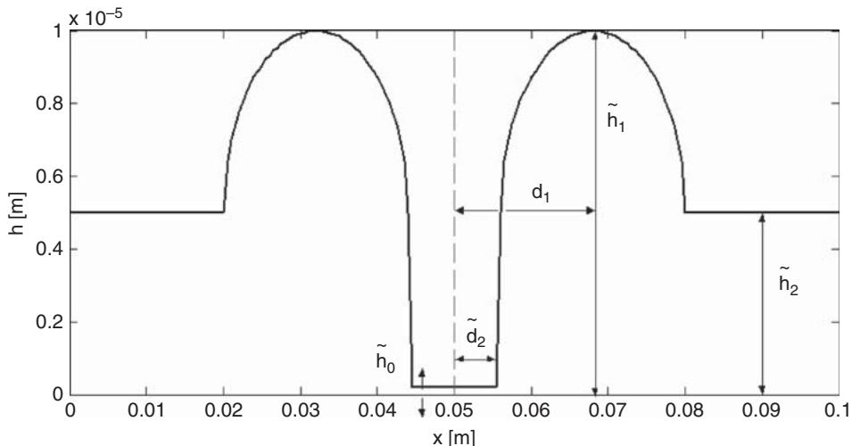  
Figure 10.2 General description of the initial profile before replenishment. Reproduced from Gershuni, Larson and Lugt, 2008 $©$ Taylor and Francis Group.

Table 10.1 Definition of three cases for a parametric study for the replenishment time for outer ring rotation in a NJ 312 bearing. $d _ { 1 }$ is half the distance between the ridges, $d _ { 2 }$ is the initial track width, $\tilde { h } _ { 0 }$ is the layer thickness in the centre of the track, $\tilde { h } _ { 1 }$ is the initial height of the ridge and $\tilde { h } _ { 2 }$ is the height of the oil layer next to the ridges, as shown in Figure 10.2. Reproduced from Gershuni, Larson and Lugt, 2008 $©$ Taylor and Francis Group.   

<table><tr><td>Case</td><td>d1[m]</td><td>d2[m]</td><td>h0[m]</td><td>h1[m]</td><td>h2[m]</td></tr><tr><td>1</td><td>12 × 10-3</td><td>3 × 10-3</td><td>2 × 10-7</td><td>10-5</td><td>5 × 10-4</td></tr><tr><td>2</td><td>9 × 10-3</td><td>4 × 10-3</td><td>2 × 10-6</td><td>10-4</td><td>5 × 10-5</td></tr><tr><td>3</td><td>9 × 10-3</td><td>4 × 10-3</td><td>2 × 10-6</td><td>10-4</td><td>2.5 × 10-5</td></tr></table>

centrifugal or surface tension forces on the inner ring of a cylindrical bearing will not take place in practice. As an example, for a NJ 312 bearing,1 at the very low speed of 200 rpm the centrifugal acceleration will reach a value of $1 7 \mathrm { m } / \mathrm { s } ^ { 2 }$ , so this type of replenishment can indeed be neglected at very low speeds. In the case of outer-ring rotation, this will be different. Here the replenishment will be accelerated by the centrifugal forces as they are directed towards the surface. Gershuni et al. [218] investigated the replenishment of the running track of the outer-ring of a NJ 312 bearing, by oil layers on which a normal (centrifugal) force is acting. The configuration and notation is shown in Figure 10.2 and the dimensions of the layers for the three cases are shown in Table 10.1. The time until total replenishment was calculated, that is, the time at which the centre of the track layer thickness started to be affected by replenishment. The result is plotted in Figure 10.3. In order for replenishment to be effective, the calculated times should be compared to the time between overrollings. For the example here

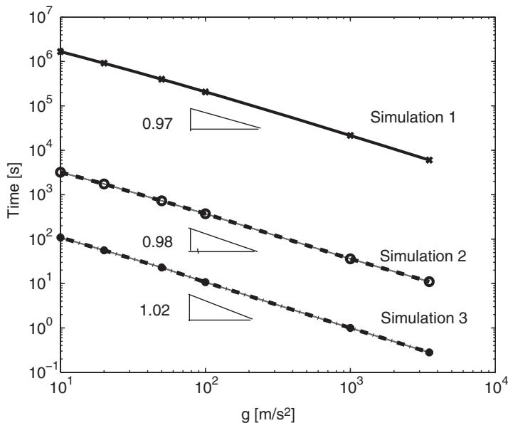  
Figure 10.3 Replenishment time as a function of the centrifugal acceleration for outer ring rotation for a NJ 312 bearing configuration, with oil viscosity $\nu = 8 0 \mathrm { c S t }$ . The three simulations represent the dataset from Table 10.1. Reproduced from Gershuni, Larson and Lugt, 2008 $©$ Taylor and Francis Group.

(NJ 312 bearing) the time between overrolling are in the order of milliseconds (0.005 second at $n = 2 0 0 0 \mathrm { r p m } _ { . }$ ), which is much smaller than the replenishment times calculated here.

All three calculations show a linear behaviour on a log-log scale with a slope of $^ { - 1 }$ . With the centrifugal acceleration $f _ { z } \sim n ^ { 2 }$ , this means that the replenishment time versus speed $n$ will be a straight line with slope $^ { - 2 }$ on a log-log plot.

From the results shown in this section, the following conclusions can be drawn. The replenishment driven by centrifugal and surface tension forces on ridges of oil inbetween rolling elements of cylindrical bearings is too slow to give a significant contribution to a reduction of the starvation rate in rolling bearings. On the inner-rings, the centrifugal forces are generally so high that a thinning effect of the ridges may occur, ultimately leading to oil being thrown off. In the case of outer-ring rotation, the centrifugal forces on the ridges on the outer ring may promote replenishment, depending on speed, size of contact and base oil viscosity. However, for the bearing investigated here (NJ 312), this effect is not significant for outer-ring rotation.

Replenishment may be significant immediately in the outlet of the rolling element–ring contact, where dynamic effects may occur, including droplet formation. In case of a pronounced osculation, capillary effects may be significant along with other tangential pressures due to the opening of the film. However, it is important to realize that the time between passages is very small and that every passage will cause side flow opposing the replenishment. It is therefore very unlikely that replenishment due to centrifugal forces and surface tension will play a role.

These conclusions only apply to the flow in thin oil layers. The flow in a grease lubricated bearing may be more complex. Moreover, these conclusions do not apply when the centrifugal

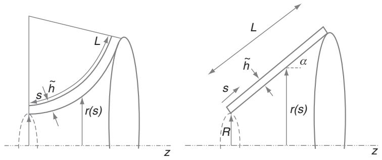  
Figure 10.4 Schematic representation of a thin layer of oil on a rotating inner ring of a spherical roller bearing and tapered roller bearing (respectively). Reproduced from van Zoelen et al., 2008 $©$ ASME.

force has a tangential component, that is driving the lubricant along the surface. In this case this flow will be competing with the pressure induced side flow from the EHL contacts. Here the time between overrollings will determine the significance of this effect. This tangential flow is the topic of the next section.

# 10.1.2 Thin Layer Flow Induced by Centrifugal Forces

In Section 10.1.1 it was shown that there is hardly any flow back onto the tracks due to surface tension effects and the normal component of the centrifugal force. The loss of oil on the raceways may be even more severe when the centrifugal forces, working on the oil layers, have a tangential component. In that case oil may be lost by an inherent ‘pumping effect’, causing an increase of the starvation rate. This effect is significant for bearing types such as TRB (tapered rolling bearings), SRB (spherical rolling bearings) and ACBB (angular contact ball bearings). In this section the free surface thin layer flow will be described on a single bearing component. Later, the flows on the various components will be combined.

Figure 10.4 shows an inner ring, rotating with angular velocity $\omega$ (rad/s), covered by a thin layer of oil, where the layer is assumed to be initially relatively smooth with constant thickness, $\tilde { h }$ . In the case of rotation, a body force $f _ { s }$ , which is the tangential component of the centrifugal force, will cause a flow. Rotational symmetry applies and the thickness of the layer can only vary as a function of the coordinate $s$ along the surface of the ring. If the layer is relatively smooth,2 the surface tension effects may be neglected and, other than in Section 9.5.3, the normal component of the centrifugal force working on the oil layer can be neglected. For this configuration Van Zoelen et al. [583] rewrote the thin layer Eq. 9.17 into:

$$
\frac {1}{3 \eta} \frac {1}{r} \frac {\partial}{\partial s} \left(r \tilde {h} ^ {3} f _ {s}\right) + \frac {\partial \tilde {h}}{\partial t} = 0, \tag {10.1}
$$

with the tangential component of the centrifugal force:

$$
f _ {s} = \rho \omega^ {2} r \frac {\partial r}{\partial s}. \tag {10.2}
$$

This equation can be solved using the method of characteristics [582, 583].

For the tapered roller bearing inner-ring configuration (see Figure 10.4) an analytical solution could be found when there is no feed of oil. Hence, the layer thickness is zero at the smaller diameter side of the ring and the fluid can leave the domain freely at $s = L$ . The solution then reads:

$$
\tilde {h} (s, t) = \sqrt {\frac {3 \eta}{4 \sin^ {2} (\alpha) \rho \omega^ {2} t} \left(1 - \frac {1}{\left(\frac {\sin \alpha}{R} s + 1\right) ^ {4 / 3}}\right)} \quad \text {a n d} \quad \frac {\tilde {h}}{\tilde {h} _ {i}} \leq 1, \tag {10.3}
$$

with $\tilde { h } _ { i }$ being the initial layer thickness.

This solution is illustrated in Figure 10.5, where the layer thickness on the raceway of a tapered roller bearing inner-ring is plotted for various times. The initial layer thickness was $4 0 \mu \mathrm { m }$ . This figure shows that the layer thickness decreases in time and that the measurements of the layer thickness, which were made with a WYKO interferometer, correspond very well with the calculations. At the start of the measurements it was impossible to obtain a smooth uniform layer. The discrepancy between calculations and measurements can be ascribed to the fact that flow was obstructed by a dry area at $s > 0 . 0 1 4 \mathrm { ~ m ~ }$ . After half an hour the layer becomes very smooth at the smaller diameter side of the ring surface and a perfect fit between model and measurements can be seen. The smooth domain of the layer grows in time and the nonsmooth part of the layer moves to the larger diameter where it will ultimately be thrown

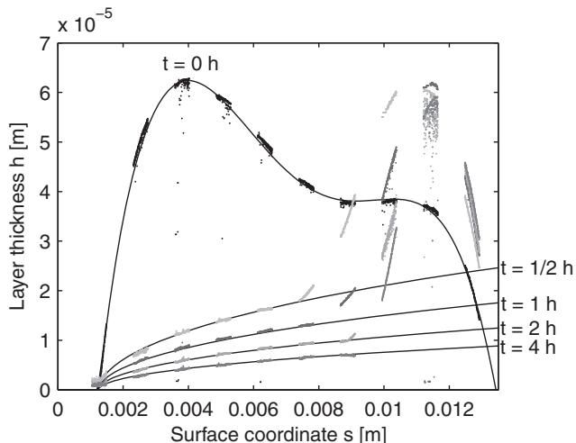  
Figure 10.5 Solution of Eq. 10.3 and measurements for the layer thickness on a raceway of a tapered roller bearing inner-ring $\mathrm { ( L = 1 } 3 . 5 \ : \mathrm { m m }$ ; $\mathrm { R } = 2 5 . 4 \ : \mathrm { m m }$ ; $\alpha = 1 0 . 9 ^ { \circ }$ , ν 1370 cSt (1.25 Pa s). The drawn lines are the model calculations and the dots denote measured values. Reproduced from van Zoelen et al., 2008 $©$ ASME.

off; then the model from Section 10.1.1, where the normal component of the centrifugal force was included, should be applied.

# 10.1.3 Combining the Thin Layer Flow on the All Bearing Components

The centrifugal force induced thin layer flow will act on all rotating parts in a bearing and can be solved individually with Eq. 10.1. Interaction between layers takes place in the contacts between rollers and rings, when they merge in the inlet and separate out again into two layers with equal thickness in the outlet [585]. The flow on rolling elements is quite complex due to the combination of rotation around the rolling element axis and the rotation around the inner-ring (planetary rotation). These aspects have been described in detail by Van Zoelen et al. [585] and the reader is referred to this paper for more details.

The thin layer theory was applied here to spherical roller bearings and tapered roller bearings to predict the net flow, that is, the ‘pumping action’ that is induced by the centrifugal forces on all rotating elements. It was shown in [585] that the solution of the flow equations is bearing size independent, provided that the bearings with different sizes are identical (same number of rolling elements etc.). A master curve could be obtained describing the ‘pumping action’ for spherical roller bearings, which is shown in Figure 10.6. Here, the relative layer decay $\tilde { h } / \tilde { h } _ { i }$ is plotted as a function of a dimensionless time $t / \tau _ { c }$ , where the characteristic time $\tau _ { c }$ is defined as:

$$
\tau_ {c} = \frac {\eta}{\rho \omega^ {2} \tilde {h} _ {i} ^ {2}}. \tag {10.4}
$$

The fact that the curves do not overlap is ascribed to the fact that different bearings with different sizes have differences in geometrical aspects. This effect is illustrated in Figure 10.6 for a 30310 tapered roller bearing where different curves are obtained for different contact angles $\alpha ^ { \prime }$ .

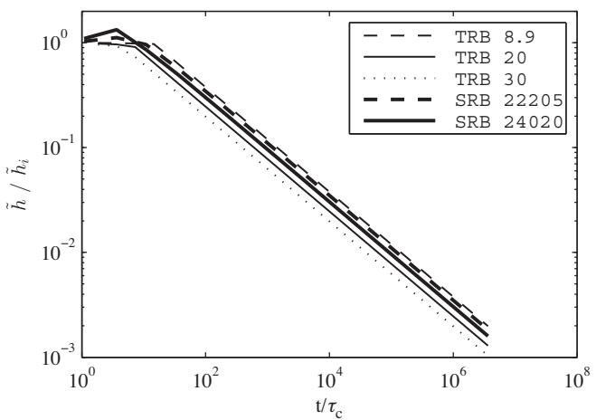  
Figure 10.6 Scaled layer thickness $( \tilde { h } / \tilde { h } \dot { \iota } )$ as a function of scaled time $t / \tau$ for the centre of the rollers for spherical roller bearings (SRB) and tapered roller bearings (TRB) with inner-ring rotation. SRB (22205 and 24020) (thick lines) – TRB (30310 [8.9◦, $2 0 ^ { \circ }$ , 30◦]) (thin lines).

As an indication of the significance of film reduction due to this pumping action an example can be given. Take a base oil $\eta / \rho = 5 \times 1 0 ^ { - 6 }$ (≈5 cSt), 10 000 rev/min $( { \approx } 1 0 0 0 ~ \mathrm { r a d / s } )$ . An initial layer of $\tilde { h } _ { i } = 1 \mu \mathrm { m } ( 1 \times 1 0 ^ { - 6 } \mathrm { m } )$ then gives a characteristic time of $\tau _ { c } = 5 \mathrm { s } .$ . The initial layer has lost $90 \%$ of its thickness at $\tilde { h } / \tilde { h } _ { i } = 0 . 1$ , which corresponds to $t / \tau _ { c } \approx 1 0 ^ { 3 }$ , so after 1.4 hours, which is quite a short time and makes this effect significant.

# 10.2 Starved EHL for Rolling Bearings

In Section 9.5.1, starvation models in single concentrated contacts were described. Starvation was the result of side flow of oil from the contact into the area next to the running track, in combination with insufficient replenishment. The result is a decreasing film thickness in time. It was shown in Section 9.3 that the fully flooded film thickness weakly depends on the contact load $( h \propto F ^ { - 0 . 0 6 7 }$ ). This means that the fully flooded film thickness will be quite similar for all rolling contacts in a bearing and that the thinnest film can be calculated simply by applying a film thickness formula to the highest loaded contact. This does not apply in the case of starvation. It was explained in Section 9.5.1, that the rate of film decay significantly depends on the pressure in the film, through the exponential relation between pressure and oil viscosity. The side flow is pressure driven, so its rate is inversely proportional to the viscosity. Generally in a rolling bearing, the contact pressure varies along the circumference with different loads on the inner-ring and the outer-ring. Also, each contact contributes to the decrease of the available lubricant in the track. Therefore, to calculate the film thickness in the case of starvation, all contacts need to be taken into account.

The load distribution can be calculated using the formulae from Harris [249] or from de Mul et al. [162]. As an example, Figure 10.7 shows the contact pressures on inner-ring and outer-ring contacts in a 6204 deep groove ball bearing running in a standard $\mathrm { R 0 F } ^ { 3 }$ test. Due to the combined load, all balls are in contact but with different contact pressure.

# 10.2.1 Central Film Thickness

# Lightly Starved Contacts

The onset of starvation without reflow/replenishment can be described using Damiens et al. [158]’s model, as described in Section 9.5.1, Eq. 9.73. Here the rate of starvation is expressed in the number of lubricant layer overrollings, n.

$$
h _ {c s} = h _ {c f f} \left(r _ {0} ^ {- \gamma} + n\right) ^ {- 1 / \gamma}, \tag {10.5}
$$

where $r _ { 0 }$ is the ratio of the layer thickness and uncompressed fully flooded film thickness before the first overrolling:

$$
r _ {0} = \frac {2 \tilde {h} _ {\infty}}{h _ {c f f} \bar {\rho} _ {c}} \tag {10.6}
$$

  
Figure 10.7 Contact pressures in a 6204/C3 deep groove ball bearing running under combined load conditions $F _ { r } = 5 0 \mathrm { N }$ ; $F _ { a } = 1 0 0 \mathrm { N }$ , R0F test rig configuration).

at $t = 0$ . Damiens’ model was developed for successive overrollings of a single contact. In the case of a rolling bearing the oil layers are overrolled by contacts with different size and contact pressures (with the exception of a pure axially loaded bearing). However, in this subsection it is assumed that all contacts in a bearing are equal and that the contact size and pressure will be equal to the highest loaded contact. For a complete bearing the time between successive overrollings is $2 d _ { r r } / u _ { s }$ , with $d _ { r r } = z / ( \pi d _ { m } )$ the distance between rolling elements and $u _ { s }$ , the entrainment (sum) velocity. So $n = u _ { s } t / ( 2 d _ { r r } ) .$ . The number of overrollings on the rolling elements is $n = \frac { u _ { s } } { 2 \pi d _ { r } } t$ u s . The number of overrollings between roller and inner-ring is found by averaging these two quantities and multiplying by two to include the outer-ring roller contacts.

By assuming a fully flooded film thickness at $t = 0$ , a good approximation for $r _ { 0 }$ would be $r _ { 0 } = 1$ , so the film thickness is given by:

$$
h _ {c s} = h _ {c f f} \left(1 + \frac {u _ {s}}{2 \pi} \left(\frac {z}{d _ {m}} + \frac {1}{d _ {r}}\right) t\right) ^ {- 1 / \gamma} \tag {10.7}
$$

$$
h _ {c s} = \left(\frac {u _ {s}}{2 \pi h _ {c f f} ^ {\gamma}} \left(\frac {z}{d _ {m}} + \frac {1}{d _ {r}}\right) t + h _ {c f f} ^ {- \gamma}\right) ^ {- 1 / \gamma} \tag {10.8}
$$

$$
h _ {c s} = \frac {1}{\sqrt [ \gamma ]{C _ {D} t + h _ {c f f} ^ {- \gamma}}} \tag {10.9}
$$

with

$$
C _ {D} = \frac {u _ {s}}{2 \pi h _ {c f f} ^ {\gamma}} \left(\frac {z}{d _ {m}} + \frac {1}{d _ {r}}\right).
$$

Unfortunately, the work from Damiens is limited to ellipticity ratios of $\kappa > 0 . 1 4$ , meaning relatively narrow contacts and relatively low loads $M < 1 0 0 0$ , whereas in bearings generally $M$ is much larger and $\kappa$ much smaller. As an example, for a spherical roller bearing 22205 $\ ' d _ { m } = 0 . 0 3 6 m$ , $d _ { r } = 0 . 0 0 7 1 m$ , $z = 1 5$ , loaded with a pure radial load of 900N (minimum load of this bearing, $\mathrm { C } / \mathrm { P } = 5 0 $ ), the ellipticity ratio of the highest loaded inner-ring contact is $\kappa = 0 . 0 4 .$ . If the bearing runs at $5 6 0 0 \mathrm { r p m }$ and $\mathrm { T } = 1 2 0 { } ^ { \circ } \mathrm { C }$ , the entraining velocity is $u _ { s } =$ $1 1 ~ \mathrm { m / s }$ and for a typical grease with base oil viscosity $\eta = 0 . 0 0 5 2 \mathrm { P a } \mathrm { ~ s ~ }$ , the Moes numbers are $M = 5 0 0 0$ , $L = 1 3$ . This gives $C _ { D } = 9 4 8 h _ { c f f } ^ { - \gamma }$ , with $h _ { c f f } = 0 . 1 4 \mu \mathrm { m }$ . Using the data from Damiens for the widest contacts they took into account, that is $\kappa = 0 . 1 4$ , a fit can be made:

$$
\gamma \approx \frac {0 . 4 \sqrt {M / L} + 8}{0 . 8} r + 4. \tag {10.10}
$$

Only mild starvation is considered, say $0 . 1 < r < 1$ . For the 22 205 bearing example, this would then give $\gamma = 5 . 8$ for $r = 0 . 1$ . At the onset of starvation this number will be much larger and the rate of starvation will therefore be lower. While starvation proceeds, $r$ decreases and the rate of starvation will also increase through the decrease in $\gamma$ . This leads to $C _ { D } = 1 . 3 \times 1 0 ^ { 4 3 }$ . This increasing starvation rate will ultimately lead to an asymptotic solution where $C _ { D }$ and $\gamma$ will be constant, which will be shown in the next section.

# Severely Starved Contacts

When the contacts are severely starved, the model from Section 9.5.1 on Page 212, can be used to calculate the film thickness. Each rolling element–raceway contact in the bearing contributes to the decay of the layer thickness in the tracks on the raceways and the rolling elements. As in the single contact model the average layer thickness in the tracks is defined by:

$$
\frac {\partial \tilde {h} _ {\infty}}{\partial t} = \frac {- 1}{l _ {t} \rho_ {0}} \frac {\partial \hat {q} _ {y}}{\partial y} \tag {10.11}
$$

$\rho _ { 0 }$ is the ambient pressure density of the oil and $\hat { q } _ { y } ( y )$ is the mass flow to the side of the track. For a bearing the total track length is:

$$
l _ {t} = n _ {r} 2 \pi R _ {\text {r o l l i n g e l e m e n t}} + 2 \pi R _ {\text {i n n e r r a c e w a y}} + 2 \pi R _ {\text {o u t e r r a c e w a y}}. \tag {10.12}
$$

Here $n _ { r }$ is the number of rolling elements. The side flow in the track is the sum of the contributions of each contact:

$$
\hat {q} _ {y} (y, t) = \frac {1}{3} \tilde {h} _ {\infty} ^ {3} \rho_ {0} l _ {t} y \mathcal {F} (y), \tag {10.13}
$$

with:

$$
\mathcal {F} (y) = \sum_ {k = 1} ^ {n _ {c}} \mathcal {F} _ {k} (y), \tag {10.14}
$$

where $n _ { c } = 2 n _ { r }$ is the number of contacts in the bearing. $\mathcal { F } _ { k } ( y )$ is the same as for the single contact case and can be approximated by:

$$
\mathcal {F} _ {k} (y) \approx \frac {2}{l _ {t}} \frac {p _ {h}}{a _ {y} ^ {2}} \frac {a _ {x}}{\eta_ {0}} \pi \left(\left(0. 5 \pi \alpha p _ {h} \sqrt {1 - \frac {y ^ {2}}{a _ {y} ^ {2}}}\right) ^ {3 / 2} + 1\right) ^ {- 2 / 3}. \tag {10.15}
$$

The contact size parameters $a _ { x }$ and $a _ { y }$ and the pressure $p _ { h }$ depend on the load. The contact load may vary over the circumference of the bearing, for example when a radial bearing load is applied. Assuming that the average layer thickness will hardly change during one revolution of the bearing, it is justified to take the side flow in each contact averaged over the circumference of the bearing:

$$
\mathcal {F} _ {k} (y) = \frac {1}{2 \pi} \int_ {0} ^ {2 \pi} \bar {\mathcal {F}} _ {k} (y, \Psi) d \Psi \tag {10.16}
$$

$\bar { \mathcal { F } } _ { k } ( y , \Psi )$ is calculated using Eq. 10.15 with $a _ { x } = a _ { x } ( F )$ , $a _ { y } = a _ { y } ( F )$ and $p _ { h } = p _ { h } ( F )$ and the contact load $F = F ( \Psi )$ depends on the position along the bearing circumference $\Psi$ .

Similarly to the single contact a partial differential equation for the layer thickness distribution $\tilde { h } _ { \infty } ( y , t )$ is obtained by substitution of Eq. 10.13 into Eq. 10.11. This equation can be solved numerically, see Van Zoelen et al. [583]. However, when the layer thickness distribution is symmetrical with respect to the centreline $( y = 0$ ) it is possible to solve this equation analytically for the track centre. The solution reads:

$$
\tilde {h} _ {\infty} (0, t) = \frac {1}{\sqrt {\frac {2}{3}} \mathcal {F} (0) t + \tilde {h} _ {0 , \infty} ^ {- 2}} \tag {10.17}
$$

$\tilde { h } _ { 0 , \infty }$ is the initial layer thickness in the centre. An analytical expression is obtained for the time variation of the central film thickness in one of the contacts:

$$
h _ {c} (t) = \frac {1}{\sqrt {\frac {1}{6} \bar {\rho} _ {c} ^ {2} \mathcal {F} (0) t + h _ {c , 0} ^ {- 2}}} \tag {10.18}
$$

$h _ { c , 0 }$ is the initial central film thickness and $\bar { \rho } _ { c } = \rho ( p _ { h } ) / \rho _ { 0 }$ , where $p _ { h }$ is the pressure in the contact of interest. The density $\rho$ can again be calculated using the Dowson and Higginson equation:

$$
\rho (p) = \rho_ {0} \frac {5 . 9 \times 1 0 ^ {8} + 1 . 3 4 p}{5 . 9 \times 1 0 ^ {8} + p}. \tag {10.19}
$$

# 10.2.2 Combining Lightly Starved and Severely Starved

For convenience, the equation for lightly starved contacts (Eq. 10.9) is repeated here:

$$
h _ {c s} = \frac {1}{\sqrt {\gamma C _ {D} t + h _ {c f f} ^ {- \gamma}}} \tag {10.20}
$$

with

$$
C _ {D} = \frac {u _ {s}}{2 \pi h _ {c f f} ^ {\gamma}} \left(\frac {z}{d _ {m}} + \frac {1}{d _ {r}}\right).
$$

The transition from lightly starved to severely starved is assumed to occur at a fraction of the central fully flooded film thickness, $h _ { t r } = c _ { t } \cdot h _ { c f f }$ . Substitution in Eq. 10.20 gives the time at which this transition starts:

$$
t _ {t r} = \frac {1}{C _ {D}} \left(c _ {t} ^ {- \gamma} - 1\right) h _ {c f f} ^ {- \gamma}. \tag {10.21}
$$

The equation for severely starved contacts then reads:

$$
h _ {c s} = \frac {1}{\sqrt {\frac {1}{6} \bar {\rho} _ {c} ^ {2} \mathcal {F} (0) \left(t - t _ {t r}\right) + \left(c _ {t} h _ {c f f}\right) ^ {- 2}}}. \tag {10.22}
$$

Figure 10.8 shows the film thickness, combining these two equations, where the transition from Damiens to Van Zoelen has been chosen at $h _ { t r } = 0 . 1 h _ { c f f }$ and $r = 0 . 1$ .

This figure clearly shows the transition in slope (on a log-log scale) from $- \gamma$ for the Damiens model to 1/2 for the model from Van Zoelen.

  
Figure 10.8 Combination of Damiens’ model for lightly starved and Van Zoelen’s model for severely starved contacts for the 22 205 bearing example (5600 rpm, $\mathrm { C } / \mathrm { P } = 2 0 $ ).

In order to provide a smooth transition between the two models the following equation can be used:

$$
h = h _ {Z} + \frac {h _ {D} - h _ {Z}}{1 + \left(t / t _ {\mathrm {t r}}\right) ^ {m}} \tag {10.23}
$$

where $t _ { t r }$ is obtained from Eq. 10.21. Here $h _ { Z }$ and $h _ { D }$ are the central starved film thicknesses according to the model from van Zoelen (Eq. 10.22) and Damiens (Eq. 10.20). The parameter $m$ is a transition parameter where large values will lead to a sharp transition. Here $m = 3$ i s chosen. This equation is adopted from the friction work from Bongaerts et al. [89].

The choice of the starting layer thickness in the model from Van Zoelen $( c _ { t } h _ { c f f } )$ has no impact on the resulting film thickness at longer times. This is an important observation. After all, the Van Zoelen model has been derived for severely starved contacts and should therefore not be applied in the case of mild starvation. The work described above shows that the error for larger films has no impact on the accuracy of the prediction for very thin films.

In the case of relatively thick layers, the overall side flow is governed by side flow in the inlet of the contact (bow-wave), in addition to the side flow from inside the Hertzian contacts (high pressure flow). The Damiens model takes into account both phenomena and therefore leads to a faster decay than the prediction according to Van Zoelen, who only incorporated side flow from the Hertzian contact itself. This is not obvious from the equations. After all, both models show identical behaviour after the starting up phase (for the example here after less than a second) that is:

$$
h \sim t ^ {- \frac {1}{\gamma}} \quad \text {V a n Z o e l e n :} \gamma = 2 \quad \text {D a m i e n s :} \gamma > 2. \tag {10.24}
$$

However, there is a very large difference in the magnitude of the proportionality constants $\begin{array} { r } { ( C _ { D } \gg \frac { 1 } { 6 } \bar { \rho } _ { c } ^ { 2 } \mathcal { F } ( 0 ) ) } \end{array}$ , which makes Eq. 10.24 not valid for relatively short times. The decay rate is smaller for Damiens’ model at longer times where this time is in the order of seconds, as for the example from Figure 10.8. Damiens’ model has been developed for a very small number of overrollings and at these larger times (so after many overrollings) the model is not valid anymore (when there is no replenishment).

# 10.3 Cage Clearance and Film Thickness

So far only the contacts between rolling elements and rings, the EHL contacts, have been considered. However, the clearance between a rolling element and cage pocket may effect the lubricant film thickness as well. The load on the contact between cage and rolling element is relatively low, making this sensitive to film breakdown due to side flow. This, in combination with pure sliding, makes these contacts sensitive to wear. This topic is the main research theme for these contacts and the impact on the lubricant layer distribution is relatively unexplored.

Damiens et al. [157] did experiments on an optical ball-on-disc machine where they mounted a cage segment with a ball on a glass disc and measured the film thickness. With oil lubrication, Figure 10.9, the cage element always decreases the film thickness. There is no clear relation between cage clearance and film thickness. In the case of grease lubrication the opposite can be observed. Figure 10.10 shows that the film thickness with the cage is maintained for longer, that is, starvation is postponed to higher speeds. There is a clear relation between clearance

  
Figure 10.9 Film thickness as a function of speed for a single contact with cage element lubricated by base oil only. The drawn line is the fully flooded film thickness. The legend denotes the clearance between cage and ball. The cage scraping effect reduces the film thickness. Reproduced from Damiens, Lubrecht and Cann, 2004 $©$ Taylor and Francis Group.

and film thickness where reducing the clearance leads to thicker films. This indicates that the cage here helps push the grease back into the track. They also discuss the fact that smaller clearances may shear the grease and produce a mobile lubricant, following the Merieux et al. [417] philosophy (Section 9.5.4). However, they warn about a scraping effect for too small values of clearance.

  
Figure 10.10 Film thickness as a function of speed for a single contact with cage element lubricated by grease. The drawn line is the fully flooded film thickness. The legend denotes the clearance between cage and ball. The cage is likely to redistribute the grease onto the ball reducing the effect of starvation. Reproduced from Damiens, Lubrecht and Cann, 2004 $©$ Taylor and Francis Group.

# 10.4 Full Bearing Film Thickness

In 1979 Wilsson [616] measured the lubricant film thickness in radially loaded bearings. More particularly, he measured the film thickness for the highest loaded contact in cylindrical and spherical roller bearings for four speeds $( 2 8 5 0 0 - 2 2 8 0 0 0 \mathrm { n d m } )$ and at various temperatures, using the capacitance technique and Li-hydroxy-stearate grease. Today, the ‘capacity method’ is still the most widely used technique to measure film thickness in bearings. Here the film thickness is measured by measuring the capacity of the bearing system where the bearing is electrically isolated and where the capacity is inversely proportional to the distance between rolling element and ring. A detailed description of various versions of this method can be found in Heemskerk et al. [253] or Barz [68].

If the bearings were fully replenished with grease the film thickness was always between a factor of 1.1 and 1.4 larger than the film thickness calculated with the base oil viscosity. Wilson concluded that the grease film thickness can be calculated similarly to an oil lubricated bearing by simply replacing the viscosity of the base oil with an ‘apparent viscosity’ value that is approximately $3 0 { - } 3 5 \%$ higher. Hence, the same temperature and speed dependency is observed between grease and oil lubricated bearings (in the case of fully flooded contacts). He showed that starvation occurs almost instantaneously in normally filled bearings and that the temperature of grease lubricated bearings is lower than with oil. This is ascribed to lower friction in case of grease lubrication. The thickness of the film that he measured was about $50 \%$ of the fully flooded film, even after 200 hours.

Muennich and Gloeckner [434] performed film thickness measurements on a 81224 cylindrical roller thrust bearing, using a mechanical technique with five thickener types. Actually, this type of bearing is very convenient for film thickness measurements since all contacts are identical in this bearing type, which simplifies the problem and therefore increases the reliability of the measurements. For the Li-thickener grease they found an ‘apparent viscosity’ that was $5 0 \mathrm { - } 8 0 \%$ higher than the base oil viscosity. For sodium, calcium complexes and barium greases they found an apparent viscosity which was even $2 0 0 { - } 2 6 0 \%$ higher than the base oil viscosity.

At Hannover University (Barz [68]), a set-up has been developed where the film thickness is measured, using a capacitive technique, in grease lubricated axially loaded high-speed spindle bearings (angular contact ball bearings). Here also, all contacts are equally loaded. Barz [68] found values of the film thickness between $1 6 { - } 2 0 \%$ of those which could be expected based on EHL theory for the base oil. An example of his measurements can be found in Figure 10.11. This measurement shows that the lubricant film thickness depends on speed and temperature primarily at low speeds where it is likely that fully flooded conditions prevail. However, the film thickness is rather constant at higher speeds, which is ascribed to starvation and the formation of boundary layers.

This was later confirmed by Franke and Poll [202] using the same ‘Hannover rig’. They also found a decrease in film thickness due to starvation to approximately $20 \%$ of the initial value. To compare single contact measurements to complete bearing results, Baly et al. [58] took film thickness measurements again on the ‘Hannover rig’ and removed balls from the bearings (and reducing the load, such that the contact size/load was not changed). They showed that the film thickness is independent of the number of balls over quite a large part of the speed range. Baly et al. explained this by assuming that the main relubrication mechanism is close to the contact. This means that there is no interference between the various contacts in a grease

  
Figure 10.11 Relative film thickness versus speed for spindle bearings. Reproduced from Barz, 1996.

  
Figure 10.12 Influence of the number of balls on the film thickness in spindle bearings (angular contact ball bearings). Reproduced with permission from Baly et al., 2006 $©$ Springer.

lubricated rolling bearing and confirms the statements from [218] that replenishment between the rolling elements is too slow to be significant. As is mentioned in [58], if replenishment is as significant as predicted by Chiu [125], then the 8-ball experiment would show a film twice the thickness, which is not observed in this experiment.

By using the earlier described starved EHL theory, the film would decrease with an increasing number of balls. This is only observed in part of the speed-domain in Figure 10.12. There could be two explanations for this. The oil feed mechanisms may counteract side flow or the film is predominantly formed by boundary layers (see Section 9.5.4), which are ‘worn off’ so slowly that this effect is not observed during the measurement time in these tests. This is confirmed by nano-indentation tests and SIMS analysis from Wiendl et al. [609] who showed the occurrence of Li-containing boundary layers in the same angular contact ball bearings. They reported that thick, deformable layers with nonuniform hardness across the contact resulted in shorter lives.