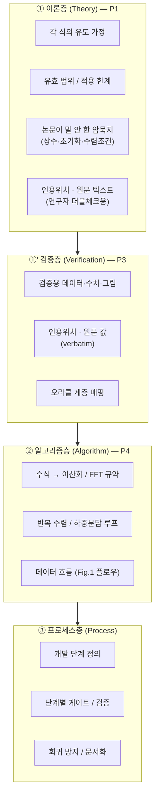
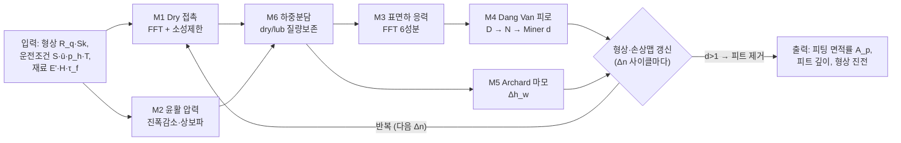
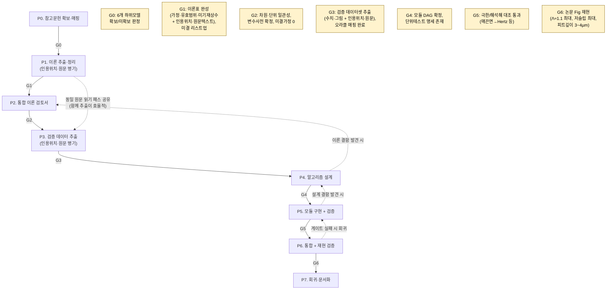
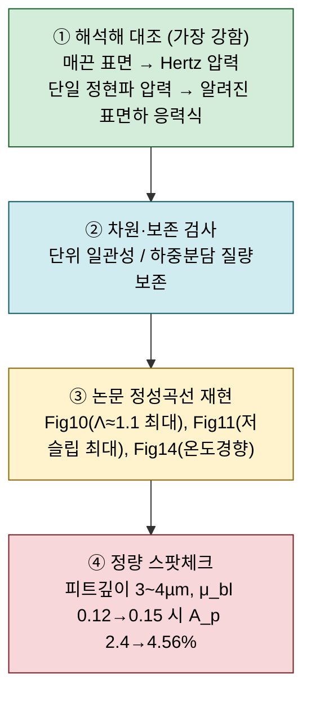
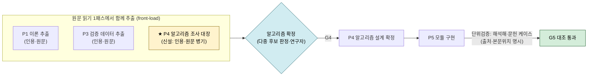

# 논문 수치해석 모델 구현 에이전트 — 프로세스 체계 정리 (v1)

> **대상 논문**: Morales-Espejel & Brizmer (2011), *Micropitting Modelling in Rolling–Sliding Contacts: Application to Rolling Bearings*, Tribology Transactions 54(4), 625–643.
> **문서 목적**: 여러 참고문헌의 하위 수치모델을 독자적으로 결합한 이 논문을, **정확한 이론 파악 → 검증 데이터 확보 → 알고리즘 정리 → 구현 → 검증**까지 체계적·시스템적으로 진행하기 위한 **개발 프로세스·게이트·검토 방법·도구(스킬/하네스) 지형**을 정리한다.
> **작성 기준일**: 2026-07-01
> **v1 변경점**: (1) **P1 정리 시 본문 인용위치·원문 텍스트(verbatim)를 표에 병기** → 연구자 더블체크 가능. (2) **검증 데이터 추출을 독립 단계(P3)로 신설** — 인용 논문 본문의 데이터·수치·그림을 인용위치·원문과 함께 추출. (3) Phase 재정리: P3 검증데이터추출 / P4 알고리즘설계 / P5 모듈구현+검증 / P6 통합+재현검증 / P7 회귀·문서화.
> **관련 문서**: [[논문 구현 에이전트]] (v0 원본) · [[2011. (SKF) Micropitting Modelling in Rolling-Sliding Contacts Application to Rolling Bearings]] · [[2007. (Hooke) Rapid calculation of pressures and clearances in rough rolling-sliding EHL contacts Part 1]]

---

## 0. 한눈에 보기 (Executive Summary)

- **이 작업의 성격**: 단일 논문 코딩이 아니라 **"논문 재현(paper reproduction) + 다중 참고문헌 이론 융합"** 이다. 이 논문은 자체 완결 모델이 아니라 **최소 6개 하위 모델을 조립한 메타 모델**이며, 각 하위 모델의 원 유도·전제·유효범위는 별도 논문에 있다. → **한 논문만으로는 구현 불가**가 구조적으로 맞다.
- **최대 리스크 두 가지**:
  1. **각 하위 모델의 유효 전제·범위를 정확히 특정하는 것** (코딩보다 이게 어렵다) → **P1의 정확한 정리가 프로젝트의 핵심**이며, 이론 추출 결과는 **연구자의 더블체크**가 필요할 수 있다. 이를 위해 **본문 인용위치 + 원문 텍스트(verbatim)를 표에 함께 남긴다.**
  2. **검증 오라클(정답 기준)의 부재** — 실험 데이터가 없으므로 해석해·보존법칙·논문 Fig 곡선을 *대리 오라클*로 계층 구성해야 한다. 검증에 쓰는 **데이터·수치·그림은 반드시 인용 논문 본문에서 추출**해야 하며, 이는 P1과 동일한 원문 읽기 패스에서 함께 뽑는 것이 효율적이므로 **독립 단계 P3(검증 데이터 추출)** 로 formalize 한다.
- **접근 원칙**: 커뮤니티의 "논문→코드 자동화" 프레임워크는 대부분 ML 논문 + 기존 코드 저장소 전제라 그대로는 못 쓴다. 대신 **그 안의 패턴**(다단계 plan/analyze/generate, 검증 에이전트, 암묵지 복원)과 **Claude Code 자체의 Workflow/서브에이전트 기본기**를 **도메인 게이트**와 결합한다. **모든 이론·검증 데이터는 출처(인용위치·원문) 추적이 가능**해야 한다.
- **전체 흐름**: P0 참고문헌 확보 → **P1 이론 추출(인용·원문 병기)** → P2 통합 이론 검토서 → **P3 검증 데이터 추출(인용·원문 병기)** → P4 알고리즘 설계 → P5 모듈 구현·검증 → P6 통합·재현검증 → P7 회귀·문서화. **각 단계는 게이트를 통과해야 다음으로 넘어간다.**

---

## 1. 작업의 성격 해부 — 왜 시스템적 정리가 필요한가

### 1.1 이 논문이 실제로 조립하고 있는 하위 모델

| # | 하위 모델 | 이 논문에서의 역할 | 원 유도/전제 참고문헌 | 보유 여부 |
|---|---|---|---|---|
| M1 | **Dry 접촉** (FFT + 탄성-완전소성) | 경계 패치 압력, $p_{lim}$=4.3 GPa 제한 (식 1) | Stanley & Kato 1997 (22) | 확인 필요 |
| M2 | **윤활 압력** (진폭감소 + 상보파) | Lub 패치 압력 리플 (식 5) | **Hooke 2006/2007 (27,28)**, Greenwood–Morales-Espejel 1994 (29) | ✅ 보유 |
| M3 | **표면하 응력 이력** (FFT) | 6개 응력성분 (식 12,13) | Morales-Espejel 2003 (16) | 확인 필요 |
| M4 | **Dang Van 피로** | 위험계수 $D$, 수명 $N$ (식 9,11) | Dang Van 1989 (13,14) | 확인 필요 |
| M5 | **수정 Archard 마모** | 형상 갱신 (식 14) | Archard 1953 (17), Lainé & Olver (10,11) | 확인 필요 |
| M6 | **부분윤활 하중분담** | dry/lub 질량보존 반복 | Johnson, Morales-Espejel 2010 (21) | 확인 필요 |

여기에 **비뉴턴 Eyring 점도(식 6), 압축성 보정 $c_\rho$, 주기적 거칠기 가정, Palmgren-Miner 손상누적** 등 "전제가 숨어있는" 요소가 겹친다.

### 1.2 정리해야 할 3개 층위

정리 대상이 성격이 다른 3층위로 나뉘며, 각각 다른 도구로 공략한다. **v1에서는 이론층·검증층 모두 "출처(인용위치·원문) 추적성"을 필수 속성으로 둔다.**

---

## 2. 하위 모델 의존 관계 (Dependency DAG)

구현 순서와 인터페이스를 규정하는 하위 모델 간 데이터 의존 그래프. **위상정렬 순서대로 구현·검증**한다.

> **핵심 인터페이스 계약(contract)**: 각 화살표는 "무엇을 어떤 단위로 주고받는가"가 P2에서 명시적으로 확정되어야 한다. 예: M6→M3 은 `(패치별 압력 p(x,y), 트랙션 q(x,y))` [Pa], M3→M4 는 `(표면하 6응력 텐서 시간이력 σ_ij(x,y,z,t))` [Pa].

---

## 3. 전체 개발 프로세스 파이프라인 (v1: 8단계)

> **P1 ↔ P3 동시 수행**: P1(이론)과 P3(검증 데이터)은 모두 *같은 원문을 읽는 추출 작업*이므로, 산출물은 분리하되 **원문 읽기 패스는 한 번에 함께 수행**하는 것이 효율적이다. 파이프라인 상 위치는 P2 뒤이지만, 실무적으로 P1과 묶어 진행한다.

> ⚠️ **P4·P5는 이 프로세스의 최대 병목**이다. 논문은 "어떤 알고리즘을 썼다"만 밝히고 상세 모델은 제공하지 않으므로, 알고리즘을 직접 재구성해야 한다. **P4에서 쓸 알고리즘도 아직 확정 단계가 아니며, P1·P3와 동일 수준의 원문·인용 기반 조사가 선행**되어야 한다. → **[부록 1. P4·P5 상세 검토](#부록-1-p4p5-상세-검토-최대-병목-구간)** 참조.

### 3.1 Phase별 상세 (목표 · 도구 · 게이트 · 산출물 · 검토방법)

| Phase | 목표 | 사용 도구/스킬 | **게이트 (통과 기준)** | 산출물 | 검토 방법 |
|---|---|---|---|---|---|
| **P0** 참고문헌 확보·매핑 | §1.1 표의 6개 하위모델 원 논문 수집 | 서브에이전트 검색 + 로컬 폴더 스캔 | **G0**: 하위모델별 "확보/미확보" 판정 + 부족분 리스트 | 참고문헌 매핑표 | 매핑표 vs 논문 References 대조 |
| **P1** 이론 추출·정리 | 참고문헌별 정리본 + 전제/유효범위/암묵지 대장 + **인용위치·원문텍스트 병기** | `paper-original-summary`(원문 verbatim 보존), `paper-summary`, `deep-research` (Workflow 병렬) | **G1**: 각 식마다 (가정·유효범위·미기재 상수 + **인용위치·원문**) 표 채움, "모르는 것" 명시 | 하위모델별 이론 정리본 6종 + 암묵지 대장 (§3.2 템플릿) | **연구자 더블체크** + 식별 교차검증(검증 에이전트) |
| **P2** 통합 이론 검토서 | Fig 1 플로우를 식·변수·단위까지 완결, 하위모델 인터페이스 정의 | 종합 + `AskUserQuestion`(판단 필요 지점) | **G2**: 차원/단위 일관성 검사 통과, 변수 명명사전 확정, 미결 가정 0건 | 통합 이론 검토서 + 변수 사전 | 차원 해석, 인터페이스 계약 리뷰 |
| **P3** 검증 데이터 추출 | 인용 논문 본문의 **검증용 데이터·수치·그림**을 인용위치·원문과 함께 추출, 오라클에 매핑 | `paper-original-summary`(원문·수치 verbatim), 그림 디지타이징 | **G3**: 검증 데이터셋 추출 완료 (**인용위치·원문값 병기**), §4 오라클 ①~④에 매핑, 허용오차 정의 | 검증 데이터셋 표 (§3.2 템플릿) | **연구자 더블체크** + 원문 대조 |
| **P4** 알고리즘 설계 | 이산화·FFT 규약·반복수렴·형상갱신($\Delta n$) 의사코드 | `Plan` 에이전트 | **G4**: 모듈 의존도(DAG) 확정, 각 모듈 단위테스트 명세 존재 | 알고리즘 명세서(의사코드) | 설계 리뷰, 수치안정성 사전점검 |
| **P5** 모듈 구현 + 검증 | 하위모델별 독립 구현·단위검증 | 구현 + materials-simulation 스킬 참고 | **G5**: 극한/해석해 대조 통과 (매끈면→Hertz, 단일정현파→응력해석해) | 모듈 코드 + 단위테스트 | 해석해 대조, 차원·보존 검사 |
| **P6** 통합 + 재현 검증 | 전체 파이프라인 통합, **P3 검증셋으로 재현 검증** | `/loop`(Ralph 루프), CHANGELOG 규율 | **G6**: 논문 Fig 재현 (Fig10 Λ≈1.1 최대, Fig11 저슬립 최대, 피트깊이 3~4µm) | 통합 코드 + 재현 리포트 | 논문 정성곡선·정량 스팟체크 (P3 데이터 대조) |
| **P7** 회귀·문서화 | 검증셋 고정, 재현 리포트 | git + Memory | 회귀 테스트 상시 통과, 상수·검증데이터 출처 추적 가능 | 회귀 테스트셋 + 최종 문서 | 회귀 실행, provenance 확인 |

### 3.2 P1·P3 추출 표 템플릿 (인용위치·원문 병기) — 연구자 더블체크용

**P1 이론 추출 표** — 하위모델별로 각 식·전제를 아래 형식으로 정리한다. **원문 텍스트 열 덕분에 연구자가 표만 보고 원 논문 대조·검증 가능**하다.

| 항목/식 ID | 이 논문 내 위치(식·페이지) | **원 출처 인용위치**(문헌·섹션·식·페이지) | **원문 텍스트 (verbatim)** | 가정·유효범위 | 미기재 상수/비고 | 연구자 확인 |
|---|---|---|---|---|---|---|
| 예: 진폭감소 특수해 (식 5) | Eq.(5), p.628 | Hooke 2007 Part 1, §3, Eq.(12), p.xxx | "The pressure ripple amplitude … " *(원문 그대로)* | 정현파 거칠기·중앙접촉·선형화 Reynolds 유효 | κ 정의 불명확 → 원문 확인 | ☐ |

**P3 검증 데이터 추출 표** — 검증에 쓸 수치·그림을 오라클/모듈에 매핑한다.

| 검증항목 ID | 데이터 종류(수치/그림/표) | **인용위치**(Fig/Table/식·페이지) | **원문 값·텍스트 (verbatim)** | 대응 오라클(①~④) | 대응 모듈 | 허용오차 | 연구자 확인 |
|---|---|---|---|---|---|---|---|
| 예: 피트 깊이 | 수치 (본문) | p.639, Fig.16 캡션 | "typical microspalls … depth of 3–4 µm" | ④ 정량 | 전체 | ±1 µm | ☐ |
| 예: Λ 최대점 | 그림 곡선 | Fig.10, p.634 | (곡선 디지타이즈: A_p vs Λ, 마모 포함 곡선 최대 Λ≈1.1) | ③ 정성곡선 | 전체 | 극값 위치 ±0.1 | ☐ |

> **원칙**: 검증에 사용하는 모든 값·그림은 이 표를 통해 **인용위치 → 원문 → (필요 시) 디지타이즈 값** 순으로 추적 가능해야 한다. 임의 추정치·기억에 의존한 값은 검증에 사용 금지.

---

## 4. 검증 오라클 계층 — 이 작업의 급소

실험 데이터가 없으므로 **대리 오라클을 계층적으로** 확보한다. 위로 갈수록 강한(엄밀한) 검증이다. **오라클 ③④에 쓰이는 논문 데이터는 P3에서 인용위치·원문과 함께 확보**된다.

| 오라클 | 검증 대상 | 기대치(논문 근거) | 데이터 출처 | 적용 Phase |
|---|---|---|---|---|
| ① 해석해 | M1, M3 | 매끈면 압력→Hertz 분포, 정현파→식 12/13 해석해 | 표준 이론(자체 유도) | P5 |
| ② 보존/차원 | M6, 전체 | dry+lub 하중 합=총하중, 전 식 단위 일관 | 자체 | P5~P6 |
| ③ 정성곡선 | 전체 | Fig10: 마모 포함 시 Λ≈1.1 최대 / Fig11: S≈0.01 최대 | **P3 추출(Fig10/11 디지타이즈)** | P6 |
| ④ 정량 | 전체 | 피트 직경 10~20µm·깊이 3~4µm, 경계마찰 민감도 | **P3 추출(본문 수치·Fig16)** | P6 |

---

## 5. 컨텍스트 규율 (장기 실행 대비)

Anthropic의 "장기 실행 과학계산" 사례(CLASS 솔버 재구현) 규율을 이 프로젝트에 이식한다. 이 작업은 수 주에 걸친 장기 세션이 될 가능성이 크므로 **컨텍스트 규율이 성패를 좌우**한다.

| 파일 | 역할 | 이 프로젝트 적용 |
|---|---|---|
| **CLAUDE.md** | 계획·설계결정·고수준 목표 | 6개 하위모델 구현 상태, 확정된 전제, 목표 정확도 기준 |
| **CHANGELOG.md** | 포터블 장기기억 (**실패 기록 포함**) | "진폭감소 특수해만으로 리플 과소 → 상보파 추가" 식의 시도·실패·전환 로그 |
| **git commit** | 복구가능 이력 | 의미 단위마다 커밋, 재현 Fig 스냅샷 |
| **Memory (프로젝트)** | 상수·검증데이터의 single source of truth | $p_{lim}$=4.3 GPa, $A$=−43 MPa, $B$=1220 MPa, $\alpha$≈0.232 등 **인용위치와 함께** 고정 |

> **정량적 성공기준을 먼저 못박기**: Anthropic 사례는 "레퍼런스 대비 0.1% 정확도"를 목표로 삼았다. 이 프로젝트는 실험 데이터가 없으므로 **"논문 Fig10/11의 극값 위치·곡선 형태 재현 + 피트깊이 3~4µm"** 를 정성적 성공기준으로 삼는다(§4 오라클 ③④, 데이터는 P3에서 확보).

---

## 6. 도구/스킬 지형 (조사 결과)

### 6.1 이미 환경에 있는 1차 도구 — 여기서 대부분 해결

| 도구 | 이 작업에서의 쓰임 |
|---|---|
| **Dynamic Workflows** | 참고문헌별 "이론/검증 추출 에이전트"를 병렬 fan-out → 구조화 스키마 수집 → 검증 에이전트 교차검증. plan/analyze/generate를 결정론적 오케스트레이션 |
| **서브에이전트** (Explore/Plan/general-purpose) | 참고문헌 PDF 병렬 심층독해, 구현 계획 수립 |
| **`paper-original-summary` 스킬** | **P1·P3 핵심 도구.** 본문(3장~끝) 원문 영어 텍스트·수식을 **verbatim 그대로 보존** → 인용위치·원문 병기·연구자 더블체크에 직접 부합 |
| **`paper-summary` 스킬** | 각 참고문헌을 SKF 정리본과 동일 표준 양식으로 (한국어) 정리 |
| **`deep-research` 스킬** | 개별 이론 쟁점(예: Dang Van $\alpha$ 유도)을 다출처 교차검증 |
| **Memory 시스템** | 확정 전제·상수·검증데이터를 출처와 함께 고정 |
| **`/loop` 스킬** | Anthropic "Ralph Loop"의 로컬 등가물 — 검증 통과까지 반복 |
| **CLAUDE.md/CHANGELOG.md/git** | §5 컨텍스트 규율 |

### 6.2 Anthropic 공식 방법론 (이 작업에 가장 직접적)

- **Long-running Claude for scientific computing** — 정량 성공기준·테스트 오라클·3파일 컨텍스트 규율·Ralph Loop. 본 문서 §4·§5의 근거.
  <https://www.anthropic.com/research/long-running-Claude>
- **Dynamic workflows 블로그 / 문서** — 서브에이전트 대규모 오케스트레이션.
  <https://claude.com/blog/a-harness-for-every-task-dynamic-workflows-in-claude-code> · <https://code.claude.com/docs/en/workflows>

### 6.3 커뮤니티 하네스 / 메타스킬

| 리소스 | 성격 | 유용도 |
|---|---|---|
| [revfactory/harness](https://github.com/revfactory/harness) | 메타스킬: 도메인 특화 에이전트 팀 + 스킬 자동 설계·생성 | ★ "오케스트러/스킬 포함 하네스" 요구에 최근접 |
| [anothervibecoder-s/claudecode-harness](https://github.com/anothervibecoder-s/claudecode-harness) | 프로덕션급 오케스트레이션(컨텍스트 규율·Hub&Spoke·다중모델 합의) | ★ 장기·고정밀 운용틀 |
| [VILA-Lab/Dive-into-Claude-Code](https://github.com/VILA-Lab/Dive-into-Claude-Code) | Claude Code 에이전트 시스템 설계 분석 | 참고자료 |

> ⚠️ 이들은 **구조/운용틀**만 제공하며 트라이볼로지 도메인 지식은 없다. 뼈대로만 쓰고 도메인 게이트(§3,§4)는 직접 채운다.

### 6.4 과학계산 스킬 마켓

- [K-Dense 과학 스킬 모음](https://github.com/K-Dense-AI/claude-scientific-skills) — 125+ 스킬. 특히 **materials-simulation-skills**(수치 안정성·시간적분·선형솔버·검증·파라미터 최적화·후처리)가 EHL/FFT/반복수렴 구현에 직접 유용.
- [MATLAB/Octave 스킬](https://mcpmarket.com/tools/skills/matlab-octave-scientific-computing) · [Julia 수치계산 스킬](https://mcpmarket.com/tools/skills/julia-numerical-computing)
- 디렉토리: [travisvn/awesome-claude-skills](https://github.com/travisvn/awesome-claude-skills) · [BehiSecc/awesome-claude-skills](https://github.com/BehiSecc/awesome-claude-skills)

### 6.5 논문→코드 재현 연구 프레임워크 (패턴만 차용)

| 프레임워크 | 차용할 패턴 | 한계 |
|---|---|---|
| [Paper2Code](https://arxiv.org/abs/2504.17192) | Planning→Analysis→Generation 3단 다중에이전트 | ML 논문+기존 repo 전제 |
| [Paper2Agent](https://arxiv.org/pdf/2509.06917) | Claude Code 기반 오케스트레이터+환경관리 서브에이전트로 재현성 확보 | 기존 코드 추출 전제 |
| ["What Papers Don't Tell You"](https://arxiv.org/pdf/2603.01801) | **암묵지 복원** — 생략된 상수·초기화·수렴조건 발굴 (→ P1 암묵지 대장) | — |
| [Prompt-free Collaborative Agents](https://arxiv.org/abs/2512.02812) | **검증 에이전트 + 정제 에이전트** 루프 (→ 각 게이트) | — |
| PaperBench | **단계별 채점 루브릭** (→ 게이트 체크리스트로 전용) | — |

---

## 7. 리스크 레지스터

| ID | 리스크 | 영향 | 완화책 |
|---|---|---|---|
| R1 | 하위모델 전제 오해 (예: 진폭감소 유효범위 초과) | 결과 전면 오류 | P1 암묵지 대장 + **인용위치·원문 병기** + 연구자 더블체크(G1) |
| R2 | 검증 오라클 부재로 "그럴듯하지만 틀림" | 잘못된 확신 | §4 해석해 대조 우선(G5) + P3 검증셋 |
| R3 | 미기재 상수/초기화 (논문 암묵지) | 재현 실패 | deep-research로 원 논문 추적, Memory에 출처와 함께 고정 |
| R4 | 하위모델 간 단위/좌표 규약 불일치 | 통합 시 폭발 | P2 인터페이스 계약 + 차원검사(G2) |
| R5 | 수치 불안정 (FFT 규약, 반복 발산) | 진행 정체 | materials-simulation 스킬, 안정성 사전점검(G4) |
| R6 | 장기 세션 컨텍스트 유실 | 재작업 | CLAUDE.md/CHANGELOG.md/git 규율(§5) |
| R7 | 자동화 프레임워크 과신 | 방향 오류 | 프레임워크는 패턴만, 도메인 게이트는 직접 |
| R8 | **검증 데이터 오추출·출처 불명** | 잘못된 검증 통과 | **P3 인용위치·원문 병기 + 연구자 더블체크(G3)**, 기억 의존 값 금지 |

---

## 8. 다음 단계 (실행 순서 제안)

1. **P0 착수**: `05. Surface` 등 로컬 폴더 스캔 → §1.1의 6개 하위모델 원 논문 확보/미확보 판정, 부족분 리스트업. → **G0**
2. **P1 + P3 동시 실행**: 확보된 참고문헌을 Workflow로 병렬 처리하되, **`paper-original-summary`로 원문(수식·수치) verbatim 보존** → §3.2 템플릿에 (이론 표 + 검증 데이터 표)를 **동일 읽기 패스에서 함께** 작성. 미확보분은 `deep-research`. → **G1 / G3**
   - 이 산출물은 **연구자 더블체크**를 거친다 (표만으로 원문 대조 가능하도록 인용위치·원문 병기).
3. **P2 통합 검토서**: 본 문서를 토대로 Fig 1 플로우를 식·변수·단위까지 완결, 인터페이스 계약 확정. → **G2**
4. 이후 P4~P7은 §3.1 표대로 게이트 통과 기반 진행.

> **구현 언어는 미정** — P1~P4(이론·검증데이터·알고리즘 정리)는 언어 무관하게 진행 가능하며, P5 착수 전에 Python(NumPy/SciPy) / MATLAB / Julia 중 결정한다. FFT·반복수렴·플로팅 생태계와 검증 용이성 면에서 **Python이 기본 후보**, 트라이볼로지 학계 관행·원저자군 코드 호환 면에서 **MATLAB**이 대안.

---

**참고 리소스 (원문 링크)**
- Anthropic, *Long-running Claude for scientific computing* — <https://www.anthropic.com/research/long-running-Claude>
- Anthropic, *A harness for every task: dynamic workflows* — <https://claude.com/blog/a-harness-for-every-task-dynamic-workflows-in-claude-code>
- Claude Code Docs, *Orchestrate subagents at scale* — <https://code.claude.com/docs/en/workflows>
- Paper2Code (arXiv 2504.17192) · Paper2Agent (arXiv 2509.06917) · "What Papers Don't Tell You" (arXiv 2603.01801) · Prompt-free Collaborative Agents (arXiv 2512.02812)
- revfactory/harness · anothervibecoder-s/claudecode-harness · K-Dense/claude-scientific-skills · travisvn/awesome-claude-skills

---

## 부록 1. P4·P5 상세 검토 (최대 병목 구간)

### A1.1 문제 인식 — 왜 P4·P5가 병목인가

전체 프로세스에서 **가장 큰 병목은 P4(알고리즘 설계)·P5(모듈 구현+검증)** 에서 발생할 것으로 예상된다. 이유는 구조적이다.

- **논문은 "무엇을 썼는지"만 말하고 "어떻게 하는지"는 안 준다.** 예: "Stanley-Kato FFT 접촉", "진폭감소법", "Dang Van 기준"이라고 명시하지만 — 이산화 스킴, 격자/샘플링 해상도, 경계·초기조건, 반복 수렴기준, under-relaxation, 하중분담 반복 알고리즘, 형상갱신 규칙 등 **구현에 반드시 필요한 상세 모델은 원문에 없다.**
- **따라서 Claude Code가 (원 참고문헌 조사 + 에이전트 재구성)으로 알고리즘을 직접 만들어야 한다.** 이 과정 자체가 불확실성·난이도의 원천이며, 잘못된 알고리즘 선택은 P5·P6에서야 드러나 큰 재작업을 부른다.
- **P4에서 다룰 알고리즘은 현재 확정 단계가 아니다.** → 어떤 알고리즘이 필요한지·원문이 어떻게 지시했는지·참고문헌이 무엇인지·상세가 빠진 gap이 무엇인지를 **P1·P3와 동일한 수준으로(정확한 인용·원문 병기)** 먼저 조사·정리해야 한다.

### A1.2 대응 원칙 — 알고리즘 조사도 front-load (P1·P3와 한 패스로)

핵심 전략은 **알고리즘 요구사항 조사를 P1·P3와 같은 원문 읽기 패스에서 함께 수행**하는 것이다. 신설 산출물: **알고리즘 조사 대장(Algorithm Sourcing Ledger)** — P1 이론표·P3 검증표와 동일하게 **인용위치·원문 병기 + 연구자 더블체크**.

> **게이트 매핑 정리(혼동 주의)**: v1 번호 기준으로 **알고리즘 확정 = P4/G4**, **해석해·문헌 케이스 대조(모듈 검증) = P5/G5** 이다. 아래 A1.3은 G4를, A1.5는 G5를 위한 준비물이다.

### A1.3 P4 알고리즘 조사 대장 템플릿 (인용·원문 병기 · 연구자 더블체크)

각 하위모델(M1~M6)의 알고리즘을 아래 형식으로 정리한다. **표만 보고 "이 논문이 지시한 방법 → 원 참고문헌 → 빠진 상세(gap) → 대체 후보"가 추적 가능**해야 한다.

| 알고리즘 ID | 대상 모듈 | 이 논문이 명시한 방법(위치·원문 verbatim) | 원 참고문헌(인용위치: 문헌·식·페이지) | 제공된 상세 수준 | **미제공 gap (구현 시 결정 필요)** | 대체 후보(교과서·문헌) | 확정 여부 | 연구자 확인 |
|---|---|---|---|---|---|---|---|---|
| ALG-M1 | M1 Dry | Eq.(1), p.628 "elastic displacement … computed by FFT … Kalker's variational principle" | Stanley & Kato 1997 (22); Kalker | 개념만 | 반복 보정 스킴, 소성압력 재분배, 수렴기준 | Polonsky-Keer CG+FFT (1999) | ☐ | ☐ |
| ALG-M2 | M2 윤활 | 진폭감소 특수해 Eq.(5) + 상보파, §4 | Hooke 2007 Part 1/2 (27,28); GME 1994 (29) | 결과식 | 상보파 합성, 주파수영역 처리, 입구 생성 조건 | Hooke 2007 원 절차 | ☐ | ☐ |
| ALG-M4 | M4 Dang Van | Eq.(9,11) 위험계수·수명 | Dang Van 1989 (13,14) | 기준식 | 임계면 탐색(min/max) 방법, Miner 누적 이산화 | 다축피로 교과서 | ☐ | ☐ |
| … | … | … | … | … | … | … | ☐ | ☐ |

### A1.4 하위모델별 대표 알고리즘 Gap (논문이 말하지 않는 것들)

| 모듈 | 논문이 밝힌 것 | 구현 시 직접 결정해야 할 상세(gap) |
|---|---|---|
| **M1 Dry 접촉** | FFT 탄성변위 + Kalker 변분, $p_{lim}$ 소성제한 | 압력 반복 보정 알고리즘, 접촉영역 판정, 소성 압력 재분배 규칙, 수렴 판정·완화계수 |
| **M2 윤활 압력** | 진폭감소 특수해 + 상보파(complementary wave) | 특수해·상보파 수치 합성, 주파수영역 필터, 입구 상보파 생성 조건, 비뉴턴 반영 순서 |
| **M3 표면하 응력** | 정현파 하중→6응력 해석식(식 12,13), $\zeta=\sqrt{\alpha^2+\beta^2}$ | 압력장의 스펙트럼 분해(FFT) 규약, 깊이 z 샘플링, 성분별 중첩·역변환 |
| **M4 Dang Van 피로** | $D=\max_t\{\hat\tau/(\tau_f-\alpha\hat p)\}$, Wöhler, Miner | 임계면(방향 $\vec n$) 탐색법, 시간축 이산화(거칠기 이동 $m$스텝), 미시전단 진폭 정의, Miner 누적 이산화 |
| **M5 Archard 마모** | $\Delta h_w/\Delta n = k\,p\,u_s/H$, 최고 돌기부터 제거 | 형상 갱신 규칙(양표면 절반 배분), 마모층→높이맵 반영 방식, $k_{dry}/k_{lub}$ 전환 |
| **M6 하중분담** | dry/lub 질량보존 반복, $h_{tran}=\max(|\tilde h_{dry}|,|\tilde h_{lub}|)$, 압축성 보정 $c_\rho$ | 반복 스킴·수렴기준, 전이간극 결정 알고리즘, 패치 경계 처리 |
| **공통(시간루프)** | $\Delta n$ 사이클 묶음마다 형상 갱신 | $\Delta n$ 선택 기준, 좌표·단위 규약, 주기적 거칠기 경계처리 |

### A1.5 G5 검증 케이스 조사 표 — 해석해·문헌 대조 (출처·본문위치 필수)

**G5(모듈 검증)에서는 자체 검증(차원·보존)뿐 아니라, "정답이 알려진 해석해 또는 교과서/문헌 케이스"와 정확히 비교**해야 한다. 이 검증 케이스도 **P3와 동일 수준으로 정확한 출처·본문 위치를 남겨 연구자 더블체크**가 가능해야 한다(기억·추정 값 사용 금지).

| 케이스 ID | 대상 모듈 | 해석해/문헌 종류 | **출처(문헌·식·페이지)** | **원문 값·식 (verbatim)** | 입력 조건 | 기대 출력 | 허용오차 | 연구자 확인 |
|---|---|---|---|---|---|---|---|---|
| VC-M1 | M1 | 해석해(Hertz) | Johnson, *Contact Mechanics* (1985), Ch.4, Eq.(4.x), p.xx | $p_0=\dfrac{2W}{\pi a b}$ 등 | 매끈 구/실린더, 하중 W | Hertz 압력분포·접촉폭 | 압력 ≤1% | ☐ |
| VC-M3 | M3 | 해석해(정현파 하중 표면하 응력) | Johnson Ch.3 / Westergaard | 정현파 하중 응력장 폐형식 | 단일 정현파 $p_0\cos(\alpha x)$ | 최대전단 깊이·크기 | ≤2% | ☐ |
| VC-M2 | M2 | 원저자 결과 대조 | Greenwood & Morales-Espejel 1994 (29), Fig.x | 진폭감소비 곡선 | 단일 정현파 거칠기 | $p_a/r_a$ vs $Q$ | 곡선 정합 | ☐ |
| VC-M4 | M4 | 교과서 예제 | 다축피로 교과서(예: Socie & Marquis), 예제 x.x | Dang Van 궤적 예 | 단순 비례 응력경로 | $D$ 값·안전여부 | ≤2% | ☐ |
| VC-ALL | 전체 | 문헌 정량치 | 본 논문 p.639, Fig.16 캡션 | "depth of 3–4 µm" | Table 2 조건 | 피트 깊이 | ±1 µm | ☐ |

> **참고**: VC-M1(Hertz)·VC-M3(정현파→표면하 응력)은 표준 교과서 해석해가 존재하므로 **가장 강한 검증**이다. 최대 전단응력 깊이 ≈0.48a 같은 잘 알려진 값도 스팟체크로 활용한다. 원저자 결과(GME 1994, Hooke 2007)와의 대조는 M2 진폭감소 로직의 정확성을 직접 보증한다.

### A1.6 병목 완화 전략 요약

| 전략 | 내용 | 반영 게이트 |
|---|---|---|
| **알고리즘 조사 front-load** | A1.3 조사 대장을 P1·P3와 한 패스로 작성 → P4 진입 전 알고리즘 불확실성 최소화 | G1·G3와 병행 |
| **알고리즘 확정 게이트 강화** | G4 통과 조건에 "조사 대장 완결 + **미확정 알고리즘 0건** + 대체 후보 중 선택 근거 명시" 추가 | **G4** |
| **다중 후보 판정** | gap이 큰 알고리즘은 후보 2~3개 비교 → 판단 지점은 `AskUserQuestion`/연구자 결정 | G4 |
| **해석해 우선 단위검증** | 각 모듈은 문헌 해석해(A1.5)로 먼저 검증 후 통합 | **G5** |
| **검증 케이스 출처화** | A1.5 표로 검증 케이스도 인용·원문 병기 → 연구자 더블체크 | G5 |
| **실패 로그 규율** | 시도·실패 알고리즘을 CHANGELOG에 기록(예: "CG+FFT 발산 → 완화계수 0.3") | §5 |

### A1.7 본 프로세스(main body)로의 승격 제안 (추후 반영)

본 부록의 내용은 **일단 부록으로 정리**한 것이며, 확정 시 다음을 본문에 승격 반영한다:
- **P4 산출물에 "알고리즘 조사 대장"(A1.3) 추가**, G4 통과 기준에 "미확정 알고리즘 0건" 명문화.
- **P1·P3 동시 수행 범위에 "알고리즘 조사"를 포함**(원문 1패스 3종 추출: 이론·검증데이터·알고리즘).
- **P5/G5에 "검증 케이스 조사 표"(A1.5) 산출물** 추가.

---

**끝**
