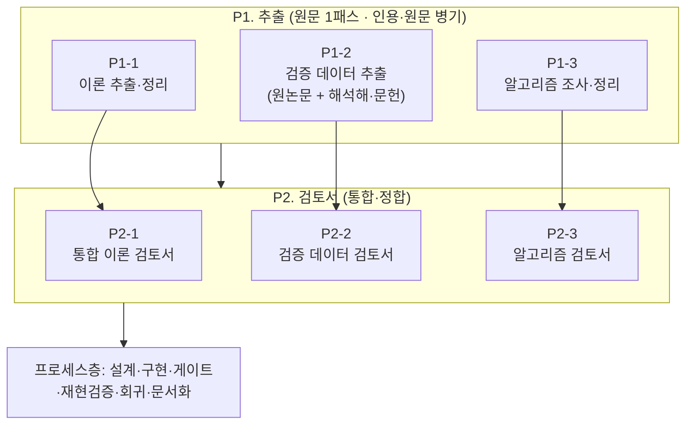
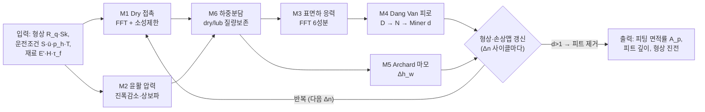
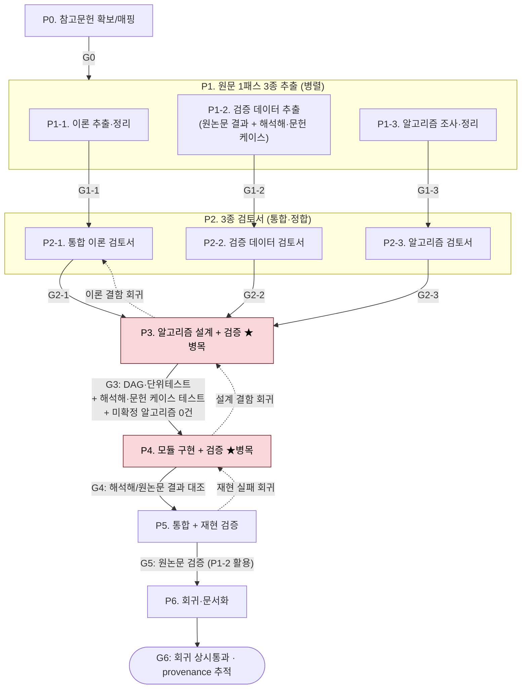
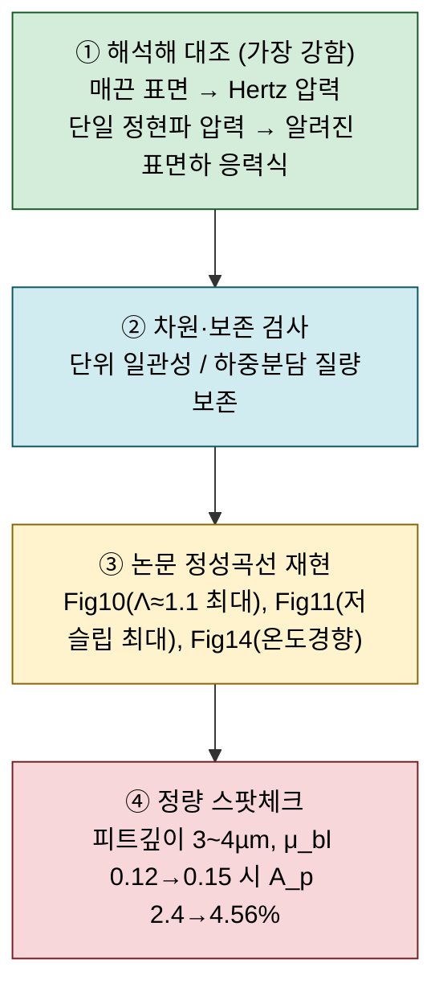

# 논문 수치해석 모델 구현 에이전트 — 프로세스 체계 정리 (v2)

> **대상 논문**: Morales-Espejel & Brizmer (2011), *Micropitting Modelling in Rolling–Sliding Contacts: Application to Rolling Bearings*, Tribology Transactions 54(4), 625–643.
> **문서 목적**: 여러 참고문헌의 하위 수치모델을 독자적으로 결합한 이 논문을, **정확한 이론 파악 → 검증 데이터 확보 → 알고리즘 정리 → 설계·구현 → 재현 검증**까지 체계적·시스템적으로 진행하기 위한 **개발 프로세스·게이트·검토 방법·도구(스킬/하네스) 지형**을 정리한다.
> **작성 기준일**: 2026-07-01
> **v2 변경점 (파이프라인 3트랙×2단계 재편)**:
> - **추출 단계 P1을 3트랙 병렬로 분리** — P1-1 이론 / P1-2 검증 데이터 / P1-3 알고리즘 조사 (원문 1패스, 인용·원문 병기).
> - **검토서 단계 P2를 3트랙으로 분리** — P2-1 통합 이론 / P2-2 검증 데이터 / P2-3 알고리즘 검토서.
> - **트랙별 개별 게이트** G1-1/1-2/1-3, G2-1/2-2/2-3 도입 (추적성).
> - **P1-2 = 모든 검증 출처 통합** — 원논문 결과 + 해석해/교과서·문헌 케이스(Hertz·Johnson·GME1994 등).
> - **재넘버링**(결번 제거): 알고리즘설계+검증=**P3(G3)**, 모듈구현+검증=**P4(G4)**, 통합+재현검증=**P5(G5)**, 회귀·문서화=**P6(G6)**.
> - **P3·P4가 최대 병목**. G3에 "해석해·문헌 케이스 테스트 + 미확정 알고리즘 0건", G4에 "해석해/원논문 결과 대조", G5에 "원논문 검증(P1-2 활용)".
> **관련 문서**: [[논문 구현 에이전트]] (v0) · [[논문 구현 에이전트_v1]] · [[논문 구현 에이전트_v1_r1_부록1 반영]] · [[2011. (SKF) Micropitting Modelling in Rolling-Sliding Contacts Application to Rolling Bearings]] · [[2007. (Hooke) Rapid calculation of pressures and clearances in rough rolling-sliding EHL contacts Part 1]]

---

## 0. 한눈에 보기 (Executive Summary)

- **이 작업의 성격**: 단일 논문 코딩이 아니라 **"논문 재현(paper reproduction) + 다중 참고문헌 이론 융합"** 이다. 이 논문은 자체 완결 모델이 아니라 **최소 6개 하위 모델을 조립한 메타 모델**이며, 각 하위 모델의 원 유도·전제·유효범위는 별도 논문에 있다. → **한 논문만으로는 구현 불가**가 구조적으로 맞다.
- **최대 리스크 세 가지**:
  1. **각 하위 모델의 유효 전제·범위를 정확히 특정하는 것** (코딩보다 어렵다) → **P1-1의 정확한 정리가 핵심**이며 **연구자 더블체크**가 필요할 수 있다. 이를 위해 **본문 인용위치 + 원문 텍스트(verbatim)를 표에 함께 남긴다.**
  2. **검증 오라클(정답 기준)의 부재** — 실험 데이터가 없으므로 해석해·보존법칙·논문 Fig 곡선을 *대리 오라클*로 계층 구성. 검증에 쓰는 **모든 데이터·수치·그림·해석해·문헌 케이스는 인용 출처에서 추출**(→ **P1-2**).
  3. **P3·P4가 최대 병목** — 논문은 "어떤 알고리즘을 썼다"만 밝히고 **상세 모델(이산화·수렴·경계조건 등)은 제공하지 않는다.** 따라서 알고리즘을 직접 재구성해야 하며, 알고리즘도 **P1-1·P1-2와 동일 수준(인용·원문 병기)으로 조사(P1-3)** 한 뒤 검토서(P2-3)로 확정한다.
- **접근 원칙**: 커뮤니티의 "논문→코드 자동화" 프레임워크는 대부분 ML 논문 + 기존 코드 저장소 전제라 그대로는 못 쓴다. 대신 **그 안의 패턴**(다단계 plan/analyze/generate, 검증 에이전트, 암묵지 복원)과 **Claude Code 자체의 Workflow/서브에이전트 기본기**를 **도메인 게이트**와 결합한다. **모든 이론·검증데이터·알고리즘은 출처(인용위치·원문) 추적이 가능**해야 한다.
- **전체 흐름**:
  P0 참고문헌 확보 → **[P1 추출 3트랙] P1-1 이론 · P1-2 검증데이터(원논문+해석해/문헌) · P1-3 알고리즘 조사** → **[P2 검토서 3트랙] P2-1 통합이론 · P2-2 검증데이터 · P2-3 알고리즘** → **P3 알고리즘 설계+검증(★)** → **P4 모듈 구현+검증(★)** → **P5 통합+재현 검증** → **P6 회귀·문서화**. 각 단계는 게이트를 통과해야 다음으로 넘어간다.

---

## 1. 작업의 성격 해부 — 왜 시스템적 정리가 필요한가

### 1.1 이 논문이 실제로 조립하고 있는 하위 모델

| # | 하위 모델 | 이 논문에서의 역할 | 원 유도/전제 참고문헌 | 보유 여부 |
|---|---|---|---|---|
| M1 | **Dry 접촉** (FFT + 탄성-완전소성) | 경계 패치 압력, $p_{lim}$=4.3 GPa 제한 (식 1) | Stanley & Kato 1997 (22) | 확인 필요 |
| M2 | **윤활 압력** (진폭감소 + 상보파) | Lub 패치 압력 리플 (식 5) | **Hooke 2006/2007 (27,28)**, Greenwood–Morales-Espejel 1994 (29) | ✅ 보유 |
| M3 | **표면하 응력 이력** (FFT) | 6개 응력성분 (식 12,13) | Morales-Espejel 2003 (16) | 확인 필요 |
| M4 | **Dang Van 피로** | 위험계수 $D$, 수명 $N$ (식 9,11) | Dang Van 1989 (13,14) | 확인 필요 |
| M5 | **수정 Archard 마모** | 형상 갱신 (식 14) | Archard 1953 (17), Lainé & Olver (10,11) | 확인 필요 |
| M6 | **부분윤활 하중분담** | dry/lub 질량보존 반복 | Johnson, Morales-Espejel 2010 (21) | 확인 필요 |

여기에 **비뉴턴 Eyring 점도(식 6), 압축성 보정 $c_\rho$, 주기적 거칠기 가정, Palmgren-Miner 손상누적** 등 "전제가 숨어있는" 요소가 겹친다.

### 1.2 정리 구조 — 추출(P1) × 검토서(P2) 3트랙

이론·검증·알고리즘 3트랙을 **원문 1패스에서 함께 추출(P1-x)** 하고, 각 트랙을 **검토서로 통합·정합(P2-x)** 한다. 3트랙 모두 **인용위치·원문 병기 + 연구자 더블체크**가 필수다.

---

## 2. 하위 모델 의존 관계 (Dependency DAG)

구현 순서와 인터페이스를 규정하는 하위 모델 간 데이터 의존 그래프. **위상정렬 순서대로 구현·검증**한다.

> **핵심 인터페이스 계약(contract)**: 각 화살표는 "무엇을 어떤 단위로 주고받는가"가 P2-1에서 명시적으로 확정되어야 한다. 예: M6→M3 은 `(패치별 압력 p(x,y), 트랙션 q(x,y))` [Pa], M3→M4 는 `(표면하 6응력 텐서 시간이력 σ_ij(x,y,z,t))` [Pa].

---

## 3. 전체 개발 프로세스 파이프라인 (v2: 3트랙×2단계 + P3~P6)

> **게이트 매핑(혼동 주의)**: **알고리즘 확정·설계 검증 = P3/G3** (해석해·문헌 케이스 테스트, 미확정 0건) / **모듈(프로덕션) 구현 검증 = P4/G4** (해석해·원논문 결과 대조) / **전체 재현 검증 = P5/G5** (원논문 Fig 재현, P1-2 데이터 활용). **G3는 설계·프로토타입 수준, G4는 구현 수준**의 검증으로 2단계 방어선을 이룬다.

### 3.1 Phase별 상세 (목표 · 도구 · 게이트 · 산출물 · 검토방법)

| Phase | 목표 | 사용 도구/스킬 | **게이트 (통과 기준)** | 산출물 | 검토 방법 |
|---|---|---|---|---|---|
| **P0** 참고문헌 확보/매핑 | §1.1 표의 6개 하위모델 원 논문 수집 | 서브에이전트 검색 + 폴더 스캔, `paper-md-merge`(원문 준비) | **G0**: 하위모델별 "확보/미확보" 판정 + 부족분 리스트 | 참고문헌 매핑표 | 매핑표 vs 논문 References 대조 |
| **P1-1** 이론 추출·정리 | 참고문헌별 이론 정리본 + 암묵지 대장 (인용·원문 병기) | `paper-original-summary`, `paper-summary`, `deep-research` (Workflow 병렬) | **G1-1**: 이론표(가정·유효범위·미기재상수 + 인용·원문) 완성, 미결 리스트 | 이론 정리본 6종 + 암묵지 대장 (§3.2 T1) | **연구자 더블체크** + 교차검증 |
| **P1-2** 검증 데이터 추출 | **원논문 결과 + 해석해/교과서·문헌 케이스**를 인용·원문과 함께 | `paper-original-summary`, 그림 디지타이징, `deep-research`(문헌 케이스) | **G1-2**: 검증 데이터셋(T3 원논문 + T4 해석해/문헌) 추출, 인용·원문 병기 | 검증 데이터셋 (§3.2 T3+T4) | **연구자 더블체크** + 원문 대조 |
| **P1-3** 알고리즘 조사·정리 | 필요 알고리즘·원문 지시·원 참고문헌·미제공 gap을 인용·원문과 함께 | `paper-original-summary`, `deep-research`(알고리즘 gap) | **G1-3**: 알고리즘 조사 대장(T2) 완성, gap 식별, 인용·원문 병기 | 알고리즘 조사 대장 (§3.2 T2) | **연구자 더블체크** |
| **P2-1** 통합 이론 검토서 | Fig 1 플로우를 식·변수·단위까지 완결, 하위모델 인터페이스 정의 | 종합 + `AskUserQuestion` | **G2-1**: 차원/단위 일관성, 변수 명명사전 확정, 미결 가정 0건 | 통합 이론 검토서 + 변수 사전 | 차원 해석, 인터페이스 계약 리뷰 |
| **P2-2** 검증 데이터 검토서 | 검증셋을 게이트(G3/G4/G5)·모듈·오라클에 매핑, 허용오차 확정 | 종합 | **G2-2**: 전 검증항목의 게이트·모듈·오라클 매핑 완료, 허용오차·판정기준 확정 | 검증 데이터 검토서(매핑표) | 오라클 커버리지 리뷰 |
| **P2-3** 알고리즘 검토서 | §3.3 gap별 확정안/후보·근거·출처 정리 | 종합 + `AskUserQuestion` + `deep-research` | **G2-3**: 전 알고리즘 gap에 확정안 또는 후보 정리, 미확정 항목 명시 | 알고리즘 검토서 | 설계 타당성 리뷰 |
| **P3** 알고리즘 설계 + 검증 ★병목 | 검토서 기반 알고리즘 확정·설계 + **프로토타입 검증** | `Plan` 에이전트 + materials-simulation 스킬 | **G3**: 모듈 DAG 확정, 단위테스트 명세, **해석해 테스트 + 문헌 케이스 테스트 통과**, **미확정 알고리즘 0건** | 알고리즘 명세서 + 프로토타입 + 테스트 | 해석해·문헌 대조, 수치안정성, **연구자 더블체크** |
| **P4** 모듈 구현 + 검증 ★병목 | 하위모델별 프로덕션 구현·단위검증 | 구현 + materials-simulation 스킬 | **G4**: **해석해/원논문 결과 대조 통과** | 모듈 코드 + 단위테스트 | 해석해·원논문 대조, 차원·보존 검사 |
| **P5** 통합 + 재현 검증 | 전체 파이프라인 통합, **원논문 재현** | `/loop`(Ralph 루프), CHANGELOG 규율 | **G5**: **원논문 검증 (P1-2 결과 활용)** — Fig10 Λ≈1.1 최대, Fig11 저슬립 최대, 피트깊이 3~4µm | 통합 코드 + 재현 리포트 | 정성곡선·정량 스팟체크 (P1-2 대조) |
| **P6** 회귀·문서화 | 검증셋 고정, 재현 리포트, 최종 문서 | git + Memory | **G6**: 회귀 테스트 상시 통과, 상수·검증데이터·알고리즘 출처 추적 가능 | 회귀 테스트셋 + 최종 문서 | 회귀 실행, provenance 확인 |

### 3.2 원문 추출 표 템플릿 4종 (인용·원문 병기 · 연구자 더블체크)

**표만 보고 원문 대조가 가능**하도록 4종 모두 인용위치·원문(verbatim) 열을 둔다. 소속 트랙: **T1→P1-1**, **T2→P1-3**, **T3·T4→P1-2**.

**[T1] 이론 추출 표 (P1-1)**

| 항목/식 ID | 이 논문 위치(식·페이지) | **원 출처 인용위치**(문헌·섹션·식·페이지) | **원문 텍스트 (verbatim)** | 가정·유효범위 | 미기재 상수/비고 | 연구자 확인 |
|---|---|---|---|---|---|---|
| 예: 진폭감소 특수해 (식 5) | Eq.(5), p.628 | Hooke 2007 Part 1, §3, Eq.(12), p.xxx | "The pressure ripple amplitude … " | 정현파 거칠기·중앙접촉·선형화 Reynolds 유효 | κ 정의 불명확 → 원문 확인 | ☐ |

**[T2] 알고리즘 조사 대장 (P1-3, Algorithm Sourcing Ledger)**

| 알고리즘 ID | 대상 모듈 | 이 논문 명시 방법(위치·원문) | 원 참고문헌(인용위치) | 제공된 상세 수준 | **미제공 gap (결정 필요)** | 대체 후보(교과서·문헌) | 확정 여부 | 연구자 확인 |
|---|---|---|---|---|---|---|---|---|
| ALG-M1 | M1 Dry | Eq.(1), p.628 "…computed by FFT … Kalker's variational principle" | Stanley & Kato 1997 (22); Kalker | 개념만 | 반복 보정 스킴, 소성압력 재분배, 수렴기준 | Polonsky-Keer CG+FFT (1999) | ☐ | ☐ |
| ALG-M2 | M2 윤활 | 진폭감소 특수해 Eq.(5)+상보파, §4 | Hooke 2007 (27,28); GME 1994 (29) | 결과식 | 상보파 합성, 주파수영역 처리, 입구 생성 조건 | Hooke 2007 원 절차 | ☐ | ☐ |
| ALG-M4 | M4 | Eq.(9,11) | Dang Van 1989 (13,14) | 기준식 | 임계면 탐색(min/max), Miner 누적 이산화 | 다축피로 교과서 | ☐ | ☐ |

**[T3] 검증 데이터 표 — 원논문 결과 (P1-2, G5 원논문 재현용)**

| 검증항목 ID | 데이터 종류 | **인용위치**(Fig/Table/식·페이지) | **원문 값·텍스트 (verbatim)** | 대응 오라클(①~④) | 대응 모듈 | 허용오차 | 연구자 확인 |
|---|---|---|---|---|---|---|---|
| 예: 피트 깊이 | 수치(본문) | p.639, Fig.16 캡션 | "typical microspalls … depth of 3–4 µm" | ④ 정량 | 전체 | ±1 µm | ☐ |
| 예: Λ 최대점 | 그림 곡선 | Fig.10, p.634 | (디지타이즈: 마모 포함 곡선 최대 Λ≈1.1) | ③ 정성 | 전체 | 극값 ±0.1 | ☐ |

**[T4] 검증 케이스 표 — 해석해/교과서·문헌 케이스 (P1-2, G3·G4용)**

| 케이스 ID | 대상 모듈 | 해석해/문헌 종류 | **출처(문헌·식·페이지)** | **원문 값·식 (verbatim)** | 입력 조건 | 기대 출력 | 허용오차 | 연구자 확인 |
|---|---|---|---|---|---|---|---|---|
| VC-M1 | M1 | 해석해(Hertz) | Johnson, *Contact Mechanics* (1985), Ch.4, p.xx | $p_0=\dfrac{2W}{\pi a b}$ 등 | 매끈 구/실린더, 하중 W | Hertz 압력분포·접촉폭 | ≤1% | ☐ |
| VC-M3 | M3 | 해석해(정현파 하중 표면하 응력) | Johnson Ch.3 / Westergaard | 폐형식 응력장 | 단일 정현파 $p_0\cos(\alpha x)$ | 최대전단 깊이·크기 | ≤2% | ☐ |
| VC-M2 | M2 | 원저자 결과 대조 | Greenwood & Morales-Espejel 1994 (29), Fig.x | 진폭감소비 곡선 | 단일 정현파 거칠기 | $p_a/r_a$ vs $Q$ | 곡선 정합 | ☐ |
| VC-M4 | M4 | 교과서 예제 | 다축피로 교과서(Socie & Marquis 등) | Dang Van 궤적 예 | 단순 비례 응력경로 | $D$ 값·안전여부 | ≤2% | ☐ |

> **원칙**: 이론·검증데이터·알고리즘·검증케이스 모든 값·그림은 **인용위치 → 원문 → (필요 시) 디지타이즈 값** 순으로 추적 가능해야 한다. 기억·추정 값 사용 금지. **T3는 G5(원논문 재현), T4는 G3·G4(해석해·문헌 대조)** 에 쓰인다.

### 3.3 하위모델별 대표 알고리즘 Gap (논문이 말하지 않는 것)

P3에서 직접 결정·재구성해야 하는 상세. **이 Gap이 P3·P4 병목의 실체**이며, P1-3 조사 → P2-3 검토서 → P3 확정 순으로 좁힌다.

| 모듈 | 논문이 밝힌 것 | 구현 시 직접 결정해야 할 상세(gap) |
|---|---|---|
| **M1 Dry 접촉** | FFT 탄성변위 + Kalker 변분, $p_{lim}$ 소성제한 | 압력 반복 보정 알고리즘, 접촉영역 판정, 소성 압력 재분배 규칙, 수렴 판정·완화계수 |
| **M2 윤활 압력** | 진폭감소 특수해 + 상보파 | 특수해·상보파 수치 합성, 주파수영역 필터, 입구 상보파 생성 조건, 비뉴턴 반영 순서 |
| **M3 표면하 응력** | 정현파 하중→6응력 해석식(식 12,13), $\zeta=\sqrt{\alpha^2+\beta^2}$ | 압력장 스펙트럼 분해(FFT) 규약, 깊이 z 샘플링, 성분별 중첩·역변환 |
| **M4 Dang Van 피로** | $D=\max_t\{\hat\tau/(\tau_f-\alpha\hat p)\}$, Wöhler, Miner | 임계면(방향 $\vec n$) 탐색법, 시간축 이산화(거칠기 이동 $m$스텝), 미시전단 진폭 정의, Miner 누적 이산화 |
| **M5 Archard 마모** | $\Delta h_w/\Delta n = k\,p\,u_s/H$, 최고 돌기부터 제거 | 형상 갱신 규칙(양표면 절반 배분), 마모층→높이맵 반영, $k_{dry}/k_{lub}$ 전환 |
| **M6 하중분담** | dry/lub 질량보존 반복, $h_{tran}=\max(|\tilde h_{dry}|,|\tilde h_{lub}|)$, $c_\rho$ | 반복 스킴·수렴기준, 전이간극 결정 알고리즘, 패치 경계 처리 |
| **공통(시간루프)** | $\Delta n$ 묶음마다 형상 갱신 | $\Delta n$ 선택 기준, 좌표·단위 규약, 주기적 거칠기 경계처리 |

### 3.4 P3·P4 병목 완화 전략

| 전략 | 내용 | 반영 게이트 |
|---|---|---|
| **알고리즘 조사 front-load** | §3.2 T2 조사 대장을 P1-1·P1-2와 한 패스로 작성 → P3 진입 전 불확실성 최소화 | G1-3 |
| **검토서로 확정 선행** | P2-3 알고리즘 검토서에서 gap별 확정안/후보를 미리 정리 | G2-3 |
| **알고리즘 확정 게이트 강화** | G3에 "**미확정 알고리즘 0건** + 후보 선택근거 명시 + 해석해·문헌 케이스 테스트 통과" | **G3** |
| **다중 후보 판정** | gap이 큰 알고리즘은 후보 2~3개 비교 → 판단 지점은 `AskUserQuestion`/연구자 결정 | G2-3·G3 |
| **2단계 검증 방어선** | 설계·프로토타입(G3, 해석해·문헌) → 프로덕션 구현(G4, 해석해·원논문) | G3·G4 |
| **검증 케이스 출처화** | T4로 검증 케이스도 인용·원문 병기 → 연구자 더블체크 | G3·G4 |
| **실패 로그 규율** | 시도·실패 알고리즘을 CHANGELOG에 기록(예: "CG+FFT 발산 → 완화계수 0.3") | §5 |

---

## 4. 검증 오라클 계층 — 이 작업의 급소

실험 데이터가 없으므로 **대리 오라클을 계층적으로** 확보한다. 위로 갈수록 강한(엄밀한) 검증이다. **오라클 ①의 케이스는 §3.2 T4에, ③④의 데이터는 §3.2 T3에** 인용·원문과 함께 확보(모두 P1-2 산출물).

| 오라클 | 검증 대상 | 기대치(논문/문헌 근거) | 데이터·케이스 출처 | 적용 Phase |
|---|---|---|---|---|
| ① 해석해 | M1, M3 | 매끈면 압력→Hertz 분포, 정현파→식 12/13·교과서 해석해 | **§3.2 T4 (P1-2, Johnson 등)** | P3·P4 |
| ② 보존/차원 | M6, 전체 | dry+lub 하중 합=총하중, 전 식 단위 일관 | 자체 | P4~P5 |
| ③ 정성곡선 | 전체 | Fig10: 마모 포함 시 Λ≈1.1 최대 / Fig11: S≈0.01 최대 | **§3.2 T3 (P1-2, Fig10/11 디지타이즈)** | P5 |
| ④ 정량 | 전체 | 피트 직경 10~20µm·깊이 3~4µm, 경계마찰 민감도 | **§3.2 T3 (P1-2, 본문 수치·Fig16)** | P5 |

---

## 5. 컨텍스트 규율 (장기 실행 대비)

Anthropic의 "장기 실행 과학계산" 사례(CLASS 솔버 재구현) 규율을 이 프로젝트에 이식한다. 이 작업은 수 주에 걸친 장기 세션이 될 가능성이 크므로 **컨텍스트 규율이 성패를 좌우**한다.

| 파일 | 역할 | 이 프로젝트 적용 |
|---|---|---|
| **CLAUDE.md** | 계획·설계결정·고수준 목표 | 6개 하위모델 구현 상태, 확정된 전제, 목표 정확도 기준 |
| **CHANGELOG.md** | 포터블 장기기억 (**실패 기록 포함**) | "진폭감소 특수해만으로 리플 과소 → 상보파 추가", "CG+FFT 발산 → 완화계수 0.3" 식의 시도·실패·전환 로그 |
| **git commit** | 복구가능 이력 | 의미 단위마다 커밋, 재현 Fig 스냅샷 |
| **Memory (프로젝트)** | 상수·검증데이터·알고리즘 결정의 single source of truth | $p_{lim}$=4.3 GPa, $A$=−43 MPa, $B$=1220 MPa, $\alpha$≈0.232 등 **인용위치와 함께** 고정 |

> **정량적 성공기준을 먼저 못박기**: Anthropic 사례는 "레퍼런스 대비 0.1% 정확도"를 목표로 삼았다. 이 프로젝트는 실험 데이터가 없으므로 **"논문 Fig10/11의 극값 위치·곡선 형태 재현 + 피트깊이 3~4µm"** 를 정성적 성공기준으로 삼는다(§4 오라클 ③④, 데이터는 P1-2에서 확보).

---

## 6. 도구/스킬 지형 (조사 결과)

### 6.1 이미 환경에 있는 1차 도구 — 여기서 대부분 해결

| 도구 | 이 작업에서의 쓰임 |
|---|---|
| **Dynamic Workflows** | 참고문헌별 "이론(P1-1)/검증(P1-2)/알고리즘(P1-3) 추출 에이전트"를 병렬 fan-out → 구조화 스키마 수집 → 검증 에이전트 교차검증. 결정론적 오케스트레이션 |
| **서브에이전트** (Explore/Plan/general-purpose) | 참고문헌 PDF 병렬 심층독해, 알고리즘 조사, 구현 계획 수립 |
| **`paper-original-summary` 스킬** | **P1-1·P1-2·P1-3 핵심 도구.** 본문(3장~끝) 원문 영어 텍스트·수식을 **verbatim 보존** → 인용·원문 병기·연구자 더블체크에 직접 부합 |
| **`paper-summary` 스킬** | 각 참고문헌을 SKF 정리본과 동일 표준 양식으로 (한국어) 정리 |
| **`paper-md-merge` 스킬** | MinerU 등으로 추출한 원문 MD + 이미지 폴더를 통합 MD로 정리 (P0/P1 원문 준비) |
| **`deep-research` 스킬** | 개별 이론·알고리즘 gap(예: Kalker 변분 반복 스킴, Dang Van 임계면 탐색), 문헌 검증 케이스를 다출처 교차검증 |
| **Memory 시스템** | 확정 전제·상수·검증데이터·알고리즘 결정을 출처와 함께 고정 |
| **`/loop` 스킬** | Anthropic "Ralph Loop"의 로컬 등가물 — 검증 통과까지 반복 |
| **CLAUDE.md/CHANGELOG.md/git** | §5 컨텍스트 규율 |

### 6.2 Anthropic 공식 방법론 (이 작업에 가장 직접적)

- **Long-running Claude for scientific computing** — 정량 성공기준·테스트 오라클·3파일 컨텍스트 규율·Ralph Loop. 본 문서 §4·§5의 근거.
  <https://www.anthropic.com/research/long-running-Claude>
- **Dynamic workflows 블로그 / 문서** — 서브에이전트 대규모 오케스트레이션.
  <https://claude.com/blog/a-harness-for-every-task-dynamic-workflows-in-claude-code> · <https://code.claude.com/docs/en/workflows>

### 6.3 커뮤니티 하네스 / 메타스킬

| 리소스 | 성격 | 유용도 |
|---|---|---|
| [revfactory/harness](https://github.com/revfactory/harness) | 메타스킬: 도메인 특화 에이전트 팀 + 스킬 자동 설계·생성 | ★ "오케스트러/스킬 포함 하네스" 요구에 최근접 |
| [anothervibecoder-s/claudecode-harness](https://github.com/anothervibecoder-s/claudecode-harness) | 프로덕션급 오케스트레이션(컨텍스트 규율·Hub&Spoke·다중모델 합의) | ★ 장기·고정밀 운용틀 |
| [VILA-Lab/Dive-into-Claude-Code](https://github.com/VILA-Lab/Dive-into-Claude-Code) | Claude Code 에이전트 시스템 설계 분석 | 참고자료 |

> ⚠️ 이들은 **구조/운용틀**만 제공하며 트라이볼로지 도메인 지식은 없다. 뼈대로만 쓰고 도메인 게이트(§3,§4)는 직접 채운다.

### 6.4 과학계산 스킬 마켓

- [K-Dense 과학 스킬 모음](https://github.com/K-Dense-AI/claude-scientific-skills) — 125+ 스킬. 특히 **materials-simulation-skills**(수치 안정성·시간적분·선형솔버·검증·파라미터 최적화·후처리)가 EHL/FFT/반복수렴 구현에 직접 유용.
- [MATLAB/Octave 스킬](https://mcpmarket.com/tools/skills/matlab-octave-scientific-computing) · [Julia 수치계산 스킬](https://mcpmarket.com/tools/skills/julia-numerical-computing)
- 디렉토리: [travisvn/awesome-claude-skills](https://github.com/travisvn/awesome-claude-skills) · [BehiSecc/awesome-claude-skills](https://github.com/BehiSecc/awesome-claude-skills)

### 6.5 논문→코드 재현 연구 프레임워크 (패턴만 차용)

| 프레임워크 | 차용할 패턴 | 한계 |
|---|---|---|
| [Paper2Code](https://arxiv.org/abs/2504.17192) | Planning→Analysis→Generation 3단 다중에이전트 | ML 논문+기존 repo 전제 |
| [Paper2Agent](https://arxiv.org/pdf/2509.06917) | Claude Code 기반 오케스트레이터+환경관리 서브에이전트로 재현성 확보 | 기존 코드 추출 전제 |
| ["What Papers Don't Tell You"](https://arxiv.org/pdf/2603.01801) | **암묵지 복원** — 생략된 상수·초기화·수렴조건·**알고리즘 상세** 발굴 (→ P1-1 암묵지 대장 + P1-3 조사 대장) | — |
| [Prompt-free Collaborative Agents](https://arxiv.org/abs/2512.02812) | **검증 에이전트 + 정제 에이전트** 루프 (→ 각 게이트) | — |
| PaperBench | **단계별 채점 루브릭** (→ 게이트 체크리스트로 전용) | — |

---

## 7. 리스크 레지스터

| ID | 리스크 | 영향 | 완화책 |
|---|---|---|---|
| R1 | 하위모델 전제 오해 (예: 진폭감소 유효범위 초과) | 결과 전면 오류 | P1-1 암묵지 대장 + **인용·원문 병기** + 연구자 더블체크(G1-1) |
| R2 | 검증 오라클 부재로 "그럴듯하지만 틀림" | 잘못된 확신 | §4 해석해 대조 우선(G3·G4) + P1-2 검증셋 |
| R3 | 미기재 상수/초기화 (논문 암묵지) | 재현 실패 | deep-research로 원 논문 추적, Memory에 출처와 함께 고정 |
| R4 | 하위모델 간 단위/좌표 규약 불일치 | 통합 시 폭발 | P2-1 인터페이스 계약 + 차원검사(G2-1) |
| R5 | 수치 불안정 (FFT 규약, 반복 발산) | 진행 정체 | materials-simulation 스킬, 안정성 사전점검(G3) |
| R6 | 장기 세션 컨텍스트 유실 | 재작업 | CLAUDE.md/CHANGELOG.md/git 규율(§5) |
| R7 | 자동화 프레임워크 과신 | 방향 오류 | 프레임워크는 패턴만, 도메인 게이트는 직접 |
| R8 | 검증 데이터 오추출·출처 불명 | 잘못된 검증 통과 | **P1-2 인용·원문 병기 + 연구자 더블체크(G1-2)**, 기억 의존 값 금지 |
| R9 | 알고리즘 상세 미제공 → 잘못된 재구성 (P3·P4 병목) | 큰 재작업, 결과 왜곡 | **P1-3 조사 대장 + P2-3 검토서 + G3 "미확정 0건" + 다중 후보 판정 + 해석해·문헌 우선검증(§3.4)** |

---

## 8. 다음 단계 (실행 순서 제안)

1. **P0 착수**: `05. Surface` 등 로컬 폴더 스캔 → §1.1의 6개 하위모델 원 논문 확보/미확보 판정, 부족분 리스트업. → **G0**
2. **P1 원문 1패스 3종 추출 (P1-1·P1-2·P1-3 병렬)**: 확보된 참고문헌을 Workflow로 병렬 처리하되, **`paper-original-summary`로 원문(수식·수치) verbatim 보존** → §3.2 **T1(이론)·T3+T4(검증데이터·문헌케이스)·T2(알고리즘 조사 대장)** 를 **동일 읽기 패스에서 함께** 작성. 미확보분·문헌 케이스는 `deep-research`. → **G1-1 / G1-2 / G1-3**
   - 각 산출물은 **연구자 더블체크**를 거친다 (표만으로 원문 대조 가능하도록 인용·원문 병기).
3. **P2 3종 검토서 (P2-1·P2-2·P2-3)**: 통합 이론 검토서(인터페이스 계약) / 검증 데이터 검토서(게이트·모듈·오라클 매핑) / 알고리즘 검토서(gap별 확정안). → **G2-1 / G2-2 / G2-3**
4. **P3 알고리즘 설계+검증 (★병목)**: §3.3 Gap을 확정(다중 후보는 판정), 프로토타입을 §3.2 T4 해석해·문헌 케이스로 검증, 미확정 0건 달성. → **G3**
5. **P4 모듈 구현+검증 (★병목)**: 프로덕션 모듈을 해석해·원논문 결과로 대조. → **G4**
6. **P5 통합+재현 검증**: 전체 통합 후 P1-2(T3) 원논문 결과로 재현 검증. → **G5**
7. **P6 회귀·문서화**: 검증셋 고정, provenance 정리. → **G6**

> **구현 언어는 미정** — P0~P3(이론·검증데이터·알고리즘·설계)은 언어 무관하게 진행 가능하며, P4 착수 전에 Python(NumPy/SciPy) / MATLAB / Julia 중 결정한다. FFT·반복수렴·플로팅 생태계와 검증 용이성 면에서 **Python이 기본 후보**, 트라이볼로지 학계 관행·원저자군 코드 호환 면에서 **MATLAB**이 대안.

---

**참고 리소스 (원문 링크)**
- Anthropic, *Long-running Claude for scientific computing* — <https://www.anthropic.com/research/long-running-Claude>
- Anthropic, *A harness for every task: dynamic workflows* — <https://claude.com/blog/a-harness-for-every-task-dynamic-workflows-in-claude-code>
- Claude Code Docs, *Orchestrate subagents at scale* — <https://code.claude.com/docs/en/workflows>
- Paper2Code (arXiv 2504.17192) · Paper2Agent (arXiv 2509.06917) · "What Papers Don't Tell You" (arXiv 2603.01801) · Prompt-free Collaborative Agents (arXiv 2512.02812)
- revfactory/harness · anothervibecoder-s/claudecode-harness · K-Dense/claude-scientific-skills · travisvn/awesome-claude-skills

> **비고 (v2)**: 파이프라인을 **추출(P1-x) × 검토서(P2-x) 3트랙 + P3~P6** 구조로 재편했다. 결번 제거를 위해 재넘버링(구 P4/P5/P6→P3/P4/P5, 구 P7 회귀·문서화→P6)했으며, 검증 데이터(P1-2)에 원논문 결과와 해석해/문헌 케이스를 통합하고 트랙별 개별 게이트(G1-x·G2-x)를 도입했다.

---

**끝**
