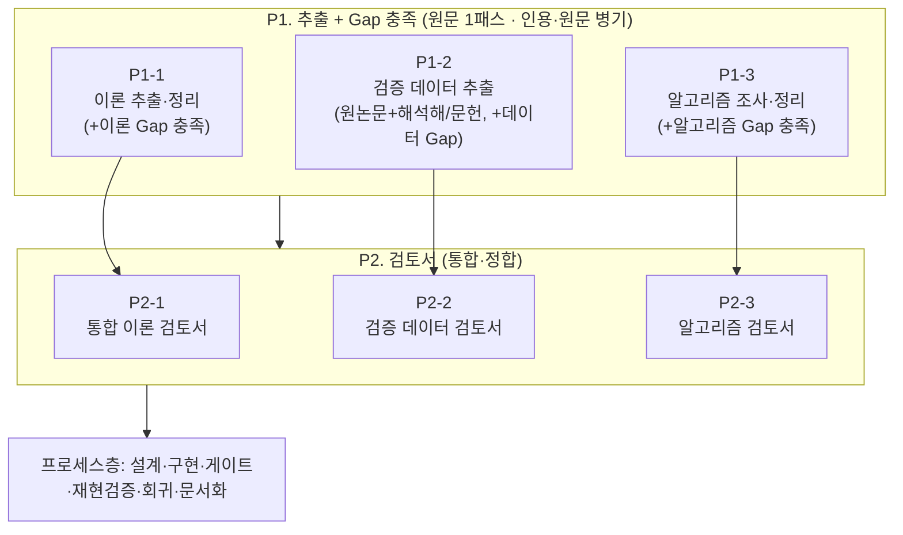
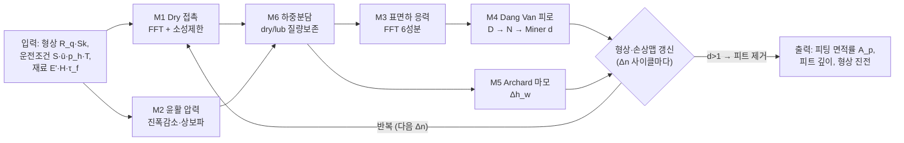
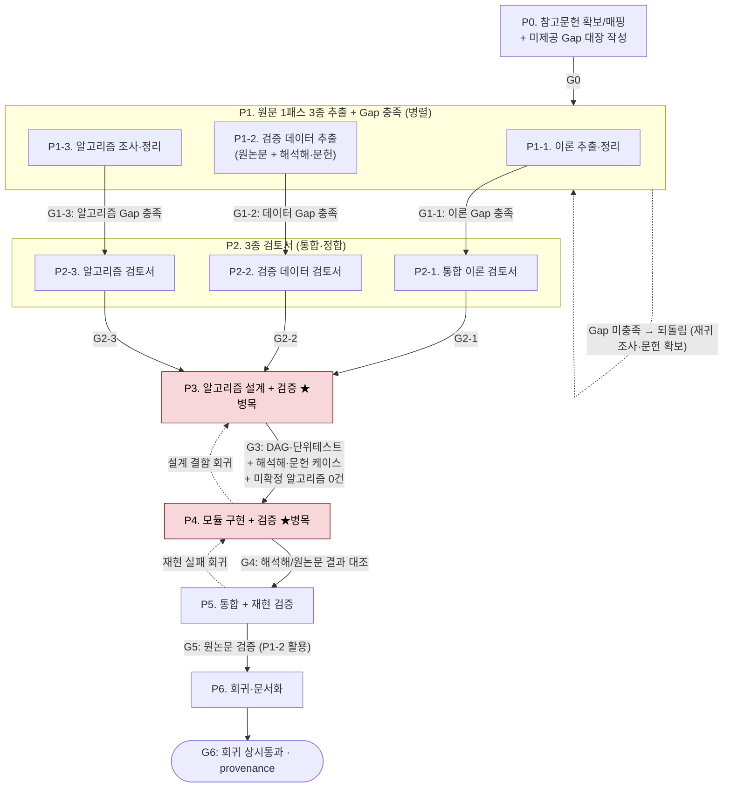
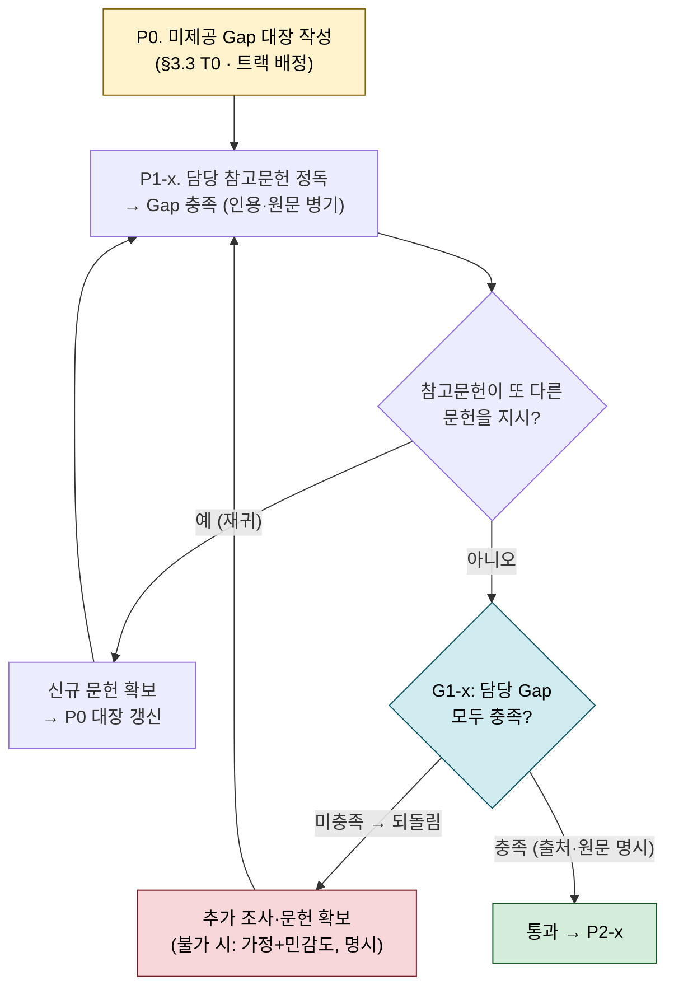
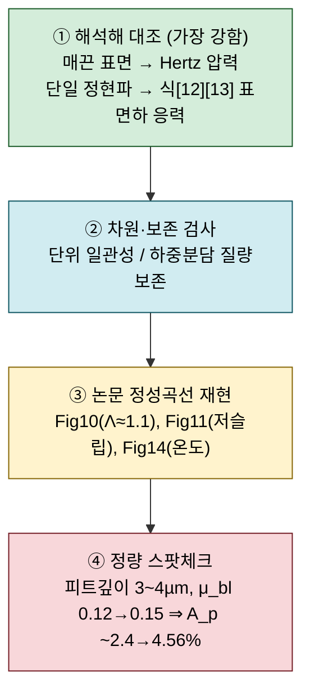

# 논문 수치해석 모델 구현 에이전트 — 프로세스 체계 정리 (v2_r1)

> **대상 논문**: Morales-Espejel & Brizmer (2011), *Micropitting Modelling in Rolling–Sliding Contacts: Application to Rolling Bearings*, Tribology Transactions 54(4), 625–643.
> **문서 목적**: 여러 참고문헌의 하위 수치모델을 독자적으로 결합한 이 논문을, **정확한 이론 파악 → 검증 데이터 확보 → 알고리즘 정리 → 설계·구현 → 재현 검증**까지 체계적으로 진행하기 위한 **개발 프로세스·게이트·검토 방법·도구 지형**을 정리한다.
> **작성 기준일**: 2026-07-01
> **v2_r1 변경점 (원문통합 정독·[[논문 구현 참고문헌·모델 정리]] §6 반영)**:
> 1. **§1.1 하위모델 참고문헌 체인 정정** — M1에 (24)(25)(26) 추가, M6에 (23) 명시, 전 모델에 **(21) 최우선** 표기.
> 2. **P0 확보 목록 구체화** — Tier A 17편 + (33)(37), **현재 보유는 (28)뿐**.
> 3. **미제공 Gap 해소 프로세스 도입** — **P0 Gap 대장 → P1-x 담당 참고문헌 재귀 조사 → G1-x 미충족 시 되돌림**(§3.1).
> 4. **M4 gap 격상** — Dang Van 응력이력(τ̂, p̂) 계산법이 **원 논문 부재**, (33)(34)(36) 확보를 필수 게이트로.
> 5. **템플릿 시드·확정 상수(Memory)·구현 함정·검증 실측값** 반영(§3.3~§3.5, §7).
> **관련 문서**: [[논문 구현 참고문헌·모델 정리]] · [[논문 구현 에이전트_v2]] · [[논문 구현 에이전트_v1_r1_부록1 반영]] · [[2011. (SKF) Micropitting Modelling in Rolling-Sliding Contacts (원문통합)]] · [[2007. (Hooke) Rapid calculation of pressures and clearances in rough rolling-sliding EHL contacts Part 1]]

---

## 0. 한눈에 보기 (Executive Summary)

- **이 작업의 성격**: 단일 논문 코딩이 아니라 **"논문 재현 + 다중 참고문헌 이론 융합"** 이다. 이 논문은 자체 완결 모델이 아니라 **최소 6개 하위 모델을 조립한 메타 모델**이며, 각 하위 모델의 원 유도·전제·유효범위는 별도 논문에 있다. → **한 논문만으로는 구현 불가**.
- **최대 리스크 네 가지**:
  1. **하위 모델의 유효 전제·범위 특정** → P1-1 정확한 정리 + **인용·원문(verbatim) 병기 + 연구자 더블체크**.
  2. **검증 오라클(정답 기준)의 부재** → 해석해·보존법칙·논문 Fig을 대리 오라클로 계층화, 모든 검증값은 **P1-2**에서 출처와 함께.
  3. **P3·P4 병목** — 논문은 "어떤 알고리즘을 썼다"만 밝히고 **상세 모델(이산화·수렴·경계조건)은 미제공**.
  4. **미제공 Gap의 재귀적 소재** — Gap은 대부분 참고문헌 체인 안에 있고, 그 문헌이 또 다른 문헌을 가리킬 수 있다(특히 M4). → **Gap 대장 기반 재귀 조사·되돌림 프로세스**(§3.1)로 관리.
- **확보 현황(정독 결과)**: 반드시 확보할 원문 ≈ **Tier A 17편 + (33)(37) = 약 19편**. 이 중 **최우선은 (21) Morales-Espejel 2010**(부분윤활 전체), **Dang Van gap 해소 핵심은 (33)**. **현재 보유 확인은 (28) 하나뿐**.
- **전체 흐름**:
  P0 참고문헌 확보 + **Gap 대장 작성** → **[P1 추출·Gap 충족 3트랙] P1-1 이론 · P1-2 검증데이터(원논문+해석해/문헌) · P1-3 알고리즘** → **[P2 검토서 3트랙] P2-1 통합이론 · P2-2 검증데이터 · P2-3 알고리즘** → **P3 알고리즘 설계+검증(★)** → **P4 모듈 구현+검증(★)** → **P5 통합+재현 검증** → **P6 회귀·문서화**. 각 단계는 게이트를 통과해야 다음으로 넘어가며, **P1-x는 담당 Gap 미충족 시 되돌림**.

---

## 1. 작업의 성격 해부

### 1.1 이 논문이 조립한 하위 모델 + 정확한 참고문헌 체인

> **(21) Morales-Espejel 2010이 M1·M2·M6 전체의 최우선 근거**(본 논문은 요약만 제공). ✅=보유 확인.

| # | 하위 모델 | 이 논문 역할(식) | 원 유도/전제 참고문헌 (구현 근거) |
|---|---|---|---|
| M1 | **Dry 접촉** (FFT + 탄성-완전소성) | 경계 패치 압력, $p_{lim}$ 제한 (식 1) | **(21)최우선**, (22) Stanley-Kato, (24) Kalker 변분, (25) Tian-Bushman 소성, (26) Johnson bi-sinusoidal(w 산출) |
| M2 | **윤활 압력** (진폭감소 + 상보파, 비뉴턴) | Lub 압력 리플 (식 5,7,8) | **(21)최우선**, (27) Hooke 2006, (28) Hooke 2007 ✅, (29) GME 1994, (16) ME 2003, (30) Ehret(Eyring 점도), (31) Venner-Lubrecht(상보파 진폭), (15) Venner 1997 |
| M3 | **표면하 응력 이력** (FFT) | 6응력 성분 (식 12,13) | (16) Morales-Espejel 2003 |
| M4 | **Dang Van 피로** | 위험계수 $D$, 수명 $N$ (식 9,11) | (13)(14) Dang Van, (18) Wöhler, (19) Shimizu(A,B), (20) Palmgren-Miner · **응력이력 결정: (33)(34)(36)** |
| M5 | **수정 Archard 마모** | 형상 갱신 (식 14,15) | (17) Archard, (10) Lainé-Olver(일반형), (37) Williams(k값) |
| M6 | **부분윤활 하중분담** | dry/lub 질량보존 반복 | **(21)최우선**, (23) Johnson-Greenwood-Poon(flow balance) |

부가 요소: 비뉴턴 Eyring 점도(식 6), 압축성 보정 $c_\rho$, 주기적 거칠기, Palmgren-Miner 누적.

### 1.2 정리 구조 — 추출(P1) × 검토서(P2) 3트랙 + Gap 충족

이론·검증·알고리즘 3트랙을 **원문 1패스에서 함께 추출(P1-x)** 하며, 각 트랙은 **담당 미제공 Gap을 참고문헌 재귀 조사로 채운다**. 3트랙 모두 **인용·원문 병기 + 연구자 더블체크** 필수.

---

## 2. 하위 모델 의존 관계 (Dependency DAG)

> **인터페이스 계약**: 각 화살표의 (물리량·단위)는 P2-1에서 확정. 예: M6→M3 = `(패치별 p(x,y), q(x,y))` [Pa], M3→M4 = `(표면하 6응력 σ_ij(x,y,z,t))` [Pa].
> **구현 함정(§3.4)**: $E'$는 **비표준 정의**($2/E'=(1-\nu_1^2)/E_1+(1-\nu_2^2)/E_2$)이며 $E^\ast=E'/2$. 입력 정의 확정 필수.

---

## 3. 전체 개발 프로세스 파이프라인 (v2_r1)

> **게이트 매핑**: **P1-x/G1-x = 추출+Gap 충족**(미충족 시 되돌림) / **P2-x/G2-x = 검토서** / **P3/G3 = 알고리즘 확정·설계검증**(해석해·문헌, 미확정 0건) / **P4/G4 = 구현검증**(해석해·원논문) / **P5/G5 = 재현검증**(원논문 Fig, P1-2 데이터).

### 3.1 미제공 Gap 해소 루프 (P0 → P1-x → G1-x) ★핵심

2011 논문의 "미제공 Gap"은 대부분 참고문헌 체인 안에 원 유도가 있다. **P0에서 Gap 대장 확정 → P1-x에서 담당 문헌을 (재귀적으로) 조사해 채움 → G1-x에서 미충족 시 되돌림.**

- **재귀 조사**: 예) M4 임계면·미시전단 진폭은 (33)→(13)(14)→추가 문헌으로 깊이 예측 불가 → **P0에서 최우선 착수**.
- **확보 불가 시**: 재귀로도 못 찾으면 **공학적 가정 + 민감도 분석으로 대체하고 '가정'으로 명시**(연구자 승인). 침묵 선택 금지.

### 3.2 Phase별 상세 (목표 · 도구 · 게이트 · 산출물 · 검토방법)

| Phase | 목표 | 사용 도구/스킬 | **게이트 (통과 기준)** | 산출물 | 검토 방법 |
|---|---|---|---|---|---|
| **P0** 참고문헌 확보/매핑 + **Gap 대장** | Tier A 17편+(33)(37) 확보(보유=(28)뿐) + 미제공 Gap 식별·트랙 배정 | 서브에이전트 검색, `paper-md-merge`(원문 준비) | **G0**: 확보/미확보 판정 + **Gap 대장(T0) 초안 완성·트랙 배정** | 참고문헌 매핑표 + **Gap 대장(T0)** | References·Gap 커버리지 대조 |
| **P1-1** 이론 추출·정리 | 이론 정리본+암묵지 대장 + **담당 이론 Gap 충족(재귀)** | `paper-original-summary`, `paper-summary`, `deep-research` (Workflow 병렬) | **G1-1**: 이론표(가정·유효범위·미기재상수+인용·원문) 완성 + **담당 Gap 전부 충족(출처·원문), 미충족 시 되돌림** | 이론 정리본 6종+암묵지 대장 (T1) | **연구자 더블체크**+교차검증 |
| **P1-2** 검증 데이터 추출 | **원논문 결과 + 해석해/문헌 케이스** + **담당 데이터 Gap 충족** | `paper-original-summary`, 그림 디지타이징, `deep-research` | **G1-2**: 검증 데이터셋(T3+T4) 인용·원문 병기 + **담당 Gap 충족, 미충족 시 되돌림** | 검증 데이터셋 (T3+T4) | **연구자 더블체크**+원문 대조 |
| **P1-3** 알고리즘 조사·정리 | 알고리즘 조사 대장 + **담당 알고리즘 Gap 충족(재귀)** | `paper-original-summary`, `deep-research` | **G1-3**: 조사 대장(T2) 완성, gap 식별 + **담당 Gap 충족, 미충족 시 되돌림** | 알고리즘 조사 대장 (T2) | **연구자 더블체크** |
| **P2-1** 통합 이론 검토서 | Fig1 플로우 식·변수·단위 완결, 인터페이스 정의 | 종합 + `AskUserQuestion` | **G2-1**: 차원/단위 일관성, 변수사전 확정, 미결 가정 0 | 통합 이론 검토서+변수사전 | 차원 해석, 계약 리뷰 |
| **P2-2** 검증 데이터 검토서 | 검증셋을 게이트(G3/G4/G5)·모듈·오라클 매핑, 허용오차 확정 | 종합 | **G2-2**: 전 검증항목 매핑 완료, 허용오차·판정기준 확정 | 검증 데이터 검토서 | 오라클 커버리지 리뷰 |
| **P2-3** 알고리즘 검토서 | §3.4 gap별 확정안/후보·근거·출처 정리 | 종합 + `AskUserQuestion` + `deep-research` | **G2-3**: 전 gap에 확정안/후보, **미확정 항목 명시** | 알고리즘 검토서 | 설계 타당성 리뷰 |
| **P3** 알고리즘 설계+검증 ★병목 | 검토서 기반 알고리즘 확정·설계 + 프로토타입 검증 | `Plan` 에이전트 + materials-simulation | **G3**: DAG 확정, 단위테스트 명세, **해석해·문헌 케이스 통과, 미확정 알고리즘 0건** | 알고리즘 명세서+프로토타입+테스트 | 해석해·문헌 대조, 수치안정성, 연구자 더블체크 |
| **P4** 모듈 구현+검증 ★병목 | 하위모델별 프로덕션 구현·검증 | 구현 + materials-simulation | **G4**: **해석해/원논문 결과 대조 통과** | 모듈 코드+단위테스트 | 해석해·원논문 대조, 차원·보존 |
| **P5** 통합+재현 검증 | 전체 통합, 원논문 재현 | `/loop`(Ralph), CHANGELOG | **G5**: **원논문 검증(P1-2 활용)** — Fig10 Λ≈1.1, Fig11 저슬립, 피트깊이 3~4µm | 통합 코드+재현 리포트 | 정성곡선·정량 스팟체크 |
| **P6** 회귀·문서화 | 검증셋 고정, 최종 문서 | git + Memory | **G6**: 회귀 상시통과, provenance 추적 | 회귀 테스트셋+최종 문서 | 회귀 실행, provenance 확인 |

> **P0 확보 대상 리스트**: **Tier A(17)** = (16)(21)(22)(24)(25)(26)(27)(28)(29)(30)(31)(13)(14)(17)(23)(19)(20) + **Tier B 우선** (33)(37). **최우선=(21)**, **Dang Van gap=(33)**. **보유=(28)뿐** → 나머지 ~18편 확보가 P0 실과제. (전체 41편 분류는 [[논문 구현 참고문헌·모델 정리]] §4)

### 3.3 원문 추출 표 템플릿 (인용·원문 병기 · 연구자 더블체크)

소속: **T0→P0**, **T1→P1-1**, **T2→P1-3**, **T3·T4→P1-2**. (상세 예시 행은 [[논문 구현 참고문헌·모델 정리]] 참조)

**[T0] 미제공 Gap 대장 (P0, 마스터)** — 시드 예시:

| Gap ID | 소속 | 미제공 내용 | 1차 조사 대상(Ref) | 담당 트랙 | 재귀 | 상태 |
|---|---|---|---|---|---|---|
| **G-M4-1** | M4 | **임계면 탐색법 + 미시전단 진폭 $\hat\tau$ 정의** | (13)(14)(33)(34)(36) | P1-1+P1-3 | **높음** | ☐ |
| G-M4-3 | M4 | $N_{ref}$·$\tau_f,\sigma_f$ 기준수명 | (33)(19) | P1-2 | 중 | ☐ |
| G-M2-1 | M2 | 상보파 진폭 $h_c,p_c$ 보간표 | (31)(21) | P1-3 | 중 | ☐ |
| **G-M6-1** | M6 | **EHL 중앙유막 $\bar h$ 공식 미지정** | 교과서(Dowson-Higginson 등) | P1-3 | 중 | ☐ |
| G-M6-2 | M6 | $c_\rho$ 압축성식(표기 불명확) | (21) | P1-1 | 낮음 | ☐ |
| G-M1-2 | M1 | 소성 압력 재분배 순서 | (25)(21) | P1-3 | 중 | ☐ |
| G-CMN-1 | 공통 | $\Delta n$ 표기·선정기준 | (21) | P1-3 | 낮음 | ☐ |
| … | | (전체 16항목: 참고문헌·모델 정리 §2.2) | | | | |

**[T1] 이론 추출 표 (P1-1)** · 열: `항목/식 · 이 논문 위치 · 원 출처 인용위치 · 원문(verbatim) · 가정·유효범위 · 미기재 상수 · 연구자 확인`

**[T2] 알고리즘 조사 대장 (P1-3)** · 열: `알고리즘 ID · 대상 모듈 · 이 논문 명시 방법(위치·원문) · 원 참고문헌 · 제공 상세 수준 · 미제공 gap · 대체 후보 · 확정 여부 · 연구자 확인` (T0의 알고리즘 Gap을 상속)

**[T3] 검증 데이터 표 — 원논문 결과 (P1-2, G5용)** · 실측 시드:

| 검증항목 | 값 | 인용위치 | 오라클 | 허용오차 |
|---|---|---|---|---|
| 피트 깊이(=최대 vM 깊이) | 3~4 µm | p.639, Fig15/16 | ④ | ±1 µm |
| 피트 직경 | 10~20 µm | Fig16 | ④ | — |
| Λ 최대점(마모 포함) | Λ≈1.1 | Fig10 | ③ | 극값 ±0.1 |
| 슬라이딩 최대 위험 | S≈0.01 | Fig11 | ③ | — |
| 경계마찰 민감도 | $\mu_{bl}$ 0.12→0.15 ⇒ $A_p$ ~2.4→4.56% | Boundary Friction 절 | ④ | — |
| 전베어링 $A_p$ | 66°C 3.16%(Λ0.44)/73°C 4.33%(Λ0.42)/98°C 0.91%(Λ0.33) | Fig14 | ③④ | — |

**[T4] 검증 케이스 표 — 해석해/문헌 (P1-2, G3·G4용)** · 시드:

| 케이스 | 대상 | 근거(출처) | 기대 |
|---|---|---|---|
| 매끈면 → Hertz 압력·접촉폭 | M1 | (26)/Johnson *Contact Mechanics* Ch.4 | Hertz 분포 ≤1% |
| 단일 정현파 압력/트랙션 → 식[12][13] | M3 | **식[12][13] 자체가 해석해** / (16) | 응력장 ≤2% |
| 단일 정현파 거칠기 → $p_a/r_a$ vs $Q$ (식[5]) | M2 | (29)(31) 곡선 | 곡선 정합 |
| Dang Van 단순 비례하중 궤적 | M4 | (33)(34) 예제 | $D$ ≤2% |

### 3.4 하위모델별 알고리즘 Gap + 구현 함정

P3에서 직접 결정·재구성해야 하는 상세. P1-3 조사 → P2-3 검토서 → P3 확정으로 좁힌다.

| 모듈 | 논문이 밝힌 것 | 직접 결정해야 할 상세(gap) |
|---|---|---|
| **M1 Dry** | FFT 변위+Kalker 변분, $p_{lim}$ 소성제한 | 반복 보정 스킴·수렴판정, 소성 압력 재분배, 접촉영역 초기추정 |
| **M2 윤활** | 진폭감소 특수해+상보파 | 상보파 진폭 보간((31) 수치), 감쇠율 $\beta$, 주파수영역 필터, cavitation 처리 |
| **M3 응력** | 식[12][13], $\zeta=\sqrt{\alpha^2+\beta^2}$ | FFT 정규화·부호 규약, z 샘플링(0~0.25a·15층) |
| **M4 Dang Van** ★ | 식[9~11] | **임계면 탐색·미시전단 진폭 $\hat\tau$·순간 정수압 $\hat p$ — 원 논문 부재((33)(34)(36) 필수)**, Miner 이산화 |
| **M5 Archard** | 식[14][15], 최고 돌기부터 제거 | 형상 갱신 규칙(양표면 절반), $k_{dry}/k_{lub}$ 전환 |
| **M6 하중분담** | 질량보존 반복, $h_{tran}$, $c_\rho$ | **EHL 중앙유막 공식(미지정)**, 반복 수렴판정, $c_\rho$ 정확식 |
| **공통** | $\Delta n$ 묶음 갱신 | $\Delta n$ 선정기준, 좌표·단위 규약 |

> **⚠️ 구현 함정 (사전 확정 필수)**:
> - **$E'$ 비표준 정의**: $2/E'=(1-\nu_1^2)/E_1+(1-\nu_2^2)/E_2$ (통상의 2배), **$E^\ast=E'/2$** — 계수 혼동 시 전체 압력 왜곡.
> - **cavitation**: 음압 → $p_{tran}=0$ 고정(오차 유발, 고진폭 형상 회피로 최소화).
> - **$\Delta n$ 표기 모호**("$\Delta n\le10^{-5}$"의 의미 불명 → (21) 확인).
> - **$c_\rho$ 식 표기 불명확**(nomenclature) → (21) 확인.

### 3.5 확정 상수·물성 (Memory single-source-of-truth 초기값)

| 파라미터 | 값 | 출처 | 모델 |
|---|---|---|---|
| $p_{lim}$ (AISI 52100 first-yield) | 4.3 GPa | 원문 EPP 절 | M1 |
| $H$ (경도) | ≈7 GPa | 원문 Wear 절 | M5 |
| $A$ / $B$ (Wöhler) | −43.0 MPa / 1220 MPa | (19) Shimizu | M4 |
| $\alpha$ (Dang Van, von Mises) | ≈0.232 | 원문 Fatigue 절 | M4 |
| $\tau_f$ | $\approx\sigma_f/\sqrt3$; $N_{ref}>10^6$ | (33) | M4 |
| $\tau_0$ (Eyring) | $3\times10^6$ Pa | Table 1,2 | M2 |
| $k_{lub}$ / $f_w$ | $1\!\times\!10^{-11}\!\sim\!5\!\times\!10^{-10}$ / ≈10 | (37) | M5 |
| $E'$ / $\alpha_{visc}$ | 231 GPa (2/E′ 정의) / 20.78 GPa⁻¹ | Table 1,2 | M1,M2 |
| $\mu_{bl}$ / $\mu_{ehl}$ | 0.12 / 0.05 | Table 1,2 | M6 |
| 수치격자 | 121×121, z 0~0.25a 15층(표면집중), 마모 10·시간 10 스텝 | 원문 Lab 절 | 공통 |

---

## 4. 검증 오라클 계층 — 이 작업의 급소

실험 데이터가 없으므로 대리 오라클을 계층화. **①의 케이스는 §3.3 T4, ③④의 데이터는 §3.3 T3**(모두 P1-2 산출물).

| 오라클 | 검증 대상 | 기대치 | 출처 | 적용 |
|---|---|---|---|---|
| ① 해석해 | M1, M3 | 매끈면→Hertz, 정현파→식[12][13] | §3.3 T4 (P1-2) | P3·P4 |
| ② 보존/차원 | M6, 전체 | dry+lub=총하중, 단위 일관 | 자체 | P4~P5 |
| ③ 정성곡선 | 전체 | Fig10 Λ≈1.1 / Fig11 S≈0.01 | §3.3 T3 (P1-2) | P5 |
| ④ 정량 | 전체 | 피트 10~20µm·깊이 3~4µm, 경계마찰 민감도 | §3.3 T3 (P1-2) | P5 |

---

## 5. 컨텍스트 규율 (장기 실행 대비)

Anthropic "장기 실행 과학계산"(CLASS 재구현) 규율을 이식.

| 파일 | 역할 | 이 프로젝트 적용 |
|---|---|---|
| **CLAUDE.md** | 계획·설계결정·목표 | 6개 하위모델 상태, 확정 전제, 목표 정확도 |
| **CHANGELOG.md** | 장기기억(**실패 기록**) | "특수해만으로 리플 과소→상보파 추가", "CG+FFT 발산→완화 0.3" |
| **git commit** | 복구가능 이력 | 의미 단위 커밋, 재현 Fig 스냅샷 |
| **Memory** | 상수·검증데이터·알고리즘·**Gap 상태** SSOT | §3.5 상수(출처 병기), T0 Gap 대장 상태 |

> **정량 성공기준**: 실험 데이터 부재 → **"Fig10/11 극값·곡선 재현 + 피트깊이 3~4µm"**(§4 ③④, 데이터는 P1-2).

---

## 6. 도구/스킬 지형

### 6.1 환경 내장 1차 도구

| 도구 | 쓰임 |
|---|---|
| **Dynamic Workflows** | P1-1/1-2/1-3 추출·Gap충족 에이전트 병렬 fan-out → 구조화 수집 → 교차검증 |
| **서브에이전트**(Explore/Plan/general-purpose) | PDF 병렬 심층독해, 알고리즘·Gap 재귀 조사, 계획 수립 |
| **`paper-original-summary`** | **P1 핵심.** 본문 원문·수식 verbatim 보존 → 인용·원문 병기 |
| **`paper-summary`** | 참고문헌 표준 양식(한국어) 정리 |
| **`paper-md-merge`** | MinerU 추출 MD+이미지 통합(P0 원문 준비) |
| **`deep-research`** | 이론·알고리즘 gap, 문헌 검증 케이스, **재귀 문헌 추적** |
| **Memory** | 상수·검증데이터·Gap 상태 고정 |
| **`/loop`** | Ralph Loop 로컬 등가 — 검증/Gap 충족 반복 |
| **CLAUDE.md/CHANGELOG.md/git** | §5 컨텍스트 규율 |

### 6.2 Anthropic 공식 방법론
- Long-running Claude for scientific computing — <https://www.anthropic.com/research/long-running-Claude>
- Dynamic workflows — <https://claude.com/blog/a-harness-for-every-task-dynamic-workflows-in-claude-code> · <https://code.claude.com/docs/en/workflows>

### 6.3 커뮤니티 하네스 / 메타스킬
| 리소스 | 성격 |
|---|---|
| [revfactory/harness](https://github.com/revfactory/harness) | 에이전트 팀+스킬 자동 설계 메타스킬 |
| [anothervibecoder-s/claudecode-harness](https://github.com/anothervibecoder-s/claudecode-harness) | 프로덕션급 오케스트레이션 |
| [VILA-Lab/Dive-into-Claude-Code](https://github.com/VILA-Lab/Dive-into-Claude-Code) | Claude Code 에이전트 설계 분석 |

> ⚠️ 구조/운용틀만 제공, 트라이볼로지 도메인 지식 없음 → 게이트는 직접 채운다.

### 6.4 과학계산 스킬 마켓
- [K-Dense 과학 스킬](https://github.com/K-Dense-AI/claude-scientific-skills) (materials-simulation: 수치안정성·솔버·검증) · [MATLAB/Octave](https://mcpmarket.com/tools/skills/matlab-octave-scientific-computing) · [Julia](https://mcpmarket.com/tools/skills/julia-numerical-computing) · [awesome-claude-skills](https://github.com/travisvn/awesome-claude-skills)

### 6.5 논문→코드 재현 프레임워크 (패턴 차용)
| 프레임워크 | 차용 패턴 |
|---|---|
| [Paper2Code](https://arxiv.org/abs/2504.17192) | Planning→Analysis→Generation 다중에이전트 |
| [Paper2Agent](https://arxiv.org/pdf/2509.06917) | Claude Code 오케스트레이터+환경관리 |
| ["What Papers Don't Tell You"](https://arxiv.org/pdf/2603.01801) | **암묵지·알고리즘 상세 복원**(→ T0/T2) |
| [Prompt-free Collaborative Agents](https://arxiv.org/abs/2512.02812) | 검증+정제 에이전트 루프(→ 게이트) |
| PaperBench | 단계별 채점 루브릭(→ 게이트 체크리스트) |

---

## 7. 리스크 레지스터

| ID | 리스크 | 영향 | 완화책 |
|---|---|---|---|
| R1 | 하위모델 전제 오해 | 결과 전면 오류 | P1-1 암묵지 대장 + 인용·원문 병기 + 연구자 더블체크(G1-1) |
| R2 | 검증 오라클 부재 "그럴듯하나 틀림" | 잘못된 확신 | §4 해석해 우선(G3·G4) + P1-2 검증셋 |
| R3 | 미기재 상수/초기화 | 재현 실패 | deep-research 추적, Memory에 출처 고정 |
| R4 | 단위/좌표 규약 불일치 | 통합 폭발 | P2-1 인터페이스 계약 + 차원검사(G2-1) |
| R5 | 수치 불안정(FFT·반복 발산) | 진행 정체 | materials-simulation, 안정성 사전점검(G3) |
| R6 | 장기 세션 컨텍스트 유실 | 재작업 | CLAUDE.md/CHANGELOG.md/git(§5) |
| R7 | 자동화 프레임워크 과신 | 방향 오류 | 프레임워크는 패턴만, 도메인 게이트 직접 |
| R8 | 검증 데이터 오추출·출처 불명 | 잘못된 검증 통과 | P1-2 인용·원문 병기+더블체크(G1-2), 기억 값 금지 |
| **R9** | **알고리즘 상세 미제공(P3·P4 병목)** | 큰 재작업·왜곡 | **T0 Gap 대장+재귀 조사+P2-3 검토서+G3 "미확정 0건"+다중 후보+해석해 우선(§3.1,§3.4)** |
| **R10** | **미제공 Gap 재귀 확보 실패** (예: M4 임계면법) | 진행 정지 | **G-M4-1 최우선 착수; 불가 시 가정+민감도 대체·명시(연구자 승인)** |
| **R11** | **구현 함정**($E'$ 정의·cavitation·$\Delta n$·$c_\rho$) | 조용한 오류 | **§3.4 함정 목록 사전 확정, Memory 등록** |

---

## 8. 다음 단계 (실행 순서 제안)

1. **P0 착수**: `05. Surface` 등 폴더 스캔 → **Tier A 17편+(33)(37) 확보/미확보 판정**(보유=(28)뿐) + **미제공 Gap 대장(T0) 작성·트랙 배정**. **G-M4-1(Dang Van 임계면)·G-M6-1(EHL 유막 공식) 최우선**. → **G0**
2. **P1 원문 1패스 3종 추출 + Gap 충족 (병렬)**: `paper-original-summary`로 원문 verbatim 보존 → T1(이론)·T3+T4(검증데이터·문헌케이스)·T2(알고리즘 대장) 작성 + **담당 Gap을 참고문헌 재귀 조사로 충족**. 미확보 Gap 존재 시 **되돌림**(추가 문헌 확보·(불가 시)가정+민감도). → **G1-1/G1-2/G1-3**
3. **P2 3종 검토서**: 통합 이론(인터페이스 계약)/검증 데이터(게이트·오라클 매핑)/알고리즘(gap별 확정안). → **G2-1/2-2/2-3**
4. **P3 알고리즘 설계+검증(★)**: gap 확정(다중 후보 판정), 프로토타입을 T4 해석해·문헌으로 검증, 미확정 0건. → **G3**
5. **P4 모듈 구현+검증(★)**: 프로덕션 모듈을 해석해·원논문 결과 대조. → **G4**
6. **P5 통합+재현 검증**: 전체 통합 후 T3 원논문 결과로 재현. → **G5**
7. **P6 회귀·문서화**: 검증셋 고정, provenance 정리. → **G6**

> **구현 언어 미정** — P0~P3(이론·검증데이터·알고리즘·설계)은 언어 무관. P4 착수 전 Python(NumPy/SciPy)/MATLAB/Julia 결정. **Python 기본 후보**, MATLAB 대안.

---

**참고 리소스**
- Anthropic *Long-running Claude for scientific computing* — <https://www.anthropic.com/research/long-running-Claude>
- Anthropic *Dynamic workflows* — <https://claude.com/blog/a-harness-for-every-task-dynamic-workflows-in-claude-code> · <https://code.claude.com/docs/en/workflows>
- Paper2Code (2504.17192) · Paper2Agent (2509.06917) · What Papers Don't Tell You (2603.01801) · Prompt-free Collaborative Agents (2512.02812)
- revfactory/harness · anothervibecoder-s/claudecode-harness · K-Dense/claude-scientific-skills · travisvn/awesome-claude-skills

> **비고 (v2_r1)**: v2에 [[논문 구현 참고문헌·모델 정리]] §6 반영 포인트 8개 통합 — 참고문헌 체인 정정(§1.1), P0 확보 목록·Gap 대장(§3.2·T0), **미제공 Gap 재귀 해소·되돌림 프로세스(§3.1)**, M4 gap 격상(§3.4·R9), 구현 함정(§3.4·R11), 확정 상수 Memory 시드(§3.5), 검증 실측값(T3/T4).

---

**끝**
