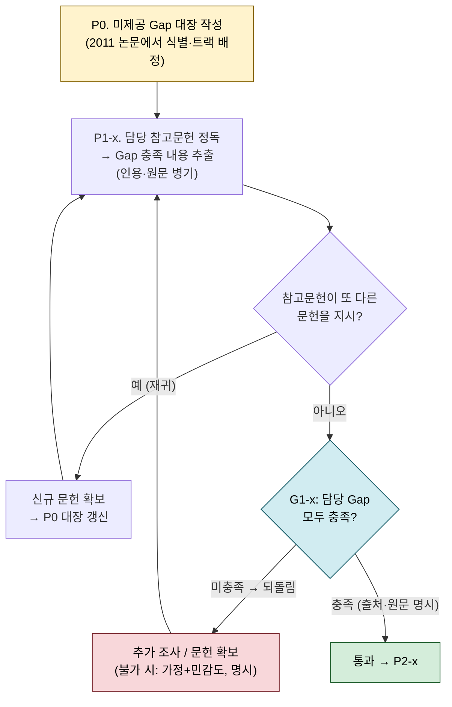

# 마이크로피팅 모델 구현 — 참고문헌·모델 상세 정리 (원문통합 정독 기반)

> **목적**: [[2011. (SKF) Micropitting Modelling in Rolling-Sliding Contacts (원문통합)]] 전체를 정독하여, **구현에 필요한 하위 모델·지배방정식·상수·참고문헌**을 빠짐없이 정리한다. 조금이라도 구현에 관련되는 참고문헌은 모두 분류·수록한다.
> **용도**: 본 정리를 검토한 뒤 에이전트 문서([[논문 구현 에이전트_v2]])의 §1.1 하위모델표·§3.2 템플릿·검증 데이터·리스크를 수정한다.
> **작성 기준일**: 2026-07-01
> **핵심 발견**: (1) **참고문헌 (21) Morales-Espejel 2010이 부분윤활 전체를 담은 최우선 문서**다(본 논문은 요약만). (2) **Dang Van 응력이력(τ̂, p̂) 계산법은 본 논문이 "다루지 않는다"고 명시** → (33)(34)(36)에서 확보 필수. (3) **E' 정의가 비표준**(2/E′ = …)이라 구현 시 계수 주의.
> **Gap 해소 원칙**: 2011 논문의 "미제공 Gap"은 "본 논문에 없다"는 뜻이지 "어디에도 없다"는 뜻이 아니다 — 대부분 §1의 참고문헌 체인 안에 원 유도·상세가 있다. 따라서 **P0에서 Gap 대장을 확정 → P1-1/1-2/1-3에서 담당 참고문헌을 (필요 시 재귀적으로) 조사해 채움 → G1-x에서 미충족 Gap이 있으면 되돌림**. (→ §2)
> **확보 현황(2026-07-04)**: **Tier A 전 16편 + (32) = 17편 확보** (`…/06. 피로, 신뢰성/01. SKF/관련 문헌/`). 남은 필수는 **Tier B (33)(37) 등**. 편별 보유는 §1 '확보' 열·부록 1 참조.

---

## 0. 지배방정식·핵심식 목록 (원문 식 번호 기준)

| 식 | 내용 | 소속 모델 | 원 출처(구현 근거) |
|---|---|---|---|
| **[1]** | $\mathbf{u}(\mathbf{p})=\text{IFFT}\{\mathbf{w}\cdot\text{FFT}(\mathbf{p})\}$ — 탄성 변위(FFT) | M1 Dry | (22)(26), w 행렬 3D는 (21) |
| **[2]** | 선형화 Reynolds (미세형상 변동) | M2 Lub | (16)(27)(28) |
| **[3]** | $v_a=4p_a/(E'\sqrt{\omega_x^2+\omega_y^2})$ — 변위 리플 진폭 | M2 | (26)(29) |
| **[4]** | $\rho_a=(\rho/B)p_a$ — 밀도 리플(압축성) | M2 | (28) |
| **[5]** | $p_a/r_a=\frac{\kappa E'}{4}\frac{iQ}{1-iQ-iCQ}$ — 압력 리플 특수해 | M2 | (28)(29) |
| **[6]** | $\eta_x,\eta_y$ — Eyring 방향별 유효점도 | M2 | **(30) Ehret** |
| **[7][8]** | 상보파 $\delta h_c,\delta p_c$ 와 $\psi$ 분산관계 | M2 | **(28) Hooke** |
| **[9]** | $D=\max_t\{\hat\tau/(\tau_f-\alpha\hat p)\}$ — Dang Van 위험계수 | M4 | (13)(14) |
| **[10]** | $\sigma_f=A\ln(N)+B$ — Wöhler(S–N) | M4 | (18), 상수는 (19) |
| **[11]** | 식[10]을 [9]에 대입($D{=}1$)한 수명 $N$ | M4 | (13)(19)(33) |
| **[12]** | 법선압력 $p_0\cos\alpha x\cos\beta y$ → 표면하 6응력 | M3 | **(16)** |
| **[13]** | 트랙션 $q_0\cos\alpha x\cos\beta y$ → 표면하 6응력 | M3 | **(16)** |
| **[14]** | $\Delta h_w/\Delta n=k\,p\,u_s/H$ — Archard 마모 | M5 | (17)(10) |
| **[15]** | $\Delta h_w=\frac{u_s}{HA}\int_A k\,p\,dA$ — 스텝당 평균 마모층 | M5 | (17) |
| 하중분담 | $h_{tran}=\text{IFFT}\{\max(|\tilde h_{dry}|,|\tilde h_{lub}|)\}$, $p_{tran}=\text{IFFT}\{w^{-1}\cdot\text{FFT}(r-h_{tran})\}$ | M6 | **(21)(23)** |

---

## 1. 하위 모델별 상세 + 정확한 참고문헌 체인

### M1. Dry 접촉 (FFT + 탄성-완전소성)

- **본 논문 위치**: "Dry Contact Model" / "Modification for Elastic–Perfectly Plastic Material", 식[1].
- **알고리즘(원문 요약)**: Kalker 변분원리 기반. 초기 압력행렬 추정 → $\mathbf p'=\mathbf p-\text{grad}\{f(\mathbf p)\}$, $\text{grad}\{f\}=\mathbf u(\mathbf p)+\mathbf g$ → 양압 합=목표하중 되도록 상하 시프트 → 음압 절단 → 수렴까지 반복. 탄성-완전소성은 Tian & Bushman 스킴으로 매 반복 후 압력을 $p_{lim}$로 제한·음압 절단·$\Delta\mathbf p$ 수렴 검사.
- **참고문헌 체인**:
  | Ref | 역할 | 확보 |
  |---|---|---|
  | **(22) Stanley & Kato 1997** | FFT 기반 거친면 접촉법, 식[1] 원출처 | ✅ 보유 |
  | **(24) Kalker 1977** | 변분원리(알고리즘 이론 기반) | ✅ 보유 |
  | **(25) Tian & Bushman 1996** | 탄성-완전소성 3D 변분 스킴 | ✅ 보유 |
  | **(26) Johnson, Greenwood & Higginson 1985** | bi-sinusoidal 압력→변위해 → w(주파수응답함수) 산출 | ✅ 보유 |
  | **(21) Morales-Espejel 2010** | **3D w 전체 행렬** 명시 | **최우선**·✅보유 |
- **미제공 gap**: 반복 수렴판정 임계(error)값, 소성 압력 재분배 순서(원문 단계가 "Go back to Truncate…"로 다소 모호), 접촉영역 초기추정.
- **주의(구현 함정)**: $E^\ast=E'/2$ (dry-contact effective modulus). 그리고 **$2/E'=(1-\nu_1^2)/E_1+(1-\nu_2^2)/E_2$** — 통상 정의($1/E'=\cdots$)의 2배이므로 계수 혼동 금지.

### M2. 윤활 압력 (진폭감소 + 상보파, 비뉴턴)

- **본 논문 위치**: "Lubrication Model", 식[2]~[8].
- **핵심**: 접촉 중앙에서 미세형상 변동곱·미분곱 무시 → 선형 Reynolds[2]. 해 = **특수해(정상상태, $u_2$로 이동)** + **상보파(입구 생성, $\bar u$로 전파, 비뉴턴 감쇠)**. 특수해 진폭 식[5]; 상보파 파수 $\psi=\omega_{x'}+i\beta$, 분산관계 식[8]을 성분별로 풀이(실부/허부 교대 대입). 상보파 진폭 $h_c,p_c$는 **(28) 보간 대신 (21)의 수정법(=(31) 뉴턴 수치결과 기반)을 채택**.
- **참고문헌 체인**:
  | Ref | 역할 | 확보 |
  |---|---|---|
  | **(27) Hooke 2006** | 롤링–슬라이딩 비뉴턴 거칠기 EHL | ✅ 보유 |
  | **(28) Hooke, Li & Morales-Espejel 2007** | 진폭감소·상보파 식[7][8] 원출처 | ✅ 보유 |
  | **(29) Greenwood & Morales-Espejel 1994** | 2성분해(특수해+상보파) 이론 | ✅ 보유 |
  | **(16) Morales-Espejel 2003** | 진폭감소법 최초(뉴턴), 식[2] 기반 | ✅ 보유 |
  | **(30) Ehret, Dowson & Taylor 1998** | Eyring 방향별 유효점도 식[6] | ✅ 보유 |
  | **(31) Venner & Lubrecht 2000** | 상보파 진폭 보간용 뉴턴 진폭감소 곡선 | ✅ 보유 |
  | **(15) Venner et al. 1997** | "amplitude reduction" 용어·방법론 기원 | 참고 |
  | **(21) Morales-Espejel 2010** | 비뉴턴 상보파 수정법·전체 통합 | **최우선**·✅보유 |
- **미제공 gap**: 상보파 진폭 보간표의 구체 수치((31)에서 추출), $\beta$(감쇠율) 초기추정, cavitation 처리(음압→0)로 인한 오차범위. Eyring: $\dot\gamma=(\tau_0/\eta)\sinh(\tau/\tau_0)$, $\tau_0=3\times10^6$ Pa.
- **유효범위(원문 명시)**: 유막 대비 **저진폭** 미세형상에서만 정확. 거칠기 골(압력≈0)에서 국부변형 부정확하나 응력·피로엔 영향 작음.

### M3. 표면하 응력 이력 (FFT)

- **본 논문 위치**: "Stress History Calculation", 식[12][13].
- **핵심**: 정현파 법선압력·트랙션에 대한 표면하 6응력 성분 **폐형식**($\zeta=\sqrt{\alpha^2+\beta^2}$). 임의 압력장은 FFT로 정현파 성분 분해 후 중첩. 트랙션 $q=\mu p$ (Coulomb).
- **참고문헌 체인**:
  | Ref | 역할 | 확보 |
  |---|---|---|
  | **(16) Morales-Espejel 2003** | FFT 표면하 응력식[12][13] 원출처 | ✅ 보유 |
- **미제공 gap**: 깊이 z 샘플링(원문: z=0~0.25a, 15층, 표면 근처 집중), 성분별 FFT 규약(정규화·부호).
- **검증 이점**: 식[12][13] 자체가 단일 정현파의 **해석해** → M3 단위검증에 직접 사용(FFT 구현이 정현파에서 식[12][13]을 재현하는지).

### M4. Dang Van 피로 + Wöhler + Palmgren-Miner

- **본 논문 위치**: "Fatigue Criterion", 식[9]~[11]. + "Stress History"에서 τ̂, p̂ 언급.
- **핵심**: 위험계수 식[9]. $\alpha=(\tau_f-\sigma_f/2)/(\sigma_f/3)$, von Mises 가정 $\tau_f\approx\sigma_f/\sqrt3$ → $\alpha\approx0.232$. Wöhler[10] 대입 → 수명 $N$ 식[11]. Miner로 손상맵 누적, $d>1$이면 피트.
- **⚠️ 최대 gap (원문 명시적 회피)**: **"임계면 순간 미시전단응력 진폭 $\hat\tau(\vec n,t)$와 순간 정수압 $\hat p(t)$의 결정은 여기서 다루지 않는다"** → (13)(14)(33)(34)(36)에서 임계면 탐색·미시전단 진폭 정의를 확보해야 함. **구현 병목의 핵심.**
- **참고문헌 체인**:
  | Ref | 역할 | 확보 |
  |---|---|---|
  | **(13) Dang Van et al. 1989** | 다축피로 기준 원출처 식[9] | ✅ 보유 |
  | **(14) Dang Van 1993** | macro-micro 접근 | ✅ 보유 |
  | **(18) Wöhler 1870** | S–N 곡선 개념 식[10] | 참고 |
  | **(19) Shimizu et al. 2009** | **A=−43.0 MPa, B=1220 MPa (AISI 52100)** 출처 | ✅ 보유 |
  | **(20) Palmgren 1924** | Palmgren-Miner 누적 | 참고 |
  | **(33) Desimone et al. 2006** | Dang Van RCF 적용, τ̂/p̂ 결정, $N_{ref}$ | **필요** |
  | **(34) Bernasconi et al. 2006** | 다축(비비례)하 응력 결정 | 필요 |
  | **(36) Baietto et al. 2010** | 임계면 전단 진폭 계산(X-FEM 프레팅) | 필요 |
  | **(32) Dang Van & Maitournam 2003** | 롤링접촉(철도) 적용례 | ✅ 보유 |
  | **(35) Fouvry et al. 2000** | 프레팅서 Dang Van 성공례(적용 정당성) | 참고 |
- **재료상수**: $\tau_f,\sigma_f$는 기준수명 $N_{ref}(>10^6)$에 연계((33)).

### M5. 경마모 (수정 Archard)

- **본 논문 위치**: "Wear Model", 식[14][15].
- **핵심**: $\Delta h_w/\Delta n=k\,p\,u_s/H$. 거칠기 시료 내 $u_s$·$H$ 일정 가정 → 식[15]. 스텝당 $\Delta h_w$를 양 표면에 절반씩: (a) 손상맵을 표면쪽으로 $\Delta h_w$ 이동, (b) 최고 돌기부터 $\Delta h_w$ 제거. $k_{dry}=f_w k_{lub}$, $f_w\approx10$, $1\times10^{-11}\le k_{lub}\le5\times10^{-10}$, $H\approx7$ GPa.
- **참고문헌 체인**:
  | Ref | 역할 | 확보 |
  |---|---|---|
  | **(17) Archard 1953** | 마모 법칙 원출처 | ✅ 보유 |
  | **(10) Lainé & Olver 2007** | 마모 일반형·피로-마모 경쟁 | 필요 |
  | **(37) Williams 1999** | $k_{lub}$ 값 범위 근거 | 필요 |
- **한계(원문)**: 국부 마모 미고려 → 충분 시간/마모율이면 거칠기 완전 제거.

### M6. 부분윤활 하중분담 (dry/lub 결합)

- **본 논문 위치**: "Combined Model for Partial Lubrication".
- **핵심 절차**: ① 매끈 중앙유막 $\bar h$를 임의 EHL 공식으로 계산 → ② 평균압 초기=$p_h$ → ③ dry 분담 $\phi_{bl}$ 가정 → dry/lub 모델로 국부압력·간극 → ④ dry/lub 영역 재식별, flow balance 유지하며 수렴까지 반복 → ⑤ 압축성 보정 $c_\rho$로 $\bar h$ 조정. 전이간극 $h_{tran}=\text{IFFT}\{\max(|\tilde h_{dry}|,|\tilde h_{lub}|)\}$, $p_{tran}=\text{IFFT}\{w^{-1}\cdot\text{FFT}(r-h_{tran})\}$. 두 거친면: $p_{lub}=p_{lub1}+p_{lub2}$. 마찰 $q=\mu p$ ($\mu_{ehl}$ 또는 $\mu_{bl}$).
- **참고문헌 체인**:
  | Ref | 역할 | 확보 |
  |---|---|---|
  | **(23) Johnson, Greenwood & Poon 1972** | 하중분담 flow balance 반복법 원출처 | ✅ 보유 |
  | **(21) Morales-Espejel 2010** | 결합 모델 전체 상세·검증 | **최우선**·✅보유 |
- **미제공 gap**: 채택할 **EHL 중앙유막 공식**(미지정 → Dowson-Higginson 등 선택 필요), $c_\rho$ 정확식(원문 nomenclature 표기 $c_\rho=(0.59+1.34\phi_u\beta)/(0.59+\phi_u\bar\rho)$가 불명확 → (21) 확인), 수렴판정.

### 공통 (시간루프·형상갱신)

- **시간 시뮬레이션**: 한 하중사이클을 $m$ 시간스텝. 평균압이 Hertz 프로파일(0→$p_h$→0)을 따름. 거칠기 시료는 양방향 주기 → FFT 창(window) 경계 주기조건. (Fig 2)
- **형상갱신**: 매 사이클이 아닌 **$\Delta n$ 사이클 묶음**마다. $n\approx10^6$엔 $\Delta n\le10^{-5}$(원문 표기; 비율 개념으로 추정 → 확인 필요)로 충분. $d>1$ 체적+상부 제거로 피트 생성.

---

## 2. 미제공 Gap 대장 및 해소 프로세스 (P0 → P1-x → G1-x)

§1에 흩어진 "미제공 gap"들을 하나의 **Gap 대장**으로 통합한다. 이 대장이 프로세스의 중심축이다.

### 2.1 프로세스 — Gap은 참고문헌 재조사(재귀)로 채운다

- **P0 (Gap 대장 작성)**: 2011 논문 정독으로 아래 §2.2 Gap을 식별·확정. 각 Gap에 **1차 조사 대상 참고문헌 + 담당 트랙**을 배정.
- **P1-1 / P1-2 / P1-3 (Gap 충족 조사)**: 담당 트랙이 배정된 참고문헌을 정독하여 Gap 충족 내용을 **인용위치·원문과 함께** 추출. **참고문헌이 또 다른 문헌을 지시하면 재귀적으로 재조사**(예: (33)→(13)(14)→…). 발견된 신규 문헌은 P0 대장에 추가.
- **G1-1 / G1-2 / G1-3 (게이트)**: 담당 트랙의 **모든 Gap이 "충족(출처·원문 명시)" 상태여야 통과**. **미충족 Gap이 하나라도 있으면 되돌려** 추가 문헌 확보·재조사. 재귀로도 확보 불가한 Gap은 **공학적 가정 + 민감도 분석으로 대체하고 '가정'으로 명시**(연구자 승인) — 침묵 선택 금지.

### 2.2 Gap 대장 (P0 산출물 초안)

담당 트랙 배정 원칙 — **P1-1(이론)**: 가정·정의·유도 근거 / **P1-2(검증데이터)**: 수치값·상수·검증케이스 / **P1-3(알고리즘)**: 이산화·수렴·수치스킴.

| Gap ID | 소속 | 미제공 내용 | 1차 조사 대상(Ref) | 담당 트랙 | 재귀 가능성 | 상태 | 비고 |
|---|---|---|---|---|---|---|---|
| G-M1-1 | M1 | 반복 수렴판정 error 임계값 | (22)(25) | P1-3 | 낮음 | ☐ 미충족 | |
| G-M1-2 | M1 | 소성 압력 재분배 순서(원문 모호) | (25)(21) | P1-3 | 중 | ☐ | "Go back to Truncate…" 절차 확인 |
| G-M1-3 | M1 | 접촉영역 초기추정 | (22)(24) | P1-3 | 낮음 | ☐ | |
| G-CONV-1 | M1 | E′ 비표준 정의($2/E'{=}\cdots$)·$E^\ast{=}E'/2$ 확정 | (21)+본 논문 nomenclature | P1-1 | 낮음 | ☐ | 조사보다 확정·주석 |
| G-M2-1 | M2 | 상보파 진폭 $h_c,p_c$ 보간표 수치 | **(31)**(21) | P1-3 | 중 | ☐ | (31) 뉴턴 진폭감소 곡선 디지타이즈 |
| G-M2-2 | M2 | 감쇠율 $\beta$ 초기추정·수렴 | (28) | P1-3 | 중 | ☐ | 식[8] 실/허부 교대 대입 |
| G-M2-3 | M2 | cavitation(음압→0) 오차 처리 | (21) | P1-3 | 낮음 | ☐ | |
| G-M3-1 | M3 | FFT 정규화·부호 규약, z 샘플링 | (16) | P1-3 | 낮음 | ☐ | z 0~0.25a·15층은 확인됨 |
| **G-M4-1** | M4 | **임계면 탐색법 + 미시전단 진폭 $\hat\tau(\vec n,t)$ 정의** | **(13)(14)(33)(34)(36)** | P1-1+P1-3 | **높음** | ☐ | **2011 명시 부재·재귀 깊음(병목 핵심)** |
| G-M4-2 | M4 | 순간 정수압 $\hat p(t)$ 계산 | (13)(33) | P1-3 | 중 | ☐ | |
| G-M4-3 | M4 | $N_{ref}$ 값·$\tau_f,\sigma_f$ 기준수명 연계 | (33)(19) | P1-2 | 중 | ☐ | $N_{ref}>10^6$ |
| G-M5-1 | M5 | $k_{lub}/k_{dry}$ 구체값 선정 근거 | (37)(10) | P1-2 | 낮음 | ☐ | 범위는 확인됨 |
| **G-M6-1** | M6 | **EHL 중앙유막 $\bar h$ 공식 미지정** | 교과서(Dowson-Higginson 등) | P1-3 | 중 | ☐ | **논문 refs 밖 → 선택·근거 필요** |
| G-M6-2 | M6 | $c_\rho$ 압축성 보정 정확식(표기 불명확) | (21) | P1-1 | 낮음 | ☐ | nomenclature 표기 검증 |
| G-M6-3 | M6 | 하중분담 수렴판정 | (23)(21) | P1-3 | 낮음 | ☐ | |
| G-CMN-1 | 공통 | $\Delta n$ 표기·선정기준 모호 | (21) | P1-3 | 낮음 | ☐ | "$\Delta n\le10^{-5}$" 의미 확인 |

> **재귀 조사 주의(G-M4-1 예)**: (33)이 Dang Van을 RCF에 적용하지만, 미시전단 진폭 정의 자체는 (13)(14) 또는 그들이 인용하는 추가 문헌(예: 임계면법 계열)으로 더 내려갈 수 있다. **재귀 깊이가 예측 불가**하므로 G-M4-1은 P0에서 가장 먼저 착수하고, 확보 실패 시 "가정+민감도"로 대체할 여지를 미리 확보한다.

---

## 3. 구현에 필요한 상수·재료물성·수치 파라미터 (원문 추출값)

| 파라미터 | 값 | 출처(원문 위치) | 비고 |
|---|---|---|---|
| $p_{lim}$ (AISI 52100 first-yield) | **4.3 GPa** | Elastic–Perfectly Plastic 절 | M1 소성제한 |
| $H$ (경도, AISI 52100) | **≈7 GPa** | Wear Model 절 | M5 |
| $A$ (Wöhler 기울기) | **−43.0 MPa** | Overall Model + Ref(19) | M4 |
| $B$ (Wöhler 절편) | **1220 MPa** | Overall Model + Ref(19) | M4 |
| $\alpha$ (Dang Van 상수) | **≈0.232** | Fatigue 절, von Mises | M4 |
| $\tau_f$ | $\approx\sigma_f/\sqrt3$ | Fatigue 절 | M4 |
| $N_{ref}$ | $>10^6$ | Ref(33) | M4 재료상수 기준 |
| $\tau_0$ (Eyring) | **$3\times10^6$ Pa** | Table 1,2 | M2 |
| $k_{lub}$ | $1\times10^{-11}\sim5\times10^{-10}$ | Wear 절 + Ref(37) | 무첨가유 3–5e-10, 첨가유 1e-11 |
| $f_w$ ($k_{dry}=f_w k_{lub}$) | **≈10** | Wear 절 | 부착기구 가정 |
| $E'$ | 231 GPa | Table 1,2 | **2/E′ 정의 주의** |
| $\mu_{bl}$ / $\mu_{ehl}$ | 0.12 / 0.05 | Table 1,2 | 경계마찰 0.15 민감도 실험 |
| $\alpha$ (점도-압력) | 20.78 GPa⁻¹ | Table 1,2 | M2 |
| **수치격자** | 121×121, z: 0~0.25a 15층(표면집중), 마모스텝 10, 시간스텝 10 | Lab 결과 절 | 기본 해상도 |
| Hertz 크기(테스터) | 0.244×1.016 mm @ $p_h$=1.5GPa | Tester 절 | |
| Hertz 크기(베어링) | 롤링방향 ≈275 µm (< 거칠기시료 570µm) | Full-bearing 절 | 창(window) 가정 한계 |

---

## 4. 전체 참고문헌 41개 — 구현 관련성 분류

> **Tier A**: 알고리즘/식 직접 재구성에 필수(반드시 원문 확보) · **Tier B**: 구현 지원(응력결정법·파라미터) · **Tier C**: 검증·비교·현상이해 · **Tier D**: 배경·정의(구현 무관하나 맥락)

### Tier A — 구현 핵심 (16편)

| Ref | 서지 | 구현 역할 |
|---|---|---|
| (16) | Morales-Espejel et al. 2003, Trib. Trans. 46 | FFT 표면하 응력식[12][13], 진폭감소 초기(M2,M3) |
| **(21)** | Morales-Espejel, Wemekamp & Félix-Quiñonez 2010, IMechE Part J 224 | **부분윤활 전체(M1+M2+M6) 상세·검증, 3D w행렬 — 최우선** |
| (22) | Stanley & Kato 1997, J. Trib. 119 | Dry FFT 접촉, 식[1] (M1) |
| (24) | Kalker 1977, J. IMA 20 | 변분원리 (M1) |
| (25) | Tian & Bushman 1996, J. Trib. 118 | 탄성-완전소성 스킴 (M1) |
| (26) | Johnson, Greenwood & Higginson 1985, Int. J. Mech. Sci. 27(6) | bi-sinusoidal 변위해→w (M1) |
| (27) | Hooke 2006, IMechE Part J 220 | 비뉴턴 거칠기 EHL (M2) |
| (28) | Hooke, Li & Morales-Espejel 2007, IMechE Part C 221 | 진폭감소·상보파 식[7][8] (M2) ✅보유 |
| (29) | Greenwood & Morales-Espejel 1994, IMechE Part J 208 | 2성분해(특수해+상보파) (M2) |
| (30) | Ehret, Dowson & Taylor 1998, Proc. R. Soc. A 454 | Eyring 유효점도 식[6] (M2) |
| (31) | Venner & Lubrecht 2000, IMechE Part J 214 | 상보파 진폭 보간(뉴턴 곡선) (M2) |
| (13) | Dang Van, Griveau & Message 1989 | Dang Van 기준 식[9] (M4) |
| (14) | Dang Van 1993, ASTM STP 1191 | macro-micro 접근 (M4) |
| (17) | Archard 1953, J. Appl. Phys. 24(8) | 마모법칙 식[14] (M5) |
| (23) | Johnson, Greenwood & Poon 1972, Wear 19 | 하중분담 flow balance (M6) |
| (19) | Shimizu, Tsuchiya & Tosha 2009, Trib. Trans. 52 | Wöhler A,B 상수 출처 (M4 재료) |

### Tier B — 구현 지원 (7편)

| Ref | 서지 | 구현 역할 |
|---|---|---|
| (15) | Venner et al. 1997, Leeds-Lyon | 진폭감소 방법론 기원 |
| (33) | Desimone, Bernasconi & Beretta 2006, Wear 260 | **Dang Van RCF 적용·τ̂/p̂ 결정·$N_{ref}$** (M4 gap 핵심) |
| (34) | Bernasconi et al. 2006, Int. J. Fatigue 28 | 비비례 다축 응력 결정 (M4) |
| (36) | Baietto, Pierres & Gravouil 2010, IJSS 47 | 임계면 전단진폭 계산 (M4) |
| (32) | Dang Van & Maitournam 2003, FFEMS 26 | 롤링접촉 적용례 (M4) |
| (35) | Fouvry, Kapsa & Vincent 2000, ASTM STP 1367 | 프레팅 Dang Van 성공례 (M4 정당성) |
| (37) | Williams 1999, Wear 225–227 | 마모계수 $k$ 범위 (M5 파라미터) |

### Tier C — 검증·비교·현상이해 (8편)

| Ref | 서지 | 관련성 |
|---|---|---|
| (10) | Lainé & Olver 2007, STLE | 마모 일반형·피로-마모 경쟁 (M5 개념) |
| (38) | Kim & Olver 1998, Trib. Int. 12 | 거친면→매끈면 미세사이클 부과(응력이력 이해·검증) |
| (8) | Brandão, Seabra & Castro 2010, Wear 268 (Part I) | 유사 수치모델(mixed-EHL+Dang Van) — 벤치마크 |
| (9) | Brandão et al. 2010, Wear 268 (Part II) | 마이크로피팅 개시·질량손실 예측 — 벤치마크 |
| (11) | Lainé, Olver & Beveridge 2008, Trib. Int. 41 | 윤활/마모 효과 (검증맥락) |
| (12) | Lainé et al. 2009, Trib. Trans. 52 | 마찰조정제 효과 (검증맥락) |
| (7) | Oila & Bull 2005, Wear 258 | 마이크로피팅 영향인자 (검증맥락) |
| (39) | Webster & Norbart 1995, Trib. Trans. 38 | 슬라이딩 효과 실험 (검증맥락) |

### Tier D — 배경·정의 (10편)

| Ref | 서지 | 비고 |
|---|---|---|
| (1) | ISO 15243 (2004) | surface distress 정의 |
| (2) | Way 1935, JAM 57 | 최초 롤링접촉 피팅 |
| (3) | Dawson 1962, JMES 4(1) | 피팅피로·$D$ 파라미터 |
| (4) | Dawson 1964, IMechE | 금속접촉·슬라이딩 S–N |
| (5) | Dawson 1965–66, IMechE 180 | 추가 실험 |
| (6) | Olver 2005, IMechE Part J 219 | RCF 메커니즘 |
| (40) | Ueda et al. 2005, WTC | 구면롤러 피로 |
| (41) | Kotzalas & Doll 2010, Phil. Trans. R. Soc. A 368 | 풍력 신뢰성 응용 |
| (18) | Wöhler 1870, Z. Bauwesen 20 | S–N(Wöhler) 곡선 원전 (구현엔 A·B 상수(19)만 있으면 되어 원전 불요) |
| (20) | Palmgren 1924, VDI Z. 68 | Palmgren-Miner 누적 규칙 원전 (구현엔 규칙만 알면 되어 원전 불요) |

**요약**: 구현에 반드시 확보할 원문 = **Tier A 16편 + Tier B (33)(37) 우선** = 약 18편. 이 중 (21)이 절대 최우선, (33)이 Dang Van gap 해소 핵심. **보유 17편(2026-07-04)** — **Tier A 전 16편 + (32) 확보 완료** → 남은 필수 확보는 **Tier B (33)(37) 등**. (18) Wöhler 1870·(20) Palmgren 1924는 **Tier D로 격하**(각각 A·B 상수(19)·Miner 규칙만 알면 되어 원전 불요).

---

## 5. 검증 데이터·케이스 (에이전트 문서 P1-2 반영용)

### 5.1 원논문 결과 (G5 재현 검증용)

| 항목 | 값 | 원문 위치 |
|---|---|---|
| 피트 깊이(=최대 von Mises 깊이) | 3~4 µm | Full-bearing 절, Fig 15 |
| 피트 직경 | 10~20 µm | Full-bearing 절, Fig 16 |
| Λ 효과 최대점(마모 포함) | Λ≈1.1 | Effect of Lubrication Quality, Fig 10 |
| 슬라이딩 최대 위험 | S≈0.01 | Effect of Sliding, Fig 11 |
| 경계마찰 민감도 | $\mu_{bl}$ 0.12→0.15 ⇒ $A_p$ ~2.4→4.56% | Effect of Boundary Friction |
| 전베어링 $A_p$ | 66°C 3.16%(Λ0.44) / 73°C 4.33%(Λ0.42) / 98°C 0.91%(Λ0.33) | Fig 14 |
| 거칠기 lay | 횡방향이 종방향보다 취약, 종방향 마모 후 $R_q$ 0.5→0.3µm | Fig 5,6 |

### 5.2 해석해/문헌 케이스 (G3·G4 단위검증용)

| 케이스 | 대상 | 근거 |
|---|---|---|
| 매끈면 → Hertz 압력·접촉폭 | M1 | (26) 및 Hertz 이론 |
| 단일 정현파 압력/트랙션 → 식[12][13] | M3 | **식[12][13] 자체가 해석해** |
| 단일 정현파 거칠기 → 진폭감소비 $p_a/r_a$ vs $Q$ (식[5]) | M2 | (29)(31) 곡선 |
| Dang Van 단순 비례하중 궤적 | M4 | (33)(34) 예제 |

---

## 6. 에이전트 문서(v2) 반영 포인트 (추후 수정 항목)

1. **§1.1 하위모델표 갱신**: 각 M1~M6의 참고문헌을 위 §1의 정확한 체인으로 교체. 특히 **M1에 (24)(25)(26) 추가**, **M6에 (23) 명시**, 전 모델에 **(21) 최우선 표기**.
2. **P0 확보 목록 구체화**: "6개 하위모델" → **Tier A 17편 + (33)(37)** 실명 리스트로. 보유=(28)뿐임을 반영.
3. **M4 gap 격상**: Dang Van 응력이력(τ̂, p̂) 계산법이 **원 논문 부재**임을 R9/§3.3에 명시하고 (33)(34)(36) 확보를 필수 게이트로.
4. **§3.2 T2(알고리즘 조사 대장) 시드**: 본 문서 **§2.2 Gap 대장** + §1 "미제공 gap"들을 초기 행으로 채움.
5. **상수/물성**: §3 표를 Memory(single source of truth) 초기값으로 등록(출처 병기).
6. **구현 함정 추가**: $E'$ 비표준 정의($2/E'=\cdots$), $E^\ast=E'/2$, cavitation→0, $\Delta n$ 표기 모호, $c_\rho$ 식 불명확 → R(리스크) 또는 §3.3에 반영.
7. **검증 데이터(§5)** 를 T3(원논문)·T4(해석해/문헌)로 분류해 P1-2 산출물 초안으로.
8. **Gap 해소 프로세스 명문화(본 문서 §2)**: **P0 산출물에 "미제공 Gap 대장" 추가**; **P1-1/1-2/1-3 목표에 "담당 Gap 충족 조사(참고문헌 재귀 조사)" 추가**; **G1-x 통과기준에 "담당 Gap 전부 충족(출처·원문 명시), 미충족 시 되돌림"** 명문화; 재귀로도 미확보 시 **공학적 가정+민감도 분석으로 대체(연구자 승인·명시)**. → 파이프라인 다이어그램의 P0·P1-x·G1-x 라벨/설명에 반영.

---

## 부록 1. 참고문헌 접속 링크 (Google Scholar + 직접 DOI/원문)

> 41편 전체에 **Google Scholar 검색 링크(🔍)**를 제공하고, 웹검색으로 확인한 **직접 DOI/원문 링크**를 병기했다. **보유** 열은 사용자가 기 확보한 문헌(✅)을 표시한다.
> **배치**: §4의 **Tier(A~D) 분류·순서와 동일**하게 정렬. **보유 집계(2026-07-04)**: 41편 중 **17편 보유** — **Tier A 전 16편 + (32)** / 나머지 24편 미확보. **링크 집계**: 직접 DOI 35편 / URL만 2편 / Scholar만 4편. DOI·링크는 자동 조사 결과이므로 **접속 시 스팟체크 권장**. (분류·서지 상세는 §4 참조)
> **41편 목록 밖 추가 보유(참고)**: 1967·1969·1971 (SKF) Spalling Fatigue 모델, 2000 (Wang) DC-FFT, 2007 (Hooke) Rapid calculation **Part 2**. 특히 **DC-FFT(2000 Wang)** 는 M1/M3 FFT 접촉·응력 구현에, **Hooke Part 2** 는 M2 상보파 구현에 직접 유용.

### Tier A — 구현 핵심 (16편) — 보유 16/16

| Ref | 서지(약칭) | 보유 | Google Scholar | 직접 링크 |
|---|---|---|---|---|
| (16) | Morales-Espejel et al. 2003, Trib. Trans. 46 | ✅ | [🔍](https://scholar.google.com/scholar?q=Effects+of+Surface+Micro-Geometry+on+the+Pressures+and+Internal+Stresses+of+Pure+Rolling+EHL+Contacts) | [DOI](https://doi.org/10.1080/10402000308982625) |
| (21) | Morales-Espejel et al. 2010, Proc. IMechE Part J 224 | ✅ | [🔍](https://scholar.google.com/scholar?q=Micro-Geometry+Effects+on+the+Sliding+Friction+Transition+in+Elastohydrodynamic+Lubrication) | [DOI](https://doi.org/10.1243/13506501JET787) |
| (22) | Stanley & Kato 1997, J. Trib. 119 | ✅ | [🔍](https://scholar.google.com/scholar?q=A+FFT-Based+Method+for+Rough+Surface+Contact) | [DOI](https://doi.org/10.1115/1.2833523) |
| (24) | Kalker 1977, J. IMA 20 | ✅ | [🔍](https://scholar.google.com/scholar?q=Variational+Principles+of+Contact+Elastostatics) | [DOI](https://doi.org/10.1093/imamat/20.2.199) |
| (25) | Tian & Bhushan 1996, J. Trib. 118 | ✅ | [🔍](https://scholar.google.com/scholar?q=A+Numerical+Three-Dimensional+Model+for+the+Contact+of+Rough+Surfaces+by+Variational+Principle) | [DOI](https://doi.org/10.1115/1.2837089) |
| (26) | Johnson et al. 1985, IJMS 27(6) | ✅ | [🔍](https://scholar.google.com/scholar?q=The+Contact+of+Elastic+Regular+Wavy+Surfaces) | [DOI](https://doi.org/10.1016/0020-7403%2885%2990029-3) |
| (27) | Hooke 2006, Proc. IMechE Part J 220 | ✅ | [🔍](https://scholar.google.com/scholar?q=Roughness+in+Rolling+Sliding+Elastohydrodynamic+Lubricated+Contacts) | [DOI](https://doi.org/10.1243/13506501JET146) |
| (28) | Hooke et al. 2007, Proc. IMechE Part C 221 | ✅ (P1·P2) | [🔍](https://scholar.google.com/scholar?q=Rapid+Calculation+of+the+Pressures+and+Clearances+in+Rough+Rolling+Sliding+EHL+Contacts+Part+1+Low-Amplitude+Sinusoidal+Roughness) | [DOI](https://doi.org/10.1243/0954406JMES519) |
| (29) | Greenwood & Morales-Espejel 1994, Proc. IMechE Part J 208 | ✅ | [🔍](https://scholar.google.com/scholar?q=The+Behaviour+of+Transverse+Roughness+in+EHL+Contacts) | [DOI](https://doi.org/10.1243/PIME_PROC_1994_208_359_02) |
| (30) | Ehret et al. 1998, Proc. R. Soc. A 454 | ✅ | [🔍](https://scholar.google.com/scholar?q=On+Lubricant+Transport+Conditions+in+Elastohydrodynamic+Conjunctions) | [DOI](https://doi.org/10.1098/rspa.1998.0185) |
| (31) | Venner & Lubrecht 2000, Proc. IMechE Part J 214 | ✅ | [🔍](https://scholar.google.com/scholar?q=Multigrid+Techniques+Numerical+Simulation+of+Elastohydrodynamically+Lubricated+Point+Contact+Problems) | [DOI](https://doi.org/10.1243/1350650001543007) |
| (13) | Dang Van et al. 1989 (EGF3) | ✅ | [🔍](https://scholar.google.com/scholar?q=On+a+New+Multiaxial+Fatigue+Limit+Criterion+Theory+and+Application+Dang+Van) | — (Scholar로 접근) |
| (14) | Dang Van 1993, ASTM STP 1191 | ✅ | [🔍](https://scholar.google.com/scholar?q=Macro-Micro+Approach+in+High-Cycle+Multiaxial+Fatigue) | [DOI](https://doi.org/10.1520/STP24799S) |
| (17) | Archard 1953, J. Appl. Phys. 24(8) | ✅ | [🔍](https://scholar.google.com/scholar?q=Contact+and+Rubbing+of+Flat+Surfaces+Archard) | [DOI](https://doi.org/10.1063/1.1721448) |
| (23) | Johnson et al. 1972, Wear 19 | ✅ | [🔍](https://scholar.google.com/scholar?q=A+Simple+Theory+of+Asperity+Contact+in+Elastohydrodynamic+Lubrication) | [DOI](https://doi.org/10.1016/0043-1648%2872%2990445-0) |
| (19) | Shimizu et al. 2009, Trib. Trans. 52 | ✅ | [🔍](https://scholar.google.com/scholar?q=Probabilistic+Stress-Life+P-S-N+Study+on+Bearing+Steel+Using+Alternating+Torsion+Life+Test) | [DOI](https://doi.org/10.1080/10402000903125345) |

### Tier B — 구현 지원 (7편) — 보유 1/7

| Ref | 서지(약칭) | 보유 | Google Scholar | 직접 링크 |
|---|---|---|---|---|
| (15) | Venner et al. 1997, Leeds-Lyon | — | [🔍](https://scholar.google.com/scholar?q=Amplitude+Reduction+of+Waviness+in+Transient+EHL+Line+Contacts) | [DOI](https://doi.org/10.1016/S0167-8922%2808%2970440-1) |
| (33) | Desimone et al. 2006, Wear 260 | — | [🔍](https://scholar.google.com/scholar?q=On+the+Application+of+Dang+Van+Criterion+to+Rolling+Contact+Fatigue) | [DOI](https://doi.org/10.1016/j.wear.2005.03.007) |
| (34) | Bernasconi et al. 2006, Int. J. Fatigue 28 | — | [🔍](https://scholar.google.com/scholar?q=Multiaxial+Fatigue+of+a+Railway+Wheel+Steel+under+Non-Proportional+Loading) | [DOI](https://doi.org/10.1016/j.ijfatigue.2005.07.045) |
| (36) | Baietto et al. 2010, IJSS 47 | — | [🔍](https://scholar.google.com/scholar?q=A+Multi-Model+X-FEM+Strategy+Dedicated+to+Frictional+Crack+Growth+under+Cyclic+Fretting+Fatigue+Loadings) | [DOI](https://doi.org/10.1016/j.ijsolstr.2010.02.003) |
| (32) | Dang Van & Maitournam 2003, FFEMS 26 | ✅ | [🔍](https://scholar.google.com/scholar?q=Rolling+Contact+in+Railways+Modelling+Simulation+and+Damage+Prediction) | [DOI](https://doi.org/10.1046/j.1460-2695.2003.00698.x) |
| (35) | Fouvry et al. 2000, ASTM STP 1367 | — | [🔍](https://scholar.google.com/scholar?q=Fretting-Wear+and+Fretting-Fatigue+Relation+Through+a+Mapping+Concept) | [DOI](https://doi.org/10.1520/STP14721S) |
| (37) | Williams 1999, Wear 225-229 | — | [🔍](https://scholar.google.com/scholar?q=Wear+Modelling+Analytical+Computational+and+Mapping+A+Continuum+Mechanics+Approach) | [DOI](https://doi.org/10.1016/S0043-1648%2899%2900060-5) |

### Tier C — 검증·비교·현상이해 (8편) — 보유 0/8

| Ref | 서지(약칭) | 보유 | Google Scholar | 직접 링크 |
|---|---|---|---|---|
| (10) | Laine & Olver 2007, STLE (abstract) | — | [🔍](https://scholar.google.com/scholar?q=The+Effect+of+Anti-Wear+Additives+on+Fatigue+Damage+Laine+Olver) | — (Scholar로 접근) |
| (38) | Kim & Olver 1998, Trib. Int. 31(12) | — | [🔍](https://scholar.google.com/scholar?q=Stress+History+in+Rolling+Sliding+Contact+of+Rough+Surfaces) | [DOI](https://doi.org/10.1016/S0301-679X%2898%2900085-1) |
| (8) | Brandao et al. 2010 (I), Wear 268 | — | [🔍](https://scholar.google.com/scholar?q=Surface+Initiated+Tooth+Flank+Damage+Part+I+Numerical+Model) | [DOI](https://doi.org/10.1016/j.wear.2009.06.020) |
| (9) | Brandao et al. 2010 (II), Wear 268 | — | [🔍](https://scholar.google.com/scholar?q=Surface+Initiated+Tooth+Flank+Damage+Part+II+Prediction+of+Micropitting+Initiation+and+Mass+Loss) | [DOI](https://doi.org/10.1016/j.wear.2009.07.020) |
| (11) | Laine et al. 2008, Trib. Int. 41 | — | [🔍](https://scholar.google.com/scholar?q=Effect+of+Lubricants+on+Micropitting+and+Wear) | [DOI](https://doi.org/10.1016/j.triboint.2008.03.016) |
| (12) | Laine et al. 2009, Trib. Trans. 52 | — | [🔍](https://scholar.google.com/scholar?q=The+Effect+of+a+Friction+Modifier+Additive+on+Micropitting) | [DOI](https://doi.org/10.1080/10402000902745507) |
| (7) | Oila & Bull 2005, Wear 258 | — | [🔍](https://scholar.google.com/scholar?q=Assessment+of+the+Factors+Influencing+Micropitting+in+Rolling+Sliding+Contacts) | [DOI](https://doi.org/10.1016/j.wear.2004.10.012) |
| (39) | Webster & Norbart 1995, Trib. Trans. 38 | — | [🔍](https://scholar.google.com/scholar?q=An+Experimental+Investigation+of+Micropitting+Using+a+Roller+Disk+Machine) | [DOI](https://doi.org/10.1080/10402009508983485) |

### Tier D — 배경·정의 (10편) — 보유 0/10

| Ref | 서지(약칭) | 보유 | Google Scholar | 직접 링크 |
|---|---|---|---|---|
| (1) | ISO 15243 (2004) | — | [🔍](https://scholar.google.com/scholar?q=Rolling+Bearings+Damage+and+Failures+Terms+Characteristics+and+Causes) | [원문](https://www.iso.org/standard/27042.html) |
| (2) | Way 1935, J. Appl. Mech. 57 | — | [🔍](https://scholar.google.com/scholar?q=Pitting+Due+to+Rolling+Contact) | [DOI](https://doi.org/10.1115/1.4008607) |
| (3) | Dawson 1962, JMES 4(1) | — | [🔍](https://scholar.google.com/scholar?q=Effect+of+Metallic+Contact+on+the+Pitting+of+Lubricated+Rolling+Surfaces) | [DOI](https://doi.org/10.1243/jmes_jour_1962_004_005_02) |
| (4) | Dawson 1964, IMechE Fatigue in Rolling Contact | — | [🔍](https://scholar.google.com/scholar?q=The+Effect+of+Metallic+Contact+and+Sliding+on+the+Shape+of+the+S-N+Curve+for+Pitting+Fatigue) | — (Scholar로 접근) |
| (5) | Dawson 1965-66, Proc. IMechE 180 | — | [🔍](https://scholar.google.com/scholar?q=Further+Experiments+on+the+Effect+of+Metallic+Contact+on+the+Pitting+of+Lubricated+Rolling+Surfaces) | [DOI](https://doi.org/10.1243/PIME_CONF_1965_180_068_02) |
| (6) | Olver 2005, Proc. IMechE Part J 219 | — | [🔍](https://scholar.google.com/scholar?q=The+Mechanism+of+Rolling+Contact+Fatigue+An+Update) | [DOI](https://doi.org/10.1243/135065005X9808) |
| (40) | Ueda et al. 2005, World Trib. Congress III | — | [🔍](https://scholar.google.com/scholar?q=Unique+Fatigue+Failure+of+Spherical+Roller+Bearings+and+Life-Enhancing+Measures) | [DOI](https://doi.org/10.1115/WTC2005-63202) |
| (41) | Kotzalas & Doll 2010, Phil. Trans. R. Soc. A 368 | — | [🔍](https://scholar.google.com/scholar?q=Tribological+Advancements+for+Reliable+Wind+Turbine+Performance) | [DOI](https://doi.org/10.1098/rsta.2010.0194) |
| (18) | Wohler 1870, Z. Bauwesen 20 | — | [🔍](https://scholar.google.com/scholar?q=Uber+die+Festigkeitsversuche+mit+Eisen+und+Stahl) | [원문](https://books.google.com/books/about/%C3%9Cber_die_Festigkeitsversuche_mit_Eisen.html?id=FlVvGwAACAAJ) |
| (20) | Palmgren 1924, VDI Z. 68 | — | [🔍](https://scholar.google.com/scholar?q=Die+Lebensdauer+von+Kugellagern+Palmgren) | — (Scholar로 접근) |

---

**끝**
