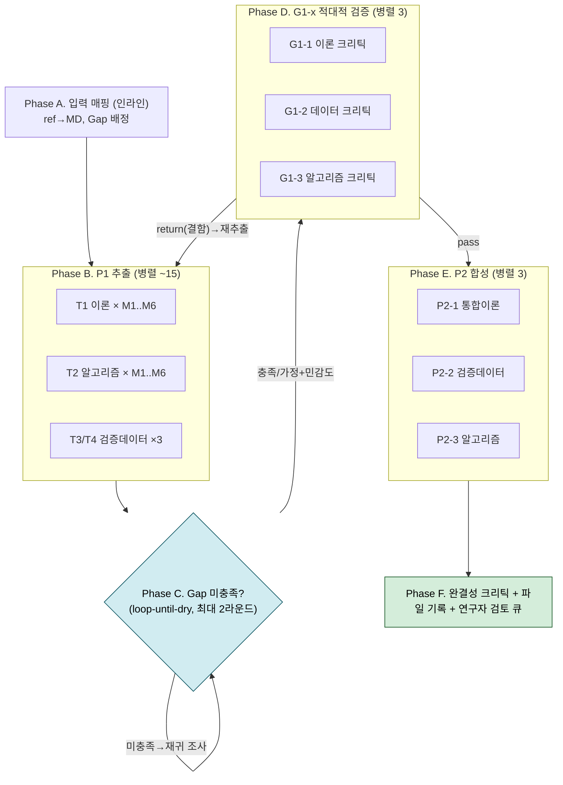

# 논문 구현 — P1→G1→P2 무인·병렬 실행 종합 계획

> **목적**: [[논문 구현 에이전트_v2_r1]]의 **P1-1/1-2/1-3 추출 → G1-x 게이트 → P2-1/2-2/2-3 검토서**를 **병렬·무인(대규모 서브에이전트 오케스트레이션)** 으로 실행하기 위한 종합 계획.
> **작성 기준일**: 2026-07-05
> **입력 준비 완료**: 원문통합 + Tier A/B/C 참고문헌 ~25편이 모두 `논문 취합/03. 정리/`에 MD로 존재.
> **산출 양식 확정**: [[논문 구현_P2-1_통합이론검토서_양식]] · [[논문 구현_P2-2_검증데이터검토서_양식]] · [[논문 구현_P2-3_알고리즘검토서_양식]]
> **근거 정리**: [[논문 구현 참고문헌·모델 정리]] (§1 모델 체인·§2.2 Gap 대장·§3 상수·§5 검증데이터)

---

## 0. 한눈에 보기

- **본질**: 25편 MD에서 (이론·검증데이터·알고리즘) 3트랙을 **모델(M1~M6)별로 병렬 추출** → **인용·원문·Gap 충족을 자동 검증(G1)** → **3개 검토서(P2)로 합성**.
- **핵심 무인 기법**: 결정론적 Workflow 오케스트레이션 + 구조화 출력(스키마) + 적대적 검증 에이전트 + Gap 재귀조사(loop-until-dry) + 체크포인트/재개 + **연구자 더블체크 큐**(정정 필요 항목만 사람에게).
- **인간 경계(중요)**: 피로이론(M4 등) 정확성의 **최종 사인오프는 연구자 몫**. 무인 파이프라인은 "검토 준비 완료 초안 + 근거 링크 + 플래그된 검증 큐"까지 자동 생산한다. **정확성을 자동 승인하지 않는다**(R1/R2).

---

## 1. 목표·산출물

| 산출물 | 내용 | 대응 양식/게이트 |
|---|---|---|
| **T1 이론표** (모델별) | 식·가정·유효범위·미기재상수 + 인용·원문 | P1-1 → G1-1 |
| **T2 알고리즘 조사대장** | Gap별 방법·원문·미제공·후보 | P1-3 → G1-3 |
| **T3/T4 검증데이터** | 원논문 결과 + 해석해/문헌 케이스 | P1-2 → G1-2 |
| **P2-1 통합이론 검토서** | 통합플로우·변수사전·인터페이스·차원검사 | G2-1 |
| **P2-2 검증데이터 검토서** | 게이트×모듈×오라클 매핑·허용오차 | G2-2 |
| **P2-3 알고리즘 검토서** | Gap 결정표·모듈 알고리즘 스택 | G2-3 |
| **연구자 더블체크 큐** | 사인오프·정정 필요 항목 목록 | G1/G2 인간 게이트 |

---

## 2. 입력 자산 — 참고문헌 → MD 매핑 (`03. 정리/`)

| 모델 | Ref → MD 파일(약칭) |
|---|---|
| **M1 Dry** | (22)Stanley-Kato·(24)Kalker·(25)OSU(Tian-Bhushan)·(26)Johnson1985·(21)SKF2010 |
| **M2 Lub** | (27)Hooke2006·(28)SKF2007 Part1+2·(29)GW-SKF1994·(16)SKF2003·(30)Ehret1998·(31)Venner2000·(15)Venner1997 |
| **M3 응력** | (16)SKF2003 |
| **M4 피로** | (13)DangVan1989·(14)DangVan1993·(19)JPN2009·(33)Desimone2006·(34)Milano2006·(36)INSA2010·(32)DangVan2003 |
| **M5 마모** | (17)Archard1953·(37)W1999 |
| **M6 분담** | (23)Johnson1972·(21)SKF2010 |
| **검증/맥락** | 원문통합2011 · (38)ICL1998 · (8)(9)Portu2010 I/II · (7)NewC2005 · (11)(12)ICL2008/09 · (39)Mobil2008 |

> **정합 규칙**: 모든 추출 셀은 위 MD의 **파일명 + 섹션/식/페이지 + 원문 verbatim**을 근거로 기록(추적성). MD에 없으면 재귀 조사(§4 Phase C).

---

## 3. 작업 분해 (병렬 단위)

- **추출(P1)**: `(모델 M1~M6) × (이론 T1 / 알고리즘 T2)` = **12 유닛** + **검증데이터(T3 원논문, T4 해석해/문헌) 3 유닛** ≈ **15 병렬 추출 에이전트**.
- **Gap 충족**: §2.2 Gap 대장 16건을 담당 트랙(P1-1/1-2/1-3)에 배정 → 추출 에이전트가 1차 충족, 미충족분만 **재귀 조사 에이전트**로 승격.
- **검증(G1)**: 트랙별 **적대적 크리틱 3 에이전트** (인용·원문·Gap·차원 검사) → pass/return.
- **합성(P2)**: 검토서 **3 합성 에이전트** (양식 채움 + 검토 큐 생성).

---

## 4. 오케스트레이션 파이프라인 (Workflow)

| Phase | 내용 | 병렬도 | 산출 |
|---|---|---|---|
| A | ref→MD 매핑·Gap 배정 | 인라인 | 작업 목록 |
| B | P1 추출(구조화 출력) | ~15 | T1/T2/T3/T4 rows |
| C | Gap 재귀 조사(bounded) | 가변 | Gap 충족/가정 |
| D | G1-x 적대적 검증 | 3 | pass/return 판정 |
| E | P2-x 합성(양식 채움) | 3 | 검토서 초안 3종 |
| F | 완결성 크리틱·파일 기록·검토 큐 | 1 | 최종 산출+큐 |

---

## 5. 무인작업 기법 (11)

| # | 기법 | 적용 |
|---|---|---|
| 1 | **결정론적 오케스트레이션** | Workflow 스크립트가 fan-out·게이트·루프를 코드로 통제 |
| 2 | **구조화 출력(스키마)** | 각 에이전트가 검증된 JSON 반환 → 파싱·오류 無 |
| 3 | **적대적 검증** | G1 크리틱이 "인용 없는 셀·미충족 Gap·차원 불일치"를 **반증 모드**로 탐지 |
| 4 | **Gap 재귀조사 loop-until-dry** | 미충족 Gap을 문헌 체인 더 깊이 추적, 2라운드 무소득 시 종료 |
| 5 | **완결성 크리틱** | "빠진 모델·미검증 주장·미읽은 소스"를 마지막에 점검 |
| 6 | **컨텍스트 규율** | 에이전트마다 담당 MD 슬라이스만 투입, 결과는 저널로 누적 |
| 7 | **체크포인트/재개** | 각 Phase 산출을 파일로 저장 + Workflow `resumeFromRunId` |
| 8 | **예산 스케일링** | 토큰 예산에 따라 재귀 깊이·검증 표수 조절 |
| 9 | **에스컬레이션 폴백** | 확보 불가 Gap → **가정+민감도**로 명시(침묵 선택 금지) |
| 10 | **연구자 검토 큐** | 정확성 임계 항목을 자동승인 대신 **플래그**하여 사람에게 |
| 11 | **무단절 로그** | 드롭된 소스·미검증 값은 CHANGELOG에 기록(은폐 금지) |

---

## 6. 게이트: 자동 vs 연구자 더블체크 (human-in-loop 경계)

| 게이트 | 자동 판정(무인) | 연구자 더블체크(사람) |
|---|---|---|
| **G1-1** | 모든 셀 인용·원문 존재, 차원 sanity, 담당 Gap 상태 | 이론 해석의 정합성(특히 M2 상보파, E′ 규약) |
| **G1-2** | 오라클 커버리지·허용오차 정의, 출처 존재 | 검증 케이스 타당성·디지타이즈 값 |
| **G1-3** | 전 Gap 결정/후보/미확정 명시 | **M4 임계면법 등 알고리즘 선택 승인** |
| **G2-x** | 양식 완결·매핑 완료·미결 0(또는 로그) | 최종 사인오프 |

> 무인 실행의 산출은 **"검토 준비 완료 초안 + 근거링크 + 검토 큐"**. 큐를 연구자가 승인하면 G1/G2 최종 통과.

---

## 7. Workflow 설계 개요 (스크립트 골격)

- **meta.phases**: A~F (위 표).
- **핵심 스키마**:
  - `T1_ROW`: {model, item, thisPaperLoc, srcRef, srcLoc, verbatim, assumptions, validity, missingConst, confidence}
  - `T2_ROW`: {gapId, model, methodStated, srcRef, detailLevel, missingGap, candidates[], chosen?, rationale?, status}
  - `VC_ROW`(T3/T4): {vcId, kind, model, gate, oracle, expected, tol, srcLoc, verbatim}
  - `CRITIC_VERDICT`: {track, pass:bool, defects[], unresolvedGaps[]}
- **제어 흐름**: `pipeline`으로 (추출→크리틱) 트랙별 파이프라인, Gap은 `while(round<2 && dry==false)` 루프, 합성은 3-way `parallel`.
- **모델 배정(권장)**: 추출/합성=주력 모델, 크리틱=동급 또는 상위 effort, 단순 매핑=저비용.
- **산출**: Phase E/F에서 3개 검토서 파일을 양식 채워 기록 + `검토_큐.md` 생성.

> 실제 스크립트는 착수 확정 후 작성하며, 먼저 소규모(예: M1·M4 2개 모델)로 **파일럿 런** 후 전체 확장하는 것을 권장.

---

## 8. 산출물 파일 배치 (`03. 정리/` 또는 하위 `구현/`)

- `P1_T1_이론표.md` / `P1_T2_알고리즘대장.md` / `P1_T3T4_검증데이터.md` (중간 산출, 체크포인트)
- `논문 구현_P2-1_통합이론검토서.md` / `_P2-2_…` / `_P2-3_…` (양식 채운 최종본)
- `검토_큐.md` (연구자 사인오프 대상)
- `CHANGELOG_구현.md` (시도·실패·드롭 로그)

---

## 9. 규모·비용·리스크

- **에이전트 수**: 추출 ~15 + Gap 재귀 ~6–12 + 크리틱 3 + 합성 3 + 완결성 1 ≈ **30–40**(재귀에 따라 변동). 동시성 ~10–16 캡.
- **토큰/시간**: 논문당 수만 토큰 정독 × 다수 → **대략 1–3M 출력 토큰, 벽시계 20–60분**(병렬 시). 예산 지시로 조절 가능.
- **리스크**: R1 이론 오해(→크리틱+연구자 큐), R2 오라클 착시(→해석해 우선), R9 알고리즘 gap(→재귀+가정), 대용량 컨텍스트(→슬라이스+체크포인트). MinerU MD의 OCR 오류 가능(→verbatim 원문 대조 시 주의, `.mineru_out`은 커밋 제외됨).

---

## 10. 착수 옵션 (확정 필요)

1. **범위**: (a) 전체 6모델 일괄 / (b) **파일럿(M1·M4) 먼저** 후 확장 — *권장 (b)*.
2. **철저도**: 크리틱 투표 수(1 vs 3), 재귀 라운드(1 vs 2).
3. **모델 tier / 예산**: 추출·크리틱 모델, 토큰 예산.
4. **자동승인 경계**: 연구자 큐만 남기고 나머지 자동 진행 여부.

> 위가 정해지면 Workflow 스크립트를 작성해 **파일럿 런 → 검토 → 전체 확장** 순으로 진행.

---

**끝**
