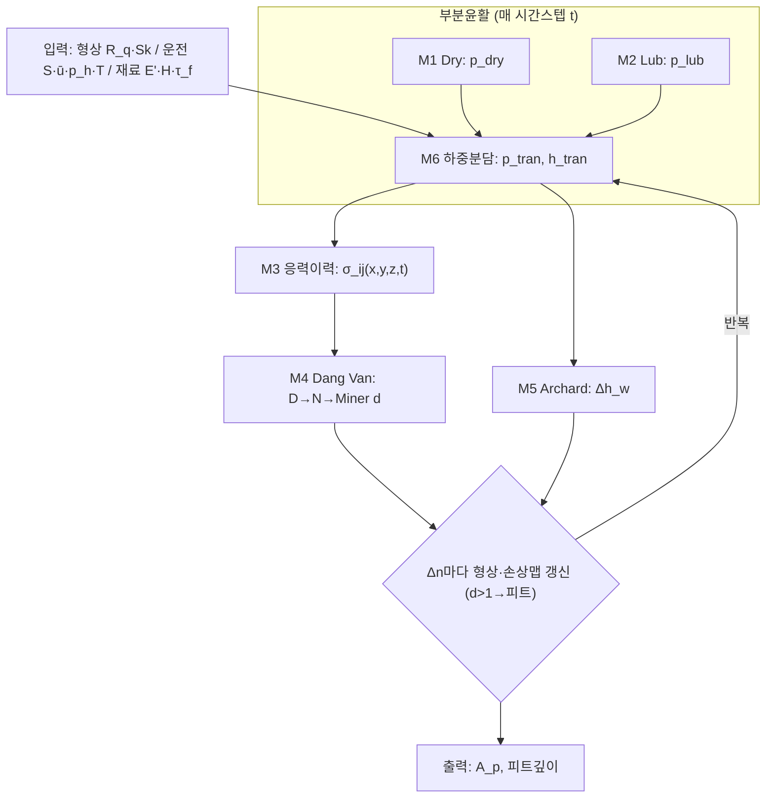

# [양식] 논문 구현 — P2-1 통합 이론 검토서

> **문서 유형**: 검토서 **양식(템플릿)** — P1 착수 전 형식·내용 사전 검토용. 실제 작성 시 이 구조를 그대로 채운다.
> **대상 논문**: Morales-Espejel & Brizmer (2011) Micropitting Modelling
> **선행 입력**: P1-1 산출물 = **T1 이론 추출표 + 암묵지 대장** (§3.3 T1)
> **통과 게이트**: **G2-1** — 차원/단위 일관성 통과 · 변수 명명사전 확정 · 미결 가정 0건 · 하위모델 인터페이스 계약 확정
> **상태**: ☐ 작성중 ☐ 연구자 더블체크 ☐ G2-1 통과
> **관련**: [[논문 구현 에이전트_v2_r1]] · [[논문 구현 참고문헌·모델 정리]]
> ⚠️ 표의 값은 **예시(형식 확인용)** 이며, 실제 작성 시 P1-1 인용·원문 근거로 교체·검증한다.

---

## 1. 목적·범위

6개 하위모델(M1~M6)을 **하나의 완결된 이론 체계**로 통합한다. 산출: (a) 전체 계산 플로우(Fig 1 재구성, 식·입출력·단위 완결), (b) 변수 명명사전, (c) 하위모델 인터페이스 계약, (d) 전제·가정 통합, (e) 차원·단위 일관성 검사. **모든 항목은 P1-1(T1)의 인용·원문에 추적 가능**해야 한다.

---

## 2. 통합 계산 플로우 (Fig 1 재구성)

**단계별 명세표** (각 계산 스텝을 식·입출력·단위로 완결)

| 스텝 | 계산 내용 | 지배식 | 입력(단위) | 출력(단위) | 소속 모델 | T1 인용 |
|---|---|---|---|---|---|---|
| S1 | dry 패치 압력 | 식[1] | 형상 r [m], 목표하중 [N] | p_dry [Pa] | M1 | 예: Eq.(1) p.628 |
| S2 | lub 패치 압력 리플 | 식[5][8] | h̄ [m], ū [m/s], η [Pa·s] | p_lub [Pa] | M2 | 예: Eq.(5) p.628 |
| S3 | 하중분담·전이 | h_tran, p_tran | p_dry, p_lub [Pa] | p_tran,h_tran | M6 | … |
| S4 | 표면하 6응력 | 식[12][13] | p_tran,q=μp [Pa] | σ_ij [Pa] | M3 | … |
| S5 | 피로 손상 | 식[9~11] | σ_ij [Pa] | D, N, d [–] | M4 | … |
| S6 | 마모층 | 식[14][15] | p,u_s [Pa,m/s] | Δh_w [m] | M5 | … |
| S7 | 형상·손상 갱신 | — | Δh_w, d | 갱신 r, 손상맵 | 공통 | … |

---

## 3. 변수 명명사전 (Variable Dictionary) — G2-1 확정 대상

> 구현 코드의 **단일 기준(SSOT)**. 규약 충돌(특히 $E'$)을 여기서 못박는다.

| 기호 | 의미 | 단위 | 정의식 / 규약 | 출처(T1) | 비고 |
|---|---|---|---|---|---|
| $p$ | 국부 압력 | Pa | — | Nomenclature | |
| $\bar p$ | 평균(Hertz) 압력 | Pa | 시간에 따라 0→$p_h$→0 | 원문 Fig2 | |
| $h$ | 간극 | m | — | | |
| $\bar h$ | 중앙 유막 | m | EHL 공식(미지정 → P2-3) | | ⚠️ 공식 선택 gap |
| $E'$ | 환산 탄성계수 | Pa | **$2/E'=(1-\nu_1^2)/E_1+(1-\nu_2^2)/E_2$** | 예: p.627 | ⚠️ 통상의 2배 |
| $E^\ast$ | dry 유효계수 | Pa | $E^\ast=E'/2$ | | |
| $\kappa,Q,C,\psi$ | 진폭감소·상보파 파라미터 | 혼합 | 식[5][8] 정의 | | |
| $D$ / $d$ | Dang Van / Miner 손상 | – | 식[9] / 누적 | | 구분 주의 |
| $\alpha$ | (Dang Van) 재료상수 / (점도) 압력계수 | – / Pa⁻¹ | 0.232 / 20.78 GPa⁻¹ | | **동일 기호 이중의미** |
| … | (P1-1 전 기호 등록) | | | | |

---

## 4. 하위모델 인터페이스 계약 (Contract)

> 각 화살표가 "무엇을·어떤 단위·어떤 좌표계로" 주고받는지 확정. 통합 시 폭발(R4) 방지.

| From → To | 전달량 | 단위 | 좌표/규약 | 검증 방법 |
|---|---|---|---|---|
| M1 → M6 | $p_{dry}(x,y)$ | Pa | 격자 121×121, x=구름방향 | 하중적분=목표 |
| M2 → M6 | $p_{lub}(x,y)$ (=$p_{lub1}+p_{lub2}$) | Pa | 동일 격자 | 흐름균형 |
| M6 → M3 | $p_{tran}(x,y)$, $q=\mu p$ | Pa | 동일 격자, μ∈{μ_bl,μ_ehl} | 음압→0 |
| M3 → M4 | $\sigma_{ij}(x,y,z,t)$ 6성분 | Pa | z=0~0.25a, 15층 | 정현파→식[12][13] |
| M4 → 갱신 | 손상맵 $d(x,y,z)$ | – | — | d>1 판정 |
| M5 → 갱신 | $\Delta h_w$ | m | 양표면 절반 | — |

---

## 5. 전제·가정 통합표

| 가정 | 적용 모델 | 유효 범위 | 출처(T1 인용) | 상호 충돌 |
|---|---|---|---|---|
| 저진폭 미세형상 | M2 | 유막 대비 소진폭 | 예: p.628 | M1 소성과 경계 |
| 주기적 거칠기(양방향) | M3/공통 | FFT 창 경계 | 원문 Fig2 | — |
| 중앙접촉: 평균유막·압력 기지 | M2/M6 | 접촉 중앙 | (21) | 입출구 제외 |
| Coulomb 트랙션 $q=\mu p$ | M3 | — | | — |
| … | | | | |

---

## 6. 차원·단위 일관성 검사 (G2-1 핵심)

| 식 | LHS 차원 | RHS 차원 | 일치 | 비고 |
|---|---|---|---|---|
| [5] $p_a/r_a=\frac{\kappa E'}{4}\frac{iQ}{\cdots}$ | Pa/m | (1/m)(Pa)·(무차원) = Pa/m | ☐ | κ[1/m], E'[Pa] |
| [14] $\Delta h_w/\Delta n = kpu_s/H$ | m/cycle | (–)(Pa)(m/s)/(Pa) = m/s ?? | ☐ | ⚠️ 단위 확인 필요(사이클↔시간) |
| [12] σ = p₀·(무차원)·e^{-ζz} | Pa | Pa | ☐ | |
| … | | | | |

---

## 7. 미결 가정 / 충돌 로그 (되돌림 대상)

| ID | 미결/충돌 내용 | 영향 | 조치(재조사 문헌 / 가정+민감도) | 상태 |
|---|---|---|---|---|
| U-01 | 예: $\Delta h_w/\Delta n$ 사이클-시간 단위계 | 마모율 스케일 | (21) 확인 | ☐ |
| … | | | | |

> **미결 가정이 1건이라도 남으면 G2-1 미통과 → P1-1로 되돌림**(추가 조사/가정 명시).

---

## 8. G2-1 게이트 체크리스트

- ☐ 통합 플로우(§2) 전 스텝이 식·입출력·단위로 완결
- ☐ 변수 명명사전(§3) 전 기호 등록, **$E'$/$\alpha$ 이중의미 등 규약 확정**
- ☐ 인터페이스 계약(§4) 전 화살표 단위·좌표 확정
- ☐ 차원·단위 일관성(§6) 전 식 통과
- ☐ **미결 가정 0건**(§7 비어있음)
- ☐ 모든 항목 T1 인용 추적 가능 + **연구자 더블체크 완료**

**연구자 확인**: 서명 ______  날짜 ______

---

**끝 (양식)**
