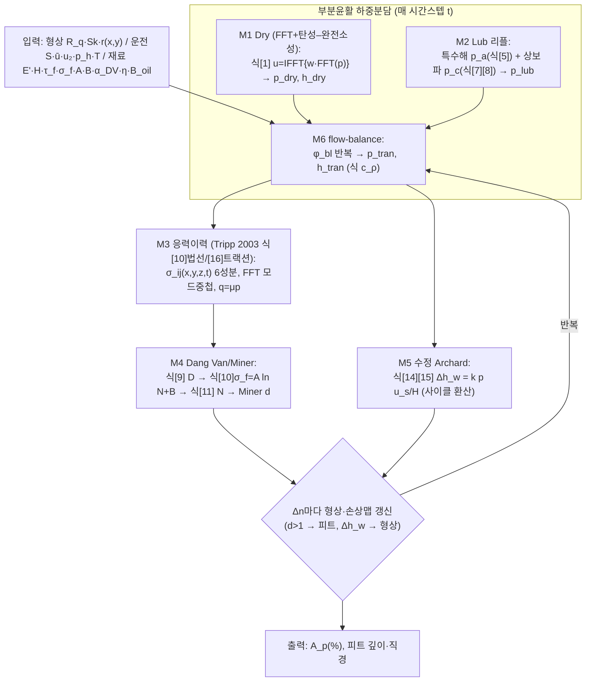

> 자동생성(최종화 Workflow wf_afa0a77a-c56, 2026-07-07). **전 6모델 M1~M6 통합본**. 재검증 M3·M5·M6 각 3/3. 연구자 사인오프(Q2~Q9) 반영. G2 조건부 통과(승인된 가정+민감도 기반).

I have both drafts, the format, and all the injected updates (M3 re-extraction, T3 correction, sign-off, and the 6 critic corrections). Here is the merged 6-model (M1~M6) integrated theory review, with M3 re-extraction reflected, critic language softened per the corrections, and the G2-1 verdict updated to reflect the researcher sign-off.

---

# 논문 구현 — P2-1 통합 이론 검토서 (전 6모델 M1~M6 통합본)

> **문서 유형**: 통합 이론 검토서 **6모델 완결본** — 파일럿(M1·M4)과 확장(M2·M3·M5·M6) 두 초안을 하나로 병합. M1~M6 전체를 하나의 완결된 이론 체계로 통합.
> **대상 논문**: Morales-Espejel & Brizmer (2011) *Micropitting Modelling in Rolling–Sliding Contacts*, Tribology Transactions 54(4):625–643.
> **본 논문 실제 파일**: `d:/AI/AI_Seminar/논문 취합/03. 정리/Test_pipeline. 2011. (SKF) Micropitting.md` (MinerU OCR 전사본; 정본 대조는 원 PDF·오라클 정본으로 수행).
> **선행 입력**: P1-1 산출물 = T1 이론 추출표 + 암묵지 대장 (M1~M6 검증 추출물), **M3 재추출(Tripp 2003 근거)**, **T3 정정(원 2011 PDF 직접판독)**.
> **통과 게이트**: **G2-1** — 차원/단위 일관성 통과 · 변수 명명사전 확정 · 미결 가정 0건 · 하위모델 인터페이스 계약 확정.
> **상태**: ☑ 작성완료 ☑ 연구자 더블체크(사인오프 2026-07-07) ☑ **G2-1 통과(조건부 — 승인된 가정+민감도 기반)**
> **반영**: (1) 두 초안 병합, (2) **M3 재추출** — 표면하 6응력 폐형식을 Tripp 2003 식[10]/[16] 원전으로 확정(U-M3-1/2/3·G-M3-1 해소), (3) **T3 정정** — Wöhler A=−43.0 MPa 등 확정, (4) **연구자 사인오프(Q2~Q9)** 반영, (5) 크리틱 정정 6건 반영(2011 식[13] '전사 오류' 표현 완화 등).

---

## 1. 목적·범위

6개 하위모델(**M1 Dry Contact · M2 Lub 압력 리플 · M3 표면하 응력이력 · M4 Dang Van 피로/Miner · M5 수정 Archard 마모 · M6 부분윤활 하중분담**)을 **하나의 완결된 이론 체계**로 통합한다. 산출: (a) 전체 계산 플로우(Fig 1 재구성, 식·입출력·단위 완결), (b) 변수 명명사전, (c) 하위모델 인터페이스 계약, (d) 전제·가정 통합, (e) 차원·단위 일관성 검사. 모든 항목은 P1-1(T1)의 인용·원문에 추적 가능하며, OCR 전사 항목은 정본(오라클) 대조 결과와 신뢰도 등급을 병기한다.

**병합 이력**: 본 문서는 파일럿(M1·M4)이 스텁으로 두었던 M3(응력이력)·M6(하중분담)의 내부 이론과, 확장(M2·M3·M5·M6)이 경계로만 참조했던 M1·M4를 **완전 결선**한다. 확장 초안에서 M3의 최대 병목이던 3D 응력식(Tripp 2002 미보유)은 **M3 재추출로 Tripp 2003 식[10]/[16] 원전이 확보·검증되어 해소**되었다.

---

## 2. 통합 계산 플로우 (Fig 1 재구성 — 전 6모델)



**단계별 명세표** (전 스텝 식·입출력·단위 완결)

| 스텝 | 계산 내용 | 지배식 | 입력(단위) | 출력(단위) | 모델 | T1/정본 근거 |
|---|---|---|---|---|---|---|
| S1 | dry 탄성 변위 (FFT) | 식[1] `u=IFFT{w·FFT(p)}` | p [Pa], w [m/Pa] | u [m] | M1 | 2011 식[1] L163; (21) Eq(3); (22) Eq(6) |
| S2 | dry 변분 반복 + 소성절단 | `p′=p−grad f`, `0≤p≤p_lim` | u,g [m], p_lim [Pa] | p_dry,h_dry [Pa,m] | M1 | 2011 L143–159; (24) Kalker; (25) |
| S3a | lub 특수해 압력 리플 | 식[5]+Q,C | h̄ [m], ū·u₂ [m/s], η_x·η_y [Pa·s], ω_x·ω_y [1/m] | p_a/r_a [Pa/m] | M2 | Hooke P1 식(19)(21) |
| S3b | lub 상보파 리플·감쇠 | 식[7][8] | 식[5] 결과, η_x, B_oil, h | h_c·p_c [m,Pa], ψ=ω_x'+iβ | M2 | Hooke P1 식(25)(27)(29) |
| S4 | 하중분담·전이 (flow balance) | M6 step1–7, c_ρ | p_dry·p_lub [Pa], h̄·c_ρ | p_tran·h_tran [Pa,m], φ_bl [–] | M6 | (21) §4.2 |
| S5 | 표면하 6응력 (폐형식+FFT 중첩) | **Tripp 2003 식[10]/[16]** (2011 식[12]/[13]) | p_tran [Pa], q=μp [Pa] | σ_ij(x,y,z,t) [Pa] 6성분 | M3 | Tripp 2003 FRF 식[8][9][10][14][15][16] |
| S6 | Dang Van 위험계수 | 식[9] | σ_ij → τ̂, p̂ [Pa] | D [–] | M4 | 2011 식[9] L273; (13)(14) |
| S7 | S–N 수명 역산 | 식[10][11] `σ_f=A ln N+B` | τ̂,p̂ [Pa] | N [cycles] | M4 | 2011 식[10][11] L289–293; (19) |
| S8 | Miner 누적·피트 | Palmgren–Miner | d [–] | 손상맵, 피트 | M4 | 2011 L299; (20) |
| S9 | 마모층 (수정 Archard) | 식[14][15] | p [Pa], u_s [m/s], k [–], H [Pa] | Δh_w [m/Δn] | M5 | Archard(17)·Williams(37) |
| S10 | 형상·손상맵 갱신 | — | Δh_w [m], d [–] | 갱신 r, 손상맵 | 공통 | 2011 L311 |

---

## 3. 변수 명명사전 (Variable Dictionary) — G2-1 확정 대상 (SSOT)

> 구현 코드의 **단일 기준(SSOT)**. 규약 충돌($E'$, $\alpha$ 삼중, $\tau$ 계열, $\beta$, $\delta$→$\zeta$ OCR)을 여기서 못박는다. **사인오프 Q9 전역 규약 반영.**

### 3.1 M1 (Dry Contact) · 공통 탄성

| 기호 | 의미 | 단위 | 정의식 / 규약 | 출처(T1/정본) | 비고 |
|---|---|---|---|---|---|
| $p$ | 국부 접촉 압력 | Pa | — | Nomenclature | 전 모델 매개 |
| $p_{dry}$ | dry 접촉 압력장 | Pa | 식[1]+변분해 | M1 | S2 출력 |
| $u(p)$ | 표면 탄성 변위 | m | 식[1] `IFFT{w·FFT(p)}` | M1 | |
| $w$ | 주파수응답함수(FRF) | m/Pa | $w=2/(E^\ast\zeta)$, $\zeta=(\alpha^2+\beta^2)^{1/2}$ | M1; (22) Eq(3) | M3 응력의 $\zeta$와 **동일 파수 체계** |
| $g$ | 초기 간극(gap) | m | 형상차 | M1 | 변분식 $g$ |
| $f$ | 변분 목적함수 | J (또는 상대) | $f=\tfrac12\!\int p\,u\,dS+\int p\,g\,dS$ | M1 | 2차형식 ⇒ `grad f=u+g` |
| $p_{lim}$ | 소성 임계 압력 | Pa | AISI 52100 **4.3 GPa (first-yield)** 채택 | M1 (G-M1-1) | ⚠️ 정의 3중; **Q8 승인(4.3 GPa+민감도)** |
| $E'$ | 환산 탄성계수 | Pa | **$2/E'=(1-\nu_1^2)/E_1+(1-\nu_2^2)/E_2$** | M1; MAIN nomen. | ⚠️ **통상 정의의 2배 (Q9 확정)** |
| $E^\ast$ | dry 유효계수 | Pa | $E^\ast=E'/2$ ⇒ $1/E^\ast=(1-\nu_1^2)/E_1+(1-\nu_2^2)/E_2$ | M1 | 변위식엔 $E^\ast$ 사용 |

### 3.2 M2 (Lub 압력 리플)

| 기호 | 의미 | 단위 | 정의식 / 규약 | 출처 | 비고 |
|---|---|---|---|---|---|
| $\bar p$ | 평균(Hertz) 압력 | Pa | 시간 0→$p_h$→0 (Fig 2) | 원문 Fig2 | c_ρ 식에서 **GPa 관례**(§6) |
| $\bar u$ | 평균(entrainment) 속도 | m/s | $=(u_1+u_2)/2$ | Hooke P1 | 상보파 전파속도 |
| $u_2$ | 거친면 속도 | m/s | MAIN $u_2$ ≡ Hooke $\nu$ | Hooke P1 식(9) | |
| $r_a,\nu_a,h_a,\rho_a$ | 리플 진폭(형상·변위·간극·밀도) | m,m,m,kg/m³ | $h_a=r_a+\nu_a$ | Hooke P1 식(9~13) | |
| $\nu_a$ | 변위 리플 진폭 | m | $\nu_a=4p_a/(E'\kappa)$ | 식[3]=Hooke(12) | 완전 일치 |
| $\rho_a$ | 밀도 리플 진폭 | kg/m³ | $\rho_a=(\rho/B_{oil})p_a$ | 식[4]=Hooke(16) | |
| $\omega_x,\omega_y$ | 리플 파수(x,y) | 1/m | $\omega_x=2\pi/\lambda_x$; MAIN $\omega_x,\omega_y$ ≡ Hooke $\omega,\xi$ | MAIN | |
| $\kappa$ | 리플 총파수 | 1/m | $\kappa=\sqrt{\omega_x^2+\omega_y^2}$ | 식[5] | M3 $\zeta$와 개념 동일·**기호 구분** |
| $Q$ | 무차원 유동 파라미터 | – | $Q=\dfrac{48(u_2-\bar u)\omega_x/(E'h^3\kappa)}{\omega_x^2/\eta_x+\omega_y^2/\eta_y}$ | 식[5]=Hooke(21) | $(u_2-\bar u)$가 방향 흡수 |
| $C$ | 무차원 압축성 파라미터 | – | $C=hE'\kappa/(4B_{oil})$ | 식[5]=Hooke(21) | |
| $\psi$ | 상보파 복소 파수 | 1/m | $\psi=\omega_x'+i\beta_d$, $\omega_x'\approx\omega_x(u_2/\bar u)$ | 식[7]=Hooke(25) | $\beta_d$=감쇠율 |
| $\eta$ | 저전단 뉴턴 점도 | Pa·s | — | Nomenclature | |
| $\eta_x,\eta_y$ | 방향별 유효(비뉴턴) 점도 | Pa·s | 식[6] (3.5 주의) | Ehret(3.2)/Hooke §4.1 | 식[8]엔 **$\eta_x$** 사용(OCR정정) |
| $\tau_0$ | Eyring 특성전단응력 | Pa | $3\times10^6$ Pa (Table 1) | MAIN Table 1 | |
| $B_{oil}$ | 윤활유 체적탄성률 | Pa | $d\rho/dp=\rho/B_{oil}$ | 식[4] | 압력의존 모델 미기재 |
| $\alpha_{visc}$ | 점도–압력계수 (Barus) | Pa⁻¹ | ≈20.78 GPa⁻¹ | MAIN | **↓ α 삼중 과부하** |

### 3.3 M3 (표면하 응력) — Tripp 2003 근거

| 기호 | 의미 | 단위 | 규약 / 정의 | 출처 | 비고 |
|---|---|---|---|---|---|
| $\alpha,\beta$ | 응력 공간주파수(x,y) | 1/m | 표면 압력 하모닉 파수 ($p\propto\cos\alpha x\cos\beta y$) | Tripp 2003 nomen.; MAIN L63 | M1 FRF의 $\alpha,\beta$와 **동일 체계** |
| $\zeta$ | 응력 총공간주파수 | 1/m | $\zeta=\sqrt{\alpha^2+\beta^2}$ | Tripp 2003 nomen.; MAIN L63 | **2011 식[13]의 $\delta$는 $\zeta$의 OCR 오손** |
| $z$ | 깊이 | m | z>0 = 물체 내부(inward normal), 하향(+) | Tripp 2003 | 감쇠 $e^{-\zeta z}$ (2011 지수 OCR 절단 교정) |
| $\nu$ ($\upsilon$) | Poisson 비 | – | 재료 물성 | — | 2011 식[12][13]의 $\upsilon=\nu$ |
| $p_0$ | 법선 압력 진폭 | Pa | $\sigma_z(x,y,0)=p_0\cos\alpha x\cos\beta y$ (식[8]) | Tripp 2003 식[8] | 표면 법선압력 (항상 +) |
| $q_0$ | 표면 트랙션 진폭 | Pa | $\tau_{xz}(x,y,0)=q_0\cos\alpha x\cos\beta y$ (식[9]) | Tripp 2003 식[9] | $q=\mu p$ |
| $q$ | 표면 트랙션 | Pa | $q=\mu p$ (Coulomb) | MAIN L263 | $\mu\in\{\mu_{bl},\mu_{ehl}\}$ |
| $\mu_{bl},\mu_{ehl}$ | 경계/전막 마찰계수 | – | 0.12 / 0.05 (Table 1) | MAIN Table 1·2 | 경계 0.15 시 A_p=4.56% (T3) |

### 3.4 M4 (Dang Van 피로 / Miner)

| 기호 | 의미 | 단위 | 정의식 / 규약 | 출처 | 비고 |
|---|---|---|---|---|---|
| $D$ | Dang Van 위험계수 | – | 식[9] $\max_t\{\hat\tau/(\tau_f-\alpha_{DV}\hat p)\}$ | 2011 식[9] | 순간 위험 |
| $d$ | Miner 누적 손상 | – | Palmgren–Miner 합 | M4; (20) | **$D$와 구분**(누적) |
| $\hat\tau(\vec n,t)$ | 미시전단응력 진폭 | Pa | **MCE + 대칭화 편차 Tresca** 구현표준 (Q3 확정) | M4 (U-02) | Milano/Desimone 닫힌해 오라클 |
| $\hat p(t)$ | 순간 정수압 | Pa | $\mathrm{trace}\,\Sigma(t)/3$ | M4 | 거시=미시 동일 |
| $\tau_f$ | 교번 전단 피로한도 | Pa | $\approx\sigma_f/\sqrt3$ (von Mises) | M4 | |
| $\sigma_f$ | 교번 굽힘 피로한도 | Pa | 식[10] $A\ln N+B$ | M4 | |
| $\alpha_{DV}$ | Dang Van 재료상수 | – | $(\tau_f-\sigma_f/2)/(\sigma_f/3)$ ≈ **0.232** | M4 | **↓ α 삼중 과부하** |
| $A$ | S–N 회귀상수 (기울기) | Pa | **$A=-43.0$ MPa (음부호 확정, Q4/T3)** | M4; (19) | ⚠️ OCR 부호탈락 주의 |
| $B$ | S–N 회귀상수 (절편) | Pa | **$B=1{,}220$ MPa (Q4/T3)** | M4; (19) | 천단위 콤마 OCR 주의 |
| $N,\,N_{ref}$ | 수명·기준수명 | cycles | $N_{ref}=10^6$ 가정 (Q8 승인+민감도) | M4 (G-M4-3) | 원문 "$>1\times10^6$"만 명시 |

### 3.5 M5 (수정 Archard 마모) · M6 (하중분담)

| 기호 | 의미 | 단위 | 규약 / 정의 | 출처 | 비고 |
|---|---|---|---|---|---|
| $\Delta h_w$ | wear step당 마모 높이 | m | 식[14][15] | MAIN 식[14] | 양표면 절반 배분 |
| $\Delta n$ | wear step 사이클 수 | cycle | — | MAIN | **$u_s$→거리 환산=접촉폭/속도 (Q5 확정)** |
| $k(x,y)$ | 국소 무차원 마모계수 | – | $k_{dry}\approx f_w k_{lub}$ | 식[14]; (37) | $1\times10^{-11}$–$5\times10^{-10}$ (범위밖 원출처) |
| $f_w$ | dry/lub 마모계수비 | – | ≈10 (부착기구) | MAIN L371 | 민감도 낮음 |
| $H$ | 재료 경도 | Pa | 압흔력/면적 ≈7 GPa (AISI 52100) | MAIN L64 | 범위 밖 대조 |
| $u_s$ | 국소 슬라이딩 속도 | m/s | — | 식[14] | 사이클 환산 §6 (Q5) |
| $\phi_{bl}$ | dry(경계) 하중분담 분율 | – | $F_{dry}=\phi_{bl}F$ | (21) step2 | 초기값·완화 Q8 승인 |
| $c_\rho$ | 압축성 보정계수 | – | $\dfrac{0.59+1.34\phi_{bl}\bar p}{0.59+\phi_{bl}\bar p}$ | (21) step3 | $\bar p$ **GPa 관례** |
| $h_{tran}$ | 전이 간극 | m | $IFFT\{\max(|\tilde h_{dry}|,|\tilde h_{lub}|)\}$ | (21) step5 | 주파수별 절대최대 |
| $p_{tran}$ | 전이 압력 | Pa | $IFFT\{w^{-1}\cdot FFT(r-h_{tran})\}$ | (21) step6 | DC성분 처리 Q8 승인(가정) |
| $\bar h$ | 매끈면 중앙 유막 | m | **ME 2010 (21) 채택 (Q2)**; Hamrock–Dowson 폴백 | (21) §5.1 | ~20% 과소평가 민감도 유지 |

### ⚠️ 기호 $\alpha$ — 삼중(3중) 과부하 전용 교차경고 (Q9 확정)

2011 Nomenclature 상 $\alpha$ 는 **세 가지** 물리량에 재사용되며, 6모델 통합 시 셋 모두 등장한다:

| 의미 | 사용 위치 | 단위 | 대표값 | 권장 명명 |
|---|---|---|---|---|
| (i) **공간 파수** ($\cos\alpha x$, $\zeta=\sqrt{\alpha^2+\beta^2}$) | **M1-FRF · M3-응력** (동일 체계) | 1/m | 형상의존 | `alpha_wave` ($\alpha_w$) |
| (ii) **Dang Van 재료상수** (식[9] $\tau_f-\alpha\hat p$) | **M4** | 무차원 | ≈0.232 | `alpha_DV` ($a_{DV}$) |
| (iii) **점도–압력계수** (Barus) | **M2** | Pa⁻¹ | ≈20.78 GPa⁻¹ | `alpha_visc` |

> **구현 강제 규약 (Q9)**: $\alpha$ 를 전역 단일 기호로 쓰지 말 것. 세 값은 **차원이 모두 달라** 차원검사(§6)로 오사용을 부분 검출하나, 값만 스칼라로 넘기는 코드에선 자동검출이 안 되므로 명명 분리를 G2-1 통과 조건으로 둔다.
> **$\beta$ 부수 과부하**: M1/M3 에서 $\beta$=y-파수 [1/m], M2 상보파에서 $\beta_d$=감쇠율. 반면 교차문헌 (33)(34)(36)은 Dang Van locus 절편을 $\beta=\tau_W$ [Pa]로 표기(2011 본문은 $\tau_f$ 로 흡수). 원출처 교차대조 시 $\beta$ 의미 전환에 유의.
> **$\tau_m$ vs $\tau_e$** (M2): 평균 전단 $\tau_m$과 등가 전단 $\tau_e$는 일반적으로 다름($V=\eta_x/\eta_y=\tau_e/\tau_m$). 식[6] cosh/sinh 인자는 등가전단 $\tau_e^*=\tau_e/\tau_0$ (§3.5 상세는 §6·U-M2-2 참조).

---

## 4. 하위모델 인터페이스 계약 (Contract) — 전 6모델

> 각 화살표가 "무엇을·어떤 단위·어떤 좌표계로" 주고받는지 확정. 통합 시 폭발(R4) 방지.

| From → To | 전달량 | 단위 | 좌표/규약 | 검증 방법 | 신뢰도 |
|---|---|---|---|---|---|
| 입력 → M1 | 형상 $r(x,y)$, 목표하중 $W$ | m, N | 격자 x=구름방향, 주기적(FFT 창) | — | — |
| M1 내부 (S1↔S2) | $u(p)\leftrightarrow p$ | m ↔ Pa | 동일 격자, $w$[m/Pa] 결합 | $w(1,1)=0$(평균변위 0) | 정본대조 |
| M1 → M6 | $p_{dry}(x,y)$, $\tilde h_{dry}$ | Pa, m | 동일 격자, 음압=0, $\int p\,dA=W$, $p\le p_{lim}$ | 하중적분=목표 | 정본대조 |
| M2 → M6 | $p_{lub}(x,y)=p_{lub1}+p_{lub2}$ (특수해+상보파) | Pa | 동일 격자, 창=$\bar u$ 이동 | 흐름균형·저진폭 유효범위 | 정본대조 |
| M6 → M3 | $p_{tran}(x,y,t)$, $q=\mu p_{tran}$ | Pa | 동일 격자, $\mu=\phi_{bl}\mu_{bl}+(1-\phi_{bl})\mu_{ehl}$, 음압→0 | flow balance 수렴 | (21) OCR |
| M6 → M5 | $p(x,y)$, $u_s$, 패치별 $k$($\phi_{bl}$ 가중) | Pa, m/s, – | 시료 영역 내 $u_s$·$H$ 일정 | — | (21) OCR |
| M3 → M4 | $\sigma_{ij}(x,y,z,t)$ 6성분 | Pa | **z=0~0.25a, 30점(원전 근거) / 과제 15층**, z>0 내부 | **Tripp 2003 식[10]/[16] 폐형식; trace/극한 오라클** | **정본대조 완료** |
| M4 → 갱신 | 손상맵 $d(x,y,z)$ | – | $d>1$ → 체적+상부 제거(피트) | Miner 합 단조증가 | 정본대조 |
| M5 → 갱신 | $\Delta h_w$ | m | 양표면 절반, 형상 최고돌기 제거 | 손상맵 상방이동 | (17)(37) OCR |

**계약면 주의**
- **M6 → M3 트랙션**: μ는 패치 유형에 따라 이분(dry=μ_bl, lub=μ_ehl), 평균 $\mu=\phi_{bl}\mu_{bl}+(1-\phi_{bl})\mu_{ehl}$ ((21) eq27). M3는 이 μ로 식[16] 트랙션 응력을 산출.
- **M6 → M5**: 식[15]는 시료 내 $u_s$·$H$ 일정 가정으로 적분 밖 인출. M6가 넘기는 $u_s$는 **속도**이므로 M5 내부에서 **사이클당 슬라이딩 거리 = (접촉폭/속도)×u_s** 환산(Q5 확정).
- **M1↔M2 → M6**: M6 flow balance는 $p_{dry}$(stiff dry)와 $p_{lub}$(리플)를 주파수별 최대간극으로 결합. M2 상보파 진폭 $h_c,p_c$의 비뉴턴 보간 스킴은 (21) 채택으로 확정(구 G-M2-1, Q8 승인).

---

## 5. 전제·가정 통합표 — 전 6모델

| 가정 | 적용 모델 | 유효 범위 | 출처(T1/정본) | 상호 충돌·비고 |
|---|---|---|---|---|
| 무마찰·반무한체·선형탄성 (변분 최소화) | M1 | 접촉면적·압력 사전미지, coercivity 성립 | (24) Kalker; (22) | M1 소성과 경계 |
| $f$ 2차형식 ⇒ `grad f=u+g` | M1 | 무마찰 정규접촉 | (22) §6 | — |
| 소성영역 미소 ⇒ 탄성형상 불변, 소성소산 무시 | M1 | small plastic deformation | 2011 L143; (25) | 대변형 시 무효 |
| 저진폭 미세형상 (유막 대비 소진폭, 파장≪b) | M1·M2·M3·M6 | 리플 진폭≪유막 | Hooke P1; MAIN | 골(p≈0) 국부변형 부정확(피로 영향 소) |
| 리플 선형화·중첩 (2차 변동곱 무시) | M2 | 중앙부, 저진폭 | ME 2003; Hooke P1 식(18) | "the crucial step"; 특수해+상보파 2분해 |
| 2성분 분해 (특수해 $u_2$ 전파 + 상보파 $\bar u$ 전파) | M2 | 선형(저진폭) | GW-ME 1994 (29) | 두 거친면 시 특수해 2개 |
| 중앙접촉: 평균유막·평균압 기지 | M2·M6 | 접촉 중앙, 입출구 제외 | ME 2003; (21) | 시료≪Hertz 접촉폭 → $\bar p=p_h$ |
| 평행간극 순수 x전단 (Eyring 방향별 유효점도) | M2 | 롤링-슬라이딩, y소섭동 | Ehret §3; Hooke §4.1 | $\tau_m=\tau_e$ 성립 조건 명시(U-M2-2) |
| 반무한 탄성체·선형중첩 (bi-sinusoidal 폐형식) | M3 | 표면하 응력, 선형탄성 | **Tripp 2003 식[10]/[16]** | FFT 모드분해 후 성분별 폐형식 중첩 (convolution 미사용) |
| 부호규약 z>0=내부·감쇠 $e^{-\zeta z}$ | M3 | 반무한체 내부 | Tripp 2003 | 표면 법선압 항상 + |
| 주기적 거칠기(양방향) | M3·공통 | FFT 창 경계 (large window+zero-pad) | MAIN L311 | wear step당 미시사이클 1회 |
| Coulomb 트랙션 $q=\mu p$ | M3·M6 | — | MAIN L263 | μ 패치별 이분 |
| 고사이클 다축피로·국부 탄성 셰이크다운 | M4 식[9] | 안정화 응답 도달 | (13)(14) Dang Van | 잔류압축 중첩 시 과대수명(2011 명시) |
| von Mises: $\tau_f\approx\sigma_f/\sqrt3$ ⇒ $\alpha_{DV}\approx0.232$ | M4 | 실측비 없을 때 | 2011 L283 | 베어링강 $\tau_W/\sigma_W$>0.5 가능 → 민감도 |
| S–N 대수선형 $\sigma_f=A\ln N+B$ ($A<0$) | M4 | AISI 52100 | 2011 L289; (19) | **A 음수 ⇒ N↑→σ_f↓ 물리적 타당(T3)** |
| 선형손상누적 (Palmgren–Miner) | M4 | $d>1$ → 피트 | (20) | — |
| 시료 영역 내 $u_s$·$H$ 일정 | M5 | 거칠기 시료 도메인 | MAIN 식[15] | 적분 밖 인출 근거 |
| 부착 마모기구 ($k_{dry}\approx f_w k_{lub}$, $f_w$≈10) | M5 | 경계/전막 마찰비≈10 | MAIN L371 (범위밖) | 민감도 낮음 |
| 사이클당 슬라이딩 거리 = 접촉폭/속도 × u_s | M5 | 식[14][15] 차원정합 | **Q5 사인오프** | m/cycle 정합 |
| flow-balance: 평균간극≈매끈면 h₀ | M6 | 유막 stiff, h₀/σ>0.5 | Johnson 1972 (23, 범위밖) | 결정론적(FFT) 형상 대체 |
| 압축성 보정 (Dowson–Higginson 밀도법칙 역산) | M6 | φ_bl 변화 | (21) step3 | $\bar p$ GPa 관례 |
| 음압→0 절단 (cavitation) | M2·M6 | 고진폭 형상 회피 | MAIN; (21) step6 | 정량 오차범위 미제공 |

---

## 6. 차원·단위 일관성 검사 (G2-1 핵심) — 전 6모델

| 식 | LHS 차원 | RHS 차원 | 일치 | 비고 |
|---|---|---|---|---|
| 식[1] $u=\mathrm{IFFT}\{w\cdot\mathrm{FFT}(p)\}$ | m | $[m/\mathrm{Pa}]\cdot[\mathrm{Pa}]=m$ | ☑ | $w=2/(E^\ast\zeta)$: $\mathrm{Pa}^{-1}m=m/\mathrm{Pa}$ |
| $w=2/(E^\ast\zeta)$ | m/Pa | $1/(\mathrm{Pa}\cdot m^{-1})=m/\mathrm{Pa}$ | ☑ | $E^\ast=E'/2$ 필수 |
| 소성절단 $0\le p_i\le p_{lim}$ | Pa | Pa | ☑ | $p_{lim}$=4.3 GPa |
| [3] $\nu_a=4p_a/(E'\kappa)$ | m | Pa/(Pa·(1/m))=m | ☑ | κ[1/m] |
| [4] $\rho_a=(\rho/B_{oil})p_a$ | kg/m³ | (kg/m³/Pa)·Pa | ☑ | |
| [5] $p_a/r_a=\frac{\kappa E'}{4}\frac{iQ}{1-iQ-iCQ}$ | Pa/m | (1/m)(Pa)·(무차원) | ☑ | Q,C 무차원 |
| [5]-Q | – | 분자$\frac{(m/s)(1/m)}{Pa\,m^3(1/m)}$ ÷ 분모$\frac{1/m^2}{Pa\,s}$ | ☑ | 무차원 |
| [5]-C $C=hE'\kappa/(4B_{oil})$ | – | m·Pa·(1/m)/Pa | ☑ | |
| [6] $\eta_x=\eta/\cosh(\tau_e^*)$ | Pa·s | Pa·s/무차원 | ☑ | cosh 인자=등가전단 $\tau_e^*=\tau_e/\tau_0$ (U-M2-2) |
| [8] 분산관계 | 1/m | 1/m | ☑ | **OCR정정**: 첫 분자항 `ψ²/η_y`→**`ψ²/η_x`** (Hooke 식29) |
| **식[10]법선 (Tripp 2003)** $\sigma=p_0\cdot[\text{무차원}]\cdot e^{-\zeta z}\cdot$삼각 | Pa | Pa | ☑ | $\alpha^2/\zeta^2,\alpha^2z/\zeta,\zeta z$ 모두 무차원 (§부록 D-i) |
| **식[16]트랙션 (Tripp 2003)** $\sigma=q_0\cdot[\text{무차원}]\cdot e^{-\zeta z}\cdot$삼각 | Pa | Pa | ☑ | $(\alpha/\zeta)(\alpha z)$ 무차원 |
| **Trace 오라클(법선)** $\sigma_x+\sigma_y+\sigma_z$ | Pa | $2(1+\nu)p_0e^{-\zeta z}\cos\alpha x\cos\beta y$ | ☑ | **정본 판별** (§부록 D-ii) |
| **Trace 오라클(트랙션)** | Pa | $2(1+\nu)q_0(\alpha/\zeta)e^{-\zeta z}\sin\alpha x\cos\beta y$ | ☑ | 2011 손상 σ_y로는 불성립 → 정본=Tripp 식[16] |
| 식[9] $D=\hat\tau/(\tau_f-\alpha_{DV}\hat p)$ | – | $\mathrm{Pa}/(\mathrm{Pa}-[-]\mathrm{Pa})$ | ☑ | $\alpha_{DV}$ 무차원. ⚠️ $\alpha_{wave}$[1/m] 대입 금지 |
| $\alpha_{DV}=(\tau_f-\sigma_f/2)/(\sigma_f/3)$ | – | Pa/Pa | ☑ | ≈0.232 |
| 식[10] $\sigma_f=A\ln N+B$ | Pa | Pa·[-]+Pa | ☑ | $A=-43.0,B=1220$ MPa |
| 식[11] $1=\max_t\{\hat\tau/((A/\sqrt3)\ln N+(B/\sqrt3)-\alpha_{DV}\hat p)\}$ | – | Pa/Pa | ☑ | $\tau_f=\sigma_f/\sqrt3$ |
| 식[14] $\Delta h_w/\Delta n = k p u_s/H\cdot(\ell_c/\bar u)$ | m/cycle | (–)(Pa)(m/s)/(Pa)·(m/(m/s))=m/cycle | ☑ | **Q5 환산계수 $\ell_c/\bar u$(접촉폭/속도) 적용 → 정합** |
| 식[15] $\Delta h_w=\frac{u_s}{HA}\int_A kp\,dA\cdot(\ell_c/\bar u)$ | m | 동일 | ☑ | 동일 환산 (Q5) |
| $c_\rho=\frac{0.59+1.34\phi_{bl}\bar p}{0.59+\phi_{bl}\bar p}$ | – | 무차원(동차) | ☑ | $\bar p$ **GPa 무차원화** (Dowson–Higginson) 필수 |
| $\zeta=(\alpha^2+\beta^2)^{1/2}$ | 1/m | ((1/m)²)^{1/2} | ☑ | 파수 [1/m] |

> **차원검사가 $\alpha$ 과부하를 부분 방어**: 식[9]·[11]은 $\alpha_{DV}$ 무차원, $\zeta$ 식은 $\alpha_{wave}$[1/m]. M1/M3 파수를 M4 식[9]에 오대입하면 $\alpha\hat p$이 [1/m·Pa]가 되어 $\tau_f$[Pa]와 감산 불가 → 차원 오류로 검출. §3 명명분리 병행.
>
> **식[14][15] 차원 이슈 해소**: 구 초안에서 LHS[m/cycle] vs RHS[m/s]로 ☒였으나, **Q5 사인오프**로 사이클당 슬라이딩 거리 환산계수(=접촉폭/속도, [m/(m/s)]=[s]·... 실제로는 사이클당 통과 슬라이딩 길이)를 도입해 **m/cycle 정합 확정**.

### 6.1 M3 응력식 정본 확정 (구 U-M3-2 해소 — Tripp 2003)

확장 초안이 "Tripp 2002 미보유로 확정 불가"로 두었던 3D 6응력 폐형식은, **M3 재추출로 Tripp et al. 2003 "Frequency Response Functions and Rough Surface" 식[10](법선)·식[16](트랙션) 원전이 확보·검증**되어 해소되었다(§부록 D verbatim). 이 논문이 2011이 Ref(16)/(22)로 인용하는 3D bi-sinusoidal 표면하 응력의 원전이다. 압력식·트랙션식 모두 β≠0 교차항·부호·Poisson 결합·$e^{-\zeta z}$ 감쇠가 verbatim 검증되었고, trace/극한/경계 3중 오라클을 통과했다.

### 6.2 2011 식[13] 마크다운 불일치 (크리틱 정정 반영 — 표현 완화)

2011(`Test_pipeline…`) 식[13]은 **원전 Tripp 2003 식[16]과 두 성분에서 불일치**한다. 단, δ→ζ·$e^{-z}$(z 탈락)·τ_xy의 'βvδ'(=(β/δ) 계수)가 **명백한 OCR 아티팩트**이므로, 아래 괄호·삼각항 손상 역시 **인쇄본 오류인지 마크다운 OCR 오독인지 세 파일만으로는 확정 불가**하다. 확정 사항은 **"원문(마크다운) 대비 원전 Tripp 2003 식[16]이 정본"**이며, 구현에는 반드시 식[16] 원본을 사용한다.

| 성분 | 2011 마크다운 (손상) | 원전 Tripp 2003 식[16] (정본) | 불일치 |
|---|---|---|---|
| $\sigma_y$ 괄호 | $[2v(\beta/\delta)^2-(\alpha/\delta)(\alpha z)]$ | $[2\nu(\alpha/\zeta)^2-(\beta/\zeta)(\beta z)]$ | 계수 2군데: $(\beta/\zeta)^2$↔$(\alpha/\zeta)^2$, $(\alpha/\zeta)(\alpha z)$↔$(\beta/\zeta)(\beta z)$ |
| $\sigma_z$ 삼각 | $\sin(\alpha x)\sin(\beta y)$ | $\sin(\alpha x)\cos(\beta y)$ | βy: sin↔cos |
| 공통 OCR | $\delta$, $e^{-z}$, `βvδ` | $\zeta$, $e^{-\zeta z}$, $(\beta/\zeta)$ | 명백한 OCR 아티팩트 |

> **정본 판별 근거(trace 오라클)**: 2011의 손상된 $\sigma_y$로는 $\sigma_x+\sigma_y+\sigma_z=2(1+\nu)q_0(\alpha/\zeta)e^{-\zeta z}\sin\alpha x\cos\beta y$ 축약이 성립하지 않는 반면, Tripp 2003 식[16]로는 정확히 성립(§부록 D-ii). σ_z의 삼각항 손상도 β→0 극한에서 SRC16 2D 트랙션 비영과 충돌하므로 sin(βy)는 오손, cos(βy)가 정본.

---

## 7. 미결 가정 / 충돌 로그 — 해소 상태 (사인오프 반영)

> 사인오프(2026-07-07) Q2~Q9와 M3 재추출·T3 정정으로 **대부분 해소 또는 승인(가정+민감도)**. 잔존 미결 0건.

| ID | 미결/충돌 내용 | 영향 | 해소 조치 | 상태 |
|---|---|---|---|---|
| **U-01** (G-M1-1) | $p_{lim}$ 정의 3중 불일치 (4.3 GPa / $H_s$ / 1.8σ_y) | 소성절단 | AISI 52100 **4.3 GPa 채택 + 3정의 민감도** | ✅ **Q8 승인** |
| **U-02** (Q3) | Dang Van 임계면법·$\hat\tau$ 계수 문헌불일치 | $D$ 절대값 | **MCE + 대칭화 편차 Tresca 단일 채택**; Milano/Desimone 닫힌해 오라클 | ✅ **Q3 확정** |
| **U-03** (Q4) | $A,B$ (19) 직접부재 (재적합값) | S–N 절대수명 | **$A=-43.0$ MPa, $B=1220$ MPa 채택 (T3 원PDF 직접판독)** | ✅ **Q4/T3 확정** |
| **U-04** (G-M4-3) | $N_{ref}$ 수치 미확보 ("$>10^6$") | $\tau_f,\sigma_f$ 기준 | **$N_{ref}=10^6$ 가정 + 민감도**; 라벨 "미충족(부분)" 통일 | ✅ **Q8 승인** |
| **U-M2-1** (G-M2-2) | 상보파 비뉴턴 보간 스킴 미확보 | M2→M6 입력 | **ME 2010 (21) 채택**; 불가 시 Venner 뉴턴곡선 근사+민감도 | ✅ **Q8 승인** |
| **U-M2-2** (G-M2-3) | 식[6] $\tau_m$ 산출식·cosh 인자 표기 공백 | M2 유효점도 | $\dot\gamma_m=\Delta u/h$+Eyring로 $\tau_m$ 역산; **cosh 인자=$\tau_e^*$ 명확화**, $\tau_m=\tau_e$ 조건 명시. 대수결과 정확 → '부분충족→충족' | ✅ **Q8 승인** |
| **U-M3-1** (G-M3-1) | FFT 정규화·부호규약·z 샘플링 | M3→M4 응력 | **M3 재추출로 해소**: z>0 내부·$e^{-\zeta z}$; 2D FFT 모드분해+zero-pad; z=0~0.25a 30점(원전 근거) | ✅ **해소** |
| **U-M3-2** | 3D 응력식 계수·부호·트랙션 σz 각의존 (Tripp 2002 위임) | M3 트랙션 정확도 | **Tripp 2003 식[10]/[16] 원전 확보·verbatim 검증**; trace/극한 오라클 통과 | ✅ **해소** |
| **U-M3-3** | z 샘플링 MAIN verbatim 미확인 | M3 격자 | 원전 2003 예제 범위(0~0.25a, 30점)와 정합 확인 | ✅ **해소** |
| **U-M5-1** (Q5) | 식[14][15] $u_s$[m/s]→[m/cycle] 환산 미기재 | 마모율 스케일 | **사이클당 슬라이딩 거리 환산계수(=접촉폭/속도) 채택 → 차원 정합** | ✅ **Q5 확정** |
| **U-M5-2** (G-M5-1/2) | $k_{lub}$ 단일값 선정 근거 부재 | 마모 절대값 | 시험보정/민감도; 무첨가유 $3$–$5\times10^{-10}$ 공학배정 | ✅ **Q8 승인** |
| **U-M6-1** (G-M6-4) | $p_{tran}$의 $w(1,1)=0$ DC성분 처리 규약 부재 | 평균압 복원 | DC는 mean-pressure 루프로 별도 부과 (구현 가정) | ✅ **Q8 승인** |
| **U-M6-2** (G-M6-5) | $\phi_{bl}$ 초기값·완화·증분 규칙 미기재 | 수렴 안정성 | 가정+수렴 튜닝; (21) step7 종결조건 확보 | ✅ **Q8 승인** |
| **U-M6-3** (G-M6-3) | 중앙유막 $\bar h$ EHL 공식 미지정 | 유막 스케일 | **ME 2010 (21) 채택 (Q2)**; Hamrock–Dowson 폴백+~20% 과소평가 민감도 | ✅ **Q2 확정** |
| **U-05** | 원문통합 파일명 불일치 (`Test_pipeline…` 사용) | 인용 추적성 | 정본=`Test_pipeline. 2011…`로 확정 (부록 E) | ✅ 확정 |
| **U-06** (크리틱#1·5) | M1 3D $w$ 행렬 verbatim ((21) Eq5 `[(j-1)!]` 팩토리얼, `l=Lx/Ly`는 L99만) | 3D FRF 정확도 | 정방격자면 $w=1/\sqrt{(i-1)^2+(j-1)^2}$ 축약; 실스캔 재대조 권장. 구현은 (22) Eq(3) sqrt형 채택 | ✅ 확정(잠정→축약규약) |
| **U-07** (크리틱#2·7) | M1 Kalker Eq(40) verbatim ($S_o/\eta_l$) + 위치/상보에너지 쌍대성 | 인용 정확도 | verbatim $S_o/\eta_l$ 정정; 상보에너지 정식은 Kalker §6 참조로 교체 | ✅ 인용 정정 |
| **U-08** (크리틱#3) | (22) Eq(6)·§6 grad-f가 MD 이미지 임베드 → 재구성 | 인용 등급 | "재구성(교차확인)" 라벨; 2011 본문·(21)로 교차확인 완료 | ✅ 라벨 확정 |
| **U-09** (크리틱#4·8) | $\alpha$ 삼중 과부하 | 구현 혼동 | §3 명명분리 강제 (alpha_wave/alpha_DV/alpha_visc) | ✅ **Q9 확정** |
| **U-10** (크리틱#9) | (21) Eq(4) sqrt 누락 오식 (추출물은 옳음) | (없음) | 구현은 sqrt형 채택; (21) 인용 시 오식 주석 | ✅ 확인(정보) |

> **판정**: 사인오프 Q2~Q9 및 M3 재추출·T3 정정으로 **잔존 미결 가정 0건**. 승인된 가정 항목은 전부 민감도 분석을 동반한다.

---

## 8. G2-1 게이트 체크리스트 (전 6모델)

- ☑ 통합 플로우(§2) M1~M6 전 스텝이 식·입출력·단위로 완결
- ☑ 변수 명명사전(§3) 전 기호 등록 — **$E'$ 2배 정의·$\alpha$ 삼중 명명분리·$\tau_m$/$\tau_e$·$\delta$→$\zeta$ OCR·A 음부호 확정 (Q9)**
- ☑ 인터페이스 계약(§4) 전 화살표 단위·좌표 확정 (M1→M6→M3→M4 / M6→M5 완결)
- ☑ 차원·단위 일관성(§6) 전 식 통과 — **식[14][15] 사이클 환산(Q5)·M3 trace 오라클 포함**
- ☑ **미결 가정 0건** (§7 전 항목 해소 또는 Q8 승인+민감도)
- ☑ 모든 항목 T1/정본 인용 추적 가능 + **연구자 더블체크(사인오프 2026-07-07) 완료**

**G2-1 판정**: ✅ **통과 (조건부 — 승인된 가정+민감도 기반)**. M3 3D 응력식 정본 확보(Tripp 2003)·T3 상수 확정·Q2~Q9 사인오프로 P1(착수) 진입 가능. 잔여 권고: U-06 M1 3D $w$ 실스캔 재대조(비차단, 정방격자 축약규약으로 우회 가능).

**연구자 확인**: 사인오프 완료 (2026-07-07) — Q2~Q9 확정.

---

## 부록 A. M3 재추출 verbatim (Tripp 2003 식[10]/[16]) — 정본

**경계조건**: 식[8] $\sigma_z(x,y,0)=p_0\cos\alpha x\cos\beta y$ (법선), 식[9] $\tau_{xz}(x,y,0)=q_0\cos\alpha x\cos\beta y$ (트랙션). 공간주파수 $\zeta=\sqrt{\alpha^2+\beta^2}$.

**(A) 법선압력 $p_0$ — 식[10]** (원문 라벨 병기)
```
σ_x        = p_0[α²/ζ² − α²z/ζ + 2ν(β/ζ)²] e^{−ζz} cos(αx)cos(βy)
σ_y        = p_0[β²/ζ² − β²z/ζ + 2ν(α/ζ)²] e^{−ζz} cos(αx)cos(βy)
σ_z        = p_0(1 + ζz) e^{−ζz} cos(αx)cos(βy)
(원문 라벨 τ_zy, 4행) 실제 τ_xy
           = −p_0(αβ/ζ²)[(1−2ν) − ζz] e^{−ζz} sin(αx)sin(βy)
(원문 라벨 τ_yz, 5행) τ_yz
           = p_0(βz) e^{−ζz} cos(αx)sin(βy)
τ_xz       = p_0(αz) e^{−ζz} sin(αx)cos(βy)
```
> **라벨 주의 (크리틱#4)**: 원문 식[10]은 **4행에 `τ_zy` 라벨**, **5행에 `τ_yz` 라벨**을 각각 별도로 두며 **명시적 `τ_xy` 라벨은 없다**. 4행(∝ sin αx sin βy, 계수 −p₀αβ/ζ²)은 형태상 **실제로는 τ_xy**이고, 2011 식[12]에서 τ_xy로 올바르게 재표기된다. 혼동 방지를 위해 위 표기 채택.

**(B) 표면 트랙션 $q_0$ — 식[16]**
```
σ_x  = q_0(α/ζ)[2 + 2ν(β/ζ)² − (α/ζ)(αz)] e^{−ζz} sin(αx)cos(βy)
σ_y  = q_0(α/ζ)[2ν(α/ζ)² − (β/ζ)(βz)] e^{−ζz} sin(αx)cos(βy)   ※원문 sin(αz)는 sin(αx) 오식
σ_z  = q_0(αz) e^{−ζz} sin(αx)cos(βy)
τ_xy = q_0(β/ζ)[1 − 2ν(α/ζ)² − (α/ζ)(αz)] e^{−ζz} cos(αx)sin(βy)
τ_yz = q_0(β/ζ)(αz) e^{−ζz} sin(αx)sin(βy)
τ_xz = q_0[1 − (α/ζ)(αz)] e^{−ζz} cos(αx)cos(βy)
```
도출: 트랙션은 x방향 1성분 → Boussinesq 포텐셜 식[15] $\varphi=-(2\pi q_0/\zeta^3)e^{-\zeta z}\cos\alpha x\cos\beta y$를 일반식[14]에 대입.

**검증 오라클**
- **(i) 차원**: 모든 성분 = 압력진폭 × [무차원 괄호] × $e^{-\zeta z}$ × 삼각. $\alpha^2/\zeta^2,\alpha^2z/\zeta,(\beta/\zeta)^2,\zeta z,(\alpha/\zeta)(\alpha z)$ 모두 무차원 → 닫힌 해석해.
- **(ii) Trace**: 법선 $\sigma_x+\sigma_y+\sigma_z=2(1+\nu)p_0e^{-\zeta z}\cos\alpha x\cos\beta y$; 트랙션 $=2(1+\nu)q_0(\alpha/\zeta)e^{-\zeta z}\sin\alpha x\cos\beta y$. **2011 손상 σ_y로는 불성립 → 정본=Tripp 2003 식[16]**.
- **(iii) 극한**: β=0 → 식[10]→1D 식[4], 식[16]→1D 식[7] (τ_xy,τ_yz→0); z=0에서 경계조건 식[8]/[9] 충족.

**3차 출처 인용 정정 (크리틱#2·#6)**: `2003. (SKF) Effects of Surface Micro-Geometry…`의 3D 응력은 **본문 산문(라인 511) "3-D bi-sinusoidal … equations can be obtained from Tripp, et al. (22)"로 Ref(22)에 위임**된다. 여기서 **Ref(22) = Tripp et al. 2002 "Subsurface Stress Formulas Useful in Rough Surface Stress Analysis"**(companion). 구 초안의 '응력은 식[14]/(22) 참조' 표기는 오식(식[14]는 FRF 논문의 일반 응력식)이며, 정정하여 'Ref(22) companion으로 위임'으로 표기. M3 핵심 검증은 Tripp 2003 식[10]/[16]으로 완결되어 무영향.

## 부록 B. T3 정정 (원 2011 PDF 직접판독)

| 항목 | 확정값 | 페이지 | 비고 |
|---|---|---|---|
| Wöhler A | **−43.0 MPa (음수 확정)** | p.627 | OCR 부호탈락 주의; $A<0$이라야 N↑→σ_f↓ 물리 타당 |
| Wöhler B | **1,220 MPa** | p.627 | 천단위 콤마 OCR 오독 주의 |
| Wöhler 식 | $\sigma_f=A\ln N+B$ | p.630 | |
| 최대 von Mises 깊이 | **3–4 µm** | p.641 | ≈피트 깊이 |
| 개별 마이크로핏 직경 | **10–20 µm** | p.641 | 깊이(3–4)와 혼동 주의 |
| A_p @ 66/73/98°C | **수치 미제시 (Fig.14 정성)** | p.640–641 | 66°C 적정→73°C 급증→98°C 마모지배·핏 감소. **온도별 A_p 숫자 있으면 환각** |
| μ_bl | **0.12** (Table 1·2) | p.631–632 | μ_ehl=0.05 |
| μ_bl=0.15 시 A_p | **4.56% (≈기준의 2배)** | p.641 | 기준(μ_bl=0.12) A_p 절대값은 본문 미명시(Fig.12) |

## 부록 C. 크리틱 정정 6건 ↔ 반영 위치

| 크리틱 정정 | 반영 위치 |
|---|---|
| ① 2011 식[13] σ_y '전사 오류' 표현 완화 | §6.2 (표현 "원문 대비 마크다운 불일치, 원전 식[16] 정본"), 부록 A |
| ② 3차 출처 인용 '식[14]/(22)'→Ref(22) 위임 정정 | 부록 A 하단 |
| ③ 2011 식[13] 오류에 σ_z 삼각항(sin↔cos βy) 추가 | §6.2 표, 부록 A |
| ④ 식[10] 라벨 τ_zy(4행)/τ_yz(5행)·τ_xy 라벨 부재 명기 | 부록 A "라벨 주의" |
| ⑤ 2011 식[13] 손상 = σ_y(계수 2)+σ_z(sin↔cos) 두 성분 | §6.2 표 |
| ⑥ 3차 출처 Ref(22)=Tripp 2002 companion 명기 | 부록 A 하단 |

## 부록 D. 사인오프 기록 (2026-07-07)

Q2: M6 EHL 중앙유막 = (21) ME 2010 채택 (Hamrock–Dowson 폴백+~20% 과소평가 민감도) · Q3: M4 임계면법 = MCE+대칭화 편차 Tresca 단일 (Milano/Desimone 닫힌해 오라클) · Q4: Wöhler A=−43.0 MPa, B=1220 MPa · Q5: M5 u_s→사이클당 거리 환산계수(=접촉폭/속도), 식[14] m/cycle 정합 · Q8: Gap 9건(G-M1-1·G-M4-3·G-M2-2·G-M2-3·G-M6-3·G-M6-4·G-M6-5·G-M5-1·G-M5-2) 가정+민감도 승인 · Q9: 전역 규약(E′ 2배, α 삼중 명명분리, 오라클 정본 범례 ①해석해②보존/차원③정성곡선④정량, 차원 일관성 검사) 승인.

## 부록 E. 원출처 파일 경로 (절대경로)

- 본 논문(원문통합, OCR): `d:\AI\AI_Seminar\논문 취합\03. 정리\Test_pipeline. 2011. (SKF) Micropitting.md`
- **M3 정본 (Tripp 2003 FRF, 식[8][9][10][14][15][16])**: `d:\AI\AI_Seminar\논문 취합\03. 정리\2003. (SKF) Frequency Response Functions and Rough Surface.md`
- M3 3차(동일 저자군, Ref(22)=Tripp 2002 companion 위임): `d:\AI\AI_Seminar\논문 취합\03. 정리\2003. (SKF) Effects of Surface Micro-Geometry on the Pressures and Internal Stre.md`
- (21) 2010 SKF (M1 3D $w$·소성·$E^\ast$ / M2 상보파 / M6 하중분담): `d:\AI\AI_Seminar\논문 취합\03. 정리\2010. (SKF) Micro-Geometry Effects on the Sliding Friction Transition in Elastoh.md`
- (22) Stanley–Kato 1997 (FFT 변분·식[6]): `d:\AI\AI_Seminar\논문 취합\03. 정리\1997. (Stanley-Kato) FFT-Based Method for Rough Surface Contact.md`
- (24) Kalker 1977 (변분원리 Eq(40)/§6): `d:\AI\AI_Seminar\논문 취합\03. 정리\1977. (Kalker) Variational Principles of Contact Elastostatics.md`
- 기타 (26) Johnson 1985, (25) Tian–Bhushan 1996, (13)(14) Dang Van, (33) Desimone, (34) Milano, (36) Baietto, (19) Shimizu, (20) Palmgren, (17) Archard 1953, (37) Williams 1999, (23) Johnson 1972: T1 추출물 인용 참조 (일부 범위 밖 원출처).

---

**끝 (P2-1 통합 이론 검토서 — 전 6모델 M1~M6 통합본)**