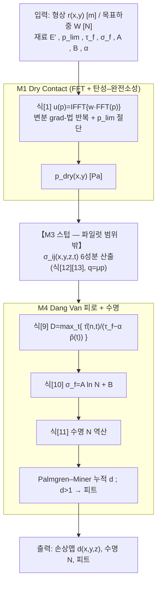

# 논문 구현 — P2-1 통합 이론 검토서 (파일럿: M1·M4 초안)

> **문서 유형**: 통합 이론 검토서 **파일럿 초안** — 6개 하위모델 중 **M1(Dry Contact) · M4(Dang Van 피로)** 2개 범위로 양식을 시범 채움. 나머지 M2·M3·M5·M6은 본 초안 범위 밖(인터페이스 스텁만 표기).
> **대상 논문**: Morales-Espejel & Brizmer (2011) Micropitting Modelling in Rolling–Sliding Contacts
> **본 논문 실제 파일**: `d:/AI/AI_Seminar/논문 취합/03. 정리/Test_pipeline. 2011. (SKF) Micropitting.md`
>   ⚠️ 프롬프트/양식이 지정한 `…(원문통합).md`는 폴더에 **부재**. 위 `Test_pipeline…` 파일이 실질 원문통합본이다(연구자 확인 필요, U-05).
> **선행 입력**: P1-1 산출물 = **검증된 M1·M4 T1 이론 추출물**(본 검토서 §부록 A에 원본 인용)
> **통과 게이트**: **G2-1** — 차원/단위 일관성 통과 · 변수 명명사전 확정 · 미결 가정 0건 · 하위모델 인터페이스 계약 확정
> **상태**: ☑ 작성중 ☐ 연구자 더블체크 ☐ G2-1 통과
> **크리틱 반영**: 본 초안은 P1-1 추출물에 대한 크리틱 defect 10건을 §7·각 표 각주에 반영하여 verbatim 정정·상태 하향·교차경고를 추가함.

---

## 1. 목적·범위

M1(FFT 기반 dry 접촉 + 탄성–완전소성) 과 M4(Dang Van 다축피로 + Wöhler 수명) **2개 하위모델**을 하나의 이론 체계로 통합하는 **파일럿**이다. 산출: (a) 파일럿 계산 플로우, (b) 변수 명명사전(M1·M4 범위), (c) 하위모델 인터페이스 계약, (d) 전제·가정 통합, (e) 차원·단위 일관성 검사. **모든 항목은 P1-1(T1)의 인용·원문에 추적 가능**하다.

**파일럿의 의도적 제약**: M1(dry 압력) 과 M4(피로 손상) 사이에는 정식 모델에서 M6(하중분담)·M3(표면하 응력이력)이 개입한다. 본 파일럿은 이 둘을 **경계 스텁(boundary stub)** 으로만 두고, M1 출력(압력장) → [M3 스텁: 응력이력] → M4 입력(응력이력)의 최소 결선을 검사한다. M3/M6의 내부 이론은 후속 파일럿에서 채운다.

---

## 2. 통합 계산 플로우 (파일럿 M1·M4)

**단계별 명세표** (M1·M4 스텝만 완결; M3 스텁은 회색)

| 스텝 | 계산 내용 | 지배식 | 입력(단위) | 출력(단위) | 소속 | T1 인용 |
|---|---|---|---|---|---|---|
| S1 | dry 탄성 변위 (FFT) | 식[1] `u=IFFT{w·FFT(p)}` | p [Pa], w [m/Pa] | u [m] | M1 | 2011 식[1] L163; (22) Eq(6); (21) Eq(3) |
| S2 | 변분 반복 (grad-법 4단계) | `p′=p−grad f`, `grad f=u+g` | u,g [m] | p_dry [Pa] | M1 | (22) §6; (21) §2.1 |
| S3 | 탄성–완전소성 절단 | p_i ≤ p_lim, p_i≥0 | p′ [Pa], p_lim [Pa] | p_dry [Pa] | M1 | 2011 L143–159; (25) Eq(16); (21) §2.2 |
| **S3.5** | **【스텁】표면하 6응력** | 식[12][13] (M3) | p_dry, q=μp [Pa] | σ_ij(x,y,z,t) [Pa] | M3 (범위밖) | — (후속 파일럿) |
| S4 | Dang Van 위험계수 | 식[9] | σ_ij → τ̂, p̂ [Pa] | D [–] | M4 | 2011 식[9] L273; (13)(14) |
| S5 | S–N 곡선 | 식[10] `σ_f=A ln N+B` | N [–] | σ_f [Pa] | M4 | 2011 식[10] L289; (19) |
| S6 | 수명 역산 | 식[11] | τ̂,p̂ [Pa] | N [–] | M4 | 2011 식[11] L293 |
| S7 | Miner 누적·피트 | Palmgren–Miner | d [–] | 손상맵, 피트 | M4 | 2011 L299; (20) |

> **파일럿 결선 검증 포인트**: S3(p_dry) → S3.5(σ_ij) → S4(τ̂,p̂) 로 압력장이 응력이력으로 변환되어야 M4가 구동된다. 이 변환(M3)은 파일럿 범위 밖이므로 **S3.5는 계약상 인터페이스로만 고정**(§4)하고, 검증 시 해석 Hertzian 응력해 또는 단위 정현 압력으로 스텁 주입한다.

---

## 3. 변수 명명사전 (M1·M4 범위) — G2-1 확정 대상

> 구현 코드의 **단일 기준(SSOT)**. 규약 충돌($E'$, $\alpha$, $\beta$)을 여기서 못박는다.

| 기호 | 의미 | 단위 | 정의식 / 규약 | 출처(T1) | 비고 |
|---|---|---|---|---|---|
| $p$ | 국부 접촉 압력 | Pa | — | 2011 Nomen. | M1 출력·M4 입력 매개 |
| $p_{dry}$ | dry 접촉 압력장 | Pa | 식[1]+변분해 | M1-a~e | S3 출력 |
| $u(p)$ | 표면 탄성 변위 | m | 식[1] `IFFT{w·FFT(p)}` | M1-e | |
| $w$ | 주파수응답함수(FRF) | m/Pa | $w=2/(E^\ast\,\zeta)$, $\zeta=(\alpha^2+\beta^2)^{1/2}$ | M1-f,g | ⚠️ 3D 전체행렬 M1-g(잠정) |
| $g$ | 초기 간극(gap) | m | 형상차 | M1-a,c | 변분식의 $g$ |
| $f$ | 변분 목적함수 | J (또는 상대) | $f=\tfrac12\!\int p\,u\,dS+\int p\,g\,dS$ | M1-a,b | 2차형식 |
| $p_{lim}$ | 소성 임계 압력 | Pa | AISI 52100: **4.3 GPa** (first-yield) | M1-d,i | ⚠️ 정의 3중 불일치(U-01) |
| $E'$ | 환산 탄성계수 | Pa | **$2/E'=(1-\nu_1^2)/E_1+(1-\nu_2^2)/E_2$** | M1-h | ⚠️ 통상 관례의 **2배** |
| $E^\ast$ | dry 유효계수 | Pa | $E^\ast=E'/2$ ⇒ $1/E^\ast=(1-\nu_1^2)/E_1+(1-\nu_2^2)/E_2$ | M1-h | (22)(26)의 $E^\ast$와 **일치**. 변위식엔 $E^\ast$ 사용 |
| $\alpha,\beta$ **(M1-f)** | 공간 파수(x,y) | rad/m (≡1/m) | $p\propto\cos\alpha x\cos\beta y$ | M1-f | **↓ α 삼중 과부하 경고 참조** |
| $\zeta$ | 파수 크기 | 1/m | $\zeta=(\alpha^2+\beta^2)^{1/2}$ | M1-f | |
| $D$ | Dang Van 위험계수 | – | 식[9] $\max_t\{\hat\tau/(\tau_f-\alpha\hat p)\}$ | M4 식[9] | 원출처 표기 $d$ 와 동일 개념 |
| $d$ | Miner 누적 손상 | – | Palmgren–Miner 합 | M4 | **$D$와 구분**(순간위험 vs 누적) |
| $\hat\tau(\vec n,t)$ | 미시전단응력 진폭 | Pa | 임계면 $\vec n$ 의 Tresca 반값(문헌별 계수주의) | G-M4-1 | ⚠️ 계수정의 문헌불일치(U-02) |
| $\hat p(t)$ | 순간 정수압 | Pa | $\mathrm{trace}\,\Sigma(t)/3$ | G-M4-2 | 거시=미시 동일 |
| $\tau_f$ | 교번 전단 피로한도 | Pa | $\approx\sigma_f/\sqrt3$ (von Mises) | M4 | |
| $\sigma_f$ | 교번 굽힘 피로한도 | Pa | 식[10] $A\ln N+B$ | M4 | |
| $\alpha$ **(M4)** | Dang Van 재료상수 | – (무차원) | $\alpha=(\tau_f-\sigma_f/2)/(\sigma_f/3)$ ≈ **0.232** | M4 | **↓ α 삼중 과부하 경고** |
| $A,\,B$ | S–N 회귀상수 | Pa | AISI 52100: $A\approx-43.0$ MPa, $B\approx1220$ MPa | M4 | ⚠️ (19)에서 **재적합값**(U-03) |
| $N,\,N_{ref}$ | 수명·기준수명 | cycles | $N_{ref}>1\times10^6$(수치 미확보) | M4 G-M4-3 | ⚠️ 미결(U-04) |

### ⚠️ 기호 $\alpha$ — **삼중(3중) 과부하 전용 교차경고** (크리틱 defect #4·#5·#8 반영)

2011 Nomenclature 상 $\alpha$ 는 **세 가지** 서로 다른 물리량에 재사용된다. 파일럿 M1·M4 범위 안에서 이미 **둘**이 충돌하며, 세 번째(M2)가 통합 시 추가된다:

| 의미 | 사용 위치 | 단위 | 대표값 | 파일럿 포함? |
|---|---|---|---|---|
| (i) **공간 파수** ($\cos\alpha x$, $\zeta=\sqrt{\alpha^2+\beta^2}$) | **M1-f** (Johnson 인용) | 1/m | 형상의존 | ✅ 포함 |
| (ii) **Dang Van 재료상수** (식[9] $\tau_f-\alpha\hat p$) | **M4** 식[9] | 무차원 | ≈0.232 | ✅ 포함 |
| (iii) 점도–압력계수 (Barus) | M2 (범위 밖) | Pa⁻¹ | ≈20.78 GPa⁻¹ | ⛔ 통합 시 주의 |

> **구현 강제 규약**: 파일럿 코드에서 $\alpha$ 를 **전역 단일 기호로 쓰지 말 것**. 권장 접미어 — M1-f 파수는 `alpha_wave` (또는 $\alpha_w$, [1/m]), M4 재료상수는 `alpha_DV` (또는 $a_{DV}$, [–]), (통합 시) M2 점도계수는 `alpha_visc` ([Pa⁻¹]). 세 값은 **차원이 모두 달라** 차원검사(§6)로 오사용을 부분적으로 잡을 수 있으나, (i)·(ii)만으로도 셀 간 혼동 위험이 실재하므로 명명 분리를 G2-1 통과 조건으로 둔다.
>
> **$\beta$ 도 부수 과부하**: M1-f 에서 $\beta$ = y-파수 [1/m]. 반면 교차문헌 (33)(34)(36)은 Dang Van locus 절편을 $\beta=\tau_W$ [Pa]로 표기(2011 본문은 이를 $\tau_f$ 로 흡수하여 $\beta$ 기호를 피함). 파일럿엔 M1-f $\beta$(파수)만 등장하나, 원출처 교차대조 시 $\beta$ 의미 전환에 유의.

---

## 4. 하위모델 인터페이스 계약 (파일럿 M1·M4)

> 각 화살표가 "무엇을·어떤 단위·어떤 좌표계로" 주고받는지 확정.

| From → To | 전달량 | 단위 | 좌표/규약 | 검증 방법 |
|---|---|---|---|---|
| 입력 → M1 | 형상 $r(x,y)$, 목표하중 $W$ | m, N | 격자 $x$=구름방향, 주기적(FFT 창) | — |
| M1 내부 (S1↔S2) | $u(p)\leftrightarrow p$ | m ↔ Pa | 동일 격자, $w$[m/Pa]로 결합 | $w(1,1)=0$(평균변위 0) |
| M1 → **M3 스텁** | $p_{dry}(x,y)$ | Pa | 격자(예 121×121), 음압=0, $\int p\,dA=W$ | 하중적분=목표하중; $p\le p_{lim}$ |
| **M3 스텁** → M4 | $\sigma_{ij}(x,y,z,t)$ 6성분 | Pa | $z=0\sim0.25a$ 다층, $q=\mu p$(Coulomb) | 정현·Hertzian 스텁으로 주입 검증 |
| M4 내부 (S4→S6) | $\hat\tau,\hat p \to D \to N$ | Pa → – → cycles | 임계면 $\vec n$ 자동탐색(Tresca) | $D\ge1$ ⇔ $N\le N_{ref}$ 정합 |
| M4 → 갱신 | 손상맵 $d(x,y,z)$ | – | $d>1$ → 해당 체적+상부 제거(피트) | Miner 합 단조증가 |

> **파일럿 핵심 계약 = M1→M3스텁→M4 경계**: M1은 **압력장(Pa)** 만 내보내고, M4는 **응력이력(Pa, 6성분·시간)** 만 받는다. 둘 사이 변환책임은 전적으로 M3(범위 밖). 따라서 파일럿 통합 테스트는 M3 스텁에 **검증된 해석해(단위 정현 압력 → Johnson 식 응력, 또는 Hertzian)** 를 주입해 M1·M4 각각을 독립 검증한 뒤 결선한다.

---

## 5. 전제·가정 통합표 (M1·M4)

| 가정 | 적용 | 유효 범위 | 출처(T1 인용) | 상호 충돌 |
|---|---|---|---|---|
| 무마찰·반무한체·선형탄성 (변분 최소화) | M1-a,b | 접촉면적·압력 사전미지, coercivity 성립 | (24) Kalker Eq(40); (22) Eq(4) | M1-d 소성과 경계 |
| $f$ 는 2차형식 ⇒ `grad f=u+g` | M1-c | 무마찰 정규접촉 | (22) §6 | — |
| 소성영역 미소 ⇒ 탄성형상 불변, 소성소산 무시 | M1-d | small plastic deformation | 2011 L143; (25) | 대변형 시 무효 |
| 주기적 표면·진폭≪파장 (중첩원리) | M1-e,f | FFT 창 경계, bi-sinusoidal | (22) Eq(6); (26) | M2 저진폭 가정과 정합 |
| 고사이클 다축피로·국부 탄성 셰이크다운 | M4 식[9] | 안정화 응답 도달 | (13)(14) Dang Van | 잔류압축 중첩 시 과대수명(2011 명시) |
| von Mises: $\tau_f\approx\sigma_f/\sqrt3$ ⇒ $\alpha\approx0.232$ | M4 | 실측비 없을 때만 | 2011 L283 (자체 근사) | 베어링강 $\tau_W/\sigma_W$>0.5 가능 → 민감도 |
| S–N 대수선형 $\sigma_f=A\ln N+B$ | M4 | AISI 52100, 관측가능 피로한도 없음 | 2011 L289; (19) Shimizu | $A,B$ 재적합 불확실(U-03) |
| 선형손상누적 (Palmgren–Miner) | M4 | $d>1$ → 피트 | (20) Palmgren | — |
| Coulomb 트랙션 $q=\mu p$ | M3 스텁 | (범위 밖, 계약만) | 2011 | — |

---

## 6. 차원·단위 일관성 검사 (G2-1 핵심, M1·M4)

| 식 | LHS 차원 | RHS 차원 | 일치 | 비고 |
|---|---|---|---|---|
| 식[1] $u=\mathrm{IFFT}\{w\cdot\mathrm{FFT}(p)\}$ | m | $[m/\mathrm{Pa}]\cdot[\mathrm{Pa}]=\mathrm{m}$ | ☑ | $w=2/(E^\ast\zeta)$: $\mathrm{Pa}^{-1}\!\cdot\mathrm{m}=\mathrm{m/Pa}$ (∵$\zeta$[1/m]) |
| $w$ 계수 $2/(E^\ast\zeta)$ | m/Pa | $1/(\mathrm{Pa}\cdot\mathrm{m}^{-1})=\mathrm{m/Pa}$ | ☑ | $E^\ast=E'/2$ 사용 필수(M1-h) |
| 소성절단 $0\le p_i\le p_{lim}$ | Pa | Pa | ☑ | $p_{lim}$=4.3 GPa |
| 식[9] $D=\hat\tau/(\tau_f-\alpha\hat p)$ | – | $\mathrm{Pa}/(\mathrm{Pa}-[-]\cdot\mathrm{Pa})=[-]$ | ☑ | $\alpha$=**무차원**(M4). ⚠️ M1-f $\alpha$[1/m] 대입 금지 |
| $\alpha=(\tau_f-\sigma_f/2)/(\sigma_f/3)$ | – | $\mathrm{Pa}/\mathrm{Pa}=[-]$ | ☑ | ≈0.232 |
| 식[10] $\sigma_f=A\ln N+B$ | Pa | $\mathrm{Pa}\cdot[-]+\mathrm{Pa}=\mathrm{Pa}$ | ☑ | $A,B$[Pa], $\ln N$ 무차원 |
| 식[11] $1=\max_t\{\hat\tau/((A/\sqrt3)\ln N+(B/\sqrt3)-\alpha\hat p)\}$ | – | $\mathrm{Pa}/\mathrm{Pa}=[-]$ | ☑ | $\tau_f=\sigma_f/\sqrt3$ ⇒ $A/\sqrt3,B/\sqrt3$ [Pa] |
| $\zeta=(\alpha^2+\beta^2)^{1/2}$ (M1-f) | 1/m | $((1/m)^2)^{1/2}=1/\mathrm{m}$ | ☑ | 파수 $\alpha,\beta$ [1/m] |

> **차원검사가 $\alpha$ 과부하를 부분적으로 방어**: 식[9]·식[11]은 $\alpha$ 무차원, 식 $\zeta$ 는 $\alpha$[1/m]. 따라서 M1-f $\alpha$ 를 M4 식[9]에 잘못 대입하면 $\alpha\hat p$ 항이 [1/m·Pa]가 되어 $\tau_f$[Pa]와 감산 불가 → **차원 오류로 검출됨**. 단, 값만 스칼라로 넘기는 코드에선 자동검출 안 되므로 §3 명명분리를 병행한다.

---

## 7. 미결 가정 / 충돌 로그 (되돌림 대상) + 크리틱 반영

| ID | 미결/충돌 내용 | 영향 | 조치(재조사 문헌 / 가정+민감도) | 상태 |
|---|---|---|---|---|
| **U-01** | $p_{lim}$ 정의 **3중 불일치**: 2011=first-yield 4.3 GPa / (25) Tian–Bhushan=경도 $H_s$ / (21)2010=≈1.8σ_yield | 소성절단 임계·압력분포 | AISI 52100은 **4.3 GPa 채택**하되 근거 명시. 세 정의 민감도 | ☐ 연구자 확정 |
| **U-02** | 미시전단 진폭 $\hat\tau$ **계수정의 문헌불일치**: (13)=½Tresca{s_ij} / (14)L170=Tresca[σ] (계수1) / (33)(36)=(σ_I−σ_III)/2 | $D$ 절대값·$\alpha,\beta$ 짝 | 선택한 $\hat\tau$ 계수와 $(\alpha,\beta)$ 정의를 **한 세트로 고정**(혼용 금지) | ☐ 연구자 확정 |
| **U-03** | $A=-43.0$ MPa·$B=1220$ MPa 가 **(19) Shimizu에 직접 부재** — 저자가 torsion $\tau_{max}$–N 데이터(Table3,6, 지수식[15])에서 재적합한 값 | S–N 절대수명 | 원데이터로 회귀절차 재현 or 값 그대로 채택+회귀 불확실 민감도 | ☐ 연구자 확정 |
| **U-04** | $N_{ref}$ **구체 수치 미확보**: 2011·(33) 모두 "$>1\times10^6$" 범위만. (19)는 "관측가능 피로한도 없음" | $\tau_f,\sigma_f$ 기준수명 | $N_{ref}=10^6$ 고정 가정 + 민감도. **⚠️ 라벨 정정**: 이론표·Gap표 공히 **"미충족(부분)"** 으로 통일(크리틱 #6) | ☐ 연구자 확정 |
| **U-05** | 원문통합 파일명 불일치(지정 `…(원문통합).md` 부재 → `Test_pipeline…` 사용) | 인용 추적성 | 정본 파일 확정·명명 정리 | ☐ 연구자 확정 |
| **U-06** (크리틱 #1·#5) | **M1-g 3D $w$ 행렬 verbatim 정정**: 유일출처 (21)2010 Eq(5)의 실제 OCR은 `[(j-1)!]`(**팩토리얼**)이며, $l=Lx/Ly$ 는 식 본문이 아닌 L99 "where $l=L_x/L_y$"에만 존재. 추출물이 제시한 `[l(j-1)]`(보정형)은 **원문이 아니라 추론**. | 3D FRF 정확도 | **실스캔 원본 재대조 필수**. 정방격자($L_x=L_y,l=1$)면 $w=1/\sqrt{(i-1)^2+(j-1)^2}$ 로 축약(팩토리얼·$l$ 무관). 상태 **충족→충족(잠정)** 하향 | ☐ **원본 재확인 필수** |
| **U-07** (크리틱 #2·#7) | **M1-a Kalker Eq(40) verbatim 정정 + 에너지 쌍대성**: (24) 실제 L443은 `∫_{S_o} p_i η_l dS`(추출물 `∫_{S_c} p_i η_i dS` 오기 — $S_o$↔$S_c$, $η_l$↔$η_i$). 또한 Eq(40) $V_N$ 은 **위치에너지(potential, 변위 η 기반)**(Kalker L372 "V: potential energy"); **압력 $p$ 기반 상보에너지** 최소화는 Kalker §6(대략 Eq61+). 헤더 "상보에너지 최소화"에 Eq(40)을 근거로 든 것은 위치/상보 쌍대성 혼동(경미) | 이론 인용 정확도 | verbatim 을 $S_o/η_l$ 로 정정. 상보에너지 정식은 Kalker §6 참조로 교체(또는 (22)의 'equivalent variational statement' 포괄인용에 의존, 실무 방어가능) | ☐ 인용 정정 |
| **U-08** (크리틱 #3) | (22) Stanley–Kato **Eq(6)·§6 grad-f 4단계가 MD상 이미지 임베드**(img L89–93, L116–133) → OCR 텍스트 직접대조 불가. 내용은 2011 본문 L133–139·(21)2010으로 교차확인되어 오류 아니나 "(22) verbatim"은 **사실상 재구성** | 인용 등급 | 해당 셀 verbatim 을 "재구성(교차확인)"으로 라벨. 원 PDF 이미지 확인 시 승격 | ☐ 원 이미지 확인 권장 |
| **U-09** (크리틱 #4·#8) | 기호 $\alpha$ **삼중 과부하**: 검사항목이 '이중의미'로만 표기했었음. M1-f(파수)·M4(재료상수)·M2(점도계수) 3중. §3 전용 교차경고로 반영 완료 | 구현 혼동 | §3 명명분리 규약 강제(alpha_wave/alpha_DV/alpha_visc). $\beta$ 도 파수↔$\tau_W$ 부수 과부하 | ☑ 반영(규약 확정 필요) |
| **U-10** (크리틱 #9, 참고) | 상류문헌 **(21)2010 Eq(4)는 sqrt 누락 오식**: $u=2/((n^2+m^2)E^\ast)$ (제곱근 없음). 추출물은 (22) Eq(3)의 올바른 $2/(E^\ast(n^2+m^2)^{1/2})$ 인용 → **추출물이 옳음**. 두 원출처 간 식 불일치만 기록 | (없음, 추출물 정확) | 구현은 **sqrt 형(√) 채택**. (21) 인용 시 오식 주석 | ☑ 확인(정보) |

> **미결(U-01~U-08) 이 남아 있어 현재 G2-1 미통과**. 특히 **U-06(3D $w$ 원본 재확인)** 은 M1 핵심 FRF의 정확성에 직결되므로 P1-1 되돌림 1순위.

---

## 8. G2-1 게이트 체크리스트 (파일럿 M1·M4)

- ☑ 파일럿 플로우(§2) M1·M4 전 스텝 식·입출력·단위 완결 (M3 스텁은 계약으로 고정)
- ☑ 변수 명명사전(§3) M1·M4 전 기호 등록, **$E'$ 2배 규약 확정 · $\alpha$ 삼중 과부하 분리규약 명시**
- ☑ 인터페이스 계약(§4) 전 화살표 단위·좌표 확정 (M1→M3스텁→M4 경계 명세)
- ☑ 차원·단위 일관성(§6) 전 식 통과
- ☐ **미결 가정 0건** — **미달**(U-01~U-08 잔존, §7)
- ☐ 모든 항목 T1 인용 추적 가능 — **부분**: U-06/U-07/U-08 verbatim 재확인 필요, U-05 정본 파일 확정 필요
- ☐ 연구자 더블체크 완료

**판정**: **G2-1 미통과 (조건부)**. 형식(§2·§3·§4·§6)은 충족하나 §7 미결 8건(특히 U-06 원본 대조, U-01·U-04 상수 확정) 해소 전까지 P1(착수) 진입 불가.

**연구자 확인**: 서명 ______  날짜 ______

---

## 부록 A. 크리틱 defect ↔ 반영 위치 대응표

| 크리틱 defect | 요지 | 본 검토서 반영 |
|---|---|---|
| #1 M1-g verbatim | `[(j-1)!]` 실제 OCR, `[l(j-1)]`는 추론 | U-06, §3 $w$행 각주, 상태 충족(잠정) |
| #2 M1-a Kalker | $S_c$→$S_o$, $η_i$→$η_l$ 전사오류 | U-07 |
| #3 (22) 이미지임베드 | Eq(6)·§6 grad-f 재구성 | U-08 |
| #4 α 삼중 과부하 미경고 | 이중→삼중 | §3 전용 교차경고, U-09 |
| #5 M1-g 상태 관대 | 충족→충족(잠정) | U-06, §부록 B 상태표 |
| #6 G-M4-3 라벨 불일치 | 부분충족 vs 미충족(부분) | U-04, §부록 B (미충족(부분)으로 통일) |
| #7 M1-a 에너지 쌍대성 | 위치≠상보에너지, Eq(40)은 potential | U-07 |
| #8 α 이중사용 | M4 재료상수 vs M1-f 파수 | §3 교차경고, U-09 |
| #9 (21) Eq(4) sqrt 누락 | 추출물은 옳음(참고) | U-10 |
| — β 부수 과부하 | 파수 vs $\tau_W$ | §3 하단 주 |

## 부록 B. 이론표 상태 라벨 (크리틱 반영 후 정정본)

| 항목 | P1-1 원상태 | **정정 상태** | 근거 |
|---|---|---|---|
| M1-a 변분원리(연속) | 충족 | **충족(인용 정정)** | U-07: verbatim $S_o/η_l$, 상보에너지 인용은 Kalker §6 |
| M1-g 3D $w$ 행렬 | 충족 | **충족(잠정)** | U-06: 원본 재대조 전 잠정 |
| G-M4-3 $N_{ref}$ | (이론표)부분충족 / (Gap)미충족(부분) | **미충족(부분)** 통일 | U-04 |
| M4 S–N 상수 $A,B$ | 부분충족 | **부분충족(재적합)** 유지 | U-03 |
| 그 외 M1-b~f,h,i / M4 식[9][11] 등 | 충족 | 충족 유지 | 변동 없음 |

---

## 부록 C. 파일럿 원출처 파일 경로 (절대경로)

- 본 논문(원문통합): `d:/AI/AI_Seminar/논문 취합/03. 정리/Test_pipeline. 2011. (SKF) Micropitting.md`
- (21) 2010 SKF (M1 최우선, 3D $w$·소성6단계·$E^\ast$): `d:/AI/AI_Seminar/논문 취합/03. 정리/2010. (SKF) Micro-Geometry Effects on the Sliding Friction Transition in Elastoh.md`
- (22) Stanley–Kato 1997 (FFT 변분·식[6]): `d:/AI/AI_Seminar/논문 취합/03. 정리/1997. (Stanley-Kato) FFT-Based Method for Rough Surface Contact.md`
- (24) Kalker 1977 (변분원리 Eq(40)/§6): `d:/AI/AI_Seminar/논문 취합/03. 정리/1977. (Kalker) Variational Principles of Contact Elastostatics.md`
- (26) Johnson et al. 1985, (25) Tian–Bhushan 1996, (13)(14) Dang Van, (33) Desimone, (34) Milano, (36) Baietto, (19) Shimizu, (20) Palmgren: T1 추출물 인용 참조.

**끝 (파일럿 M1·M4 초안)**
