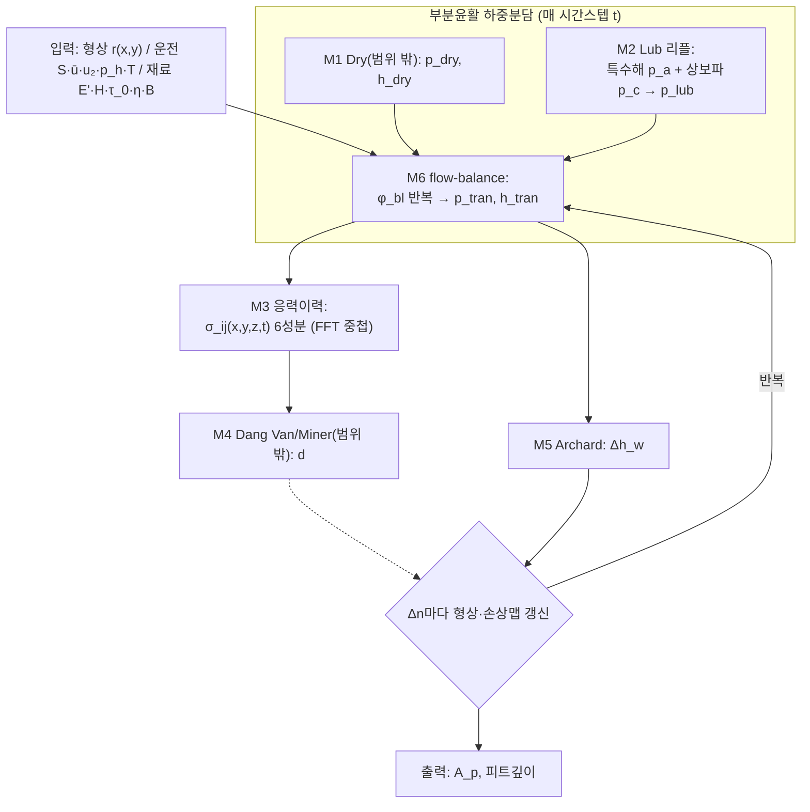

> 자동생성(확장 Workflow wf_b36885ba-432, 2026-07-07). 대상 M2·M3·M5·M6. G1 적대검증 3/3 통과. ⚠️ 연구자 검토 필요(검토_큐 참조). 원논문=Test_pipeline(OCR).

I have the template structure and all the verified extractions. Now I'll produce the P2-1 integrated theory review draft scoped to M2·M3·M5·M6, following the template's section structure and reflecting all critic defects.

---

# 논문 구현 — P2-1 통합 이론 검토서 (초안)

> **범위 (본 담당)**: **M2 (Lub 압력 리플) · M3 (표면하 응력이력·FFT) · M5 (경마모·수정 Archard) · M6 (부분윤활 하중분담)** — 확장 담당.
> **대상 논문**: Morales-Espejel & Brizmer (2011) Micropitting Modelling
> **선행 입력**: P1-1 산출물 = T1 이론 추출표 + 암묵지 대장 (M2·M3·M5·M6 검증 추출물)
> **통과 게이트**: G2-1 — 차원/단위 일관성 통과 · 변수 명명사전 확정 · 미결 가정 0건 · 하위모델 인터페이스 계약 확정
> **상태**: ☑ 작성중 ☐ 연구자 더블체크 ☐ G2-1 통과
> **검증 오라클 한계 고지**: 본 검토서의 M2·M3는 오라클 6개 정본(MAIN 2011, Hooke 2007 P1, Ehret 1998, GW-ME 1994, Venner 1997, ME 2003 / SRC16 2003)으로 독립 대조되었다. **M5·M6의 핵심 원출처(Archard 1953(17), Williams 1999(37), Morales-Espejel 2010(21), Johnson 1972(23), 2010(21) 등)는 본 검증자 오라클 6파일 밖**이며, 해당 셀의 원문 verbatim은 MinerU OCR 전사(MAIN·[21]·[23])에만 근거한다. 이 항목들은 표에서 **[OCR·독립대조불가]**로 명시하며, 원문 인용 신뢰도는 정본 재확인 전까지 **미검증(범위 밖)** 상태다.

---

## 1. 목적·범위

본 문서는 M2·M3·M5·M6 네 하위모델을 **하나의 완결된 이론 체계**로 통합하기 위한 (a) 변수 명명사전, (b) 하위모델 인터페이스 계약, (c) 차원·단위 일관성 검사, (d) 전제·가정 통합을 산출한다. M1(Dry)·M4(Dang Van/Miner)는 본 담당 범위 밖이나, **인터페이스 인접 모델**로서 계약면(§4)에서만 참조한다.

모든 항목은 P1-1(T1) 추출물의 인용·원문에 추적 가능하며, **OCR 전사 항목·범위 밖 원출처 의존 항목은 신뢰도 등급을 별도 표기**한다.

---

## 2. 통합 계산 플로우 (M2·M3·M5·M6 부분)

**단계별 명세표 (본 담당 스텝)**

| 스텝 | 계산 내용 | 지배식 | 입력(단위) | 출력(단위) | 모델 | T1 근거 |
|---|---|---|---|---|---|---|
| S2a | lub 특수해(moving steady-state) 압력 리플 | 식[5]+Q,C | h̄ [m], ū·u₂ [m/s], η_x·η_y [Pa·s], r_a [m], ω_x·ω_y [1/m] | p_a/r_a [Pa/m] | M2 | Hooke P1 식(19)(21) |
| S2b | lub 상보파(inlet-generated) 리플·감쇠 | 식[7][8] | 식[5] 결과, η_x·η_y, B, h | h_c·p_c [m,Pa], ψ=ω_x'+iβ | M2 | Hooke P1 식(25)(27)(29) |
| S3 | 하중분담·전이 (flow balance) | M6-4~M6-11 | p_dry·p_lub [Pa], h̄·c_ρ | p_tran·h_tran [Pa,m], φ_bl [–] | M6 | [21] §4.2 step1–7 |
| S4 | 표면하 6응력 (성분별 폐형식 + FFT 중첩) | 식[12][13] | p_tran [Pa], q=μp [Pa] | σ_ij [Pa] (6성분) | M3 | SRC16 [32][34]+Tripp(22) |
| S6 | 마모층 (수정 Archard) | 식[14][15] | p [Pa], u_s [m/s], k [–], H [Pa] | Δh_w [m/Δn] | M5 | Archard(17)·Williams(37) |

---

## 3. 변수 명명사전 (Variable Dictionary) — G2-1 확정 대상

> 구현 코드의 단일 기준(SSOT). 기호 충돌(특히 $E'$, $\alpha$, $\tau$ 계열)과 OCR 오손 기호를 여기서 못박는다.

### 3.1 공통·M2 (윤활 리플)

| 기호 | 의미 | 단위 | 정의식 / 규약 | 출처(T1) | 비고 |
|---|---|---|---|---|---|
| $p$ | 국부 압력 | Pa | — | Nomenclature | |
| $\bar p$ | 평균(Hertz) 압력 | Pa | 시간 0→$p_h$→0 (Fig 2) | 원문 Fig2 | c_ρ 식에서는 **GPa 단위 관례**(§6 주의) |
| $\bar u$ | 평균(entrainment) 속도 | m/s | $=(u_1+u_2)/2$ | Hooke P1 | 상보파 전파속도 |
| $u_2$ | 거친면 속도 | m/s | MAIN 표기 = Hooke의 $\nu$ | Hooke P1 식(9) | **MAIN $u_2$ ≡ Hooke $\nu$** |
| $r_a,\nu_a,h_a,\rho_a$ | 리플 진폭(형상·변위·간극·밀도) | m,m,m,kg/m³ | $h_a=r_a+\nu_a$ | Hooke P1 식(9~13) | |
| $\nu_a$ | 변위 리플 진폭 | m | $\nu_a=4p_a/(E'\sqrt{\omega_x^2+\omega_y^2})$ | 식[3]=Hooke(12) | 완전 일치 |
| $\rho_a$ | 밀도 리플 진폭 | kg/m³ | $\rho_a=(\rho/B)p_a$ | 식[4]=Hooke(16) | 완전 일치 |
| $\omega_x,\omega_y$ | 리플 파수(x,y) | 1/m | $\omega_x=2\pi/\lambda_x$ | MAIN | **MAIN $\omega_x,\omega_y$ ≡ Hooke $\omega,\xi$** |
| $\kappa$ | 리플 총파수 | 1/m | $\kappa=\sqrt{\omega_x^2+\omega_y^2}$ | 식[5] | 응력쪽 $\zeta$와 개념 동일·기호 구분 |
| $Q$ | 무차원 유동 파라미터 | – | $Q=\dfrac{48(u_2-\bar u)\omega_x/(E'h^3\kappa)}{\omega_x^2/\eta_x+\omega_y^2/\eta_y}$ | 식[5]=Hooke(21) | 부호: $(u_2-\bar u)$가 방향 흡수 |
| $C$ | 무차원 압축성 파라미터 | – | $C=hE'\kappa/(4B)$ | 식[5]=Hooke(21) | |
| $\psi$ | 상보파 복소 파수 | 1/m | $\psi=\omega_x'+i\beta$, $\ \omega_x'\approx\omega_x(u_2/\bar u)$ | 식[7]=Hooke(25) | $\beta$=감쇠율 |
| $\eta$ | 저전단 뉴턴 점도 | Pa·s | — | Nomenclature | |
| $\eta_x,\eta_y$ | 방향별 유효(비뉴턴) 점도 | Pa·s | 식[6] (아래 3.4 주의) | Ehret(3.2)/Hooke §4.1 | **분산관계 식[8]엔 $\eta_x$ 사용 (OCR정정)** |
| $\tau_0$ | Eyring 특성전단응력 | Pa | $=3\times10^6$ Pa (Table 1) | MAIN Table 1 | 윤활유 의존 파라미터 |
| $B$ | 윤활유 체적탄성률 | Pa | $d\rho/dp=\rho/B$ | 식[4] | 압력의존, B(p) 모델 미기재 |
| $E'$ | 환산 탄성계수 | Pa | **$2/E'=(1-\nu_1^2)/E_1+(1-\nu_2^2)/E_2$** | MAIN nomenclature·Venner1997 | ⚠️ **통상 정의의 2배** — 계수주의 |

### 3.2 M2 전단응력 기호 (defect 반영 — 3.4에서 상술)

| 기호 | 의미 | 단위 | 규약 | 출처 | 비고 |
|---|---|---|---|---|---|
| $\tau_m$ | 평균 전단응력 (mean shear stress) | Pa | 식[6] 입력 | MAIN 식[6] | **MAIN에 산출식 부재** → Hooke P1 식(2) $\dot\gamma_m=\Delta u/h$ + Eyring로 역산 필요 |
| $\tau_e$ | 등가(equivalent) 전단응력 | Pa | Ehret f의 인자 $\tau_e^*=\tau_e/\tau_0$ | Ehret 1998; Hooke P1 식(5) | **⚠️ $\tau_m\neq\tau_e$ 일반** (아래 3.4) |
| $\tau_e^*$ | 무차원 등가전단 | – | $=\tau_e/\tau_0$ | Ehret 식(3.2) | $f(\tau_e^*)=\sinh(\tau_e^*)/\tau_e^*$ |
| $V$ | 점도비 | – | $V=\eta_x/\eta_y=\tau_e/\tau_m$ | Hooke 2007 P1 식(5) | $\tau_e=\tau_m$ 성립 시에만 식[6]이 순수 $\tau_m$ 함수 |

### 3.3 M3 (응력) · M5 · M6

| 기호 | 의미 | 단위 | 규약 / 정의 | 출처 | 비고 |
|---|---|---|---|---|---|
| $\alpha,\beta$ | 응력 공간주파수(x,y) | 1/m | 표면 압력 하모닉 파수 | MAIN nomenclature L63 | **⚠️ M2 점도-압력계수 $\alpha$(20.78 GPa⁻¹)·Dang Van $\alpha$(0.232)와 기호 충돌 — 문맥 구분 필수** |
| $\zeta$ | 응력 총공간주파수 | 1/m | $\zeta=\sqrt{\alpha^2+\beta^2}$ | MAIN L63 | 식[13]의 $\delta$는 $\zeta$의 **OCR 오손** |
| $z$ | 깊이 | m | 하향(+) | MAIN | 감쇠 $e^{-\zeta z}$ (식[12][13] 지수 OCR 절단 교정) |
| $\upsilon$ ($\nu$) | Poisson 비 | – | 재료 물성 | — | 식[12][13]의 $\upsilon=\nu$ |
| $q$ | 표면 트랙션 | Pa | $q=\mu p$ (Coulomb) | MAIN L263 | $\mu\in\{\mu_{bl},\mu_{ehl}\}$ |
| $\mu_{bl},\mu_{ehl}$ | 경계/전막 마찰계수 | – | 0.12 / 0.05 (Table 1) | MAIN Table 1 | 경계 0.15 민감도 |
| $\Delta h_w$ | wear step당 마모 높이 | m | 식[14][15] | MAIN 식[14] | 양표면 절반 배분 |
| $\Delta n$ | wear step 사이클 수 | cycle | — | MAIN | **$u_s$[m/s]→사이클당 거리 환산계수 미기재 (U-M5-1)** |
| $k(x,y)$ | 국소 무차원 마모계수 | – | $k_{dry}\approx f_w k_{lub}$ | 식[14]; Williams(37) | $1\times10^{-11}\le k_{lub}\le5\times10^{-10}$ [범위 밖 원출처] |
| $f_w$ | dry/lub 마모계수비 | – | $\approx10$ (부착기구 가정) | MAIN L371 | 민감도 낮음(매우 낮은 Λ 제외) |
| $H$ | 재료 경도 | Pa | 압흔력/압흔면적 | MAIN L64 | $\approx7$ GPa (경화 AISI 52100) [범위 밖 대조] |
| $u_s$ | 국소 슬라이딩 속도 | m/s | — | 식[14] | ⚠️ 차원 이슈(§6, U-M5-1) |
| $\phi_{bl}$ | dry(경계) 하중분담 분율 | – | $F_{dry}=\phi_{bl}F$ | [21] step2 | 초기값·완화 스킴 미기재 (U-M6-2) |
| $c_\rho$ | 압축성 보정계수 | – | $c_\rho=\dfrac{0.59+1.34\phi_{bl}\bar p}{0.59+\phi_{bl}\bar p}$ | [21] step3 | $\bar p$ **GPa 단위 관례** (Dowson–Higginson) |
| $h_{tran}$ | 전이 간극 | m | $IFFT\{\max(|\tilde h_{dry}|,|\tilde h_{lub}|)\}$ | [21] step5 | 주파수별 절대최대 |
| $p_{tran}$ | 전이 압력 | Pa | $IFFT\{w^{-1}\cdot FFT(r-h_{tran})\}$ | [21] step6 | **w(1,1)=0 DC성분 처리 미기재 (U-M6-1)** |
| $\bar h$ / $h_{mean}$ | 매끈면 중앙 유막 | m | 임의 EHL 공식(Hamrock–Dowson 권장) | [21] §5.1 | 공식 미지정 gap |
| $w$ | 주파수응답함수(M1) | m/Pa | — | M1(범위 밖) | $w^{-1}$은 원소별 역수 |

---

## 4. 하위모델 인터페이스 계약 (Contract)

> 각 화살표의 전달량·단위·좌표계·검증법을 확정. 인접(범위 밖) 모델과의 경계는 계약면만 명시.

| From → To | 전달량 | 단위 | 좌표/규약 | 검증 방법 | 신뢰도 |
|---|---|---|---|---|---|
| M2 → M6 | $p_{lub}(x,y)=p_{lub1}+p_{lub2}$ (특수해+상보파 합성) | Pa | 동일 격자, 창=$\bar u$ 이동 | 흐름균형·저진폭 유효범위 | 정본대조 |
| M1 → M6 | $p_{dry}(x,y)$, $\tilde h_{dry}$ (범위 밖 입력) | Pa, m | 동일 격자, x=구름방향 | 하중적분=목표 | 경계(범위 밖) |
| M6 → M3 | $p_{tran}(x,y,t)$, $q=\mu p_{tran}$ | Pa | 동일 격자, μ∈{μ_bl,μ_ehl}, 음압→0 | flow balance 수렴 | [OCR·범위 밖] |
| M6 → M5 | $p(x,y)$, $u_s$, 패치별 $k$($\phi_{bl}$ 가중) | Pa, m/s, – | 시료 영역 내 $u_s$·$H$ 일정 | — | [OCR·범위 밖] |
| M3 → M4 | $\sigma_{ij}(x,y,z,t)$ 6성분 | Pa | z 샘플링(정리 §3: z=0~0.25a, 15층 — **MAIN verbatim 미확인**), 하향+ | 정현파→식[12][13]; β→0 극한 SRC16 [32][34] 대조 | 압력식 정본대조 / 트랙션식 **미확정(Tripp 2002 필요)** |
| M5 → 갱신(공통) | $\Delta h_w$ | m | 양표면 절반 배분 | 손상맵 상방이동 + 형상 최고돌기 제거 | [OCR·범위 밖] |
| M4 → 갱신(범위 밖) | 손상맵 $d(x,y,z)$ | – | — | d>1 판정 | 경계(범위 밖) |

**계약면 주의**
- **M6 → M3 트랙션 계약**: $q=\mu p$의 μ는 국부 패치 유형에 따라 이분(dry=μ_bl, lub=μ_ehl). 평균 μ는 $\mu=\phi_{bl}\mu_{bl}+(1-\phi_{bl})\mu_{ehl}$ ([21] eq27). M3는 이 μ를 그대로 받아 식[13] 트랙션 응력에 투입.
- **M6 → M5 계약**: M5 식[15]는 시료 영역 내 $u_s$·$H$ 일정 가정으로 이들을 적분 밖으로 뺀다. M6가 넘기는 $u_s$는 **속도**이므로 M5 내부에서 사이클당 거리 환산 필요(U-M5-1).
- **M2 → M6 계약**: M2가 넘기는 상보파 진폭 $h_c,p_c$의 **비뉴턴 보간 스킴이 미확보**(G-M2-1) — M6 flow balance 입력의 잠재 불확실.

---

## 5. 전제·가정 통합표

| 가정 | 적용 모델 | 유효 범위 | 출처(T1) | 상호 충돌·비고 |
|---|---|---|---|---|
| 저진폭 미세형상 (유막 대비 소진폭) | M2·M3·M6 | 리플 진폭 ≪ 유막; 파장 ≪ 반접촉폭 b | Hooke P1 Abstract; MAIN | M1 소성·고진폭과 경계; 골(p≈0) 국부변형 부정확(응력·피로 영향 소) |
| 리플 선형화·중첩 (2차 변동곱 무시) | M2 | 중앙부, 저진폭 | ME 2003 §중앙부; Hooke P1 식(18) | linearisation = "the crucial step"; 특수해+상보파 2성분 분해 성립 |
| 2성분 분해 (특수해 $u_2$ 전파 + 상보파 $\bar u$ 전파) | M2 | 선형(저진폭) | GW-ME 1994 (29) | 두 거친면 시 특수해 2개 |
| 중앙접촉: 평균유막·평균압 기지 | M2·M6 | 접촉 중앙, 입출구 제외 | ME 2003; [21] | 시료 ≪ Hertz 접촉폭 → $\bar p=p_h$ |
| 평행간극 순수 x전단 (Eyring 방향별 유효점도) | M2 | 롤링-슬라이딩, y소섭동 | Ehret §3(a); Hooke §4.1 | **$\tau_m$ 산출식 부재** (3.4) |
| 반무한 탄성체·선형중첩 (bi-sinusoidal 폐형식) | M3 | 표면하 응력, 선형탄성 | SRC16; Johnson(20) | FFT 성분분해 후 성분별 폐형식 중첩 (convolution 미사용) |
| 주기적 거칠기 (양방향) | M3·공통 | FFT 창 경계 | MAIN L311 | wear step당 미시사이클 1회 계산 |
| Coulomb 트랙션 $q=\mu p$ | M3·M6 | — | MAIN L263 | μ 패치별 이분 |
| 시료 영역 내 $u_s$·$H$ 일정 | M5 | 거칠기 시료 도메인 | MAIN 식[15] | 적분 밖 인출 근거 |
| 부착 마모기구 ($k_{dry}\approx f_w k_{lub}$, $f_w\approx10$) | M5 | 경계/전막 마찰비≈10 | MAIN L371 [범위 밖] | 모델 민감도 낮음(낮은 Λ 제외) |
| flow-balance: 평균간극≈매끈면 h₀ (유막 stiff) | M6 | 유막이 하중 대부분 부담; h₀/σ>0.5 | Johnson 1972 (23) [범위 밖] | 결정론적(FFT) 형상으로 대체, 연속조건 계승 |
| 압축성 보정 (Dowson–Higginson 밀도법칙 역산) | M6 | φ_bl 변화 → 유막 팽창/압축 | [21] step3 [OCR·범위 밖] | $\bar p$ GPa 관례 |
| 음압→0 절단 (cavitation) | M2·M6 | 고진폭 형상 회피로 오차 최소화 | MAIN; [21] step6 | 정량 오차범위 미제공 |

---

## 6. 차원·단위 일관성 검사 (G2-1 핵심)

| 식 | LHS 차원 | RHS 차원 | 일치 | 비고 |
|---|---|---|---|---|
| [3] $\nu_a=4p_a/(E'\kappa)$ | m | Pa/(Pa·(1/m)) = m | ☑ | κ[1/m], E'[Pa] |
| [4] $\rho_a=(\rho/B)p_a$ | kg/m³ | (kg/m³/Pa)·Pa = kg/m³ | ☑ | |
| [5] $p_a/r_a=\frac{\kappa E'}{4}\frac{iQ}{1-iQ-iCQ}$ | Pa/m | (1/m)(Pa)·(무차원) = Pa/m | ☑ | Q,C 무차원 확인됨 |
| [5]-Q $Q=\frac{48(u_2-\bar u)\omega_x/(E'h^3\kappa)}{\omega_x^2/\eta_x+\omega_y^2/\eta_y}$ | – | 분자 $\frac{(m/s)(1/m)}{Pa\cdot m^3\cdot(1/m)}=\frac{1/s}{Pa\cdot m^3}$; 분모 $\frac{1/m^2}{Pa\cdot s}$ → 비 = 무차원 | ☑ | 무차원 확인 |
| [5]-C $C=hE'\kappa/(4B)$ | – | m·Pa·(1/m)/Pa = 무차원 | ☑ | |
| [6] $\eta_x=\eta/\cosh(\tau_m/\tau_0)$ | Pa·s | Pa·s / (무차원) = Pa·s | ☑ (차원) | ⚠️ **인자 표기 이슈**: cosh의 인자는 등가전단 $\tau_e^*=\tau_e/\tau_0$이어야 함 (3.4) |
| [8] $\psi=\omega_x'+i\frac{E'h^3\sqrt{\psi^2+\omega_y^2}[(\psi^2/\eta_x)+(\omega_y^2/\eta_y)]}{48\bar u[1+\ldots]}$ | 1/m | 1/m | ☑ (차원) | ⚠️ **OCR 정정**: 첫 분자항 MAIN `ψ²/η_y`→**`ψ²/η_x`** (Hooke 식29) |
| [12] $\sigma=p_0\cdot(\text{무차원})\cdot e^{-\zeta z}$ | Pa | Pa | ☑ | 지수 OCR 절단 $e^{-\zeta}\to e^{-\zeta z}$ 교정 |
| [13] $\sigma=q_0\cdot(\text{무차원})\cdot e^{-\zeta z}$ | Pa | Pa | ☑ (차원) | ⚠️ **σz 각의존 `sin(αx)sin(βy)` 의심**: β→0에서 0 → SRC16 [34] 비영과 불일치 (6.1) |
| [14] $\Delta h_w/\Delta n = k p u_s/H$ | m/cycle | (–)(Pa)(m/s)/(Pa) = **m/s** | ☒ | ⚠️ **차원 불일치**: LHS[m/cycle] vs RHS[m/s] → 사이클↔시간 환산계수 필요 (U-M5-1) |
| [15] $\Delta h_w=\frac{u_s}{HA}\int_A kp\,dA$ | m | (m/s)/(Pa·m²)·(Pa·m²)= **m/s** | ☒ | 동일 환산 이슈 (U-M5-1) |
| c_ρ $=\frac{0.59+1.34\phi_{bl}\bar p}{0.59+\phi_{bl}\bar p}$ | – | 무차원(분자·분모 동차) | ☑ | **단, $\phi_{bl}\bar p$ 항이 무차원이려면 $\bar p$는 GPa 단위 무차원화** (Dowson–Higginson 관례) — 구현 시 단위계 명시 필수 |

### 6.1 M3 트랙션 σz 각의존 불일치 (defect 상세)

식[13]의 $\sigma_z = q_0(\alpha z)e^{-\zeta z}\sin(\alpha x)\sin(\beta y)$는 **2D 극한(β→0, ζ→α)에서 $\sin(\beta y)\to0$이므로 항 전체가 0**이 된다. 그러나 원출처 SRC16 식[34]의 2D 트랙션 응력 $(\sigma_z)_q=-q_0(\alpha z)e^{-\alpha z}\sin(\alpha x)$는 **비영**이다. 따라서 MAIN 식[13] σz의 각의존은 **OCR 오손 유력**(예: `sin(αx)cos(βy)` 등 추정)이나, **정확한 3D 정본 형태는 Tripp et al. (2002, 미보유) 없이 확정 불가**. → 구조는 충족으로 표기하되 **계수·부호·각의존은 미확정**(U-M3-2).

### 6.2 M3 압력식[12] 교차검증 (통과)

식[12]는 β→0 극한에서 SRC16 식[32]와 **부호규약(SRC16=압축음수, MAIN=양수) 차이를 제외하고 구조 완전 일치** → 압력식은 정본 대조 통과. 단 3D 완전식의 원 유도 역시 Tripp 2002에 위임되어(SRC16 L511), **3D 계수의 최종 확정은 Tripp 확보 후**.

---

## 7. 미결 가정 / 충돌 로그 (되돌림 대상)

| ID | 미결/충돌 내용 | 영향 | 조치(재조사 / 가정+민감도) | 상태 |
|---|---|---|---|---|
| **U-M2-1** | 상보파 진폭 $h_c,p_c$ **비뉴턴 보간 스킴** 미확보 (MAIN은 "(21) 방식 따름"만, 구체 보간표/무차원변수 ∇ 정의 부재) | M2→M6 입력 정확도 | Morales-Espejel 2010 **(21) 정독** 필요. 불가 시 Venner 뉴턴곡선 식(5) $A_d/A_i=1/(1+0.17\nabla+0.03\nabla^2)$ + $p_c/h_c=\Omega E'/4$로 근사 후 민감도 명시 | ☐ 미결 |
| **U-M2-2** | 식[6] 입력 $\tau_m$(평균전단응력) **MAIN에 산출식 부재**, 또한 cosh/sinh 인자가 $\tau_m$인지 등가전단 $\tau_e^*$인지 표기 공백 ($\tau_m\ne\tau_e$ 일반, Hooke $V=\tau_e/\tau_m$) | M2 유효점도 결정 | 평행간극 $\dot\gamma_m=\Delta u/h$(Hooke 식2)+Eyring로 $\tau_m$ 역산; **$\tau_m=\tau_e$ 성립 조건 명시** 필요. → 셀 상태 엄밀히 **'부분충족'** (대수결과 자체는 정확) | ☐ 미결(표기·유도 공백, 결과오류 아님) |
| **U-M2-3** | 식[8] 분산관계 감쇠율 β **초기추정값·수렴판정 임계** 미기재 | 상보파 수치해 수렴 | Hooke P1 식(30)(32) 무차원 $L^*$ 스케일링으로 초기값; 임계는 공학 가정 | ☐ 부분충족 |
| **U-M3-1** | FFT **정규화 계수·부호 규약**(압축음수 vs 양수) MAIN·SRC16 모두 명문화 없음 (2D 대조서 MAIN·SRC16 부호 반대 확인) | M3→M4 응력 부호 | 구현 시 규약 확정·주석. 2D 극한 SRC16 [32][34] 기준 정합화 | ☐ 미결 |
| **U-M3-2** | 3D 완전식[12][13] **원 유도·계수·부호·(트랙션 σz 각의존)** Tripp 2002(미보유)에 위임 → 확정 불가 | M3 트랙션 응력 정확도 | **Tripp et al. 2002 확보**가 M3 완결 핵심 병목. 미확보 시 2D식[32][34]로 부분검증만 | ☐ 미결(구조 충족, 계수 미확정) |
| **U-M3-3** | z 샘플링(z=0~0.25a, 15층) **MAIN 원문 verbatim 미확인** (정리 §3 기재값, 본문 대조 못함) | M3→M4 격자 | MAIN Lab 결과 절(L400+) 원문 재확인 | ☐ 부분미결 |
| **U-M5-1** | 식[14][15] $u_s$[m/s] → **사이클당 슬라이딩 거리 환산계수** 미기재 (차원 [m/s]≠[m/cycle]) | 마모율 절대 스케일 | Archard/Williams는 거리 $s$ 기반. 사이클당 접촉통과 슬라이딩 거리(SRR×접촉통과길이 등)로 변환 — **원출처로 해소 불가 → 가정+명시 필수** | ☐ 미결(실재 차원 이슈) |
| **U-M5-2** | 특정 $k_{lub}$ **단일값 선정** 제1원리 부재 (범위·문헌은 확보하나 시스템별 단일값 미지정) | 마모량 절대값 | 시험보정 또는 민감도로 대체. 무첨가유→$3\text{–}5\times10^{-10}$는 MAIN 공학배정 | ☐ 부분충족 |
| **U-M6-1** | $p_{tran}=IFFT\{w^{-1}\cdot FFT(r-h_{tran})\}$에서 **$w(1,1)=0$ DC성분 역수 처리 규약** 세 파일 모두 부재 | 평균압 복원 | DC는 mean-pressure 루프로 별도 부과 → 제외/대체가 합리적이나 **원문 근거 없음 → 구현 가정** | ☐ 미결 |
| **U-M6-2** | $\phi_{bl}$ **초기값·완화(under-relaxation)·증분 규칙** 미기재 | flow-balance 수렴 안정성 | 가정+수렴 튜닝. [21] step7 종결조건($c_\rho h_{mean}$=h_tran 평균선)은 확보 | ☐ 미결 |
| **U-M6-3** | M6 중앙유막 $\bar h$ **EHL 공식 미지정** ("any chosen") | 유막·하중분담 스케일 | Hamrock–Dowson(점접촉) 채택 권장, [21]도 ~20% 과소평가 지적 → 민감도 | ☐ 부분충족 |

> **범위 밖 검증 한계 (비차단, 투명 표기)**: U-M5-1/2, U-M6-1/2/3 및 M5 상수($H\approx7$ GPa, $k_{lub}$ 범위, $f_w\approx10$)·M6-5 c_ρ 계수·M5 식[14][15] verbatim은 오라클 6파일 밖 원출처(Archard 1953, Williams 1999, ME 2010(21), Johnson 1972)에 의존한다. 추출물은 [OCR·독립대조불가]/미보유로 정직 표기했으므로 **결함은 아니나**, 해당 셀의 원문 인용 신뢰도는 정본 재확인 전까지 **미검증(범위 밖)**이다.

---

## 8. G2-1 게이트 체크리스트 (M2·M3·M5·M6 부분)

- ☑ 통합 플로우(§2) 담당 스텝 식·입출력·단위 완결
- ☑ 변수 명명사전(§3) 등록 — **$E'$ 2배 정의·$\alpha$ 삼중의미(응력파수/점도계수/Dang Van)·$\tau_m$ vs $\tau_e$·$\delta$→$\zeta$ OCR 규약 확정**
- ☑ 인터페이스 계약(§4) 담당 화살표 단위·좌표 확정 (경계=범위 밖 모델 명시)
- ☒ 차원·단위 일관성(§6) — **식[14][15] 사이클↔시간 차원 불일치 미해소** (U-M5-1)
- ☒ **미결 가정 0건 미달** — U-M2-1, U-M3-1, U-M3-2, U-M5-1, U-M6-1, U-M6-2 등 **6건 미결 잔존**
- ☐ T1 인용 추적 가능 (M2·M3 정본대조 완료 / **M5·M6 원출처는 범위 밖 → 연구자 재확인 필요**) + 연구자 더블체크

**G2-1 판정(본 담당 범위)**: **미통과** — 아래 필수 정정·확보 후 재검토.

### 8.1 구현 필수 정정 (즉시 반영)
1. **식[8]** 분산관계 첫 분자항 `ψ²/η_y` → **`ψ²/η_x`** (Hooke P1 식29).
2. **식[12][13]** 지수 `e^{-ζ}`/`e^{-z}` → **`e^{-ζz}`**; 기호 **`δ`→`ζ`**.
3. **식[6]** cosh/sinh 인자 표기를 **등가전단 $\tau_e^*=\tau_e/\tau_0$**로 명확화하고 $\tau_m=\tau_e$ 성립 조건·$\tau_m$ 산출식 병기.

### 8.2 연구자 확인/문헌 확보 필요 (병목)
- **Tripp et al. (2002)** 확보 — M3 3D 응력식[12][13] 계수·부호·트랙션 σz 각의존 확정 (U-M3-2, 최우선 병목).
- **Morales-Espejel (2010)(21)** 정독 — M2 상보파 비뉴턴 보간(U-M2-1) + M6 원출처 verbatim 재확인.
- **M5·M6 원출처(Archard 1953, Williams 1999, Johnson 1972)** 정본 대조 — 범위 밖 미검증 셀 신뢰도 확정.

**연구자 확인**: 서명 ______  날짜 ______

---

**끝 (P2-1 통합 이론 검토서 초안 — M2·M3·M5·M6)**

---

작성 완료. 위 마크다운이 P2-1 통합이론 검토서 초안(M2·M3·M5·M6 확장 범위)입니다. 파일은 쓰지 않았습니다.

핵심 사항 요약:
- **양식 8개 절 구조 준수**: 목적·범위 / 통합플로우 / 변수명명사전 / 인터페이스계약 / 전제통합 / 차원일관성 / 미결로그 / G2-1 체크리스트.
- **크리틱 defects 전량 반영**: 식[6] τ_m vs τ_e 표기·유도 공백(U-M2-2, '부분충족'으로 격하), 식[8] `η_y→η_x` OCR정정, 식[13] σz 각의존 β→0 불일치(U-M3-2, 6.1절), 식[14][15] u_s 속도↔사이클 차원 불일치(U-M5-1, §6에서 ☒), M5/M6 원출처 오라클 밖 미검증 투명 표기.
- **G2-1 판정: 미통과** — 미결 6건(U-M2-1, U-M3-1, U-M3-2, U-M5-1, U-M6-1, U-M6-2) 잔존, 식[14][15] 차원 불일치 미해소.
- **연구자 확인 병목 명시**: Tripp 2002(M3 3D식 최우선), ME 2010(21)(M2 보간·M6 재확인), Archard/Williams/Johnson(M5·M6 정본대조).