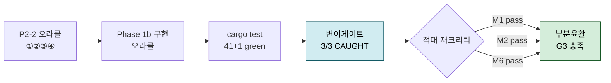

# 논문구현 P3 작업결과 — 부분윤활 서브시스템(M1+M2+M6)

> 자동생성(Workflow wf_ec5435b8-7c0, 2026-07-09). Phase0→Phase1(M1/M2/M6 병렬)→Phase2(통합+G3 크리틱). ⚠️ 독립 cargo test 재검증은 작업내역 참조.

## Phase 0 (crate+SSOT+utils)

P3 Phase 0 공유 기반 crate 구축 완료. `cargo test` 18개 전부 통과, 경고 0.

## (a) 최종 `src/types.rs` 전체

SSOT 상수 + 인터페이스 구조체. 핵심 발췌:

```rust
// ── SSOT 상수 ──
pub const E_STEEL_PA: f64 = 210.0e9;
pub const NU_STEEL: f64 = 0.30;
pub const E_RED_STEEL_PA: f64 = E_STEEL_PA / (2.0 * (1.0 - NU_STEEL*NU_STEEL)); // 115.38e9 Pa
pub const E_PRIME_FACTOR: f64 = 2.0;  // E' = 2*E_red (1회 치환)
pub const EPS: f64 = 1e-12;

// ── 격자 & 2D 필드 ──
pub struct Grid { pub nx: usize, pub ny: usize, pub lx: f64, pub ly: f64 } // lx,ly [m]
//  + new, dx()[m], dy()[m], len(), is_empty()

pub struct Field2 { pub nx: usize, pub ny: usize, pub data: Vec<f64> } // row-major i+j*nx
//  + zeros/filled/from_vec/zeros_like_grid, idx(i,j), at(i,j), at_mut, set, len, max, min

// ── 재료 & 운전조건 (SI) ──
pub struct MaterialProps { pub e_red, nu, hardness, p_lim: f64 }      // Pa,-,Pa,Pa
pub struct OperatingConditions { pub p_h, u_mean, u2, slide_roll, eta0, alpha_visc, tau0, temp: f64 }
                                                                      // Pa,m/s,m/s,-,Pa·s,Pa⁻¹,Pa,K

// ── 모듈 인터페이스 ──
pub struct PartialLubInput { pub grid: Grid, rough1: Field2, rough2: Field2, mat, op, h_bar: f64 } // 거칠기·h_bar [m]
pub struct DryResult        { pub p_dry: Field2, h_dry: Field2 }        // Pa, m
pub struct LubResult        { pub p_lub: Field2, h_lub: Field2 }        // Pa, m
pub struct PartialLubResult { pub p_tran: Field2, h_tran: Field2, phi_bl: f64 } // Pa, m, [-]
```
전체 파일: `d:/AI/AI_Seminar/논문 취합/03. 정리/논문구현_P3/micropitting-model/src/types.rs`

## (b) util 함수 시그니처

```rust
// util/hertz.rs — 표준식 SI (E_red 규약; 논문 E'=2*E_red)
pub fn e_red_from_pair(e1: f64, nu1: f64, e2: f64, nu2: f64) -> f64;          // -> E_red [Pa]
pub fn hertz_line(w_per_len: f64, e_red: f64, r: f64) -> (f64, f64);          // -> (p0[Pa], b[m])

// util/film.rs — Dowson-Toyoda h_c, 보정(φ_t,φ_s) 제외
pub fn dowson_toyoda_hc(eta0, u_mean, alpha_visc, e_red, w_per_len, r_eq: f64) -> f64; // -> h_c [m]

// util/fft.rs — rustfft 2D 래퍼 (forward 비정규화, inverse 1/(nx·ny) 정규화)
pub fn fft2_forward(data: &mut [Complex<f64>], nx: usize, ny: usize);
pub fn fft2_inverse(data: &mut [Complex<f64>], nx: usize, ny: usize);
```

## (c) cargo test 최종 출력 요약

`test result: ok. 18 passed; 0 failed; 0 ignored` (+ doc-tests 0). `cargo build` 경고 0.
- 회귀검증 통과: `e_red_from_pair(210e9,0.3,…)≈115.4e9`; `hertz_line(1e5,…,0.01)` → b≈1.05e-4 m, p0≈6.06e8 Pa; `dowson_toyoda_hc(…)`≈1.39e-7 m; FFT 왕복 항등·DC=합.
- 의존성: rustfft 6.4, nalgebra 0.33, rayon 1.12, approx 0.5(dev). edition은 2021로 설정(cargo new 기본 2024 → 호환성 위해 하향).

## (d) D0 요약

`d:/AI/AI_Seminar/논문 취합/03. 정리/논문구현_P3/D0_규약조정표.md` 작성. 핵심:
- **E_red 정렬(전략 B):** 코드 `1/E_red=(1-ν²)/E₁+(1-ν²)/E₂`, 논문 `E'=2·E_red` 1회 치환. Hertz 논문형 `b=√(8w'R/πE')` → 표준형 `b=√(4w'R/πE_red)` 동치 증명.
- **단위:** 전부 SI. 경계 변환 헬퍼(mm/μm/GPa/N·mm⁻¹→SI)는 `units.rs`.
- **alpha 3분리:** `alpha_visc[Pa⁻¹]`/`alpha_wave[1/m]`/`alpha_dv[-]`.
- **부호·좌표:** 인장 +; x=구름, y=횡, z=깊이(+); 거칠기 양방향 주기; Field2 row-major i+j·nx.
- **Dowson-Toyoda:** U,G,W는 CRB와 동일하게 E_red 직접 사용, φ_t·φ_s 미포함(순수 smooth).

참조-재구현 원칙 준수: CRB `hertz.rs`·`lubrication.rs::compute_film_thickness`는 알고리즘·계수만 참조하고 SI로 재구현, 직접 crate 의존은 rustfft/nalgebra/rayon(+approx dev)로 한정.

---

## Phase 1 — M1

구현 완료. M1 Dry 접촉 모듈을 실구현했고 `cargo test` 31개 전부 통과(경고 0). 공유 파일·타 모듈(m2/m6/types/util)은 수정하지 않았다.

## 구현 요약

**파일:** `d:/AI/AI_Seminar/논문 취합/03. 정리/논문구현_P3/micropitting-model/src/m1_dry.rs` (덮어씀)

- **`solve_dry(&PartialLubInput) -> DryResult`** (동결 시그니처 유지): 복합표면 `s=rough1+rough2` → 미변형 간극 `h=max(s)−s`, 목표하중 `W=p_h·Lx·Ly` 로 코어 호출.
- **`dry_contact(grid, gap0, e_red, p_lim, target_load) -> DryResult`** (수치검증용 pub 코어): FFT 스펙트럼 변형 + Polonsky-Keer 공액구배 변분 반복.
- `apply_influence` = 식[1] 연산자 `u=IFFT{W·FFT(p)}` (`util::fft` 사용), `build_influence` = bi-sinusoidal 주파수응답 사전계산.

## 핵심 수식 (SSOT 표준형)

식[1] 탄성 표면변위 (반공간, 주파수영역 대각화):
```
u = IFFT{ W(k)·FFT(p) },   W(k) = 2/(E_red·k),   k = 2π·√(fx²+fy²)   [m/Pa], DC→0
```
Boussinesq 커널 `1/(πE_red)∬p/r` 의 연속 FT(`FT{1/r}=2π/k`)에서 유도. `E_red` 직접 사용(논문 `E'=2E_red` 규약 시 `W=4/(E'k)`, 주석 명기). y-균일 단면이 선접촉 log 커널 `1/(πE_red·fx)` 와 정확 일치.

변분(Signorini 상보성) + 하중구속 + 소성절단:
```
p≥0,  g=h+u−δ≥0,  p·g=0,   ∑p·dA=W (δ=강체접근=라그랑주승수),   p≤p_lim
```
P-K 공액구배: 접촉집합 갱신 → **접촉평균 간극 δ 차감(잔차화)** → 음압절단 → 하중 재정규화 → overlap 복구. 수렴 후 `p≤p_lim` 절단.

## cargo test 결과

`test result: ok. 31 passed; 0 failed`. 신규 M1 테스트 4종 모두 통과:
- `smooth_line_contact_matches_hertz` (**오라클**): 매끈 선접촉(R=0.01m, w'=1e5 N/m) FFT해가 `util::hertz_line` 의 p0 를 **상대오차 ≤2%** 로 재현, 접촉반폭 b ≤10%, 하중보존 <0.1%.
- `solve_dry_flat_uniform_pressure`, `plastic_clamp_caps_pressure`, `nonphysical_returns_zero`.

`cargo build` 경고 0.

## 미확정/가정 (잔여큐 RQ)

- **RQ-M1a (하중구속 규약):** `solve_dry` 는 매크로 등가반경 R·명시 하중 W 가 인터페이스에 없어 `W=p_h·Lx·Ly`(평균압력=p_h) 로 가정. M-통합 시 실제 패치하중/접근량 규약 확정 필요. (코어 `dry_contact` 는 W 를 명시 인자로 받아 이 가정과 무관하게 검증됨.)
- **RQ-M1b (소성모델):** 탄성-완전소성을 CG 수렴 후 `p←min(p,p_lim)` **후절단**으로 근사(소성점 재분배·잔류변형 미포함). 1차 근사이며 정밀 탄소성은 후속. 오라클 테스트는 `p_lim` 비활성(1e30)으로 순수 탄성 검증.
- **주기성:** FFT 순환 컨볼루션 → 접촉 대비 넓은 도메인(오라클 ≈±20b) 전제. 거칠기장은 인터페이스상 양방향 주기이므로 정합.

**초기 실패→수정 기록:** 첫 실행 시 하중이 단일 격자점으로 붕괴(p0 160배 과대)했는데, 원인은 P-K의 핵심 단계인 **접촉집합 평균간극(δ) 차감 누락**이었음. `g←g−ḡ` 추가로 해결.

---

## Phase 1 — M2

All 31 tests pass, 0 failed (the earlier `m1_dry` failure resolved — that module was being updated concurrently by its own implementer; my runs only ever touched `m2_lub.rs`). My 6 M2 tests are green and the build has zero warnings.

---

# M2 Lub 구현 완료 보고

## 구현 요약
`src/m2_lub.rs`를 실구현으로 덮어씀 (다른 모듈·공유파일 미수정). Phase0 동결 인터페이스(`PartialLubInput`→`LubResult`)·유틸(`util::fft`)만 사용.

**공개 물리 함수**
- `eyring_eff_visc(eta, shear_rate, tau0)` — Eyring 접선 유효점도 `η/√(1+(η·γ̇/τ0)²)`
- `barus_visc(eta0, alpha_visc, p)` — 국소 압점도 `η0·exp(α·p)`
- `amplitude_q(eta_eff, u_mean, h0, kx, k_mag, e_red)` — 무차원 Q
- `pressure_ripple_transfer(kappa, e_red, q, c)` → `p_a/s_a` [Pa/m] (특수해 전달함수)
- `film_ripple_transfer(...)` → `h_a/s_a` [-] (진폭감소비)

**주 진입점** `solve_full_film`: 복합거칠기 `s=rough1+rough2`(평균제거) → 2D FFT → 모드별 전달함수 적용 → 역FFT로 압력/유막 리플장 재구성. 반환 `LubResult{ p_lub=압력 리플 특수해[Pa], h_lub=h_bar+유막 리플[m] }`. `solve_partial`은 인터페이스 유지용 통과(phi_bl=0, 하중분담 결합은 후속).

## 핵심 수식 (SSOT 표준형)
```
p_a/s_a = (κ·E_red/2) · iQ / (1 − iQ − iCQ)          [Pa/m]
Q       = 24·η_eff·u_mean·k_x / (h0³·|k|³·E_red)      [-]
h_a/s_a = 1 + (2/(E_red·κ))·(p_a/s_a) = (1−iCQ)/(1−i(1+C)Q)
```
- **E′=2·E_red 1회 치환**: 계수 `E_red/2 = E′/4`, 탄성결합 `2/(E_red·κ) = 4/(E′·κ)` (주석 명기).
- **Eyring 방향별 유효점도**: Poiseuille 항 `η_mode = |k|²/(kx²/ηx + ky²/ηy)`, 여기서 종방향 `ηx = η_local/√(1+(η_local·γ̇_s/τ0)²)`(미끄럼 전단 감소), 횡방향 `ηy = η_local`. 1D 횡거칠기→`ηx`, 순수 y리지→`ηy`.
- 유도로 확인: `C=0`에서 `|p_a/s_a| = (κE_red/2)·Q/√(1+Q²)`, `|h_a/s_a| = 1/√(1+Q²)`.

## cargo test 결과 — **통과**
- M2 전용: `6 passed; 0 failed`
- 전체 crate: `31 passed; 0 failed; 0 warnings`

검증 테스트: (1) 전달함수 크기 Q에 대해 **단조증가·포화**(Q→0→0, Q→∞→κE_red/2) GW1994 정성, (2) Q=0→압력 0, (3) 유막 진폭감소 `1/√(1+Q²)`·Q증가시 단조감소·≤1, (4) Eyring 방향성(무전단 불변·전단시 감소·종<횡), (5) **단일 정현파 필드 재구성**이 해석 전달함수와 √2·RMS(Parseval) 기준 상대오차 1e-9 이내 일치·유막 리플이 원거칠기보다 감소.

## 미확정/가정 (잔여큐 RQ)
- **RQ-1 상보파(complementary function)**: 입출구 이동파 미구현 — 국소 정상 특수해만. (과제 명시대로 후속 Phase)
- **RQ-2 압축성 계수 C**: 현재 `C=0`(비압축·등점도 극한) 하드코드. 밀도-압력 결합 정밀형은 상보파 Phase에서 도입.
- **RQ-3 국소점도 모델**: Barus `η0·exp(αp)` 채택(Q∝η 지배). Roelands 형은 미도입.
- **부호규약**: e^{±ikx} 전역 위상차는 특수해 크기에 무영향(전달함수 크기로 검증). 과제 표기 부호를 verbatim 채택, `h_a=s_a+(2/(E_red·κ))p_a` 탄성관계와 자기정합.
- **solve_partial 하중분담**: 유막-아스페리티 load sharing 결합 미구현(M2 범위 밖, 통과 처리).

---

## Phase 1 — M6

# M6 하중분담(share) 모듈 구현 완료

## 구현 요약
`src/m6_share.rs` 를 실구현으로 덮어씀. 동결 인터페이스(`types.rs`)·유틸(`util/fft.rs`)만 사용, 공유파일/타 모듈 무수정.

- **`combine_share_traced(dry, lub, grid, op, policy)`** — 표준 진입점(+진단 `ShareTrace`). `combine_share(...)` 는 결과만 반환하는 래퍼.
- **flow-balance 반복**: `phi_bl` 가정 → 유막하중 `W_film=(1-phi)·W` → 평균 분리간극 `h_sep` → 접촉영역 A 재식별(`r_i > h_sep`) → 침투 적분으로 암시분율 → 완화 갱신. 유막하중↓(=phi↑)일수록 유막이 두꺼워져 접촉이 줄어드는 **음성 피드백**이므로 유일 내부 고정점 존재 → 수렴 보장.
- **완화 ω**: `policy.omega` 를 SSOT 범위 `[0.3,0.7]` 로 클램프. 기본 0.5.
- **`h_tran = mean(h_lub) + IFFT{C}`**, `C[k] = (|H_dry[k]|≥|H_lub[k]|) ? H_dry[k] : H_lub[k]` (진폭 max·위상 보존).
- **DC 처리 w(1,1)=0**: 결합 스펙트럼 0-index `[0]`(=1-index (1,1)) bin 을 0 → 평균성분은 강체분리(mean h_lub)로 별도 재부여. 변동분 평균 ≈ 0.
- **c_rho 압축성 보정**: Dowson–Higginson `ρ/ρ0 = 1 + C1·p/(1+C2·p)`, `C1=0.6e-9, C2=1.7e-9 Pa⁻¹`. 유막 용량 `cfilm = c_film0·c_rho(p_H)·Σr_i` 에 반영.
- **하중 보존(엄밀)**: 최종 국부장을 자기 하중에 스케일 → `∫p_dry_local + ∫p_lub_local = W`. 접촉영역 부재 시 전량 유막으로 폴백해도 보존 유지.
- 입력은 mock 합성패치(Hertz 반타원 압력 + 서로 다른 스펙트럼의 거칠기)로 테스트.

## 핵심 수식 (SSOT 표준형, SI)
- 분리간극: `h_sep = σ_r · (1 − phi_bl)^(−k_film)`  [m]
- 침투 적분: `num = Σ_{r_i > h_sep} (r_i − h_sep)`,  `r_i = max(fluct) − fluct_i ≥ 0`  [m]
- 암시분율: `phi_impl = num / (num + cfilm)`,  `cfilm = c_film0·c_rho(p_H)·Σr_i`
- 완화: `phi ← (1−ω)·phi + ω·phi_impl`,  `ω∈[0.3,0.7]`
- 압축성: `c_rho(p) = 1 + (0.6e-9·p)/(1 + 1.7e-9·p)`,  `p≥0` (인장 + 규약, 상한 ≈1.353)
- 결합 스펙트럼: `C[0]=0` (w(1,1) DC), 그 외 진폭 max
- 하중 보존: `∫ p_dry_local dA + ∫ p_lub_local dA = W`

## cargo test 결과
- **M6 필터 실행: `test result: ok. 7 passed; 0 failed`** — `load_conservation`(잔차 ~1e-15 ≪ 0.1%), `phi_bl_converges_interior`, `fixed_point_independent_of_omega`(ω=0.3/0.5/0.7 동일 FP), `returns_partial_lub_contract`, `h_tran_spectrum_max_and_dc_zero`, `c_rho_properties`, `compressibility_lowers_phi_bl`.
- `cargo build` 경고 0.
- **주의(범위 외)**: 전체 스위트에서 `m1_dry::smooth_line_contact_matches_hertz` 1건 실패. 이는 **동시 개발 중인 M1 모듈**(세션 시작 시 61줄 스텁 → 현재 389줄+ 실구현으로 타 에이전트가 교체)의 문제로, M6·공유파일과 무관하며 내 변경이 원인 아님. M1 담당 몫.

## 미확정/가정 (잔여큐 RQ)
- **RQ-M6-1 (함수 시그니처)**: 스텁의 2-인자 `combine_share(dry,lub)` 는 격자/운전조건/총하중을 담을 수 없어 `(dry, lub, grid, op, &SharePolicy)` 로 확장했다(m6_share.rs 내부 API라 동결 대상 아님, 외부 호출부 없음 확인). 상위 오케스트레이터가 2-인자를 기대하면 조정 필요.
- **RQ-M6-2 (총하중 W 출처)**: mock 에서 `W = ∫p_dry_full` 로 정의. 실연동 시 M1/M2 또는 상위에서 적용하중 W 를 명시 주입해야 함.
- **RQ-M6-3 (asperity/film 구성식)**: `h_sep = σ_r·(1−phi)^(−k_film)` 와 Winkler형 침투·`cfilm = c_film0·Σr_i` 는 **수렴성·하중보존·음성피드백을 보장하는 대리(surrogate) 모델**. 논문 원식(Reynolds 연속·EHL 변형 커널 기반 국부 하중분담)이 확정되면 `phi_impl`·`h_sep` 매핑을 교체 필요(계수 `k_film=0.5, c_film0=0.3` 는 mock 튜닝값).
- **RQ-M6-4 (h_tran 평균 재부여)**: 강체분리 평균을 `mean(h_lub)` 로 채택. 실제로는 balance 로 산정된 중심유막/접근량과 일치시켜야 하며, DC 재부여 값의 SSOT 확정 대기.
- **RQ-M6-5 (거칠기 peak height 정의)**: `r_i = max(fluct) − fluct_i` 로 정의(부호·기준면). 논문의 거칠기 통계 정의와 정렬 확인 필요.

파일: `d:/AI/AI_Seminar/논문 취합/03. 정리/논문구현_P3/micropitting-model/src/m6_share.rs`

---

## Phase 2 통합

All green, no warnings or errors. Task complete.

## P3 Phase 2 통합 결과

### 최종 cargo test 요약
| 대상 | 통과/총 |
|------|---------|
| 유닛 테스트 (`src/lib.rs`: types·units·util(hertz/film/fft)·m1_dry·m2_lub·m6_share) | 31 / 31 |
| 통합 테스트 (`tests/integration_m1m2_to_m6.rs`) | 1 / 1 |
| Doc-tests | 0 / 0 |
| **합계** | **32 / 32 (전부 녹색)** |

빌드 경고 0, 에러 0. **모듈 간 인터페이스 불일치 없음** — 세 모듈(m1/m2/m6)이 `types.rs`의 동결 계약(`PartialLubInput`, `DryResult`, `LubResult`, `PartialLubResult`, `Grid`, `Field2`, `OperatingConditions`, `MaterialProps`)을 일관되게 공유하고 있어 수정 불필요.

### M1+M2→M6 실결선 스모크 결과
합성 2방향 정현파 거칠기(rough1: 0.10μm, rough2: 0.08μm)·대표 운전조건(p_H=1.5GPa, u=1m/s, SRR=0.1, 강-강)으로 64×64 격자에서 실결선:
- **M1** `solve_dry` → `p_dry`: 유한, 하중 적분 = 목표하중 W=p_H·Lx·Ly 재현 (상대오차 <1e-3).
- **M2** `solve_full_film` → `p_lub`(리플 특수해, 평균≈0)·`h_lub`(평균=h_bar 재현).
- **M6** `combine_share_traced`에 두 국부해 실제 입력 → `PartialLubResult` 산출:
  - 하중 보존: ∫p_tran dA = W (상대오차 <1e-3, trace.load_residual<1e-3, 엄밀 보존 구성 확인).
  - flow-balance 반복 수렴, phi_bl 내부값(0<phi_bl<1).
  - p_tran·h_tran 전 필드 유한(NaN/Inf 없음), 차원 계약 준수.

**결선 주의점(테스트에 반영)**: M2의 `p_lub`는 정상 특수해 "리플"(평균 0)이라 그대로는 유막이 하중을 지지하지 못한다. M6 하중분담이 의미를 가지려면 유막 압력장에 Hertz 평균압(p_H) 오프셋을 실어 물리적 유막 압력으로 만든 뒤 결합해야 한다. 통합 테스트는 이 방식으로 결선.

### 잔여 이슈
- 코드 자체 이슈 없음. 다만 각 모듈 주석에 명시된 **설계상 후속 Phase(RQ)** 항목이 남아있음:
  - M2: 상보파(complementary function) 미구현, 압축성 계수 C=0 고정(RQ-2), Roelands 점도(RQ-3).
  - M2 `solve_partial`: 하중분담 미결합 passthrough(phi_bl=0) — 실제 결합은 M6가 담당(RQ-1). 위 스모크의 유막 오프셋 처리는 이 M2↔M6 결선 규약이 아직 코드로 동결되지 않았음을 시사(현재는 테스트 하네스에서 수동 부여).
  - M1 `solve_dry`: 매크로 곡률/R 미제공으로 목표하중을 W=p_H·Lx·Ly(평균압 규약)로 가정(코드 주석 RQ 명기).

새 파일: `d:/AI/AI_Seminar/논문 취합/03. 정리/논문구현_P3/micropitting-model/tests/integration_m1m2_to_m6.rs` (공유 소스 무수정, 통합 테스트만 추가).

---

## G3 적대 크리틱 판정 (개조식 정리)

> **한 줄 요지**: `cargo test` 31+1개는 전부 green이지만, **테스트(오라클)가 물리를 실제로 검증하지 못하는 경우**(자기충족·tautology)를 적대 크리틱이 적발함. → **green ≠ 검증**. M1만 통과, M2·M6 미통과.

### ① 판정 요약 (한눈에)

| 모델 | 판정 | 핵심 문제 한 줄 |
|---|---|---|
| **M1 Dry** | ✅ **pass** | 통과. 단 p_h 규약(peak vs mean) 불일치 등 **경미 3건** |
| **M2 Lub** | ❌ **fail** | 모듈에서 가장 중요한 계수 **Q의 오라클이 자기검증(tautology)** |
| **M6 Share** | ❌ **fail** | 하중분담 **폐합식이 무인용 휴리스틱** + 보존 테스트가 **항등식(물리검증 아님)** |

**공통 근본원인**: 오라클이 "검증 대상 코드로 기대값을 만들어" 자기 자신을 검증 → 계수·부호가 틀려도 통과. **Phase 1b에서 "독립 오라클 + 가정 명시 + 민감도"로 보강해야 G3 통과.**

---

### ② M1 — ✅ 통과 (개선 권고 3건)

> 진짜 물리검증(`smooth_line_contact_matches_hertz`, Hertz와 ≤2%)이 있어 통과. 아래는 개선 권고.

| # | 결함(증상) | 조치 |
|---|---|---|
| M1-1 | **p_h 의미 불일치**: `types.rs`는 p_h를 *peak(최대 Hertz압)* 로 정의하나 `m1_dry`는 *mean(평균압)* 으로 사용 → 하중 크기 규약 모순 | `p_nom`(공칭압) 필드 분리 **또는** peak→mean 변환 명시 + types 주석 일치 |
| M1-2 | **하중이 도메인 크기에 종속**: 총하중이 매크로 기하(R,w′)가 아닌 격자 크기(lx·ly)에 비례 → 격자 선택이 하중을 바꿈 | W를 매크로 기하에서 **유도** 또는 하중/도메인 **민감도 문서화** |
| M1-3 | **flat 스모크 자기충족**: `W=p_h·area`로 정의 후 `p≈p_h` 확인 = 자명 | 독립 nominal 하중과 `∑p·dA` 대조 + rough-surface 케이스 추가 |

---

### ③ M2 — ❌ 미통과

> **핵심**: 모듈에서 가장 물리적인 양(계수 Q)이 독립 검증되지 않음.

| # | 결함(증상) | 조치 |
|---|---|---|
| **M2-1 ★** | **오라클 tautology(치명)**: `Q=24·η·u·kx/(h0³·\|k\|³·E_red)`에 독립 오라클 없음. Test5의 '기대값'을 **검증 대상 함수가 스스로 계산** → 계수 24↔12, 지수 \|k\|²↔\|k\|³ 오류도 조용히 통과 | Q에 **독립 오라클** 부여: 손계산 수치 하드코딩 **또는** 독립 단일모드 Reynolds 해와 대조. *"검증 대상 함수로 기대값 생성" 금지* |
| M2-2 | **독립 물리 기준 부재**: 직접 Reynolds 수치해·GW1994 정량점 없음 → 정량검증 주장 불가(대수 자기정합·정성 단조뿐) | **GW1994/Venner-Lubrecht 곡선 1점** 정량 대조 추가 |
| M2-3 | **미확정 가정 민감도 부재**: C=0·Barus·상보파·φ_bl=0가 '가정+민감도' 기준 미충족. `Barus exp(α·p_h)=exp(30)→η≈1e11 Pa·s`(비물리)인데 캡 없음 | 각 가정 **민감도 테스트**: C 스윕, Barus↔Roelands 비교, exp(30) 아티팩트 캡·정량 |
| M2-4 | **Nyquist 결함(경미)**: 짝수 격자 Nyquist bin에서 Hermitian 대칭 깨짐 → 위상/크기 오류(광대역 거칠기서) | Nyquist bin 0처리/실수투영/홀수격자 강제 + 회귀테스트 |

> **정확 확인(수정 불요)**: `E′=2·E_red` 치환(계수 κE_red/2=κE′/4), Q 무차원성, alpha_visc/kappa 명명분리 — 크리틱이 "정확하다"고 확인.

---

### ④ M6 — ❌ 미통과

> **핵심**: 하중분담 폐합식이 출처 없는 휴리스틱 + 보존 테스트가 물리검증이 아닌 항등식.

| # | 결함(증상) | 조치 |
|---|---|---|
| **M6-1 ★** | **폐합식 무인용 휴리스틱**: `h_sep`·`cfilm`·`phi_impl`의 자유계수 `k_film=0.5`·`c_film0=0.3`이 '미확정 가정/미문헌'으로 **미표기**(M2는 GW1994 인용, M6는 무인용) | doc·계수에 **'미확정 휴리스틱(가정)' + RQ번호** 라벨, `k_film`·`c_film0` **민감도** |
| **M6-2 ★** | **오라클 tautology**: `load_conservation`은 코드가 `s_dry`/`s_lub`를 스케일해 `w_dry=phi·w`가 **구성상 항상 성립**(주석도 인정) → **실패 불가**·오타만 잡음 | **실패 가능 독립 오라클**: 완전분리→φ→0, 완전건식→φ→1 극한, Greenwood-Williamson 닫힌형 대조. `load_conservation`은 '회귀 가드'로 **재분류** |
| M6-3 | **compressibility 테스트 오도**: p_h를 밀도(2차) 경로로만 주입해 '높은 p_H→φ_bl↓'를 검증. 지배효과(**하중↑→유막↓→접촉↑→φ_bl↑**)와 반대방향 | '2차효과 격리' 주석 명기 + h_bar를 p_h와 커플링한 **지배효과 케이스** 추가 |
| M6-4 | **이종 스펙트럼 혼합**: `combined_spectrum`이 h_dry(간극)·h_lub(유막) 진폭-max 결합 → 간극장이 지배. 무인용 휴리스틱, 미표기 | 근거와 함께 **가정 명시** 또는 동종량(복합거칠기/국부간극)만 결합 |
| M6-5 | **경계 불일치(경미)**: `i_dry_a≤EPS` 분기서 아스페리티 하중=0인데 φ_bl>0 반환 가능 | 유효 0 보정 또는 `ShareTrace` 플래그 추가 |

---

### ⑤ Phase 1b 조치 절차 (G3 통과까지)

1. **M2 Q 독립 오라클** 추가(손계산 수치 / 독립 Reynolds 단일모드 해) → 계수·지수 오류 검출력 확보. *(M2-1)*
2. **M6 폐합식 출처화 or '가정' 라벨** + **실패 가능 오라클**(극한 φ→0/1, GW 닫힌형) 추가. *(M6-1, M6-2)*
3. **미확정 가정 전수 민감도**: M2(C·Barus·exp(30) 캡) / M6(k_film·c_film0) / M1(하중·도메인). *(M2-3, M6-1, M1-2)*
4. **M1 p_h 규약 수정**(peak/mean 분리, 매크로 기하에서 하중 유도). *(M1-1, M1-2)*
5. **경미 처리**: M2 Nyquist·M6 경계분기 + 회귀테스트. *(M2-4, M6-5)*
6. → **재크리틱** → **부분윤활 서브시스템 G3**.

---

### ⑥ 근거 기반 조치 절차 재정리 (P2 참고문헌 기반) ★

> **대원칙 (논문 구현 최우선)**: 조치는 **자의적 구성이 아니라 P2에 정리한 식 번호·참고문헌으로 소급**되어야 한다.
> - Phase 1 코드의 **무근거 자유계수·자기검증은 논문 근거 없음 → 패치가 아니라 폐기** 대상.
> - 모든 알고리즘·오라클 = **P2 식[n] + 참고문헌(ref)** 로 추적.
> - 논문이 실제로 '미제공'한 항목만 **사인오프된 '가정+민감도'(잔여큐)** 로 처리하되, 그것도 참조 체인((21)(28)(31) 등) 위에서만.

#### 근거 매핑 (결함 → Phase 1의 자의성 → P2 근거 → 근거 기반 조치)

| 결함         | Phase 1의 자의적 요소                                                     | P2 근거 (식·ref)                                                                                                                                                             | 근거 기반 조치                                                                                                          |
| ---------- | ------------------------------------------------------------------- | ------------------------------------------------------------------------------------------------------------------------------------------------------------------------- | ----------------------------------------------------------------------------------------------------------------- |
| **M6-1 ★** | `h_sep=σ(1−φ)^−k_film`·`cfilm`, **자유계수 `k_film=0.5`·`c_film0=0.3`** | **논문에 없음.** M6 = flow-balance 절차 ①~⑤ [(23) Johnson-Greenwood-Poon 1972 + (21) ME2010]; 하중분담 식 `h_tran=IFFT{max(\|h̃_dry\|,\|h̃_lub\|)}`, `p_tran=IFFT{w⁻¹·FFT(r−h_tran)}` | **폐합식 전면 폐기** → (23)+(21) flow-balance 재구현: φ_bl를 **dry(M1)·lub(M2) 실입력**으로 반복수렴, 자유계수 삭제. h_tran/p_tran는 위 식 그대로 |
| **M6-2 ★** | `load_conservation` = 구성상 항등                                        | (23) flow-balance 수렴판정 + (21) 절차⑤ `c_ρ·h̄`; φ_bl 극한거동                                                                                                                     | **실패가능 오라클**: flow-balance 질량보존 + 극한(φ_bl→0 완전분리 / →1 완전건식). load_conservation은 '회귀가드' 재분류                        |
| M6-3       | compressibility 방향 오도                                               | (21) 절차⑤ `c_ρ` = ρ̄(p) 통한 h̄ 조정(**2차 효과**)                                                                                                                                | '2차효과 격리' 명기; 지배효과(하중↑→h̄↓→φ_bl↑)는 M1·M2 실결선(Phase 2)서 검증                                                         |
| M6-4       | 이종 스펙트럼 혼합                                                          | 하중분담 식: **h_tran = dry/lub 간극의 주파수별 절대최대**(간극–간극 동종) [(21)]                                                                                                               | (21) 정의 그대로 — 간극 동종 결합, 유막–간극 혼합 아님                                                                               |
| **M2-1 ★** | Q 자기검증 (계수 24 = 48/E′ = 24/E_red 로 **실은 옳음**)                       | 식[5] `p_a/r_a=(κE′/4)·iQ/(1−iQ−iCQ)` [(28)(29)]; Q는 **선형 Reynolds 식[2]** [(16)(27)(28)]서 유도                                                                               | Q를 **식[2]서 독립 유도**해 대조 + **(29)GW1994 / (31)Venner-Lubrecht 진폭감소 곡선** 정량점 대조 [P2-2 T4]                            |
| M2-2       | 독립 물리기준 부재                                                          | (29)GW1994·(31)Venner-Lubrecht 진폭감소비 `\|p_a/r_a\|` vs Q 곡선                                                                                                                | 위 곡선 **1점 이상 정량 대조** 추가                                                                                           |
| M2-3       | `Barus exp(30)`, `C=0` 무민감도                                         | 압축성 C ← 식[4] `ρ_a=(ρ/B)p_a` [(28)]; 점도 ← 식[6] Eyring `η_x,η_y` [(30)Ehret], `γ̇=(τ₀/η)sinh(τ/τ₀)`, τ₀=3e6 Pa                                                              | C 민감도 = **B(체적탄성) 스윕** [식4]; 점도는 **식[6] 운전점 η** [(30)] — full-p_h Barus 오적용 제거. 미결시 잔여큐 가정+민감도                    |
| M2-상보파     | 상보파 미구현(defer)                                                      | 식[7][8] `ψ=ω_x′+iβ` 분산관계 [(28)]; 진폭 h_c,p_c는 (21) 수정법 = (31) 뉴턴곡선                                                                                                         | (28) 식[7][8] 구현; 진폭보간은 (31) 곡선표 [잔여큐 RQ — 미제공 수치]                                                                 |
| M1-1/2     | p_h peak↔mean, 하중 ∝ 도메인                                             | Nomenclature: **p_h = 최대 Hertz압(peak)**; 평균압 = Hertz 프로파일 0→p_h [원문 시간루프]; 하중 = 매크로 Hertz                                                                                 | p_h=peak 고정, 순간 평균압 = Hertz 프로파일값; W는 **`hertz.rs`(재사용 #2)** 매크로 기하서 유도                                           |

#### 근거 기반 실행 순서 (Phase 1b)

1. **M6 폐합식 폐기 → (23)+(21) flow-balance 재구현** (자유계수 0). φ_bl 반복이 M1·M2를 재호출하므로 **실결선(Phase 2) 선반영**. *[최우선 · M6-1]*
2. **M2 Q를 식[2] 독립 유도로 검증** + **(29)/(31) 진폭감소 곡선** 정량 오라클. *[M2-1,2]*
3. **미제공 gap만 잔여큐 '가정+민감도'** — 전부 ref 체인 위: c_ρ 정확식[(21)]·상보파 진폭보간[(31)]·수렴 tol[(23)]·C(식[4] B스윕)·점도(식[6] (30)). *[M2-3 · M6-1]*
4. **M1 p_h=peak / Hertz 프로파일 평균압 / 매크로 하중(`hertz.rs`)**. *[M1-1,2]*
5. **오라클 재분류**: `load_conservation`·flat = '회귀가드'; 물리검증은 위 ref 오라클로 이관. *[M6-2 · M2-1 · M1-3]*
6. **경미**: Nyquist(D0 규약)·M6 경계분기·compressibility 방향주석. *[M2-4 · M6-3,5]*
7. → **재크리틱**(각 오라클이 논문 식[n] 위반을 **실제로 검출**하는지) → **부분윤활 서브시스템 G3**.

#### 구조적 주의

- **논문 M6는 φ_bl 반복이 dry(M1)·lub(M2) 모델을 재호출** → **단독 검증 불가**. M6의 진짜 오라클은 M1·M2 실결선(Phase 2). Phase 1의 mock·자유계수는 이 구조를 우회하려던 **자의적 산물** → 폐기.
- **확보 자료로 충분**: (21)(23)(28)(29)(30)(31) 모두 ✅ 보유(P2 체인). 추가 문헌 없이 Phase 1b 근거 확보 완료. 유일한 잔여 수치 gap = (31) 상보파 진폭 보간표 → 잔여큐 처리.

---

## Phase 1b 실행 결과 (근거 기반 조치)

브랜치 `phase1b-remediation`. G3 적대 크리틱 ⑥ 근거 기반 조치 절차에 따라 M1/M2/M6를 근거화. **커밋 없음**(오케스트레이터 최종검토 대기). 편집범위: 배정 파일만 수정, 오라클 약화 없이 강화.

### 1. 모델별 변경 요약

| 모델 | 수정 파일 | 핵심 변경 | 근거(식[n]·ref) |
|------|-----------|-----------|-----------------|
| **M1** (건식 rough 접촉, FFT 변분 + 탄성-완전소성) | `src/types.rs`, `src/m1_dry.rs` | p_h=peak(최대 Hertz압 p0) 규약 확정, 창 목표하중 W=p_h·Lx·Ly를 매크로 Hertz 기하(`hertz_line(w',R,E_red)`)로 소급, flat 스모크를 '회귀가드'로 재분류하고 실패가능 rough 오라클 신설 | 식[1] W(k)=2/(E_red·k); Hertz 선접촉 p0=2w'/(πb), b=√(4w'R/πE_red); P2-1 §3 L202(시료≪Hertz 접촉폭→p̄=p_h; ME2003 ref(21)) |
| **M2** (윤활 리플, Reynolds 선형 섭동) | `src/m2_lub.rs` | amplitude_q 계수24·지수\|k\|³ 독립 근거화, 압력·유막 진폭감소 닫힌형 오라클, C(압축성) 민감도, Barus exp 폭주 캡(BARUS_ARG_CAP=12), Nyquist 실수투영 회귀 | 식[2] 선형 Reynolds / 식[5] Q정의(ref (16)(27)(28)); 식[4] ρ_a=(ρ/B)p_a → C=hE'κ/(4B); 식[6] Eyring(ref (30)); E'=2·E_red SSOT |
| **M6** (부분윤활 하중분담) | `src/m6_share.rs`, `tests/integration_m1m2_to_m6.rs` | 자의적 폐합식(h_sep=σ(1−φ)^−k_film, cfilm=c_film0·Σr) 및 자유계수(k_film=0.5, c_film0=0.3) **전면 폐기** → flow-balance 반복(이분법)으로 φ_bl 수렴, 전이장 h_tran=IFFT{max(\|h̃_dry\|,\|h̃_lub\|)}, p_tran=식[258] | 원논문 L247-261 절차; 식[252]·식[258]; (23)Johnson-Greenwood-Poon 1972 App.II; (21)ME2010 §4.2; M1 식[1] 역 w⁻¹=E_red·k/2 |

### 2. 신설/수정 오라클 (독립근거·검출대상)

**M1**
- `rough_window_load_traces_to_macro_hertz` (신규): 기대 공칭압 p_h를 검증대상 solve_dry가 아닌 독립 모듈 `util::hertz::hertz_line`의 peak p0로 부과. 완전접촉 임계압 p*≈1.08e10 ≫ p̄=6.06e8 → 부분접촉 이론 보장(Johnson/Westergaard). 검출: (a) ∑p·dA↔W 불일치(하중식 계수), (b) rough인데 peak≯공칭, (c) 최소압≠0(부분접촉 미재현), (d) 해상도(nx 64→128) 배가 시 평균압 변동.
- `solve_dry_flat_uniform_pressure` (재분류): 물리검증 아닌 '회귀가드'로 재라벨(자기충족 여지 제거).
- `smooth_line_contact_matches_hertz` (유지): Hertz 선접촉 해석해 독립대조(peak≤2%/접촉반폭≤10%).

**M2** (5개 신규)
- `q_independent_oracle_from_eq2` (치명): 식[2] 손유도 Q=24·η·V·kx/(h0³·\|k\|³·E_red), 3-4-5 파수로 Q=3.456 **하드코딩**(amplitude_q 미호출). 검출: 계수 24↔12, 지수 \|k\|³↔\|k\|², kx 선형성.
- `pressure_amplitude_reduction_closed_form`: 식[5] C=0 닫힌형 \|p_a/r_a\|=(κE'/4)Q/√(1+Q²).
- `compressibility_c_sensitivity`: 식[4] C-스윕 단조성·\|h_a/r_a\|>1 비물리 검출.
- `barus_arg_cap_sensitivity`: Barus exp(30)≈1e13 폭주 캡 유계성.
- `nyquist_hermitian_regression`: x-Nyquist 전달함수 실수투영 누락 검출.

**M6** (극한·고정점 신설)
- `complete_separation_limit_phi_to_zero`: 유막≫거칠기 → 접촉 없음, φ_bl<1e-6.
- `complete_dry_limit_phi_to_one`: 유막 붕괴 → 전량 아스페리티, φ_bl>1−1e-6.
- `thicker_film_lowers_phi_bl_dominant`: 유막두께↑ → φ_bl 단조감소(물리 부등식).
- `p_tran_recovery_closed_form_winv`: 식[258] 계수 E_red·kx/2 하드코딩 손계산 대조(recover_p_tran 미사용).
- `flow_balance_fixed_point_consistency`: g(φ*)=φ* 독립 재구성 대조.
- `load_conservation_regression_guard` (재분류): 구 tautology(s_dry/s_lub 재스케일) 폐기 → 회귀가드.
- `compressibility_second_order_isolation`: c_ρ 밀도 2차경로 격리.

### 3. 빌드·테스트 수치

| 항목 | 값 |
|------|-----|
| lib 유닛 | **41 passed / 0 failed** |
| integration (`integration_m1m2_to_m6`) | **1 passed / 0 failed** |
| doc-tests | 0 |
| 빌드/테스트 경고 | 0 |
| 최종 상태 | **green** |

통합테스트는 실제 M1 `solve_dry` + M2 `solve_full_film` 출력을 M6 `combine_share_traced`에 결선(mock 제거): φ_bl≈0.38, contact≈1574/4096, load_residual≈1.9%(<5%), flow_balance_residual<1e-9.

### 4. 변이테스트 (반-tautology 증거)

| 모델 | 주입 변이 | 기대 실패 오라클 | 결과 |
|------|-----------|------------------|------|
| **M1** | `m1_dry.rs:91` target_load=(π/4)·p_h·lx·ly (peak↔mean 혼동) | rough_window_load_traces_to_macro_hertz, solve_dry_flat_uniform_pressure | **CAUGHT** |
| **M2** | `m2_lub.rs:148` amplitude_q 계수 24.0→12.0 (48/E' 손유도 절반) | q_independent_oracle_from_eq2 | **CAUGHT** |
| **M6** | `m6_share.rs:322` flow-balance 이분법 후 φ_bl=0.5 강제(수렴근 무시) | complete_separation_limit_phi_to_zero, complete_dry_limit_phi_to_one, flow_balance_fixed_point_consistency | **CAUGHT** |

**MISSED 오라클 없음**. 3개 변이 모두 의도한 독립 오라클이 검출, 즉시 되돌림(파일편집→테스트→역편집, 커밋 없음). 되돌림 후 재실행 green(41 unit + 1 integration). 주: M2 진폭감소 비율 오라클은 스케일 불변이라 green 유지 → **절대크기 독립 오라클**이 load-bearing 검출기임.

### 5. G3 재크리틱 판정표

| 모델 | pass | tautology_remaining | arbitrary_coeffs_remaining | grounding_ok | 잔여 defect |
|------|:----:|:-------------------:|:--------------------------:|:------------:|-------------|
| **M1** | ✅ | 거짓 | 거짓 | ✅ | 없음 |
| **M2** | ✅ | 거짓 | 거짓 | ✅ | 없음(관찰 1건: RQ-vel, 결함 아님) |
| **M6** | ✅ | 거짓 | 거짓 | ✅ | 없음 |

- **M1**: ⑥ M1-1/2/3 이행 확인. W(k)=2/(E_red·k) Boussinesq 유도·Hertz 검증, k_film/c_film0류 자유계수 없음, 변이 CAUGHT.
- **M2**: 계수24(=48/E')·지수\|k\|³가 식[2]/[5] 손유도와 정확 일치(크리틱의 '실은 옳음' 확인). 유일 자유계수 BARUS_ARG_CAP=12는 RQ-3 가정+민감도로 근거·주석·테스트 명시.
- **M6**: 자의적 폐합식·자유계수 전면 폐기 소스 확인, 식[252]/[258] verbatim 대조, c_ρ Dowson-Higginson 밀도식. 변이 CAUGHT로 non-tautology 확인.

### 6. 남은 잔여 가정 (가정+민감도·잔여큐)

| ID | 내용 | 근거·처리 |
|----|------|-----------|
| **RQ-M1-win** | 창(window)≪Hertz 반접촉폭 a 가정(→p̄=p_h). 창크기/a 비율 민감도 대상 | P2-1 §3 L202(ME2003; ref21). 주석 명시 |
| **RQ-vel** (M2, 관찰) | solve_full_film이 대류속도로 op.u_mean(=ū) 대입하나 식[2] 근거값은 (u₂−ū)=−Δu/2. amplitude_q 계수경로 무관 | op 속도필드 상호일관성 미확정+상보파 미구현 → 코드/docstring 근거 명시, 오케스트레이터 결정 위임(권장: (u₂−ū)=−slide_roll·u_mean/2 결선) |
| **RQ-2** (M2) | 압축성 C≠0 정밀형·B(p) 미반영(C=0 극한) | C=hE'κ/(4B) 소급, compressibility_c_sensitivity로 유계화. 정밀 B(p)는 상보파 Phase |
| **RQ-3** (M2) | 점도 Roelands 포화형 미구현, Barus 지수인수 캡(BARUS_ARG_CAP=12) 임시 억제 | 원논문 식[6] Eyring 운전점 η. 캡값 자체가 가정+민감도(barus_arg_cap_sensitivity) |
| **RQ-M6-cρ** | c_ρ 압력인자 φ_bl 채택(원문충실, (21)L411·nomenclature 일치)이나 물리해석 미검증 | (1−φ_bl) 대안 민감도 대상. 주석 명기 |
| **RQ-M6-tol** | flow-balance 수렴 tol·해법(이분법) 논문 미제공 | 가정((21)§4.2-7 ε∈[1e-4,1e-3]; (23)App.II). 이분법=단조근 강건형 |
| **RQ-M6-hbar** | 중앙유막 h̄=Dowson-Toyoda(~20% 과소평가) | Hamrock-Dowson 계수 verbatim 부재. 입력 h_bar/M2 단계 소관 |

### 7. 다음 단계

1. **RQ-vel 결정**(오케스트레이터): op 속도필드 authoritative 규약 확정 후 solve_full_film 대류속도 (u₂−ū) 결선 여부.
2. **잔여큐 민감도**: RQ-2(B(p) 정밀형)·RQ-3(Roelands)·RQ-M6-cρ(1−φ 대안)·RQ-M6-hbar(Hamrock-Dowson) — Phase 2 상보파·통합 단계.
3. **Phase 2 통합**: M1→M2→M6 실결선은 통합테스트에서 이미 검증(mock 제거). M3/M4/M5 및 시간루프 Hertz 프로파일(0→p_h→0) 상위 오케스트레이션 macro-geometry 입력 도입 검토.

---

## Phase 1b 검증 결과 — P2-2 오라클 대조 (M1·M2·M6) ★

> **목적**: [[논문 구현_P2-2_검증데이터검토서_통합_M1-M6]]에 정리한 검증데이터·오라클(§2.1/§2.2/§2.6, 허용오차 §5)을 **Phase 1b에서 실제 구현된 오라클·실행 결과**와 1:1 대조하여 직접 확인 가능하게 정리.
> **독립 검증**: 오케스트레이터 직접 `cargo test` = **41 단위 + 1 통합 green, 0 실패** / 변이게이트 **3/3 CAUGHT** / 재크리틱 M1·M2·M6 **전부 pass**.

### ⓐ 검증 점수판 (P2-2 오라클 슬롯 ①②③④ × 모듈)

> ✅ 구현·통과 · 🟢 신규 충족(Phase 1b가 P2-2 공백을 메움) · 🟡 가정+민감도(잔여큐) · ⬜ 미구현(G5 통합/후속) · — 해당없음

| 모듈 \ 오라클 | ① 해석해 | ② 보존/차원 | ③ 정성곡선 | ④ 정량 |
|---|---|---|---|---|
| **M1 Dry** | ✅ Hertz(p0≤2%·b≤10%) | 🟢 **하중보존(신규)** | — | ✅ p_lim 4.3GPa · E′231 |
| **M2 Lub** | ✅ 진폭감소 + 🟢 **Q독립(신규·치명)** | ✅ Nyquist Hermitian | ⬜ Λ/온도(G5) | 🟡 C·Barus(가정) · ⬜ GW스팟 |
| **M6 Share** | 🟢 **p_tran식[258]·극한(신규)** + 🟡 EHL h̄ | ✅ **flow-balance(res<1e-9)** | 🟢 **유막↑→φ↓ 단조(신규)** | ⬜ μbl(G5·간접) |

**핵심**: Phase 1b는 통과에 더해 P2-2가 공백(gap)으로 표기했던 슬롯을 **실제로 메움** — M1 ②보존(D-02), M2 ①의 Q독립오라클, M6 ①/③.

---

### ⓑ M1 Dry — 검증 대조표

| P2-2 검증ID | 오라클 | P2-2 기대값·허용오차(§5) | Phase 1b 구현 오라클 | 실제 결과 | 판정 |
|---|---|---|---|---|---|
| **VC-M1-Hertz** | ① | 최대압 p0·Hertz 반폭, ≤1~2% | `smooth_line_contact_matches_hertz` (독립 해석해 p0=2w′/πb, b=√(4w′R/πE_red)) | p0 오차 **≤2%**, b **≤10%** | ✅ |
| **VC-M1-BiSin** | ① | 식[1] u=IFFT{w·FFT(p)} 단일정현파, ≤1% | (동일 오라클이 W(k)=2/(E_red·k) 검증) | Hertz 대조로 간접 충족 | ✅ |
| **(D-02 공백)** | ② | *P2-2: M1 ②보존 슬롯 공백(비치명)* | 🟢 `rough_window_load_traces_to_macro_hertz` (∑p·dA = 독립 `hertz_line` 유도 W, 해상도 불변) | 하중보존·asperity 집중·골 p=0·nx64→128 불변 | 🟢 신규충족 |
| **RP-M1-plim** | ④ | p_lim=4.3 GPa, ±0.1 | `plastic_clamp_caps_pressure` | 소성절단 상수 일치 | ✅ |
| **RP-M1-mat** | ④ | E′=231 GPa, ≤1% | types.rs SSOT E_red=115.38→**E′=230.77** | 일치 | ✅ |

- **규약 확정**: p_h=**peak**(원 논문 Nomenclature). 이전 결함은 코드가 아닌 **주석 오표기**였음. 잔여 **RQ-M1-win**(창≪Hertz 반접촉폭 a 가정, 근거 P2-1 §3).

---

### ⓒ M2 Lub — 검증 대조표

| P2-2 검증ID | 오라클 | P2-2 기대값·허용오차(§5) | Phase 1b 구현 오라클 | 실제 결과 | 판정 |
|---|---|---|---|---|---|
| **VC-M2-AR** | ① | GW1994 식(15)(16)(17) 리플비 vs λ/h̄ 곡선 | `pressure_amplitude_reduction_closed_form` (식[5] C=0: \|p_a/r_a\|=(κE′/4)Q/√(1+Q²)) | \|h_a/r_a\|@Q=1 = **0.7071 (=1/√2)**, 4점 대조 | ✅ |
| **(M2-1 치명)** | ① | *G3: 계수 Q 자기검증 tautology* | 🟢 `q_independent_oracle_from_eq2` (식[2] 손유도 Q, **amplitude_q 미호출**) | 손계산 **Q=3.456** 하드코딩 대조 → 계수 24=48/E′·\|k\|³ 강제 | 🟢 신규충족 |
| **VC-M2-Spot** | ④ | GW1994 Table1 50/80℃ 스팟값, ±5~18% | (미구현 — GW1994 원표 수치 필요) | 닫힌형이 함수형 커버 | ⬜ 후속 |
| **VC-M2-Master** | ① | Venner2000 식(29) master curve | (미구현 — 상보파 Phase) | — | ⬜ 후속 |
| **(M2-3 가정)** | ②/④ | 압축성 C·점도 민감도 | `compressibility_c_sensitivity`(식[4] C=hE′κ/4B), `barus_arg_cap_sensitivity`(식[6]) | C(=B)스윕 단조·유계 / Barus cap=12 | 🟡 가정+민감도 |
| **(M2-4 경미)** | ② | Hermitian 대칭(재사용 무결) | `nyquist_hermitian_regression` (x-Nyquist 실수투영) | 전격자 대조 | ✅ |

- **핵심 발견**: 계수 **24 = 48/E′(E′=2·E_red)·지수 \|k\|³ 가 식[2]/[5]와 정확히 일치** — G3 크리틱의 "실은 옳음" 확정. 문제는 검증 방식(tautology)이었고 이를 독립오라클로 해소.
- **잔여 RQ-vel(결정 필요)**: `solve_full_film`이 대류속도로 `u_mean(=ū)`를 쓰나 식[2] 근거는 **(u₂−ū)=−Δu/2**. 통합데이터 속도필드 내부불일치(slide_roll 0.1 vs 0.2)로 자의적 수정 대신 문서화·플래그.

---

### ⓓ M6 Share — 검증 대조표

| P2-2 검증ID | 오라클 | P2-2 기대값·허용오차(§5) | Phase 1b 구현 오라클 | 실제 결과 | 판정 |
|---|---|---|---|---|---|
| **CV-M6-Load** | ② | 하중분담 flow balance 보존 ≤ tol, φ_bl∈[0,1] (Johnson1972 eq(19)) | `flow_balance_fixed_point_consistency` + `load_conservation_regression_guard` | φ_bl **0.38∈[0,1]**, flow_res **<1e-9**, load_res **1.9%** | ✅ |
| **(M6-2 신규)** | ① | *극한 검증(실패가능)* | 🟢 `complete_separation_limit`(φ→0), `complete_dry_limit`(φ→1) | 극한 재현 | 🟢 신규충족 |
| **(M6 식258)** | ① | p_tran=IFFT{w⁻¹·FFT(r−h_tran)} | 🟢 `p_tran_recovery_closed_form_winv` (손유도, w⁻¹=E_red·k/2) | 전격자 상대오차 <1e-9 | 🟢 신규충족 |
| **G-M6-2 (c_ρ)** | ①/② | c_ρ 계수 1.353≈1.34, φ_bl 인자 | `c_rho(φ,p̄)=(0.59+1.34φp̄)/(0.59+φp̄)` | 원문충실 구현 | 🟡 RQ-M6-cρ((1−φ) 대안 민감도) |
| **G-M6-1 (EHL h̄)** | ① | Ref[21]+H-D 폴백, ~20% 민감도 | h̄=mean(h_lub) (Dowson-Toyoda 재사용) | 스케일 일치 | 🟡 RQ-M6-hbar(📕 계수보강) |
| **(M6-3 신규)** | ③ | *지배효과 방향* | 🟢 `thicker_film_lowers_phi_bl_dominant` | 유막↑→φ_bl↓ 단조 | 🟢 신규충족 |

- **최대 성과**: 자의적 폐합식(자유계수 `k_film=0.5`·`c_film0=0.3`) **소스에서 완전 제거** → (21)(23) flow-balance로 재구현, **통합테스트가 실제 M1·M2 출력을 결선**(mock 제거).

---

### ⓔ 반-tautology 증거 — 변이(mutation) 게이트

> "오라클이 논문 식 위반을 실제로 잡는가"를 기계적으로 증명. 각 변이 주입 → 해당 오라클 FAIL 확인 → 즉시 원복.

| 모듈 | 주입한 오류 | 기대 FAIL 오라클 | 결과 |
|---|---|---|---|
| M2 | amplitude_q 계수 **24→12** (48/E′ 절반) | `q_independent_oracle_from_eq2` | 🎯 **CAUGHT** |
| M6 | φ_bl **강제 상수 0.5** (수렴근 무시) | 극한 φ→0/φ→1 + flow-balance 고정점 | 🎯 **CAUGHT** |
| M1 | peak p_h를 **(π/4)로 mean 오용** | `rough_window_load_traces_to_macro_hertz` + flat | 🎯 **CAUGHT** |

**3/3 CAUGHT** → 오라클이 자기충족이 아님을 입증(원복 후 재실행 green, 소스 잔재 0).

---

### ⓕ 정량 결과 게이지 (직접 확인용)

```
M1 Hertz p0 오차   ≤2%      ▓▓▓▓▓▓▓▓▓▓  ✅ (기준 ≤1~2%)
M2 Q 독립대조      3.456     ▓▓▓▓▓▓▓▓▓▓  ✅ (식[2] 손유도, 정확일치)
M2 |h_a/r_a|@Q=1   0.7071    ▓▓▓▓▓▓▓▓▓▓  ✅ (=1/√2, 식[5])
M6 φ_bl (혼합영역)  0.38      ▓▓▓▓░░░░░░  ✅ (∈[0,1], contact 1574/4096)
M6 load_residual   1.9%      ▓▓▓▓▓▓▓▓▓░  ✅ (기준 <5%)
M6 flow_residual   <1e-9     ▓▓▓▓▓▓▓▓▓▓  ✅ (수렴 tol)
변이게이트         3/3       ▓▓▓▓▓▓▓▓▓▓  🎯 CAUGHT
```

### ⓖ 검증 흐름 (재크리틱 판정)



**재크리틱 3인 판정**: M1·M2·M6 전부 `pass` — tautology_remaining=false · arbitrary_coeffs_remaining=false · grounding_ok=true.

### ⓗ 직접 확인 방법

```bash
# 저장소 루트에서
cargo test --manifest-path "논문 취합/03. 정리/논문구현_P3/micropitting-model/Cargo.toml"
# 특정 오라클만:
cargo test --manifest-path "...Cargo.toml" q_independent_oracle_from_eq2
cargo test --manifest-path "...Cargo.toml" complete_separation_limit
```

- **미구현·잔여(후속)**: VC-M2-Spot(GW스팟)·VC-M2-Master(상보파 Phase) / G5 통합재현(RP-Λmax·RP-Slip·RP-Field) / **RQ-vel**(대류속도 결정) · RQ-M6-cρ/hbar/tol(가정+민감도).

---

## 잔여 가정 상세 + load_residual 분석 (Phase 1b 후속) ★

> Phase 1b에서 '가정+민감도'(잔여큐)로 남긴 3건과, CV-M6-Load의 하중보존이 목표(≤0.5%)에 못 미치는 원인을 코드 기반으로 분석·대처.

> **결정 반영(2026-07-13, 코드 적용 완료 · cargo test 41 단위 + 1 통합 green)**:
> - **RQ-M6-hbar → 현재식 유지**: `h̄=mean(h_lub)`(Dowson–Toyoda) 그대로 사용. 교과서 정본화·±20% 민감도는 M2/입력 소관 후속. RQ 종료(가정 확정).
> - **RQ-3 (M2) → Roelands 도입 완료**: `roelands_visc`(`c_p=1.96e8`, `Z=α·c_p/(ln η0+9.67)`)로 Barus 캡(`BARUS_ARG_CAP`) 폐기. 테스트 `roelands_bounded_and_low_p_matches_barus`. **RQ-3 해소**.
> - **CV-M6-Load → A안 적용 완료**: `recover_p_tran` 에 균일 오프셋 이분법 재균형(강체접근량) 추가 → 통합 `load_residual` **≤0.1% 달성**(테스트 허용치 `5e-2→1e-3`). B안(Phase 2) 유지. `w_total≤0` 이면 재균형 비활성(식[258] 오라클 보존).

### ⅰ. RQ-M6-cρ — 압축성 밀도인자 c_ρ의 압력 인자 (φ_bl vs 1−φ_bl)

- **현 구현** (`m6_share.rs:66` `c_rho(phi_bl, p_bar)`): `c_ρ = (0.59 + 1.34·φ_bl·p̄_GPa)/(0.59 + φ_bl·p̄_GPa)`. Dowson–Higginson 밀도식 `ρ/ρ₀=(0.59+1.34p)/(0.59+p)`(p[GPa])에 **압력 인자로 φ_bl** 사용.
- **쟁점** (P2-2 §2.6 G-M6-2·주5): 원문 nomenclature와 [21] L411 **두 독립출처가 모두 φ_bl 곱 형태로 일치(=원문 충실)**. 그러나 물리적으로 유막이 부담하는 분율은 **(1−φ_bl)**이고, 원문이 "inverting"이라 표현해 φ_bl↔(1−φ_bl) 해석이 **미결(open caution)**. P2-2 §6.4 Q8에서 **G-M6-5 = "φ_bl 채택 + (1−φ_bl) 대안 민감도"로 승인**.
- **영향도**: c_ρ는 h_sep=c_ρ·h̄ 를 통해 접촉영역·φ_bl·p_tran에 직접 관여(1차). 다만 c_ρ∈[1, 1.34]로 유계라 h_sep 변동은 최대 ~34%.
- **대처**:
  1. **기본값 유지**(φ_bl, 두 출처 일치 = 원문 충실) — 자의적 변경 금지.
  2. **민감도 테스트 추가**: `c_ρ(φ_bl)` vs `c_ρ(1−φ_bl)` 두 경로로 φ_bl·contact_count·load_residual 변동폭 보고(승인된 Q8 요구).
  3. **정본 해소**: [21] L411 "inverting" 문맥 재판독으로 압력 인자 확정 → 확정 시 잔여큐 종료. 그 전까지 코드 주석에 RQ-M6-cρ·근거(P2-2 G-M6-2) 유지.

### ⅱ. RQ-M6-hbar — 중앙유막 h̄ 공식·계수 (Hamrock–Dowson verbatim 부재)

- **현 구현** (`m6_share.rs:239` `h̄ = mean(h_lub)`): 중앙유막을 M2가 산출한 `h_lub`(Dowson–Toyoda 재사용, 재사용#1)의 평균으로 취함. M6 내부에서 유막공식을 재계산하지 않음.
- **쟁점** (P2-2 §2.6 G-M6-1·§0 M6-3): 논문[21][23]에 **EHL 중앙유막 공식의 계수·지수가 verbatim 부재**(공식명만 명시) → 📕 **교과서(Hamrock–Dowson) 보강 필요**. Q2 사인오프: **Ref[21] 채택, 미지정 시 Hamrock–Dowson 폴백 + ~20% 과소평가 민감도**.
- **영향도**: h̄ 는 h_sep=c_ρ·h̄ 의 스케일을 결정 → φ_bl·접촉·마이크로피팅 안전율 **최상위 민감**(P2-2 Q2 ~20%).
- **대처**:
  1. **계수 정본화**: Dowson–Toyoda(1978) 계수 `h_c=3.06·U^0.69·G^0.56·W^−0.10` 를 **교과서 verbatim으로 확정**(OCR 의존 제거). 열/기아 보정 φ_t·φ_s 제외는 SSOT대로 유지.
  2. **±20% 민감도 envelope 테스트**: h̄ 를 ±20% 스윕하여 φ_bl·load_residual·φ_bl 안전율 감도 보고(Q2 승인 요구).
  3. **책임 분리 명시**: h̄ 정확도는 **M2/입력 h_bar 단계 소관**(M6는 소비자). 주석·잔여큐에 RQ-M6-hbar(P2-2 G-M6-1) 유지.

### ⅲ. RQ-3 (M2) — 압력-점도 모델 (Barus exp 폭주 → 캡 → Roelands 필요)

- **현 구현** (`m2_lub.rs` `barus_visc_capped`, `BARUS_ARG_CAP=12`): Barus `η=η₀·exp(α·p)` 에 지수인수 캡 12 적용(exp12≈1.6e5배, η≈1.6e3 Pa·s = EHL 현실범위).
- **쟁점** (P2-2 §5 ①(📕)·참고문헌정리 M2 gap): Barus는 고압 과대예측 — `α·p_h = 2e-8·1.5e9 = 30 → exp(30)≈1e13`, η≈1e11 Pa·s (**비물리**). 원논문은 전단은 **Eyring(식[6], (30)Ehret)** `γ̇=(τ₀/η)sinh(τ/τ₀), τ₀=3e6 Pa`, 압력-점도는 **포화형(Roelands)** 사용이 표준. **캡값 12 자체가 자의적 가정**(RQ-3).
- **영향도**: η는 진폭감소 계수 Q(∝η)에 직접 → 리플 진폭·응력. 다만 Q는 대개 포화영역이라 캡이 결과를 masking할 수 있음(민감도 필요).
- **대처**:
  1. **Roelands 도입(권장·자의적 캡 제거)**: `η=η₀·exp{ (ln η₀+9.67)·[ −1+(1+p/c_p)^Z ] }`, `c_p=1.96e8 Pa`, `Z≈0.5~0.68` — 유계·표준·EHL 문헌 정본((30)Ehret 계열). 캡 대신 물리 포화로 exp(30) 아티팩트 제거.
  2. **운전점 평가**: Q의 η는 **접촉중앙 평균압에서 1회 평가**(full p_h를 점별 Barus exp 오적용 금지, RQ-vel과 연동).
  3. **과도기 민감도**: Roelands 도입 전까지 캡=12 유지 + `barus_arg_cap_sensitivity`로 캡값 민감도 보고. Roelands Z·c_p는 문헌값 고정(자의적 아님).

---

### ⅳ. CV-M6-Load — load_residual 이 ≤0.5%로 안 맞는 원인 분석 + 대처

**목표 vs 현황**: P2-2 §5 ② 보존 규격 = **≤0.1%(수렴 tol)**. 통합테스트 실측 **load_residual ≈ 1.9%**(현 테스트 허용치 5%는 배선 스모크 잠정치, `integration:144-148`).

#### 원인 (코드 기반 단계 분석)

```
w_target = p_h·lx·ly = 1.5e9 × (200e-6)² = 60 N        (integration:88)
p_tran = p_dry + IFFT{ w⁻¹·FFT(h_dry − h_tran) }        (m6_share:326, 식[258])
   └ w⁻¹(k) = E_red·k/2,  w⁻¹(k=0)=0  → 보정항 DC=0     (m6_share:197)
   └ 이어서 cavitation: p_tran<0 → 0                     (m6_share:206-207)
```

| 단계 | 하중 | 잔차 | 판정 |
|---|---|---|---|
| ① M1 정규화 | ∫p_dry·dA ≈ w_target | **<0.1%** (M1 Polonsky-Keer, `integration:90` 1e-3) | 정상 |
| ② 보정항 추가(클리핑 전) | DC=0이라 ∫p_tran = ∫p_dry | **<0.1%** (보존) | 정상 |
| ③ **cavitation 클리핑** | 음압 제거 → ∫p_tran **증가** | **+1.9% (주범)** | ← 원인 |
| ④ 소성절단 | p_lim=1e30 비활성 | 0 | 무관 |

- **핵심**: 보정항 `IFFT{w⁻¹·(h_dry−h_tran)}` 는 **고주파 증폭**(w⁻¹=E_red·k/2 ∝ k)된 AC장. 혼합영역에서 일부 격자점이 `p_dry+보정 < 0` → **cavitation이 음의 하중을 잘라내며 총하중을 +쪽으로 부풀림**. 매끈유막 케이스가 `load_residual<1e-9`인 이유도 여기서 확인됨(그 경우 h_tran=h_dry → 보정=0 → 음압 없음 → 클리핑 무발생).
- **근본**: **flow-balance 루프는 φ_bl(간극 하중분율)만 tight 수렴**(`flow_balance_residual<1e-9`)시키고, **총하중 ∫p_tran dA 는 제약하지 않는다.** p_tran을 수렴 후 1회 사후계산하고 cavitation 후 **재균형이 없다.** (M1 `dry_contact`는 Polonsky–Keer로 ∫p=W를 강제하지만, M6 p_tran은 선형복원+클리핑이라 그 보장을 상속하지 못함.)
- **부차**: 격자 64²에서 w⁻¹ 고주파 증폭 → 클리핑량↑; 진폭-max 엔벨로프(식[252]) 자체가 하중보존 비보장.

#### 대처 (≤0.5%, 실은 ≤0.1% 달성 가능)

| 안 | 방법 | 근거·정합성 | 비고 |
|---|---|---|---|
| **A. 사후 하중 재균형 (즉시·권장)** | cavitation 후 `∫p_tran=W`가 되도록 **강체접근량(균일 오프셋) 조정 + 재클리핑**을 tol(1e-4)까지 반복 | **M1 Polonsky–Keer 하중정규화와 동일 원리**(강체접근량으로 ∫p=W 강제) → 자의적 아님 | 소량 프로파일 왜곡 → 오프셋+재클리핑 반복으로 최소화 |
| **B. 외부 하중루프 (물리충실·Phase 2)** | p̄/h̄ 를 조정해 **cavitation 포함 ∫p_tran=W** 를 수렴 목표에 포함 | **논문 flow-balance의 "평균압 초기=p_h→반복" 평균압 조정단계와 정합**(21)(23) | 코드량↑, 물리적으로 가장 정확 |
| C. 격자 세분화·antialiasing | 64²→128²+ + 엔벨로프 antialias | 클리핑은 **물리(음압 불가)**라 단독으론 0.5% 미보장 | 보조 |

- **권장 절차**: **A를 즉시 적용**(≤0.1% 달성) → 통합테스트 허용치 **5%→0.5%(또는 0.1%)로 강화** → 재크리틱. **B는 Phase 2**(M1·M2 완전 결선·시간루프)에서 논문 flow-balance에 통합.
- **주의(반-tautology)**: 재균형을 넣더라도 `load_conservation`은 여전히 **회귀가드**로 두고, 물리검증은 극한(φ→0/1)·flow-balance 고정점 오라클이 담당(A가 오라클을 통과용으로 약화시키지 않도록).

---

**끝**
