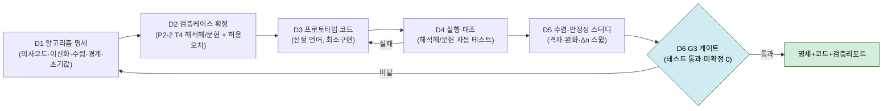
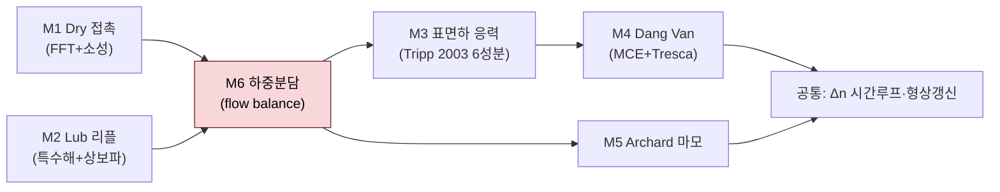
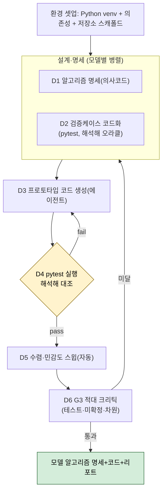

# 논문구현 P3 총괄계획 — 알고리즘 설계 + 검증

> **목적**: [[논문 구현 에이전트_v2_r1]] 파이프라인의 **P3(알고리즘 설계+검증)** 를 모델(M1~M6)별로 어떻게 설계·검증하고, 이를 **무인·병렬 하네스**로 어떻게 실행하며, **구현 언어**를 무엇으로 할지 총체적으로 계획한다.
> **선행 완료**: P1→G1→P2 전 6모델 통합 완료 — [[논문 구현_P2-3_알고리즘검토서_통합_M1-M6]](P3 직접 입력), [[논문 구현_P2-1_통합이론검토서_통합_M1-M6]], [[논문 구현_P2-2_검증데이터검토서_통합_M1-M6]], [[검토_큐_잔여_통합]], [[논문 구현_연구자검토큐_통합]](사인오프 Q2~Q9).
> **작성일**: 2026-07-09
> **게이트**: **G3** — 모듈 DAG 확정 · 각 모듈 단위테스트 명세 · **해석해·문헌 케이스 테스트 통과** · **미확정 알고리즘 0건**.

---

## 0. 한눈에 보기 (Executive Summary)

- **P3의 본질**: P1/P2(문서 추출·검토)와 달리 **실행 가능한 프로토타입 코드**를 만들어 **해석해·문헌 케이스로 실제 대조**하는 단계. 즉 "문서 검증"에서 "**실행 검증(run-verify)**"으로 성격이 바뀐다 → **런타임 환경 + 자동 테스트 루프**가 필수.
- **입력은 이미 확정적**: P2-3 통합 알고리즘 검토서 + 연구자 사인오프(Q2~Q9)로 **알고리즘 선택은 대부분 확정**(M4 임계면법=MCE+Tresca, M6 유막공식=[21]/Hamrock-Dowson, M5 u_s 환산 등). P3는 이를 **의사코드→코드→검증**으로 구체화한다.
- **언어 권고(조사 결과)**: **Python(NumPy/SciPy) 주력** — 도메인 오픈소스(**slippy**, **ContactMechanics**)가 M1(FFT 거친면 접촉)·M6(EHL 반해석) 구성요소를 이미 제공. 핫루프는 **Numba**로 가속. **MATLAB은 교차검증 레퍼런스**(ErikHansenGit/EHL). Julia는 성능 병목 시 옵션.
- **하네스**: 모델별 (설계 명세 → 검증케이스 확정 → 프로토타입 코드 → **자동 실행·해석해 대조** → 수렴·안정성 스터디 → G3 크리틱). 무인 실행하되 **수치 결과의 최종 판정은 실행 로그+연구자 확인**.
- **최우선 리스크 = M6**(잔여 큐 P1 4건 중 3건). M6 모듈을 별도 선행 게이트로.

---

## 1. P3 정의·입출력·게이트

| 항목 | 내용 |
|---|---|
| **목표** | 6개 하위모델의 알고리즘을 **이산화·수렴·경계·초기값**까지 확정하고, **프로토타입**으로 **해석해·문헌 케이스 대조**를 통과 |
| **입력** | P2-3 통합 알고리즘 검토서(확정안/후보/가정) · P2-2(검증 오라클 T4) · P2-1(변수사전·차원) · 사인오프(Q2~Q9) · 잔여큐(RQ-01~14) |
| **산출물** | ① 모델별 **알고리즘 명세서**(의사코드) ② **단위테스트 명세** ③ **프로토타입 코드** ④ **검증 리포트**(해석해·문헌 대조) ⑤ 수렴·안정성 스터디 ⑥ G3 통과 기록 |
| **게이트 G3** | 모듈 DAG 확정 · 단위테스트 명세 존재 · **해석해·문헌 케이스 테스트 통과** · **미확정 알고리즘 0건**(사인오프로 이미 확보) |
| **다음** | P4(모듈 구현+검증, G4=해석해/원논문 대조) |

---

## 2. P3 표준 프로세스 (모델 공통 6단계 D1~D6)

- **D1 명세**: P2-3 확정안을 의사코드로. 이산화 스킴, 수렴 판정(사인오프된 임계값), 경계·초기조건, 자료구조(격자 121², z 15층 등).
- **D2 검증케이스**: P2-2의 T4(해석해·문헌)를 그 모델의 **테스트 오라클**로 고정 + 허용오차(Q9 정본 범례).
- **D3 프로토타입**: 선정 언어로 **최소 기능** 구현(성능 최적화 전, 정확성 우선).
- **D4 실행·대조**: 자동 테스트로 해석해/문헌과 비교 → 통과까지 D3 루프(Ralph 루프).
- **D5 수렴·안정성**: 격자·완화계수·Δn 스윕으로 수치 견고성 확인(잔여큐 가정들의 민감도 동시 수행).
- **D6 G3**: 테스트 통과 + 미확정 0 → 게이트.

---

## 3. 모델별 알고리즘 설계·검증 상세

### 3.0 구현·검증 순서 (Dependency DAG)

> **착수 순서**: (M1, M2 병렬·독립) → **M6(★최우선)** → M3 → (M4, M5) → 공통 시간루프. **아래로 갈수록** 상위 모듈 출력에 의존하므로 **bottom-up 구현·검증**.

### 3.1 모델별 명세·검증·리스크 표

| 모델 | 핵심 알고리즘(사인오프 확정) | 이산화·수렴·경계 | 검증 오라클(D2) | 잔여 리스크(RQ) | 재사용 자산 |
|---|---|---|---|---|---|
| **M1 Dry** | FFT 탄성변위(식1) + Kalker 변분 반복 + 탄성-완전소성 절단($p_{lim}$=4.3GPa) | CG+FFT, error≤1e-3·반복≤30(Q8), 음압절단·주기경계 | **Hertz 매끈면**(p₀·접촉폭 ≤1%), 정현파 변위 | (해소) | **slippy / ContactMechanics**(FFT 반해석 접촉) |
| **M2 Lub** | 특수해(식5) + 상보파(식7·8, ψ 실/허부 반복) + Eyring 유효점도(식6) | 주파수영역, ψ 고정점 수렴 1e-5(Q8), 상보파 진폭 (31)뉴턴곡선 보간 | **GW1994 진폭감소비 $p_a/r_a$ vs $Q$** 곡선 정합 | — | Venner/Hooke 원식(내부구현) |
| **M3 응력** | **Tripp 2003 식[10]법선/[16]트랙션** 6응력 폐형식 + FFT 모드중첩 | FFT 정규화·부호 규약 고정(Q9), z=0~0.25a·15층 등비 | **정현파→식[12][13] 해석해**(≤2%), 최대전단 깊이 | RQ-09(원 PDF 대조·무해) | 자체(폐형식 직접) |
| **M4 피로** | **MCE + 대칭화 편차 Tresca 임계면법(Q3)** + Wöhler(A=−43,B=1220) + Miner | 임계면 탐색(구면격자/최소외접원), Miner 이산누적, N_ref=1e6(Q8) | **Milano 식(3)·A.8 닫힌해**·Desimone Fig3(≤1%) | — | 다축피로 표준 |
| **M5 마모** | Archard(식14·15), $k_{dry}=f_w k_{lub}$, 최고돌기부터 제거·양표면 절반 | **u_s→사이클당 거리=접촉폭/속도(Q5)**, k_lub 외삽 태깅 | Archard/Williams 단위·문헌 정성 | **RQ-02·03·07·08**(가정+민감도) | 자체 |
| **M6 하중분담 ★** | flow balance 반복(23), $h_{tran}$, **EHL 유막=[21] 채택(Q2)** | φ_bl 반복·완화 ω∈[0.3,0.7](Q8), flow tol 1e-3~1e-4(Q8), w(1,1)=0 DC 처리(Q8), $c_\rho$ | **하중보존**(dry+lub=총, ≤0.1%), (21) 대조 | **RQ-01(HD 계수 교과서)·04·05·06·12** | ErikHansenGit/EHL(MATLAB, 교차검증) |
| **공통** | Δn 시간루프, 형상·손상맵 갱신(d>1 피트) | Δn 스윕 수렴, 주기 거칠기, 좌표·단위 SSOT(Q9) | 원논문 Fig10/11 재현(P5로 이월) | — | — |

> **M6 집중 경고**: 잔여큐 P1 4건 중 3건(RQ-01 HD 계수·RQ-04/05/06 반복스킴·RQ-12 c_ρ 부호)이 M6. **M6를 D1~D6 선행 파일럿**으로 먼저 완주 후 나머지 확장 권고.

---

## 4. 구현 언어 조사·선정

### 4.1 워크로드 요구사항
FFT(2D, 반복 호출) · 커스텀 반복 솔버(CG+FFT, 고정점, flow balance) · 임계면 탐색(방향 최적화) · 대용량 배열(121²×15층×m시간×Δn) · 해석해 대조·플로팅 · **LLM 에이전트가 코딩·실행**하기 좋은 환경 · **재현성·배포**.

### 4.2 후보 비교 (조사 반영)

| 기준 | Python (NumPy/SciPy) | MATLAB | Julia |
|---|---|---|---|
| FFT 성능 | 상 (pocketfft/pyFFTW) | 상 (FFTW) | 상 (FFTW.jl) |
| 커스텀 반복루프 | 하(순수) → **상(Numba/Cython)** | 중(벡터화 필요) | **최상**(JIT) |
| **도메인 라이브러리** | **최상 — slippy, ContactMechanics(FFT 접촉/EHL)** | 중 — ErikHansenGit/EHL 등 산발 | 하 |
| 검증·플로팅·생태계 | 최상(pytest·matplotlib·scipy) | 상 | 중 |
| **재현성·무료·배포** | **최상(오픈소스)** | 하(유료 라이선스) | 상 |
| 팀 친숙도(KIMM 기계) | 중상 | **상**(관행) | 하 |
| **LLM 에이전트 코딩 적합성** | **최상**(학습데이터·툴·실행) | 중 | 중 |
| 원저자군 관행 | — | 상(EHL 학계 MATLAB 다수) | — |

### 4.3 재사용 오픈소스 자산 (P3/P4 레버리지)
- **[slippy](https://github.com/FrictionTribologyEnigma/slippy)** (Python) — 마찰·윤활·접촉 모델, FFT 기반, GPU 지원 → **M1(거친면 FFT 접촉)·M6(혼합윤활)** 구성요소·검증 레퍼런스.
- **[ContactMechanics](https://github.com/ContactEngineering/ContactMechanics)** (Python) — 탄성 반공간 FFT, 비주기 decoupling → **M1** 변위/압력 커널 검증.
- **[ErikHansenGit/EHL](https://github.com/ErikHansenGit/EHL)** (MATLAB) — FV Reynolds+BEM 반공간, mass-conserving cavitation, Dowson-Higginson, load-balance → **M2·M6 교차검증 레퍼런스**.

### 4.4 권고
**주력 = Python(NumPy/SciPy) + Numba(핫루프)**. 근거: (1) 도메인 라이브러리(slippy·ContactMechanics)로 M1/M6 **가속·검증 레버리지**, (2) **무료·재현성**(GitHub 배포·타 PC clone 이슈 최소), (3) **LLM 무인 하네스에 최적**(에이전트가 pytest로 실행·해석해 대조 자동화 용이), (4) FFT는 어차피 C 백엔드라 성능 충분. **MATLAB은 교차검증 레퍼런스**(ErikHansenGit/EHL)로 병용, 팀 친숙도 자산 활용. **Julia는 M4 임계면 탐색·시간루프가 순수 Python에서 병목이면 부분 이식** 옵션.
> ⚠️ Anthropic 장기실행 과학계산 사례도 Python 기반(§P0~P2 방법론과 일관). 최종 확정은 연구자 승인.

---

## 5. P3 무인·병렬 하네스 설계

### 5.1 P1/P2 하네스와의 차이
- **실행 가능 코드 + 런타임 필요** → 에이전트가 **코드를 쓰고 pytest로 실행**해 해석해와 대조하는 **run-verify 루프**.
- 환경: **Python venv**(numpy·scipy·numba·matplotlib·pytest, 선택 slippy). 산출은 `구현/` 하위 코드트리 + 테스트.

### 5.2 파이프라인 (모델별)

### 5.3 무인 기법 (P1/P2 계승 + 실행 추가)
| 기법 | 적용 |
|---|---|
| 구조화 명세 스키마 | D1 의사코드·D2 테스트명세를 스키마로 |
| **run-verify 루프(Ralph)** | pytest 통과까지 코드 재생성(최대 N회) |
| **해석해 오라클 테스트** | Hertz·정현파·GW1994·Milano 닫힌해를 pytest assert |
| 수렴·민감도 자동 스윕 | 격자·완화·Δn·k_lub 하한 파라미터 스캔 |
| 적대적 G3 크리틱 | 테스트 커버리지·차원·미확정·경계조건 반증 |
| 체크포인트/CHANGELOG | 시도·실패 알고리즘 기록, git 커밋 |
| **연구자 게이트** | 수치 판정·M6 P1 4건은 실행 로그+연구자 확인 |

### 5.4 실행 전략
1. **M6 파일럿 먼저**(D1~D6 완주) — 최대 리스크 검증 → 하네스·환경 검증.
2. 성공 시 **M1·M2·M3·M4·M5 확장**(병렬).
3. 통합 시간루프는 P4~P5로 이월(전 모듈 G3 후).

---

## 6. G3 게이트 체크리스트

- ☐ 모델별 **알고리즘 명세서(의사코드)** 완결 — 이산화·수렴·경계·초기값
- ☐ **단위테스트 명세** 존재 + 해석해/문헌 오라클 코드화(P2-2 T4)
- ☐ **프로토타입이 해석해·문헌 케이스 테스트 통과**(허용오차 내)
- ☐ **미확정 알고리즘 0건**(사인오프 Q2~Q9 반영, 잔여 가정은 태깅+민감도)
- ☐ 수렴·안정성 스터디(민감도 포함) 기록
- ☐ 변수 SSOT(E′ 2배·α 삼중분리 등 Q9) 코드 규약 준수
- ☐ M6 P1 4건(RQ-01·04·05·06·12) 처리·문서화

---

## 7. 리스크·일정·다음 단계

| 리스크 | 완화 |
|---|---|
| M6 유막공식 계수·부호·반복스킴(P1 3건) | M6 선행 파일럿 + 교과서(Hamrock) 보강 + 민감도 |
| 순수 Python 반복루프 성능 | Numba/벡터화, 필요시 Julia 부분이식 |
| 해석해 오라클 부재 영역(M5) | 문헌 정성 + 보존검사 대체, 가정 태깅 |
| 무인 코드의 미묘한 수치버그 | 해석해 pytest + 적대 크리틱 + 연구자 로그 확인 |

**다음 단계 순서**
1. **구현 언어 확정**(권고 Python) — 연구자 승인.
2. **환경 셋업**(venv + 의존성, 저장소 스캐폴드 `구현/`).
3. **M6 P3 파일럿**(D1~D6) 무인 실행 → 검토.
4. 성공 시 M1·M2·M3·M4·M5 병렬 확장 → 전 모델 G3.
5. → **P4(모듈 구현+검증)** 착수.

---

**참고 (조사 출처)**
- slippy (Python 트라이볼로지) — <https://github.com/FrictionTribologyEnigma/slippy> · <https://friction.org.uk/slippy-software/>
- ContactMechanics (탄성 반공간 FFT) — <https://github.com/ContactEngineering/ContactMechanics>
- ErikHansenGit/EHL (MATLAB EHL FV+BEM) — <https://github.com/ErikHansenGit/EHL>
- Rough surface contact 리뷰 — <https://www.intechopen.com/chapters/80560>

---

**끝**
