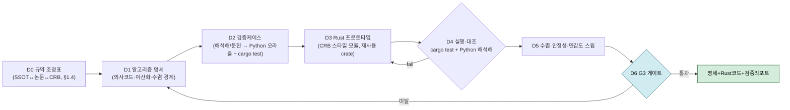
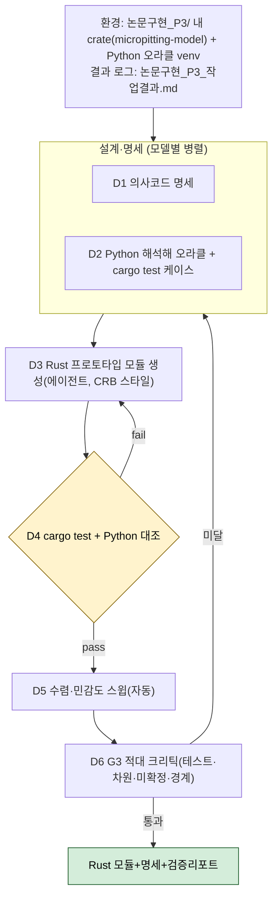
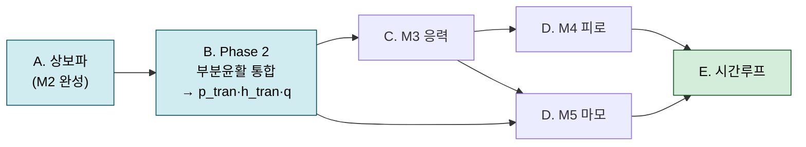

# 논문구현 P3 총괄계획 — 알고리즘 설계+검증 (CRB-main/Tauri 통합 반영)

> **목적**: P3(알고리즘 설계+검증)를 모델(M1~M6)별로 어떻게 설계·검증하고, **무인 하네스**로 어떻게 실행하며, **구현 언어**를 무엇으로 할지 계획한다. **핵심 제약: 개발 코드는 최종적으로 [CRB-main](../../CRB-main)(Tauri 2 + 네이티브 Rust) SW에 통합**한다.
> **선행**: P1→G1→P2 전 6모델 통합 완료 — [[논문 구현_P2-3_알고리즘검토서_통합_M1-M6]](P3 입력)·[[검토_큐_잔여_통합]]·[[논문 구현_연구자검토큐_통합]](사인오프 Q2~Q9).
> **작성일**: 2026-07-09 · **개정**: v2(CRB-main 분석 → 언어 Python→Rust 전환) · **v3(SSOT 전략 B·참조-재구현·규약 조정표 §1.4 반영)**
> **게이트 G3**: 모듈 DAG 확정 · 단위테스트 명세 · 해석해·문헌 케이스 테스트 통과 · 미확정 알고리즘 0건.
> **확정(2026-07-09)**: 개발 접근 = **별도 Rust crate `micropitting-model` → CRB-main `solver/`로 이식**; **참조-재구현 + 경계 어댑터**, 코드 SSOT = **(B) 표준/CRB 정렬**(규약 조정표 §1.4). **위치** = `논문 취합/03. 정리/논문구현_P3/`, **결과 로그** = `논문구현_P3_작업결과.md`. **CRB 재사용은 5개 한정**(§1.3). **M6 파일럿 보류**(계획 검토 후).

---

## 0. 한눈에 보기 (Executive Summary)

- **통합 대상 파악**: CRB-main은 **Tauri 2 + 네이티브 Rust** 원통롤러베어링 접촉해석 데스크톱 앱. 백엔드가 이미 **`rustfft`·`nalgebra`·`sprs`·`rayon`** 를 쓰고, **EHL 유막(`lubrication.rs` 8,441 LOC)·Hertz(`hertz.rs`)·혼합EHL(`hmehl.rs`)·수명(`life.rs`)·기존 마이크로피팅 안전율(Λ-비 분류기)** 까지 보유. 모든 수치는 **인프로세스 Rust**(사이드카/WASM 없음), `#[tauri::command]` 로 프런트(React/TS+Plotly)에 노출.
- **언어 결정 전환**: 통합 제약 때문에 **주력 언어 = Rust(네이티브, CRB-main 통합)**. Python은 **오프라인 검증 오라클**로만(CRB-main이 이미 쓰는 `python-prototype/` 관행과 동일). → 이전 "Python 주력"안은 **포팅 비용·이중구현 리스크**로 폐기.
- **재사용 방침 = 참조-재구현**(직접 의존 X): CRB-main 코드는 **알고리즘·계수 참조**로 읽고 **우리 코드 SSOT로 신규 구현**, 통합은 **경계 어댑터 1겹**. **재사용은 5개로 한정**(§1.3): Dowson-Toyoda 유막식(**열/기아 보정 제외**)·`hertz.rs`·`rustfft`·`nalgebra`·`rayon` → **RQ-01 이득 유지 + 규약 결합 차단**.
- **SSOT 전략 = (B) 표준/CRB 정렬**: 코드 규약을 **SI · 표준 환산탄성계수 E_red · 표준 부호**로 통일. 논문 특이규약(E′ 2배 등)은 **식 전사 시 1회 변환**(규약 조정표, §1.4)으로만 처리 → **E′ ×2 지뢰 원천 제거**, CRB 경계 최소화, Q9(계수 혼동 방지) 의도 더 충실.
- **우리 모델의 위치**: 기존 Λ-비 마이크로피팅 안전율을 **보완/고도화**하는 **상세 물리기반 모듈**(표면피로↔마모 경쟁, Dang Van, FFT 응력) — `src-tauri/src/solver/`에 신규 모듈로 추가.
- **하네스**: 에이전트가 **Rust 모듈 + Python 해석해 오라클**을 작성 → **`cargo test`(단위) + Python 대조(해석해)** 자동 실행 → 통과까지 루프. **부분윤활 서브시스템 M1+M2+M6 동시**(Phase 0 공유기반 동결 → 병렬 3 → 통합, §5.4).

---

## 1. CRB-main 통합 분석 (핵심)

### 1.1 아키텍처
| 계층 | 스택 |
|---|---|
| 백엔드(수치) | **Rust**, crate `crb-contact-analysis`(lib `app_lib`), Tauri **2.10** · `nalgebra 0.33`·`sprs 0.11`·**`rustfft 6`**·`rayon`·`rand` |
| 프런트 | React 19 + TypeScript + Vite · 3D `three/r3f` · 차트 **Plotly** · Tailwind |
| 통신 | `#[tauri::command]` 핸들러(`commands.rs`·`presets.rs`, `lib.rs`에 `generate_handler!`) ↔ 프런트 `invoke()` |
| 계산 방식 | **인프로세스 네이티브 Rust** (사이드카/외부바이너리/WASM 없음) |
| 검증 관행 | `python-prototype/`(van Zoelen 유막 오프라인 검증) — **런타임 아님, 오프라인 오라클** |

### 1.2 통합 지점 (신규 모듈 추가 절차)
1. `src-tauri/src/solver/<micropitting_fatigue>.rs` 생성 → `solver/mod.rs`에 `pub mod` 등록.
2. 결과 구조체를 `solver/types.rs`에 추가(serde 직렬화 → 프런트).
3. `commands.rs`에 `#[tauri::command]` 래퍼 + `lib.rs` 핸들러 목록 등록.
4. `src/types/`에 TS 타입 미러 + `src/components/`에 뷰 + `store.ts` `invoke()` 배선.

### 1.3 CRB-main 재사용 — **딱 5개로 한정**

> 아래 5개만 재사용하고, 그 외 CRB 코드(Λ·거칠기·`hmehl`·`life`·NVM·열/기아 보정 등)는 **참조도 하지 않는다**.

| # | 재사용 대상 | 형태 | 용도 |
|---|---|---|---|
| 1 | **Dowson-Toyoda(1978) 중앙유막식** — `compute_film_thickness` 내 `h_c=3.06·U^0.69·G^0.56·W^−0.10`(×R_eq). **열/기아 보정 φ_t·φ_s 제외**(등온·완전침수) | 알고리즘·계수 **참조 → SSOT 재구현** | **M6 h̄ / RQ-01 해소** |
| 2 | **`hertz.rs`** (Hertz 선접촉) | 알고리즘 **참조 → 재구현** | M1 해석해 오라클·접촉폭 |
| 3 | **`rustfft`** | crate **직접 사용** | M1·M2·M3 FFT |
| 4 | **`nalgebra`** | crate **직접 사용** | 변분·밀집 선형대수 |
| 5 | **`rayon`** | crate **직접 사용** | 시간루프·임계면 병렬 |

> **결론**: CRB에서 취하는 것은 **위 5개뿐**. **나머지 전부 신규 구현** — M1 부분윤활 압력(FFT+소성)·M2 상보파·M3 표면하 응력(Tripp)·M4 Dang Van·M5 Archard 경쟁·M6 하중분담 반복·시간루프·**입력 구성까지 자체**.

---

### 1.4 규약 조정 (SSOT Boundary Map) — 전략 B ★

우리 P2 SSOT와 CRB-main·논문 규약은 **의미 경계**에서 충돌한다(컴파일되나 물리가 틀림). **전략 (B) 표준/CRB 정렬 SSOT** 채택: 코드는 표준 규약, 논문 특이규약은 1회 변환.

| 양 | 논문(P2) 규약 | CRB-main 규약 | **채택 코드 SSOT (B)** |
|---|---|---|---|
| 환산탄성계수 | E′ 2배(`2/E'=…`, E*=E'/2) | 표준 E_red(Dowson 파라미터) | **표준 E_red** (논문식은 E′=2·E_red로 1회 치환) |
| 단위 | 혼재(µm·GPa 표기 존재) | µm(`h_*_um`)·GPa | **SI(m·Pa) 내부**, 경계에서만 변환 |
| α 기호 | 삼중(파수/DV/점도) | 자체 | **`alpha_wave`/`alpha_dv`/`alpha_visc` 분리(Q9)** |
| 응력 부호 | MAIN 인장+ / SRC16 압축− | `hertz.rs` 자체 | **표준 부호 1개 고정**(내부일관+von Mises 불변으로 검증) |
| 좌표/형상 | 접촉패치·x=구름·주기 | 베어링 5-DOF·슬라이스 | **접촉패치 로컬 프레임**(경계에서 CRB 프레임 매핑) |

- **첫 산출물(D0, 선행 필수)**: **규약 조정표** = `코드 SSOT ↔ 논문규약 ↔ CRB규약` 완전 매핑. 각 식에 "논문형→표준형" 변환 명기 → **프로토타입 구현 스펙 + P4 어댑터 스펙 겸용**.
- **참조-재구현**: CRB **Dowson-Toyoda 유막식(보정제외)**·`hertz.rs`를 **읽어 알고리즘·계수만 추출**, 프로토타입 crate엔 **코드 SSOT로 신규 구현**(CRB 의존성 X). crate `rustfft`·`nalgebra`·`rayon`만 직접 의존.
- **P4 통합 = 어댑터 1겹**: `#[tauri::command]` 경계에서 코드 SSOT ↔ CRB 타입·단위 변환. **중복 물리(유막 등) 소유권**은 P4에서 택1(어댑터 호출 vs 자체 보유) — 발산 방지.
- **추적성 유지**: 논문 원식·부호는 규약 조정표의 '변환' 열로 보존(코드엔 표준형만).

---

## 2. 구현 언어 선정 (조사 반영)

### 2.1 결정 인자 (통합 제약이 최상위 가중)
Tauri 네이티브 통합 · CRB-main 기존 crate/도메인코드 재사용 · 단일바이너리 배포·재현성 · FFT/선형대수/병렬 성능 · LLM 에이전트 코딩·검증 자동화.

### 2.2 옵션 비교
| 옵션 | 통합 | 재사용 | 성능 | 개발속도(LLM) | 판정 |
|---|---|---|---|---|---|
| **A. Rust 직접(권장)** | **무비용(네이티브)** | **최대(rustfft·nalgebra·hertz·lubrication)** | 최상(대규모서 native≫) | 중(Rust 수치, 에이전트 가능) | **채택** |
| B. Python 개발→Rust 포팅 | 지연(포팅) | 중 | 최종 상 | 상(프로토타입 빠름) | 이중구현·버그갭 → 비채택 |
| C. Python 사이드카 상주 | **불일치**(런타임의존·IPC·배포↑) | 하 | 중(IPC 오버헤드) | 상 | CRB 관행 위배 → 비채택 |

- Rust 수치 생태계(조사): `rustfft`·`nalgebra`·`rayon` 충분히 성숙(단 crate 간 조합성 한계는 유의). Tauri에서 **네이티브 Rust가 대규모 계산에 사이드카 대비 우월**(성능·배포).

### 2.3 권고
**Rust 주력(네이티브, CRB-main 통합) + Python 오프라인 검증 오라클**(CRB `python-prototype/` 관행 계승). 해석해(Hertz·정현파·GW1994·Milano 닫힌해)를 Python으로 독립 계산해 Rust 결과와 대조. 초기 알고리즘 탐색이 막히면 Python **스파이크(1회성) 후 즉시 Rust 이식**(상주 금지).
> ⚠️ 최종 확정은 연구자 승인. Rust 직접 vs Python-스파이크-우선은 §7 확정사항.

---

## 3. P3 표준 프로세스 (모델 공통 D1~D6)

- **D0(선행 필수)**: **규약 조정표**(§1.4) 확정 — 코드 SSOT(전략 B) ↔ 논문 ↔ CRB. 이후 D1~D6.
- **D3**: **우리 코드 SSOT로 신규** Rust 모듈(CRB `solver/` 스타일·serde·`Result<_,String>`); CRB는 **알고리즘·계수 참조**(직접 의존 X).
- **D4**: `cargo test` 단위(해석해 assert) + Python 오라클로 수치 대조(허용오차 Q9 정본).

---

## 4. 모델별 알고리즘 설계·검증 상세

### 4.0 구현 순서(DAG) — bottom-up
(M1, M2 병렬) → **M6(★)** → M3 → (M4, M5) → 공통 시간루프. M6가 최우선(잔여 P1 집중 + 재사용 이득 큼).

### 4.1 상세 표
| 모델 | 확정 알고리즘(사인오프) | 검증 오라클(D2) | 잔여 리스크(RQ) | CRB-main 참조(재구현) |
|---|---|---|---|---|
| **M1 Dry** | FFT 변위(식1)+Kalker 변분+소성절단 $p_{lim}$=4.3GPa; error≤1e-3·반복≤30 | **Hertz**(`hertz.rs`, ≤1%)·정현파 변위 | (해소) | `rustfft`·`nalgebra`·`hertz.rs` |
| **M2 Lub** | 특수해(식5)+상보파(식7·8, ψ 실/허부 반복 1e-5)+Eyring(식6) | **GW1994 $p_a/r_a$ vs $Q$** 곡선 | — | `rustfft` |
| **M3 응력** | **Tripp 2003 식[10]/[16]** 6응력+FFT 모드중첩; z 0~0.25a·15층 | **정현파→식[12][13]** 해석해(≤2%) | RQ-09(무해) | `rustfft` |
| **M4 피로** | **MCE+대칭화 편차 Tresca(Q3)**+Wöhler(A=−43,B=1220)+Miner; N_ref=1e6 | **Milano 식(3)·A.8**·Desimone(≤1%) | — | `rayon`(임계면 병렬) |
| **M5 마모** | Archard(식14·15); **u_s→접촉폭/속도(Q5)**; k_lub 외삽 태깅 | Archard/Williams 단위·정성 | **RQ-02·03·07·08**(가정+민감도) | — |
| **M6 하중분담 ★** | flow balance 반복(23)+$h_{tran}$; **유막=Dowson-Toyoda h_c(보정제외)(Q2)**; φ_bl 완화 ω∈[.3,.7]·flow tol 1e-3~1e-4·w(1,1)=0 | **하중보존**(≤0.1%)·(21) 대조 | **RQ-01 해소**·04·05·06·12 | **Dowson-Toyoda h_c(참조)**·`rustfft` |
| **공통** | Δn 시간루프·형상갱신(d>1 피트); 좌표·단위 SSOT(Q9, 전략 B 표준규약) | 원논문 Fig10/11(P5 이월) | — | `rayon` |

> **M6 재평가**: RQ-01(유막공식)이 CRB **Dowson-Toyoda(보정제외)** 참조로 해소 → M6 P1 리스크가 4건→3건(RQ-04/05/06 반복스킴·RQ-12 c_ρ 부호)으로 감소. 그래도 반복스킴·부호는 신규라 **M6는 Phase 1 mock 검증 + Phase 2 실결선**으로 다룸(부분윤활 묶음).

---

## 5. P3 무인·병렬 하네스 (Rust 대상)

### 5.1 P1/P2와의 차이
**실행 가능한 Rust 코드 + 런타임** 필요 → 에이전트가 코드 작성 후 **`cargo build`/`cargo test` 실행**해 해석해와 대조하는 **run-verify 루프**. 환경: **Rust toolchain(CRB-main에 이미 구성)** + Python venv(오라클: numpy/scipy·해석해).

### 5.2 파이프라인

### 5.3 무인 기법
구조화 명세 스키마 · **run-verify(Ralph): cargo test 통과까지 재생성** · 해석해 pytest/Rust assert 오라클 · 수렴·민감도 자동 스윕 · 적대 G3 크리틱 · CHANGELOG/git 커밋 · **연구자 게이트(수치판정·M6)** · Rust LLM 코딩 유의(타입·차용검사 오류는 크리틱+빌드로 조기 검출).

### 5.4 실행 전략 — 부분윤활 서브시스템(M1+M2+M6) 우선, 3-Phase

M1(dry)+M2(lub)+M6(하중분담) = **부분윤활 서브시스템**(p_tran·h_tran 산출). M6는 M1·M2의 소비자이므로 병렬화의 전제는 **Phase 0 동결**.

- **Phase 0 (공유 기반, 선행·단일)**: D0 규약조정표 + crate 스캐폴드(Cargo.toml·lib.rs) + **`types.rs` SSOT·인터페이스 계약(M1→M6, M2→M6)** + 공용 유틸(FFT 래퍼·Hertz·Dowson-Toyoda h_c 재구현) + Python 오라클 venv + `논문구현_P3_작업결과.md`. **인터페이스·규약 동결**로 병렬 안전 확보.
- **Phase 1 (병렬 3, 모듈 소유권)**: M1 `m1_dry.rs`(Hertz 테스트) · M2 `m2_lub.rs`(GW1994 테스트) · M6 `m6_share.rs`(하중보존, **mock M1/M2 입력**). 각자 모듈+`tests/`만, 공유파일 불변.
- **Phase 2 (통합)**: `cargo build/test` 전체 + 적대 G3 크리틱 + **M1+M2→M6 실결선 스모크** → 부분윤활 서브시스템 G3.
- 이후 **M3·M4·M5 확장**, 통합 시간루프·원논문 재현은 P4~P5 이월.

---

## 6. G3 게이트 체크리스트
- ☐ 모델별 **알고리즘 명세서(의사코드)** 완결(이산화·수렴·경계·초기값)
- ☐ **단위테스트 명세**(cargo test) + **Python 해석해 오라클** 존재·코드화
- ☐ **Rust 프로토타입이 해석해·문헌 케이스 통과**(허용오차 내)
- ☐ **미확정 알고리즘 0건**(사인오프 반영; 잔여 가정은 태깅+민감도)
- ☐ 수렴·안정성·민감도 스터디 기록
- ☐ 변수 SSOT(E′ 2배·α 삼중분리 등 Q9) Rust 상수/타입 규약 준수
- ☐ **CRB-main 통합 인터페이스**(신규 solver 모듈·types·command 시그니처) 초안 확정
- ☐ M6 잔여(RQ-04·05·06·12) 처리·문서화

---

## 7. 리스크·확정사항·다음 단계

### 7.1 리스크
| 리스크 | 완화 |
|---|---|
| Rust 수치 코드 LLM 생산성/미묘 버그 | 해석해 cargo test + Python 대조 + 적대 크리틱 + 빌드검증 |
| M6 반복스킴·c_ρ 부호(RQ-04/05/06/12) | M6 선행 파일럿 + 민감도 + CRB 유막 재사용 |
| crate 조합성 한계(rustfft/nalgebra) | 얇은 어댑터·자체 커널, 필요시 특화 구현 |
| CRB-main 기존 코드와 규약 충돌(단위·좌표) | types.rs·기존 API 준수, SSOT 매핑표 선작성 |

### 7.2 확정 사항 (2026-07-09)
1. **개발 위치**: ✅ 별도 Rust crate `micropitting-model` — **`논문 취합/03. 정리/논문구현_P3/`** 폴더 내 생성. 검증 후 CRB-main `solver/`로 이식(통합 리스크는 P4로 이연).
   - **결과 기록**: P3 산출·진행을 **`논문구현_P3_작업결과.md`**(P3 폴더 내)에 정리.
2. **언어**: ✅ Rust(프로토타입 crate) + Python 오프라인 오라클. 동일 Rust 생태계라 CRB-main 이식 저비용.
3. **재사용 방침**: ✅ **참조-재구현** — CRB 코드는 알고리즘·계수 참조로만 읽고 **우리 코드 SSOT로 신규 구현**(직접 의존 X); 통합은 **경계 어댑터 1겹**(§1.4). RQ-01(유막계수)은 참조로 이득 유지.
4. **SSOT 전략**: ✅ **(B) 표준/CRB 정렬** — 코드는 **SI·표준 E_red·표준 부호**; 논문 특이규약(E′ 2배 등)은 **규약 조정표(D0, §1.4)** 로 1회 변환 → **E′ ×2 지뢰 제거**, 경계 최소화.
5. **착수 범위**: ✅ **부분윤활 서브시스템(M1+M2+M6) 동시**(3-Phase, §5.4). 잔여 큐([[검토_큐_잔여_통합]]) 추천안 확정 반영.

### 7.3 다음 단계
1. ✅ (연구자) **계획·잔여큐 확정** → 2. **Phase 0**: `논문 취합/03. 정리/논문구현_P3/`에 crate `micropitting-model` 스캐폴드 + **D0 규약조정표** + 공유 `types.rs`/유틸(FFT·Hertz·Dowson-Toyoda) + Python 오라클 venv + `논문구현_P3_작업결과.md` → 3. **Phase 1**: M1·M2·M6 병렬 무인(모듈+해석해 테스트) → 4. **Phase 2**: 통합·`cargo test`·M1+M2→M6 스모크 → 부분윤활 서브시스템 G3 → 5. **M3·M4·M5 확장** → 전 모델 G3 → **P4(CRB-main 이식)**.

---

**참고 (조사 출처)**
- CRB-main 아키텍처 — 로컬 `d:\AI\AI_Seminar\CRB-main` (Tauri2+Rust, `src-tauri/src/solver/*`, `lubrication.rs` NVM/Dowson-Toyoda 유막)
- Rust 수치 생태계 — <https://www.arewelearningyet.com/scientific-computing/> · <https://scientificcomputing.rs/monthly/2025-10>
- Tauri 네이티브 vs 사이드카 — <https://evilmartians.com/chronicles/making-desktop-apps-with-revved-up-potential-rust-tauri-sidecar> · <https://rustify.rs/articles/rust-tauri-vs-electron-2026>
- 도메인 참고(교차검증): slippy <https://github.com/FrictionTribologyEnigma/slippy> · ContactMechanics <https://github.com/ContactEngineering/ContactMechanics> · ErikHansenGit/EHL(MATLAB) <https://github.com/ErikHansenGit/EHL>

---

## 8. 후속 확장 계획 — 상보파(M2 완성) → Phase 2(부분윤활 통합)

> **선행 검토 확정(2026-07-13)**: M3/M4/M5는 **Phase 2 출력 `p_tran` 이 입력**이고(§4.0 DAG: (M1,M2)→M6→M3), Phase 2는 **완성된 M2(상보파 포함)** 를 필요로 한다. 따라서 즉시 착수 순서는 **A. 상보파 → B. Phase 2 통합**, M3/M4/M5·시간루프는 B 완료 후. 본 계획은 [[논문구현_P3_작업결과]]에서 검증된 방법론(독립오라클·변이게이트·적대 재크리틱·근거기반)과 현 코드 상태를 근거로 수립.

### 8.0 순서·의존 요약

| 단계 | 내용 | 의존 | 게이트 |
|---|---|---|---|
| **A. 상보파** | M2 완성(식[7][8] 2성분해) | M2(특수해·Roelands·RQ-vel 완료) | G3(M2 상보파) |
| **B. Phase 2 통합** | M1+M2+M6 완전결합 solver → `p_tran`/`h_tran`/`q` | **A 필요** | 부분윤활 서브시스템 G |
| (후속) C. M3 | Tripp 6응력, `p_tran` 입력 | **B 필요** | — |
| (후속) D. M4·M5 | Dang Van / Archard | C(M4)·B(M5) | — |
| (후속) E. 시간루프 | 마모→형상갱신 재현(Fig10/11) | C·D | G5 |

---

## 8.A 상보파(complementary wave) 구현 — M2 완성

### 8.A.1 목표·근거 — 왜 상보파가 필요한가

- **진폭감소는 2성분해다(GW1994 = ref (29)).** 접촉 중앙 선형 Reynolds 식[2]의 해 = **특수해(particular, 표면2 거칠기와 함께 $u_2$ 이동) + 상보파(complementary, 입구 생성·$\bar u$ 전파·비뉴턴 감쇠, 식[7][8] = ref (28))**. 현 `m2_lub.rs`는 `solve_full_film`이 특수해 리플만 합성(`p_spec = pt·s`)하고 상보파를 **미구현**.
- **순수 rolling에서 특수해는 0이다(RQ-vel, 작업결과 ⅴ).** `u_conv=(u₂−ū)=−Δu/2` 이므로 $u_2\to\bar u$(SRR→0)에서 `amplitude_q`→0. 물리적으로 순수 rolling에서도 리플은 존재하며 이를 **상보파가 담당**한다.
- **정량 재현 요구(VC-M2-Spot).** GW1994 Table1 스팟값(50℃ P₁=0.388/h₁=0.0331, 80℃ 0.413/0.0185; P2-2 §2.2)은 **2성분해라야 정량 재현**. 현 특수해 단독 닫힌형은 함수형만 커버(작업결과 ⓒ: VC-M2-Spot ⬜ 후속)라 이 정량 오라클 통과 불가.
- **범위**: SSOT 전략 B(E_red·SI·`E'=2·E_red` 1회 치환) 유지, 저진폭 미세형상 유효범위 전제.

### 8.A.2 알고리즘 — 상보파 2성분 합성

1. **분산관계 `dispersion_psi`(신규)** — 식[8](ref (28))의 상보파 파수 $\psi=\omega_{x'}+i\beta$ 를 모드별로, **실부/허부 교대 대입**으로 수렴(§4.1 "ψ 실/허부 반복 1e-5"). $\omega_{x'}$=전파방향 파수, $\beta$=비뉴턴 감쇠율.
2. **비뉴턴 감쇠** — $\beta$ 는 식[6] Eyring 방향점도(ref (30); 기존 `eyring_eff_visc`·`directional_visc` 재사용)로 결정. **상보파 대류속도는 $\bar u$=`op.u_mean`**(특수해 `(u₂−ū)` 와 분리 — 두 성분의 대류속도 분리가 핵심).
3. **상보파 진폭 `complementary_wave`(신규)** — $\delta h_c,\delta p_c$ 는 입구 생성. 진폭은 **식(28) 보간 대신 (21) 수정법 = (31) 뉴턴 진폭감소 곡선 기반 보간**. 입구 생성분이 접촉 통과하며 $\beta$ 감쇠.
4. **2성분 합성** — `solve_full_film` 모드 루프: `p_spec = (p_part + p_comp)·s`, `h_spec = (h_part + h_comp)·s`. 탄성결합·`E'=2·E_red`·Nyquist 실수투영은 두 성분 모두 적용.
5. **연속성** — 순수 rolling에서 특수해→0 이어도 상보파 항 non-zero 유지 → 총 진폭감소비가 GW1994 곡선(VC-M2-AR) 재현.

### 8.A.3 검증 오라클 (독립·실패가능·비-tautology; 작업결과 패턴 재사용)

- **(a) VC-M2-AR 닫힌형(정성+정량)** — GW1994 식(15)(16)(17) 리플비 vs $\lambda/\bar h$ 곡선. 2성분 총진폭감소비 독립 닫힌형 대조(기존 `pressure_amplitude_reduction_closed_form` 확장). 단파장→지속·장파장→평탄화 + RMS편차.
- **(b) VC-M2-Spot GW1994 Table1 정량(치명·신규)** — 50℃ P₁=0.388/h₁=0.0331, 80℃ 0.413/0.0185 **하드코딩 오라클**(허용 GJ±5%/Kweh·Chang±15~18%/h₁±10~20%). **상보파 포함이라야 재현** → 특수해 단독이면 FAIL(구조적 검출력).
- **(c) 순수 rolling 리플 non-zero** — `slide_roll→0` 에서 특수해 Q→0 이나 총 리플 진폭>0 강제(상보파 담당 직접 검증).
- **(d) VC-M2-Master 보조** — Venner2000 식(29) 마스터커브 예제 `A_d=4.136e-3=0.739A_i` 1점 대조.
- **(e) 변이게이트** — β 부호 반전 / 상보파 진폭계수 주입 → (b)(c) 오라클 FAIL(CAUGHT) 후 즉시 원복(작업결과 ⓔ 3/3 패턴).
- **(f) 적대 재크리틱** — tautology_remaining=false·arbitrary_coeffs_remaining=false·grounding_ok=true.

### 8.A.4 코드 변경 지점

- **`solve_full_film`** — 모드 루프 2성분화: `p_part`(기존 `pressure_ripple_transfer`) + `p_comp`(신규) 합산. `u_conv`(특수해)와 별도로 상보파 대류속도 `u_mean(=ū)` 결선.
- **신규 함수** — `dispersion_psi(...)->Complex`(ψ, 실/허부 교대 반복), `complementary_wave(...)->(Complex,Complex)`, (31) 보간표 함수(`newton_reduction_interp`). 전부 `pub`(단위 오라클 재사용).
- **결과 구조체** — `LubResult{p_lub,h_lub}`(types.rs 동결) 시그니처 유지. 진단 필요 시 M2 내부 `ComplementaryTrace`(특수해/상보파 분리 진폭)만 추가(공유 types.rs 무수정 원칙).
- **C≠0(RQ-2) 연동** — 현 `c_comp=0.0`(비압축 극한). 상보파 압축성(식[4] `C=h·E'·κ/(4B)`)을 특수해와 동일 경로로, 정밀 B(p)는 잔여큐 분리. `compressibility_c_sensitivity` 재사용해 두 성분 C-스윕 유계.

### 8.A.5 잔여 가정·RQ (전부 식/ref/RQ 체인; 자의적 계수 금지 — 미제공은 '가정+민감도')

- **RQ-M2-comp1: (31) 상보파 진폭 보간표 수치** — Venner–Lubrecht 뉴턴 진폭감소 곡선 디지타이즈 수치 논문 미제공(**G-M2-1**). ref (31) 식(29)/곡선에서 추출, 미확보분 가정+민감도(보간표 ±오차 스윕).
- **RQ-M2-comp2: β 초기추정·수렴** — 식[8] 실/허부 교대 초기값·tol(1e-5) 미제공(**G-M2-2**). ref (28) 근거, 초기추정 가정+민감도.
- **RQ-M2-comp3: cavitation 오차** — 상보파 통과 시 음압 절단 오차범위 미제공(**G-M2-3**). ref (21) 근거, 오차범위 태깅.
- **RQ-2(연동): 압축성 C≠0·B(p)** — 식[4] 소급. 상보파 Phase에서 도입, `compressibility_c_sensitivity` 유계화.

### 8.A.6 G3 게이트 + 리스크

- **G3 통과 기준**: (1) 독립 오라클 (a)~(d) green — 특히 **(b) VC-M2-Spot 가 상보파 없이는 실패**하는 검출력(비-tautology). (2) 변이게이트 (e) **CAUGHT**. (3) 재크리틱 (f) pass(자유계수 0; 보간표·β 는 ref (31)(28) 소급, 미제공분만 사인오프 가정+민감도). (4) 순수 rolling 리플 non-zero 물리 부등식.
- **리스크**: ① `dispersion_psi` 실/허부 교대 대입 고파수·고압 발산 → 상한반복·비수렴 폴백(특수해 단독). ② 비뉴턴 감쇠 안정성(운전점 Roelands η, 1.5GPa β 민감) → 민감도 스윕. ③ (31) 보간표 정밀도(G-M2-1)·GW1994 Table1 운전조건 정합이 VC-M2-Spot 판정 좌우 → 대조원 차등오차(±5~18%) 내 판정.

---

## 8.B Phase 2 — 부분윤활 서브시스템(M1+M2+M6) 완전 통합

### 8.B.0 목표·범위·전제

- **목표**: M1(`solve_dry`)·M2(`solve_full_film`)·M6(`combine_share_traced`)를 **하나의 완전 결합 solver** 로 승격 → 부분윤활 최종 산출물 **`p_tran`(식[258])·`h_tran`(식[252])·`phi_bl`** 및 M3용 **마찰 트랙션 `q=μ·p_tran`** 을 자기일관 산출. (21)(23) flow-balance 절차 ①~⑤ 완전 구현이며 `PartialLubResult` 를 M3·M5·시간루프 정식 입력으로 확정.
- **선행 전제(엄수)**: **§8.A 상보파 완성 이후 착수.** Phase 1b 통합테스트는 M2 리플에 Hertz 평균압을 수동 가산(`integration:108 *v+=op.p_h`)한 **결선 임시조치**였다. 상보파 완성으로 순수 rolling 근처까지 물리적으로 옳은 `p_lub` → `p_tran` 정확.
- **후행 제약**: Phase 2 출력이 **M3 입력** → M3/M4/M5·시간루프 착수 전 필수 완료(§4.0 DAG).

### 8.B.1 Phase 1b 대비 델타 (무엇을 더 하는가)

Phase 1b는 **고정 단일 M1/M2 해**를 입력으로 `phi_bl` 만 이분법 수렴(접촉집합만 갱신, `h̄`·`p̄`·국부해 고정). Phase 2 추가:
1. **완전 flow-balance(절차②⑤ 폐루프)**: `p̄`(절차②)·`h_sep=c_ρ·h̄`(절차⑤)를 **수렴 변수로 승격**. 현 A안 사후 하중재균형(`recover_p_tran`, ≤0.1%)을 유지하되, 작업결과 ⅳ의 **B안(외부 하중루프)** — `p̄`/`h̄` 조정으로 cavitation 포함 `∫p_tran·dA=W` 를 수렴 목표에 통합 — 으로 물리충실성 상향.
2. **영역 재식별 반복(절차④)**: dry/lub 를 `h_tran` 부호로 재식별→국부장 갱신→재수렴을 **외부 반복**으로 안정화.
3. **두 거친면 결합(CV-M6-Load)**: `rough1/rough2` 각 표면이 다른 속도로 리플 생성 → **`p_lub=p_lub1+p_lub2`**, 각 표면 상보파(§8.A) 결합.
4. **마찰 트랙션 `q=μ·p_tran`**(경계 `μ_bl`·유막 Eyring `μ_ehl`, `phi_bl` 가중) — M3 vM 응력장(Fig15)·RP-Field 검증 필수. Phase 1b엔 부재.

### 8.B.2 알고리즘·결선 — (21)(23) 절차 ①~⑤ 완전 구현

- **①** `h̄`=§8.A 완성 M2의 `mean(h_lub)`(Dowson–Toyoda, RQ-M6-hbar 확정식).
- **②** `p̄` 초기 `op.p_h` → **하중루프 수렴변수**.
- **③** `phi_bl` 가정, 나머지 유막 지지(`load_fraction`).
- **④** `p_lub=p_lub1+p_lub2`·`p_dry` **실입력**으로 영역 재식별, `h_tran=IFFT{max(|h̃_dry|,|h̃_lub|)}`(식[252], DC=0·간극–간극 동종 M6-4) 유지, flow-balance 근 `F(φ)=g(φ)−φ=0` 이분법 수렴(단조 → 유일근, RQ-M6-tol ε∈[1e-4,1e-3]).
- **⑤** `c_ρ=c_rho(phi_bl,p̄)`(φ_bl 확정·상한 1.34, RQ-M6-cρ 종료)로 `h_sep=c_ρ·h̄` 조정. `flow_balance_residual<1e-9` 항등.
- **압력복원(식[258])**: `p_tran=p_dry+IFFT{w⁻¹·FFT(h_dry−h_tran)}`, `w⁻¹=E_red·k/2`, DC=0, cavitation·소성 절단. **A안 하중재균형**(≤0.1%) 계승.
- **마찰**: `q_tran=μ_eff·p_tran`, `μ_eff=phi_bl·μ_bl+(1−phi_bl)·μ_ehl`, `μ_ehl` 은 M2 Eyring 전단(식[6])에서. M3 입력으로 전달.

### 8.B.3 코드 지점 (모듈 구조·타입)

- **모듈**: 서브시스템 오케스트레이션(M1·M2 호출→두-표면 결합→flow-balance→마찰)은 **신규 상위 모듈 `partial_lub.rs`**, M6 `m6_share.rs` 는 순수 결합·복원 커널로 유지(단일책임·오라클 재사용). 진입점 `partial_lub::solve_partial(&PartialLubInput)->PartialLubResult`.
- **타입 확장(`types.rs`)**: `PartialLubResult` 에 `q_tran:Field2`(M3 입력) 추가, `phi_field:Option<Field2>`(선택). 시간루프 직렬화 위해 결과·입력에 **`serde` derive 추가**. `SharePolicy` 에 B안 하중루프 tol·max_iter 추가.
- **경계 어댑터**: CRB-main `#[tauri::command]` 노출은 **P4 소관**(§1.2/§1.3) — Phase 2는 순수 Rust 라이브러리 경계까지.

### 8.B.4 검증 (작업결과 오라클 패턴 재사용 — 독립·반-tautology)

- **(a) RP-Field(SKF Fig.6·Fig.15) 정성 재현** — 부분윤활 `p_tran`·`h_tran` 형상과 결합 x–z(y=0) vM 응력장 형태·피크 위치를 **정성 대조**. 이미지 수치추출 불가 → 정량 임계 금지, "리플 파장 정합·피크 접촉중앙 부근·응력 최대 표면하"류 **정성 불변식만** 오라클화(과적합 방지).
- **(b) 하중보존(CV-M6-Load, A안)** — `∫p_tran·dA=W` **≤0.1%**, `phi_bl∈[0,1]`, `flow_balance_residual<1e-9`.
- **(c) 극한 오라클(실패가능, M6-2)** — `phi_bl→0`·`→1`·지배효과·flow-balance 고정점을 **실결선 재실행**. 식[252]/[258] 독립오라클 계승.
- **(d) 통합 재현(G5, 정성)** — RP-Λmax(Λ≈1.1 A_p 극대)·RP-Slip(S≈0.01 피팅 극대)은 M5 결합 후 정성 재현 — Phase 2에서 `p_tran`/`phi_bl` 이 입력임을 스모크 확인.
- **(e) 변이게이트·재크리틱** — 계수/부호/영역판정 변이(식[258] `w⁻¹` 부호, 접촉집합 `<0`↔`>0`, `p_lub1+p_lub2`↔단일) 주입 → 각 오라클 검출 확인 후 재크리틱.

### 8.B.5 게이트 · 의존 · 리스크

- **게이트(부분윤활 통합 G)**: `cargo build/test` green + 적대 G3 크리틱 + M1+M2→M6 실결선 스모크 + RP-Field 정성 재현 + CV-M6-Load ≤0.1% + 극한/변이/재크리틱 pass. G4(CV-M6-Load·G-M6-1/2)·G5(RP-Field/Λmax/Slip) 슬롯 충족.
- **의존**: **§8.A 상보파 완성(필수)**. 상류 M1(Polonsky–Keer 하중정규화)·M2(Roelands·Eyring·RQ-vel) 확정 전제. 하류 M3/M4/M5·시간루프 대기.
- **리스크**: ① 이중 루프(flow-balance φ + B안 p̄/h̄) 발산 → under-relaxation·bracket 강건화·보수적 tol. ② 영역 재식별 진동 → hysteresis/relaxation·`asperity_degenerate`(M6-5) 활용. ③ RP-Field 정성검증 한계(이미지) → 정량 금지·정성 불변식·회귀가드.

### 8.B.6 무인 하네스 (Phase 1b 성공 패턴)

- **순차 백본**: §8.A green → `partial_lub.rs` 스캐폴딩 → 두-표면 `p_lub1+p_lub2` → flow-balance 절차②⑤ 폐루프(B안) → 마찰 `q_tran` → RP-Field/극한 오라클 순, 단일 브랜치(예 `phase2-partial-lub`) 순차 커밋(오케스트레이터 최종검토 no-push).
- **변이게이트**: 각 오라클 커밋 직후 변이 주입 → **CAUGHT 확인**(green≠검증 강제).
- **병렬 재크리틱**: 백본 안정화 후 독립 3-크리틱 병렬 — (ⅰ) 식[252]/[258]·(21)(23) 근거 추적, (ⅱ) tautology/자유계수 잔존, (ⅲ) RP-Field 정성기준 과적합 — 전원 pass 시 **부분윤활 서브시스템 G** 확정.

---

**끝**
