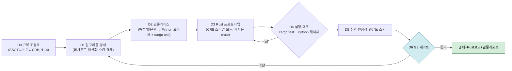
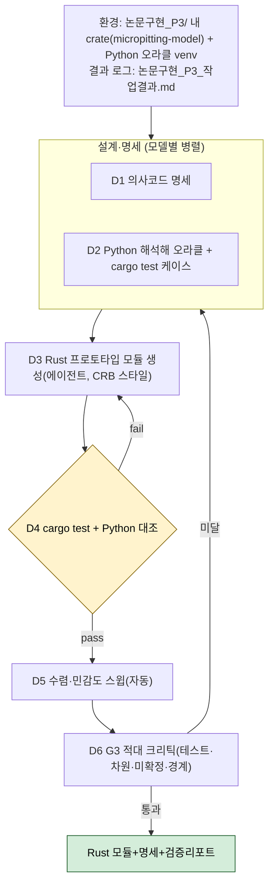
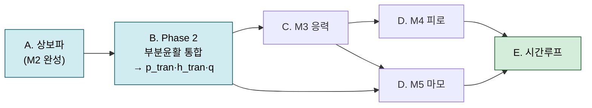
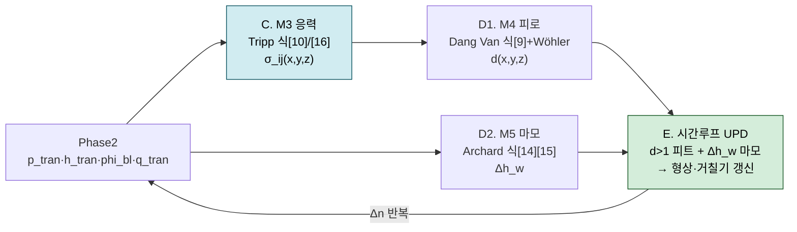

# 논문구현 P3 총괄계획 — 알고리즘 설계+검증 (CRB-main/Tauri 통합 반영)

> **목적**: P3(알고리즘 설계+검증)를 모델(M1~M6)별로 어떻게 설계·검증하고, **무인 하네스**로 어떻게 실행하며, **구현 언어**를 무엇으로 할지 계획한다. **핵심 제약: 개발 코드는 최종적으로 [CRB-main](../../CRB-main)(Tauri 2 + 네이티브 Rust) SW에 통합**한다.
> **선행**: P1→G1→P2 전 6모델 통합 완료 — [[논문 구현_P2-3_알고리즘검토서_통합_M1-M6]](P3 입력)·[[검토_큐_잔여_통합]]·[[논문 구현_연구자검토큐_통합]](사인오프 Q2~Q9).
> **작성일**: 2026-07-09 · **개정**: v2(CRB-main 분석 → 언어 Python→Rust 전환) · **v3(SSOT 전략 B·참조-재구현·규약 조정표 §1.4 반영)**
> **게이트 G3**: 모듈 DAG 확정 · 단위테스트 명세 · 해석해·문헌 케이스 테스트 통과 · 미확정 알고리즘 0건.
> **확정(2026-07-09)**: 개발 접근 = **별도 Rust crate `micropitting-model` → CRB-main `solver/`로 이식**; **참조-재구현 + 경계 어댑터**, 코드 SSOT = **(B) 표준/CRB 정렬**(규약 조정표 §1.4). **위치** = `논문 취합/03. 정리/논문구현_P3/`, **결과 로그** = `논문구현_P3_작업결과.md`. **CRB 재사용은 5개 한정**(§1.3). **M6 파일럿 보류**(계획 검토 후).

---

## 0. 한눈에 보기 (Executive Summary)

- **통합 대상 파악**: CRB-main은 **Tauri 2 + 네이티브 Rust** 원통롤러베어링 접촉해석 데스크톱 앱. 백엔드가 이미 **`rustfft`·`nalgebra`·`sprs`·`rayon`** 를 쓰고, **EHL 유막(`lubrication.rs` 8,441 LOC)·Hertz(`hertz.rs`)·혼합EHL(`hmehl.rs`)·수명(`life.rs`)·기존 마이크로피팅 안전율(Λ-비 분류기)** 까지 보유. 모든 수치는 **인프로세스 Rust**(사이드카/WASM 없음), `#[tauri::command]` 로 프런트(React/TS+Plotly)에 노출.
- **언어 결정 전환**: 통합 제약 때문에 **주력 언어 = Rust(네이티브, CRB-main 통합)**. Python은 **오프라인 검증 오라클**로만(CRB-main이 이미 쓰는 `python-prototype/` 관행과 동일). → 이전 "Python 주력"안은 **포팅 비용·이중구현 리스크**로 폐기.
- **재사용 방침 = 참조-재구현**(직접 의존 X): CRB-main 코드는 **알고리즘·계수 참조**로 읽고 **우리 코드 SSOT로 신규 구현**, 통합은 **경계 어댑터 1겹**. **재사용은 5개로 한정**(§1.3): Dowson-Toyoda 유막식(**열/기아 보정 제외**)·`hertz.rs`·`rustfft`·`nalgebra`·`rayon` → **RQ-01 이득 유지 + 규약 결합 차단**.
- **SSOT 전략 = (B) 표준/CRB 정렬**: 코드 규약을 **SI · 표준 환산탄성계수 E_red · 표준 부호**로 통일. 논문 특이규약(E′ 2배 등)은 **식 전사 시 1회 변환**(규약 조정표, §1.4)으로만 처리 → **E′ ×2 지뢰 원천 제거**, CRB 경계 최소화, Q9(계수 혼동 방지) 의도 더 충실.
- **우리 모델의 위치**: 기존 Λ-비 마이크로피팅 안전율을 **보완/고도화**하는 **상세 물리기반 모듈**(표면피로↔마모 경쟁, Dang Van, FFT 응력) — `src-tauri/src/solver/`에 신규 모듈로 추가.
- **하네스**: 에이전트가 **Rust 모듈 + Python 해석해 오라클**을 작성 → **`cargo test`(단위) + Python 대조(해석해)** 자동 실행 → 통과까지 루프. **부분윤활 서브시스템 M1+M2+M6 동시**(Phase 0 공유기반 동결 → 병렬 3 → 통합, §5.4).

---

## 1. CRB-main 통합 분석 (핵심)

### 1.1 아키텍처
| 계층 | 스택 |
|---|---|
| 백엔드(수치) | **Rust**, crate `crb-contact-analysis`(lib `app_lib`), Tauri **2.10** · `nalgebra 0.33`·`sprs 0.11`·**`rustfft 6`**·`rayon`·`rand` |
| 프런트 | React 19 + TypeScript + Vite · 3D `three/r3f` · 차트 **Plotly** · Tailwind |
| 통신 | `#[tauri::command]` 핸들러(`commands.rs`·`presets.rs`, `lib.rs`에 `generate_handler!`) ↔ 프런트 `invoke()` |
| 계산 방식 | **인프로세스 네이티브 Rust** (사이드카/외부바이너리/WASM 없음) |
| 검증 관행 | `python-prototype/`(van Zoelen 유막 오프라인 검증) — **런타임 아님, 오프라인 오라클** |

### 1.2 통합 지점 (신규 모듈 추가 절차)
1. `src-tauri/src/solver/<micropitting_fatigue>.rs` 생성 → `solver/mod.rs`에 `pub mod` 등록.
2. 결과 구조체를 `solver/types.rs`에 추가(serde 직렬화 → 프런트).
3. `commands.rs`에 `#[tauri::command]` 래퍼 + `lib.rs` 핸들러 목록 등록.
4. `src/types/`에 TS 타입 미러 + `src/components/`에 뷰 + `store.ts` `invoke()` 배선.

### 1.3 CRB-main 재사용 — **딱 5개로 한정**

> 아래 5개만 재사용하고, 그 외 CRB 코드(Λ·거칠기·`hmehl`·`life`·NVM·열/기아 보정 등)는 **참조도 하지 않는다**.

| # | 재사용 대상 | 형태 | 용도 |
|---|---|---|---|
| 1 | **Dowson-Toyoda(1978) 중앙유막식** — `compute_film_thickness` 내 `h_c=3.06·U^0.69·G^0.56·W^−0.10`(×R_eq). **열/기아 보정 φ_t·φ_s 제외**(등온·완전침수) | 알고리즘·계수 **참조 → SSOT 재구현** | **M6 h̄ / RQ-01 해소** |
| 2 | **`hertz.rs`** (Hertz 선접촉) | 알고리즘 **참조 → 재구현** | M1 해석해 오라클·접촉폭 |
| 3 | **`rustfft`** | crate **직접 사용** | M1·M2·M3 FFT |
| 4 | **`nalgebra`** | crate **직접 사용** | 변분·밀집 선형대수 |
| 5 | **`rayon`** | crate **직접 사용** | 시간루프·임계면 병렬 |

> **결론**: CRB에서 취하는 것은 **위 5개뿐**. **나머지 전부 신규 구현** — M1 부분윤활 압력(FFT+소성)·M2 상보파·M3 표면하 응력(Tripp)·M4 Dang Van·M5 Archard 경쟁·M6 하중분담 반복·시간루프·**입력 구성까지 자체**.

---

### 1.4 규약 조정 (SSOT Boundary Map) — 전략 B ★

우리 P2 SSOT와 CRB-main·논문 규약은 **의미 경계**에서 충돌한다(컴파일되나 물리가 틀림). **전략 (B) 표준/CRB 정렬 SSOT** 채택: 코드는 표준 규약, 논문 특이규약은 1회 변환.

| 양 | 논문(P2) 규약 | CRB-main 규약 | **채택 코드 SSOT (B)** |
|---|---|---|---|
| 환산탄성계수 | E′ 2배(`2/E'=…`, E*=E'/2) | 표준 E_red(Dowson 파라미터) | **표준 E_red** (논문식은 E′=2·E_red로 1회 치환) |
| 단위 | 혼재(µm·GPa 표기 존재) | µm(`h_*_um`)·GPa | **SI(m·Pa) 내부**, 경계에서만 변환 |
| α 기호 | 삼중(파수/DV/점도) | 자체 | **`alpha_wave`/`alpha_dv`/`alpha_visc` 분리(Q9)** |
| 응력 부호 | MAIN 인장+ / SRC16 압축− | `hertz.rs` 자체 | **표준 부호 1개 고정**(내부일관+von Mises 불변으로 검증) |
| 좌표/형상 | 접촉패치·x=구름·주기 | 베어링 5-DOF·슬라이스 | **접촉패치 로컬 프레임**(경계에서 CRB 프레임 매핑) |

- **첫 산출물(D0, 선행 필수)**: **규약 조정표** = `코드 SSOT ↔ 논문규약 ↔ CRB규약` 완전 매핑. 각 식에 "논문형→표준형" 변환 명기 → **프로토타입 구현 스펙 + P4 어댑터 스펙 겸용**.
- **참조-재구현**: CRB **Dowson-Toyoda 유막식(보정제외)**·`hertz.rs`를 **읽어 알고리즘·계수만 추출**, 프로토타입 crate엔 **코드 SSOT로 신규 구현**(CRB 의존성 X). crate `rustfft`·`nalgebra`·`rayon`만 직접 의존.
- **P4 통합 = 어댑터 1겹**: `#[tauri::command]` 경계에서 코드 SSOT ↔ CRB 타입·단위 변환. **중복 물리(유막 등) 소유권**은 P4에서 택1(어댑터 호출 vs 자체 보유) — 발산 방지.
- **추적성 유지**: 논문 원식·부호는 규약 조정표의 '변환' 열로 보존(코드엔 표준형만).

---

## 2. 구현 언어 선정 (조사 반영)

### 2.1 결정 인자 (통합 제약이 최상위 가중)
Tauri 네이티브 통합 · CRB-main 기존 crate/도메인코드 재사용 · 단일바이너리 배포·재현성 · FFT/선형대수/병렬 성능 · LLM 에이전트 코딩·검증 자동화.

### 2.2 옵션 비교
| 옵션 | 통합 | 재사용 | 성능 | 개발속도(LLM) | 판정 |
|---|---|---|---|---|---|
| **A. Rust 직접(권장)** | **무비용(네이티브)** | **최대(rustfft·nalgebra·hertz·lubrication)** | 최상(대규모서 native≫) | 중(Rust 수치, 에이전트 가능) | **채택** |
| B. Python 개발→Rust 포팅 | 지연(포팅) | 중 | 최종 상 | 상(프로토타입 빠름) | 이중구현·버그갭 → 비채택 |
| C. Python 사이드카 상주 | **불일치**(런타임의존·IPC·배포↑) | 하 | 중(IPC 오버헤드) | 상 | CRB 관행 위배 → 비채택 |

- Rust 수치 생태계(조사): `rustfft`·`nalgebra`·`rayon` 충분히 성숙(단 crate 간 조합성 한계는 유의). Tauri에서 **네이티브 Rust가 대규모 계산에 사이드카 대비 우월**(성능·배포).

### 2.3 권고
**Rust 주력(네이티브, CRB-main 통합) + Python 오프라인 검증 오라클**(CRB `python-prototype/` 관행 계승). 해석해(Hertz·정현파·GW1994·Milano 닫힌해)를 Python으로 독립 계산해 Rust 결과와 대조. 초기 알고리즘 탐색이 막히면 Python **스파이크(1회성) 후 즉시 Rust 이식**(상주 금지).
> ⚠️ 최종 확정은 연구자 승인. Rust 직접 vs Python-스파이크-우선은 §7 확정사항.

---

## 3. P3 표준 프로세스 (모델 공통 D1~D6)

- **D0(선행 필수)**: **규약 조정표**(§1.4) 확정 — 코드 SSOT(전략 B) ↔ 논문 ↔ CRB. 이후 D1~D6.
- **D3**: **우리 코드 SSOT로 신규** Rust 모듈(CRB `solver/` 스타일·serde·`Result<_,String>`); CRB는 **알고리즘·계수 참조**(직접 의존 X).
- **D4**: `cargo test` 단위(해석해 assert) + Python 오라클로 수치 대조(허용오차 Q9 정본).

---

## 4. 모델별 알고리즘 설계·검증 상세

### 4.0 구현 순서(DAG) — bottom-up
(M1, M2 병렬) → **M6(★)** → M3 → (M4, M5) → 공통 시간루프. M6가 최우선(잔여 P1 집중 + 재사용 이득 큼).

### 4.1 상세 표
| 모델 | 확정 알고리즘(사인오프) | 검증 오라클(D2) | 잔여 리스크(RQ) | CRB-main 참조(재구현) |
|---|---|---|---|---|
| **M1 Dry** | FFT 변위(식1)+Kalker 변분+소성절단 $p_{lim}$=4.3GPa; error≤1e-3·반복≤30 | **Hertz**(`hertz.rs`, ≤1%)·정현파 변위 | (해소) | `rustfft`·`nalgebra`·`hertz.rs` |
| **M2 Lub** | 특수해(식5)+상보파(식7·8, ψ 실/허부 반복 1e-5)+Eyring(식6) | **GW1994 $p_a/r_a$ vs $Q$** 곡선 | — | `rustfft` |
| **M3 응력** | **Tripp 2003 식[10]/[16]** 6응력+FFT 모드중첩; z 0~0.25a·15층 | **정현파→식[12][13]** 해석해(≤2%) | RQ-09(무해) | `rustfft` |
| **M4 피로** | **MCE+대칭화 편차 Tresca(Q3)**+Wöhler(A=−43,B=1220)+Miner; N_ref=1e6 | **Milano 식(3)·A.8**·Desimone(≤1%) | — | `rayon`(임계면 병렬) |
| **M5 마모** | Archard(식14·15); **u_s→접촉폭/속도(Q5)**; k_lub 외삽 태깅 | Archard/Williams 단위·정성 | **RQ-02·03·07·08**(가정+민감도) | — |
| **M6 하중분담 ★** | flow balance 반복(23)+$h_{tran}$; **유막=Dowson-Toyoda h_c(보정제외)(Q2)**; φ_bl 완화 ω∈[.3,.7]·flow tol 1e-3~1e-4·w(1,1)=0 | **하중보존**(≤0.1%)·(21) 대조 | **RQ-01 해소**·04·05·06·12 | **Dowson-Toyoda h_c(참조)**·`rustfft` |
| **공통** | Δn 시간루프·형상갱신(d>1 피트); 좌표·단위 SSOT(Q9, 전략 B 표준규약) | 원논문 Fig10/11(P5 이월) | — | `rayon` |

> **M6 재평가**: RQ-01(유막공식)이 CRB **Dowson-Toyoda(보정제외)** 참조로 해소 → M6 P1 리스크가 4건→3건(RQ-04/05/06 반복스킴·RQ-12 c_ρ 부호)으로 감소. 그래도 반복스킴·부호는 신규라 **M6는 Phase 1 mock 검증 + Phase 2 실결선**으로 다룸(부분윤활 묶음).

---

## 5. P3 무인·병렬 하네스 (Rust 대상)

### 5.1 P1/P2와의 차이
**실행 가능한 Rust 코드 + 런타임** 필요 → 에이전트가 코드 작성 후 **`cargo build`/`cargo test` 실행**해 해석해와 대조하는 **run-verify 루프**. 환경: **Rust toolchain(CRB-main에 이미 구성)** + Python venv(오라클: numpy/scipy·해석해).

### 5.2 파이프라인

### 5.3 무인 기법
구조화 명세 스키마 · **run-verify(Ralph): cargo test 통과까지 재생성** · 해석해 pytest/Rust assert 오라클 · 수렴·민감도 자동 스윕 · 적대 G3 크리틱 · CHANGELOG/git 커밋 · **연구자 게이트(수치판정·M6)** · Rust LLM 코딩 유의(타입·차용검사 오류는 크리틱+빌드로 조기 검출).

### 5.4 실행 전략 — 부분윤활 서브시스템(M1+M2+M6) 우선, 3-Phase

M1(dry)+M2(lub)+M6(하중분담) = **부분윤활 서브시스템**(p_tran·h_tran 산출). M6는 M1·M2의 소비자이므로 병렬화의 전제는 **Phase 0 동결**.

- **Phase 0 (공유 기반, 선행·단일)**: D0 규약조정표 + crate 스캐폴드(Cargo.toml·lib.rs) + **`types.rs` SSOT·인터페이스 계약(M1→M6, M2→M6)** + 공용 유틸(FFT 래퍼·Hertz·Dowson-Toyoda h_c 재구현) + Python 오라클 venv + `논문구현_P3_작업결과.md`. **인터페이스·규약 동결**로 병렬 안전 확보.
- **Phase 1 (병렬 3, 모듈 소유권)**: M1 `m1_dry.rs`(Hertz 테스트) · M2 `m2_lub.rs`(GW1994 테스트) · M6 `m6_share.rs`(하중보존, **mock M1/M2 입력**). 각자 모듈+`tests/`만, 공유파일 불변.
- **Phase 2 (통합)**: `cargo build/test` 전체 + 적대 G3 크리틱 + **M1+M2→M6 실결선 스모크** → 부분윤활 서브시스템 G3.
- 이후 **M3·M4·M5 확장**, 통합 시간루프·원논문 재현은 P4~P5 이월.

---

## 6. G3 게이트 체크리스트
- ☐ 모델별 **알고리즘 명세서(의사코드)** 완결(이산화·수렴·경계·초기값)
- ☐ **단위테스트 명세**(cargo test) + **Python 해석해 오라클** 존재·코드화
- ☐ **Rust 프로토타입이 해석해·문헌 케이스 통과**(허용오차 내)
- ☐ **미확정 알고리즘 0건**(사인오프 반영; 잔여 가정은 태깅+민감도)
- ☐ 수렴·안정성·민감도 스터디 기록
- ☐ 변수 SSOT(E′ 2배·α 삼중분리 등 Q9) Rust 상수/타입 규약 준수
- ☐ **CRB-main 통합 인터페이스**(신규 solver 모듈·types·command 시그니처) 초안 확정
- ☐ M6 잔여(RQ-04·05·06·12) 처리·문서화

---

## 7. 리스크·확정사항·다음 단계

### 7.1 리스크
| 리스크 | 완화 |
|---|---|
| Rust 수치 코드 LLM 생산성/미묘 버그 | 해석해 cargo test + Python 대조 + 적대 크리틱 + 빌드검증 |
| M6 반복스킴·c_ρ 부호(RQ-04/05/06/12) | M6 선행 파일럿 + 민감도 + CRB 유막 재사용 |
| crate 조합성 한계(rustfft/nalgebra) | 얇은 어댑터·자체 커널, 필요시 특화 구현 |
| CRB-main 기존 코드와 규약 충돌(단위·좌표) | types.rs·기존 API 준수, SSOT 매핑표 선작성 |

### 7.2 확정 사항 (2026-07-09)
1. **개발 위치**: ✅ 별도 Rust crate `micropitting-model` — **`논문 취합/03. 정리/논문구현_P3/`** 폴더 내 생성. 검증 후 CRB-main `solver/`로 이식(통합 리스크는 P4로 이연).
   - **결과 기록**: P3 산출·진행을 결과 로그에 정리. **(2026-07-14 분리)** M1/M2/M6 = **`논문구현_P3_작업결과_M1,2,6.md`**, M3/M4/M5 = **`논문구현_P3_작업결과_M3,4,5.md`**.
2. **언어**: ✅ Rust(프로토타입 crate) + Python 오프라인 오라클. 동일 Rust 생태계라 CRB-main 이식 저비용.
3. **재사용 방침**: ✅ **참조-재구현** — CRB 코드는 알고리즘·계수 참조로만 읽고 **우리 코드 SSOT로 신규 구현**(직접 의존 X); 통합은 **경계 어댑터 1겹**(§1.4). RQ-01(유막계수)은 참조로 이득 유지.
4. **SSOT 전략**: ✅ **(B) 표준/CRB 정렬** — 코드는 **SI·표준 E_red·표준 부호**; 논문 특이규약(E′ 2배 등)은 **규약 조정표(D0, §1.4)** 로 1회 변환 → **E′ ×2 지뢰 제거**, 경계 최소화.
5. **착수 범위**: ✅ **부분윤활 서브시스템(M1+M2+M6) 동시**(3-Phase, §5.4). 잔여 큐([[검토_큐_잔여_통합]]) 추천안 확정 반영.

### 7.3 다음 단계
1. ✅ (연구자) **계획·잔여큐 확정** → 2. **Phase 0**: `논문 취합/03. 정리/논문구현_P3/`에 crate `micropitting-model` 스캐폴드 + **D0 규약조정표** + 공유 `types.rs`/유틸(FFT·Hertz·Dowson-Toyoda) + Python 오라클 venv + `논문구현_P3_작업결과.md` → 3. **Phase 1**: M1·M2·M6 병렬 무인(모듈+해석해 테스트) → 4. **Phase 2**: 통합·`cargo test`·M1+M2→M6 스모크 → 부분윤활 서브시스템 G3 → 5. **M3·M4·M5 확장** → 전 모델 G3 → **P4(CRB-main 이식)**.

---

**참고 (조사 출처)**
- CRB-main 아키텍처 — 로컬 `d:\AI\AI_Seminar\CRB-main` (Tauri2+Rust, `src-tauri/src/solver/*`, `lubrication.rs` NVM/Dowson-Toyoda 유막)
- Rust 수치 생태계 — <https://www.arewelearningyet.com/scientific-computing/> · <https://scientificcomputing.rs/monthly/2025-10>
- Tauri 네이티브 vs 사이드카 — <https://evilmartians.com/chronicles/making-desktop-apps-with-revved-up-potential-rust-tauri-sidecar> · <https://rustify.rs/articles/rust-tauri-vs-electron-2026>
- 도메인 참고(교차검증): slippy <https://github.com/FrictionTribologyEnigma/slippy> · ContactMechanics <https://github.com/ContactEngineering/ContactMechanics> · ErikHansenGit/EHL(MATLAB) <https://github.com/ErikHansenGit/EHL>

---

## 8. 후속 확장 계획 — 상보파(M2 완성) → Phase 2(부분윤활 통합)

> **선행 검토 확정(2026-07-13)**: M3/M4/M5는 **Phase 2 출력 `p_tran` 이 입력**이고(§4.0 DAG: (M1,M2)→M6→M3), Phase 2는 **완성된 M2(상보파 포함)** 를 필요로 한다. 따라서 즉시 착수 순서는 **A. 상보파 → B. Phase 2 통합**, M3/M4/M5·시간루프는 B 완료 후. 본 계획은 [[논문구현_P3_작업결과_M1,2,6]]에서 검증된 방법론(독립오라클·변이게이트·적대 재크리틱·근거기반)과 현 코드 상태를 근거로 수립.

### 8.0 순서·의존 요약

| 단계 | 내용 | 의존 | 게이트 |
|---|---|---|---|
| **A. 상보파** | M2 완성(식[7][8] 2성분해) | M2(특수해·Roelands·RQ-vel 완료) | G3(M2 상보파) |
| **B. Phase 2 통합** | M1+M2+M6 완전결합 solver → `p_tran`/`h_tran`/`q` | **A 필요** | 부분윤활 서브시스템 G |
| (후속) C. M3 | Tripp 6응력, `p_tran` 입력 | **B 필요** | — |
| (후속) D. M4·M5 | Dang Van / Archard | C(M4)·B(M5) | — |
| (후속) E. 시간루프 | 마모→형상갱신 재현(Fig10/11) | C·D | G5 |

---

## 8.A 상보파(complementary wave) 구현 — M2 완성

### 8.A.1 목표·근거 — 왜 상보파가 필요한가

- **진폭감소는 2성분해다(GW1994 = ref (29)).** 접촉 중앙 선형 Reynolds 식[2]의 해 = **특수해(particular, 표면2 거칠기와 함께 $u_2$ 이동) + 상보파(complementary, 입구 생성·$\bar u$ 전파·비뉴턴 감쇠, 식[7][8] = ref (28))**. 현 `m2_lub.rs`는 `solve_full_film`이 특수해 리플만 합성(`p_spec = pt·s`)하고 상보파를 **미구현**.
- **순수 rolling에서 특수해는 0이다(RQ-vel, 작업결과 ⅴ).** `u_conv=(u₂−ū)=−Δu/2` 이므로 $u_2\to\bar u$(SRR→0)에서 `amplitude_q`→0. 물리적으로 순수 rolling에서도 리플은 존재하며 이를 **상보파가 담당**한다.
- **정량 재현 요구(VC-M2-Spot).** GW1994 Table1 스팟값(50℃ P₁=0.388/h₁=0.0331, 80℃ 0.413/0.0185; P2-2 §2.2)은 **2성분해라야 정량 재현**. 현 특수해 단독 닫힌형은 함수형만 커버(작업결과 ⓒ: VC-M2-Spot ⬜ 후속)라 이 정량 오라클 통과 불가.
- **범위**: SSOT 전략 B(E_red·SI·`E'=2·E_red` 1회 치환) 유지, 저진폭 미세형상 유효범위 전제.

### 8.A.2 알고리즘 — 상보파 2성분 합성

1. **분산관계 `dispersion_psi`(신규)** — 식[8](ref (28))의 상보파 파수 $\psi=\omega_{x'}+i\beta$ 를 모드별로, **실부/허부 교대 대입**으로 수렴(§4.1 "ψ 실/허부 반복 1e-5"). $\omega_{x'}$=전파방향 파수, $\beta$=비뉴턴 감쇠율.
2. **비뉴턴 감쇠** — $\beta$ 는 식[6] Eyring 방향점도(ref (30); 기존 `eyring_eff_visc`·`directional_visc` 재사용)로 결정. **상보파 대류속도는 $\bar u$=`op.u_mean`**(특수해 `(u₂−ū)` 와 분리 — 두 성분의 대류속도 분리가 핵심).
3. **상보파 진폭 `complementary_wave`(신규)** — $\delta h_c,\delta p_c$ 는 입구 생성. 진폭은 **식(28) 보간 대신 (21) 수정법 = (31) 뉴턴 진폭감소 곡선 기반 보간**. 입구 생성분이 접촉 통과하며 $\beta$ 감쇠.
4. **2성분 합성** — `solve_full_film` 모드 루프: `p_spec = (p_part + p_comp)·s`, `h_spec = (h_part + h_comp)·s`. 탄성결합·`E'=2·E_red`·Nyquist 실수투영은 두 성분 모두 적용.
5. **연속성** — 순수 rolling에서 특수해→0 이어도 상보파 항 non-zero 유지 → 총 진폭감소비가 GW1994 곡선(VC-M2-AR) 재현.

### 8.A.3 검증 오라클 (독립·실패가능·비-tautology; 작업결과 패턴 재사용)

- **(a) VC-M2-AR 닫힌형(정성+정량)** — GW1994 식(15)(16)(17) 리플비 vs $\lambda/\bar h$ 곡선. 2성분 총진폭감소비 독립 닫힌형 대조(기존 `pressure_amplitude_reduction_closed_form` 확장). 단파장→지속·장파장→평탄화 + RMS편차.
- **(b) VC-M2-Spot GW1994 Table1 정량(치명·신규)** — 50℃ P₁=0.388/h₁=0.0331, 80℃ 0.413/0.0185 **하드코딩 오라클**(허용 GJ±5%/Kweh·Chang±15~18%/h₁±10~20%). **상보파 포함이라야 재현** → 특수해 단독이면 FAIL(구조적 검출력).
- **(c) 순수 rolling 리플 non-zero** — `slide_roll→0` 에서 특수해 Q→0 이나 총 리플 진폭>0 강제(상보파 담당 직접 검증).
- **(d) VC-M2-Master 보조** — Venner2000 식(29) 마스터커브 예제 `A_d=4.136e-3=0.739A_i` 1점 대조.
- **(e) 변이게이트** — β 부호 반전 / 상보파 진폭계수 주입 → (b)(c) 오라클 FAIL(CAUGHT) 후 즉시 원복(작업결과 ⓔ 3/3 패턴).
- **(f) 적대 재크리틱** — tautology_remaining=false·arbitrary_coeffs_remaining=false·grounding_ok=true.

### 8.A.4 코드 변경 지점

- **`solve_full_film`** — 모드 루프 2성분화: `p_part`(기존 `pressure_ripple_transfer`) + `p_comp`(신규) 합산. `u_conv`(특수해)와 별도로 상보파 대류속도 `u_mean(=ū)` 결선.
- **신규 함수** — `dispersion_psi(...)->Complex`(ψ, 실/허부 교대 반복), `complementary_wave(...)->(Complex,Complex)`, (31) 보간표 함수(`newton_reduction_interp`). 전부 `pub`(단위 오라클 재사용).
- **결과 구조체** — `LubResult{p_lub,h_lub}`(types.rs 동결) 시그니처 유지. 진단 필요 시 M2 내부 `ComplementaryTrace`(특수해/상보파 분리 진폭)만 추가(공유 types.rs 무수정 원칙).
- **C≠0(RQ-2) 연동** — 현 `c_comp=0.0`(비압축 극한). 상보파 압축성(식[4] `C=h·E'·κ/(4B)`)을 특수해와 동일 경로로, 정밀 B(p)는 잔여큐 분리. `compressibility_c_sensitivity` 재사용해 두 성분 C-스윕 유계.

### 8.A.5 잔여 가정·RQ (전부 식/ref/RQ 체인; 자의적 계수 금지 — 미제공은 '가정+민감도')

- **RQ-M2-comp1: (31) 상보파 진폭 보간표 수치** — Venner–Lubrecht 뉴턴 진폭감소 곡선 디지타이즈 수치 논문 미제공(**G-M2-1**). ref (31) 식(29)/곡선에서 추출, 미확보분 가정+민감도(보간표 ±오차 스윕).
- **RQ-M2-comp2: β 초기추정·수렴** — 식[8] 실/허부 교대 초기값·tol(1e-5) 미제공(**G-M2-2**). ref (28) 근거, 초기추정 가정+민감도.
- **RQ-M2-comp3: cavitation 오차** — 상보파 통과 시 음압 절단 오차범위 미제공(**G-M2-3**). ref (21) 근거, 오차범위 태깅.
- **RQ-2(연동): 압축성 C≠0·B(p)** — 식[4] 소급. 상보파 Phase에서 도입, `compressibility_c_sensitivity` 유계화.

### 8.A.6 G3 게이트 + 리스크

- **G3 통과 기준**: (1) 독립 오라클 (a)~(d) green — 특히 **(b) VC-M2-Spot 가 상보파 없이는 실패**하는 검출력(비-tautology). (2) 변이게이트 (e) **CAUGHT**. (3) 재크리틱 (f) pass(자유계수 0; 보간표·β 는 ref (31)(28) 소급, 미제공분만 사인오프 가정+민감도). (4) 순수 rolling 리플 non-zero 물리 부등식.
- **리스크**: ① `dispersion_psi` 실/허부 교대 대입 고파수·고압 발산 → 상한반복·비수렴 폴백(특수해 단독). ② 비뉴턴 감쇠 안정성(운전점 Roelands η, 1.5GPa β 민감) → 민감도 스윕. ③ (31) 보간표 정밀도(G-M2-1)·GW1994 Table1 운전조건 정합이 VC-M2-Spot 판정 좌우 → 대조원 차등오차(±5~18%) 내 판정.

---

## 8.B Phase 2 — 부분윤활 서브시스템(M1+M2+M6) 완전 통합

### 8.B.0 목표·범위·전제

- **목표**: M1(`solve_dry`)·M2(`solve_full_film`)·M6(`combine_share_traced`)를 **하나의 완전 결합 solver** 로 승격 → 부분윤활 최종 산출물 **`p_tran`(식[258])·`h_tran`(식[252])·`phi_bl`** 및 M3용 **마찰 트랙션 `q=μ·p_tran`** 을 자기일관 산출. (21)(23) flow-balance 절차 ①~⑤ 완전 구현이며 `PartialLubResult` 를 M3·M5·시간루프 정식 입력으로 확정.
- **선행 전제(엄수)**: **§8.A 상보파 완성 이후 착수.** Phase 1b 통합테스트는 M2 리플에 Hertz 평균압을 수동 가산(`integration:108 *v+=op.p_h`)한 **결선 임시조치**였다. 상보파 완성으로 순수 rolling 근처까지 물리적으로 옳은 `p_lub` → `p_tran` 정확.
- **후행 제약**: Phase 2 출력이 **M3 입력** → M3/M4/M5·시간루프 착수 전 필수 완료(§4.0 DAG).

### 8.B.1 Phase 1b 대비 델타 (무엇을 더 하는가)

Phase 1b는 **고정 단일 M1/M2 해**를 입력으로 `phi_bl` 만 이분법 수렴(접촉집합만 갱신, `h̄`·`p̄`·국부해 고정). Phase 2 추가:
1. **완전 flow-balance(절차②⑤ 폐루프)**: `p̄`(절차②)·`h_sep=c_ρ·h̄`(절차⑤)를 **수렴 변수로 승격**. 현 A안 사후 하중재균형(`recover_p_tran`, ≤0.1%)을 유지하되, 작업결과 ⅳ의 **B안(외부 하중루프)** — `p̄`/`h̄` 조정으로 cavitation 포함 `∫p_tran·dA=W` 를 수렴 목표에 통합 — 으로 물리충실성 상향.
2. **영역 재식별 반복(절차④)**: dry/lub 를 `h_tran` 부호로 재식별→국부장 갱신→재수렴을 **외부 반복**으로 안정화.
3. **두 거친면 결합(CV-M6-Load)**: `rough1/rough2` 각 표면이 다른 속도로 리플 생성 → **`p_lub=p_lub1+p_lub2`**, 각 표면 상보파(§8.A) 결합.
4. **마찰 트랙션 `q=μ·p_tran`**(경계 `μ_bl`·유막 Eyring `μ_ehl`, `phi_bl` 가중) — M3 vM 응력장(Fig15)·RP-Field 검증 필수. Phase 1b엔 부재.

### 8.B.2 알고리즘·결선 — (21)(23) 절차 ①~⑤ 완전 구현

- **①** `h̄`=§8.A 완성 M2의 `mean(h_lub)`(Dowson–Toyoda, RQ-M6-hbar 확정식).
- **②** `p̄` 초기 `op.p_h` → **하중루프 수렴변수**.
- **③** `phi_bl` 가정, 나머지 유막 지지(`load_fraction`).
- **④** `p_lub=p_lub1+p_lub2`·`p_dry` **실입력**으로 영역 재식별, `h_tran=IFFT{max(|h̃_dry|,|h̃_lub|)}`(식[252], DC=0·간극–간극 동종 M6-4) 유지, flow-balance 근 `F(φ)=g(φ)−φ=0` 이분법 수렴(단조 → 유일근, RQ-M6-tol ε∈[1e-4,1e-3]).
- **⑤** `c_ρ=c_rho(phi_bl,p̄)`(φ_bl 확정·상한 1.34, RQ-M6-cρ 종료)로 `h_sep=c_ρ·h̄` 조정. `flow_balance_residual<1e-9` 항등.
- **압력복원(식[258])**: `p_tran=p_dry+IFFT{w⁻¹·FFT(h_dry−h_tran)}`, `w⁻¹=E_red·k/2`, DC=0, cavitation·소성 절단. **A안 하중재균형**(≤0.1%) 계승.
- **마찰**: `q_tran=μ_eff·p_tran`, `μ_eff=phi_bl·μ_bl+(1−phi_bl)·μ_ehl`, `μ_ehl` 은 M2 Eyring 전단(식[6])에서. M3 입력으로 전달.

### 8.B.3 코드 지점 (모듈 구조·타입)

- **모듈**: 서브시스템 오케스트레이션(M1·M2 호출→두-표면 결합→flow-balance→마찰)은 **신규 상위 모듈 `partial_lub.rs`**, M6 `m6_share.rs` 는 순수 결합·복원 커널로 유지(단일책임·오라클 재사용). 진입점 `partial_lub::solve_partial(&PartialLubInput)->PartialLubResult`.
- **타입 확장(`types.rs`)**: `PartialLubResult` 에 `q_tran:Field2`(M3 입력) 추가, `phi_field:Option<Field2>`(선택). 시간루프 직렬화 위해 결과·입력에 **`serde` derive 추가**. `SharePolicy` 에 B안 하중루프 tol·max_iter 추가.
- **경계 어댑터**: CRB-main `#[tauri::command]` 노출은 **P4 소관**(§1.2/§1.3) — Phase 2는 순수 Rust 라이브러리 경계까지.

### 8.B.4 검증 (작업결과 오라클 패턴 재사용 — 독립·반-tautology)

- **(a) RP-Field(SKF Fig.6·Fig.15) 정성 재현** — 부분윤활 `p_tran`·`h_tran` 형상과 결합 x–z(y=0) vM 응력장 형태·피크 위치를 **정성 대조**. 이미지 수치추출 불가 → 정량 임계 금지, "리플 파장 정합·피크 접촉중앙 부근·응력 최대 표면하"류 **정성 불변식만** 오라클화(과적합 방지).
- **(b) 하중보존(CV-M6-Load, A안)** — `∫p_tran·dA=W` **≤0.1%**, `phi_bl∈[0,1]`, `flow_balance_residual<1e-9`.
- **(c) 극한 오라클(실패가능, M6-2)** — `phi_bl→0`·`→1`·지배효과·flow-balance 고정점을 **실결선 재실행**. 식[252]/[258] 독립오라클 계승.
- **(d) 통합 재현(G5, 정성)** — RP-Λmax(Λ≈1.1 A_p 극대)·RP-Slip(S≈0.01 피팅 극대)은 M5 결합 후 정성 재현 — Phase 2에서 `p_tran`/`phi_bl` 이 입력임을 스모크 확인.
- **(e) 변이게이트·재크리틱** — 계수/부호/영역판정 변이(식[258] `w⁻¹` 부호, 접촉집합 `<0`↔`>0`, `p_lub1+p_lub2`↔단일) 주입 → 각 오라클 검출 확인 후 재크리틱.

### 8.B.5 게이트 · 의존 · 리스크

- **게이트(부분윤활 통합 G)**: `cargo build/test` green + 적대 G3 크리틱 + M1+M2→M6 실결선 스모크 + RP-Field 정성 재현 + CV-M6-Load ≤0.1% + 극한/변이/재크리틱 pass. G4(CV-M6-Load·G-M6-1/2)·G5(RP-Field/Λmax/Slip) 슬롯 충족.
- **의존**: **§8.A 상보파 완성(필수)**. 상류 M1(Polonsky–Keer 하중정규화)·M2(Roelands·Eyring·RQ-vel) 확정 전제. 하류 M3/M4/M5·시간루프 대기.
- **리스크**: ① 이중 루프(flow-balance φ + B안 p̄/h̄) 발산 → under-relaxation·bracket 강건화·보수적 tol. ② 영역 재식별 진동 → hysteresis/relaxation·`asperity_degenerate`(M6-5) 활용. ③ RP-Field 정성검증 한계(이미지) → 정량 금지·정성 불변식·회귀가드.

### 8.B.6 무인 하네스 (Phase 1b 성공 패턴)

- **순차 백본**: §8.A green → `partial_lub.rs` 스캐폴딩 → 두-표면 `p_lub1+p_lub2` → flow-balance 절차②⑤ 폐루프(B안) → 마찰 `q_tran` → RP-Field/극한 오라클 순, 단일 브랜치(예 `phase2-partial-lub`) 순차 커밋(오케스트레이터 최종검토 no-push).
- **변이게이트**: 각 오라클 커밋 직후 변이 주입 → **CAUGHT 확인**(green≠검증 강제).
- **병렬 재크리틱**: 백본 안정화 후 독립 3-크리틱 병렬 — (ⅰ) 식[252]/[258]·(21)(23) 근거 추적, (ⅱ) tautology/자유계수 잔존, (ⅲ) RP-Field 정성기준 과적합 — 전원 pass 시 **부분윤활 서브시스템 G** 확정.

---

## 8.C M3·M4·M5 확장 + 시간루프 — 착수 계획·인터페이스 검토 (2026-07-14 수립)

> **선행 확정**: 부분윤활 서브시스템(M1+M2+M6) G3 통과(독립 `cargo test` **58 단위 + 2 통합 green**, HEAD `45353a4`, 코드=`085b06d`). Phase 2 출력 `PartialLubResult{p_tran,h_tran,phi_bl,q_tran}` 가 하류 정식 입력. 본 계획은 P2 정본(P2-1 이론·P2-2 검증·P2-3 알고리즘) + 참고문헌 정본에서 **식·오라클·규약·RQ 를 verbatim 소급**해 수립(자의적 계수 금지, 미제공은 '가정+민감도'). 방법론은 §8.A/§8.B 검증패턴(독립오라클·변이게이트·적대 재크리틱·근거기반) 계승. 상세 결과는 별도 문서 **`논문구현_P3_작업결과_M3,4,5.md`** 에 기록(M1/M2/M6 결과는 `논문구현_P3_작업결과_M1,2,6.md`).

### 8.C.0 순서·의존 요약 (DAG)

§4.0 DAG: **(M1,M2)→M6→M3→(M4,M5)→시간루프.** 세부 의존을 P2 인터페이스 계약으로 재확인:

| 단계 | 입력(출처) | 산출 | 의존 | 게이트 |
|---|---|---|---|---|
| **C. M3 응력** | `p_tran`(법선)·`q_tran=μ·p_tran`(트랙션) [Phase2] | σ_ij(x,y,z) 6성분장 [Pa], z=0~0.25a·15층 | **Phase2 필요** | G3(M3) |
| **D1. M4 피로** | σ_ij(x,y,z,**t**) 6성분 **시간이력** [M3] | Dang Van D·수명 N·손상맵 d(x,y,z), d>1→피트 | **M3 필요** | G4(M4) |
| **D2. M5 마모** | `p_tran`·`u_s`·`phi_bl` [Phase2, **M3 비의존**] | 마모깊이 Δh_w [m/cycle] | **Phase2 필요**(M3 불요) | G4(M5) |
| **E. 시간루프** | d(M4)·Δh_w(M5) → 형상·거칠기 갱신 | Fig10/11 재현(A_p·피팅율) | C·D | G5 |

- **착수 순서 권장**: **M3 먼저**(M4 의존 해소 + 응력 인프라·접촉반폭 처리 확립, 근거 완비·저리스크) → **M4·M5 병렬**(M5 는 M3 비의존이라 M3 와도 병렬 가능하나, 응력 인프라·types 확장을 M3 가 선도) → **시간루프**. M5 는 Phase2 만 있으면 착수 가능(조기 병렬 여지).

### 8.C.1 인터페이스·연결성 검토 — M1/M2/M6 ↔ M3/M4/M5 (핵심)

**(1) 데이터 흐름 정합(확인).** Phase 2 `solve_partial` 출력이 하류 계약과 일치:
- `p_tran`[Pa]·`q_tran=μ_eff·p_tran`[Pa](μ_eff=φ_bl·μ_bl+(1−φ_bl)·μ_ehl, `partial_lub.rs` 확정) → **M3 법선·트랙션 입력**(P2-1 §4 L179 계약: 동일 격자·음압→0·flow-balance 수렴 후). ✅ 현 크레이트가 이미 산출.
- `phi_bl`[-] → **M5 패치별 k 가중**(dry=k_dry, lub=k_lub). ✅.
- `h_tran`·`p_tran` → 시간루프 형상 기준. ✅.

**(2) types.rs(동결 SSOT) 확장 필요 — 근거·파급 명시.** M3/M4/M5 는 신규 산출물 타입이 필요하며, 이는 §Phase0 동결 `types.rs` 확장이라 **근거·리터럴 파급을 명시**해야 한다(규약: 동결계약 변경은 근거+영향 문서화):
- **깊이층 필드**: 현 `Field2`(x,y)만 존재 → M3 응력장은 (x,y,z·6성분). 신규 `StressField{ z:Vec<f64>[m], comp:[Vec<Field2>;6] }`(z층별 6성분) 또는 `Vec<[Field2;6]>`. **파급**: 신규 타입 추가만(기존 `Field2`/`Grid` 불변) → serde derive 추가, 기존 리터럴 무영향.
- **M3 출력** `StressResult{ stress:StressField, von_mises:Vec<Field2> }`, **M4 출력** `FatigueResult{ dang_van_d, life_n, damage_d:층별 Field2, pit_mask }`, **M5 출력** `WearResult{ dh_w:Field2 }`. 전부 **신규 struct 추가**(기존 계약 불변) → 파급 최소.
- **접촉반폭 a/b 입력(★공유 enabler)**: M3 깊이범위 `z=0~0.25a`·Hertz 오라클 `σ_vM/p_H=0.557@z/b=0.73`·M5 `u_s→사이클당 거리=(접촉폭/속도)` 환산 **모두 접촉반폭 필요**. 현 `OperatingConditions` 는 `p_h` 만 있고 R·a 부재. → **`OperatingConditions` 에 `r_x`(등가반경 [m]) 1필드 추가** 권장. Hertz 선접촉으로 `b=4·R·p_h/E'=2·R·p_h/E_red` 유도(RQ-M2-comp-curve 절 근거식). **파급**: `OperatingConditions` 리터럴 갱신(테스트 dummy_op·mixed_input 등 ~5곳에 `r_x` 추가) + serde 호환. **부수효과(이득)**: 동일 `r_x` 가 **P4 에서 RQ-M2-comp-curve(∇=λ/b·M^{3/4}/L^{1/2}) 결선까지 해금** — M2·M3·M5 를 한 입력으로 통합. (단 M2 comp-curve 전곡선은 particular 유막 미평탄화 구조문제로 P4 이월 확정, `작업결과_M1,2,6.md` 참조.)
- **소재 물성**: M5 `k_lub`·`f_w`·`H`(경도) — `H`=`MaterialProps.hardness` 재사용, `k_lub`·`f_w` 는 신규 `WearParams` 또는 `OperatingConditions` 확장(가정+민감도 대상이라 파라미터화 필수).

**(3) 시간(t) 차원 = 이동하중 x-스냅샷 해석 (M4 착수 핵심 설계판단).** M4 는 σ_ij(x,y,z,**t**) **시간이력**을 요구(편차 S(t) 수집→5D MCE). 그러나 **정상상태 단일형상**에서 표면하 물질점이 겪는 응력 시간이력 = 접촉·거칠기가 그 점을 지나가는 공간변화(이동하중, `T=x/ū`) = **M3 한 스냅샷의 x-축 변화**. 즉 **M4 는 M3 단일 공간스냅샷(x=시간)으로 1사이클 이력을 구성**해 착수 가능 — 전 시간루프 선행 불요. 전 시간루프(형상진화)는 **P5** 이월. (P2-1 L206 "wear step당 미시사이클 1회"와 정합.)

**(4) 부호·규약 인계(엄수).** M3 z>0=내부·인장(+)·`e^{−ζz}` 감쇠 → M4 정수압 `p̂=⅓trσ` **부호 명시 인계**(P2-3 L173). α 삼중분리(`alpha_wave`[1/m] M1/M3 파수·`alpha_dv`[-]≈0.232 M4·`alpha_visc`[Pa⁻¹] M2) **혼용 절대금지**(Q9). SSOT 전략 B(E_red·SI·E'=2·E_red 1회치환) 유지.

**(5) 격자 정합.** 전 모듈 동일 `Grid`. M3 는 **비주기 처리 위해 zero-pad 4~8a**(창≫거칠기 파장) — 창/접촉폭 비가 `r_x`(→a)에 의존. P2 문서는 격자 121×121 명시하나 `lx/ly` 물리치수 미제공 → 크레이트 `Grid.lx/ly` 가 이미 보유(문서보다 앞섬), 창≫λ·zero-pad 조건만 준수.

### 8.C.2 M3 — 표면하 응력 (Tripp 2003 식[10]/[16]) · 저리스크

- **알고리즘**: 실표면(및 `p_tran`/`q_tran`) 2D-FFT → 각 Fourier 모드 (α,β)에 **Tripp 2003 폐형식 식[10](법선 p₀)·식[16](트랙션 q₀)** 선형 적용 → 6성분 IFFT **중첩**(convolution 아님). 공통 감쇠 `e^{−ζz}`, ζ=√(α²+β²). **DC(평균 Hertz)는 해석해로 분리**, 변동분만 FFT. z=0~0.25a·15층(등비). ⚠️ **2011 식[12][13] 은 OCR 손상(특히 식[13] σ_y)이라 사용금지 — Tripp 2003 원본 사용**(원문 `2003. (SKF) Frequency Response Functions and Rough Surface.md` 보유).
- **입력/출력**: 입력 `p_tran`(법선)·`q_tran=μ·p_tran`(트랙션, Coulomb)·`r_x`(→a). 출력 `StressResult`(6성분×15층 + von Mises). von Mises 식은 문서 미제공(표준식, `util` 신규; 인장+).
- **검증 오라클(독립·반-tautology)**:
  - **VC-M3-Sin(①해석해)**: 단일 정현파 → FFT 구현이 식[10]/[16] 재현(≤1% 기계정밀). *주의: 검증함수로 기대값 생성 금지 — 식[10]/[16] 손유도 하드코딩.*
  - **VC-M3-Trace(②보존·정본판별·핵심 반-tautology)**: `σ_x+σ_y+σ_z = 2(1+ν)p₀·e^{−ζz}·cosαx cosβy`(식[10]), 트랙션형 `=2(1+ν)q₀(α/ζ)e^{−ζz}sinαx cosβy`(식[16]). **2011 손상식으로는 불성립 → 정본 역증명**. FFT 합성장이 이 trace 항등을 만족하는지 독립 확인.
  - **VC-M3-Limit(③극한)**: β=0 → 1D 식[4]/[7], τ_xy·τ_yz→0; z=0 경계조건 식[8]/[9] 충족.
  - **VC-M3-Hertz(④정량)**: 매끈 Hertz `σ_vM/p_H=0.557 @ z/b=0.73`(외부 Johnson 이론 독립값; a/b=`r_x` 필요). *P2-2 표 미등재·알고리즘서만 존재 → 외부 표준값으로 grounding.*
  - **RP-Depth(④정량)**: 최대 vM 깊이 3~4µm(SKF p.641 verbatim, ±1µm).
- **변이게이트**: ζ 지수 부호·계수 2(1+ν)·e^{−ζz} 제거 주입 → VC-M3-Trace/Sin FAIL(CAUGHT) 후 원복.
- **RQ**: RQ-09/RQ-10(2011 식 손상 판별) **결과 무해·해소**(trace 로 정본 확정). ζ=√(α²+β²) 정의 원문 미명시(표준 재구성, caveat C-03). **잔존 미결 가정 0건**.
- **리스크**: **낮음**(폐형식 verbatim·오라클 강건). 유의점: a/b(`r_x`) 필요·2011 σ_y 금지.

### 8.C.3 M4 — 다축피로 (Dang Van/Milano) · 중저리스크 (2026-07-14 ref(33) 재조사로 하향)

- **정본 소급 = Desimone2006 식(1)~(7) verbatim(repo 보유, G-M4-1 완전 해소)**: 원 SKF 2011 이 τ̂/p̂ 계산법을 "will not be discussed here"로 부재 처리했으나, **ref(33) Desimone 원문이 실무 계산법 전체를 명시**:
  - 식(1) `τ_max(t)+a_DV·σ_H(t)=τ_W` (파손 locus) · 식(2) `τ_max(t)=½(ŝ_I−ŝ_III)` (대칭화 편차 Tresca) · 식(3) `s_ij(t)=σ_ij(t)−δ_ij·σ_H(t)`, `σ_H=⅓trσ` · 식(4) `ŝ_ij(t)=s_ij(t)−s_ij,m` · **식(5) = MCE 정의**: `s_ij,m` 은 편차응력경로 `{s_ij(t)}` 의 **최소외접초구 중심**(Chebyshev center) `maxₜ‖s(t)−s_m‖² = min_{s'} maxₜ‖s(t)−s'‖²` · 식(7) `a_DV=3(τ_W/σ_W−½)`.
  - **잔류전단응력 불필요**(Desimone L109·L134 명시: 대칭화로 소거, 잔류는 σ_H만 평행이동) → M4 구현 간소화.
  - **(34)Bernasconi/(36)Baietto 불요**: 식(5)가 τ̂ 계산법을 완전 명시 → 미보유 두 편 없이 충분.
- **알고리즘(P2-3 §3.4 = Desimone 식(1)~(7) 결선)**: 각 물질점 (x,y,z) 에서 시간(=x-스냅샷)스텝별 σ(t) → (a) 편차 `s(t)`(식3) 수집 → (b) **MCE 중심 s_m**(식5, 최소외접초구) → (c) `ŝ(t)=s(t)−s_m`(식4) → (d) `τ̂=½(ŝ_I−ŝ_III)`(식2)·`p̂=σ_H=⅓trσ` → (e) **식[9]=식(1)형 `D=maxₜ{τ̂/(τ_f−α_dv·p̂)}`**, `τ_f≈σ_f/√3`, `σ_f=A·lnN+B`(Wöhler 식[10], **A=−43.0 MPa·B=1220 MPa** 확정, **N_ref=1e6 = SKF 2011 가정+민감도 [Desimone 소급 아님 — 피로한계 논문이라 N_ref 미제공]**) → 식[11] 수명 N → **Palmgren-Miner 누적 d, d>1→피트**. **α_dv=3(τ_W/σ_W−½)≈0.232**(식7, τ_W/σ_W=1/√3 von Mises; Desimone: 강재 τ_W/σ_W>0.5 가능 → 민감도).
- **모델선택 유의**: Desimone 의 기여는 **2-slope locus**(단일선 a_DV 비판: RCF 압축역서 과대예측)이나, **우리 M4 는 SKF 2011 단일선 a_DV≈0.232** 채택(정본). VC-M4-Desi 오라클은 "원 단일선 Dang Van 이 p_o/k=3.5 서 파손예측 **안 함**"(Fig.3a) 재현으로 해석.
- **입력/출력**: 입력 σ_ij(x,y,z,t)[M3, 시간이력]. 출력 `FatigueResult{dang_van_d, life_n, damage_d(층별), pit_mask}`. rayon 물질점 병렬(각 (x,y,z) 독립 MCE — 문서 미명시이나 구조적 데이터병렬).
- **검증 오라클(독립·반-tautology)**:
  - **VC-M4-Milano(①해석해·핵심)**: `τ_DV(t)=½√(σ_a²cos²ωt+4τ_a²sin²ωt)`, `σ_H=σ_a/3(cosωt−1)`, `α=3(τ_W/σ_W−½)`(Milano2006 식(3)(4)·App A.8/A.10) — **≤1% 기계정밀**. 닫힌해라 식[9] 자기참조성 차단.
  - **VC-M4-MesoA(①)**: 대칭화편차 Tresca `τ_DV=½(ŝ_I−ŝ_III)`, 잔류편차 `ρ*=diag(−⅔σ_m,σ_m/3,σ_m/3)`→A.8(Q3 구현표준).
  - **VC-M4-Desi(③문헌)**: 구반경 1mm·μ=0.1, p_o/k=3.5 파손예측 안함/=7 궤적 아래(Desimone2006 Fig.3).
  - **RP-M4-Wohler(④)**: A=−43.0/B=1220 verbatim(0% 허용).
- **변이게이트**: α_dv 값·MCE 중심·Tresca (ŝ_I−ŝ_III)·A 부호 주입 → VC-M4-Milano/MesoA FAIL(CAUGHT).
- **RQ/리스크**: **G-M4-1 실질 해소(2026-07-14)** — Desimone 식(1)~(7) 원문 소급으로 τ̂/p̂ 계산법 완전 확보(더는 "gap" 아님). 잔여 난점은 **MCE(편차경로 최소외접초구 중심, 식5) 수치구현 1건뿐**(Welzl 최소외접구/볼록 QP — 잘 알려진 계산기하 문제). Milano 닫힌해(≤1%)·Desimone Fig.3 가 독립 앵커. N_ref=1e6(SKF 가정)·τ_W/σ_W 비 민감도. **리스크 중저**(근거 완비, MCE 수치+시간이력=x-스냅샷 해석만 주의).

### 8.C.4 M5 — 경마모 (수정 Archard) · 중저리스크

- **알고리즘**: **식[14] `Δh_w/Δn=k·p·u_s/H`**, 시료 내 u_s·H 일정 가정 → **식[15] `Δh_w=(u_s/(H·A))∫_A k·p dA`**. `k_dry=f_w·k_lub`(f_w≈10, k_lub∈[1e-11,5e-10], H≈7GPa). **u_s→사이클당 거리=(접촉폭/속도)** 환산(Q5 확정, m/cycle 차원정합; 접촉폭=a=`r_x`). 스텝당 Δh_w 를 **양표면 절반씩**: (a)손상맵 표면쪽 Δh_w 이동, (b)최고돌기부터 Δh_w 제거.
- **입력/출력**: 입력 `p_tran`(=p)·`u_s`·`phi_bl`(패치별 k 가중)·`r_x`(→접촉폭). **M3 응력 비의존**. 출력 `WearResult{dh_w}`. `k_lub`·`f_w` 신규 파라미터.
- **검증 오라클(독립)**:
  - **VC-M5-Archard(①해석해)**: 식[17] `W=KP/3a`→표준형 `W=KP/(3p_m)`(Archard1953 §III.2 verbatim, 독립대조 완료). ⚠️ Holm Eq(12) φ_m 분모와 식(17) a 혼동 금지.
  - **CV-M5-Dim(②차원)**: 식[14] 우변 = m/cycle(Q5 환산). *M5 식[14] 차원검사 필수통과.*
  - **RP-klub(④)**·**RP-Λmax/RP-Slip(③정성, SKF Fig10/11)**: A_p 가 Λ≈1.1 극대·저슬라이딩 S≈0.01 피팅극대(정성 유효, 정량 임계 금지).
- **변이게이트**: 식[14] 분모 H·u_s 위치·양표면 절반배분·f_w 주입 → VC-M5-Archard/CV-M5-Dim FAIL.
- **RQ/리스크**: **G-M5-1** k_lub 단일값 근거부재→**가정+민감도**(1e-11~5e-10 스윕, f_w=1/10/100/1000). k_lub 하한 1e-11=공학적 외삽(태깅). **G-M5-2** u_s 환산=Q5 확정. **표면피로↔마모 경쟁 정량식 미제공**(ref(10) Lainé&Olver 미보유) → 경쟁은 **판정식이 아니라 시간루프 UPD 에서 M4(d>1 피트)·M5(Δh_w 마모)가 동일 형상을 함께 갱신**하는 창발구조로 구현(마모가 크면 피로표면 깎아 피로억제). **리스크 중저**(식 verbatim·k_lub만 가정+민감도).

### 8.C.5 시간루프(E, 형상갱신) — 개요 (전 재현은 P5 여지)

- **UPD 노드**: Δn 스텝마다 M4 손상맵(d>1→체적+상부 제거, 피트 직경 10~20µm·깊이 3~4µm) + M5 마모(Δh_w 양표면 절반) 를 **형상 r(x,y)·손상맵에 함께 반영** → M1/M2/M6 재실행 → M3/M4/M5. (거칠기장 갱신; 문서는 "형상 r(x,y)"로 기술, rough1/rough2 변수명은 미제공.)
- **게이트 G5(정성)**: 원논문 Fig10(A_p vs Λ, Λ≈1.1 극대)·Fig11(피팅율 vs S, S≈0.01 극대) 정성 재현. 이미지 대조라 정량 임계 금지. **전 시간진화 재현은 P5 이월 여지**(M3~M5 단일스텝 G4 우선).

### 8.C.6 통합 게이트·리스크·무인 하네스

- **게이트**: M3 G3(VC-M3-Sin/Trace/Limit/Hertz + RP-Depth + 변이 CAUGHT + 재크리틱) → M4 G4(VC-M4-Milano/MesoA + Desi + Wohler + 변이 + MCE 수렴) → M5 G4(VC-M5-Archard + CV-M5-Dim + 정성 + 변이) → 시간루프 G5(Fig10/11 정성).
- **types.rs 확장 게이트**: `r_x` 추가 + 신규 결과 struct → **근거·리터럴 파급 문서화 + serde 왕복 테스트 + 기존 58+2 그린 회귀**(동결계약 변경 절차).
- **무인 하네스(§8.A/8.B 패턴)**: 순차 백본(M3→M4·M5→시간루프, 자기파일만 수정·cargo test green·**커밋 금지**) + 변이게이트(오라클별 CAUGHT) + 병렬 적대 재크리틱(tautology/자유계수/근거추적, `fabrication_found` 판정). **오케스트레이터 프롬프트에 물리공식 과잉지정 금지 — "원문/refs 유도, 불일치 flag"**(§작업방식 교훈). 완료 후 오케스트레이터 직접 cargo test 독립검증 + 변이잔재 스캔 후 브랜치 커밋(260714 형식), **작업결과_M3,4,5·작업내역 2문서 함께 기록**.
- **핵심 리스크 요약**: ① **M4 MCE(5D 최소외접초구)** 수치구현(비자명) — Welzl/볼록최적화·Milano 닫힌해 독립검증. ② **M4 시간이력=x-스냅샷 해석** 오적용 주의. ③ **k_lub 1.7-decade 가정**(M5, 민감도 필수). ④ **r_x 동결계약 확장**(파급 리터럴 갱신). ⑤ M3 2011 식 손상(σ_y) 사용금지.

---

## 8.D RQ-M2-comp-curve — M3/4/5 완료 후 P4 처리 계획 (2026-07-14 검토)

RQ-M2-comp-curve(M2 상보파 진폭 h_c 의 파장의존 Venner 진폭감소 전곡선 결선)는 P4 이월 확정(근거 3-blocker 는 `작업결과_M1,2,6.md` RQ 절). **M3/4/5 완료 후 P4 에서의 처리 경로**를 정리한다.

### 8.D.1 M3/4/5 완료가 바꾸는 것

- **blocker ②(∇ 입력부족)는 P4 이전 소멸**: M3 착수 시 깊이 0~0.25a·Hertz 오라클(z/b=0.73)·M5 접촉폭 때문에 `r_x` 를 `OperatingConditions` 에 추가(§8.C.1) → `b=4R·p_h/E'`·선접촉 `M=W(2U)^{−1/2}`·`L=G(2U)^{1/4}`·∇(λ) 전부 산출. **P4 에 남는 것은 ③·④.**
- **RQ 처리방향 판정근거 = M3/4/5 민감도**: 마이크로피팅은 미끄럼구동(SRR≠0)이라 particular Q≠0 → 리플이 M3(응력)→M4(손상)로 전파. M3/M4 완료 후 **리플 진폭 → d맵/피트 민감도 스윕**(리플 진폭 ±주입→손상 변화)으로 "진폭 오차가 마이크로피팅 예측에 전파되는지" 정량화. **이 판정 자체가 M3/4/5 를 전제** → "M3/4/5 후 P4" 순서가 물리적으로 옳음.

### 8.D.2 P4 환경 — CRB 제공/비제공 (오해 방지)

- ✅ **③ 자연 해소**: CRB hertz.rs(선접촉, §1.3 재사용#2)가 R_eq·접촉폭 b·하중 W 제공 → 선접촉 M,L 을 CRB 운전점서 직접 산출·자기정합.
- ❌ **④ 자동해결 안 됨**: CRB 재사용 유막은 **매끈 Dowson-Toyoda 중앙유막(#1)뿐**, 거칠기 혼합EHL(hmehl)은 **재사용 제외**(§1.3). → **거칠기 진폭감소 A_d/A_i 는 여전히 M2 몫.** "P4 통합하면 진폭감소 저절로 해결"은 **오해**. ④ 해결은 P4 에서도 대수술이며, P4 는 R/b/M/L 확보 + 유막 소유권 결정(§1.4)이라는 **올바른 맥락**만 제공.

### 8.D.3 P4 처리 옵션 (§1.4 "중복 물리 소유권 택1" 이 결정지점)

| 옵션 | 내용 | 판정조건 |
|---|---|---|
| **A. Venner 폐합(권장 후보)** | M2 유막/압력 리플 **진폭을 `A_d/A_i=1/(1+0.17∇+0.03∇²)`, ∇=(λ/b)M^{3/4}/L^{1/2} 로 직접 결선**(GW 2성분 분해→Venner collapse 대체). ④ 해소(총곡선이 Venner 따름), GW 순수-rolling 거동 폐기 | 민감도 스윕서 **손상이 리플에 민감** |
| **B. regime 한정 won't-fix** | 미끄럼구동 운전점서 g 단일점+RP-Field 로 충분 판정, 순수-rolling 전곡선 불일치를 **적용범위 밖 한계 명시**하고 RQ 종결 | 손상이 **macro-Hertz 지배·리플 2차** |
| **C. CRB hmehl 소유권 이전** | §1.3 "5개 한정" 재검토 → CRB 거칠기 EHL 에 유막 소유권 이전, A_d/A_i=CRB 창발, M2 진폭은 진단층 격하 | 유막 소유권 논의 개시 시(연구자 승인) |

### 8.D.4 권장 경로 + anti-fudge 게이트

- **권장**: M3/M4 후 민감도 스윕 → **민감→옵션 A**(P4 추가부담=M2 진폭 결선부 교체 + Table1 전곡선 오라클; `r_x` 는 M3 서 이미 확보) / **둔감→옵션 B**(정직 종결). 옵션 C 는 소유권 논의 개시 시.
- **옵션 A anti-fudge 게이트(지난 실패 `wf_2638d46e` 재발 방지)**: (1) **선접촉 M=W(2U)^{−1/2} 만**((31) 점접촉 −3/4 로 line-M 검증 금지 = 카테고리 오류 차단; (31)은 machinery 교차검증만). (2) **∇ 실입력 산출·H_c 역산 금지**. (3) **Table1(λ/b=1.0→0.183·0.5→0.394·0.25→0.660) 2~5% 재현**(튜닝 금지). (4) **독립 적대 재크리틱 `fabrication_found` 판정**(변이 green≠검증).

---

**끝**
