# MASTA 베어링 레이스 유연성 해석

## 문서 정보

**소프트웨어**: MASTA (Multi-Axis Simulation Tool for Advanced gearbox design)  
**제공**: SMT (Smart Manufacturing Technology)  
**본사**: Nottingham, UK

**주요 참고문헌**:
- Harris, T. A., "Rolling Bearing Analysis (fourth edition)", Wiley and Sons (2001)
- Mignot, L., Bonnard, L., Abousleiman, V., "Analysis of Load Distribution in Planet Gear Bearings", Gear Technology Magazine (September 2011)

---

## 초록

많은 전동 시스템 해석 모델과 베어링 제조업체의 계산에서는 롤링 베어링 레이스(race)가 강체(rigid)라고 가정합니다. 모든 처짐은 접촉부의 헤르츠 변형(Hertzian deflection)으로 간주되며, 베어링 레이스는 원형을 벗어나지 않는 것으로 가정됩니다.

이러한 가정은 많은 경우에 유효하지만, 베어링 레이스의 변형이 베어링 하중 분포와 수명에 상당한 영향을 미치는 경우도 많습니다. 이러한 효과가 중요한 잘 알려진 응용 분야 중 하나는 유성 기어(planet gear)를 지지하는 베어링입니다.

**MASTA 기능**:
- 베어링 유연성을 고려한 해석 기능 제공
- 베어링 하중 분포 및 수명에 미치는 영향 분석
- 두 가지 해석 방법 구현:
  1. **Harris 해석 방법**: 유성 기어 베어링 전용 해석 방법
  2. **FE 기반 방법**: 범용 베어링 레이스 유연성 해석

본 문서는 유연한 외륜(outer race)을 가진 유성 베어링의 해석을 논의하고, 두 가지 해석 방법의 결과를 비교합니다.

---

## 목차

1. [개요](#1-개요)
2. [종합 요약](#2-종합-요약)
3. [Harris 해법](#3-harris-해법)
4. [Imported FE Component 해법](#4-imported-fe-component-해법)
5. [방법 비교](#5-방법-비교)
6. [Mignot 검증 케이스](#6-mignot-검증-케이스)
7. [결과 분석](#7-결과-분석)
8. [결론](#8-결론)
9. [참고문헌](#9-참고문헌)

---

## 1. 개요

### 강체 레이스 가정의 한계

**전통적 가정**:
- 베어링 레이스는 강체로 간주
- 모든 처짐은 헤르츠 접촉 변형만 고려
- 레이스는 원형을 유지

**실제 응용**:
- 많은 경우 레이스 변형이 하중 분포에 상당한 영향
- 특히 유성 기어 베어링에서 중요
- 레이스 지지부가 얇은 경우 효과 더욱 현저

### 베어링 레이스 유연성의 중요성

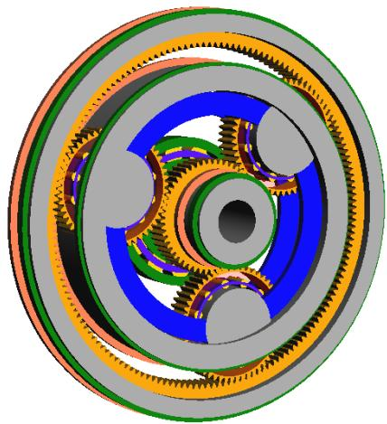

**유성 기어 베어링의 특징**:
- 기어 접촉 하중이 베어링 레이스를 변형시킴
- 레이스 변형이 베어링 요소 간 하중 분포 변경
- 베어링 수명에 직접적 영향

### MASTA의 해석 방법

MASTA는 베어링 유연성을 고려하고 베어링 하중 분포 및 수명에 미치는 영향을 분석하는 기능을 제공합니다.

**구현된 두 가지 방법**:

1. **Harris 해석 방법**
   - Harris의 잘 알려진 방법 기반
   - 유성 기어 세트의 베어링에 특화된 해석 방법
   - 설정이 간단하고 빠른 계산

2. **FE 기반 방법**
   - Imported FE Component 기능 활용
   - 범용적 접근 방법
   - 유성 베어링에 국한되지 않음
   - 하우징에 통합된 베어링 등 임의 형상 모델링 가능

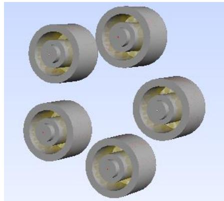

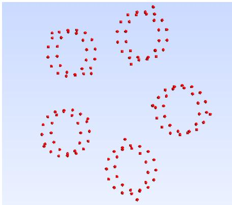

---

## 2. 종합 요약

### ▪ 2.1 교육 자료 핵심 정보

| 항목 | 내용 |
|------|------|
| **소프트웨어** | MASTA (Multi-Axis Simulation Tool) |
| **제공 기업** | SMT (Smart Manufacturing Technology) |
| **주요 목적** | • 베어링 레이스 유연성 해석 • 하중 분포 및 수명 예측 • 유성 기어 베어링 특화 |
| **적용 분야** | • 유성 기어 베어링 • 얇은 레이스 지지 구조 • 하우징 통합 베어링 |
| **해석 방법** | • Harris 해석 방법 (해석적) • FE 기반 방법 (범용) |

-------------

### ▪ 2.2 해석 방법 비교

| 구분 | Harris 해석 방법 | FE 기반 방법 |
|------|---------------|------------|
|| **이론 기반** | Harris의 고전 탄성 이론 Lutz의 영향계수 행렬 | 유한요소 강성 행렬 Imported FE Component |
|| **적용 범위** | 유성 기어 베어링 전용 | 범용 (임의 형상) |
|| **설정 난이도** | 간단 (옵션 선택) | 복잡 (FE 모델 필요) |
|| **계산 속도** | 빠름 | 상대적으로 느림 |
|| **고려 하중** | • 접선 기어력 • 분리력 • 모멘트 | • 모든 하중 조건 • 임의 경계 조건 |
|| **정확도** | 유성 베어링에서 우수 | 모든 경우에 우수 |

-------------

### ▪ 2.3 Harris 해법 특징

| 항목 | 내용 |
|------|------|
|| **기본 가정** | 얇은 원형 링 탄성 이론 |
|| **영향계수** | Lutz의 고전 탄성 해석 |
|| **하중 고려** | • 접선 기어력 (tangential force) • 분리력 (separating force) • 기어 치 모멘트 |
|| **MASTA 구현** | "Include Gear Blank Elastic Distortion?" 옵션 |
|| **개선사항** | 원래 Harris 해법의 대칭 가정 제거 (모든 베어링 요소 고려) |

**처짐 공식**:

$$
\delta_j = \frac{R^3}{\pi E I} q_i \sum_{m=2}^{m=\infty} \frac{\cos(m(\theta_i - \theta_j))}{(m^2 - 1)^2}
$$

**여기서**:
- δⱼ: 각도 위치 θⱼ에서의 처짐
- qᵢ: 각도 위치 θᵢ에서의 수직 하중
- R: 링 평균 반경
- E: 탄성계수
- I: 단면 2차 모멘트

-------------

### ▪ 2.4 FE 기반 해법 특징

| 항목 | 내용 |
|------|------|
|| **FE 모델** | 내륜/외륜 샤프트의 FE 모델 import |
|| **노드 위치** | 베어링 요소와 링 사이 접촉 위치 |
|| **강성 행렬** | 범용 하우징/레이스 형상에 대한 힘-변위 관계 |
|| **시스템 연동** | MASTA 베어링 모델과 연결 System Deflection 계산에 FE 강성 사용 |
|| **반복 계산** | 시스템 모델의 각 반복마다 베어링 하중 분포 계산 |

-------------

### ▪ 2.5 Mignot 검증 케이스 - 베어링 사양

| 항목 | 값 |
|------|-----|
|| **요소 수** | 12개 |
|| **롤러 직경** | 12.5 mm |
|| **롤러 길이** | 40 mm |
|| **반경 내부 간극** | 0 mm |
|| **외륜 단면 2차 모멘트** | 3,081 mm⁴ |
|| **외륜 평균 반경** | 70.5 mm |

-------------

### ▪ 2.6 Mignot 검증 케이스 - 기어 하중 조건

| 항목 | 값 |
|------|-----|
|| **피치 반경** | 79.5 mm |
|| **접선력** | 27,096 N |
|| **분리력** | 9,862 N |
|| **모멘트** | 249,372 N·mm |

-------------

### ▪ 2.7 주요 결과 요약

| 항목 | 결과 |
|------|------|
|| **요소 하중** | • MASTA 해석 방법과 Mignot Modified Harris 모델 우수한 일치 • 해석 방법과 FE 방법 우수한 일치 • 예측 수명 및 안전계수 일치 |
|| **반경 변위** | • 양의 변위 영역에서 우수한 일치 • 음의 변위(분리) 영역에서 차이 • 차이는 비하중 요소 위치로 수명에 영향 없음 |
|| **레이스 변형 효과** | • 특정 방향으로 레이스 평탄화 • 더 많은 요소로 하중 분산 • 하중 분포에 상당한 영향 |

-------------

### ▪ 2.8 실무적 함의

| 영역 | 권장사항 |
|------|---------|
|| **유성 기어 베어링** | • 레이스 유연성 반드시 고려 • Harris 방법으로 빠른 평가 가능 • 정밀 해석 시 FE 방법 활용 |
|| **얇은 레이스 지지** | • 레이스 변형이 수명에 상당한 영향 • 하중 분포 변화 고려 필수 |
|| **해석 방법 선택** | • 유성 베어링: Harris 방법 우선 • 복잡한 형상: FE 방법 필수 • 검증: 두 방법 비교 |

---

## 3. Harris 해법

### 이론적 배경

Harris의 저서 'Rolling Bearing Analysis'에는 유성 기어 내에 장착된 베어링의 레이스 처짐을 고려하는 방법이 설명되어 있습니다.

**Harris가 고려하는 하중**:
- 접선 기어력(tangential gear force)
- 분리 기어력(separating gear force)
- 기어 치에 작용하는 모멘트

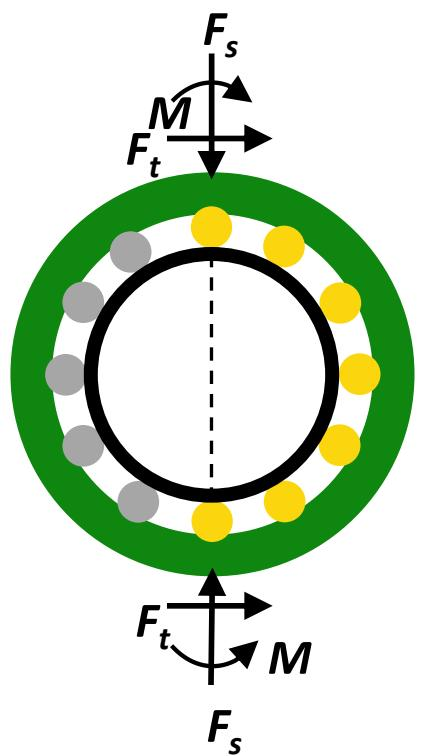

### Lutz의 영향계수 행렬

Harris 해법은 Lutz가 고전 탄성 방법을 통해 계산한 얇은 원형 링(thin circular ring)에 대한 영향계수 행렬을 기반으로 합니다.

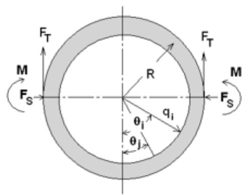

**처짐 공식**:

$$
\delta_j = \frac{R^3}{\pi E I} q_i \sum_{m=2}^{m=\infty} \frac{\cos(m(\theta_i - \theta_j))}{(m^2 - 1)^2}
$$

**물리적 의미**:
- 각도 위치 θᵢ에서 수직 하중 q가 작용할 때
- 각도 위치 θⱼ에서의 처짐 δⱼ를 계산

### MASTA 구현의 개선

**원래 Harris 해법**:
- 하중이 직경을 중심으로 대칭적으로 위치한다고 가정
- 따라서 베어링 요소의 절반만 고려

**MASTA 구현**:
- 일반적으로 유성 베어링의 하중은 요소를 통과하는 직경을 따라 대칭적이지 않음
- MASTA는 이러한 대칭 가정을 하지 않음
- 모든 베어링 요소를 고려하여 더 정확한 해석 수행

### MASTA에서 Harris 해법 설정

유성 기어 베어링 해석에서 Harris 해법은 다음 위치에서 선택합니다:

**옵션 1**: Load Cases and Duty Cycle Mode
**옵션 2**: System Deflection in the Properties Window (Load Case 또는 Duty Cycle 선택 시)

**설정 방법**: "Include Gear Blank Elastic Distortion?" 옵션 선택

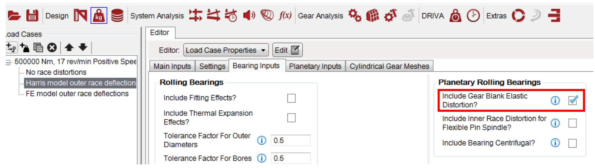

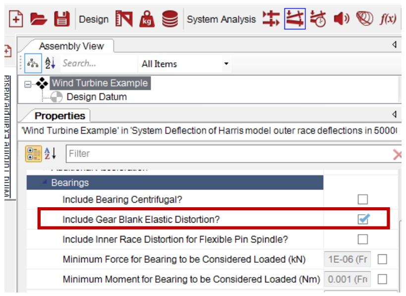

---

## 4. Imported FE Component 해법

### 개요

MASTA의 Imported FE Component 기능을 사용하여 내륜/외륜 샤프트의 FE 모델을 MASTA로 가져올 수 있습니다. 이 FE 모델은 베어링 요소와 링 사이의 접촉 위치에 노드를 포함합니다.

### 작동 원리

**FE 모델 제공 정보**:
- 범용 하우징/레이스 형상에 대한 강성 행렬(stiffness matrix)
- 힘과 처짐의 관계 정의

**시스템 통합**:
1. Imported FE component를 MASTA 베어링 모델에 연결
2. MASTA의 System Deflection 계산에서 FE 강성 사용
3. 시스템 모델의 각 반복(iteration)마다 베어링 하중 분포에 미치는 영향 계산

**추가 문서**: Imported FE Components 설정에 대한 자세한 정보는 MASTA 문서 참조

### 해석 실행 및 결과

**System Deflection 해석**:
- Harris 해법 옵션 선택 또는 FE 모델 포함 시 평소와 같이 실행
- Load Cases 및 Duty Cycles를 쉽게 설정하여 효과 유무 비교 가능
- 베어링 하중 분포 및 수명에 미치는 영향 확인

**추가 결과 (베어링 선택 시)**:
- Bearing Results Tab에서 추가 결과 제공
- Race Deflections (레이스 처짐)
- Race Separations at the elements (요소에서의 레이스 분리)
  - 내륜과 외륜의 상대 중심선 변위 포함

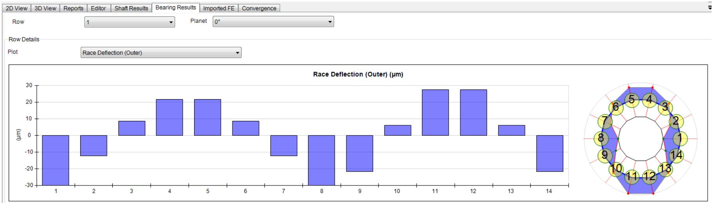

---

## 5. 방법 비교

### 개요

Harris 해법과 Imported FE 해법을 사용한 결과를 MASTA 내에서 비교할 수 있습니다.

### Mignot et al. 연구

Mignot et al.의 논문[3]은 원통형 롤러 베어링과 테이퍼 롤러 베어링 유성 베어링에 대한 외륜 처짐을 다룹니다.

**참고문헌**:
- L. Mignot, L. Bonnard, V. Abousleiman
- "Analysis of Load Distribution in Planet Gear Bearings"
- Gear Technology Magazine (September 2011)

**논문 내용**:
- FE 모델 결과
- Harris 모델을 사용한 레이스 처짐 해석 결과

**비교 데이터**:
1. 레이스 변형 후 요소 하중
2. '링 반경 변위' (레이스가 요소를 침범하는 정도)

이러한 결과는 논문의 확대된 그림에서 수동으로 읽어 비교했습니다.

---

## 6. Mignot 검증 케이스

### 모델 구축

MASTA 모델은 논문과 동일한 파라미터로 직접 비교를 위해 생성되었습니다.

**제공된 정보**:
- 논문에 측정값이 제공되었으나 모든 세부사항이 제공되지는 않음

**누락된 정보**:
- 롤러 프로파일링 세부사항
- 베어링 재료
- 기어 속성

### 베어링 사양

| 항목 | 값 |
|------|-----|
|| 요소 수 | 12 |
|| 롤러 직경 | 12.5 mm |
|| 롤러 길이 | 40 mm |
|| 반경 내부 간극 | 0 mm |
|| 외륜 단면 2차 모멘트 | 3,081 mm⁴ |
|| 외륜 평균 반경 | 70.5 mm |

### 기어 속성

| 항목 | 값 |
|------|-----|
|| 피치 반경 | 79.5 mm |
|| 접선력 | 27,096 N |
|| 분리력 | 9,862 N |
|| 모멘트 | 249,372 N·mm |

### MASTA 모델 설정

**모델 구성**:
- 논문에 제공된 치수에 따라 MASTA 모델 구축
- Imported FE Component를 생성하여 유성 기어 블랭크 표현
- 논문에 명시된 하중에 해당하는 Load Case에 대해 System Deflection 해석 수행

**비교 분석**:
- Imported FE component 포함 해석
- 해석적 방법(Harris) 사용 해석
- 결과 비교

---

## 7. 결과 분석

### ▪ 7.1 MASTA FE 모델 설정

**FE 모델 생성**:
- Mignot 논문에 명시된 외륜(ring) 설계를 CAD로 제작
- ANSYS Workbench로 import

**표면 분할**:
- 링의 내부 표면을 24개의 동일한 크기 패치로 분할
- 요소당 하나의 패치
- 각 요소 사이의 간격을 위한 패치 추가

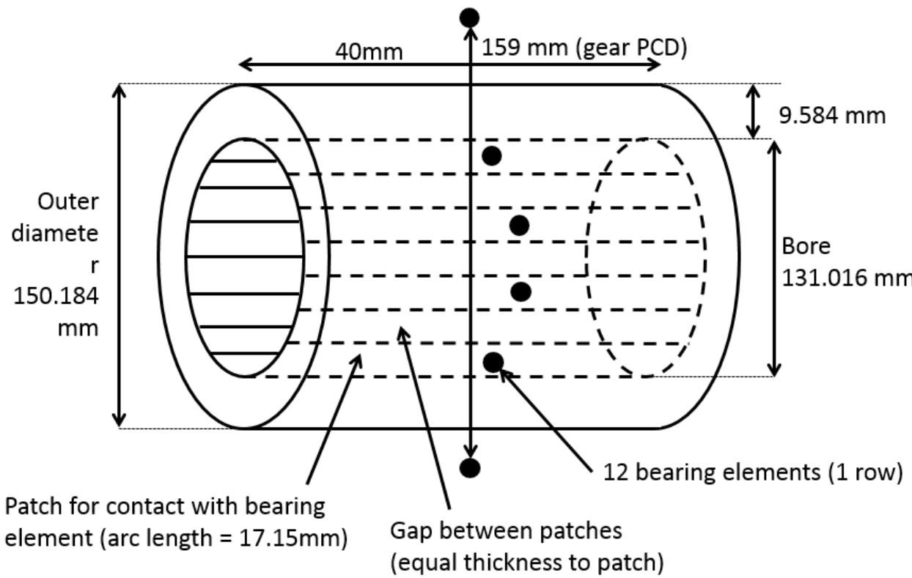

**노드 생성**:
- 기어의 피치 반경에 두 개의 노드 생성
- 기어력의 영향을 고려하기 위함

**강성 감소 및 Import**:
- ANSYS에서 강성 감소(stiffness reduction) 수행
- 강성과 노드 위치를 MASTA로 import

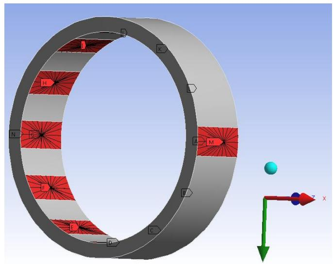

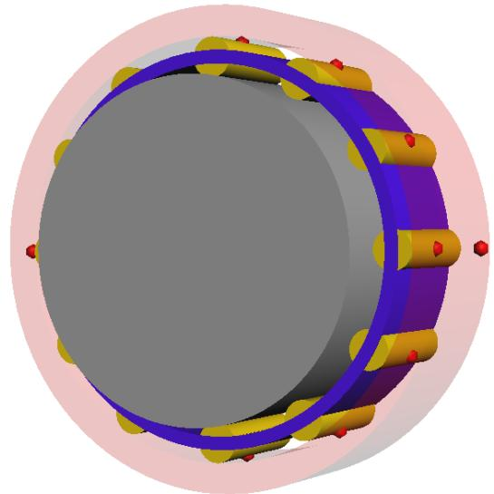

**MASTA 모델 연결**:
- 베어링 요소용 노드를 MASTA 모델의 유성 베어링에 연결
- 기어 메시 노드를 태양 기어와 링 기어에 연결

-------------

### ▪ 7.2 요소 하중 비교

아래 그림은 두 가지 MASTA 방법의 개별 롤링 베어링 요소 하중과 Mignot et al. 논문에 제시된 "Harris Modified" 모델의 결과를 비교한 것입니다.

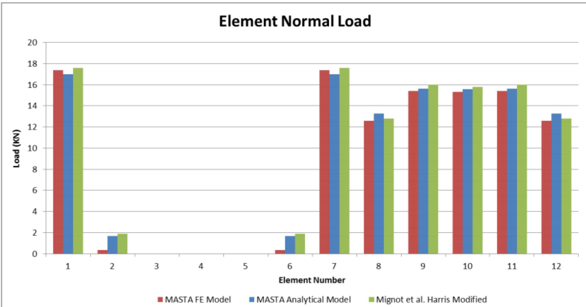

**주요 발견**:

1. **MASTA 해석 모델의 계산 요소 하중**:
   - Mignot Modified Harris 모델의 결과와 우수한 일치
   
2. **해석 모델과 FE 방법**:
   - FE를 사용한 MASTA 해석과도 우수한 일치
   
3. **해석 결과 일치성**:
   - 요소 수직 하중이 우수하게 일치
   - MASTA의 추가 해석 결과(예측 수명, 안전계수)도 해석 방법과 Imported FE 방법 간 우수한 일치
   
4. **Mignot et al. FE 결과**:
   - Mignot et al.이 수행한 FE 해석의 요소 하중도 그들의 해석 모델과 우수한 일치
   - 따라서 MASTA의 모든 결과와도 일치

-------------

### ▪ 7.3 반경 변위 비교

아래 그림은 요소 위치에서 베어링 레이스의 계산된 반경 변위를 비교한 것입니다.

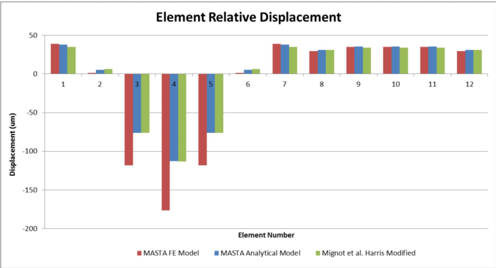

**주요 발견**:

1. **양의 변위 영역**:
   - 요소 위치에서 베어링 레이스의 계산된 반경 변위는 Mignot Modified Harris 모델의 결과와 우수한 일치
   - 해석 모델의 변위는 변위가 양수인 곳에서 FE 모델과 우수한 일치

2. **음의 변위 영역**:
   - 변위가 음수인 곳에서는 MASTA FE 해법과 잘 일치하지 않음
   - 음의 변위는 분리(separation)를 나타냄
   - 요소 하중 차트에서 볼 수 있듯이 이는 요소가 하중을 받지 않는 위치

3. **차이의 원인**:
   - Mignot도 같은 결론에 도달
   - 해석 모델에서 고려되지 않은 인장(tension)과 전단(shear) 효과의 결과로 설명
   - 차이는 요소가 하중을 받지 않는 곳에만 있으므로 베어링 수명에 영향을 미치지 않음

-------------

### ▪ 7.4 레이스 변형 효과

아래 그림은 MASTA 해석 모델의 요소 하중과 레이스 변형을 포함하지 않은 동일한 모델의 요소 하중을 비교한 것입니다.

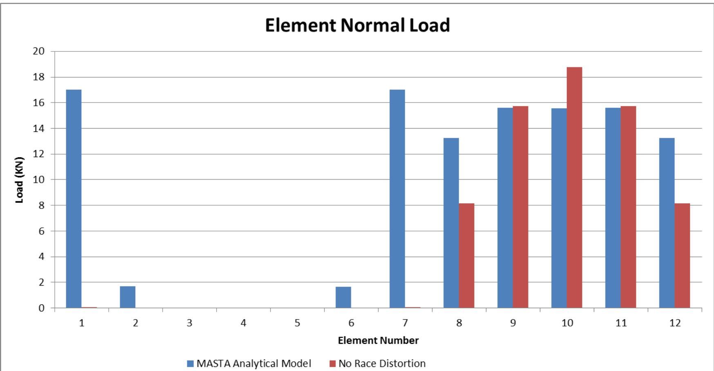

**레이스 변형 효과**:

이 경우 레이스 변형 효과를 포함하면 요소 간 하중 분포에 상당한 영향을 미칩니다.

**하중 분포 메커니즘**:
- 레이스 변형은 특정 방향으로 레이스를 평탄화(flatten)
- 요소 간 하중 분산으로 이어짐
- 더 많은 요소가 하중을 받게 됨

**시각적 비교**:

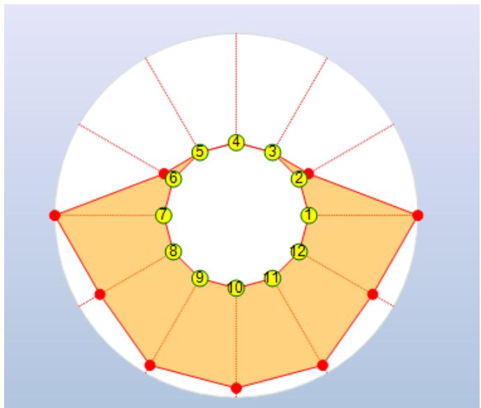  
*MASTA 해석 모델*

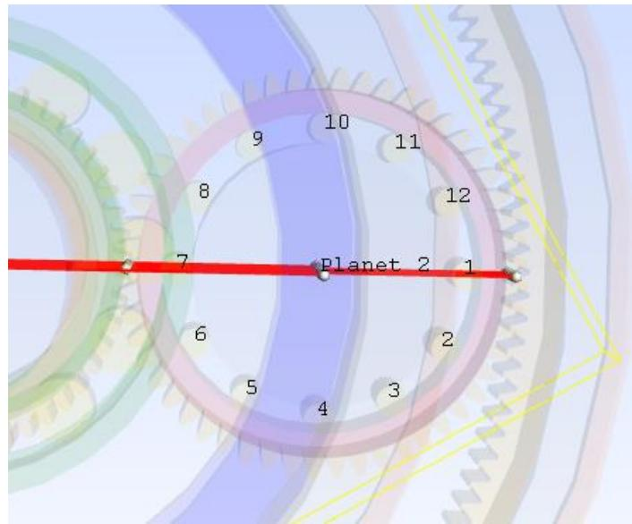  
*기어 접촉은 요소 1 & 7에 위치*

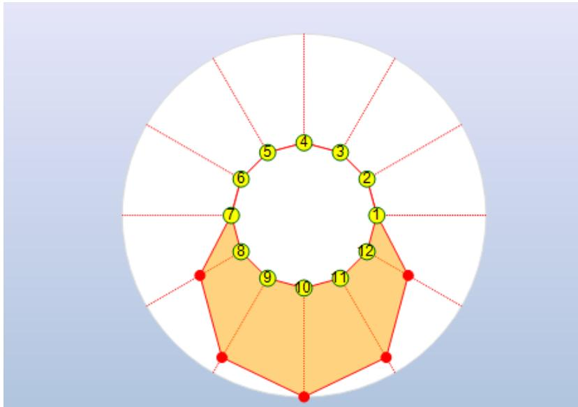  
*레이스 변형 없음*

**주요 관찰**:
- 레이스 변형을 고려하면 하중이 더 많은 요소에 분산
- 최대 요소 하중 감소
- 베어링 수명 증가 가능

---

## 8. 결론

### MASTA의 두 가지 해석 방법

MASTA는 베어링 레이스 유연성을 고려하는 두 가지 방법을 제공합니다:

**1. 해석적 방법 (Harris 방법)**:
- Harris의 잘 알려진 방법을 기반으로 유성 베어링용
- 해석에 포함하기 매우 간단
- 빠른 계산 속도

**2. Imported FE Components 방법**:
- 설정이 덜 간단하지만 접근 방법이 훨씬 범용적
- 하우징에 통합된 것과 같은 임의 형상의 베어링 레이스 모델링 가능

### 검증 결과

**방법 간 비교**:
- 두 방법이 모두 적용 가능한 경우 서로 간 비교 결과 우수한 일치
- 문헌에 제시된 결과와도 우수한 일치

**정확도**:
- Mignot et al.의 연구 결과와 일치
- 요소 하중 분포 정확히 예측
- 반경 변위도 양의 변위 영역에서 정확

### 실무적 중요성

**레이스 변형의 영향**:
- 베어링 레이스 지지부가 상대적으로 얇은 특정 경우
- 레이스 처짐이 베어링 하중 및 수명에 상당한 영향 가능

**권장사항**:
1. 유성 기어 베어링: Harris 방법으로 빠른 평가
2. 복잡한 형상: FE 기반 방법 사용
3. 얇은 레이스 지지 구조: 반드시 유연성 고려
4. 검증: 가능하면 두 방법 비교

---

## 9. 참고문헌

### 주요 참고문헌

[1] **Harris, T. A.**  
*Rolling Bearing Analysis (fourth edition)*  
Wiley and Sons, 2001

[2] **Mignot, L., Bonnard, L., Abousleiman, V.**  
*Analysis of Load Distribution in Planet Gear Bearings*  
Gear Technology Magazine, September 2011

### 관련 이론

[3] **Lutz**  
Classical elasticity methods for thin circular ring  
(Harris의 저서에서 참조)

### MASTA 문서

**SMT (Smart Manufacturing Technology)**  
MASTA Software Documentation  
Imported FE Components User Guide

---

## 부록: SMT 연락처

**SMT 본사 (Nottingham HQ & Testing Facility)**

**주소**:  
CHARTWELL HOUSE, 67-69 HOUNDS GATE  
NOTTINGHAM, UK  
NG1 6BB

**연락처**:  
전화: +44 (0) 115 941 9839  
팩스: +44 (0) 115 958 1583  
웹사이트: www.smartmt.com

### 글로벌 오피스

**SMT LLC - North America**

**SMT Portugal**

**SMT China - Beijing**

**SMT China - Shanghai**

**SMT Japan**

---

**문서 작성일**: 2025-01-26  
**원본 출처**: SMT MASTA Training Materials  
**정리**: ISO 17956:2025 양식 기반

---

**끝**

